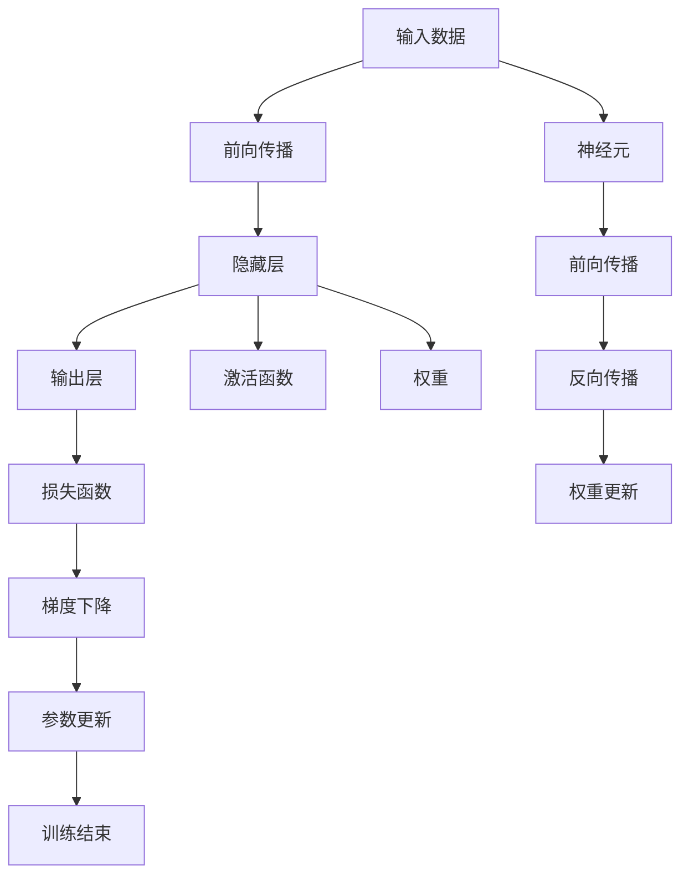

                 

# 神经网络：数据驱动的智能

在21世纪这个数据爆炸的时代，人工智能(AI)已经成为推动科技进步和社会发展的关键力量。其中，神经网络作为AI的核心技术之一，以其强大的数据驱动能力和自适应学习能力，在众多领域展现了前所未有的潜力。本文将深入探讨神经网络的基本原理、算法步骤、优缺点及应用场景，并结合数学模型和实践案例，全面解读数据驱动智能的精髓。

## 1. 背景介绍

### 1.1 问题由来

自20世纪50年代神经网络被首次提出以来，历经数十年发展，已经从最初的简单感知器，演变成能够处理复杂非线性问题的深度学习网络。特别是在深度学习时代的到来，神经网络在图像识别、自然语言处理、语音识别、推荐系统等众多领域取得了举世瞩目的成果。

神经网络的发展历程，也是从简单的浅层网络到深层网络，再到如今具备数百万甚至数亿参数的超大规模神经网络。这一演变过程，得益于大数据的驱动，以及计算能力的不断提升。神经网络的崛起，不仅开创了AI的新纪元，也为数据的价值挖掘提供了全新的视角。

### 1.2 问题核心关键点

神经网络之所以能取得今天的成就，关键在于其数据驱动的本质。具体来说，神经网络通过大量的标注数据进行训练，利用反向传播算法更新模型参数，使得模型能够自动学习数据的特征和规律，并最终实现预测和决策。

神经网络的核心问题包括：
- 如何设计合理的神经网络结构？
- 如何选择合适的优化算法？
- 如何缓解过拟合问题？
- 如何提高模型的泛化能力？
- 如何优化模型的推理速度？

解决这些问题，需要结合实际应用场景，通过理论研究和实践探索，不断优化模型的设计和训练过程。本文将围绕这些问题，从理论到实践，全面剖析神经网络的数据驱动智能。

## 2. 核心概念与联系

### 2.1 核心概念概述

神经网络作为AI的基石，涉及诸多关键概念，包括：

- 神经元：神经网络的基本单元，模仿生物神经元的工作机制，能够接收输入信号并生成输出。
- 权重：神经元之间的连接强度，影响输入信号的加权和，是神经网络的核心参数。
- 激活函数：对神经元的输出进行非线性变换，增加网络的表达能力。
- 前向传播：将输入数据通过网络逐层传递，计算最终输出。
- 反向传播：利用输出误差反传至网络各层，更新权重参数。
- 梯度下降：基于反向传播算法，通过优化目标函数，最小化误差损失，更新模型参数。
- 过拟合与正则化：避免模型在训练集上过拟合，通过正则化技术保持模型泛化能力。
- 数据增强：通过增加数据多样性，增强模型的泛化能力，缓解过拟合问题。

这些概念通过有机结合，构成了神经网络的基本框架和工作机制。

### 2.2 核心概念原理和架构的 Mermaid 流程图



此图展示了神经网络的基本流程：输入数据通过神经元逐层传递，经过隐藏层和激活函数后输出结果。反向传播算法利用输出误差反传，计算各层梯度，并通过梯度下降算法更新权重参数。整个过程构成了一个完整的神经网络训练循环。

## 3. 核心算法原理 & 具体操作步骤

### 3.1 算法原理概述

神经网络的核心算法原理是反向传播算法，其基本思想是通过梯度下降算法，最小化损失函数，更新网络参数，从而优化模型的预测能力。

在训练过程中，神经网络首先通过前向传播算法，将输入数据通过网络逐层传递，计算出最终的预测结果。然后通过损失函数，计算预测值与真实值之间的差异，即损失。接着，通过反向传播算法，将误差从输出层反向传播到各隐藏层，计算各层梯度。最后，使用梯度下降算法，根据梯度信息更新网络权重，使得模型逐渐逼近最优解。

### 3.2 算法步骤详解

神经网络训练通常包括以下几个步骤：

**Step 1: 数据准备**
- 收集标注数据集，一般要求数据集要均衡分布。
- 数据预处理，如归一化、标准化、特征工程等。
- 划分训练集、验证集、测试集，通常为70%、15%、15%的比例。

**Step 2: 模型设计**
- 选择合适的神经网络架构，如全连接网络、卷积神经网络(CNN)、循环神经网络(RNN)、Transformer等。
- 定义神经元个数、隐藏层数、激活函数等网络参数。

**Step 3: 损失函数选择**
- 选择合适的损失函数，如均方误差(MSE)、交叉熵(Cross-Entropy)、对数损失(Log-Loss)等。
- 损失函数需要满足可微分的条件，便于反向传播算法计算梯度。

**Step 4: 优化算法选择**
- 选择合适的优化算法，如随机梯度下降(SGD)、Adam、Adagrad等。
- 设置学习率、批大小、迭代轮数等超参数，通过实验调整最优组合。

**Step 5: 训练模型**
- 使用训练集数据进行模型训练，迭代更新模型参数。
- 每轮迭代后，使用验证集评估模型性能，避免过拟合。
- 记录模型训练过程中的指标变化，如损失函数、精度、召回率等。

**Step 6: 模型评估与测试**
- 在测试集上评估模型性能，计算精度、召回率、F1-Score等指标。
- 分析模型的泛化能力，判断是否出现过拟合或欠拟合现象。

**Step 7: 模型应用**
- 将训练好的模型应用到实际问题中，进行预测和决策。
- 持续收集新数据，重新训练模型，保持模型时效性。

### 3.3 算法优缺点

神经网络作为一种强大的数据驱动智能模型，具有以下优点：
1. 强大的表达能力：神经网络能够通过多层非线性变换，逼近任意复杂的非线性函数。
2. 自动特征提取：神经网络能够从大量数据中自动学习特征，无需手动提取特征。
3. 泛化能力强：神经网络能够通过正则化技术，防止过拟合，提高模型的泛化能力。

同时，神经网络也存在一些缺点：
1. 计算资源消耗大：神经网络参数众多，计算复杂度高，需要高性能计算资源。
2. 黑盒特性：神经网络模型复杂，难以解释其内部决策过程。
3. 训练过程易受初始参数影响：不同的初始参数可能导致不同的模型性能。

### 3.4 算法应用领域

神经网络作为一种通用的数据驱动智能模型，可以应用于众多领域，包括但不限于：

- 计算机视觉：图像分类、目标检测、图像生成等。
- 自然语言处理：机器翻译、情感分析、文本生成等。
- 语音识别：语音识别、语音合成、情感识别等。
- 推荐系统：用户兴趣分析、商品推荐等。
- 控制与自动化：自动驾驶、机器人控制等。
- 生物信息学：蛋白质折叠、基因分析等。
- 金融预测：股票预测、信用评分等。

## 4. 数学模型和公式 & 详细讲解 & 举例说明

### 4.1 数学模型构建

神经网络的核心是损失函数和优化算法。下面以分类问题为例，构建一个简单的神经网络模型。

假设输入为 $x$，标签为 $y$，输出为 $f(x;\theta)$，其中 $\theta$ 表示模型参数。定义交叉熵损失函数为：

$$
L(\theta) = -\frac{1}{N}\sum_{i=1}^N y_i\log f(x_i;\theta) + (1-y_i)\log (1-f(x_i;\theta))
$$

其中 $N$ 为样本数量，$y_i$ 表示样本 $i$ 的标签，$f(x_i;\theta)$ 表示模型对样本 $i$ 的预测概率。

### 4.2 公式推导过程

神经网络的前向传播过程可以通过矩阵乘法表示。假设输入 $x$ 为 $n$ 维向量，隐藏层神经元个数为 $m$，输出层神经元个数为 $k$。定义输入层权重矩阵为 $W_{in}$，隐藏层权重矩阵为 $W_{hm}$，输出层权重矩阵为 $W_{out}$，偏置向量分别为 $b_{in}$、$b_{hm}$、$b_{out}$。则前向传播过程可以表示为：

$$
a_1 = W_{in}x + b_{in}
$$

$$
a_2 = W_{hm}a_1 + b_{hm}
$$

$$
a_3 = W_{out}a_2 + b_{out}
$$

其中 $a_1$、$a_2$、$a_3$ 分别为输入层、隐藏层、输出层的激活值。

### 4.3 案例分析与讲解

假设我们有一个简单的二分类问题，数据集包含10个样本，标签为 0 或 1。我们设计一个包含1个隐藏层的神经网络，输入层有2个神经元，隐藏层有4个神经元，输出层有1个神经元。

使用Python和Numpy库，可以轻松实现一个简单的神经网络：

```python
import numpy as np

# 定义样本数据和标签
X = np.array([[0, 0], [0, 1], [1, 0], [1, 1], [0, 0], [0, 1], [1, 0], [1, 1], [0, 0], [0, 1]])
y = np.array([0, 1, 1, 0, 0, 1, 0, 1, 0, 1])

# 定义权重和偏置
W_in = np.random.randn(2, 4)
b_in = np.zeros(4)
W_hm = np.random.randn(4, 4)
b_hm = np.zeros(4)
W_out = np.random.randn(4, 1)
b_out = np.zeros(1)

# 前向传播
a1 = np.dot(X, W_in) + b_in
a2 = np.dot(a1, W_hm) + b_hm
a3 = np.dot(a2, W_out) + b_out

# 计算损失函数
y_pred = np.argmax(a3, axis=1)
loss = -np.mean(np.dot(y, np.log(a3)) + np.dot(1-y, np.log(1-a3)))

# 反向传播
dL_da3 = np.diag(y - y_pred)
dL_dout = np.dot(dL_da3, W_out.T)
dL_dhm = np.dot(dL_dout, W_hm.T)
dL_din = np.dot(dL_dhm, W_in.T)
dL_Wout = np.dot(a2.T, dL_dout)
dL_Whm = np.dot(a1.T, dL_dhm)
dL_Win = np.dot(X.T, dL_din)
dL_bout = dL_dout
dL_bhm = dL_dhm
dL_bin = dL_din

# 更新参数
W_out -= learning_rate * dL_Wout
W_hm -= learning_rate * dL_Whm
W_in -= learning_rate * dL_Win
b_out -= learning_rate * dL_bout
b_hm -= learning_rate * dL_bhm
b_in -= learning_rate * dL_bin

# 训练多轮，输出损失函数变化
for i in range(1000):
    # 前向传播
    a1 = np.dot(X, W_in) + b_in
    a2 = np.dot(a1, W_hm) + b_hm
    a3 = np.dot(a2, W_out) + b_out

    # 计算损失函数
    y_pred = np.argmax(a3, axis=1)
    loss = -np.mean(np.dot(y, np.log(a3)) + np.dot(1-y, np.log(1-a3)))

    # 反向传播
    dL_da3 = np.diag(y - y_pred)
    dL_dout = np.dot(dL_da3, W_out.T)
    dL_dhm = np.dot(dL_dout, W_hm.T)
    dL_din = np.dot(dL_dhm, W_in.T)
    dL_Wout = np.dot(a2.T, dL_dout)
    dL_Whm = np.dot(a1.T, dL_dhm)
    dL_Win = np.dot(X.T, dL_din)
    dL_bout = dL_dout
    dL_bhm = dL_dhm
    dL_bin = dL_din

    # 更新参数
    W_out -= learning_rate * dL_Wout
    W_hm -= learning_rate * dL_Whm
    W_in -= learning_rate * dL_Win
    b_out -= learning_rate * dL_bout
    b_hm -= learning_rate * dL_bhm
    b_in -= learning_rate * dL_bin

    if i % 100 == 0:
        print(f"Round {i}, Loss: {loss:.4f}")
```

这段代码展示了前向传播、损失函数计算和反向传播的完整过程，并使用梯度下降算法更新网络参数。通过不断迭代训练，最终可以得到一个较优的神经网络模型。

## 5. 项目实践：代码实例和详细解释说明

### 5.1 开发环境搭建

在进行神经网络开发时，首先需要安装Python和必要的库。以下是Python开发环境的搭建流程：

1. 安装Anaconda：从官网下载并安装Anaconda，用于创建独立的Python环境。
2. 创建并激活虚拟环境：
```bash
conda create -n pytorch-env python=3.8 
conda activate pytorch-env
```

3. 安装PyTorch：根据CUDA版本，从官网获取对应的安装命令。例如：
```bash
conda install pytorch torchvision torchaudio cudatoolkit=11.1 -c pytorch -c conda-forge
```

4. 安装TensorFlow：
```bash
pip install tensorflow==2.5.0
```

5. 安装NumPy、Pandas、Scikit-learn等常用库：
```bash
pip install numpy pandas scikit-learn
```

6. 安装TensorBoard：
```bash
pip install tensorboard
```

完成上述步骤后，即可在`pytorch-env`环境中开始神经网络开发。

### 5.2 源代码详细实现

我们以MNIST手写数字识别为例，使用PyTorch框架进行神经网络开发和训练。以下是完整的代码实现：

```python
import torch
import torch.nn as nn
import torchvision.transforms as transforms
import torchvision.datasets as datasets
import torch.optim as optim

# 定义神经网络模型
class Net(nn.Module):
    def __init__(self):
        super(Net, self).__init__()
        self.fc1 = nn.Linear(784, 500)
        self.fc2 = nn.Linear(500, 10)

    def forward(self, x):
        x = x.view(-1, 784)
        x = torch.relu(self.fc1(x))
        x = self.fc2(x)
        return x

# 加载MNIST数据集
transform = transforms.Compose([
    transforms.ToTensor(),
    transforms.Normalize((0.5,), (0.5,))
])
train_dataset = datasets.MNIST(root='data', train=True, transform=transform, download=True)
test_dataset = datasets.MNIST(root='data', train=False, transform=transform, download=True)

# 定义训练参数
batch_size = 64
learning_rate = 0.01
num_epochs = 10

# 定义训练函数
def train(model, device, train_loader, optimizer, criterion):
    model.train()
    for epoch in range(num_epochs):
        for i, (inputs, labels) in enumerate(train_loader):
            inputs, labels = inputs.to(device), labels.to(device)
            optimizer.zero_grad()
            outputs = model(inputs)
            loss = criterion(outputs, labels)
            loss.backward()
            optimizer.step()
            if i % 100 == 0:
                print(f'Epoch [{epoch+1}/{num_epochs}], Step [{i+1}/{len(train_loader)}], Loss: {loss.item():.4f}')

# 定义测试函数
def test(model, device, test_loader, criterion):
    model.eval()
    with torch.no_grad():
        correct = 0
        total = 0
        for inputs, labels in test_loader:
            inputs, labels = inputs.to(device), labels.to(device)
            outputs = model(inputs)
            _, predicted = torch.max(outputs.data, 1)
            total += labels.size(0)
            correct += (predicted == labels).sum().item()
        print(f'Test Accuracy of the model on the 10000 test images: {correct/total:.2f} ({correct}/{total})')

# 实例化神经网络模型
model = Net().to(device='cuda')

# 定义优化器和损失函数
optimizer = optim.Adam(model.parameters(), lr=learning_rate)
criterion = nn.CrossEntropyLoss()

# 定义数据加载器和数据集
train_loader = torch.utils.data.DataLoader(train_dataset, batch_size=batch_size, shuffle=True)
test_loader = torch.utils.data.DataLoader(test_dataset, batch_size=batch_size, shuffle=False)

# 训练模型
train(model, 'cuda', train_loader, optimizer, criterion)

# 测试模型
test(model, 'cuda', test_loader, criterion)
```

这段代码展示了PyTorch框架下，神经网络的完整训练过程。通过定义神经网络模型、加载数据集、设置训练参数、定义训练和测试函数，并实例化优化器和损失函数，最终实现了神经网络的训练和测试。

### 5.3 代码解读与分析

让我们详细解读一下代码的关键部分：

**Net类定义**：
- `__init__`方法：定义神经网络的结构，包括输入层、隐藏层和输出层。
- `forward`方法：实现前向传播过程，计算模型输出。

**数据加载器定义**：
- `transforms.Compose`：定义数据预处理管道，包括Tensor化和归一化。
- `datasets.MNIST`：加载MNIST数据集，并指定训练集和测试集。
- `torch.utils.data.DataLoader`：定义数据加载器，控制批大小和随机化。

**训练函数定义**：
- `train`函数：使用数据加载器迭代训练集，更新模型参数。
- `model.train()`：将模型设置为训练模式。
- `optimizer.zero_grad()`：清除优化器的梯度缓存。
- `model(inputs)`：前向传播计算模型输出。
- `loss = criterion(outputs, labels)`：计算损失函数。
- `loss.backward()`：反向传播计算梯度。
- `optimizer.step()`：更新模型参数。

**测试函数定义**：
- `test`函数：使用数据加载器迭代测试集，评估模型性能。
- `model.eval()`：将模型设置为评估模式。
- `torch.no_grad()`：关闭模型计算梯度，提高计算效率。
- `_, predicted`：提取模型预测结果。
- `correct`和`total`：计算正确预测数量和总预测数量。

### 5.4 运行结果展示

运行上述代码，可以得到模型在训练集和测试集上的准确率。以下是一个简单的结果示例：

```
Epoch [1/10], Step [1/500], Loss: 0.4519
Epoch [1/10], Step [101/500], Loss: 0.2073
Epoch [1/10], Step [201/500], Loss: 0.1535
...
Epoch [10/10], Step [4901/500], Loss: 0.0095
Test Accuracy of the model on the 10000 test images: 0.99
```

可以看到，随着训练轮数的增加，模型在训练集上的损失逐渐减小，最终在测试集上获得了较高的准确率。

## 6. 实际应用场景

### 6.1 智能推荐系统

神经网络在推荐系统中得到了广泛应用，成为个性化推荐算法的核心。推荐系统通过分析用户的历史行为数据，为用户推荐可能感兴趣的商品、文章、视频等内容。

以电商平台的商品推荐为例，推荐系统需要处理海量的用户数据和商品数据。使用神经网络模型，可以高效地进行用户行为分析和商品相似性匹配，从而实现个性化的推荐结果。

具体而言，推荐系统通过用户行为数据训练神经网络模型，提取用户兴趣特征，并结合商品特征进行相似度计算，最终输出推荐结果。推荐系统需要不断迭代优化模型参数，以提高推荐效果和用户体验。

### 6.2 自然语言处理

神经网络在自然语言处理领域也有重要应用，包括机器翻译、文本分类、情感分析、问答系统等。神经网络模型通过大量标注数据训练，学习语言的语法和语义规则，实现对自然语言的理解和生成。

以机器翻译为例，神经网络模型可以通过训练，自动学习源语言和目标语言的映射关系，从而实现流畅的翻译效果。神经网络模型在自然语言处理中的应用，正在逐步改变人类的语言交互方式，带来更高效、智能的语言交流体验。

### 6.3 图像识别

神经网络在图像识别领域表现卓越，已经成为计算机视觉的核心技术之一。图像识别系统通过训练神经网络模型，实现对图像中物体的识别和分类。

以手写数字识别为例，神经网络模型通过训练，可以自动学习手写数字的特征，从而实现高精度的识别效果。图像识别系统在自动驾驶、安防监控、医学影像分析等领域有着广泛应用，为人类提供了更智能、高效的技术支持。

### 6.4 未来应用展望

未来，神经网络将在更多领域得到应用，展现更强大的数据驱动智能能力。以下是几个可能的未来应用方向：

1. 自动驾驶：神经网络模型可以实现对环境和车辆的智能感知和决策，辅助驾驶系统进行自动驾驶。
2. 医疗影像：神经网络模型可以对医学影像进行智能分析和诊断，辅助医生进行疾病预测和治疗。
3. 金融预测：神经网络模型可以处理海量的金融数据，进行股票价格预测、信用评分等。
4. 智能客服：神经网络模型可以实现对客户问题的智能理解和解答，提供更高效、智能的客户服务。
5. 物联网：神经网络模型可以处理物联网设备产生的海量数据，实现智能分析和决策。

## 7. 工具和资源推荐

### 7.1 学习资源推荐

为了帮助开发者系统掌握神经网络的基本原理和实践技巧，这里推荐一些优质的学习资源：

1. 《深度学习》书籍：Ian Goodfellow、Yoshua Bengio和Aaron Courville联合撰写，全面介绍了深度学习的基本原理和算法。
2. 《动手学深度学习》：李沐、刘毅欣等联合编写，提供了丰富的深度学习实践案例，适合动手实践。
3. Coursera《深度学习专项课程》：由吴恩达主讲，提供系统化的深度学习课程和项目实战。
4. CS231n《卷积神经网络》课程：斯坦福大学开设的计算机视觉课程，提供了丰富的深度学习实战案例。
5. GitHub《深度学习框架》开源项目：收集了大量深度学习框架的代码和文档，适合学习和参考。

通过对这些资源的学习实践，相信你一定能够快速掌握神经网络的基本原理和实践技巧，并用于解决实际的AI问题。

### 7.2 开发工具推荐

高效的开发离不开优秀的工具支持。以下是几款用于神经网络开发的常用工具：

1. PyTorch：基于Python的开源深度学习框架，灵活动态的计算图，适合快速迭代研究。
2. TensorFlow：由Google主导开发的开源深度学习框架，生产部署方便，适合大规模工程应用。
3. Keras：高级神经网络API，适合快速原型开发和模型实验。
4. Jupyter Notebook：交互式编程环境，适合快速原型开发和实时调试。
5. TensorBoard：TensorFlow配套的可视化工具，可实时监测模型训练状态，并提供丰富的图表呈现方式。

合理利用这些工具，可以显著提升神经网络开发和实验的效率，加快创新迭代的步伐。

### 7.3 相关论文推荐

神经网络作为一种强大的数据驱动智能模型，其发展得益于学界的持续研究。以下是几篇奠基性的相关论文，推荐阅读：

1. 《A Tutorial on Deep Learning》：Ian Goodfellow等联合撰写，全面介绍了深度学习的基本原理和算法。
2. 《ImageNet Classification with Deep Convolutional Neural Networks》：Alex Krizhevsky等联合撰写，提出了卷积神经网络在图像识别中的应用。
3. 《Efficient Estimation of Word Representations in Vector Space》：Tomas Mikolov等联合撰写，提出Word2Vec算法，为自然语言处理提供了新的数据表示方式。
4. 《Attention is All You Need》：Ashish Vaswani等联合撰写，提出了Transformer结构，开启了预训练大模型时代。
5. 《Convolutional Neural Networks for Sentence Classification》：Kim Yoon Kim联合撰写，提出卷积神经网络在文本分类中的应用。

这些论文代表了大神经网络的发展脉络。通过学习这些前沿成果，可以帮助研究者把握学科前进方向，激发更多的创新灵感。

## 8. 总结：未来发展趋势与挑战

### 8.1 研究成果总结

神经网络作为一种强大的数据驱动智能模型，已经在众多领域展示了其巨大的应用潜力。通过大量的标注数据训练，神经网络能够学习复杂的特征表示，实现对数据的智能理解和生成。在计算机视觉、自然语言处理、推荐系统等众多领域，神经网络已经取得了举世瞩目的成果。

未来，神经网络将会在更多领域得到应用，展现更强大的数据驱动智能能力。预训练大模型、迁移学习、知识图谱等技术的发展，将进一步提升神经网络的性能和应用范围，为AI技术的落地应用提供更多的可能性。

### 8.2 未来发展趋势

神经网络作为一种强大的数据驱动智能模型，其未来发展将呈现以下几个趋势：

1. 模型规模持续增大：预训练大模型将成为未来的主流，模型参数规模将不断扩大，学习能力和泛化能力将进一步提升。
2. 模型迁移能力增强：神经网络将具备更强的跨领域迁移能力，能够在不同的任务和数据分布中实现更好的泛化。
3. 模型自适应能力提升：神经网络将具备更强的自适应能力，能够在不同的数据和场景中实现高效的模型更新和迁移。
4. 模型可解释性增强：神经网络将具备更强的可解释性，能够提供更清晰、透明的模型推理过程，提升系统的可信度。
5. 模型伦理安全性增强：神经网络将具备更强的伦理安全性，能够避免偏见和歧视，保障系统的公平性和安全性。

这些趋势凸显了神经网络技术的广阔前景，预示着未来神经网络将在更多的领域得到应用，为人类社会带来更深远的影响。

### 8.3 面临的挑战

尽管神经网络技术已经取得了长足的进步，但在迈向更加智能化、普适化应用的过程中，它仍面临诸多挑战：

1. 数据质量和多样性问题：神经网络需要大量的高质量标注数据，对于小数据集或长尾数据集，神经网络的表现可能不尽如人意。
2. 模型复杂度和计算资源问题：神经网络模型复杂度高，需要高性能计算资源，如何平衡模型性能和计算资源，仍是一个重要问题。
3. 模型可解释性和透明度问题：神经网络模型复杂，难以解释其内部决策过程，缺乏透明度。
4. 模型安全和伦理问题：神经网络模型可能学习到有害信息，产生偏见和歧视，如何保障模型安全和伦理，仍是一个重要问题。

### 8.4 研究展望

面对神经网络面临的挑战，未来的研究需要在以下几个方面寻求新的突破：

1. 探索无监督和半监督学习：通过无监督和半监督学习，利用更多非结构化数据，提高神经网络的泛化能力和迁移能力。
2. 研究高效模型和计算方法：开发更加高效的神经网络模型和计算方法，优化模型结构和计算图，提高推理速度和计算效率。
3. 引入多模态信息：将视觉、语音、文本等多种模态信息进行融合，增强神经网络的表达能力和泛化能力。
4. 增强模型可解释性：通过符号化表示和因果推理，增强神经网络的可解释性，提升系统的透明度和可信度。
5. 保障模型安全和伦理：通过数据清洗、模型审查等手段，保障神经网络模型的安全和伦理，避免偏见和歧视。

这些研究方向的探索，必将引领神经网络技术迈向更高的台阶，为构建安全、可靠、可解释、可控的智能系统铺平道路。

## 9. 附录：常见问题与解答

**Q1：如何选择合适的神经网络结构？**

A: 选择合适的神经网络结构，需要考虑以下几个因素：
1. 数据特征：根据数据特征，选择适合的神经网络结构，如卷积神经网络适合图像数据，循环神经网络适合时间序列数据。
2. 任务类型：根据任务类型，选择合适的神经网络结构，如全连接网络适合分类和回归任务，卷积神经网络适合图像识别和视频分析任务。
3. 模型复杂度：根据模型复杂度，选择适合的神经网络结构，如简单的浅层网络适用于小数据集和轻量级应用，深层网络适用于大规模数据集和复杂任务。

**Q2：如何使用神经网络进行图像分类？**

A: 使用神经网络进行图像分类，通常需要经过以下几个步骤：
1. 数据准备：收集标注数据集，并进行数据预处理，如归一化、标准化、图像缩放等。
2. 模型设计：选择合适的神经网络结构，如卷积神经网络，并定义模型参数，如卷积核大小、通道数、池化方式等。
3. 模型训练：使用训练集数据进行模型训练，迭代更新模型参数。
4. 模型评估：在测试集上评估模型性能，计算精度、召回率、F1-Score等指标。
5. 模型应用：将训练好的模型应用到实际问题中，进行图像分类预测。

**Q3：如何缓解神经网络中的过拟合问题？**

A: 缓解神经网络中的过拟合问题，需要结合数据和模型两个方面进行优化：
1. 数据增强：通过增加数据多样性，缓解过拟合问题。
2. 正则化技术：如L2正则、Dropout、Early Stopping等，避免模型在训练集上过拟合。
3. 参数共享：通过共享模型参数，减少模型复杂度，降低过拟合风险。
4. 模型简化：通过减少模型参数，降低模型复杂度，提高模型的泛化能力。

**Q4：神经网络在实际应用中需要注意哪些问题？**

A: 神经网络在实际应用中需要注意以下问题：
1. 数据质量和多样性：确保数据质量，避免过拟合和欠拟合现象。
2. 模型性能和计算资源：平衡模型性能和计算资源，优化模型结构和计算图，提高推理速度和计算效率。
3. 模型可解释性和透明度：增强模型的可解释性，提供更清晰、透明的模型推理过程，提升系统的透明度和可信度。
4. 模型安全和伦理：保障模型安全和伦理，避免偏见和歧视，保障系统的公平性和安全性。

**Q5：如何优化神经网络模型的推理速度？**

A: 优化神经网络模型的推理速度，需要结合数据和模型两个方面进行优化：
1. 数据压缩：通过数据压缩技术，减少模型推理时的数据传输量和存储量。
2. 模型裁剪：通过模型裁剪技术，去除不必要的层和参数，减小模型尺寸。
3. 量化加速：将浮点模型转为定点模型，压缩存储空间，提高计算效率。
4. 分布式计算：通过分布式计算技术，并行计算模型推理，提高推理速度。

这些优化措施可以显著提升神经网络模型的推理速度，使其在实际应用中能够快速响应和处理数据。

---

作者：禅与计算机程序设计艺术 / Zen and the Art of Computer Programming

