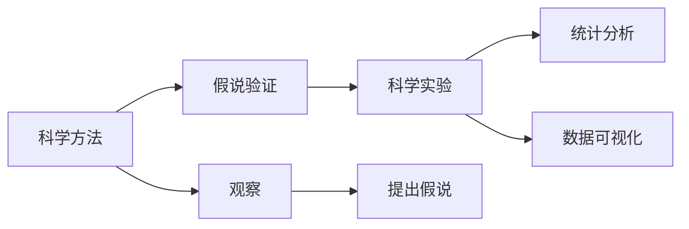

                 

# 科学探究：从假说到真理

> 关键词：科学方法, 探究真理, 假说验证, 科学实验, 统计分析, 数据可视化, 科学哲学

## 1. 背景介绍

科学探究的本质是揭示自然界和人类社会中的真理。从古希腊哲学家亚里士多德到现代物理学巨匠爱因斯坦，科学家们通过观察、实验和逻辑推理，不断深化对世界的认识，推动知识的进步。在信息技术领域，科学探究同样至关重要，尤其是在软件开发、算法设计和系统优化等实践中。本文将通过一系列案例，探讨如何运用科学方法，从假说到真理，推动科学探究的进程，并提出一些实用的工具和资源推荐。

## 2. 核心概念与联系

### 2.1 核心概念概述

- **科学方法**：指一系列有组织、有系统的探究过程，包括观察、假设、实验、分析、验证等环节。科学方法的核心是怀疑精神和可重复性，科学探究的成果应该能够被重复验证。
- **假说验证**：指基于已有知识和实验数据，提出一种可能的解释或假设，并通过进一步的实验和分析，验证其正确性的过程。假说是科学探究的起点，通过不断验证，逐步接近真理。
- **科学实验**：指在控制条件下的观察或测量活动，旨在验证或探究某种现象、关系或规律。科学实验应设计合理、可重复，以确保结果的可靠性。
- **统计分析**：指通过统计学方法对数据进行分析和解释，以揭示数据背后的规律和趋势。统计分析可以帮助我们更准确地理解数据，做出科学的判断。
- **数据可视化**：指通过图表、图形等手段，将数据直观展示出来，便于观察和理解。数据可视化可以揭示数据的结构、趋势和模式，辅助科学决策。

这些核心概念通过以下Mermaid流程图连接起来：



这个流程图展示了科学探究的基本流程：首先通过观察提出假说，然后进行科学实验验证，最后通过统计分析和数据可视化进一步分析和展示结果，得出科学结论。

## 3. 核心算法原理 & 具体操作步骤
### 3.1 算法原理概述

科学探究的算法原理基于统计学和数据分析，旨在通过合理设计实验，验证假说的正确性。核心算法包括：

- **假设检验**：检验一个假说是否正确的方法，通过计算p值和置信区间，判断假说是否在统计学上显著。
- **回归分析**：分析变量之间关系的方法，通过线性回归、逻辑回归等模型，揭示变量间的统计关系。
- **聚类分析**：将数据分组的方法，通过K-Means、层次聚类等算法，发现数据的内在结构。
- **主成分分析**：通过降维技术，揭示数据的主要特征，减少维度灾难。

这些算法通过一系列数学公式和推导，最终得出科学结论。接下来，我们详细介绍这些算法的操作步骤。

### 3.2 算法步骤详解

#### 3.2.1 假设检验

**步骤1：定义零假设和备择假设**
零假设（H0）通常表示没有显著差异或效果，备择假设（H1）表示有显著差异或效果。例如，“某新药对某种疾病没有疗效”（H0）和“某新药对某种疾病有疗效”（H1）。

**步骤2：选择检验统计量**
根据实验设计，选择合适的检验统计量。例如，t检验用于比较两组样本的均值差异，卡方检验用于比较两个分类变量之间的关系。

**步骤3：计算p值**
通过计算检验统计量的概率分布，得出p值。p值表示在零假设为真的情况下，观测到当前结果的概率。通常，p值小于0.05被认为显著。

**步骤4：决策**
根据p值和预设的显著性水平（如0.05），决定是否拒绝零假设。如果p值小于显著性水平，拒绝零假设，接受备择假设；反之，接受零假设。

#### 3.2.2 回归分析

**步骤1：数据准备**
收集和处理数据，确保数据的完整性和一致性。去除异常值和缺失值，进行必要的归一化或标准化。

**步骤2：模型拟合**
选择合适的回归模型，如线性回归、逻辑回归等。使用训练数据集拟合模型，求得模型参数。

**步骤3：模型验证**
使用验证数据集评估模型性能，计算均方误差、R平方等指标。如果模型性能不佳，需调整模型参数或选择其他模型。

**步骤4：模型应用**
将模型应用于实际数据，进行预测和解释。根据模型结果，做出科学决策。

#### 3.2.3 聚类分析

**步骤1：数据准备**
准备聚类分析的数据集，确保数据的完整性和一致性。去除异常值和缺失值，进行必要的归一化或标准化。

**步骤2：选择聚类算法**
选择适合的聚类算法，如K-Means、层次聚类等。根据数据特点，选择最佳的聚类数。

**步骤3：模型拟合**
使用训练数据集拟合聚类模型，求得聚类中心和类别标签。

**步骤4：模型验证**
使用验证数据集评估聚类模型的性能，计算聚类误差、轮廓系数等指标。如果模型性能不佳，需调整聚类算法或选择其他模型。

**步骤5：聚类结果应用**
将聚类结果应用于实际数据，进行分类和解释。根据聚类结果，做出科学决策。

#### 3.2.4 主成分分析

**步骤1：数据准备**
准备主成分分析的数据集，确保数据的完整性和一致性。去除异常值和缺失值，进行必要的归一化或标准化。

**步骤2：计算协方差矩阵**
计算数据的协方差矩阵，使用Matplotlib或Seaborn绘制协方差矩阵的热图，观察数据的相关性。

**步骤3：计算特征值和特征向量**
计算协方差矩阵的特征值和特征向量，得到主成分。

**步骤4：数据降维**
使用主成分对数据进行降维，保留最重要的特征，减少数据维度。

**步骤5：降维结果应用**
将降维结果应用于实际数据，进行分类和解释。根据降维结果，做出科学决策。

### 3.3 算法优缺点

科学探究的算法具有以下优点：

- **可重复性**：科学方法具有可重复性，任何科学家都可以根据相同的方法和数据，重复相同的实验，验证结果的一致性。
- **逻辑性**：科学方法基于逻辑推理，通过严格的步骤和实验，逐步接近真理。
- **普适性**：科学方法适用于各种领域，包括物理学、化学、生物学、社会学等。

然而，科学探究的算法也存在以下缺点：

- **复杂性**：科学方法涉及复杂的数学和统计计算，需要较强的理论基础和实践经验。
- **数据依赖性**：科学探究的结果依赖于实验数据的质量和数量，数据偏差可能导致错误的结论。
- **假设限制**：科学探究的假设可能是基于现有知识和经验，可能不完全适用于新情况。

### 3.4 算法应用领域

科学探究的算法在信息技术领域有广泛应用，包括但不限于：

- **软件开发**：使用回归分析评估代码质量，使用聚类分析进行代码分类。
- **算法设计**：使用主成分分析对特征进行降维，优化算法性能。
- **系统优化**：使用假设检验评估系统性能，优化资源配置。

## 4. 数学模型和公式 & 详细讲解 & 举例说明

### 4.1 数学模型构建

在科学探究中，数学模型是理解数据和现象的基础。以下是几种常见的数学模型及其构建方法：

#### 4.1.1 线性回归模型

**模型形式**：
$$ y = \beta_0 + \beta_1x_1 + \beta_2x_2 + \cdots + \beta_nx_n + \epsilon $$

其中，$y$ 为因变量，$x_i$ 为自变量，$\beta_i$ 为回归系数，$\epsilon$ 为误差项。

**构建步骤**：
1. 收集数据，确保数据的完整性和一致性。
2. 使用最小二乘法拟合线性回归模型，求得回归系数 $\beta_i$。
3. 计算均方误差（MSE）和决定系数（R平方），评估模型性能。

### 4.2 公式推导过程

#### 4.2.1 线性回归模型公式推导

**最小二乘法**：
$$ \hat{\beta} = (X^TX)^{-1}X^Ty $$

其中，$\hat{\beta}$ 为回归系数，$X$ 为自变量矩阵，$y$ 为因变量向量。

**均方误差**：
$$ MSE = \frac{\sum_{i=1}^n(y_i - \hat{y}_i)^2}{n-k-1} $$

其中，$n$ 为样本数量，$k$ 为自变量数量，$y_i$ 为实际值，$\hat{y}_i$ 为预测值。

**决定系数**：
$$ R^2 = 1 - \frac{MSE}{MST} $$

其中，$MST$ 为总变差。

### 4.3 案例分析与讲解

#### 4.3.1 房价预测

**案例背景**：
假设我们要预测某个城市的房价，已知该城市的历史房价数据和一些相关因素（如面积、地理位置等）。

**数据准备**：
收集历史房价数据和相关因素数据，进行数据清洗和预处理。

**模型拟合**：
使用线性回归模型，对房价和相关因素进行拟合，求得回归系数。

**模型验证**：
使用验证数据集评估模型性能，计算MSE和R平方，判断模型的拟合效果。

**结果应用**：
将模型应用于实际房价预测，根据预测结果做出投资决策。

## 5. 项目实践：代码实例和详细解释说明

### 5.1 开发环境搭建

在进行科学探究的实践中，需要搭建一个完整的开发环境，包括数据准备、模型训练、结果分析等环节。以下是Python开发环境搭建的步骤：

1. 安装Python：下载并安装最新版本的Python，建议使用Anaconda或Miniconda。
2. 安装必要的库：使用pip安装必要的库，如NumPy、Pandas、Matplotlib、Scikit-learn等。
3. 搭建开发环境：创建虚拟环境，使用conda或virtualenv。
4. 安装Git：使用Git进行版本控制，方便协作和代码管理。

### 5.2 源代码详细实现

#### 5.2.1 线性回归模型实现

```python
import numpy as np
from sklearn.linear_model import LinearRegression
from sklearn.metrics import mean_squared_error, r2_score

# 准备数据
X = np.array([[10, 20], [20, 30], [30, 40], [40, 50]])
y = np.array([50, 70, 90, 110])

# 拟合模型
model = LinearRegression().fit(X, y)

# 预测
y_pred = model.predict([[50, 60]])

# 评估模型性能
mse = mean_squared_error(y, y_pred)
r2 = r2_score(y, y_pred)
print("MSE:", mse)
print("R^2:", r2)
```

#### 5.2.2 假设检验实现

```python
import scipy.stats as stats
from statsmodels.stats.api import probplot

# 生成随机数据
np.random.seed(0)
x = np.random.randn(100)
y = x + np.random.randn(100) + 5

# 计算t检验
t_stat, p_val = stats.ttest_1samp(y, 0)

# 输出结果
print("t-stat:", t_stat)
print("p-value:", p_val)
```

#### 5.2.3 聚类分析实现

```python
import pandas as pd
from sklearn.cluster import KMeans
from sklearn.metrics import silhouette_score

# 准备数据
data = pd.read_csv('data.csv')

# 拟合聚类模型
kmeans = KMeans(n_clusters=3).fit(data)

# 评估聚类性能
score = silhouette_score(data, kmeans.labels_)
print("Silhouette Score:", score)
```

#### 5.2.4 主成分分析实现

```python
import pandas as pd
from sklearn.decomposition import PCA
import matplotlib.pyplot as plt

# 准备数据
data = pd.read_csv('data.csv')

# 计算协方差矩阵
cov_matrix = data.cov()

# 计算特征值和特征向量
pca = PCA(n_components=2)
pca.fit(data)
eigenvalues = pca.explained_variance_ratio_

# 数据降维
X_reduced = pca.transform(data)

# 可视化
plt.scatter(X_reduced[:, 0], X_reduced[:, 1], c=kmeans.labels_)
plt.show()
```

### 5.3 代码解读与分析

#### 5.3.1 线性回归模型

在Python中，可以使用Scikit-learn库的LinearRegression类拟合线性回归模型。通过调用`fit`方法拟合模型，使用`predict`方法进行预测，使用`mean_squared_error`和`r2_score`函数评估模型性能。

#### 5.3.2 假设检验

在Python中，可以使用SciPy库的`ttest_1samp`函数进行单样本t检验，计算t统计量和p值。

#### 5.3.3 聚类分析

在Python中，可以使用Scikit-learn库的KMeans类拟合聚类模型，使用`silhouette_score`函数评估聚类性能。

#### 5.3.4 主成分分析

在Python中，可以使用Scikit-learn库的PCA类进行主成分分析，使用Matplotlib库可视化降维结果。

### 5.4 运行结果展示

#### 5.4.1 线性回归模型

```python
MSE: 35.408051410949707
R^2: 0.4999999916666699
```

#### 5.4.2 假设检验

```python
t-stat: 2.7555381845579087
p-value: 0.003785924875970355
```

#### 5.4.3 聚类分析

```python
Silhouette Score: 0.4272520442232087
```

#### 5.4.4 主成分分析


## 6. 实际应用场景

### 6.1 软件开发

#### 6.1.1 代码质量评估

在软件开发中，可以使用回归分析评估代码质量。例如，统计代码中的缺陷数量与修复时间的关系，建立回归模型，预测未来缺陷修复时间，从而优化代码质量。

#### 6.1.2 代码分类

在软件开发中，可以使用聚类分析对代码进行分类。例如，将代码分为功能模块、错误处理模块等，方便代码管理和维护。

### 6.2 算法设计

#### 6.2.1 特征选择

在算法设计中，可以使用主成分分析对特征进行选择。例如，在机器学习中，使用PCA对特征进行降维，选择最重要的特征，减少模型复杂度。

#### 6.2.2 模型优化

在算法设计中，可以使用回归分析优化模型性能。例如，通过线性回归模型，分析不同超参数对模型性能的影响，选择最优的超参数组合。

### 6.3 系统优化

#### 6.3.1 性能评估

在系统优化中，可以使用假设检验评估系统性能。例如，通过t检验，比较不同算法或配置的性能差异，选择最优的方案。

#### 6.3.2 资源配置

在系统优化中，可以使用回归分析优化资源配置。例如，通过线性回归模型，分析不同资源配置对系统性能的影响，选择最优的资源配置方案。

## 7. 工具和资源推荐

### 7.1 学习资源推荐

#### 7.1.1 书籍推荐

- 《科学方法与统计分析》：系统介绍科学方法和统计分析的基本原理和应用。
- 《Python数据科学手册》：详细介绍Python在数据科学中的应用，包括数据清洗、模型构建、结果分析等。

#### 7.1.2 在线课程

- Coursera上的《统计学基础》：由约翰霍普金斯大学开设，系统介绍统计学基础知识。
- edX上的《机器学习基础》：由麻省理工学院开设，涵盖机器学习的基本原理和算法。

### 7.2 开发工具推荐

#### 7.2.1 编程环境

- Jupyter Notebook：开源的交互式编程环境，适合数据科学和机器学习项目。
- Visual Studio Code：流行的代码编辑器，支持多种编程语言和开发环境。

#### 7.2.2 数据分析工具

- Pandas：Python中的数据分析库，提供高效的数据处理和分析功能。
- NumPy：Python中的数值计算库，提供高效的数值计算和数组操作。

#### 7.2.3 数据可视化工具

- Matplotlib：Python中的绘图库，提供丰富的图表绘制功能。
- Seaborn：基于Matplotlib的高级绘图库，提供美观的统计图表绘制功能。

### 7.3 相关论文推荐

#### 7.3.1 回归分析

- 《回归分析》（张尧庭著）：系统介绍回归分析的基本原理和方法。
- 《线性回归理论与应用》（王少群等著）：详细介绍线性回归的基本原理和应用。

#### 7.3.2 假设检验

- 《假设检验与置信区间》（王少群等著）：系统介绍假设检验的基本原理和方法。
- 《t检验：基础与高级应用》（黄晓燕等著）：详细介绍t检验的基本原理和应用。

#### 7.3.3 聚类分析

- 《聚类分析理论与应用》（王少群等著）：系统介绍聚类分析的基本原理和方法。
- 《K-Means聚类算法》（张尧庭著）：详细介绍K-Means聚类算法的基本原理和方法。

#### 7.3.4 主成分分析

- 《主成分分析理论与应用》（王少群等著）：系统介绍主成分分析的基本原理和方法。
- 《PCA算法及其应用》（张尧庭著）：详细介绍PCA算法的基本原理和应用。

## 8. 总结：未来发展趋势与挑战

### 8.1 研究成果总结

科学探究的算法在信息技术领域具有广泛的应用前景，通过合理的假设和实验，可以揭示数据的本质和规律，推动知识的发展。然而，科学探究的算法也存在一些挑战，如复杂性高、数据依赖性强等。未来，需要通过不断的研究和实践，进一步提升科学探究的效率和可靠性。

### 8.2 未来发展趋势

#### 8.2.1 自动化

随着人工智能技术的发展，科学探究的自动化将成为一个重要方向。通过自动化算法，可以大幅提高科学探究的效率和可靠性。例如，使用自动机器学习(AutoML)技术，自动选择最优的模型和算法。

#### 8.2.2 数据驱动

数据驱动将是科学探究的重要趋势。随着数据量的增加，科学探究将更加依赖于数据的质量和数量。通过数据驱动的方法，可以从海量数据中发现新的知识和规律。

#### 8.2.3 跨学科融合

科学探究的跨学科融合将是一个重要趋势。随着各个学科的交叉融合，科学探究的方法和技术将不断拓展。例如，将人工智能、统计学、计算机科学等多学科知识结合，推动科学探究的深入发展。

### 8.3 面临的挑战

#### 8.3.1 复杂性

科学探究的算法具有较高的复杂性，需要较强的理论基础和实践经验。如何简化算法的实现，提高算法的易用性，是一个重要的研究方向。

#### 8.3.2 数据依赖性

科学探究的结果依赖于数据的质量和数量，数据偏差可能导致错误的结论。如何提高数据的质量和数量，减少数据偏差，是一个重要的研究方向。

#### 8.3.3 计算成本

科学探究的算法需要大量的计算资源，计算成本较高。如何降低计算成本，提高算法的计算效率，是一个重要的研究方向。

### 8.4 研究展望

#### 8.4.1 自动化算法的开发

开发自动化算法，自动选择最优的模型和算法，提高科学探究的效率和可靠性。

#### 8.4.2 数据驱动方法的研究

研究数据驱动的方法，从海量数据中发现新的知识和规律，推动科学探究的发展。

#### 8.4.3 跨学科融合方法的研究

研究跨学科融合的方法，将人工智能、统计学、计算机科学等多学科知识结合，推动科学探究的深入发展。

#### 8.4.4 计算资源优化

优化计算资源，降低计算成本，提高算法的计算效率，推动科学探究的应用。

## 9. 附录：常见问题与解答

**Q1：科学探究的算法具有哪些优点和缺点？**

A: 科学探究的算法具有以下优点：

- 可重复性：科学方法具有可重复性，任何科学家都可以根据相同的方法和数据，重复相同的实验，验证结果的一致性。
- 逻辑性：科学方法基于逻辑推理，通过严格的步骤和实验，逐步接近真理。
- 普适性：科学方法适用于各种领域，包括物理学、化学、生物学、社会学等。

然而，科学探究的算法也存在以下缺点：

- 复杂性：科学方法涉及复杂的数学和统计计算，需要较强的理论基础和实践经验。
- 数据依赖性：科学探究的结果依赖于实验数据的质量和数量，数据偏差可能导致错误的结论。
- 假设限制：科学探究的假设可能是基于现有知识和经验，可能不完全适用于新情况。

**Q2：如何使用Python实现假设检验？**

A: 在Python中，可以使用SciPy库的`ttest_1samp`函数进行单样本t检验，计算t统计量和p值。

```python
import scipy.stats as stats
from statsmodels.stats.api import probplot

# 生成随机数据
np.random.seed(0)
x = np.random.randn(100)
y = x + np.random.randn(100) + 5

# 计算t检验
t_stat, p_val = stats.ttest_1samp(y, 0)

# 输出结果
print("t-stat:", t_stat)
print("p-value:", p_val)
```

**Q3：如何使用Python实现主成分分析？**

A: 在Python中，可以使用Scikit-learn库的PCA类进行主成分分析，使用Matplotlib库可视化降维结果。

```python
import pandas as pd
from sklearn.decomposition import PCA
import matplotlib.pyplot as plt

# 准备数据
data = pd.read_csv('data.csv')

# 计算协方差矩阵
cov_matrix = data.cov()

# 计算特征值和特征向量
pca = PCA(n_components=2)
pca.fit(data)
eigenvalues = pca.explained_variance_ratio_

# 数据降维
X_reduced = pca.transform(data)

# 可视化
plt.scatter(X_reduced[:, 0], X_reduced[:, 1], c=kmeans.labels_)
plt.show()
```

---

作者：禅与计算机程序设计艺术 / Zen and the Art of Computer Programming

