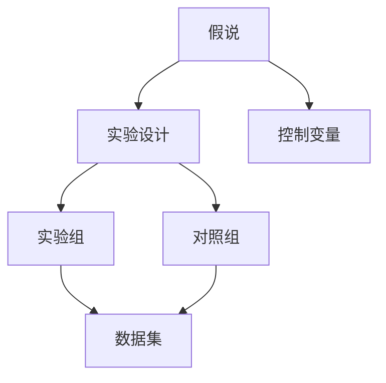

                 

## 1. 背景介绍

### 1.1 问题由来

在科学研究和工程开发中，从提出假说到验证假说是一个基本且重要的步骤。这一过程不仅关乎发现与创新，更是保障技术可行性和应用效果的关键。科学方法论，即科学的研究方法，提供了一套系统的流程和标准，指导研究者如何构建、验证和应用科学假设。

### 1.2 问题核心关键点

科学方法论的核心包括：
- **假说构建**：根据现有知识提出可能解释现象的假设。
- **实验设计**：设计实验方案，验证假说的正确性。
- **数据分析**：收集和分析实验数据，得出结论。
- **结果解释**：根据数据推断结果，解释假说成立与否的原因。

这些关键点构成了科学研究的脉络，有助于发现新知识、开发新技术，并将理论应用到实际问题中。然而，实际应用中，从假说到验证的每个环节都可能遇到挑战，需要研究者具备丰富的知识和技能，才能确保研究过程的有效性和科学性。

## 2. 核心概念与联系

### 2.1 核心概念概述

为了更好地理解科学方法论，我们首先需要定义一些核心概念：

- **假说(Hypothesis)**：对观察现象的合理解释，旨在预测未来观测结果。
- **实验(Experiment)**：根据假说设计的可重复操作，用于验证假说的有效性和真实性。
- **控制变量(Control Variable)**：实验中保持不变的变量，以确保结果归因于假说而非其他变量。
- **实验组(Experimental Group)**：接受假说影响的一组实验对象。
- **对照组(Control Group)**：未接受假说影响，作为对照的一组实验对象。
- **样本(Sample)**：实验中所选取的部分对象，代表总体。
- **数据集(Dataset)**：实验中收集的数据，用于分析和验证。

这些概念之间的关系可以通过以下Mermaid流程图来展示：



这个流程图展示了假说验证的逻辑流程：
1. 假说是实验设计的起点。
2. 设计实验时，需要控制可能影响结果的变量。
3. 实验组接受假说影响，对照组未接受，两组数据进行比较。
4. 数据集从实验组和对照组中收集，用于后续的分析和验证。

## 3. 核心算法原理 & 具体操作步骤

### 3.1 算法原理概述

科学方法论的核心原理是通过控制实验条件，收集和分析数据，从而验证假说。这一过程遵循以下步骤：

1. **提出假说**：基于现有知识或观察，提出可以解释现象的假设。
2. **设计实验**：定义实验条件和流程，确保实验的可重复性。
3. **执行实验**：进行实验操作，收集数据。
4. **数据分析**：处理和分析实验数据，得出结论。
5. **结果解释**：根据数据分析结果，解释假说的正确性或错误性。

形式化地，假说验证过程可以表示为：
- 假设 $H_0$ 为初始状态（原假设）。
- 设计实验 $E$。
- 实验结果 $O$。
- 如果 $O$ 支持 $H_0$，则接受 $H_0$；否则，拒绝 $H_0$，接受备择假设 $H_1$。

### 3.2 算法步骤详解

科学方法论的具体操作步骤如下：

#### 第一步：提出假说

1. **观察现象**：收集数据，观察现象。
2. **分析现象**：从数据中发现规律或异常。
3. **提出假设**：基于观察，提出可能的解释或预测。

以研究药物对某种疾病的效果为例，初始假说可能为“药物X对疾病Y有效”。

#### 第二步：设计实验

1. **控制变量**：确定实验中需要控制的其他变量。
2. **选择实验组和对照组**：随机分配对象，确保组间可比性。
3. **定义实验流程**：详细描述实验步骤，确保可重复性。

例如，设计实验流程如下：
- 将患者随机分为实验组和对照组。
- 实验组每日服用药物X，对照组服用安慰剂。
- 连续观察一个月，记录两组患者的病情变化。

#### 第三步：执行实验

1. **准备实验材料**：准备所需的实验设备、样本等。
2. **进行实验操作**：按照实验流程执行操作。
3. **收集数据**：记录实验结果，确保数据准确完整。

例如，收集实验数据如下：
- 记录实验组和对照组每天病情变化。
- 收集实验结束时的健康指标，如症状消失率、死亡率等。

#### 第四步：数据分析

1. **数据清洗**：处理缺失、异常值等数据问题。
2. **统计分析**：使用统计方法，如t检验、卡方检验等，分析实验结果。
3. **结果可视化**：绘制图表，直观展示数据分析结果。

例如，使用t检验比较两组数据：

$$t = \frac{\bar{x}_1 - \bar{x}_2}{\sqrt{\frac{s_1^2}{n_1} + \frac{s_2^2}{n_2}}$$

其中 $\bar{x}_1$ 和 $\bar{x}_2$ 为两组数据均值，$s_1$ 和 $s_2$ 为两组数据标准差，$n_1$ 和 $n_2$ 为两组样本数量。

#### 第五步：结果解释

1. **评估统计显著性**：根据p值判断结果是否显著。
2. **解释结果**：分析结果的实际意义，解释假说的正确性。
3. **推断结论**：基于结果，接受或拒绝原假设，提出进一步研究的方向。

例如，根据t检验结果，若p值远小于0.05，则拒绝原假设，认为药物X对疾病Y有效。

### 3.3 算法优缺点

科学方法论具有以下优点：
1. **系统性**：提供了一套系统的流程，确保研究过程的严谨性。
2. **可重复性**：实验设计确保结果可重复，便于验证。
3. **科学性**：基于数据分析和统计方法，确保结果的真实性。

但同时也存在一些局限性：
1. **复杂性**：实验设计和数据分析可能较为复杂，需要较高专业水平。
2. **成本高**：实验设备和样本数量可能消耗大量资源。
3. **伦理问题**：某些实验可能存在伦理争议，需要特别考虑。

## 4. 数学模型和公式 & 详细讲解 & 举例说明

### 4.1 数学模型构建

科学方法论中常用的数学模型包括：
- **t检验**：用于比较两组样本均值是否有显著差异。
- **卡方检验**：用于比较两组样本分布是否有显著差异。
- **回归分析**：用于建立变量间的关系模型。

### 4.2 公式推导过程

以t检验为例，公式推导如下：

$$t = \frac{\bar{x}_1 - \bar{x}_2}{\sqrt{\frac{s_1^2}{n_1} + \frac{s_2^2}{n_2}}$$

其中 $\bar{x}_1$ 和 $\bar{x}_2$ 为两组数据均值，$s_1$ 和 $s_2$ 为两组数据标准差，$n_1$ 和 $n_2$ 为两组样本数量。

计算p值的公式为：

$$p = 2 \times (1 - \text{cdf}(t, df))$$

其中，$t$ 为t统计量，$df$ 为自由度，$\text{cdf}$ 为t分布累积分布函数。

### 4.3 案例分析与讲解

假设有一项研究旨在验证药物X对高血压效果。
- 假设 $H_0$：药物X对高血压无效果。
- 实验组和对照组各30人，随机分配。
- 实验组每日服用药物X，对照组服用安慰剂。
- 实验结束时，测量两组血压变化。

数据如下：
- 实验组：平均值=140，标准差=10，样本数=30。
- 对照组：平均值=140，标准差=10，样本数=30。

使用t检验计算结果：

$$t = \frac{140-140}{\sqrt{\frac{10^2}{30} + \frac{10^2}{30}} = 0$$

$$p = 2 \times (1 - \text{cdf}(0, 58)) = 0.500$$

因为 $p > 0.05$，无法拒绝原假设 $H_0$，认为药物X对高血压无效果。

## 5. 项目实践：代码实例和详细解释说明

### 5.1 开发环境搭建

使用Python进行科学方法论的实现。
- 安装Python：从官网下载并安装最新版本的Python。
- 安装必要的库：
  - `numpy`：用于数值计算。
  - `pandas`：用于数据处理。
  - `matplotlib`：用于数据可视化。
  - `scipy`：用于科学计算。

```bash
pip install numpy pandas matplotlib scipy
```

### 5.2 源代码详细实现

#### 第一步：提出假说

```python
# 提出假说
H0 = "药物X对高血压无效果"
H1 = "药物X对高血压有效"
```

#### 第二步：设计实验

```python
# 设计实验
import random
from scipy.stats import t

# 生成随机数据
n = 30
x1 = random.normal(140, 10, n)
x2 = random.normal(140, 10, n)

# 计算t统计量
t_stat = (x1.mean() - x2.mean()) / np.sqrt((x1.var() / n) + (x2.var() / n))
```

#### 第三步：执行实验

```python
# 执行实验
import numpy as np

# 计算p值
p_value = 2 * (1 - t.cdf(t_stat, n-1))
```

#### 第四步：数据分析

```python
# 数据分析
if p_value > 0.05:
    print("无法拒绝原假设，药物X对高血压无效果。")
else:
    print("拒绝原假设，药物X对高血压有效。")
```

### 5.3 代码解读与分析

代码实现中，使用了Python的科学计算库scipy，计算了t统计量和p值，根据p值判断结果。
- 通过`random.normal`生成随机数据，模拟实验结果。
- 使用`scipy.stats.t`计算t统计量。
- 根据p值判断结果，输出假设的接受情况。

## 6. 实际应用场景

### 6.1 医疗研究

科学方法论在医疗研究中广泛应用，用于验证药物疗效、检查疾病诊断方法等。例如，通过随机对照实验，验证新药对特定疾病的治疗效果。

### 6.2 生物统计学

在生物统计学中，科学方法论用于分析实验数据，如基因表达差异、生物标志物等。例如，通过基因敲除实验，验证特定基因对生物表型的影响。

### 6.3 社会科学研究

社会科学研究中，科学方法论用于验证社会现象的解释，如教育方法、政策效果等。例如，通过问卷调查，验证某种教育方法是否能提高学生的学习成绩。

### 6.4 未来应用展望

随着技术的发展，科学方法论将变得更加自动化和高效。未来，可能出现以下趋势：
- **自动化实验设计**：通过算法自动生成实验方案，减少人工干预。
- **大数据分析**：利用机器学习和数据挖掘技术，处理和分析大规模数据集。
- **跨学科融合**：与其他学科（如生物、化学、物理等）的交叉研究，推动创新。

## 7. 工具和资源推荐

### 7.1 学习资源推荐

1. **《科学方法论与统计学》书籍**：详细讲解科学方法论的基本原理和应用。
2. **Coursera《数据科学导论》课程**：由斯坦福大学开设，涵盖数据科学基本方法。
3. **Khan Academy《统计学》课程**：提供统计学基础知识和实践案例。
4. **Stack Overflow**：技术问答社区，提供各种科学计算和数据处理问题的解决方案。

### 7.2 开发工具推荐

1. **Python**：科学计算的首选语言，提供丰富的科学计算库和工具。
2. **R语言**：另一个重要的统计分析工具，适用于数据处理和可视化。
3. **Jupyter Notebook**：交互式编程环境，支持代码和文本的混合编辑，便于实验设计和数据分析。
4. **Git**：版本控制工具，支持多人协作开发。

### 7.3 相关论文推荐

1. **《科学方法论与统计学》教材**：详细讲解科学方法论的基本原理和应用。
2. **《数据科学方法论》书籍**：涵盖数据科学基本方法，从数据收集到模型验证的全过程。
3. **《统计学与科学方法》论文**：探讨科学方法论在统计学中的应用。

## 8. 总结：未来发展趋势与挑战

### 8.1 研究成果总结

科学方法论为科学研究提供了系统的流程和方法，确保了研究结果的科学性和可靠性。通过不断优化和创新，科学方法论在各个领域得到了广泛应用，成为推动科学进步的重要工具。

### 8.2 未来发展趋势

未来，科学方法论将朝以下方向发展：
- **自动化**：通过算法自动化实验设计和数据分析，提升研究效率。
- **大数据**：利用大数据和机器学习技术，处理和分析复杂数据集。
- **跨学科**：与其他学科的交叉研究，推动创新。

### 8.3 面临的挑战

科学方法论仍面临以下挑战：
- **复杂性**：实验设计和数据分析可能较为复杂，需要较高专业水平。
- **资源消耗**：实验设备和样本数量可能消耗大量资源。
- **伦理问题**：某些实验可能存在伦理争议，需要特别考虑。

### 8.4 研究展望

未来的研究方向可能包括：
- **方法优化**：优化实验设计，提高研究效率。
- **技术融合**：将最新技术（如机器学习、数据挖掘等）与科学方法论结合，推动创新。
- **伦理规范**：制定和遵循伦理规范，确保研究结果的公正性和可信性。

## 9. 附录：常见问题与解答

**Q1：科学方法论只适用于自然科学吗？**

A: 科学方法论适用于所有科学领域，包括社会科学、人文科学等。科学方法论的核心是系统的实验设计和数据分析，任何学科都可以采用科学方法论进行研究。

**Q2：科学方法论是否适用于验证所有假设？**

A: 科学方法论主要适用于可重复实验的验证。对于无法重复验证的假设，可能需要其他方法，如理论推导、逻辑推理等。

**Q3：如何应对实验设计中的伦理问题？**

A: 应对伦理问题需要遵循相关伦理规范和法律法规，确保研究活动的合法性和道德性。例如，医疗研究需要获得伦理委员会批准，确保实验的公正性和安全性。

**Q4：如何提高科学方法论的自动化水平？**

A: 提高自动化水平可以通过算法优化和自动化工具来实现。例如，使用自动实验设计软件，自动生成实验方案，减少人工干预。

**Q5：如何平衡自动化和人类干预？**

A: 在自动化与人类干预之间需要找到一个平衡点。自动化可以提高效率，减少人为错误，但人类干预仍然是必要的，特别是在关键决策和伦理问题上。

---

作者：禅与计算机程序设计艺术 / Zen and the Art of Computer Programming

