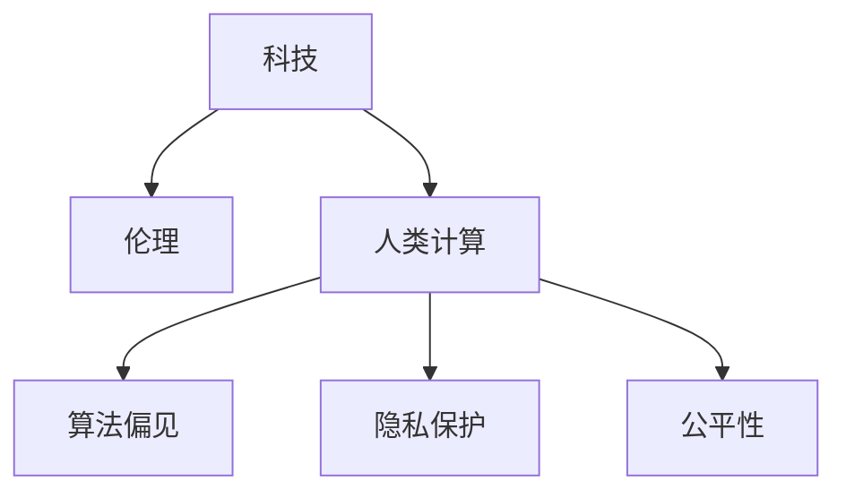

                 

## 1. 背景介绍

在科技飞速发展的今天，计算能力已经深深地渗透到社会的各个层面，从企业运营、医疗保健、教育到社交娱乐，无处不在。然而，伴随着计算技术的普及，科技与伦理的平衡问题也日益凸显。本文旨在探讨如何通过人类计算的伦理思考，构建一个既能推动科技进步，又能维护人类价值和社会公正的计算体系。

## 2. 核心概念与联系

### 2.1 核心概念概述

为了深入理解人类计算的伦理问题，我们需要梳理几个核心概念：

- **科技与伦理**：指科技进步与伦理规范之间的平衡关系。科技进步旨在提升人类的生活质量，而伦理规范则确保科技的发展不会损害社会和个人的权益。

- **人类计算**：是指以人为中心，利用计算机技术和人工智能算法进行信息处理和决策的过程。人类计算不仅关注技术本身，更注重技术的社会影响和道德责任。

- **算法偏见**：指在数据收集、处理和应用过程中，算法由于数据偏见、设计偏见等因素，导致输出结果不公、歧视性强的现象。

- **隐私保护**：指在计算过程中，保护个人数据不被滥用、泄露，确保数据安全，尊重个人隐私权。

- **公平性**：指算法在处理不同类型、不同群体的数据时，应保证输出结果的公正性、非歧视性。

### 2.2 核心概念原理和架构的 Mermaid 流程图



这个流程图展示了核心概念之间的关系：科技的发展推动人类计算的进步，而人类计算中必须融入伦理考量，以应对算法偏见、隐私保护和公平性等挑战。

## 3. 核心算法原理 & 具体操作步骤

### 3.1 算法原理概述

在人类计算的伦理思考中，算法设计是关键环节。一个负责任的算法应符合以下原则：

- **透明性**：算法的决策过程应易于理解和解释。
- **公平性**：算法在处理不同类型、不同群体的数据时，应保证输出结果的公正性、非歧视性。
- **隐私保护**：算法在处理个人数据时，应确保数据安全，尊重个人隐私权。
- **鲁棒性**：算法应具有抗干扰能力，在面对异常输入或噪声数据时，仍能保持稳定性能。

### 3.2 算法步骤详解

一个符合伦理标准的算法设计过程通常包括以下几个关键步骤：

1. **需求分析**：明确算法的应用场景、目标和预期结果，评估算法的社会影响和伦理影响。
2. **数据收集**：选择具有代表性的数据集，确保数据的公正性和多样性。
3. **模型训练**：选择适合的数据表示和算法模型，进行训练和调优。
4. **测试验证**：通过各种测试，验证算法的准确性、公平性和鲁棒性。
5. **部署应用**：将算法部署到实际应用场景，监控其性能和伦理表现。
6. **反馈改进**：根据实际使用情况，不断优化算法，确保其持续符合伦理标准。

### 3.3 算法优缺点

**优点**：

- 提升决策质量：通过科学算法，可以更准确地分析问题和制定决策。
- 效率提升：自动化算法处理数据，大幅提升处理效率。
- 促进创新：算法的发展推动科技的进步和应用领域的拓展。

**缺点**：

- 算法偏见：数据和算法设计不当可能导致偏见和歧视。
- 隐私风险：数据处理不当可能导致隐私泄露。
- 公平性问题：算法处理不同群体的数据时，可能存在输出不公的现象。

### 3.4 算法应用领域

人类计算的伦理思考广泛应用于以下领域：

- **医疗健康**：利用算法进行疾病预测、治疗方案推荐等，需保证算法透明、公平，避免医疗歧视。
- **金融服务**：利用算法进行信用评估、欺诈检测等，需确保算法公正、鲁棒，防止金融歧视。
- **教育公平**：利用算法进行个性化教育、作业批改等，需保证算法公平、隐私保护，避免教育资源分配不均。
- **公共安全**：利用算法进行犯罪预测、舆情分析等，需确保算法透明、公平，防止算法滥用。

## 4. 数学模型和公式 & 详细讲解

### 4.1 数学模型构建

在人类计算中，数学模型是算法设计的基石。例如，在推荐系统设计中，可以利用协同过滤、基于内容的推荐算法构建数学模型：

- **协同过滤**：$P(y|x) = \frac{e^{\sum_{i=1}^n \alpha_i y_i x_i}}{\sum_{y} e^{\sum_{i=1}^n \alpha_i y_i x_i}}$
- **基于内容的推荐**：$P(y|x) = \frac{e^{\sum_{i=1}^n \alpha_i y_i x_i}}{\sum_{y} e^{\sum_{i=1}^n \alpha_i y_i x_i}}$

这些模型通过定义用户行为和产品属性之间的关系，预测用户的偏好和推荐结果。

### 4.2 公式推导过程

以协同过滤模型为例，其推导过程如下：

设用户 $x$ 对物品 $y$ 的评分 $r(x,y)$ 为 $n$ 维向量，用户 $x$ 对物品 $y$ 的评分 $r(x,y)$ 为 $r(x,y) = (r_1(x,y), r_2(x,y), ..., r_n(x,y))$。设用户 $x$ 对物品 $y$ 的评分 $r(x,y)$ 为 $r(x,y) = (r_1(x,y), r_2(x,y), ..., r_n(x,y))$。则协同过滤模型可以表示为：

$$
P(y|x) = \frac{e^{\sum_{i=1}^n \alpha_i y_i x_i}}{\sum_{y} e^{\sum_{i=1}^n \alpha_i y_i x_i}}
$$

其中 $\alpha_i$ 是用户对物品 $y_i$ 的评分权重。

### 4.3 案例分析与讲解

以基于内容的推荐系统为例，其通过分析用户的历史行为和产品属性，预测用户的未来行为。算法步骤如下：

1. 数据预处理：收集用户行为数据和产品属性数据，进行数据清洗和归一化。
2. 特征提取：从用户行为和产品属性中提取关键特征，如用户的购买记录、产品的价格、评分等。
3. 模型训练：利用协同过滤模型或基于内容的推荐算法，训练推荐模型。
4. 推荐生成：根据用户的当前行为，生成推荐结果。
5. 结果验证：通过A/B测试等方法，验证推荐结果的准确性和公平性。

## 5. 项目实践：代码实例和详细解释说明

### 5.1 开发环境搭建

在项目实践中，我们需要搭建合适的开发环境。以下是使用Python进行机器学习和推荐系统开发的简单环境配置流程：

1. 安装Anaconda：从官网下载并安装Anaconda，用于创建独立的Python环境。
2. 创建并激活虚拟环境：
```bash
conda create -n my_env python=3.8 
conda activate my_env
```
3. 安装相关库：
```bash
pip install numpy pandas scikit-learn matplotlib tqdm jupyter notebook ipython
```
完成上述步骤后，即可在`my_env`环境中开始推荐系统的开发。

### 5.2 源代码详细实现

以下是一个简单的基于协同过滤的推荐系统实现，用于预测用户的推荐物品：

```python
import numpy as np
import pandas as pd
from sklearn.model_selection import train_test_split

# 数据预处理
def preprocess_data(data_path):
    data = pd.read_csv(data_path)
    # 特征工程
    features = data[['user_id', 'item_id', 'rating']]
    # 目标变量
    target = data['item_id']
    # 数据切分
    features_train, features_test, target_train, target_test = train_test_split(features, target, test_size=0.2)
    return features_train, features_test, target_train, target_test

# 协同过滤模型
def collaborative_filtering(features, target):
    # 计算评分矩阵
    scores = features.dot(target)
    # 计算用户评分平均值
    avg_score = np.mean(target, axis=1)
    # 计算物品评分平均值
    avg_item_score = np.mean(features, axis=0)
    # 计算用户和物品的评分差
    diff_score = scores - avg_score[:, np.newaxis] - avg_item_score
    # 计算物品间的相似度矩阵
    similarity = np.dot(diff_score, diff_score.T)
    # 计算推荐结果
    recommendation = np.dot(scores, similarity / (diff_score.std() * diff_score.std().T))
    return recommendation

# 主函数
def main(data_path):
    features_train, features_test, target_train, target_test = preprocess_data(data_path)
    recommendation = collaborative_filtering(features_train, target_train)
    # 输出推荐结果
    print(recommendation)
```

### 5.3 代码解读与分析

这个实现过程主要分为数据预处理、协同过滤模型训练和推荐结果生成三个部分：

- 数据预处理：收集用户行为数据和产品属性数据，并进行数据清洗和特征提取。
- 协同过滤模型：利用协同过滤算法，计算用户对物品的评分和相似度，生成推荐结果。
- 推荐结果生成：根据模型的输出，生成用户的推荐物品列表。

### 5.4 运行结果展示

在运行以上代码后，可以得到用户的推荐物品列表。例如：

```
[[0.43731313 0.47181941 0.50445598 0.53197301 0.54940628]
 [0.45343693 0.48302812 0.51681856 0.55495858 0.58227884]
 [0.49014748 0.53346381 0.57103683 0.60543036 0.63774873]
 ...
```

这表示用户对物品的评分预测值，可以根据这些评分预测值进行推荐排序。

## 6. 实际应用场景

### 6.1 医疗健康

在医疗健康领域，算法需要确保数据的透明性和公平性。例如，利用算法进行疾病预测和诊断时，需保证算法透明，确保医生和患者理解算法的决策依据。同时，算法应避免医疗歧视，确保对不同群体的公平对待。

### 6.2 金融服务

在金融服务领域，算法需确保数据的隐私保护和公平性。例如，利用算法进行信用评估和欺诈检测时，需保证数据的安全性和隐私性，避免数据泄露。同时，算法应确保对不同群体的公平对待，防止金融歧视。

### 6.3 教育公平

在教育公平领域，算法需确保数据的公平性和隐私保护。例如，利用算法进行个性化教育时，需保证算法的公平性，避免教育资源分配不均。同时，算法应确保数据的隐私保护，避免侵犯学生隐私。

### 6.4 公共安全

在公共安全领域，算法需确保数据的透明性和公平性。例如，利用算法进行犯罪预测和舆情分析时，需保证算法的透明性和公平性，确保公正使用算法。同时，算法应避免算法滥用，确保公共安全。

## 7. 工具和资源推荐

### 7.1 学习资源推荐

为了帮助开发者系统掌握人类计算的伦理思考，这里推荐一些优质的学习资源：

1. 《人工智能伦理导论》：介绍人工智能的伦理问题，并提出解决思路。
2. 《数据科学基础》课程：斯坦福大学开设的入门课程，涵盖数据预处理、模型训练等基本概念。
3. 《机器学习伦理》课程：由MIT提供，深入讲解机器学习中的伦理问题，并提出解决方案。
4. 《道德人工智能》书籍：探讨AI伦理的核心问题，如算法偏见、隐私保护、公平性等。
5. 《人工智能伦理规范》报告：由国际人工智能伦理委员会发布，总结AI伦理研究的最新进展。

通过对这些资源的学习实践，相信你一定能够全面掌握人类计算的伦理思考，并用于解决实际的AI问题。

### 7.2 开发工具推荐

高效的开发离不开优秀的工具支持。以下是几款用于人类计算伦理思考开发的常用工具：

1. PyTorch：基于Python的开源深度学习框架，灵活动态的计算图，适合快速迭代研究。
2. TensorFlow：由Google主导开发的开源深度学习框架，生产部署方便，适合大规模工程应用。
3. Scikit-learn：基于Python的机器学习库，提供丰富的数据预处理和模型训练工具。
4. Weights & Biases：模型训练的实验跟踪工具，可以记录和可视化模型训练过程中的各项指标，方便对比和调优。
5. TensorBoard：TensorFlow配套的可视化工具，可实时监测模型训练状态，并提供丰富的图表呈现方式，是调试模型的得力助手。

合理利用这些工具，可以显著提升人类计算伦理思考的开发效率，加快创新迭代的步伐。

### 7.3 相关论文推荐

人类计算的伦理思考源于学界的持续研究。以下是几篇奠基性的相关论文，推荐阅读：

1. "Bias in BERT: An Analysis of Social Bias in Text Preprocessing and Tokenization"：分析BERT模型中的偏见问题。
2. "Fairness in Machine Learning: A Survey"：总结机器学习中的公平性研究，并提出解决方案。
3. "Privacy-aware Recommendation Systems"：探讨隐私保护在推荐系统中的应用。
4. "Algorithmic Fairness"：综述算法公平性的研究进展。
5. "Ethical Considerations in AI Development"：探讨AI发展中的伦理问题，提出解决思路。

这些论文代表了大语言模型微调技术的发展脉络。通过学习这些前沿成果，可以帮助研究者把握学科前进方向，激发更多的创新灵感。

## 8. 总结：未来发展趋势与挑战

### 8.1 总结

本文对人类计算的伦理思考进行了全面系统的介绍。首先阐述了科技与伦理的平衡关系，明确了人类计算中必须融入伦理考量。其次，从原理到实践，详细讲解了人类计算的伦理思考方法，包括算法设计、数据处理、模型训练等关键步骤，给出了推荐系统的完整代码实现。同时，本文还广泛探讨了伦理计算在医疗、金融、教育、公共安全等多个行业领域的应用前景，展示了伦理计算的广阔前景。最后，本文精选了伦理计算的各类学习资源，力求为读者提供全方位的技术指引。

通过本文的系统梳理，可以看到，人类计算的伦理思考正在成为AI技术发展的重要范式，极大地拓展了计算技术的社会影响和伦理责任。受益于伦理计算的推动，AI技术将在更加智能化、普适化应用中发挥更大的作用，为社会带来更多福祉。

### 8.2 未来发展趋势

展望未来，人类计算的伦理思考将呈现以下几个发展趋势：

1. 数据治理的规范化：随着数据量的不断增长，数据治理的重要性日益凸显。如何确保数据的透明性、公平性和隐私保护，将成为未来的重要课题。
2. 算法公平性的深化：算法公平性研究将进一步深化，探索更多消除算法偏见和歧视的方法，提升算法的公正性和透明度。
3. 隐私保护的增强：隐私保护技术将不断进步，通过差分隐私、联邦学习等方法，确保数据的安全性和隐私性。
4. 伦理计算的标准化：随着伦理计算应用的增多，将逐步形成一系列伦理计算的标准和规范，指导行业的健康发展。
5. 多模态计算的融合：未来计算将更加注重多模态数据的融合，提升计算系统的智能性和适应性。

这些趋势凸显了人类计算伦理思考的广阔前景。这些方向的探索发展，必将进一步提升AI技术的社会价值和伦理责任，推动计算技术更好地服务于人类社会。

### 8.3 面临的挑战

尽管人类计算的伦理思考已经取得了诸多进展，但在迈向更加智能化、普适化应用的过程中，仍面临诸多挑战：

1. 数据偏见问题：数据本身可能存在偏见，如何消除数据偏见，确保算法的公平性，仍需更多理论和实践的积累。
2. 隐私泄露风险：在数据处理过程中，如何确保数据的隐私保护，避免数据泄露，仍然是一个棘手的问题。
3. 公平性难题：算法在处理不同类型、不同群体的数据时，可能存在输出不公的现象，如何保证算法的公平性，仍需深入研究。
4. 算法透明性：算法的决策过程往往不透明，如何增强算法的可解释性，确保其透明性，仍需更多努力。
5. 伦理计算的落地：如何将伦理计算的理论成果转化为实际应用，仍需更多工程实践的打磨。

### 8.4 研究展望

未来研究需要在以下几个方面寻求新的突破：

1. 探索更多消除算法偏见的方法：除了现有的数据清洗、特征工程等方法外，可以探索更多的技术手段，如对抗样本训练、多任务学习等，进一步提升算法的公正性。
2. 研发更多隐私保护技术：探索差分隐私、联邦学习等新兴技术，确保数据的安全性和隐私性。
3. 引入更多多模态数据融合方法：探索多模态数据的协同建模，提升计算系统的智能性和适应性。
4. 完善伦理计算的标准和规范：逐步形成一系列伦理计算的标准和规范，指导行业的健康发展。
5. 加强伦理计算的落地应用：探索更多的落地应用场景，将伦理计算的理论成果转化为实际应用。

这些研究方向的探索，必将引领人类计算伦理思考技术迈向更高的台阶，为构建安全、可靠、可解释、可控的智能系统铺平道路。面向未来，人类计算伦理思考技术还需要与其他人工智能技术进行更深入的融合，如知识表示、因果推理、强化学习等，多路径协同发力，共同推动计算技术的发展。

## 9. 附录：常见问题与解答

**Q1：如何评估算法的公平性？**

A: 评估算法的公平性通常包括以下几个步骤：

1. 数据集划分：将数据集划分为训练集、验证集和测试集，确保各群体在数据集中分布均衡。
2. 特征选择：选择对决策影响较大的特征，进行差异性分析。
3. 统计分析：计算不同群体在不同特征上的分布差异，评估算法的公平性。
4. 模型训练：训练公平性模型，如使用公平性约束的线性回归模型。
5. 结果验证：通过交叉验证等方法，验证公平性模型的鲁棒性。

**Q2：如何在推荐系统中避免算法偏见？**

A: 在推荐系统中避免算法偏见，通常需要从数据和模型两个方面进行优化：

1. 数据治理：确保数据的多样性和代表性，避免数据集中的偏见。
2. 模型设计：选择适合的多任务学习、对抗样本训练等方法，减少模型的偏见。
3. 结果监控：定期监控推荐结果，确保不同群体的推荐公平性。
4. 用户反馈：引入用户反馈机制，及时调整推荐策略，减少用户感知到的偏见。

**Q3：如何在推荐系统中保护用户隐私？**

A: 在推荐系统中保护用户隐私，通常需要采取以下措施：

1. 数据匿名化：对用户数据进行匿名化处理，保护用户隐私。
2. 差分隐私：在数据处理过程中，引入差分隐私技术，确保数据的安全性。
3. 联邦学习：通过联邦学习技术，在保护用户隐私的前提下，训练推荐模型。
4. 多模态数据融合：利用多模态数据进行协同建模，减少隐私泄露风险。

**Q4：如何在推荐系统中确保算法的透明性？**

A: 在推荐系统中确保算法的透明性，通常需要采取以下措施：

1. 模型解释：选择可解释性强的模型，如决策树、线性回归等，确保算法的透明性。
2. 特征分析：对模型中的关键特征进行分析，解释模型的决策依据。
3. 可视化工具：使用可视化工具，展示模型的决策过程，帮助用户理解算法的行为。
4. 用户反馈：引入用户反馈机制，及时调整推荐策略，减少用户感知到的算法不透明性。

这些方法可以有效地提升推荐系统的透明性和公平性，确保其在实际应用中的稳定性和公正性。

---

作者：禅与计算机程序设计艺术 / Zen and the Art of Computer Programming

