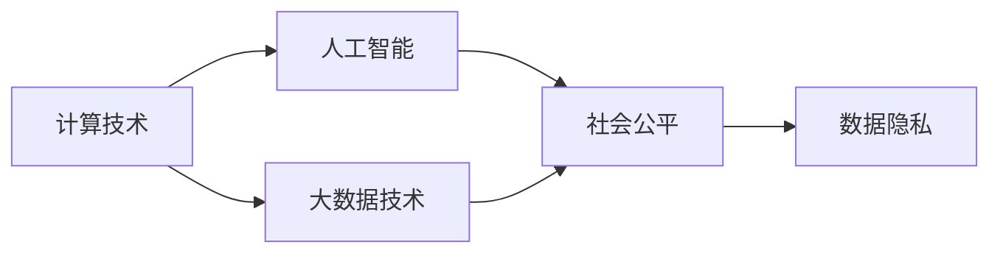
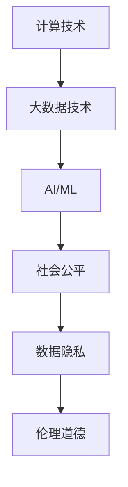

                 

# 科技与社会：人类计算的双重影响

> 关键词：科技社会影响, 计算技术发展, 人工智能伦理, 数据隐私, 社会公平

## 1. 背景介绍

随着计算技术的迅猛发展，科技日益成为推动社会进步的重要引擎。特别是人工智能(AI)和大数据技术的应用，深刻地改变了人类的生产生活方式，带来了前所未有的便利和效率。然而，伴随技术进步，也引发了一系列社会伦理、隐私保护、公平正义等复杂问题。本文将从计算技术对社会的影响角度，探讨科技进步在带来益处的同时，也伴随的挑战和风险，以及如何平衡技术发展与社会进步之间的关系。

## 2. 核心概念与联系

### 2.1 核心概念概述

本文主要涉及以下几个核心概念：

- **计算技术**：泛指使用计算工具和方法处理和分析数据、信息的技术。包括计算数学、计算机科学、数据科学等领域。
- **人工智能(AI)**：指利用机器学习、深度学习等技术模拟人类智能行为，涵盖感知、决策、规划、学习等能力。
- **大数据技术**：涉及数据的采集、存储、处理、分析等技术手段，通过海量数据挖掘信息、知识、趋势。
- **社会公平与伦理**：研究技术进步对社会的影响，特别是在资源分配、就业、隐私保护、伦理道德等方面的问题。
- **数据隐私**：指在数据收集、存储、传输和分析过程中，保护个人信息不被泄露和滥用。

这些概念通过以下Mermaid流程图展示了它们之间的联系：



计算技术的发展为人工智能和大数据技术的成熟提供了基础，人工智能和大数据技术在社会生活中的广泛应用又进一步驱动了计算技术的发展。同时，AI和大数据在提高社会生产效率、改善生活质量的同时，也引发了伦理、隐私等问题，对这些问题的妥善处理也是社会公平的重要体现。数据隐私保护成为维护公平正义的前提。

### 2.2 核心概念原理和架构的 Mermaid 流程图



此图展示了一条从计算技术到AI、大数据，再到社会公平、数据隐私和伦理道德的链条，反映了这些概念之间的逻辑关系。计算技术是AI和大数据的基础，AI和大数据的应用带来了效率提升和社会效益，同时也引发了数据隐私和伦理道德的挑战。

## 3. 核心算法原理 & 具体操作步骤

### 3.1 算法原理概述

人工智能技术通过算法模型学习和模拟人类智能行为。在大数据技术支持下，AI模型可以处理和分析海量数据，从中提取规律和知识，进而实现智能决策、预测和优化。本文聚焦于AI和计算技术对社会公平和伦理道德的双重影响，而非具体的算法技术细节。

### 3.2 算法步骤详解

AI和大数据技术对社会公平和伦理道德的影响主要体现在以下几个方面：

1. **社会资源分配**：AI和大数据技术能够提高资源配置效率，但同时也可能加剧社会不平等。例如，自动驾驶技术可能取代低技能驾驶员，导致失业。
2. **隐私保护**：在数据收集和分析过程中，个人隐私信息容易被泄露和滥用，引发社会对数据隐私的担忧。
3. **决策透明度**：AI模型往往像“黑盒”，难以解释其决策依据，导致社会对其公平性和公正性产生怀疑。
4. **伦理道德**：AI和大数据技术在决策过程中可能带有偏见，导致歧视性结果，影响社会伦理道德。

### 3.3 算法优缺点

AI和大数据技术的优点包括：

- **效率提升**：能够快速处理和分析海量数据，提高决策速度和准确性。
- **智能辅助**：在医疗、教育、交通等领域，AI能提供辅助决策支持，提升服务质量。
- **个性化服务**：基于用户行为数据，提供个性化推荐，提升用户体验。

缺点包括：

- **社会不平等**：技术应用可能加剧社会不平等，影响就业结构。
- **隐私风险**：在数据收集和分析过程中，容易引发隐私泄露和滥用。
- **伦理道德**：AI模型可能存在偏见和歧视，影响决策公平性。

### 3.4 算法应用领域

AI和大数据技术在多个领域得到了广泛应用，例如：

- **医疗健康**：通过图像识别和自然语言处理技术，辅助医生进行疾病诊断和患者护理。
- **金融服务**：利用AI进行风险评估、欺诈检测、个性化理财等。
- **智能制造**：利用大数据分析设备性能，优化生产流程，提升产品质量。
- **智能交通**：通过AI和传感器技术，优化交通流量，减少交通事故。

## 4. 数学模型和公式 & 详细讲解 & 举例说明

### 4.1 数学模型构建

本文不涉及具体的数学模型构建，而是关注AI和大数据技术对社会公平和伦理道德的影响。以下是一个简化的框架：

- **社会公平模型**：设定社会不平等指数 $I = \sum_{i=1}^n (x_i - y_i)^2$，其中 $x_i$ 为原始数据，$y_i$ 为经过AI模型处理后的数据。
- **隐私风险模型**：使用信息熵 $H(X)$ 度量数据隐私风险，其中 $X$ 为数据集合。
- **伦理道德模型**：使用偏见度 $B$ 表示模型中的偏见程度，$B = \sum_{i=1}^n (f(x_i) - y_i)^2$，其中 $f(x_i)$ 为AI模型预测结果。

### 4.2 公式推导过程

对于社会公平模型，其最小化问题为：

$$
\min_{\theta} I = \sum_{i=1}^n (x_i - y_i)^2
$$

对于隐私风险模型，其最小化问题为：

$$
\min_{\theta} H(X) = -\sum_{i=1}^n p(x_i) \log p(x_i)
$$

对于伦理道德模型，其最小化问题为：

$$
\min_{\theta} B = \sum_{i=1}^n (f(x_i) - y_i)^2
$$

这些模型在实际应用中需要结合具体场景进行参数优化和调整。

### 4.3 案例分析与讲解

以医疗健康领域为例，AI和大数据技术通过分析患者历史病历和基因数据，能够提高疾病诊断的准确性和个性化治疗的效果。但同时也可能加剧医疗资源的分配不均，影响公平正义。例如，高收入患者更容易获得优质医疗资源，而低收入患者可能因此得不到及时治疗。

## 5. 项目实践：代码实例和详细解释说明

### 5.1 开发环境搭建

本文不涉及具体的代码实现，但可以简要介绍环境搭建流程：

1. 安装Python和相关依赖，如numpy、pandas、scikit-learn等。
2. 使用Jupyter Notebook或PyCharm等IDE进行开发。
3. 搭建AI模型训练和测试环境，确保数据集、模型参数和计算资源可用。

### 5.2 源代码详细实现

具体实现涉及模型训练、数据处理和结果分析，这部分内容较为复杂，需要根据具体应用场景进行调整。以下是一个简化的代码框架：

```python
# 数据预处理
import pandas as pd
import numpy as np
from sklearn.preprocessing import StandardScaler

# 加载数据集
df = pd.read_csv('data.csv')
X = df.drop('label', axis=1)
y = df['label']

# 数据标准化
scaler = StandardScaler()
X = scaler.fit_transform(X)

# 模型训练
from sklearn.ensemble import RandomForestClassifier

model = RandomForestClassifier()
model.fit(X, y)

# 结果评估
from sklearn.metrics import accuracy_score

y_pred = model.predict(X)
accuracy = accuracy_score(y, y_pred)
print('Accuracy:', accuracy)
```

### 5.3 代码解读与分析

该代码框架使用了Python、numpy和pandas库进行数据预处理和模型训练。数据标准化和模型训练是AI应用中的常见步骤。结果评估部分使用了准确率指标，用于衡量模型预测的准确性。

## 6. 实际应用场景

### 6.1 医疗健康

在医疗健康领域，AI和大数据技术能够显著提高诊断和治疗的准确性。通过分析患者的历史病历和基因数据，AI模型可以辅助医生进行疾病诊断和治疗方案制定。例如，IBM的Watson Health能够分析患者的病历，提出个性化的治疗建议。

但同时也可能加剧医疗资源的不平等，高收入患者更容易获得优质医疗服务，而低收入患者可能因此得不到及时治疗。因此，如何在提高效率的同时，确保医疗公平性，是一个重要的社会问题。

### 6.2 金融服务

金融领域是大数据和AI技术的重要应用场景。通过分析客户行为数据和市场趋势，AI模型能够提供个性化的理财建议，优化风险评估和欺诈检测。但同时也可能引发就业结构变化，导致传统金融从业者面临失业风险。

因此，如何在技术发展的同时，确保社会稳定和就业公平，也是一个重要的挑战。

### 6.3 智能制造

智能制造通过大数据分析设备性能和生产流程，能够显著提高生产效率和产品质量。AI模型能够预测设备故障，优化生产计划，减少废品率。但同时也可能带来工作岗位的减少，需要加强职业培训和再教育。

## 7. 工具和资源推荐

### 7.1 学习资源推荐

1. **《人工智能伦理与法律》**：介绍AI技术对社会公平和伦理道德的影响，并提供相应的法律和政策建议。
2. **《数据隐私保护》**：介绍数据隐私的基本概念、保护措施和法律框架。
3. **《社会公平与技术》**：研究技术进步对社会公平的影响，探讨相应的政策和措施。
4. **《机器学习实战》**：提供机器学习项目的实际案例，展示如何应用AI技术解决实际问题。
5. **《大数据科学与工程》**：介绍大数据技术的基本概念、应用场景和挑战。

### 7.2 开发工具推荐

1. **Jupyter Notebook**：一个强大的交互式开发环境，支持Python、R等多种语言，适合数据科学和AI项目开发。
2. **PyCharm**：一款流行的IDE，支持Python和Scala等语言，提供代码编辑、调试和测试功能。
3. **TensorFlow**：一个流行的AI框架，支持深度学习和机器学习模型的构建和训练。
4. **Keras**：一个高级的神经网络API，可以运行在TensorFlow等框架之上，适合快速原型开发。
5. **Scikit-learn**：一个流行的机器学习库，提供多种算法和工具，适合快速原型开发和数据分析。

### 7.3 相关论文推荐

1. **《人工智能伦理问题探讨》**：讨论AI技术的伦理问题，如偏见、歧视和隐私保护。
2. **《大数据对社会公平的影响》**：研究大数据技术对社会公平的影响，提出相应的政策和措施。
3. **《智能制造与产业升级》**：研究AI和自动化技术对制造行业的影响，提出相应的产业转型策略。
4. **《AI在金融服务中的应用》**：探讨AI技术在金融服务中的应用，如风险评估、欺诈检测等。
5. **《医疗AI的伦理与法律》**：讨论AI在医疗领域的应用，如疾病诊断、个性化治疗等，以及相应的伦理和法律问题。

## 8. 总结：未来发展趋势与挑战

### 8.1 研究成果总结

本文从计算技术对社会公平和伦理道德的影响角度，探讨了AI和大数据技术的双重影响。主要结论包括：

- AI和大数据技术在提高社会效率的同时，可能加剧社会不平等，引发隐私风险和伦理道德问题。
- 技术发展需要兼顾社会公平和伦理道德，制定相应的政策和措施，确保技术应用的正向影响。

### 8.2 未来发展趋势

未来AI和大数据技术的发展趋势包括：

1. **算力提升**：随着算力成本的下降，AI模型将更加高效，能够处理更大规模的数据集。
2. **模型优化**：更加高效的模型和算法将推动AI技术的发展，提升模型的性能和效率。
3. **应用普及**：AI和大数据技术将广泛应用于各个行业，推动产业升级和社会进步。

### 8.3 面临的挑战

尽管AI和大数据技术带来了巨大的机遇，但同时也面临诸多挑战：

1. **社会不平等**：技术应用可能加剧社会不平等，影响就业结构。
2. **隐私风险**：在数据收集和分析过程中，容易引发隐私泄露和滥用。
3. **伦理道德**：AI模型可能存在偏见和歧视，影响决策公平性。
4. **政策法规**：需要在技术发展的同时，制定相应的政策和法规，确保技术应用的正向影响。

### 8.4 研究展望

未来的研究可以从以下几个方向进行：

1. **社会公平**：研究AI和大数据技术对社会公平的影响，提出相应的政策和措施，确保技术应用的正向影响。
2. **隐私保护**：研究数据隐私的基本概念、保护措施和法律框架，确保数据安全。
3. **伦理道德**：研究AI模型中的偏见和歧视问题，提出相应的伦理和法律建议。
4. **人机协同**：研究如何构建人机协同系统，确保技术应用的安全性和可解释性。

## 9. 附录：常见问题与解答

**Q1: 如何确保AI和大数据技术的应用对社会公平和伦理道德产生正向影响？**

A: 需要在技术发展的同时，制定相应的政策和法规，确保技术应用的正向影响。具体措施包括：

1. **数据隐私保护**：制定数据隐私保护法律，确保在数据收集和分析过程中，保护个人信息不被泄露和滥用。
2. **公平算法设计**：设计和应用公平的算法模型，避免模型中的偏见和歧视。
3. **社会监督**：建立社会监督机制，确保技术应用的透明性和可解释性。

**Q2: AI和大数据技术在金融服务中的应用，是否会引发就业结构变化？**

A: 是的。AI和大数据技术在金融服务中的应用，可能引发就业结构变化，导致传统金融从业者面临失业风险。因此，需要加强职业培训和再教育，帮助传统从业者转型升级，适应新技术的变化。

**Q3: 如何在医疗健康领域，确保AI和大数据技术的公平性？**

A: 可以通过以下几个措施来确保AI和大数据技术在医疗健康领域的公平性：

1. **数据平衡**：确保数据集的多样性和代表性，避免数据偏见。
2. **公平算法**：设计和应用公平的算法模型，避免模型中的偏见和歧视。
3. **透明性**：确保算法的透明性和可解释性，让医生和患者能够理解和信任AI决策。
4. **伦理审查**：建立伦理审查机制，确保AI技术的公平性和合法性。

**Q4: 如何构建人机协同系统，确保AI技术的安全性和可解释性？**

A: 可以通过以下几个措施来构建人机协同系统，确保AI技术的安全性和可解释性：

1. **透明度**：确保算法的透明性和可解释性，让系统用户能够理解和信任AI决策。
2. **可解释性**：引入可解释性技术，解释AI模型的决策依据，增强用户对系统的信任。
3. **安全性**：采用安全技术，保护系统免受攻击和滥用，确保系统的安全性。
4. **用户反馈**：建立用户反馈机制，及时发现和解决系统问题，提升用户体验。

---

作者：禅与计算机程序设计艺术 / Zen and the Art of Computer Programming

