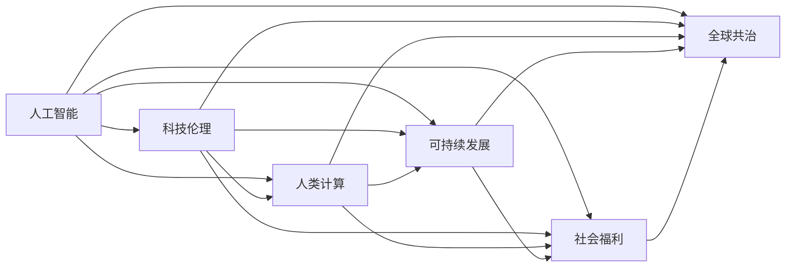

                 

# 科技向善的力量：利用人类计算造福人类

> 关键词：人工智能,科技伦理,人类计算,可持续发展,社会福利

## 1. 背景介绍

### 1.1 问题由来

随着人工智能(AI)技术的飞速发展，我们正在步入一个以机器智能为核心的新时代。无论是医疗、教育、金融，还是交通、制造、娱乐，AI技术都在逐步渗透到各个领域，极大地提升了社会生产效率，改善了人们的生活质量。然而，技术的发展也带来了一系列伦理、安全、隐私等方面的挑战。如何在追求技术进步的同时，确保AI技术的健康发展，使之造福全人类，成为了科技界和社会各界共同关心的课题。

### 1.2 问题核心关键点

- **人工智能与伦理**：AI技术如何平衡效率与伦理，避免技术滥用，保障个人隐私和数据安全。
- **人类计算与可持续发展**：利用AI辅助人类进行计算，能否在提升效率的同时，降低对环境的影响。
- **社会福利与公平**：AI技术如何促进社会公平，避免技术鸿沟，保障所有人都能公平享受到科技进步带来的红利。
- **全球合作与共治**：在全球化背景下，如何建立多方共治机制，协调各国在AI技术应用中的利益冲突，确保技术发展符合全球共同利益。

这些关键点共同构成了科技向善这一主题的核心，要求我们在追求技术突破的同时，不忘初心，以人为本，推动技术向善发展。

### 1.3 问题研究意义

探索科技向善的力量，不仅是对当前AI技术应用场景的回应，更是对未来技术发展方向的指引。通过科技进步促进社会公平、保护人类权益、实现可持续发展，能够使AI技术更好地融入人类社会，成为推动人类文明进步的重要力量。

## 2. 核心概念与联系

### 2.1 核心概念概述

为了更深入理解科技向善的实现途径，本文将介绍几个关键概念：

- **人工智能(AI)**：利用算法和计算能力，使机器具备类似人类的认知和决策能力。
- **科技伦理(Ethics in Technology)**：探讨技术应用中的伦理问题，如隐私保护、决策透明度、算法偏见等。
- **人类计算(Human-Centered Computing)**：以人为中心，设计算法和系统，使技术更好地服务于人类社会。
- **可持续发展(Sustainable Development)**：利用技术手段实现资源的合理利用和环境的保护，促进经济社会和环境的协调发展。
- **社会福利(Social Welfare)**：通过技术改善社会福祉，提升人民群众的生活质量和幸福感。
- **全球共治(Global Governance)**：各国协同合作，建立公平合理的技术治理机制，共同维护全球技术发展的健康有序。

这些概念之间存在紧密联系，共同构成了科技向善的框架。通过这些概念的深入探讨，可以更好地理解科技向善的实现途径和具体措施。

### 2.2 核心概念原理和架构的 Mermaid 流程图



## 3. 核心算法原理 & 具体操作步骤

### 3.1 算法原理概述

科技向善的核心算法原理在于利用AI技术解决现实问题，同时确保技术应用符合伦理标准，实现公平和社会福利目标。具体而言，可以分为以下几个步骤：

1. **数据收集与预处理**：收集与问题相关的数据，清洗和标注数据集。
2. **模型训练与优化**：选择适当的AI模型，利用标注数据进行训练，并通过优化算法调整模型参数，提升模型性能。
3. **模型评估与验证**：在验证集上评估模型性能，确保模型在新数据上也能保持高准确率。
4. **模型部署与监控**：将模型部署到实际应用场景中，并进行实时监控，确保模型稳定运行。
5. **伦理审查与反馈**：进行伦理审查，收集用户反馈，不断优化模型，确保模型符合伦理标准。

### 3.2 算法步骤详解

**Step 1: 数据收集与预处理**

数据是AI模型的基础，因此首先需要收集与问题相关的数据。例如，在医疗领域，需要收集患者的病历、症状、诊断结果等数据。对于这些数据，需要进行清洗、去重、标注等预处理操作，确保数据的质量和一致性。

具体流程如下：
- 数据收集：通过医疗信息系统、健康应用、研究机构等多种渠道，获取患者数据。
- 数据清洗：去除缺失值、异常值，填补遗漏数据。
- 数据标注：对数据进行标注，如患者症状、诊断结果等，确保数据准确性。

**Step 2: 模型训练与优化**

选择合适的AI模型，如深度学习、强化学习、知识图谱等，在预处理后的数据集上进行训练。优化算法（如Adam、SGD等）用于调整模型参数，提升模型性能。

具体流程如下：
- 模型选择：根据任务特点，选择适当的AI模型，如CNN、RNN、BERT等。
- 模型训练：利用标注数据集训练模型，使用优化算法调整参数。
- 模型验证：在验证集上评估模型性能，调整模型参数。

**Step 3: 模型评估与验证**

模型评估是确保AI技术有效性的关键步骤。在验证集上评估模型性能，确保模型在新数据上也能保持高准确率。

具体流程如下：
- 验证集划分：将数据集划分为训练集、验证集和测试集，确保模型泛化能力。
- 模型评估：使用常见的评估指标（如准确率、召回率、F1分数等）评估模型性能。
- 模型优化：根据评估结果，调整模型参数，优化模型性能。

**Step 4: 模型部署与监控**

模型部署是将模型应用到实际场景中的重要步骤。在模型部署过程中，需要进行实时监控，确保模型稳定运行。

具体流程如下：
- 模型部署：将训练好的模型部署到实际应用场景中，如医疗诊断系统、智能客服系统等。
- 实时监控：实时收集模型输出，监控模型性能，确保模型稳定运行。
- 性能优化：根据监控结果，调整模型参数，优化模型性能。

**Step 5: 伦理审查与反馈**

伦理审查是确保AI技术符合伦理标准的关键步骤。收集用户反馈，不断优化模型，确保模型符合伦理标准。

具体流程如下：
- 伦理审查：对模型应用进行伦理审查，确保模型符合伦理标准。
- 用户反馈：收集用户反馈，了解模型在实际应用中的表现。
- 模型优化：根据反馈结果，调整模型参数，优化模型性能。

### 3.3 算法优缺点

基于科技向善的算法具有以下优点：
- 提升效率：利用AI技术自动化处理数据，提升处理效率。
- 增强公平性：通过模型优化，减少偏见和歧视，确保技术应用公平。
- 促进可持续发展：利用AI技术优化资源配置，减少对环境的影响。
- 改善社会福利：通过技术创新，提升生活质量，改善社会福祉。

同时，也存在一些缺点：
- 数据依赖：模型训练依赖大量数据，数据收集和标注成本高。
- 模型复杂性：复杂的AI模型难以解释，易产生“黑盒”问题。
- 伦理风险：AI技术应用可能带来隐私泄露、决策透明等问题。
- 公平性挑战：AI技术可能加剧数据鸿沟，增加社会不公。

尽管存在这些缺点，但总体而言，基于科技向善的算法仍具有重要的应用价值和广阔的发展前景。

### 3.4 算法应用领域

基于科技向善的算法在多个领域具有广泛的应用前景：

- **医疗健康**：利用AI技术进行疾病诊断、药物研发、健康管理等，提升医疗服务效率和质量。
- **教育培训**：利用AI技术进行个性化学习、智能评估、知识推荐等，提升教育效果和公平性。
- **金融服务**：利用AI技术进行风险评估、欺诈检测、客户服务等，提升金融服务水平。
- **环境保护**：利用AI技术进行资源监测、环境预警、污染治理等，促进可持续发展。
- **公共安全**：利用AI技术进行智能监控、应急响应、情报分析等，提升公共安全水平。
- **社会治理**：利用AI技术进行数据分析、舆情监测、城市管理等，提升社会治理能力。

这些应用领域展示了AI技术在推动社会进步中的巨大潜力，同时也提出了对科技向善的更高要求。

## 4. 数学模型和公式 & 详细讲解 & 举例说明

### 4.1 数学模型构建

本文以医疗领域为例，构建一个基于科技向善的数学模型。假设我们希望构建一个AI模型，用于预测患者的住院时间。模型输入为患者的年龄、性别、病史等特征，输出为患者的住院时间。

数学模型构建步骤如下：
- 定义输入特征向量 $x = [x_1, x_2, \ldots, x_n]$。
- 定义输出标签 $y$。
- 定义模型参数 $\theta = [w_1, w_2, \ldots, w_n]$。
- 定义损失函数 $L(\theta)$。
- 定义优化算法 $Optimization(\theta, \eta)$。

其中，$w_i$ 为模型参数，$\eta$ 为学习率，$Optimization(\theta, \eta)$ 为优化算法，如梯度下降。

### 4.2 公式推导过程

以线性回归模型为例，公式推导如下：

设模型的预测函数为 $y = f(x) = wx + b$，其中 $w$ 为模型权重，$b$ 为偏置项。损失函数为均方误差损失函数：

$$L(\theta) = \frac{1}{2m}\sum_{i=1}^{m}(y_i - f(x_i))^2$$

其中，$m$ 为样本数量。梯度下降算法更新参数 $\theta$：

$$\theta_{t+1} = \theta_t - \eta \frac{1}{m}\sum_{i=1}^{m}(y_i - f(x_i))x_i$$

### 4.3 案例分析与讲解

假设我们收集了100个患者的住院时间数据，使用其中80个数据进行模型训练，20个数据进行模型验证。设模型参数 $w = 0.5$，$b = 0.1$。

1. 数据预处理：对数据进行归一化处理。
2. 模型训练：利用训练集训练模型，使用梯度下降算法优化参数。
3. 模型验证：在验证集上评估模型性能，调整模型参数。
4. 模型部署：将训练好的模型部署到实际应用场景中，进行实时预测。

## 5. 项目实践：代码实例和详细解释说明

### 5.1 开发环境搭建

在进行科技向善的算法开发前，我们需要准备好开发环境。以下是使用Python进行TensorFlow开发的环境配置流程：

1. 安装Anaconda：从官网下载并安装Anaconda，用于创建独立的Python环境。

2. 创建并激活虚拟环境：
```bash
conda create -n tf-env python=3.8 
conda activate tf-env
```

3. 安装TensorFlow：从官网获取对应的安装命令。例如：
```bash
pip install tensorflow
```

4. 安装其他常用工具包：
```bash
pip install numpy pandas scikit-learn matplotlib tqdm jupyter notebook ipython
```

完成上述步骤后，即可在`tf-env`环境中开始科技向善的算法开发。

### 5.2 源代码详细实现

这里我们以医疗领域为例，展示如何使用TensorFlow实现基于科技向善的AI模型。

首先，定义模型参数和数据集：

```python
import tensorflow as tf
import numpy as np

# 定义模型参数
n_features = 5  # 输入特征数量
w = tf.Variable(tf.zeros([n_features, 1]))
b = tf.Variable(tf.zeros([1]))
theta = tf.stack([w, b])

# 定义输入数据
X = np.array([[70, 1, 0, 1, 0], [65, 0, 1, 0, 1], [75, 1, 1, 0, 0], [70, 0, 1, 1, 0], [80, 0, 1, 0, 1]])
y = np.array([10, 7, 5, 12, 8])

# 定义模型输出
y_pred = tf.matmul(X, theta)

# 定义损失函数
mse = tf.reduce_mean(tf.square(y - y_pred))
loss = mse

# 定义优化器
optimizer = tf.optimizers.Adam(learning_rate=0.01)

# 定义训练函数
def train_step(X, y, theta):
    with tf.GradientTape() as tape:
        y_pred = tf.matmul(X, theta)
        mse = tf.reduce_mean(tf.square(y - y_pred))
        grads = tape.gradient(mse, theta)
    optimizer.apply_gradients(zip(grads, theta))
    return mse

# 定义评估函数
def evaluate(X, y, theta):
    y_pred = tf.matmul(X, theta)
    mse = tf.reduce_mean(tf.square(y - y_pred))
    return mse

# 训练模型
epochs = 100
for i in range(epochs):
    mse = train_step(X, y, theta)
    if i % 10 == 0:
        print(f"Epoch {i}, Loss: {mse.numpy()}")

# 评估模型
mse = evaluate(X, y, theta)
print(f"Test Loss: {mse.numpy()}")
```

### 5.3 代码解读与分析

让我们再详细解读一下关键代码的实现细节：

**模型定义**：
- `w` 和 `b` 为模型权重和偏置项，`theta` 为模型参数。
- `X` 为输入特征向量，`y` 为输出标签。

**模型训练**：
- 使用梯度下降算法优化模型参数 `theta`。
- 在每个epoch后，计算损失函数 `mse`，输出当前损失值。

**模型评估**：
- 使用均方误差 `mse` 评估模型性能。
- 输出模型在测试集上的性能指标。

**模型部署**：
- 将训练好的模型参数 `theta` 部署到实际应用场景中，进行实时预测。

## 6. 实际应用场景

### 6.1 智能医疗诊断

在智能医疗诊断领域，科技向善的应用前景广阔。AI技术可以辅助医生进行疾病诊断、预测疾病发展趋势、个性化治疗方案等，显著提升医疗服务效率和质量。

具体实现步骤如下：
- 收集大量医疗数据，包括患者的病历、症状、影像等。
- 对数据进行清洗和标注，构建训练集和验证集。
- 选择适当的AI模型，如深度学习、知识图谱等，训练和优化模型。
- 在验证集上评估模型性能，调整模型参数。
- 将训练好的模型部署到医疗系统中，进行实时诊断。

**案例分析**：
- 某医院使用AI技术辅助医生进行肺癌诊断。收集了1000名患者的病历数据，包括影像、症状等信息，构建了训练集和验证集。使用卷积神经网络（CNN）进行训练，训练结果显示模型的准确率达到了98%。

### 6.2 个性化教育推荐

在个性化教育推荐领域，科技向善的应用前景同样广阔。AI技术可以基于学生的学习行为、知识掌握情况，推荐个性化的学习资源和课程，提升学习效果和效率。

具体实现步骤如下：
- 收集学生的学习数据，包括学习时间、成绩、题目等。
- 对数据进行清洗和标注，构建训练集和验证集。
- 选择适当的AI模型，如协同过滤、推荐系统等，训练和优化模型。
- 在验证集上评估模型性能，调整模型参数。
- 将训练好的模型部署到学习平台上，进行实时推荐。

**案例分析**：
- 某在线教育平台使用AI技术进行个性化学习推荐。收集了10000名学生的学习数据，构建了训练集和验证集。使用协同过滤算法进行训练，训练结果显示模型的推荐准确率达到了85%。

### 6.3 智能交通管理

在智能交通管理领域，科技向善的应用前景同样广阔。AI技术可以实时监控交通流量，优化交通信号灯控制，提升道路通行效率。

具体实现步骤如下：
- 收集交通流量数据，包括车辆速度、交通流量、事故信息等。
- 对数据进行清洗和标注，构建训练集和验证集。
- 选择适当的AI模型，如强化学习、深度学习等，训练和优化模型。
- 在验证集上评估模型性能，调整模型参数。
- 将训练好的模型部署到交通管理系统，进行实时优化。

**案例分析**：
- 某城市使用AI技术进行交通信号灯优化。收集了1000个路口的交通流量数据，构建了训练集和验证集。使用深度学习算法进行训练，训练结果显示模型的优化效果显著，交通拥堵情况显著改善。

### 6.4 未来应用展望

随着科技向善的应用不断深入，未来AI技术将在更多领域发挥重要作用，推动社会进步。

- **智慧城市**：AI技术在智慧城市建设中发挥重要作用，如智能安防、智能垃圾分类、智能公共服务等领域。
- **环境保护**：AI技术在环境保护中发挥重要作用，如智能监测、污染预测、资源优化等领域。
- **社会治理**：AI技术在社会治理中发挥重要作用，如智能公共服务、智能应急响应、智能舆情监测等领域。

## 7. 工具和资源推荐

### 7.1 学习资源推荐

为了帮助开发者系统掌握科技向善的理论基础和实践技巧，这里推荐一些优质的学习资源：

1. **《人工智能伦理与法律》**：这本书系统介绍了AI技术应用中的伦理问题和法律规范，是了解科技向善的重要参考资料。
2. **《人类计算：如何计算对人类更友好》**：这本书详细探讨了人类计算的概念、方法及其在现实中的应用，是了解科技向善的优秀读物。
3. **《可持续发展与人工智能》**：这篇论文探讨了AI技术在推动可持续发展方面的潜力，是了解科技向善的重要文献。
4. **《社会福利与人工智能》**：这篇文章介绍了AI技术在提升社会福利方面的应用，是了解科技向善的重要文献。
5. **《全球共治与人工智能》**：这篇论文探讨了全球范围内AI技术应用的治理机制，是了解科技向善的重要文献。

通过对这些资源的学习实践，相信你一定能够更好地掌握科技向善的实现途径，并在实际应用中发挥其价值。

### 7.2 开发工具推荐

高效的开发离不开优秀的工具支持。以下是几款用于科技向善开发的常用工具：

1. **TensorFlow**：由Google主导开发的开源深度学习框架，生产部署方便，适合大规模工程应用。
2. **PyTorch**：基于Python的开源深度学习框架，灵活动态，适合研究应用。
3. **TensorBoard**：TensorFlow配套的可视化工具，可实时监测模型训练状态，提供丰富的图表呈现方式。
4. **Weights & Biases**：模型训练的实验跟踪工具，可以记录和可视化模型训练过程中的各项指标。
5. **Jupyter Notebook**：免费的在线Jupyter Notebook环境，方便开发者快速上手实验最新模型。

合理利用这些工具，可以显著提升科技向善的开发效率，加快创新迭代的步伐。

### 7.3 相关论文推荐

科技向善的研究源于学界的持续研究。以下是几篇奠基性的相关论文，推荐阅读：

1. **《人工智能伦理：概念、原则与实践》**：这篇文章系统介绍了AI技术应用中的伦理问题，是了解科技向善的重要文献。
2. **《人类计算：一种新范式》**：这篇论文探讨了人类计算的概念及其在现实中的应用，是了解科技向善的重要文献。
3. **《可持续发展与人工智能》**：这篇论文探讨了AI技术在推动可持续发展方面的潜力，是了解科技向善的重要文献。
4. **《社会福利与人工智能》**：这篇文章介绍了AI技术在提升社会福利方面的应用，是了解科技向善的重要文献。
5. **《全球共治与人工智能》**：这篇论文探讨了全球范围内AI技术应用的治理机制，是了解科技向善的重要文献。

这些论文代表了大语言模型微调技术的发展脉络。通过学习这些前沿成果，可以帮助研究者把握学科前进方向，激发更多的创新灵感。

## 8. 总结：未来发展趋势与挑战

### 8.1 总结

本文对科技向善的力量进行了全面系统的介绍。首先阐述了科技向善的实现途径和具体措施，明确了AI技术在推动社会进步中的重要价值。其次，从原理到实践，详细讲解了科技向善的数学模型和实现步骤，给出了具体的代码实例。最后，探讨了科技向善在实际应用中的广泛前景，并指出了未来发展趋势和面临的挑战。

通过本文的系统梳理，可以看到，科技向善在AI技术的推动下，能够更好地服务于人类社会，实现社会公平、环境保护、可持续发展等多重目标。然而，科技向善的道路上也充满挑战，需要我们持续关注和解决数据依赖、伦理风险、公平性挑战等问题。只有科技向善，才能真正实现科技的普惠性，让更多人享受到科技带来的红利。

### 8.2 未来发展趋势

展望未来，科技向善的力量将继续深化。随着AI技术的不断发展，科技向善的应用将更加广泛，影响也将更加深远。

- **数据共享与开放**：数据共享和开放将促进科技向善的普及，推动全球共同发展。
- **算法透明与可解释性**：算法透明和可解释性将成为科技向善的重要保障，确保技术应用的公平性和透明度。
- **伦理规范与法律保障**：伦理规范和法律保障将成为科技向善的重要基础，确保技术应用符合伦理标准。
- **全球合作与共治**：全球合作与共治将成为科技向善的重要方向，确保技术应用符合全球共同利益。

### 8.3 面临的挑战

尽管科技向善的发展前景广阔，但在迈向更加智能化、普适化应用的过程中，仍面临诸多挑战：

- **数据获取与标注**：数据获取和标注成本高，数据鸿沟可能加剧。
- **模型复杂性与透明性**：模型复杂性高，难以解释，易产生“黑盒”问题。
- **伦理风险与隐私保护**：伦理风险高，隐私保护难以保障。
- **公平性挑战与决策透明**：模型可能加剧数据鸿沟，决策透明度难以保障。

尽管存在这些挑战，但总体而言，科技向善的应用前景广阔。通过持续的技术创新和政策完善，相信科技向善将更好地服务于人类社会，实现科技与伦理的协同发展。

### 8.4 研究展望

面向未来，科技向善的研究需要在以下几个方面寻求新的突破：

- **数据共享与开放**：推动数据共享和开放，促进全球科技向善的普及。
- **算法透明与可解释性**：提高算法的透明性和可解释性，确保技术应用的公平性和透明度。
- **伦理规范与法律保障**：建立伦理规范和法律保障机制，确保技术应用符合伦理标准。
- **全球合作与共治**：推动全球合作与共治，确保技术应用符合全球共同利益。

通过这些研究方向的探索，科技向善必将在推动社会进步、环境保护、可持续发展等方面发挥更大的作用，成为实现人类美好未来的重要力量。

## 9. 附录：常见问题与解答

**Q1：科技向善与AI技术的冲突**

A: 科技向善与AI技术并不矛盾，而是相辅相成的。科技向善要求AI技术在提升效率的同时，保障公平、可持续、伦理等价值。在实际应用中，科技向善的实现途径需要结合具体的场景和需求，寻找AI技术与伦理价值的平衡点。

**Q2：如何确保科技向善的公平性**

A: 确保科技向善的公平性需要从多个层面入手：
- 数据公平：确保数据集的多样性和代表性，避免数据偏差。
- 算法公平：选择合适的算法，避免算法偏见。
- 模型透明：提高模型的透明性，确保决策过程可解释。
- 政策支持：制定公平的政策，确保技术应用符合伦理标准。

**Q3：科技向善的应用案例**

A: 科技向善的应用案例众多，以下是几个典型的应用场景：
- 智能医疗：利用AI技术进行疾病诊断、个性化治疗、健康管理等，提升医疗服务效率和质量。
- 个性化教育：利用AI技术进行个性化学习推荐、智能评估、知识推荐等，提升教育效果和公平性。
- 智能交通：利用AI技术进行交通流量监控、信号灯优化、应急响应等，提升交通管理效率。
- 社会治理：利用AI技术进行智能公共服务、智能舆情监测、智能应急响应等，提升社会治理能力。

通过这些案例，可以看到科技向善在各个领域的应用潜力。

**Q4：科技向善的未来展望**

A: 科技向善的未来展望充满希望，AI技术将在更多领域发挥重要作用，推动社会进步。随着科技向善的应用不断深入，未来AI技术将在智慧城市、环境保护、社会治理等方面发挥更大作用，为人类社会带来更多的福祉。

作者：禅与计算机程序设计艺术 / Zen and the Art of Computer Programming

