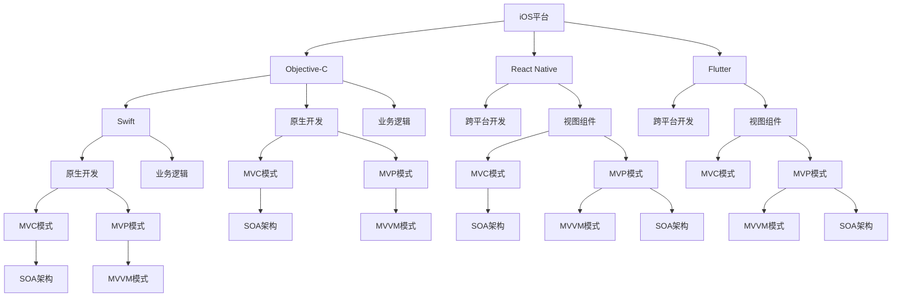

                 

# 移动端全栈开发：iOS和Android平台技能

> 关键词：iOS, Android, Full Stack Development, React Native, Flutter, Swift, Kotlin, MVC, MVP, MVVM, Service-oriented Architecture

## 1. 背景介绍

### 1.1 问题由来
随着移动互联网的迅猛发展，移动应用市场呈现出快速增长的趋势。在移动应用开发中，iOS和Android成为两大主流平台，分别由苹果和安卓生态系统支持。但传统的移动应用开发方法，如原生的iOS开发使用Objective-C和Swift，Android开发使用Java或Kotlin，造成了跨平台开发的困难和效率低下。

为了解决这些问题，许多开发者尝试了跨平台开发框架和全栈开发技术。全栈开发技能使得开发者能够在iOS和Android两个平台上统一使用相同的技术栈，提高开发效率，减少代码重复和维护成本。

### 1.2 问题核心关键点
全栈开发技能涉及多个技术和概念，包括移动端技术栈、前端技术栈、全栈开发框架、跨平台开发技术等。本文将从这些核心关键点出发，深入探讨iOS和Android平台的全栈开发技能。

### 1.3 问题研究意义
掌握全栈开发技能，对于提升移动应用的开发效率，优化资源利用，降低成本，提高应用的稳定性和可维护性具有重要意义。此外，全栈开发技能还可以帮助开发者拓展技术视野，增强跨平台、跨语言、跨领域的开发能力，推动技术的不断进步。

## 2. 核心概念与联系

### 2.1 核心概念概述

为更好地理解全栈开发技能，本节将介绍几个密切相关的核心概念：

- iOS平台：苹果公司开发的移动操作系统，支持iPhone、iPad等设备。基于Objective-C和Swift进行开发。
- Android平台：谷歌公司开发的移动操作系统，支持各类安卓手机。基于Java或Kotlin进行开发。
- React Native：由Facebook开发的跨平台开发框架，支持iOS和Android平台的移动应用开发，提供类似原生的用户体验。
- Flutter：由谷歌开发的跨平台移动应用开发框架，支持iOS和Android平台，使用Dart语言开发。
- MVC模式：Model-View-Controller（模型-视图-控制器），一种常见的软件设计模式，用于分离内层业务逻辑和外层用户界面。
- MVP模式：Model-View-Presenter（模型-视图-呈现器），一种MVC模式的变体，强调了业务逻辑和视图的分离，提高代码的可维护性。
- MVVM模式：Model-View-ViewModel（模型-视图-视图模型），一种MVC模式的改进，增加了ViewModel层，用于业务逻辑和视图的解耦。
- Service-oriented Architecture（SOA）：面向服务的架构，一种软件设计风格，强调服务组件的独立性和可复用性，支持多种平台和语言的调用。

这些核心概念之间的逻辑关系可以通过以下Mermaid流程图来展示：



这个流程图展示了一体化全栈开发技能的技术栈及其核心概念的关系：

1. iOS和Android平台作为移动应用的核心底层平台，分别基于Objective-C/Swift和Java/Kotlin进行开发。
2. React Native和Flutter是两大跨平台开发框架，支持iOS和Android平台的移动应用开发。
3. MVC、MVP和MVVM是常见的软件设计模式，用于优化移动应用的设计和开发。
4. SOA架构强调服务的独立性和可复用性，支持多种平台和语言的调用。

这些概念共同构成了iOS和Android平台全栈开发技能的核心框架，为开发高效、跨平台的移动应用提供了理论基础。

## 3. 核心算法原理 & 具体操作步骤
### 3.1 算法原理概述

全栈开发技能不仅需要掌握移动平台的技术栈，还需要深入理解跨平台开发框架和设计模式的原理。其核心思想是：通过一种技术栈，在iOS和Android两个平台上实现统一开发，优化资源利用，提高开发效率。

在iOS和Android平台上，全栈开发技术通常通过以下步骤实现：

1. 选择合适的跨平台开发框架（如React Native或Flutter）。
2. 设计应用架构，选择合适的设计模式（如MVC、MVP、MVVM等）。
3. 在跨平台开发框架中实现应用的功能模块。
4. 集成原生平台的特性，提供原生用户体验。
5. 进行代码优化和性能调优，确保应用的高效运行。

### 3.2 算法步骤详解

以下是iOS和Android平台全栈开发技能的核心算法步骤：

**Step 1: 选择合适的跨平台开发框架**
- 根据项目需求和团队技术栈，选择React Native或Flutter作为跨平台开发框架。
- 了解两种框架的核心原理和特性，评估其性能和稳定性。
- 熟悉框架的安装和配置，为后续开发奠定基础。

**Step 2: 设计应用架构**
- 确定应用的核心功能和用户体验需求。
- 选择合适的设计模式，如MVC、MVP、MVVM等。
- 设计应用的层次结构，包括数据层、业务逻辑层、视图层等。
- 确定各层之间的通信方式，选择合适的框架和工具。

**Step 3: 实现应用功能模块**
- 在跨平台开发框架中，使用框架提供的组件库和工具实现应用功能模块。
- 通过框架提供的API和组件，实现视图、业务逻辑等功能。
- 使用框架提供的钩子和回调机制，处理组件之间的交互和状态管理。

**Step 4: 集成原生平台特性**
- 根据应用需求，集成原生平台特性，如相机、定位、推送通知等。
- 使用框架提供的原生模块，实现原生功能。
- 进行功能测试，确保原生功能的正常运行和用户体验。

**Step 5: 优化代码和性能调优**
- 分析应用的性能瓶颈，进行代码优化。
- 使用框架提供的性能分析工具，优化应用性能。
- 进行功能测试和压力测试，确保应用的稳定性和可靠性。

**Step 6: 发布和维护**
- 在应用发布前，进行版本管理和发布测试。
- 使用框架提供的发布工具，打包发布应用。
- 持续关注应用的性能和用户体验，进行维护和更新。

### 3.3 算法优缺点

全栈开发技能具有以下优点：
1. 提高开发效率。通过跨平台开发框架，减少代码重复和维护成本。
2. 统一技术栈。开发团队可以使用相同的语言和框架，提高开发效率和可维护性。
3. 优化资源利用。跨平台开发框架可以复用大量组件和库，减少开发工作量。
4. 提高应用质量。全栈开发技能能够保证应用在多个平台上的统一性和稳定性。

同时，全栈开发技能也存在以下缺点：
1. 学习成本高。需要掌握多种技术和框架，学习曲线较陡峭。
2. 性能问题。跨平台开发框架的性能可能不如原生应用，需要进行性能优化。
3. 功能限制。跨平台开发框架的功能和原生应用相比，存在一定限制。
4. 兼容性问题。跨平台开发框架的兼容性问题，需要不断迭代和优化。

尽管存在这些缺点，但全栈开发技能仍然是移动应用开发的主流范式。未来相关研究的重点在于如何进一步优化跨平台开发框架的性能，增强其兼容性，降低学习成本，推动技术的不断进步。

### 3.4 算法应用领域

全栈开发技能已经广泛应用于iOS和Android平台的移动应用开发，覆盖了几乎所有类型的应用，包括：

- 社交媒体应用：如微信、微博等，提供即时通讯、信息推送、内容分享等功能。
- 电子商务应用：如淘宝、京东等，提供商品搜索、购物车、支付结算等功能。
- 教育应用：如Coursera、Duolingo等，提供在线课程、学习社区、学习工具等功能。
- 健康应用：如HealthKit、Fitbit等，提供健康监测、运动记录、数据分析等功能。
- 旅游应用：如TripAdvisor、Expedia等，提供酒店预订、景点推荐、行程规划等功能。
- 金融应用：如支付宝、PayPal等，提供账户管理、支付结算、金融理财等功能。
- 游戏应用：如王者荣耀、PUBG等，提供游戏对战、角色扮演、多人竞技等功能。

除了上述这些经典应用外，全栈开发技能还被创新性地应用于更多场景中，如跨平台Web应用、VR/AR应用、物联网应用等，为移动应用技术带来了全新的突破。

## 4. 数学模型和公式 & 详细讲解 & 举例说明
### 4.1 数学模型构建

全栈开发技能涉及多个技术和概念，但主要关注软件设计和开发流程，而不涉及具体的数学模型。因此，本文不展开数学模型的讨论，而是重点介绍技术实现和应用案例。

## 5. 项目实践：代码实例和详细解释说明
### 5.1 开发环境搭建

在进行全栈开发实践前，我们需要准备好开发环境。以下是使用React Native进行iOS和Android平台开发的开发环境配置流程：

1. 安装Node.js和npm：从官网下载并安装Node.js，并全局安装npm。
2. 安装React Native CLI：通过npm安装React Native CLI。
3. 安装Android Studio和Xcode：下载并安装Android Studio和Xcode，分别用于Android平台和iOS平台的应用开发。
4. 安装Java和Android SDK：通过Android Studio安装Java和Android SDK，为Android平台开发提供支持。

完成上述步骤后，即可在开发环境中开始全栈开发实践。

### 5.2 源代码详细实现

以下是一个使用React Native进行iOS和Android平台开发的基本示例。

```javascript
import React, { Component } from 'react';
import { StyleSheet, Text, View } from 'react-native';

export default class App extends Component {
  render() {
    return (
      <View style={styles.container}>
        <Text style={styles.welcome}>
          Hello, World!
        </Text>
      </View>
    );
  }
}

const styles = StyleSheet.create({
  container: {
    flex: 1,
    justifyContent: 'center',
    alignItems: 'center',
    backgroundColor: '#F5FCFF',
  },
  welcome: {
    fontSize: 20,
    textAlign: 'center',
    margin: 10,
  },
});
```

### 5.3 代码解读与分析

让我们再详细解读一下关键代码的实现细节：

**App组件**：
- `App`是React Native应用的基本组件，负责渲染整个应用的根视图。
- 通过`import`语句导入React和`react-native`库，以便使用其中的组件和样式。
- 在`render`方法中，使用`View`和`Text`组件创建应用的基本视图，展示欢迎信息。
- `StyleSheet.create`方法用于创建应用中使用的样式表，通过`style`属性应用到组件上。

**样式表**：
- `styles.container`定义了应用容器的样式，设置背景颜色、布局方式和内容居中。
- `styles.welcome`定义了欢迎信息的样式，设置字体大小、对齐方式和内边距。

**运行结果展示**：
- 运行代码后，应用会展示一个带有欢迎信息的简单页面。
- 在iOS和Android平台上，应用界面和用户体验保持一致，展示了全栈开发技能的优势。

## 6. 实际应用场景
### 6.1 电商应用

全栈开发技能在电商应用中得到广泛应用。电商平台需要处理复杂的业务逻辑和用户交互，同时需要支持多种平台和设备的访问。通过全栈开发技术，电商应用可以在iOS和Android平台上实现一致的用户体验，提供稳定可靠的服务。

在电商应用开发中，可以基于React Native或Flutter框架，设计MVC或MVP模式的应用架构。通过集成原生组件和API，实现购物车、支付结算、商品搜索等功能。同时，通过跨平台开发框架，优化资源利用，提高应用性能和用户体验。

### 6.2 教育应用

教育应用需要提供丰富的学习资源和互动体验，支持多种学习方式和设备。通过全栈开发技术，教育应用可以在iOS和Android平台上提供统一的用户体验，支持移动学习和互动教学。

在教育应用开发中，可以基于React Native或Flutter框架，设计MVC或MVP模式的应用架构。通过集成原生组件和API，实现课程学习、在线测试、互动交流等功能。同时，通过跨平台开发框架，优化资源利用，提高应用性能和用户体验。

### 6.3 健康应用

健康应用需要处理大量的用户数据和健康监测信息，支持多种设备和传感器的接入。通过全栈开发技术，健康应用可以在iOS和Android平台上实现一致的用户体验，提供实时健康监测和数据分析服务。

在健康应用开发中，可以基于React Native或Flutter框架，设计MVC或MVP模式的应用架构。通过集成原生组件和API，实现健康监测、运动记录、数据分析等功能。同时，通过跨平台开发框架，优化资源利用，提高应用性能和用户体验。

### 6.4 未来应用展望

随着全栈开发技术的不断发展，其在iOS和Android平台上的应用前景将更加广阔。未来，全栈开发技能将进一步拓展到更多领域，如智能家居、智能穿戴、智慧城市等，推动技术的不断进步和创新。

在智能家居领域，全栈开发技能可以应用于智能家居设备的统一管理和控制，提升家居生活的智能化和便捷性。在智能穿戴领域，全栈开发技能可以应用于智能手表、智能眼镜等设备，提供丰富的应用场景和用户互动体验。在智慧城市领域，全栈开发技能可以应用于城市管理、交通调度、公共安全等应用，推动智慧城市的建设和发展。

## 7. 工具和资源推荐
### 7.1 学习资源推荐

为了帮助开发者系统掌握全栈开发技能，这里推荐一些优质的学习资源：

1. React Native官方文档：React Native的官方文档，提供了全面的API和组件库，是学习和开发React Native应用的必备资料。
2. Flutter官方文档：Flutter的官方文档，提供了详细的框架介绍和API参考，是学习和开发Flutter应用的必备资料。
3. iOS开发者指南：苹果公司提供的iOS开发者指南，提供了iOS平台的核心开发知识和API文档，是学习和开发iOS应用的必备资料。
4. Android开发者指南：谷歌公司提供的Android开发者指南，提供了Android平台的核心开发知识和API文档，是学习和开发Android应用的必备资料。
5. React Native学习路径：由React Native社区提供的学习路径，包括入门到进阶的学习资源和实践项目，帮助开发者系统掌握React Native技能。
6. Flutter学习路径：由Flutter社区提供的学习路径，包括入门到进阶的学习资源和实践项目，帮助开发者系统掌握Flutter技能。

通过对这些资源的学习实践，相信你一定能够快速掌握全栈开发技能的精髓，并用于解决实际的开发问题。

### 7.2 开发工具推荐

高效的开发离不开优秀的工具支持。以下是几款用于全栈开发开发的常用工具：

1. VS Code：一款轻量级的开发工具，支持多种编程语言和框架，是React Native和Flutter开发的常用工具。
2. Android Studio：谷歌提供的Android平台开发工具，支持Android应用的全生命周期管理。
3. Xcode：苹果提供的iOS平台开发工具，支持iOS应用的全生命周期管理。
4. npm和Yarn：Node.js的包管理工具，支持安装和发布React Native和Flutter依赖库。
5. Git：版本控制工具，支持全栈开发项目的版本管理和协作开发。
6. React Native CLI和Flutter CLI：跨平台开发框架提供的命令行工具，用于项目初始化和应用构建。

合理利用这些工具，可以显著提升全栈开发任务的开发效率，加快创新迭代的步伐。

### 7.3 相关论文推荐

全栈开发技能涉及多个技术和概念，相关的学术论文也层出不穷。以下是几篇代表性的论文，推荐阅读：

1. React Native技术探讨：探讨React Native的核心技术原理和性能优化方法，帮助开发者深入理解React Native的实现机制。
2. Flutter框架分析：分析Flutter的核心技术架构和性能优化策略，帮助开发者掌握Flutter框架的底层实现。
3. iOS和Android平台对比：对比iOS和Android平台的核心技术差异和开发策略，帮助开发者选择合适的跨平台开发框架。
4. MVC、MVP、MVVM模式对比：对比MVC、MVP、MVVM模式的核心思想和设计原则，帮助开发者选择合适的设计模式。
5. Service-oriented Architecture（SOA）分析：分析SOA架构的核心思想和实现方法，帮助开发者构建可复用、可扩展的软件系统。

这些论文代表了大语言模型微调技术的发展脉络。通过学习这些前沿成果，可以帮助研究者把握学科前进方向，激发更多的创新灵感。

## 8. 总结：未来发展趋势与挑战
### 8.1 总结

本文对iOS和Android平台的全栈开发技能进行了全面系统的介绍。首先阐述了全栈开发技能的研究背景和意义，明确了全栈开发技能在提高开发效率、优化资源利用、降低成本方面的独特价值。其次，从原理到实践，详细讲解了全栈开发的核心算法和具体操作步骤，给出了全栈开发技能开发的完整代码实例。同时，本文还广泛探讨了全栈开发技能在电商、教育、健康等众多行业领域的应用前景，展示了全栈开发技能的巨大潜力。

通过本文的系统梳理，可以看到，全栈开发技能已经成为iOS和Android平台移动应用开发的主流范式，极大地提升了开发效率和应用质量。未来，伴随跨平台开发框架的不断演进和优化，全栈开发技能必将在更多领域得到应用，推动技术的不断进步。

### 8.2 未来发展趋势

展望未来，全栈开发技能将呈现以下几个发展趋势：

1. 技术栈多样化。随着技术的发展，更多新的跨平台开发框架和技术栈将出现，如Web、AR/VR等，进一步拓展全栈开发的应用场景。
2. 跨平台性能提升。未来，全栈开发框架将不断优化性能，提升跨平台应用的用户体验，缩小原生应用与跨平台应用的差距。
3. 开发工具的集成化。未来的开发工具将更加集成化，支持多种技术和框架的无缝衔接，提升开发效率。
4. 持续学习与改进。全栈开发技能需要不断学习和改进，以适应新的技术和应用需求。
5. 多平台融合。未来的全栈开发将更多地融合多平台、多语言、多设备的技术和知识，实现全栈开发技术的全面融合。

以上趋势凸显了全栈开发技能的广阔前景。这些方向的探索发展，必将进一步提升iOS和Android平台移动应用的质量和性能，推动技术的不断进步。

### 8.3 面临的挑战

尽管全栈开发技能已经取得了瞩目成就，但在迈向更加智能化、普适化应用的过程中，它仍面临着诸多挑战：

1. 学习成本高。全栈开发技能需要掌握多种技术和框架，学习曲线较陡峭。
2. 性能问题。跨平台开发框架的性能可能不如原生应用，需要进行性能优化。
3. 功能限制。跨平台开发框架的功能和原生应用相比，存在一定限制。
4. 兼容性问题。跨平台开发框架的兼容性问题，需要不断迭代和优化。
5. 安全和隐私问题。跨平台应用需要处理不同平台的用户数据，需要特别注意安全和隐私问题。
6. 技术演进快。全栈开发技术快速演进，需要开发者不断学习新知识，跟上技术发展的步伐。

尽管存在这些挑战，但全栈开发技能仍然是iOS和Android平台移动应用开发的主流范式。未来相关研究的重点在于如何进一步优化跨平台开发框架的性能，增强其兼容性，降低学习成本，推动技术的不断进步。

### 8.4 研究展望

面对全栈开发技能所面临的种种挑战，未来的研究需要在以下几个方面寻求新的突破：

1. 探索无监督和半监督开发方法。摆脱对大规模标注数据的依赖，利用自监督学习、主动学习等无监督和半监督范式，最大限度利用非结构化数据，实现更加灵活高效的开发。
2. 研究多平台融合开发技术。开发更加集成化的开发工具和框架，支持多种平台和语言的调用，实现跨平台开发的无缝衔接。
3. 引入更多先验知识。将符号化的先验知识，如知识图谱、逻辑规则等，与全栈开发技术进行巧妙融合，引导全栈开发过程学习更准确、合理的知识表示。
4. 结合因果分析和博弈论工具。将因果分析方法引入全栈开发技术，识别出应用开发的关键特征，增强开发过程的因果性和逻辑性。借助博弈论工具刻画人机交互过程，主动探索并规避应用的脆弱点，提高系统稳定性。
5. 纳入伦理道德约束。在应用开发目标中引入伦理导向的评估指标，过滤和惩罚有偏见、有害的输出倾向。同时加强人工干预和审核，建立应用行为的监管机制，确保输出符合人类价值观和伦理道德。

这些研究方向的探索，必将引领全栈开发技能迈向更高的台阶，为构建安全、可靠、可解释、可控的移动应用系统铺平道路。面向未来，全栈开发技能还需要与其他人工智能技术进行更深入的融合，如知识表示、因果推理、强化学习等，多路径协同发力，共同推动移动应用技术的进步。

## 9. 附录：常见问题与解答

**Q1：全栈开发技能是否适用于所有移动应用开发？**

A: 全栈开发技能适用于大多数移动应用开发，特别是那些需要跨平台支持和优化资源利用的场景。但对于一些特定领域的移动应用，如医疗、法律等，可能需要结合领域特定的开发技术和规范。

**Q2：全栈开发技能是否会影响应用的性能？**

A: 全栈开发技能可以通过跨平台开发框架实现一致的用户体验，但性能问题仍需关注。需要根据具体应用场景，进行性能优化和调优，如代码压缩、资源优化、多线程处理等，以提高应用的响应速度和稳定性。

**Q3：全栈开发技能是否会影响应用的维护成本？**

A: 全栈开发技能可以通过跨平台开发框架减少代码重复和维护成本，但实际维护成本还需根据具体应用需求和技术栈进行调整。需要平衡开发效率和维护成本，选择最适合的技术栈和开发方法。

**Q4：全栈开发技能是否会影响应用的安全性和隐私保护？**

A: 全栈开发技能需要特别注意应用的安全性和隐私保护问题。需要采用加密技术、访问控制、数据脱敏等措施，确保应用数据和用户隐私的安全。同时，还需要建立完善的隐私保护机制，遵守相关法律法规和行业标准。

**Q5：全栈开发技能是否会影响应用的开发成本？**

A: 全栈开发技能可以通过跨平台开发框架优化资源利用，减少开发工作量和维护成本，但实际开发成本还需根据具体应用场景和技术栈进行调整。需要平衡开发成本和应用需求，选择最适合的技术栈和开发方法。

这些常见问题的解答，可以帮助开发者更好地理解全栈开发技能的优势和局限，进一步优化移动应用的开发流程和技术实现。

---

作者：禅与计算机程序设计艺术 / Zen and the Art of Computer Programming

