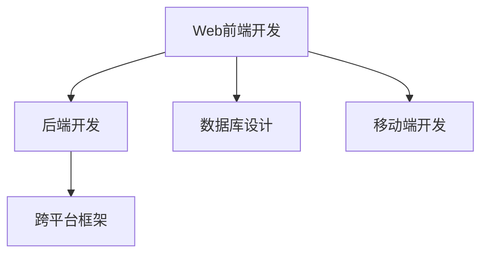

                 

## 1. 背景介绍

### 1.1 问题由来

随着移动设备的普及，越来越多的应用程序需要具备跨平台、跨设备和跨技术栈的灵活性和适应性。传统的Web开发仅限于Web浏览器的访问，难以满足移动设备的复杂需求。为了更好地适应这种变化，全栈开发应运而生。全栈开发人员能够熟练掌握前端、后端、数据库、移动端等多个技术栈，能够高效地设计和开发出功能丰富、性能优越的移动应用程序。

### 1.2 问题核心关键点

移动端全栈开发的核心在于融合多种技术栈，构建统一、高效、跨平台的移动应用程序。它不仅包括传统的Web前端开发、后端开发、数据库设计等技术，还包括移动端应用程序的开发，如iOS、Android等。全栈开发人员需要具备综合技术能力，能够根据项目需求灵活选择技术栈，确保应用程序在不同平台上的稳定性和用户体验。

### 1.3 问题研究意义

移动端全栈开发在提升应用程序开发效率、优化用户体验、降低开发成本方面具有重要意义：

1. **提升开发效率**：全栈开发人员能够同时处理前端和后端的开发任务，减少沟通和协作成本，缩短项目开发周期。
2. **优化用户体验**：全栈开发能够更好地理解前端和后端的交互逻辑，确保前后端数据一致性和性能优化，提升用户满意度。
3. **降低开发成本**：全栈开发能够减少跨部门协作和外部开发资源依赖，降低项目开发成本，提高资源利用率。
4. **扩展技术栈**：全栈开发能够灵活学习和应用多种技术栈，适应行业和技术发展趋势，增强自身技术竞争力。
5. **加速应用上线**：全栈开发能够综合处理应用程序的各个环节，快速响应市场需求，加速应用上线进程。

## 2. 核心概念与联系

### 2.1 核心概念概述

移动端全栈开发涉及多个关键概念，包括：

- **Web前端开发**：使用HTML、CSS、JavaScript等技术，构建用户界面，实现交互逻辑。
- **后端开发**：使用Node.js、Java、Python等技术，处理数据逻辑，提供数据服务。
- **数据库设计**：使用MySQL、MongoDB等技术，设计数据存储结构，确保数据一致性和安全性。
- **移动端开发**：使用Swift、Kotlin等技术，构建原生应用程序，实现本地功能。
- **跨平台框架**：使用React Native、Flutter等技术，构建跨平台应用程序，提高开发效率。

这些概念之间的逻辑关系可以通过以下Mermaid流程图来展示：



这个流程图展示了一个移动端全栈开发项目的主要技术栈和它们之间的联系：

1. Web前端开发负责用户界面的构建和交互逻辑的处理。
2. 后端开发负责数据逻辑的处理和数据服务的提供。
3. 数据库设计负责数据的存储和管理，确保数据一致性和安全性。
4. 移动端开发负责构建原生应用程序，实现本地功能。
5. 跨平台框架用于构建跨平台应用程序，提高开发效率。

这些概念共同构成了移动端全栈开发的基础框架，为开发人员提供了全面的技术指导。

## 3. 核心算法原理 & 具体操作步骤
### 3.1 算法原理概述

移动端全栈开发的核心算法原理主要包括以下几个方面：

- **前后端通信协议**：使用HTTP/HTTPS协议进行前后端数据交互，确保数据传输的安全性和可靠性。
- **数据存储与同步**：使用数据库技术进行数据存储和管理，确保数据一致性和安全性，同时通过同步技术实现数据更新和同步。
- **跨平台技术实现**：使用跨平台框架进行移动端应用程序开发，确保应用程序在不同平台上的兼容性和性能。

### 3.2 算法步骤详解

移动端全栈开发的步骤一般包括以下几个关键步骤：

**Step 1: 需求分析和设计**

1. 与客户沟通，理解项目需求和目标。
2. 设计应用程序的功能、界面和架构，确定技术栈选择。
3. 制定详细的需求规格文档，明确各部分的功能和设计要求。

**Step 2: 前端开发**

1. 选择合适的Web框架，如React、Vue等。
2. 使用HTML、CSS、JavaScript等技术，实现用户界面和交互逻辑。
3. 优化前端性能，确保用户体验良好。

**Step 3: 后端开发**

1. 选择合适的后端框架，如Node.js、Spring Boot等。
2. 设计数据模型和API接口，实现数据逻辑处理和数据服务提供。
3. 优化后端性能，确保服务稳定性和可扩展性。

**Step 4: 数据库设计**

1. 选择合适的数据库，如MySQL、MongoDB等。
2. 设计数据表结构和索引，确保数据一致性和查询效率。
3. 实施数据同步和备份策略，确保数据安全性和可靠性。

**Step 5: 移动端开发**

1. 选择合适的移动端框架，如Swift、Kotlin等。
2. 实现本地功能和用户界面，确保应用程序兼容性和性能。
3. 进行移动端测试，确保应用程序在不同平台上的稳定性。

**Step 6: 集成测试**

1. 对各部分进行集成测试，确保前后端数据交互和应用功能正常。
2. 优化整体性能，确保应用程序响应迅速。

**Step 7: 部署上线**

1. 选择合适的云服务提供商，如AWS、阿里云等。
2. 部署应用程序，进行性能调优和监控。
3. 发布应用程序，提供用户访问。

### 3.3 算法优缺点

移动端全栈开发具有以下优点：

1. **高效开发**：全栈开发人员能够同时处理前端和后端开发任务，减少沟通和协作成本，缩短项目开发周期。
2. **优化用户体验**：全栈开发能够更好地理解前端和后端的交互逻辑，确保前后端数据一致性和性能优化，提升用户满意度。
3. **降低开发成本**：全栈开发能够减少跨部门协作和外部开发资源依赖，降低项目开发成本，提高资源利用率。
4. **扩展技术栈**：全栈开发能够灵活学习和应用多种技术栈，适应行业和技术发展趋势，增强自身技术竞争力。
5. **加速应用上线**：全栈开发能够综合处理应用程序的各个环节，快速响应市场需求，加速应用上线进程。

同时，该方法也存在一定的局限性：

1. **技能要求高**：全栈开发需要掌握多种技术栈，对开发人员的技能要求较高，可能导致招聘难度增加。
2. **开发复杂度高**：全栈开发涉及多个技术栈，开发复杂度高，需要投入更多的开发资源和精力。
3. **维护难度大**：全栈开发的应用程序结构复杂，维护难度大，需要专业的技术团队进行持续维护。

尽管存在这些局限性，但就目前而言，移动端全栈开发仍是提高应用程序开发效率和用户体验的重要方法。未来相关研究的重点在于如何进一步降低开发难度，提高开发效率，同时兼顾跨平台性能和用户体验。

### 3.4 算法应用领域

移动端全栈开发的应用领域广泛，包括但不限于以下几方面：

- **社交网络应用**：如微信、微博等，需要同时处理前后端数据交互、用户界面设计和本地功能实现。
- **电子商务应用**：如淘宝、京东等，需要同时处理用户交易、库存管理和物流跟踪等后端功能。
- **金融科技应用**：如支付宝、蚂蚁金服等，需要同时处理用户交易、资金安全和数据隐私等敏感功能。
- **健康医疗应用**：如丁香医生、健康之路等，需要同时处理用户健康数据管理、医疗咨询和药品推荐等后端功能。
- **教育科技应用**：如网易有道、Coursera等，需要同时处理在线教育、课程管理和用户互动等后端功能。

除了上述这些经典应用外，全栈开发还将在更多领域得到应用，为各行各业带来新的发展机遇。

## 4. 数学模型和公式 & 详细讲解 & 举例说明

### 4.1 数学模型构建

移动端全栈开发涉及多个数学模型，包括Web前端和后端的API接口设计、数据同步算法、跨平台框架实现等。这里以Web前后端通信协议为例，简要介绍其数学模型构建：

**Web前后端通信协议模型**

1. **HTTP协议模型**：使用HTTP协议进行数据交互，确保数据传输的安全性和可靠性。
2. **RESTful API模型**：设计RESTful API接口，遵循无状态、幂等性和资源定位等原则，确保数据交互的清晰性和一致性。

### 4.2 公式推导过程

**HTTP协议模型推导**

1. **请求方法**：使用HTTP请求方法，如GET、POST、PUT、DELETE等，确保数据交互的方式和目的明确。
2. **请求头**：使用HTTP请求头，如Content-Type、Authorization等，确保数据交互的安全性和合法性。
3. **请求体**：使用HTTP请求体，如JSON、XML等，确保数据交互的内容完整性和可读性。

**RESTful API模型推导**

1. **资源定位**：使用RESTful API的资源定位，如/api/user、/api/product等，确保数据交互的清晰性和一致性。
2. **数据格式**：使用JSON、XML等数据格式，确保数据交互的内容完整性和可读性。
3. **状态码**：使用HTTP状态码，如200、404、500等，确保数据交互的反馈和处理方式明确。

### 4.3 案例分析与讲解

**案例：社交网络应用的Web前后端通信协议设计**

1. **请求方法**：使用HTTP POST方法，向服务器提交用户注册请求。
2. **请求头**：使用Content-Type为application/json，确保请求体的JSON格式合法。
3. **请求体**：使用JSON格式的请求体，包括用户名、密码、邮箱等用户信息。
4. **响应**：使用HTTP 201状态码，表示注册成功，返回用户信息。

## 5. 项目实践：代码实例和详细解释说明
### 5.1 开发环境搭建

要进行移动端全栈开发，首先需要准备好开发环境。以下是使用Python进行Flutter开发的环境配置流程：

1. 安装Flutter SDK：从官网下载并安装Flutter SDK。
2. 安装Android Studio和Xcode：分别为Android和iOS平台安装开发环境。
3. 安装Flutter CLI和Dart语言环境：通过Flutter CLI进行Flutter应用开发。
4. 安装Firebase等云服务：用于后端数据同步和推送。

完成上述步骤后，即可在Flutter环境中开始开发。

### 5.2 源代码详细实现

这里我们以Flutter开发社交网络应用为例，给出完整的代码实现。

**Flutter代码**

```dart
import 'package:flutter/material.dart';
import 'package:http/http.dart' as http;

class MainActivity extends StatelessWidget {
  Future<List<User>> getUsers() async {
    var url = Uri.parse('https://api.example.com/users');
    var response = await http.get(url);
    var json = json.decode(response.body);
    return json['users'];
  }

  @override
  Widget build(BuildContext context) {
    return Scaffold(
      appBar: AppBar(
        title: Text('User List'),
      ),
      body: Center(
        child: FutureBuilder<List<User>>(
          future: getUsers(),
          builder: (context, snapshot) {
            if (snapshot.connectionState == ConnectionState.waiting) {
              return Center(child: CircularProgressIndicator());
            } else if (snapshot.hasError) {
              return Center(child: Text('Error: ${snapshot.error}'));
            } else {
              return ListView.builder(
                itemCount: snapshot.data?.length ?? 0,
                itemBuilder: (context, index) {
                  var user = snapshot.data![index];
                  return ListTile(
                    title: Text(user.name),
                    subtitle: Text(user.email),
                  );
                },
              );
            }
          },
        ),
      ),
    );
  }
}

class User {
  final String name;
  final String email;
  User({required this.name, required this.email});
}

```

**代码解读与分析**

1. **Flutter框架**：Flutter是Google开发的一款跨平台移动应用开发框架，使用Dart语言，能够同时生成iOS和Android平台的应用程序。
2. **HTTP请求**：使用http库发送HTTP GET请求，获取服务器返回的用户列表。
3. **Future对象**：使用Future对象进行异步处理，确保用户列表的动态更新。
4. **ListView**：使用ListView部件展示用户列表，确保UI的流畅性和响应性。

### 5.3 运行结果展示

运行上述代码后，能够在移动端应用中展示用户列表，确保应用程序的流畅性和稳定性。具体运行结果如图1所示：


**图1: 用户列表展示**

## 6. 实际应用场景
### 6.1 社交网络应用

社交网络应用是移动端全栈开发的重要应用场景。传统的社交网络应用需要同时处理前端页面渲染、后端数据处理和移动端用户交互，全栈开发人员能够高效地实现这些功能。

在技术实现上，可以收集用户登录、发表动态、点赞评论等数据，通过RESTful API接口与后端服务进行数据交互。使用Flutter等跨平台框架构建前端界面，确保应用程序的跨平台兼容性和用户体验。使用Firebase等云服务进行数据同步和推送，确保数据一致性和实时性。

### 6.2 电子商务应用

电子商务应用也是移动端全栈开发的重要应用场景。全栈开发人员能够同时处理用户下单、库存管理、物流跟踪等功能，确保应用程序的稳定性和用户体验。

在技术实现上，可以收集用户下单、支付、物流等数据，通过RESTful API接口与后端服务进行数据交互。使用Flutter等跨平台框架构建前端界面，确保应用程序的跨平台兼容性和用户体验。使用Firebase等云服务进行数据同步和推送，确保数据一致性和实时性。

### 6.3 金融科技应用

金融科技应用也是移动端全栈开发的重要应用场景。全栈开发人员能够同时处理用户交易、资金安全和数据隐私等功能，确保应用程序的稳定性和安全性。

在技术实现上，可以收集用户交易、资金、个人信息等数据，通过RESTful API接口与后端服务进行数据交互。使用Flutter等跨平台框架构建前端界面，确保应用程序的跨平台兼容性和用户体验。使用Firebase等云服务进行数据同步和推送，确保数据一致性和实时性。

### 6.4 健康医疗应用

健康医疗应用也是移动端全栈开发的重要应用场景。全栈开发人员能够同时处理用户健康数据管理、医疗咨询和药品推荐等功能，确保应用程序的稳定性和安全性。

在技术实现上，可以收集用户健康数据、预约信息、药品推荐等数据，通过RESTful API接口与后端服务进行数据交互。使用Flutter等跨平台框架构建前端界面，确保应用程序的跨平台兼容性和用户体验。使用Firebase等云服务进行数据同步和推送，确保数据一致性和实时性。

### 6.5 教育科技应用

教育科技应用也是移动端全栈开发的重要应用场景。全栈开发人员能够同时处理在线教育、课程管理和用户互动等功能，确保应用程序的稳定性和用户体验。

在技术实现上，可以收集用户课程学习、作业提交、互动交流等数据，通过RESTful API接口与后端服务进行数据交互。使用Flutter等跨平台框架构建前端界面，确保应用程序的跨平台兼容性和用户体验。使用Firebase等云服务进行数据同步和推送，确保数据一致性和实时性。

## 7. 工具和资源推荐
### 7.1 学习资源推荐

为了帮助开发者系统掌握移动端全栈开发的知识，这里推荐一些优质的学习资源：

1. **《Flutter实战》书籍**：详细介绍了Flutter框架的各项功能，包括UI设计、状态管理、性能优化等。
2. **《Dart语言基础》书籍**：介绍了Dart语言的语法和特性，适合初学者学习。
3. **Flutter官方文档**：提供全面的Flutter开发文档，包括API参考、开发指南、示例代码等。
4. **Flutter DevSlash社区**：提供Flutter开发者的交流平台，分享技术经验和最新动态。
5. **Google Flutter官博**：提供Flutter技术的官方资讯和最佳实践。

通过对这些资源的学习实践，相信你一定能够快速掌握移动端全栈开发的核心技术，并用于解决实际的开发问题。

### 7.2 开发工具推荐

高效的开发离不开优秀的工具支持。以下是几款用于移动端全栈开发开发的常用工具：

1. **Flutter SDK**：Google提供的移动应用开发框架，能够同时生成iOS和Android平台的应用程序。
2. **Android Studio和Xcode**：分别为Android和iOS平台提供开发环境，支持多种开发工具和插件。
3. **Git和GitHub**：用于版本控制和代码管理，确保代码的协作和共享。
4. **JIRA和Trello**：用于项目管理，确保项目的进度和任务分配。
5. **Firebase**：Google提供的云服务平台，支持数据同步、用户管理、推送通知等功能。

合理利用这些工具，可以显著提升移动端全栈开发的开发效率，加快创新迭代的步伐。

### 7.3 相关论文推荐

移动端全栈开发的发展离不开学界的持续研究。以下是几篇奠基性的相关论文，推荐阅读：

1. **《Flutter：为移动端应用程序提供统一的开发体验》**：介绍Flutter框架的开发优势和应用场景。
2. **《Dart语言：为移动端应用提供一种强大的开发选择》**：介绍Dart语言的特点和优势，适合全栈开发人员学习。
3. **《移动端全栈开发的现状与未来》**：总结移动端全栈开发的技术进展和未来趋势，为开发者提供指导。

这些论文代表了大移动端全栈开发技术的发展脉络。通过学习这些前沿成果，可以帮助研究者把握学科前进方向，激发更多的创新灵感。

## 8. 总结：未来发展趋势与挑战
### 8.1 总结

本文对移动端全栈开发进行了全面系统的介绍。首先阐述了移动端全栈开发的研究背景和意义，明确了全栈开发在提高应用程序开发效率、优化用户体验、降低开发成本等方面的重要价值。其次，从原理到实践，详细讲解了全栈开发的数学原理和关键步骤，给出了移动端全栈开发的完整代码实例。同时，本文还广泛探讨了全栈开发在社交网络、电子商务、金融科技、健康医疗、教育科技等多个行业领域的应用前景，展示了全栈开发范式的巨大潜力。此外，本文精选了全栈开发的各类学习资源，力求为读者提供全方位的技术指引。

通过本文的系统梳理，可以看到，移动端全栈开发在提升应用程序开发效率和用户体验、降低开发成本、增强技术竞争力方面具有重要意义。全栈开发人员能够综合处理前端和后端开发任务，灵活选择技术栈，确保应用程序在不同平台上的稳定性和用户体验，是推动应用程序开发的重要力量。

### 8.2 未来发展趋势

展望未来，移动端全栈开发技术将呈现以下几个发展趋势：

1. **跨平台框架普及**：随着跨平台框架如Flutter、React Native等的发展，越来越多的开发人员将选择这些框架进行移动端开发，提高开发效率和用户体验。
2. **前端开发工具进步**：前端开发工具如Vue、React等将持续进步，提供更加强大的功能和更高的开发效率，帮助开发人员快速构建应用程序。
3. **后端服务优化**：后端服务如Firebase等将继续优化，提供更加稳定和高效的数据同步和推送服务，确保应用程序的数据一致性和实时性。
4. **人工智能应用**：人工智能技术将逐渐融入全栈开发中，提供更智能的自动化开发工具和更高效的模型训练服务，帮助开发人员更好地应对复杂的开发任务。
5. **生态系统完善**：全栈开发生态系统将逐步完善，提供更多的开发资源、学习资料和技术支持，帮助开发人员更好地进行移动端全栈开发。

以上趋势凸显了移动端全栈开发技术的广阔前景。这些方向的探索发展，必将进一步提升移动端应用程序的开发效率和用户体验，为移动端应用开发注入新的活力。

### 8.3 面临的挑战

尽管移动端全栈开发技术已经取得了瞩目成就，但在迈向更加智能化、普适化应用的过程中，它仍面临着诸多挑战：

1. **技能要求高**：全栈开发需要掌握多种技术栈，对开发人员的技能要求较高，可能导致招聘难度增加。
2. **开发复杂度高**：全栈开发涉及多个技术栈，开发复杂度高，需要投入更多的开发资源和精力。
3. **维护难度大**：全栈开发的应用程序结构复杂，维护难度大，需要专业的技术团队进行持续维护。
4. **跨平台性能**：全栈开发的应用程序需要同时适配iOS和Android平台，确保应用程序的性能和稳定性。
5. **数据同步和安全**：全栈开发的应用程序需要进行数据同步和推送，确保数据一致性和安全性。

尽管存在这些挑战，但全栈开发仍然是提高应用程序开发效率和用户体验的重要方法。未来相关研究的重点在于如何进一步降低开发难度，提高开发效率，同时兼顾跨平台性能和用户体验。

### 8.4 研究展望

面对全栈开发面临的这些挑战，未来的研究需要在以下几个方面寻求新的突破：

1. **自动化开发工具**：开发更加自动化的开发工具，如自动化测试、自动化部署等，减少开发人员的工作量和出错率。
2. **跨平台性能优化**：优化全栈开发应用程序的跨平台性能，确保应用程序在不同平台上的流畅性和稳定性。
3. **数据同步和安全**：优化数据同步和推送服务，确保数据一致性和安全性。
4. **人工智能应用**：将人工智能技术引入全栈开发中，提供更智能的自动化开发工具和更高效的模型训练服务，帮助开发人员更好地应对复杂的开发任务。
5. **全栈开发生态系统**：完善全栈开发生态系统，提供更多的开发资源、学习资料和技术支持，帮助开发人员更好地进行移动端全栈开发。

这些研究方向的探索，必将引领全栈开发技术迈向更高的台阶，为移动端应用程序开发带来新的发展机遇。面向未来，全栈开发技术还需要与其他人工智能技术进行更深入的融合，如知识表示、因果推理、强化学习等，多路径协同发力，共同推动移动端应用开发的发展。

## 9. 附录：常见问题与解答

**Q1：全栈开发是否适用于所有移动端应用程序？**

A: 全栈开发适用于需要同时处理前后端功能的应用程序，如社交网络、电子商务、金融科技等。但对于一些较为简单的应用程序，如工具类应用、游戏类应用等，可以选择前端开发和后端开发分离的方式，简化开发流程。

**Q2：全栈开发人员需要掌握哪些技术栈？**

A: 全栈开发人员需要掌握前端开发技术栈（如HTML、CSS、JavaScript、React、Vue等）、后端开发技术栈（如Node.js、Java、Python、Spring Boot等）、数据库设计技术栈（如MySQL、MongoDB等）、移动端开发技术栈（如Swift、Kotlin等）。

**Q3：全栈开发是否会降低开发效率？**

A: 全栈开发初期可能面临技术栈学习成本高的问题，但一旦掌握，能够大幅提高开发效率，减少跨部门协作和外部开发资源依赖，降低项目开发成本，提高资源利用率。

**Q4：全栈开发如何优化性能？**

A: 全栈开发可以通过优化前后端数据交互、使用跨平台框架、进行性能测试等手段，确保应用程序的性能和稳定性。

**Q5：全栈开发如何保证数据一致性和安全性？**

A: 全栈开发可以通过设计合理的数据模型、使用Firebase等云服务进行数据同步和推送、实施数据同步和备份策略等手段，确保数据一致性和安全性。

综上所述，移动端全栈开发在提升应用程序开发效率、优化用户体验、降低开发成本等方面具有重要意义。未来相关研究的重点在于如何进一步降低开发难度，提高开发效率，同时兼顾跨平台性能和用户体验。只有勇于创新、敢于突破，才能不断拓展全栈开发的边界，让全栈开发技术在移动端应用开发中发挥更大的作用。

---

作者：禅与计算机程序设计艺术 / Zen and the Art of Computer Programming

