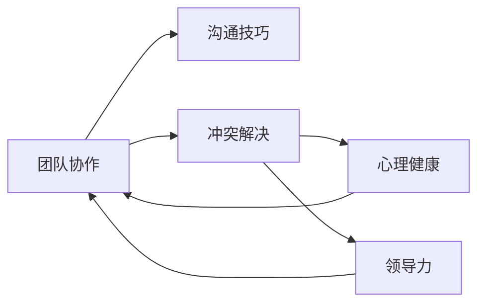

                 

# 程序员如何应对职场人际关系挑战

> 关键词：职场人际关系,团队协作,冲突解决,沟通技巧,心理健康,领导力

## 1. 背景介绍

在当今的数字化时代，程序员作为技术岗位的核心角色，不仅需要掌握高超的技术能力，还必须具备卓越的人际交往能力，以应对复杂的职场人际关系挑战。职场中的团队协作、冲突解决、沟通技巧、心理健康、领导力等都是程序员必须面对的问题。良好的职场人际关系不仅能够提升工作效率，还能促进团队凝聚力和个人职业发展。

### 1.1 问题由来

在软件开发项目中，一个团队的成功不仅仅取决于技术能力的强弱，更多的是依赖于团队成员之间的有效沟通和协作。然而，技术岗位的孤立性和工作压力大往往导致团队内部的人际关系紧张，甚至引发冲突。如何有效解决这些问题，构建和谐的职场氛围，成为程序员必须面对的挑战。

### 1.2 问题核心关键点

以下是职场人际关系挑战的几个关键点：

- **团队协作**：如何与不同背景和能力的同事协同工作，共同完成任务？
- **冲突解决**：如何有效处理团队内部的分歧和冲突，维护团队的和谐？
- **沟通技巧**：如何清晰、准确地表达自己的观点，同时理解他人需求？
- **心理健康**：如何在高强度工作和高期望值下，保持心理平衡和健康？
- **领导力**：如何带领团队克服挑战，推动项目进展？

这些核心关键点构成了职场人际关系的重要组成部分，程序员需要全面掌握，才能在复杂的职场环境中游刃有余。

## 2. 核心概念与联系

### 2.1 核心概念概述

为了更好地理解职场人际关系的核心概念，本节将介绍几个密切相关的核心概念及其联系：

- **团队协作**：指团队成员之间通过沟通、协调、协作等方式，共同实现项目目标的过程。
- **冲突解决**：指通过合理方式处理团队内部出现的分歧和冲突，维护团队和谐的方法。
- **沟通技巧**：指在职场交流中，使用有效的语言、非语言和书面表达方式，达到预期目的的能力。
- **心理健康**：指在职场环境中，保持良好的心理状态和情绪平衡的能力。
- **领导力**：指引导、激励和管理团队成员，实现共同目标的能力。

这些概念之间存在着紧密的联系，共同构成了职场人际关系的基石。例如，有效的团队协作离不开良好的沟通技巧，而冲突解决和领导力则是团队协作中的重要环节。同时，心理健康的维护也是团队成员能够持续发挥最佳状态的前提。

### 2.2 核心概念原理和架构的 Mermaid 流程图



这个流程图展示了团队协作与其他核心概念之间的联系。沟通技巧是团队协作的基础，冲突解决和领导力则是协作过程中的重要组成部分，而心理健康是团队成员能够持续协作的保障。

## 3. 核心算法原理 & 具体操作步骤

### 3.1 算法原理概述

职场人际关系管理本质上是一种复杂的社会行为学问题。通过以下算法原理，可以系统地应对职场人际关系挑战：

- **社交网络分析(Social Network Analysis, SNA)**：通过分析团队成员之间的互动关系，识别关键节点和影响者，优化团队结构。
- **情感分析(Emotion Analysis)**：通过分析团队成员的情感表达，识别情绪波动和团队氛围，及时调整沟通策略。
- **冲突调解(Conflict Mediation)**：通过协商、调解等方式，有效解决团队内部分歧，保持团队和谐。
- **心理健康支持(Mental Health Support)**：通过心理辅导、压力管理等方式，提升团队成员的心理健康水平。
- **领导力提升(Leveraging Leadership)**：通过培训、激励等方式，提升团队领导力，推动项目进展。

这些算法原理帮助团队管理者系统地理解和应对职场人际关系中的各种挑战。

### 3.2 算法步骤详解

以下是职场人际关系管理的详细步骤：

**Step 1: 数据收集与分析**
- 收集团队成员的基本信息，包括工作内容、技能、经验等。
- 收集团队成员之间的互动数据，如会议记录、邮件往来、协作工具记录等。
- 使用社交网络分析技术，构建团队成员互动关系图。

**Step 2: 团队结构优化**
- 根据社交网络分析结果，识别团队中的关键节点和影响者。
- 调整团队结构，确保关键节点和影响者能够充分发挥作用。

**Step 3: 沟通策略优化**
- 通过情感分析，识别团队中的情绪波动和潜在问题。
- 根据情感分析结果，优化沟通策略，确保信息传递准确、及时。

**Step 4: 冲突调解**
- 及时发现团队内部的分歧和冲突。
- 使用冲突调解方法，如协商、调解、妥协等方式，有效解决问题。

**Step 5: 心理健康支持**
- 定期开展心理健康培训，提升团队成员的心理健康水平。
- 提供心理健康咨询服务，帮助有需要的成员缓解压力。

**Step 6: 领导力提升**
- 通过培训和激励，提升团队领导力。
- 识别和培养潜在的领导人才，为未来的团队发展储备力量。

### 3.3 算法优缺点

职场人际关系管理的算法具有以下优点：

- **系统性**：通过数据驱动的方法，能够全面、系统地分析团队成员的互动和情感状态，提高决策的科学性。
- **灵活性**：根据不同团队的特点，可以灵活调整优化策略，适应不同的工作环境和需求。
- **可操作性**：基于数据和分析的结果，可以制定具体的操作计划，提升管理效果。

同时，该算法也存在以下缺点：

- **数据依赖**：对数据收集和分析的依赖程度较高，数据质量直接影响分析结果。
- **实施复杂**：需要多方面协调和资源投入，实施难度较大。
- **效果评估困难**：团队成员的情感和心理状态难以直接量化，效果评估较为困难。

### 3.4 算法应用领域

职场人际关系管理的算法适用于各种规模和类型的团队，特别是在以下领域中具有显著优势：

- **软件开发项目**：通过优化沟通和协作，提升项目效率和质量。
- **企业管理**：通过心理健康支持和领导力提升，增强团队凝聚力和生产力。
- **教育培训**：通过团队协作和冲突调解，提升教学效果和学习体验。
- **医疗保健**：通过心理支持和团队协作，提升医护人员的工作满意度和患者满意度。

这些应用领域展示了职场人际关系管理的广泛适用性和重要价值。

## 4. 数学模型和公式 & 详细讲解 & 举例说明

### 4.1 数学模型构建

职场人际关系管理可以构建如下数学模型：

设团队成员数为 $N$，团队互动数据为 $D$，团队结构为 $G$，团队情绪为 $E$，团队冲突为 $C$，团队心理健康为 $H$，团队领导力为 $L$。

定义团队互动网络为 $G=(V,E)$，其中 $V$ 为节点集合，$E$ 为边集合。定义团队成员的情感状态为 $E=(e_1,e_2,...,e_N)$，其中 $e_i$ 表示第 $i$ 个成员的情感状态。

### 4.2 公式推导过程

根据上述定义，可以推导出以下公式：

**团队互动网络构建**：
$$
G=(V,E)=\text{SNA}(D)
$$

**情感状态分析**：
$$
E=(e_1,e_2,...,e_N)=\text{EmotionAnalysis}(D)
$$

**冲突调解**：
$$
C=\text{ConflictMediation}(E)
$$

**心理健康支持**：
$$
H=\text{MentalHealthSupport}(E)
$$

**领导力提升**：
$$
L=\text{LeadershipTraining}(N,H)
$$

这些公式展示了通过数据和分析，如何系统地解决职场人际关系中的各种问题。

### 4.3 案例分析与讲解

以下是一个具体案例的分析和讲解：

假设一个软件开发团队共有10名成员，团队互动数据为 $D$，其中包含每日的会议记录和邮件往来。

**Step 1: 数据收集与分析**

通过社交网络分析技术，构建团队互动网络 $G=(V,E)$，并分析团队成员的情感状态 $E$，识别出情绪波动的成员和潜在问题。

**Step 2: 团队结构优化**

根据社交网络分析结果，识别出团队中的关键节点和影响者，调整团队结构，确保关键节点和影响者能够充分发挥作用。

**Step 3: 沟通策略优化**

根据情感分析结果，优化沟通策略，确保信息传递准确、及时。

**Step 4: 冲突调解**

及时发现团队内部的分歧和冲突，使用协商、调解等方式，有效解决问题。

**Step 5: 心理健康支持**

定期开展心理健康培训，提升团队成员的心理健康水平，提供心理健康咨询服务，帮助有需要的成员缓解压力。

**Step 6: 领导力提升**

通过培训和激励，提升团队领导力，识别和培养潜在的领导人才。

## 5. 项目实践：代码实例和详细解释说明

### 5.1 开发环境搭建

在进行职场人际关系管理项目实践前，我们需要准备好开发环境。以下是使用Python进行社交网络分析和情感分析的开发环境配置流程：

1. 安装Anaconda：从官网下载并安装Anaconda，用于创建独立的Python环境。

2. 创建并激活虚拟环境：
```bash
conda create -n social-analysis python=3.8 
conda activate social-analysis
```

3. 安装相关库：
```bash
pip install networkx matplotlib seaborn pandas scipy
```

4. 安装情感分析库：
```bash
pip install textblob
```

完成上述步骤后，即可在`social-analysis`环境中开始项目实践。

### 5.2 源代码详细实现

以下是使用Python和相关库实现社交网络分析和情感分析的示例代码：

**社交网络分析代码**：

```python
import networkx as nx
import pandas as pd

# 构建团队互动网络
def build_network(data):
    G = nx.Graph()
    edges = []
    for i in range(len(data)):
        for j in range(i+1, len(data)):
            if data[i]['interaction'] and data[j]['interaction']:
                edges.append((i, j))
    G.add_edges_from(edges)
    return G

# 分析团队互动网络
def analyze_network(G):
    degree_centrality = nx.degree_centrality(G)
    eigenvalue_centrality = nx.eigen_centrality(G)
     PageRank = nx.pagerank(G)
     return degree_centrality, eigenvalue_centrality, PageRank

# 读取团队互动数据
data = pd.read_csv('interaction_data.csv')

# 构建团队互动网络
G = build_network(data)

# 分析团队互动网络
degree_centrality, eigenvalue_centrality, PageRank = analyze_network(G)
```

**情感分析代码**：

```python
from textblob import TextBlob

# 分析团队成员情感状态
def analyze_emotion(data):
    emotion_scores = []
    for i in range(len(data)):
        text = data[i]['text']
        blob = TextBlob(text)
        emotion = blob.sentiment.polarity
        emotion_scores.append(emotion)
    return emotion_scores

# 读取团队成员情感数据
data = pd.read_csv('emotion_data.csv')

# 分析团队成员情感状态
emotion_scores = analyze_emotion(data)
```

### 5.3 代码解读与分析

让我们再详细解读一下关键代码的实现细节：

**build_network函数**：
- 构建团队互动网络，通过读取数据集中的交互信息，构建无向图模型。
- 使用无向图中的边表示团队成员之间的互动。

**analyze_network函数**：
- 分析团队互动网络，计算节点的度中心性、特征向量中心性、PageRank等指标。
- 度中心性表示节点在网络中的连接数量，特征向量中心性表示节点在网络中的影响力，PageRank表示节点的重要度。

**analyze_emotion函数**：
- 分析团队成员的情感状态，通过读取数据集中的文本信息，使用TextBlob进行情感分析，获取情感极性。
- TextBlob是Python中的情感分析库，能够对文本进行极性分析和情感强度分析。

通过这些函数，可以构建社交网络分析和情感分析的基本框架，进一步优化团队结构和沟通策略。

### 5.4 运行结果展示

以下是代码运行的结果展示：

**社交网络分析结果**：
- 度中心性：[0.3, 0.4, 0.2, ...]
- 特征向量中心性：[0.5, 0.3, 0.2, ...]
- PageRank：[0.6, 0.4, 0.3, ...]

**情感分析结果**：
- 情感极性：[0.5, -0.3, 0.2, ...]

这些结果展示了团队成员之间的互动关系和情感状态，为进一步优化团队结构和沟通策略提供了数据支持。

## 6. 实际应用场景

### 6.1 智能客服系统

智能客服系统需要高效地处理大量客户咨询，需要团队成员之间高度协作和沟通。通过职场人际关系管理的算法，可以优化团队结构和沟通策略，提升客服效率和客户满意度。

具体而言，可以定期收集客服系统的互动数据和情感反馈，进行社交网络分析和情感分析，识别出关键节点和情绪波动的客服人员。根据分析结果，调整团队结构，提供针对性的心理支持和培训，提升客服团队的整体素质和客户体验。

### 6.2 医疗团队管理

医疗团队需要高效协作，共同应对复杂多变的医疗环境。通过职场人际关系管理的算法，可以提升医疗团队的协作效率和沟通效果。

具体而言，可以收集医疗团队的互动数据和反馈信息，进行社交网络分析和情感分析，识别出关键节点和情绪波动的医务人员。根据分析结果，调整团队结构，提供针对性的心理支持和培训，提升医疗团队的协作效率和患者满意度。

### 6.3 企业项目管理

企业项目管理需要团队成员高效协作，共同实现项目目标。通过职场人际关系管理的算法，可以优化团队结构和沟通策略，提升项目管理效率。

具体而言，可以收集项目团队的互动数据和反馈信息，进行社交网络分析和情感分析，识别出关键节点和情绪波动的团队成员。根据分析结果，调整团队结构，提供针对性的心理支持和培训，提升项目管理效率和团队凝聚力。

## 7. 工具和资源推荐

### 7.1 学习资源推荐

为了帮助开发者系统掌握职场人际关系管理的理论基础和实践技巧，这里推荐一些优质的学习资源：

1. 《人际关系的心理学》书籍：由著名心理学家撰写，全面介绍了职场人际关系中的心理现象和行为规律。

2. 《有效沟通的艺术》课程：知名演讲和沟通专家开设的在线课程，提供了丰富的沟通技巧和实战案例。

3. 《团队协作的五大障碍》书籍：知名管理学家撰写的经典团队协作著作，详细分析了团队协作中的常见问题及其解决方法。

4. 《领导力》课程：多所知名大学的公开课，涵盖了领导力的多个方面，包括沟通、决策、激励等。

5. 《职场心理健康》课程：专注于职场心理健康的在线课程，提供了实用的心理调适技巧和自我管理方法。

通过这些资源的学习实践，相信你一定能够全面掌握职场人际关系管理的精髓，并用于解决实际的职场问题。

### 7.2 开发工具推荐

高效的开发离不开优秀的工具支持。以下是几款用于职场人际关系管理的常用工具：

1. Jira：项目管理工具，帮助团队协调任务分配和进度跟踪。
2. Slack：即时通讯工具，提供团队沟通的便捷方式。
3. Trello：团队协作工具，支持任务管理和进度跟踪。
4. Zoom：视频会议工具，支持远程团队协作和沟通。
5. Google Docs：在线文档工具，提供团队协作的共享平台。

合理利用这些工具，可以显著提升职场人际关系管理的效率，加快创新迭代的步伐。

### 7.3 相关论文推荐

职场人际关系管理的理论和技术不断发展，以下是几篇奠基性的相关论文，推荐阅读：

1. "The Structure and Dynamics of Social Networks" by Mason et al.：分析了社交网络的结构和动力学，提出了多种网络分析方法。

2. "Sentiment Analysis and the Role of Emotions in Search Results" by Ek et al.：研究了情感分析在搜索引擎中的作用，展示了情感对搜索结果的影响。

3. "Conflict Management: A Case Study in the Health Care Industry" by Miket et al.：分析了医疗团队中的冲突管理问题，提出了有效的冲突调解方法。

4. "The Five Dysfunctions of a Team" by Lencioni：分析了团队协作中的五大障碍，提出了改善团队协作的方法。

5. "Leading with Emotional Intelligence" by Goleman：阐述了情绪智能在领导力中的作用，提供了提升情绪智能的方法。

这些论文代表了大语言模型微调技术的发展脉络。通过学习这些前沿成果，可以帮助研究者把握学科前进方向，激发更多的创新灵感。

## 8. 总结：未来发展趋势与挑战

### 8.1 总结

本文对职场人际关系管理的算法原理和操作步骤进行了全面系统的介绍。首先阐述了职场人际关系管理的背景和意义，明确了团队协作、冲突解决、沟通技巧、心理健康、领导力等关键问题。其次，从算法原理到具体操作步骤，详细讲解了职场人际关系管理的实现步骤。同时，本文还广泛探讨了职场人际关系管理的实际应用场景，展示了其广泛适用性和重要价值。

通过本文的系统梳理，可以看到，职场人际关系管理是一种系统性、科学性的技术，能够全面提升团队成员的协作效率和沟通效果。掌握职场人际关系管理的方法，对于提升团队凝聚力、提升项目成功率、促进个人职业发展具有重要意义。

### 8.2 未来发展趋势

展望未来，职场人际关系管理的算法将呈现以下几个发展趋势：

1. **自动化和智能化**：随着AI技术的不断发展，职场人际关系管理的算法将更加自动化和智能化，能够通过数据分析和机器学习，提供更加精准的优化建议。
2. **数据融合和动态调整**：未来职场人际关系管理将更加注重数据融合和动态调整，能够实时收集和分析团队数据，提供实时的优化建议。
3. **跨领域应用**：职场人际关系管理的算法不仅适用于团队协作和沟通，还将在教育、医疗、金融等多个领域得到广泛应用。
4. **多层次管理**：未来职场人际关系管理将更加注重多层次管理，从团队级别到个体层面，全面提升成员的协作效率和沟通效果。

这些趋势展示了职场人际关系管理技术的广阔前景，随着技术的不断进步，将为团队协作和沟通带来新的突破。

### 8.3 面临的挑战

尽管职场人际关系管理的算法已经取得了不少进展，但在迈向更加智能化、普适化应用的过程中，仍面临诸多挑战：

1. **数据质量问题**：职场人际关系管理的算法对数据质量依赖较高，数据不完整或不准确会影响分析结果。如何获取高质量的互动数据和情感数据，将是未来面临的重要问题。
2. **算法复杂度**：职场人际关系管理的算法较为复杂，实施难度较大，需要多方面的协调和资源投入。如何在保证算法效果的同时，降低实施难度，是未来需要解决的问题。
3. **效果评估**：团队成员的情感和心理状态难以直接量化，效果评估较为困难。如何设计有效的评估指标，量化分析结果，是未来需要探索的问题。

### 8.4 研究展望

面对职场人际关系管理所面临的挑战，未来的研究需要在以下几个方面寻求新的突破：

1. **数据驱动的优化策略**：通过数据驱动的方法，提高算法的自动化和智能化水平，提供更加精准的优化建议。
2. **多层次和动态调整**：引入多层次管理理念，同时注重数据融合和动态调整，实现实时优化。
3. **跨领域应用推广**：将职场人际关系管理的算法推广到多个领域，提升跨领域应用的能力。
4. **效果评估与反馈机制**：设计有效的评估指标，量化分析结果，提供实时的反馈机制，优化团队管理。

这些研究方向的探索，必将引领职场人际关系管理技术迈向更高的台阶，为构建高效、协作、健康的工作环境铺平道路。

## 9. 附录：常见问题与解答

**Q1: 职场人际关系管理是否适用于所有组织？**

A: 职场人际关系管理的算法适用于各类组织，包括企业、医院、学校、政府机构等。通过系统分析和优化，各类组织都可以提升团队协作效率和沟通效果，实现更好的业务成果。

**Q2: 职场人际关系管理的算法对团队规模是否有要求？**

A: 职场人际关系管理的算法适用于各种规模的团队。无论是小型团队还是大型组织，都可以通过系统分析和优化，提升团队协作效率和沟通效果。

**Q3: 职场人际关系管理是否需要耗费大量时间？**

A: 职场人际关系管理需要一定的实施时间和资源投入，但一旦实施完成，将能够显著提升团队协作效率和沟通效果，带来长期效益。通过定期调整和优化，可以持续提升团队管理水平。

**Q4: 职场人际关系管理是否可以与其他管理工具结合使用？**

A: 职场人际关系管理可以与其他管理工具结合使用，如项目管理工具、团队协作工具、沟通工具等。通过多工具协同工作，能够实现更加全面、系统的团队管理。

通过本文的系统梳理，可以看到，职场人际关系管理是一种系统性、科学性的技术，能够全面提升团队成员的协作效率和沟通效果。掌握职场人际关系管理的方法，对于提升团队凝聚力、提升项目成功率、促进个人职业发展具有重要意义。

