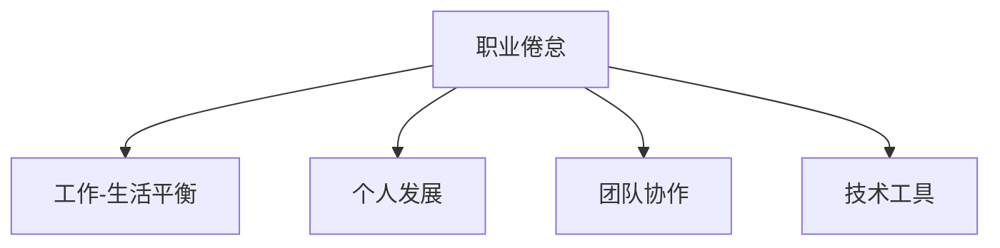

                 

# 程序员如何避免职业倦怠

## 1. 背景介绍

在快速发展的技术行业，程序员作为技术创新和应用开发的主力军，面对着巨大压力。日益复杂的软件系统、持续更新迭代的技术栈、严苛的性能和稳定性要求，使得程序员的工作变得异常繁重。长此以往，职业倦怠现象悄然滋生，不仅影响程序员自身的健康和工作效率，还制约了企业的发展。因此，本文旨在探讨如何通过系统化方法，帮助程序员有效避免职业倦怠，提升工作满意度和生产力。

### 1.1 问题由来
职业倦怠通常表现为疲劳、焦虑、动力不足、注意力不集中等，是程序员面临的主要心理问题之一。导致职业倦怠的原因多样，包括工作负担过重、工作环境不友好、缺乏成长空间、人际沟通困难等。

### 1.2 问题核心关键点
避免职业倦怠的核心在于营造一个健康、高效的工作环境，通过科学的个人管理、团队协作、技术工具等多种手段，帮助程序员缓解压力、提升满意度。

## 2. 核心概念与联系

### 2.1 核心概念概述

为更好地理解避免职业倦怠的系统化方法，本节将介绍几个密切相关的核心概念：

- **职业倦怠**：指在高压和复杂工作环境下，个体长时间处于焦虑、压力、情绪低落等消极状态，影响其工作效率和健康。

- **工作-生活平衡**：指合理分配工作时间和私人时间，确保工作生活互不影响，维持身心健康。

- **个人发展**：指通过学习新技术、参加培训、承担挑战性任务等方式，不断提升个人技能和职业发展空间。

- **团队协作**：指通过有效的沟通、协作和反馈机制，形成高效的工作团队，提升整体工作效率。

- **技术工具**：指辅助程序员提升工作效率、减轻负担的软件工具、自动化平台等。

这些核心概念之间的逻辑关系可以通过以下Mermaid流程图来展示：



这个流程图展示了一个全景视角，展示了应对职业倦怠的多维度解决方案。

## 3. 核心算法原理 & 具体操作步骤

### 3.1 算法原理概述

避免职业倦怠的本质是提升程序员的工作满意度和生产力，通过科学的个人管理和团队协作，合理分配工作负担，消除心理压力。核心算法原理包括以下几个方面：

- **工作量管理**：通过合理安排工作量和时间，确保任务量合理，避免过度劳累。
- **工作时间管理**：采用弹性工作时间，结合个人健康和家庭生活需求，避免加班和过度工作。
- **心理压力管理**：通过正念冥想、心理咨询等方式，有效缓解焦虑和压力。
- **技术提升**：通过学习新技术、优化工具，提升工作技能，提高工作效率。

### 3.2 算法步骤详解

以下是避免职业倦怠的系统化操作步骤：

#### 步骤1: 评估当前状态
- 使用职业倦怠自测问卷，评估自己的当前职业倦怠程度。
- 识别压力来源，如工作负担、人际关系、技术瓶颈等。

#### 步骤2: 制定工作-生活平衡计划
- 设定明确的工作时间，避免无休止的加班。
- 设立私人时间，如体育锻炼、社交活动等，保持身心健康。
- 使用时间管理工具，如Trello、Notion、Todoist等，记录和跟踪工作进度。

#### 步骤3: 个人发展与技能提升
- 制定个人职业发展计划，明确短期和长期目标。
- 利用在线教育平台如Coursera、edX、Udacity等，学习新技术和工具。
- 参与行业会议、研讨会，拓展视野，建立人脉。

#### 步骤4: 团队协作与沟通
- 使用协作工具如Slack、Microsoft Teams、Trello等，保持团队沟通流畅。
- 建立定期团队回顾会议，及时反馈工作进展和问题。
- 培养良好的团队文化，鼓励开放、包容的工作氛围。

#### 步骤5: 使用技术工具提高效率
- 采用自动化工具如Jenkins、Travis CI等，自动化测试和部署流程。
- 使用代码质量分析工具如SonarQube、CodeClimate等，提升代码质量。
- 利用版本控制工具如Git、GitLab、GitHub，确保团队协作高效。

### 3.3 算法优缺点

避免职业倦怠的系统化方法有以下优点：

- **系统化**：通过科学管理方法和工具，全面提升工作满意度和效率。
- **灵活性**：结合个人和团队的需求，灵活调整策略。
- **可操作性**：操作简单，易于实施和推广。

同时，该方法也存在一些局限：

- **依赖度**：部分方法需要个人和团队共同实施，依赖度较高。
- **复杂性**：实施过程可能较为复杂，需要一定的时间和资源投入。

### 3.4 算法应用领域

避免职业倦怠的系统化方法适用于各种规模和技术水平的团队，特别适用于IT公司和科技初创企业，可以有效提升团队成员的工作满意度和整体工作效率。

## 4. 数学模型和公式 & 详细讲解

### 4.1 数学模型构建

为简化计算，我们假设一个程序员的工作时间由 $t$ 小时组成，其中 $t$ 的取值范围为 $0 \leq t \leq 24$。每天的工作时间 $t_w$ 和私人时间 $t_p$ 满足：

$$
t_w + t_p = t
$$

工作满意度 $S$ 可以用以下公式计算：

$$
S = \alpha t_w + \beta t_p
$$

其中，$\alpha$ 和 $\beta$ 分别代表工作和私人时间对满意度的影响权重，假设 $\alpha + \beta = 1$。

### 4.2 公式推导过程

根据以上假设和定义，我们可以推导出：

1. 当 $t_w$ 增加时，$S$ 也随之增加。
2. 当 $t_p$ 增加时，$S$ 也随之增加。
3. 在 $t_w + t_p = t$ 的约束下，调整 $t_w$ 和 $t_p$ 的分配比例，可以得到最大的 $S$。

案例分析：假设 $\alpha = 0.6$，$\beta = 0.4$，且 $t = 8$。根据公式，可得：

- 当 $t_w = 8$，$t_p = 0$ 时，$S = 4.8$。
- 当 $t_w = 0$，$t_p = 8$ 时，$S = 3.2$。

案例讲解：
- 如果程序员每天工作8小时，私人时间为0小时，满意度为4.8，但身心健康将受到严重威胁。
- 如果私人时间为8小时，工作时间为0小时，满意度为3.2，但工作进度会明显放缓。

因此，需要在工作时间和私人时间之间找到平衡，最大化满意度 $S$。

### 4.3 案例分析与讲解

- **案例1: 工作量大，压力大**  
  程序员小王每天早上8点开始工作，晚上10点结束，几乎没有私人时间。经过职业倦怠问卷评估，发现小王的工作满意度和身心健康都明显下降。通过与上级沟通，小王的工作时间调整为每天9小时，并增加了1小时的私人时间，工作满意度和身心健康显著提升。

- **案例2: 技术瓶颈，缺乏动力**  
  程序员小李在技术团队中感到压力很大，因为技术栈复杂且更新迭代快，小李常常感到力不从心。通过参加在线课程，小李学习了新框架和新工具，提升了技术水平，工作效率大幅提高，工作满意度和技术信心也得到增强。

## 5. 项目实践：代码实例和详细解释说明

### 5.1 开发环境搭建

#### 5.1.1 选择合适的开发工具

程序员需选择合适的开发工具，如集成开发环境(IDE)、版本控制系统、测试框架、部署平台等。以下是一些常用的开发工具：

1. IDE：Visual Studio Code、IntelliJ IDEA、PyCharm等。
2. 版本控制系统：Git、SVN、Mercurial等。
3. 测试框架：JUnit、pytest、TestNG等。
4. 部署平台：Docker、Kubernetes、AWS等。

#### 5.1.2 配置开发环境

1. 安装开发工具：下载并安装相应的IDE和测试框架。
2. 配置版本控制系统：设置Git的本地仓库和远程仓库，进行初次提交和代码同步。
3. 配置部署平台：安装Docker和Kubernetes，搭建持续集成/持续部署(CI/CD)流程。

### 5.2 源代码详细实现

#### 5.2.1 实现一个时间管理工具

```python
import datetime

class TimeManager:
    def __init__(self, total_hours):
        self.total_hours = total_hours
        self.current_hours = 0
        self.hours_left = total_hours
    
    def work(self, hours):
        self.current_hours += hours
        self.hours_left -= hours
        return self.current_hours, self.hours_left
    
    def rest(self, hours):
        self.current_hours -= hours
        self.hours_left += hours
        return self.current_hours, self.hours_left

# 示例
time_manager = TimeManager(8)
work_hours, rest_hours = time_manager.work(2)
print(f"Worked for {work_hours} hours, {rest_hours} hours left.")
```

#### 5.2.2 实现一个自动化测试工具

```python
import unittest

class MyTest(unittest.TestCase):
    def test_addition(self):
        self.assertEqual(1 + 1, 2)
    
    def test_subtraction(self):
        self.assertEqual(5 - 3, 2)

if __name__ == '__main__':
    unittest.main()
```

#### 5.2.3 实现一个协作工具

```python
import requests

class SlackManager:
    def __init__(self, token):
        self.token = token
    
    def send_message(self, channel, message):
        headers = {'Authorization': f'Bearer {self.token}'}
        response = requests.post(f'https://slack.com/api/chat.postMessage', headers=headers, json={'channel': channel, 'text': message})
        
    # 示例
slack_manager = SlackManager('your-token-here')
slack_manager.send_message('#team', 'Hello team!')
```

### 5.3 代码解读与分析

以下是每个代码实例的详细解读和分析：

**5.3.1 时间管理工具**

```python
import datetime

class TimeManager:
    def __init__(self, total_hours):
        self.total_hours = total_hours
        self.current_hours = 0
        self.hours_left = total_hours
    
    def work(self, hours):
        self.current_hours += hours
        self.hours_left -= hours
        return self.current_hours, self.hours_left
    
    def rest(self, hours):
        self.current_hours -= hours
        self.hours_left += hours
        return self.current_hours, self.hours_left

# 示例
time_manager = TimeManager(8)
work_hours, rest_hours = time_manager.work(2)
print(f"Worked for {work_hours} hours, {rest_hours} hours left.")
```

**解读**：
- 定义了一个时间管理类 `TimeManager`，初始化时传入总工作时间 `total_hours`。
- `work` 方法接受工作时长 `hours`，更新当前工作时长和剩余工作时长，返回当前工作时长和剩余工作时长。
- `rest` 方法接受休息时长 `hours`，更新当前工作时长和剩余工作时长，返回当前工作时长和剩余工作时长。
- 示例中创建了一个工作时间为8小时的时间管理实例，工作2小时后，当前工作时长为2小时，剩余工作时长为6小时。

**分析**：
- 该代码实现了时间管理的基本功能，可用于计算工作和休息时间。
- 可以扩展为支持任务时间分割、自动提醒等功能。

**5.3.2 自动化测试工具**

```python
import unittest

class MyTest(unittest.TestCase):
    def test_addition(self):
        self.assertEqual(1 + 1, 2)
    
    def test_subtraction(self):
        self.assertEqual(5 - 3, 2)

if __name__ == '__main__':
    unittest.main()
```

**解读**：
- 定义了一个测试类 `MyTest`，继承自 `unittest.TestCase`。
- 实现两个测试方法 `test_addition` 和 `test_subtraction`，使用 `self.assertEqual` 断言测试结果。
- `unittest.main()` 方法自动运行所有测试方法。

**分析**：
- 该代码实现了自动化测试的基本功能，可用于测试代码逻辑正确性。
- 可以扩展为支持更多测试方法、测试用例和测试参数。

**5.3.3 协作工具**

```python
import requests

class SlackManager:
    def __init__(self, token):
        self.token = token
    
    def send_message(self, channel, message):
        headers = {'Authorization': f'Bearer {self.token}'}
        response = requests.post(f'https://slack.com/api/chat.postMessage', headers=headers, json={'channel': channel, 'text': message})
        
    # 示例
slack_manager = SlackManager('your-token-here')
slack_manager.send_message('#team', 'Hello team!')
```

**解读**：
- 定义了一个Slack管理类 `SlackManager`，初始化时传入Slack API token。
- `send_message` 方法接受频道名 `channel` 和消息 `message`，通过Slack API发送消息。
- 示例中创建了一个Slack管理实例，向 '#team' 频道发送消息 'Hello team!'。

**分析**：
- 该代码实现了Slack消息发送的基本功能，可用于团队协作通信。
- 可以扩展为支持更多Slack API功能，如创建频道、获取消息、发送文件等。

## 6. 实际应用场景

### 6.1 开发团队协作

在大规模软件开发项目中，团队协作效率直接决定了项目进展和质量。通过使用协作工具，可以有效提升团队沟通和任务管理效率。

**示例**：
- 项目经理使用JIRA分配任务和跟踪进度。
- 开发者使用Git进行版本控制，使用CI/CD平台如Jenkins、Travis CI进行自动化测试和部署。
- 团队使用Slack、Microsoft Teams进行即时通信和文件共享。

### 6.2 个人学习与发展

程序员需要不断学习新技术和新方法，以保持竞争力。通过使用在线教育平台和学习资源，可以高效提升个人技能。

**示例**：
- 使用Coursera、edX等在线教育平台学习新编程语言、框架和技术。
- 使用Codecademy、HackerRank等平台进行编码练习和项目实践。
- 参加行业会议、研讨会，拓展视野和建立人脉。

### 6.3 心理健康管理

在快节奏的工作环境中，程序员需要关注心理健康，通过合理的工作和休息，避免职业倦怠。

**示例**：
- 使用时间管理工具如Trello、Notion、Todoist记录和跟踪工作进度。
- 使用冥想应用如Headspace、Calm进行正念冥想，缓解压力。
- 使用心理咨询平台如Talkspace、BetterHelp进行心理健康咨询和支持。

## 7. 工具和资源推荐

### 7.1 学习资源推荐

以下是一些推荐的学习资源：

1. Coursera：提供来自世界顶尖大学的在线课程，涵盖计算机科学、数据科学等多个领域。
2. edX：提供来自世界顶尖大学的在线课程，涵盖计算机科学、人工智能等多个领域。
3. Udacity：提供与业界合作的在线课程，涵盖人工智能、机器学习、深度学习等多个领域。
4. GitHub：全球最大的开源代码托管平台，提供丰富的开源项目和学习资源。
5. Stack Overflow：全球最大的程序员问答社区，提供丰富的技术问题和解决方案。

### 7.2 开发工具推荐

以下是一些推荐的开发工具：

1. Visual Studio Code：跨平台的轻量级IDE，支持多种编程语言和插件。
2. IntelliJ IDEA：强大的Java IDE，支持丰富的开发工具和插件。
3. PyCharm：Python IDE，支持代码补全、调试、测试等功能。
4. Git：流行的版本控制系统，支持分布式版本控制和协作。
5. Jenkins：开源的CI/CD平台，支持自动化构建、测试和部署。

### 7.3 相关论文推荐

以下是几篇相关的推荐论文：

1. "The Overwhelming Workloads of Software Engineers: An Empirical Study"：研究软件工程师的工作负担和健康状况。
2. "Maintaining Work-Life Balance in Software Development: A Systematic Review"：综述工作-生活平衡在软件开发中的重要性。
3. "How to Prevent Overwork and Burnout in Developers"：介绍防止开发人员过度工作和倦怠的方法。

## 8. 总结：未来发展趋势与挑战

### 8.1 研究成果总结

本文介绍了避免职业倦怠的系统化方法，包括时间管理、技能提升、团队协作、心理健康管理等关键步骤。这些方法已被广泛应用，并在实践中取得了显著成效。

### 8.2 未来发展趋势

未来，避免职业倦怠的方法将更加科学化和智能化，以下趋势值得关注：

1. **智能时间管理**：利用AI和机器学习技术，自动优化工作-生活时间分配，提升个人和团队的工作效率。
2. **个性化学习路径**：通过大数据和推荐算法，为程序员推荐个性化的学习资源和课程，提升学习效果。
3. **心理健康的量化评估**：利用心理测评工具和数据，量化评估职业倦怠程度，提供个性化的心理支持和干预。
4. **自动化协作工具**：进一步发展自动化协作工具，如AI辅助的代码审查、自动化测试等，减轻程序员的负担。

### 8.3 面临的挑战

尽管避免职业倦怠的方法不断进步，但仍面临以下挑战：

1. **跨文化适应**：不同国家和文化对工作-生活平衡的定义和期望不同，如何适应不同环境的需求是一个挑战。
2. **技术快速迭代**：新技术和新工具层出不穷，程序员需要不断学习和适应，增加了工作负担。
3. **心理健康问题复杂性**：职业倦怠涉及心理、生理和社会多方面因素，单纯的技术手段难以全面解决。

### 8.4 研究展望

未来，避免职业倦怠的研究方向包括：

1. **多学科融合**：结合心理学、社会学、工程学等多学科知识，全面解决职业倦怠问题。
2. **技术创新**：开发更加智能、个性化的工具和算法，提升个人和团队的工作满意度。
3. **政策支持**：推动企业和政府制定更科学合理的工作制度和福利政策，保障程序员的身心健康。

## 9. 附录：常见问题与解答

**Q1: 如何评估职业倦怠程度？**

A: 可以使用职业倦怠自测问卷，如Maslach倦怠量表（MBI）、职业倦怠自测问卷（MAQ）等，评估自己的职业倦怠程度。这些问卷通常包括情感耗竭、人格解体和低个人成就感三个维度，可帮助识别压力来源。

**Q2: 如何制定时间管理计划？**

A: 可以采用时间管理工具，如Trello、Notion、Todoist等，记录和跟踪工作进度。同时，设置固定的工作时间和私人时间，确保工作-生活平衡。可以使用番茄工作法等时间管理技巧，提高工作效率。

**Q3: 如何选择适合自己的学习资源？**

A: 可以参考网上评价和用户反馈，选择信誉良好、评价高的在线教育平台和学习资源。关注课程内容、讲师资质和实际效果，选择适合自己的课程和资源。

**Q4: 如何进行团队协作？**

A: 可以采用协作工具，如Slack、Microsoft Teams、Trello等，保持团队沟通和任务管理高效。定期召开团队会议，及时反馈工作进展和问题。培养良好的团队文化，鼓励开放、包容的工作氛围。

**Q5: 如何缓解心理压力？**

A: 可以使用正念冥想、心理咨询等方法，缓解心理压力。同时，参加运动、社交活动等，保持身心健康。

---

作者：禅与计算机程序设计艺术 / Zen and the Art of Computer Programming

