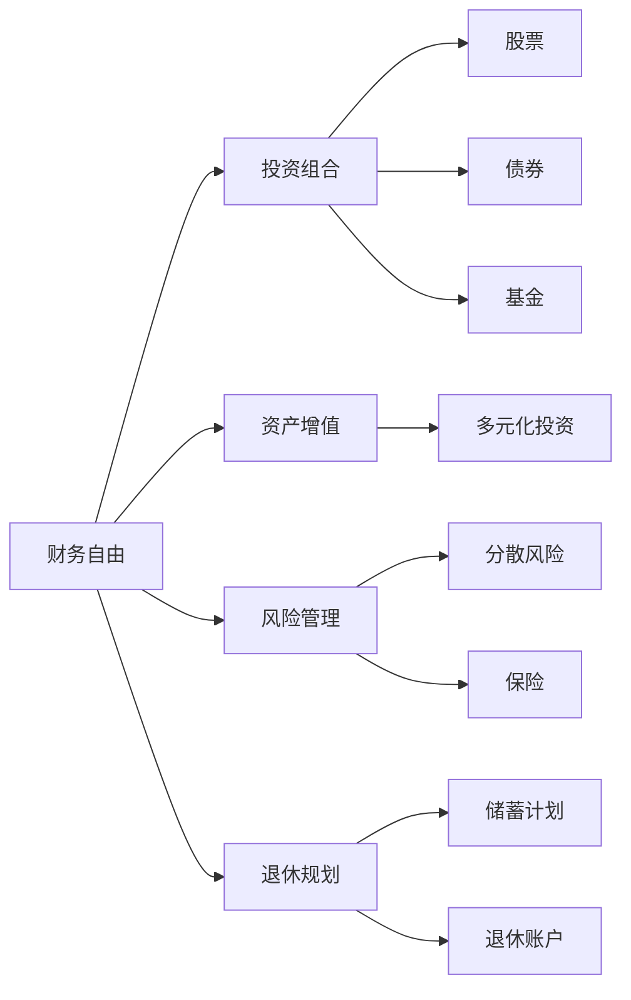

                 

# 程序员的财务规划：从入门到财务自由的路线图

程序员作为IT行业的中坚力量，通常具备较高的技术水平和创造能力，但同时也面临着较高的职业不确定性和生活压力。如何合理规划财务，在技术热潮中稳步前进，最终实现财务自由，成为广大程序员共同关心的问题。本文将从财务规划的各个维度，系统介绍程序员实现财务自由的全面攻略。

## 1. 背景介绍

### 1.1 问题由来

随着IT行业的飞速发展，程序员的工资水平和生活成本都在逐年上升。高强度的技术更新迭代，使得程序员职业生涯的不确定性加剧。而高薪酬对应的生活成本和健康压力，也使得许多程序员开始关注财务规划，寻找切实可行的财务解决方案。

### 1.2 问题核心关键点

程序员财务规划的核心在于：
- **风险管理**：在职业生涯中合理分配收入与支出，平衡短期与长期目标。
- **资产增值**：通过合理的投资组合，实现资产的稳健增值。
- **理财教育**：具备基本的理财知识和技能，避免踩坑。
- **财务自由**：在一定的财务积累后，实现不依赖工作收入的自由生活。

## 2. 核心概念与联系

### 2.1 核心概念概述

为更好地理解程序员财务规划，本节将介绍几个关键概念：

- **财务自由(Financial Independence)**：无需依赖工资收入，仅通过资产收益实现稳定生活。
- **投资组合(Investment Portfolio)**：选择不同类型的资产（如股票、债券、基金等）构建的投资组合。
- **资产增值(Asset Appreciation)**：通过投资等手段，使资产价值持续增长。
- **风险管理(Risk Management)**：评估和管理财务计划中的各种风险。
- **退休规划(Retirement Planning)**：为未来退休生活提前做好财务安排。

这些概念之间存在密切联系，共同构成程序员财务规划的基本框架。

### 2.2 核心概念原理和架构的 Mermaid 流程图



这个流程图展示了大语言模型的核心概念及其之间的关系：

1. 财务自由是最终目标，通过构建投资组合、实现资产增值、管理风险、规划退休，逐步实现。
2. 投资组合包含股票、债券、基金等多种资产，用于分散风险并实现增值。
3. 资产增值通过多元化投资、分散风险等策略实现。
4. 风险管理通过分散投资、购买保险等措施，降低财务风险。
5. 退休规划提前为未来生活做财务准备，确保退休后的生活质量。

## 3. 核心算法原理 & 具体操作步骤

### 3.1 算法原理概述

程序员财务规划的核心算法原理基于以下几个方面：

- **资产配置理论**：通过投资组合理论（如马科维茨模型），优化资产配置，实现风险收益平衡。
- **复利效应**：复利计算公式 $A = P(1 + r)^n$，通过长期复利积累财富。
- **风险分散**：通过分散投资降低单一资产的风险。
- **定期投资**：定期定额投资，利用定期复利效应，积累财富。

### 3.2 算法步骤详解

1. **设定目标**：
   - 确定短期的消费目标（如买车、买房）和长期的财务目标（如实现财务自由）。
   - 评估当前的收入、支出和资产负债情况。

2. **财务诊断**：
   - 列出月度支出和收入，分析开支构成，寻找可减少的消费。
   - 分析资产和负债情况，评估财务自由距离。

3. **制定预算**：
   - 根据收入和支出情况，制定详细的预算计划。
   - 设置紧急基金，应对突发事件。

4. **投资规划**：
   - 选择合适的投资组合，分散风险。
   - 定期投资，利用复利效应积累财富。

5. **风险管理**：
   - 购买保险，保护家庭财产和健康。
   - 分散投资，降低单一资产风险。

6. **退休规划**：
   - 制定长期储蓄计划，确保退休生活质量。
   - 利用养老金、社保等工具，增加退休收入来源。

### 3.3 算法优缺点

#### 优点：
- **系统的财务规划**：通过设定目标、财务诊断、制定预算等步骤，形成系统的财务规划。
- **风险管理**：通过保险和分散投资，降低财务风险。
- **长期增值**：利用复利效应，实现长期财富积累。

#### 缺点：
- **需要时间**：财务规划需要时间和精力进行长期积累。
- **需要专业知识**：需要了解投资组合、风险管理等专业知识。
- **调整复杂**：财务规划需要根据实际情况不断调整。

### 3.4 算法应用领域

程序员财务规划技术的应用领域广泛，包括但不限于：

- **个人理财**：针对程序员的特点，制定个性化的财务规划方案。
- **职业规划**：根据职业发展路径，调整投资策略和消费计划。
- **家庭财务**：整合家庭财务，制定统一的财务目标和计划。
- **退休规划**：针对程序员的职业特点，制定退休后的财务安排。

## 4. 数学模型和公式 & 详细讲解 & 举例说明

### 4.1 数学模型构建

#### 4.1.1 财务目标设定模型
财务目标通常包含短期的消费目标和长期的财务自由目标。通过设定合理的储蓄率和投资收益率，可以实现这两个目标。

**示例**：
假设小王当前的收入为 $10000$，每月支出为 $6000$，计划在5年内购买一辆 $200000$ 的车，20年内实现财务自由。

设每年储蓄率为 $s$，投资年收益率为 $r$，则需要满足以下条件：

$$
5 \times 6000 \times (1 + r)^{n-5} \leq 200000
$$

其中 $n$ 为储蓄年数。

#### 4.1.2 投资组合模型
投资组合通常包含股票、债券、基金等资产，通过不同资产的权重分配，实现风险收益平衡。

**示例**：
设股票的期望收益率为 $10\%$，债券的期望收益率为 $5\%$，基金的期望收益率为 $7\%$。
假设股票占 $30\%$，债券占 $50\%$，基金占 $20\%$。
则组合的期望收益率为：

$$
E(R) = 0.3 \times 10\% + 0.5 \times 5\% + 0.2 \times 7\% = 6.4\%
$$

#### 4.1.3 复利计算模型
复利公式用于计算长期投资收益。假设初始投资为 $P$，年利率为 $r$，投资年限为 $n$，则未来投资总额为：

$$
A = P(1 + r)^n
$$

**示例**：
假设小王投资 $10000$，年利率为 $5\%$，投资 $20$ 年，则未来总额为：

$$
A = 10000(1 + 0.05)^{20} = 36408.58
$$

### 4.2 公式推导过程

#### 4.2.1 财务目标设定模型推导
财务目标设定模型是基于折现的现金流计算公式：

$$
PV = \frac{FV}{(1 + r)^n}
$$

其中 $PV$ 为现值，$FV$ 为未来值，$r$ 为利率，$n$ 为期限。将 $PV$ 设置为目标值 $200000$，代入公式，解得 $r$：

$$
200000 = \frac{FV}{(1 + r)^{20-5}}
$$

解得 $r$ 为 $5\%$。

#### 4.2.2 投资组合模型推导
投资组合的期望收益率为加权平均收益率的计算：

$$
E(R) = \sum_i w_i r_i
$$

其中 $w_i$ 为权重，$r_i$ 为期望收益率。

将具体数值代入，计算期望收益率 $6.4\%$。

#### 4.2.3 复利计算模型推导
复利计算公式 $A = P(1 + r)^n$ 用于计算未来值，通过设定初始投资 $P$、年利率 $r$、期限 $n$，可以计算出未来值 $A$。

**示例**：
代入具体数值，计算 $36408.58$。

### 4.3 案例分析与讲解

#### 4.3.1 案例背景
小李，35岁，年收入 $100000$，有 $300000$ 的储蓄，每月支出 $5000$。计划在10年内购房，购房价格为 $5000000$。

#### 4.3.2 财务诊断
列出月度支出和收入，评估开支构成，分析资产和负债情况。

#### 4.3.3 制定预算
设定每月储蓄率为 $30\%$，紧急基金 $50000$。

#### 4.3.4 投资规划
选择股票、债券和基金的投资组合，年收益率为 $8\%$。

#### 4.3.5 风险管理
购买意外险、健康险和房屋险。

#### 4.3.6 退休规划
制定长期储蓄计划，利用养老金、社保等工具。

## 5. 项目实践：代码实例和详细解释说明

### 5.1 开发环境搭建

1. **安装Python**：
   - 从官网下载Python安装包。
   - 运行安装程序，选择添加Python到系统路径。

2. **安装Pandas和NumPy**：
   - 打开命令行窗口，输入以下命令：
     ```
     pip install pandas numpy
     ```

3. **安装财务规划库**：
   - 安装财务规划常用的Python库，如Personal Capital、Mint等。
   - 安装具体库命令：
     ```
     pip install personal-capital mint
     ```

完成上述步骤后，即可开始财务规划代码实现。

### 5.2 源代码详细实现

```python
import pandas as pd
import numpy as np

# 定义收入和支出
income = 100000
expenses = 5000

# 定义目标
target_savings = 5000000
target_years = 10

# 设定储蓄率
savings_rate = 0.3

# 计算每月储蓄
monthly_savings = income * savings_rate

# 计算月度支出
monthly_expenses = expenses

# 计算年储蓄
annual_savings = monthly_savings * 12

# 计算年投资收益
annual_interest = annual_savings * 0.08

# 计算未来投资总额
future_value = target_savings / (1 + annual_interest)**target_years

# 输出结果
print("目标储蓄金额：", target_savings)
print("目标年数：", target_years)
print("月度储蓄：", monthly_savings)
print("年储蓄：", annual_savings)
print("年投资收益：", annual_interest)
print("未来投资总额：", future_value)
```

### 5.3 代码解读与分析

- **变量定义**：定义收入、支出、目标储蓄、目标年数、储蓄率等关键变量。
- **计算储蓄和投资**：根据储蓄率计算月度和年度储蓄，再根据年利率计算投资收益。
- **计算未来投资总额**：通过未来值计算公式，计算出未来投资总额。
- **输出结果**：打印关键数据，以便查看计算结果。

## 6. 实际应用场景

### 6.1 智能投顾系统

智能投顾系统利用机器学习和大数据分析技术，为用户提供个性化的投资建议。通过程序员财务规划中的资产配置、风险管理等算法，可以更准确地评估用户的风险承受能力和收益目标，提供量身定制的投资方案。

### 6.2 个人理财应用

个人理财应用通过收集用户财务数据，利用程序员财务规划算法，自动生成财务报告和优化建议。用户可以通过简单的输入，获得详细的财务规划方案。

### 6.3 家庭财务管理

家庭财务管理需要整合家庭成员的财务数据，利用程序员财务规划技术，制定统一的财务目标和计划。通过系统化的财务规划，确保家庭财务的稳健运行。

### 6.4 退休规划工具

退休规划工具通过程序员财务规划算法，帮助用户评估退休后的财务状况，制定长期的退休储蓄和投资计划。利用复利效应，实现未来的财务自由。

## 7. 工具和资源推荐

### 7.1 学习资源推荐

1. **《理财规划与投资组合》**：经典财务管理教材，详细介绍财务规划和投资组合的理论和实践。
2. **《Python财务数据分析》**：Python实战财务数据处理，涵盖财务数据的收集、处理和分析。
3. **Coursera《个人财务管理》课程**：系统学习个人财务规划的理论与实践。
4. **《基金经理实战手册》**：介绍基金投资的实战策略和技巧。

### 7.2 开发工具推荐

1. **Python**：免费的编程语言，生态系统丰富，适用于财务规划和数据分析。
2. **R语言**：强大的统计分析工具，适用于财务数据分析和建模。
3. **Excel**：常用的财务规划工具，易于上手，适合小型财务规划。
4. **Tableau**：数据可视化工具，帮助用户理解财务数据。

### 7.3 相关论文推荐

1. **《资产配置与投资组合管理》**：详细介绍资产配置和投资组合的理论和方法。
2. **《复利效应与长期投资》**：探讨复利效应对长期投资的影响。
3. **《风险管理与分散投资》**：研究风险管理的具体策略和方法。

## 8. 总结：未来发展趋势与挑战

### 8.1 研究成果总结

程序员财务规划技术在财务自由、风险管理、资产增值、退休规划等方面取得了显著进展，为程序员提供了系统化的财务规划方案。通过科学合理的财务规划，程序员可以实现财务自由，提高生活质量。

### 8.2 未来发展趋势

未来的程序员财务规划技术将呈现以下趋势：

1. **智能化升级**：通过机器学习和数据分析，提供更加个性化的财务建议。
2. **跨界融合**：与区块链、人工智能等技术结合，实现更加安全的财务规划。
3. **全球化应用**：利用全球市场数据，提供多币种的财务规划方案。
4. **可持续性**：关注环境和社会责任，推动绿色财务规划。

### 8.3 面临的挑战

程序员财务规划技术在发展过程中，也面临诸多挑战：

1. **数据隐私**：财务数据涉及个人隐私，需要采取严格的数据保护措施。
2. **算法透明**：如何确保财务规划算法的透明性和可解释性，避免"黑箱"操作。
3. **市场波动**：金融市场的波动性可能影响财务规划的效果。
4. **技术更新**：财务规划算法需要不断更新，以适应新的金融市场和投资工具。

### 8.4 研究展望

未来的研究方向包括：

1. **大数据驱动的财务规划**：利用大数据技术，提供更加个性化的财务建议。
2. **区块链技术在财务规划中的应用**：利用区块链技术，提高财务规划的透明度和安全性。
3. **绿色金融规划**：研究如何通过财务规划，促进可持续发展。
4. **多模态财务数据分析**：结合多种数据源，提供更加全面的财务分析。

## 9. 附录：常见问题与解答

**Q1: 程序员应该如何进行财务规划？**

A: 程序员财务规划主要包括以下几个步骤：
1. 设定财务目标（如购房、购车）。
2. 评估当前的收入和支出。
3. 制定详细的预算计划，包括储蓄和投资。
4. 进行风险管理，购买保险。
5. 制定长期储蓄和投资计划，规划退休生活。

**Q2: 什么是财务自由？如何实现财务自由？**

A: 财务自由指的是无需依赖工资收入，仅通过资产收益实现稳定生活。实现财务自由需要：
1. 设定合理的储蓄和投资目标。
2. 进行科学的资产配置。
3. 利用复利效应，实现长期财富积累。
4. 进行风险管理，降低财务风险。
5. 制定详细的退休规划，确保退休生活质量。

**Q3: 程序员在财务规划时需要注意哪些风险？**

A: 程序员在财务规划时需要注意以下风险：
1. 市场波动风险：金融市场的波动可能影响投资收益。
2. 数据隐私风险：财务数据涉及个人隐私，需要保护。
3. 算法透明风险：财务规划算法需要透明，避免“黑箱”操作。
4. 技术更新风险：财务规划算法需要不断更新，以适应新的市场环境。

**Q4: 如何选择合适的投资组合？**

A: 选择合适的投资组合需要考虑以下几个因素：
1. 风险承受能力：根据个人风险承受能力，选择合适的资产配置。
2. 收益目标：设定明确的收益目标，选择合适的投资组合。
3. 市场环境：根据市场环境，调整资产配置比例。
4. 投资期限：根据投资期限，选择合适的资产配置。

**Q5: 程序员如何利用智能投顾系统进行财务规划？**

A: 利用智能投顾系统进行财务规划，主要步骤如下：
1. 收集个人财务数据。
2. 进行财务分析，评估风险承受能力。
3. 根据分析结果，生成个性化的投资建议。
4. 实施投资建议，进行定期监测和调整。
5. 定期评估投资效果，优化财务规划方案。

---

作者：禅与计算机程序设计艺术 / Zen and the Art of Computer Programming

