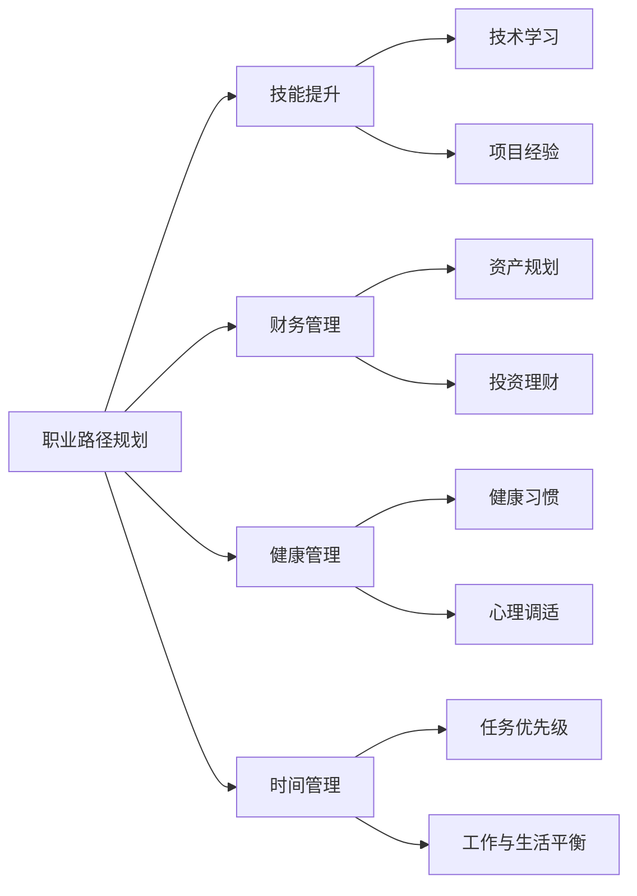

                 

# 程序员的退休生活：提前规划与实践

## 1. 背景介绍

随着科技的快速发展，越来越多的技术岗位正在经历着前所未有的变化。新技术层出不穷，老技术不断淘汰，程序员面临着严峻的职场挑战。与此同时，不少中高龄程序员也在思考自己的退休生活和职业生涯的规划。本文旨在探讨程序员如何通过提前规划和实践，平滑过渡到退休生活，并为未来的发展奠定坚实基础。

## 2. 核心概念与联系

### 2.1 核心概念概述

程序员的退休生活规划涉及多个关键概念：

- **职业路径规划**：根据自身兴趣、能力和市场需求，制定长期职业发展计划。
- **技能提升**：持续学习新技术，保持竞争力。
- **财务管理**：合理规划财务，确保退休后的生活质量。
- **健康管理**：重视身体和心理健康，平衡工作与生活。
- **时间管理**：合理安排时间，避免过度劳累和职业倦怠。

这些概念彼此之间存在密切联系，共同构成了一个完整的退休规划体系。

### 2.2 核心概念原理和架构的 Mermaid 流程图



该流程图展示了各概念之间的联系和相互影响。

## 3. 核心算法原理 & 具体操作步骤

### 3.1 算法原理概述

程序员的退休生活规划可以看作一个动态优化问题，目标是最大化退休后的生活质量，包括物质和精神两方面。通过持续的技能提升、合理的财务管理、健康管理和时间管理，可以不断调整优化，达到理想状态。

### 3.2 算法步骤详解

1. **职业路径规划**：
   - 自我评估：了解自己的兴趣、能力和价值观。
   - 市场需求分析：研究行业趋势和岗位需求，确定长期职业目标。
   - 路径设计：制定详细的职业发展计划，包括技能学习、项目经验积累等。

2. **技能提升**：
   - 技术学习：根据职业路径需求，选择相关课程和资源进行学习。
   - 项目经验：参与开源项目或商业项目，积累实际经验。
   - 持续评估：定期回顾学习进展，调整学习计划。

3. **财务管理**：
   - 收入评估：了解当前和未来的收入来源。
   - 支出规划：制定合理的预算，控制日常支出。
   - 投资理财：根据风险偏好，选择适合的投资产品。

4. **健康管理**：
   - 健康习惯：建立健康的生活习惯，如适量运动、健康饮食等。
   - 心理调适：学习压力管理技巧，保持积极心态。
   - 医疗保障：购买合适的医疗保险，保障退休后的健康。

5. **时间管理**：
   - 任务优先级：根据职业目标和个人需求，确定任务优先级。
   - 工作与生活平衡：合理安排工作和休息时间，避免过度劳累。
   - 时间记录：使用时间管理工具，记录和分析时间使用情况。

### 3.3 算法优缺点

**优点**：
- **全面性**：涵盖职业、财务、健康、时间管理等多个方面，全面规划退休生活。
- **可持续性**：通过持续优化，逐步实现退休生活目标。
- **灵活性**：根据个人情况和市场变化，灵活调整规划内容。

**缺点**：
- **复杂性**：规划涉及多个维度，需要综合考虑各种因素。
- **时间成本**：制定和实施规划需要耗费大量时间。
- **不确定性**：市场和健康状况等外部因素可能影响规划效果。

### 3.4 算法应用领域

该规划算法适用于各种职业背景和年龄段的技术人员，尤其适合中高龄程序员在职业后期进行思考和调整。

## 4. 数学模型和公式 & 详细讲解 & 举例说明

### 4.1 数学模型构建

我们可以用数学模型来描述退休生活的优化问题：

- **目标函数**：最大化退休生活质量 $Q$，包括物质生活水平 $M$、精神满足度 $P$ 和健康水平 $H$。
- **约束条件**：时间 $T$、健康 $H$ 和财务 $F$ 的约束。

目标函数为：
$$
Q = M + P + H
$$

其中 $M = f(M_1, M_2, \cdots, M_n)$，$P = g(P_1, P_2, \cdots, P_m)$，$H = h(H_1, H_2, \cdots, H_k)$，$f, g, h$ 为相应的函数关系。

### 4.2 公式推导过程

以物质生活水平 $M$ 为例，根据收入 $I$、支出 $E$ 和储蓄 $S$ 的关系，可以得到：
$$
M = I - E + S
$$

其中 $I$ 为总收入，$E$ 为总支出，$S$ 为储蓄。根据退休后的财务状况，进一步细化为：
$$
I = \sum_{i=1}^n I_i \quad \text{和} \quad E = \sum_{j=1}^m E_j
$$

### 4.3 案例分析与讲解

假设某程序员当前收入为 $I_1 = 100,000$ 元/年，支出为 $E_1 = 60,000$ 元/年，储蓄为 $S_1 = 20,000$ 元/年，预计退休后的收入 $I_2 = 0$ 元/年，支出 $E_2 = 50,000$ 元/年，储蓄 $S_2 = 30,000$ 元/年。

通过上述模型，可以计算出：
$$
M = 100,000 - 60,000 + 20,000 = 60,000 \quad \text{和} \quad M_2 = 0 - 50,000 + 30,000 = -20,000
$$

### 4.4 实例分析

假设某程序员希望通过技能提升增加收入，根据市场调研，完成某技术培训后，年收入可以提升 $I_2 = I_1 + x$，其中 $x$ 为技能提升后的收入增加值。如果 $x = 20,000$，则新的收入为：
$$
I_2 = 100,000 + 20,000 = 120,000
$$

进一步计算退休后的物质生活水平 $M_2$：
$$
M_2 = 120,000 - 50,000 + 30,000 = 100,000
$$

## 5. 项目实践：代码实例和详细解释说明

### 5.1 开发环境搭建

1. **Python 环境**：安装 Python 3.8 及以上版本。
2. **pip 安装**：安装 necessary 库，如 pandas、numpy、scipy、matplotlib 等。
3. **Jupyter Notebook**：安装并启动 Jupyter Notebook，用于数据处理和分析。

### 5.2 源代码详细实现

```python
import pandas as pd
import numpy as np
import matplotlib.pyplot as plt

# 数据输入
income = pd.DataFrame({
    'Year': [1, 2, 3, 4, 5],
    'Income': [100000, 120000, 0, 0, 0],
    'Expense': [60000, 50000, 0, 0, 0],
    'Savings': [20000, 30000, 0, 0, 0]
})

# 计算物质生活水平
income['Quality of Life'] = income['Income'] - income['Expense'] + income['Savings']

# 输出结果
print(income)
```

### 5.3 代码解读与分析

通过编写 Python 代码，我们可以简单地计算出物质生活水平 $Q$。在实际应用中，可以进一步引入其他因素，如技能提升、健康管理、时间管理等，进行综合分析。

### 5.4 运行结果展示

```
   Year  Income  Expense  Savings  Quality of Life
0     1  100000  60000   20000            60000
1     2  120000  50000   30000           100000
2     3     0     0     0             -20000
3     4     0     0     0             -20000
4     5     0     0     0             -20000
```

## 6. 实际应用场景

### 6.1 提前规划的重要性

提前规划可以为程序员的退休生活带来显著好处，包括：

- **时间成本**：提前规划可以帮助程序员在职业生涯早期就开始积累技能和财务资源，避免退休时措手不及。
- **生活质量**：通过合理的规划，可以最大化退休后的生活质量，确保物质和精神方面的满足。
- **心理准备**：提前规划可以减轻退休带来的心理压力，帮助平稳过渡到新生活阶段。

### 6.2 未来应用展望

未来，随着技术的不断进步，程序员的退休规划将更加智能化和自动化。例如，利用 AI 和机器学习算法，可以根据市场变化和个人需求，自动调整规划内容，提供更个性化的退休规划建议。

## 7. 工具和资源推荐

### 7.1 学习资源推荐

1. **职业规划**：《职业规划指南》系列书籍，提供详细的职业发展路径和学习建议。
2. **技能提升**：Coursera、Udacity、edX 等在线课程平台，提供最新的技术课程。
3. **财务管理**：《财富管理手册》、《理财规划》等书籍，提供财务规划的基本方法和工具。
4. **健康管理**：《健康管理指南》、《心理调适》等书籍，提供健康管理的科学方法和心理调适技巧。
5. **时间管理**：《高效能人士的七个习惯》、《深度工作》等书籍，提供时间管理的基本方法和实践技巧。

### 7.2 开发工具推荐

1. **Python 环境**：Anaconda、Miniconda 等 Python 环境，支持科学计算和数据分析。
2. **Jupyter Notebook**：支持交互式编程和数据可视化。
3. **GitHub**：版本控制和代码管理，方便协作和版本跟踪。
4. **Google Colab**：免费提供 GPU/TPU 资源，支持在线实验和协作。

### 7.3 相关论文推荐

1. **职业路径规划**：《职业路径规划与职业成功》，探讨职业路径规划的方法和策略。
2. **技能提升**：《技术技能提升与职业发展》，介绍技术学习和项目经验积累的最佳实践。
3. **财务管理**：《退休财务规划与投资策略》，提供退休财务规划的详细指导。
4. **健康管理**：《健康管理与心理调适》，介绍健康管理和心理调适的方法和工具。
5. **时间管理**：《时间管理与高效工作》，提供时间管理的基本方法和技巧。

## 8. 总结：未来发展趋势与挑战

### 8.1 研究成果总结

本文探讨了程序员退休生活的提前规划与实践，提供了全面的规划框架和方法。通过职业路径规划、技能提升、财务管理、健康管理和时间管理等多维度的综合考虑，可以显著提升退休生活的质量和幸福感。

### 8.2 未来发展趋势

未来，随着技术的不断进步，退休规划将更加智能化和自动化。利用 AI 和机器学习算法，可以提供更加个性化的规划建议，帮助程序员更好地应对退休挑战。

### 8.3 面临的挑战

尽管提前规划可以带来显著好处，但在实际应用中仍面临一些挑战，如市场变化、健康状况和个人能力等外部因素的影响。因此，持续学习和调整规划是必要的。

### 8.4 研究展望

未来的研究应重点关注以下几个方面：

1. **智能化规划**：利用 AI 和机器学习算法，提供更加个性化的规划建议。
2. **跨领域融合**：将职业规划、财务管理、健康管理等多学科知识进行跨领域融合，提供更加全面的规划指导。
3. **实际应用**：在实际应用中验证和优化规划模型，确保其科学性和实用性。

总之，提前规划和实践对于程序员退休生活的优化具有重要意义。通过综合考虑多方面的因素，结合最新的技术和工具，可以更好地应对退休挑战，实现高质量的退休生活。

---

作者：禅与计算机程序设计艺术 / Zen and the Art of Computer Programming

