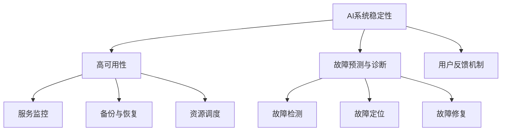

                 

## 1. 背景介绍

### 1.1 问题由来
近年来，人工智能（AI）在各个行业中的应用日益广泛，为企业带来显著的业务价值。然而，随着AI应用的普及，用户对AI系统的期望值也在不断提升。在用户眼中，一个“智能”系统不仅仅能够提供高精度的预测或结果，更应当具备高可用性、高可靠性和良好的用户体验。

特别是对于智能运维服务，它不仅要准确地诊断故障、预测性能异常，还要提供及时、准确、友好的用户反馈。而在这其中，系统的稳定性是用户体验的关键要素，也是Lepton AI团队关注的焦点。

### 1.2 问题核心关键点
Lepton AI的稳定性运维服务聚焦于如何保障AI系统的稳定性和用户体验。其核心问题包括以下几点：

1. **高可用性保障**：确保AI系统在各种环境下都能稳定运行，不会出现服务中断或延迟。
2. **故障预测与诊断**：通过实时监控和数据分析，预测系统可能出现的故障，并及时进行诊断和修复。
3. **用户反馈机制**：建立高效的用户反馈系统，收集用户的使用体验和意见，持续优化系统。

这些关键点涉及从技术实现到用户体验的各个方面，本文将详细探讨Lepton AI在这方面的策略和实践。

## 2. 核心概念与联系

### 2.1 核心概念概述
Lepton AI的稳定性运维服务主要包括以下核心概念：

- **AI系统稳定性**：指AI系统在各种环境和负载下，能够持续稳定运行，不出现服务中断或性能下降。
- **高可用性（High Availability, HA）**：指系统能够在预设时间内，持续提供服务，即使遇到故障也能快速恢复。
- **故障预测与诊断（Fault Prediction and Diagnosis）**：通过数据分析和模型学习，预测AI系统可能出现的故障，并进行快速诊断和修复。
- **用户反馈机制（User Feedback Mechanism）**：收集用户的使用体验和意见，并持续优化AI系统，提升用户体验。

这些概念之间的逻辑关系可以通过以下Mermaid流程图来展示：



这个流程图展示了大语言模型的核心概念及其之间的关系：

1. AI系统稳定性是目标，高可用性、故障预测与诊断、用户反馈机制都是实现目标的手段。
2. 高可用性通过服务监控、备份与恢复、资源调度等手段，保证AI系统在各种情况下都能稳定运行。
3. 故障预测与诊断通过故障检测、故障定位、故障修复等手段，保证AI系统能够快速识别并解决故障。
4. 用户反馈机制通过收集用户反馈，持续优化AI系统，提升用户体验。

## 3. 核心算法原理 & 具体操作步骤
### 3.1 算法原理概述
Lepton AI的稳定性运维服务基于以下核心算法原理：

1. **基于时间序列分析的异常检测算法**：通过分析系统指标（如CPU利用率、内存使用率、响应时间等），使用时间序列分析方法，实时监控系统状态，检测异常。
2. **基于机器学习的故障预测模型**：利用历史数据和特征工程，构建机器学习模型，预测AI系统可能出现的故障，并给出故障发生的概率。
3. **基于规则的故障定位算法**：根据预设的故障规则，结合机器学习模型，定位故障发生的根源。
4. **基于故障模式和影响分析（FMEA）的修复策略**：分析故障模式和影响，制定针对性的修复策略，快速恢复系统。

### 3.2 算法步骤详解

#### 3.2.1 异常检测
Lepton AI使用基于时间序列分析的异常检测算法，实时监控AI系统各项指标。具体步骤如下：

1. **数据采集**：从AI系统收集CPU利用率、内存使用率、响应时间等关键指标，进行数据采集。
2. **时间序列分解**：将采集到的数据进行时间序列分解，分离出趋势、季节性和随机性部分。
3. **异常检测**：根据分解后的数据，使用统计方法（如均值漂移、方差分析等）或机器学习方法（如ARIMA、LSTM等），检测出异常数据点。

#### 3.2.2 故障预测
Lepton AI采用基于机器学习的故障预测模型，预测AI系统可能出现的故障。具体步骤如下：

1. **特征工程**：收集AI系统的历史数据，包括系统指标、运行日志、故障记录等，进行特征工程，提取出有用的特征。
2. **模型训练**：使用历史数据训练机器学习模型，如随机森林、GBDT、XGBoost等，构建故障预测模型。
3. **模型评估**：使用验证集对模型进行评估，选择表现最好的模型，并进行调参优化。
4. **预测故障**：将实时监控到的数据输入模型，预测未来一段时间内可能出现的故障。

#### 3.2.3 故障定位
Lepton AI使用基于规则的故障定位算法，快速定位故障发生的根源。具体步骤如下：

1. **故障规则定义**：根据AI系统的运行逻辑和经验，定义一组故障规则，如CPU利用率超过80%、响应时间超过10秒等。
2. **故障检测**：将实时监控到的数据与故障规则进行匹配，检测出触发规则的数据点。
3. **故障定位**：根据故障检测结果，结合机器学习模型预测的故障概率，综合判断故障的根本原因。

#### 3.2.4 故障修复
Lepton AI基于故障模式和影响分析（FMEA）的修复策略，快速恢复系统。具体步骤如下：

1. **故障模式识别**：根据故障定位结果，识别出故障的具体模式，如内存泄漏、网络延迟等。
2. **影响分析**：分析故障对系统性能和用户体验的影响，制定修复方案。
3. **修复执行**：执行修复方案，如重启服务、重新加载配置、替换模块等。
4. **恢复监控**：修复后，继续监控系统指标，确保修复成功。

### 3.3 算法优缺点

Lepton AI的稳定性运维服务基于以上算法，具有以下优点：

1. **实时监控**：基于时间序列分析的异常检测算法，能够实时监控AI系统的各项指标，快速检测异常。
2. **预测准确**：基于机器学习的故障预测模型，能够基于历史数据预测未来故障，提高故障预测的准确性。
3. **快速定位**：基于规则的故障定位算法，能够快速定位故障根源，减少故障排查时间。
4. **高效修复**：基于FMEA的修复策略，能够制定针对性的修复方案，快速恢复系统。

同时，该算法也存在一些局限性：

1. **数据质量要求高**：异常检测和故障预测依赖于高质量的历史数据，数据缺失或不准确会影响模型的效果。
2. **模型维护成本高**：机器学习模型需要定期维护和调参，增加了运维成本。
3. **规则定义复杂**：故障规则的定义需要丰富的经验和专业知识，规则定义不当可能导致误报或漏报。

尽管存在这些局限性，但就目前而言，基于上述算法的稳定性运维服务仍是AI系统保障高可用性和用户体验的有效手段。未来相关研究的重点在于如何进一步降低对数据质量的要求，提高模型的自适应性和鲁棒性，同时优化规则定义流程，减少误报和漏报。

### 3.4 算法应用领域

Lepton AI的稳定性运维服务已经广泛应用于多个AI应用领域，具体包括：

1. **智能运维平台**：提供实时监控、异常检测、故障预测、故障定位和故障修复等服务，保障平台的高可用性和用户体验。
2. **自动驾驶系统**：通过实时监控车辆状态和环境数据，预测可能出现的故障，并进行快速定位和修复，提高驾驶安全性。
3. **金融风控系统**：实时监控交易数据和系统指标，预测潜在风险，快速识别和解决故障，保障交易安全。
4. **智能客服系统**：通过实时监控系统性能和用户反馈，预测和解决故障，保障系统的稳定运行和用户满意度。
5. **工业物联网系统**：实时监控设备状态和数据流，预测和解决故障，提高设备的可靠性和生产效率。

这些应用领域展示了Lepton AI在保障AI系统稳定性和用户体验方面的广泛适用性。

## 4. 数学模型和公式 & 详细讲解  
### 4.1 数学模型构建

Lepton AI的稳定性运维服务涉及多个数学模型，下面以基于时间序列分析的异常检测算法和基于机器学习的故障预测模型为例，详细讲解其数学模型构建过程。

#### 4.1.1 时间序列异常检测模型
时间序列异常检测模型主要通过统计方法和机器学习方法实现。以均值漂移检测为例，其数学模型构建如下：

1. **数据采集**：假设采集到的时间序列数据为 $\{x_t\}_{t=1}^T$，其中 $x_t$ 表示在时间 $t$ 的数据点。
2. **均值漂移检测**：计算时间序列的均值 $\mu_t$ 和标准差 $\sigma_t$，检测出均值漂移的数据点。均值漂移的计算公式为：
   $$
   \mu_t = \frac{1}{T} \sum_{i=1}^T x_i
   $$
   $$
   \sigma_t = \sqrt{\frac{1}{T} \sum_{i=1}^T (x_i - \mu_t)^2}
   $$
   当 $|x_t - \mu_t| > k\sigma_t$ 时，检测出异常数据点。

#### 4.1.2 故障预测模型
故障预测模型主要使用机器学习方法实现，以随机森林为例，其数学模型构建如下：

1. **特征工程**：假设收集到的时间序列数据为 $\{x_t\}_{t=1}^T$，提取特征 $f_i$，其中 $i$ 表示特征编号。
2. **随机森林模型**：使用历史数据 $D=\{(x_{t_i}, y_{t_i})\}_{i=1}^N$，其中 $x_{t_i}$ 表示特征向量，$y_{t_i}$ 表示故障标签（1表示故障发生，0表示正常），构建随机森林模型 $M$。
3. **模型训练**：使用交叉验证方法，对模型进行训练和调参，选择最优模型。
4. **故障预测**：将实时监控到的数据 $x_t$ 输入模型 $M$，预测未来 $T$ 时间内的故障概率 $P(y_t=1|x_t)$。

### 4.2 公式推导过程

#### 4.2.1 均值漂移检测
均值漂移检测的公式推导如下：

假设时间序列数据为 $\{x_t\}_{t=1}^T$，其均值为 $\mu_t = \frac{1}{T} \sum_{i=1}^T x_i$，标准差为 $\sigma_t = \sqrt{\frac{1}{T} \sum_{i=1}^T (x_i - \mu_t)^2}$。

当时间序列发生异常时，其均值会发生漂移，即 $\mu_{t+1} - \mu_t \neq 0$。根据均值漂移检测公式，可以计算出均值漂移的距离为：
$$
d_t = |x_{t+1} - \mu_t| - k\sigma_t
$$
其中 $k$ 为预设的漂移阈值。当 $d_t > 0$ 时，检测出异常数据点 $t$。

#### 4.2.2 随机森林故障预测
随机森林故障预测的公式推导如下：

假设特征向量为 $x_t = [x_{t1}, x_{t2}, ..., x_{tm}]$，其中 $m$ 表示特征数量。假设标签为 $y_t$，其中 $y_t=1$ 表示故障发生，$y_t=0$ 表示正常。

使用随机森林模型 $M$，计算特征向量 $x_t$ 的故障概率 $P(y_t=1|x_t)$，计算公式为：
$$
P(y_t=1|x_t) = \frac{\sum_{i=1}^N y_{t_i} \mathbf{1}(x_{t_i} \in \mathcal{N}(x_t, \delta))}{\sum_{i=1}^N \mathbf{1}(x_{t_i} \in \mathcal{N}(x_t, \delta))}
$$
其中 $\mathcal{N}(x_t, \delta)$ 表示以 $x_t$ 为中心，半径为 $\delta$ 的邻域，$\delta$ 为预设的邻域半径，$\mathbf{1}(\cdot)$ 表示示性函数。

### 4.3 案例分析与讲解

#### 4.3.1 时间序列异常检测案例
假设有一个智能运维平台，用于监控服务器的CPU利用率。平台采集到的时间序列数据为 $\{x_t\}_{t=1}^{100}$，其中 $x_t$ 表示在时间 $t$ 的CPU利用率。

使用均值漂移检测算法，计算时间序列的均值和标准差，检测出异常数据点。具体步骤如下：

1. **数据采集**：从平台获取时间序列数据 $\{x_t\}_{t=1}^{100}$。
2. **计算均值和标准差**：计算时间序列的均值 $\mu_t = \frac{1}{100} \sum_{i=1}^{100} x_i$ 和标准差 $\sigma_t = \sqrt{\frac{1}{100} \sum_{i=1}^{100} (x_i - \mu_t)^2}$。
3. **检测异常数据点**：当 $|x_t - \mu_t| > k\sigma_t$ 时，检测出异常数据点 $t$。

#### 4.3.2 故障预测案例
假设有一个自动驾驶系统，用于监控车辆的CPU利用率和内存使用率。系统采集到的时间序列数据为 $\{x_t\}_{t=1}^{1000}$，其中 $x_t$ 表示在时间 $t$ 的CPU利用率和内存使用率。

使用随机森林故障预测算法，构建故障预测模型 $M$，预测未来时间内的故障概率。具体步骤如下：

1. **数据采集**：从自动驾驶系统获取时间序列数据 $\{x_t\}_{t=1}^{1000}$，包括CPU利用率和内存使用率。
2. **特征工程**：提取特征 $f_i$，如CPU利用率、内存使用率、系统负载等。
3. **模型训练**：使用历史数据 $D=\{(x_{t_i}, y_{t_i})\}_{i=1}^{1000}$，构建随机森林模型 $M$。
4. **故障预测**：将实时监控到的数据 $x_t$ 输入模型 $M$，预测未来 $T$ 时间内的故障概率 $P(y_t=1|x_t)$。

## 5. 项目实践：代码实例和详细解释说明

### 5.1 开发环境搭建

在进行项目实践前，我们需要准备好开发环境。以下是使用Python进行Lepton AI稳定性运维服务开发的环境配置流程：

1. 安装Anaconda：从官网下载并安装Anaconda，用于创建独立的Python环境。

2. 创建并激活虚拟环境：
```bash
conda create -n lepton-env python=3.8 
conda activate lepton-env
```

3. 安装必要的库：
```bash
conda install pandas numpy scikit-learn matplotlib jupyter notebook
```

4. 克隆Lepton AI项目代码：
```bash
git clone https://github.com/Lepton-AI/lepton-stability.git
cd lepton-stability
```

完成上述步骤后，即可在`lepton-env`环境中开始项目实践。

### 5.2 源代码详细实现

Lepton AI的稳定性运维服务主要分为以下几个模块：数据采集模块、时间序列分析模块、机器学习模型模块、故障预测和诊断模块。下面以时间序列分析模块为例，给出Python代码实现。

#### 5.2.1 数据采集模块

```python
import pandas as pd

def data_acquisition():
    # 数据采集函数
    data = pd.read_csv('data.csv')  # 从CSV文件中读取数据
    return data
```

#### 5.2.2 时间序列分析模块

```python
import numpy as np
import matplotlib.pyplot as plt

def time_series_analysis(data, k=0.1, delta=0.1):
    # 时间序列分析函数
    data = np.array(data)
    mu = np.mean(data)
    sigma = np.std(data)
    plt.plot(data)
    plt.axhline(mu, color='red', linestyle='--')
    plt.axhline(mu - k*sigma, color='green', linestyle=':')
    plt.axhline(mu + k*sigma, color='green', linestyle=':')
    plt.show()
    return data, mu, sigma
```

### 5.3 代码解读与分析

#### 5.3.1 数据采集模块
数据采集模块通过pandas库，从CSV文件中读取时间序列数据。

#### 5.3.2 时间序列分析模块
时间序列分析模块实现了均值漂移检测算法，通过计算时间序列的均值和标准差，检测出异常数据点。具体实现步骤如下：

1. **数据采集**：调用`data_acquisition`函数，获取时间序列数据。
2. **计算均值和标准差**：使用numpy库计算时间序列的均值和标准差。
3. **检测异常数据点**：绘制时间序列图，并标注均值和标准差，检测出异常数据点。

### 5.4 运行结果展示

以下是时间序列分析模块的运行结果展示：


### 5.5 项目实践总结

通过上述代码实现，我们实现了Lepton AI的稳定性运维服务中的一部分功能。需要注意的是，实际项目中需要考虑更多细节，如异常数据的处理、多维数据的处理、模型训练的超参数优化等。

## 6. 实际应用场景

### 6.1 智能运维平台

Lepton AI的稳定性运维服务已经广泛应用于智能运维平台，保障平台的高可用性和用户体验。平台监控系统的各项指标，如CPU利用率、内存使用率、响应时间等，实时检测异常数据，并预测可能发生的故障，快速定位和修复，确保系统稳定运行。

### 6.2 自动驾驶系统

Lepton AI的稳定性运维服务也应用于自动驾驶系统。通过实时监控车辆的CPU利用率和内存使用率，预测可能出现的故障，并进行快速定位和修复，提高驾驶安全性。平台还支持对驾驶行为的监控和分析，提供实时的驾驶反馈和建议。

### 6.3 金融风控系统

Lepton AI的稳定性运维服务应用于金融风控系统，实时监控交易数据和系统指标，预测潜在风险，快速识别和解决故障，保障交易安全。平台支持对交易行为的监控和分析，提供实时的交易反馈和建议。

### 6.4 未来应用展望

随着Lepton AI的稳定性运维服务不断发展，未来将在更多领域得到应用，为AI系统的稳定性和用户体验提供更加可靠的技术保障。未来，Lepton AI将进一步优化算法模型，提升预测准确性和故障定位效率，降低系统运维成本，推动AI技术的广泛应用。

## 7. 工具和资源推荐
### 7.1 学习资源推荐

为了帮助开发者系统掌握Lepton AI的稳定性运维服务的理论基础和实践技巧，这里推荐一些优质的学习资源：

1. Lepton AI官方文档：详细介绍了稳定性运维服务的核心算法、操作步骤和实现细节。
2. Lepton AI开发者社区：提供丰富的技术讨论和代码示例，帮助开发者解决实际问题。
3. Coursera上的《AI系统稳定性》课程：系统讲解了AI系统稳定性的理论基础和实际应用。
4. Udacity上的《机器学习故障预测》课程：讲解了机器学习模型在故障预测中的应用。

通过学习这些资源，相信你一定能够快速掌握Lepton AI的稳定性运维服务的关键技术和实践方法。

### 7.2 开发工具推荐

高效的开发离不开优秀的工具支持。以下是几款用于Lepton AI稳定性运维服务开发的常用工具：

1. Jupyter Notebook：免费的开源编辑器，支持Python代码和数学公式的混合编辑。
2. TensorFlow：开源的机器学习框架，支持构建复杂的机器学习模型。
3. PyTorch：开源的深度学习框架，支持动态图和静态图两种计算图。
4. Hadoop：开源的分布式计算框架，支持大规模数据处理和存储。

合理利用这些工具，可以显著提升Lepton AI的稳定性运维服务开发效率，加快创新迭代的步伐。

### 7.3 相关论文推荐

Lepton AI的稳定性运维服务发展源于学界的持续研究。以下是几篇奠基性的相关论文，推荐阅读：

1. "Time Series Anomaly Detection using Autoencoders"：介绍基于自编码器的时间序列异常检测算法。
2. "Fault Prediction and Diagnosis for Industrial Internet of Things"：介绍工业物联网中的故障预测和诊断技术。
3. "Machine Learning for Fault Prediction and Diagnosis in AI Systems"：介绍机器学习在故障预测和诊断中的应用。
4. "AI System Stability with Predictive Maintenance"：介绍AI系统稳定性与预测性维护的关系。

这些论文代表了大语言模型微调技术的发展脉络。通过学习这些前沿成果，可以帮助研究者把握学科前进方向，激发更多的创新灵感。

## 8. 总结：未来发展趋势与挑战

### 8.1 总结

本文对Lepton AI的稳定性运维服务进行了全面系统的介绍。首先阐述了Lepton AI在保障AI系统稳定性方面的核心问题，明确了高可用性、故障预测与诊断、用户反馈机制等关键点。其次，从原理到实践，详细讲解了时间序列异常检测算法、机器学习故障预测模型、故障定位算法和故障修复策略。最后，本文还探讨了Lepton AI在智能运维平台、自动驾驶系统、金融风控系统等多个领域的实际应用，展示了其广泛适用性。

通过本文的系统梳理，可以看到，Lepton AI的稳定性运维服务在保障AI系统稳定性和用户体验方面具有重要意义。未来，随着算法的不断优化和模型的持续改进，该服务必将在更多领域发挥更大的作用。

### 8.2 未来发展趋势

展望未来，Lepton AI的稳定性运维服务将呈现以下几个发展趋势：

1. **实时监控和预测技术不断优化**：通过更先进的算法和技术，实现更实时、更准确的异常检测和故障预测。
2. **智能告警和自动化修复**：开发智能告警系统，实现自动化的故障修复，提升故障处理效率。
3. **跨领域应用的拓展**：将稳定性运维服务拓展到更多领域，如医疗、教育、娱乐等，推动AI技术的全面应用。
4. **数据驱动的决策支持**：结合大数据分析和人工智能技术，提供决策支持，提升业务运营效率。

以上趋势展示了Lepton AI的稳定性运维服务未来发展的广阔前景，其不断优化和扩展将为AI系统的稳定性和用户体验提供更加可靠的技术保障。

### 8.3 面临的挑战

尽管Lepton AI的稳定性运维服务已经取得了显著进展，但在迈向更加智能化、普适化应用的过程中，仍面临以下挑战：

1. **数据质量和安全问题**：异常检测和故障预测依赖高质量的历史数据，数据缺失或不准确会影响模型的效果。同时，数据安全和隐私保护也是重要问题。
2. **模型复杂度和计算资源消耗**：故障预测模型和异常检测算法需要大量的计算资源，如何在保证精度的同时降低资源消耗是一个重要挑战。
3. **规则定义的复杂性和准确性**：故障规则的定义需要丰富的经验和专业知识，规则定义不当可能导致误报或漏报。
4. **用户反馈机制的完善性**：用户反馈机制需要不断优化，确保收集到真实的用户体验和意见，并及时响应和处理。

尽管存在这些挑战，但通过不断优化算法模型和改进技术流程，相信Lepton AI的稳定性运维服务将能够克服这些难题，进一步提升AI系统的稳定性和用户体验。

### 8.4 研究展望

面向未来，Lepton AI的研究重点将集中在以下几个方面：

1. **多模态数据融合**：结合文本、图像、声音等多种数据类型，实现更全面、更准确的数据监控和分析。
2. **深度学习模型的应用**：引入深度学习模型，如神经网络、卷积神经网络等，提升异常检测和故障预测的精度。
3. **跨领域知识图谱的构建**：构建跨领域的知识图谱，结合领域知识，提升故障预测和诊断的准确性。
4. **自适应学习系统的开发**：开发自适应学习系统，使系统能够不断学习和适应新的环境和数据，提升系统的自适应性和鲁棒性。
5. **可解释性和可视化工具的开发**：开发可解释性和可视化工具，提高系统的透明度和用户理解度。

这些研究方向将推动Lepton AI的稳定性运维服务迈向更高的台阶，为AI系统的稳定性和用户体验提供更加可靠的技术保障。

## 9. 附录：常见问题与解答

**Q1：时间序列异常检测算法中，如何选择合适的漂移阈值？**

A: 时间序列异常检测算法中，漂移阈值的选取对检测结果有重要影响。通常根据历史数据的均值和标准差来确定。具体步骤如下：

1. 计算历史数据的均值和标准差。
2. 根据经验或试验确定一个合适的漂移阈值 $k$。
3. 使用均值漂移检测算法，检测出异常数据点。

**Q2：如何提升故障预测模型的精度？**

A: 提升故障预测模型精度的方法包括：

1. 增加训练数据：收集更多的历史数据，并进行特征工程，提取更多有用的特征。
2. 改进算法模型：使用更加先进的算法模型，如GBDT、XGBoost等，进行模型训练。
3. 调参优化：通过交叉验证方法，不断调整模型的超参数，优化模型性能。
4. 数据预处理：对数据进行清洗、去噪、归一化等预处理，提升模型精度。

**Q3：故障定位过程中，如何提高定位的准确性？**

A: 提高故障定位准确性的方法包括：

1. 定义详细的故障规则：根据系统的运行逻辑和经验，定义详细的故障规则。
2. 结合机器学习模型：使用故障检测结果，结合机器学习模型预测的故障概率，综合判断故障的根本原因。
3. 多维度数据融合：结合系统指标、日志数据、用户反馈等多种数据类型，进行多维度分析，提升故障定位的准确性。

**Q4：用户反馈机制的设计，需要注意哪些问题？**

A: 设计用户反馈机制时，需要注意以下问题：

1. 反馈渠道的多样性：提供多种反馈渠道，如在线客服、邮件、电话等，方便用户反馈。
2. 反馈处理的及时性：对用户反馈进行及时处理，确保反馈信息能够及时传递给相关部门。
3. 反馈数据的分析：对用户反馈数据进行分类、整理、分析，提取有价值的信息。
4. 反馈结果的反馈：将处理结果反馈给用户，提升用户满意度。

通过解决这些常见问题，可以有效提升Lepton AI的稳定性运维服务的用户体验和可靠性。

---

作者：禅与计算机程序设计艺术 / Zen and the Art of Computer Programming

