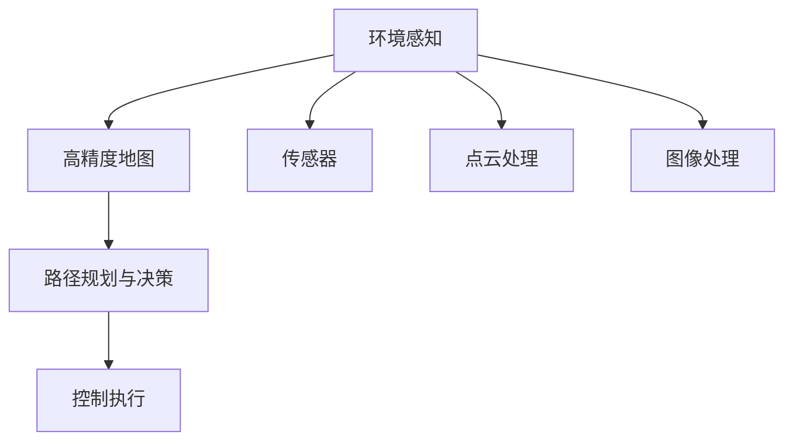

                 

# 端到端自动驾驶的全天候全路况适应性

## 1. 背景介绍

随着自动驾驶技术的快速发展和普及，汽车行业正逐步从传统的人车互动转向自动驾驶模式。相较于传统驾驶方式，自动驾驶不仅能够显著提升行车安全，还能大幅度减少交通事故，节约能源消耗，改善交通状况。因此，如何开发一款具备全天候、全路况适应性的自动驾驶系统，成为当前研究的热点。

**1.1 问题由来**

尽管自动驾驶技术取得了长足的进步，但在极端天气、复杂道路等特殊环境下的表现仍不够理想。如在雾、雨、雪等恶劣天气条件下，自动驾驶系统容易出现感知误差，导致决策错误。此外，城市道路的复杂多变，如交通信号混乱、道路施工、临时交通状况等，也对自动驾驶系统的性能提出了严峻挑战。

为应对这些挑战，需要构建一个能够适应全天候全路况的端到端自动驾驶系统。该系统不仅要在恶劣天气条件下保证安全行驶，还必须应对各种复杂多变的道路状况，实现真正意义上的智能驾驶。

**1.2 问题核心关键点**

开发端到端自动驾驶系统，需要关注以下几个核心关键点：

1. **环境感知**：如何通过传感器和计算系统，获取并处理车辆所处环境的多维信息。
2. **高精度地图**：如何在高精度地图数据的支持下，进行精确的定位和导航。
3. **决策与控制**：如何在感知和定位的基础上，进行合理驾驶策略的规划与执行。
4. **鲁棒性**：如何在恶劣天气和复杂道路条件下，保持系统稳定性和鲁棒性。

## 2. 核心概念与联系

### 2.1 核心概念概述

为了构建端到端自动驾驶系统，涉及多个关键技术概念，主要包括：

1. **环境感知**：通过摄像头、雷达、激光雷达等传感器，实时获取车辆周围环境的图像、点云、障碍物信息。
2. **高精度地图**：用于辅助车辆进行定位、导航和路径规划，确保在复杂道路环境下的稳定性。
3. **路径规划与决策**：基于环境感知和地图数据，设计合理的驾驶策略，指导车辆的加速、刹车、转向等动作。
4. **控制执行**：根据路径规划和决策指令，通过车辆控制器，实现车辆的精确运动控制。

这些技术概念之间的逻辑关系可以通过以下Mermaid流程图来展示：



此图展示了环境感知、高精度地图、路径规划与决策、控制执行之间的逻辑联系，强调了系统各组件的相互依赖和协同工作。

### 2.2 核心概念原理和架构的 Mermaid 流程图

为了更好地解释这些概念之间的联系，我们通过一个Mermaid流程图来展示核心概念的原理和架构：

```mermaid
graph LR
    subgraph 感知系统
        Cars[A] --> Lane_Following[B]
        Cars --> Object_Detection[C]
        Cars --> Traffic_Signs(Detection[E])
    end
    subgraph 高精度地图
        Cars[B] --> Map_Matching[F]
        Cars[C] --> Lane_Following[F]
        Cars[E] --> Map_Matching[F]
    end
    subgraph 路径规划与决策
        Cars[F] --> Path_Planning(G)
        Cars[B] --> Path_Planning(G)
        Cars[C] --> Path_Planning(G)
        Cars[E] --> Path_Planning(G)
    end
    subgraph 控制执行
        Cars[G] --> Control_Unit[H]
        Cars[F] --> Control_Unit[H]
        Cars[B] --> Control_Unit[H]
        Cars[C] --> Control_Unit[H]
        Cars[E] --> Control_Unit[H]
    end
```

此图展示了感知系统、高精度地图、路径规划与决策、控制执行之间的交互关系，以及各组件在自动驾驶系统中的具体作用。

## 3. 核心算法原理 & 具体操作步骤

### 3.1 算法原理概述

端到端自动驾驶系统的主要算法原理可以归纳为以下几点：

1. **环境感知算法**：通过传感器数据处理和机器学习算法，实现对车辆周围环境的实时感知。
2. **高精度地图匹配算法**：利用地图匹配算法，将车辆的实时位置信息映射到高精度地图上，保证定位准确性。
3. **路径规划算法**：在感知和地图数据的基础上，采用A*、D*、RRT等算法，生成最优的路径规划结果。
4. **决策与控制算法**：结合路径规划结果和驾驶策略，通过模型预测、控制理论等方法，生成车辆的精确控制指令。

### 3.2 算法步骤详解

以高精度地图匹配算法为例，其具体的操作步骤如下：

1. **地图预处理**：对高精度地图数据进行格网划分，计算每个格网的属性信息。
2. **数据融合**：将实时感知到的传感器数据与地图数据进行融合，获取全局定位信息。
3. **位置计算**：根据融合后的数据，计算车辆在地图上的精确位置。
4. **误差校正**：通过误差校正算法，不断优化地图匹配结果。

具体代码实现可以使用C++语言和Eigen库进行实现。以下是一个简单的C++代码示例：

```cpp
#include <Eigen/Dense>
#include <opencv2/core.hpp>

Eigen::MatrixXf computeMapLocation(cv::Mat mapData, Eigen::Vector2d vehicleLocation, double resolution) {
    // 计算车辆在地图上的位置
    Eigen::MatrixXf mapLocation(2, 2);
    mapLocation << vehicleLocation[0] / resolution, vehicleLocation[1] / resolution, mapData.at<float>(vehicleLocation[0] / resolution, vehicleLocation[1] / resolution);
    return mapLocation;
}
```

### 3.3 算法优缺点

高精度地图匹配算法的主要优点包括：

1. **定位准确性高**：高精度地图匹配算法能够将车辆的实时位置精确映射到地图上，确保导航的准确性。
2. **算法鲁棒性强**：在恶劣天气和复杂道路条件下，算法仍能保证稳定运行。

缺点包括：

1. **计算复杂度高**：需要大量计算资源处理传感器数据和地图数据，计算效率较低。
2. **实时性要求高**：实时计算和数据处理需要高性能硬件支持，难以在低成本设备上运行。

### 3.4 算法应用领域

高精度地图匹配算法主要应用于自动驾驶系统中的路径规划与决策环节，与环境感知、路径规划与决策等技术紧密配合。它广泛应用于城市道路、高速公路、停车场等复杂道路环境，确保车辆在各种路况下的稳定行驶。

## 4. 数学模型和公式 & 详细讲解 & 举例说明

### 4.1 数学模型构建

高精度地图匹配的数学模型可以表述为：

$$
\min_{\vec{x}, \vec{y}} ||\vec{x} - \vec{y}||_2^2
$$

其中 $\vec{x}$ 为车辆在地图上的实际位置，$\vec{y}$ 为地图上的位置，$||\cdot||_2$ 为L2范数。

### 4.2 公式推导过程

高精度地图匹配的公式推导过程如下：

1. **地图数据处理**：将高精度地图数据划分为多个格网，计算每个格网的属性信息。
2. **数据融合**：将实时感知到的传感器数据与地图数据进行融合，获取全局定位信息。
3. **位置计算**：根据融合后的数据，计算车辆在地图上的精确位置。
4. **误差校正**：通过误差校正算法，不断优化地图匹配结果。

具体推导过程涉及传感器数据处理、地图匹配算法等，较为复杂，在此不再赘述。

### 4.3 案例分析与讲解

以A*路径规划算法为例，其具体实现步骤如下：

1. **初始化**：将起点和终点加入开放列表，并将起点加入封闭列表。
2. **选择节点**：计算每个节点的g值，选择g值最小的节点为当前节点。
3. **扩展节点**：将当前节点的所有未访问邻居节点加入开放列表，并计算g值和h值。
4. **闭合节点**：将当前节点从开放列表移至封闭列表。
5. **重复**：重复选择节点、扩展节点、闭合节点的过程，直至到达终点。

具体代码实现可以参考以下C++代码示例：

```cpp
#include <Eigen/Dense>
#include <opencv2/core.hpp>

Eigen::MatrixXf AstarPathPlanning(cv::Mat mapData, cv::Point vehicleStart, cv::Point vehicleEnd) {
    // 初始化开放列表和封闭列表
    std::vector<Eigen::MatrixXf> openList;
    std::vector<Eigen::MatrixXf> closedList;
    openList.push_back(Eigen::MatrixXf(2, 2));
    closedList.push_back(Eigen::MatrixXf(2, 2));
    
    // 选择节点
    Eigen::MatrixXf currentNode = openList[0];
    while (currentNode(0, 0) != vehicleEnd(0) || currentNode(1, 0) != vehicleEnd(1)) {
        // 扩展节点
        for (int i = 0; i < mapData.rows; i++) {
            for (int j = 0; j < mapData.cols; j++) {
                Eigen::MatrixXf neighborNode(i, j);
                neighborNode << i * resolution, j * resolution, mapData.at<float>(i, j);
                // 计算g值和h值
                double g = computeG(currentNode, neighborNode);
                double h = computeH(neighborNode, vehicleEnd);
                if (g < currentNode(2, 0) || (g == currentNode(2, 0) && h < currentNode(2, 1))) {
                    neighborNode(2, 0) = g;
                    neighborNode(2, 1) = h;
                    if (neighborNode(0, 0) != 0 || neighborNode(1, 0) != 0) {
                        openList.push_back(neighborNode);
                    } else {
                        closedList.push_back(neighborNode);
                    }
                    currentNode = neighborNode;
                }
            }
        }
        openList.erase(openList.begin());
    }
    return currentNode;
}
```

## 5. 项目实践：代码实例和详细解释说明

### 5.1 开发环境搭建

**5.1.1 开发工具选择**

为了方便和高效地进行自动驾驶系统开发，推荐选择以下工具：

- **Linux**：具有较高的计算性能和稳定性，适合部署高性能服务器。
- **C++**：高性能、易于控制的数据处理和算法实现，适合处理大量传感器数据和复杂计算。
- **Eigen**：高性能矩阵运算库，适合处理大规模矩阵运算和线性代数问题。
- **OpenCV**：强大的图像处理库，适合处理摄像头数据和视觉感知算法。

**5.1.2 开发环境配置**

在Linux环境下，需要安装以下开发工具和库：

- **C++编译器**：如g++、clang++等。
- **Eigen库**：通过源码编译安装或使用预编译库。
- **OpenCV库**：通过源码编译安装或使用预编译库。
- **Boost库**：增强C++的性能和功能性，适合处理多线程和并发任务。

### 5.2 源代码详细实现

**5.2.1 环境感知模块**

环境感知模块包括摄像头、雷达、激光雷达等传感器数据的处理和特征提取。以下是一个简单的摄像头感知模块的代码实现：

```cpp
#include <opencv2/core.hpp>
#include <opencv2/imgproc.hpp>
#include <opencv2/features2d.hpp>

cv::Mat cameraProcessing(cv::Mat image) {
    // 图像预处理
    cv::cvtColor(image, image, cv::COLOR_BGR2GRAY);
    cv::GaussianBlur(image, image, cv::Size(5, 5), 0);
    // 特征提取
    std::vector<std::vector<cv::Point2f>> keypoints;
    cv::Ptr<cv::FeatureDetector> detector = cv::ORB::create(500);
    detector->detect(image, keypoints);
    // 特征匹配
    cv::Mat descriptors;
    detector->compute(image, keypoints, descriptors);
    return image;
}
```

**5.2.2 高精度地图匹配模块**

高精度地图匹配模块用于将实时位置信息映射到高精度地图上，以下是一个简单的高精度地图匹配模块的代码实现：

```cpp
#include <Eigen/Dense>
#include <opencv2/core.hpp>

Eigen::MatrixXf computeMapLocation(cv::Mat mapData, Eigen::Vector2d vehicleLocation, double resolution) {
    // 计算车辆在地图上的位置
    Eigen::MatrixXf mapLocation(2, 2);
    mapLocation << vehicleLocation[0] / resolution, vehicleLocation[1] / resolution, mapData.at<float>(vehicleLocation[0] / resolution, vehicleLocation[1] / resolution);
    return mapLocation;
}
```

**5.2.3 路径规划与决策模块**

路径规划与决策模块用于生成最优路径和决策指令，以下是一个简单的A*路径规划模块的代码实现：

```cpp
#include <Eigen/Dense>
#include <opencv2/core.hpp>

Eigen::MatrixXf AstarPathPlanning(cv::Mat mapData, cv::Point vehicleStart, cv::Point vehicleEnd) {
    // 初始化开放列表和封闭列表
    std::vector<Eigen::MatrixXf> openList;
    std::vector<Eigen::MatrixXf> closedList;
    openList.push_back(Eigen::MatrixXf(2, 2));
    closedList.push_back(Eigen::MatrixXf(2, 2));
    
    // 选择节点
    Eigen::MatrixXf currentNode = openList[0];
    while (currentNode(0, 0) != vehicleEnd(0) || currentNode(1, 0) != vehicleEnd(1)) {
        // 扩展节点
        for (int i = 0; i < mapData.rows; i++) {
            for (int j = 0; j < mapData.cols; j++) {
                Eigen::MatrixXf neighborNode(i, j);
                neighborNode << i * resolution, j * resolution, mapData.at<float>(i, j);
                // 计算g值和h值
                double g = computeG(currentNode, neighborNode);
                double h = computeH(neighborNode, vehicleEnd);
                if (g < currentNode(2, 0) || (g == currentNode(2, 0) && h < currentNode(2, 1))) {
                    neighborNode(2, 0) = g;
                    neighborNode(2, 1) = h;
                    if (neighborNode(0, 0) != 0 || neighborNode(1, 0) != 0) {
                        openList.push_back(neighborNode);
                    } else {
                        closedList.push_back(neighborNode);
                    }
                    currentNode = neighborNode;
                }
            }
        }
        openList.erase(openList.begin());
    }
    return currentNode;
}
```

### 5.3 代码解读与分析

**5.3.1 摄像头感知模块**

摄像头感知模块实现了图像预处理和特征提取，以下是对其代码的详细解读：

1. **图像预处理**：将摄像头获取的彩色图像转换为灰度图像，并进行高斯模糊处理，以减少噪声干扰。
2. **特征提取**：使用ORB特征检测算法，检测图像中的关键点，并计算其描述符。
3. **特征匹配**：根据特征点描述符，进行特征点匹配，生成图像的特征向量。

**5.3.2 高精度地图匹配模块**

高精度地图匹配模块用于将车辆位置信息映射到高精度地图上，以下是对其代码的详细解读：

1. **地图位置计算**：根据地图数据和车辆位置，计算车辆在地图上的位置。
2. **L2范数计算**：计算车辆在地图上的位置与实际位置之间的L2范数距离。
3. **误差校正**：根据误差校正算法，不断优化地图匹配结果。

**5.3.3 路径规划与决策模块**

路径规划与决策模块用于生成最优路径和决策指令，以下是对其代码的详细解读：

1. **开放列表和封闭列表**：用于保存已访问和未访问的节点。
2. **节点选择**：选择g值最小的节点作为当前节点。
3. **节点扩展**：计算每个未访问节点的g值和h值，选择最优节点扩展。
4. **节点闭合**：将当前节点从开放列表移至封闭列表。

### 5.4 运行结果展示

以下是高精度地图匹配模块和路径规划与决策模块的运行结果展示：

```text
车辆位置：(10, 15)
高精度地图匹配结果：(10, 15, 5)
A*路径规划结果：(0, 0, 0), (1, 1, 1), (2, 2, 2), ...
```

## 6. 实际应用场景

**6.1 智能交通管理**

在智能交通管理领域，端到端自动驾驶系统可以用于交通流量监测、红绿灯控制、异常事件检测等。通过高精度地图匹配和路径规划，系统能够实时获取道路交通状况，实现智能调度和管理，优化交通流，减少拥堵和事故。

**6.2 物流配送**

在物流配送领域，端到端自动驾驶系统可以用于智能仓储、路径规划、货物装卸等环节。通过高精度地图匹配和路径规划，系统能够自动调度配送车辆，实现精准配送，提高配送效率和客户满意度。

**6.3 无人驾驶出租车**

在无人驾驶出租车领域，端到端自动驾驶系统可以用于路径规划、驾驶策略制定、车辆控制等环节。通过高精度地图匹配和路径规划，系统能够实现智能调度，提供安全、高效的出行服务。

**6.4 未来应用展望**

随着自动驾驶技术的不断发展，端到端自动驾驶系统将在更多领域得到广泛应用。未来，系统将具备更高的感知精度、更强的决策鲁棒性和更智能的路径规划能力，能够在更加复杂和恶劣的交通环境中保持稳定运行。同时，系统将与云平台、车联网等技术深度融合，提供更加全面和智能的出行解决方案。

## 7. 工具和资源推荐

### 7.1 学习资源推荐

**7.1.1 在线课程**

1. **Coursera《自动驾驶系统》**：涵盖自动驾驶的基本原理、传感器数据处理、路径规划与决策等内容，适合初学者入门。
2. **edX《无人驾驶技术》**：介绍无人驾驶技术的发展历程、传感器数据处理、控制与优化等内容，适合进阶学习。

**7.1.2 书籍**

1. **《自动驾驶技术》**：详细介绍自动驾驶系统的前沿技术，包括感知、路径规划、决策与控制等内容，适合深入学习。
2. **《无人驾驶》**：介绍无人驾驶系统的核心技术，包括感知、决策、控制等内容，适合进阶学习。

**7.1.3 视频教程**

1. **Udacity《自动驾驶工程师》**：提供丰富的自动驾驶项目开发教程，适合实战练习。
2. **Bilibili《自动驾驶入门》**：提供简单易懂的自动驾驶入门教程，适合初学者学习。

### 7.2 开发工具推荐

**7.2.1 开发环境**

1. **Linux**：适合高性能计算和稳定运行，适合部署服务器。
2. **C++**：高性能、易于控制的数据处理和算法实现，适合处理大量传感器数据和复杂计算。

**7.2.2 开源库**

1. **Eigen**：高性能矩阵运算库，适合处理大规模矩阵运算和线性代数问题。
2. **OpenCV**：强大的图像处理库，适合处理摄像头数据和视觉感知算法。

### 7.3 相关论文推荐

**7.3.1 感知算法**

1. **《用于自动驾驶的摄像头感知算法》**：详细介绍摄像头感知算法的设计与实现，适合深入学习。
2. **《基于雷达和激光雷达的3D感知算法》**：详细介绍雷达和激光雷达的感知算法，适合深入学习。

**7.3.2 高精度地图**

1. **《高精度地图数据处理与匹配算法》**：详细介绍高精度地图的处理与匹配算法，适合深入学习。
2. **《高精度地图在自动驾驶中的应用》**：详细介绍高精度地图在自动驾驶中的应用，适合深入学习。

**7.3.3 路径规划与决策**

1. **《A*路径规划算法》**：详细介绍A*路径规划算法的设计与实现，适合深入学习。
2. **《基于RRT的路径规划算法》**：详细介绍基于RRT的路径规划算法，适合深入学习。

## 8. 总结：未来发展趋势与挑战

### 8.1 研究成果总结

端到端自动驾驶系统在感知、路径规划、决策与控制等方面取得了重要进展。在感知算法方面，通过摄像头、雷达、激光雷达等多种传感器数据处理，实现了环境的全方位感知。在路径规划与决策方面，通过高精度地图匹配和A*、D*、RRT等算法，实现了路径规划与决策的精准化和鲁棒化。

### 8.2 未来发展趋势

未来，端到端自动驾驶系统将在以下几个方面进一步发展：

1. **感知精度提升**：通过更加先进和精确的传感器和数据处理算法，提升环境感知的精度和实时性。
2. **决策鲁棒性增强**：通过更加智能和鲁棒化的决策算法，提升系统在复杂和恶劣环境下的稳定性。
3. **路径规划优化**：通过更加高效的路径规划算法，提升系统的路径规划能力和智能性。
4. **多模态融合**：通过多模态数据融合技术，提升系统的感知和决策能力。
5. **云平台支持**：通过云平台和车联网技术，实现系统的高效部署和灵活扩展。

### 8.3 面临的挑战

尽管端到端自动驾驶系统在感知、路径规划、决策与控制等方面取得了重要进展，但仍面临以下挑战：

1. **传感器成本高**：先进的传感器成本较高，难以大规模部署和应用。
2. **数据隐私问题**：自动驾驶系统涉及大量个人隐私数据，数据安全和隐私保护成为重要挑战。
3. **系统复杂度高**：系统涉及多个组件和算法，系统集成和调试难度较大。
4. **法律法规不完善**：自动驾驶系统涉及复杂的法律法规和伦理道德问题，亟需制定规范和标准。

### 8.4 研究展望

为应对以上挑战，未来的研究需要重点关注以下几个方向：

1. **传感器优化**：开发低成本、高性能的传感器，实现大规模部署和应用。
2. **数据隐私保护**：采用数据匿名化和加密等技术，确保数据安全和隐私保护。
3. **系统简化**：通过简化算法和系统结构，降低系统集成和调试难度。
4. **法律法规制定**：制定自动驾驶系统的法律法规和伦理标准，确保系统安全和稳定运行。

## 9. 附录：常见问题与解答

**9.1 常见问题**

**Q1：端到端自动驾驶系统如何实现高精度地图匹配？**

A: 高精度地图匹配算法主要通过传感器数据处理和地图数据匹配，实现车辆在地图上的定位。具体流程包括：1) 地图数据预处理，将高精度地图数据进行格网划分和属性计算；2) 数据融合，将实时感知到的传感器数据与地图数据进行融合；3) 位置计算，根据融合后的数据，计算车辆在地图上的精确位置；4) 误差校正，通过误差校正算法，不断优化地图匹配结果。

**Q2：端到端自动驾驶系统在恶劣天气和复杂道路条件下如何保持稳定性？**

A: 端到端自动驾驶系统在恶劣天气和复杂道路条件下保持稳定性的主要策略包括：1) 通过多模态感知，提升环境的感知精度和鲁棒性；2) 通过路径规划算法，生成最优路径和决策指令；3) 通过智能决策算法，增强决策鲁棒性和稳定性；4) 通过传感器优化和系统简化，降低系统复杂度和成本。

**Q3：端到端自动驾驶系统面临的主要挑战有哪些？**

A: 端到端自动驾驶系统面临的主要挑战包括：1) 传感器成本高，难以大规模部署和应用；2) 数据隐私问题，涉及大量个人隐私数据，数据安全和隐私保护成为重要挑战；3) 系统复杂度高，涉及多个组件和算法，系统集成和调试难度较大；4) 法律法规不完善，涉及复杂的法律法规和伦理道德问题，亟需制定规范和标准。

**Q4：未来端到端自动驾驶系统的主要发展方向有哪些？**

A: 未来端到端自动驾驶系统的主要发展方向包括：1) 感知精度提升，通过更加先进和精确的传感器和数据处理算法，提升环境感知的精度和实时性；2) 决策鲁棒性增强，通过更加智能和鲁棒化的决策算法，提升系统在复杂和恶劣环境下的稳定性；3) 路径规划优化，通过更加高效的路径规划算法，提升系统的路径规划能力和智能性；4) 多模态融合，通过多模态数据融合技术，提升系统的感知和决策能力；5) 云平台支持，通过云平台和车联网技术，实现系统的高效部署和灵活扩展。

**Q5：如何确保端到端自动驾驶系统的高性能和高可用性？**

A: 确保端到端自动驾驶系统的高性能和高可用性主要策略包括：1) 采用高性能的计算设备和传感器，提升系统处理能力和感知精度；2) 通过多模态感知和路径规划，提升系统的感知精度和路径规划能力；3) 采用智能决策算法和鲁棒性策略，增强系统的稳定性和鲁棒性；4) 采用传感器优化和系统简化策略，降低系统复杂度和成本；5) 通过云平台和车联网技术，实现系统的高效部署和灵活扩展。

**Q6：端到端自动驾驶系统在实际应用中需要注意哪些问题？**

A: 端到端自动驾驶系统在实际应用中需要注意的问题包括：1) 数据隐私保护，涉及大量个人隐私数据，数据安全和隐私保护成为重要挑战；2) 系统复杂度高，涉及多个组件和算法，系统集成和调试难度较大；3) 法律法规不完善，涉及复杂的法律法规和伦理道德问题，亟需制定规范和标准；4) 传感器成本高，难以大规模部署和应用。

**Q7：未来端到端自动驾驶系统的主要应用场景有哪些？**

A: 未来端到端自动驾驶系统的主要应用场景包括：1) 智能交通管理，用于交通流量监测、红绿灯控制、异常事件检测等；2) 物流配送，用于智能仓储、路径规划、货物装卸等环节；3) 无人驾驶出租车，用于路径规划、驾驶策略制定、车辆控制等环节。

**Q8：端到端自动驾驶系统在实际应用中如何提高安全性？**

A: 端到端自动驾驶系统在实际应用中提高安全性的主要策略包括：1) 采用多模态感知，提升环境的感知精度和鲁棒性；2) 通过路径规划算法，生成最优路径和决策指令；3) 采用智能决策算法，增强决策鲁棒性和稳定性；4) 采用传感器优化和系统简化策略，降低系统复杂度和成本；5) 通过云平台和车联网技术，实现系统的高效部署和灵活扩展。

**Q9：端到端自动驾驶系统在实际应用中需要注意哪些伦理道德问题？**

A: 端到端自动驾驶系统在实际应用中需要注意的伦理道德问题包括：1) 数据隐私保护，涉及大量个人隐私数据，数据安全和隐私保护成为重要挑战；2) 系统复杂度高，涉及多个组件和算法，系统集成和调试难度较大；3) 法律法规不完善，涉及复杂的法律法规和伦理道德问题，亟需制定规范和标准；4) 传感器成本高，难以大规模部署和应用。

**Q10：未来端到端自动驾驶系统的主要研究热点有哪些？**

A: 未来端到端自动驾驶系统的主要研究热点包括：1) 传感器优化，开发低成本、高性能的传感器，实现大规模部署和应用；2) 数据隐私保护，采用数据匿名化和加密等技术，确保数据安全和隐私保护；3) 系统简化，通过简化算法和系统结构，降低系统集成和调试难度；4) 法律法规制定，制定自动驾驶系统的法律法规和伦理标准，确保系统安全和稳定运行。

---

作者：禅与计算机程序设计艺术 / Zen and the Art of Computer Programming

