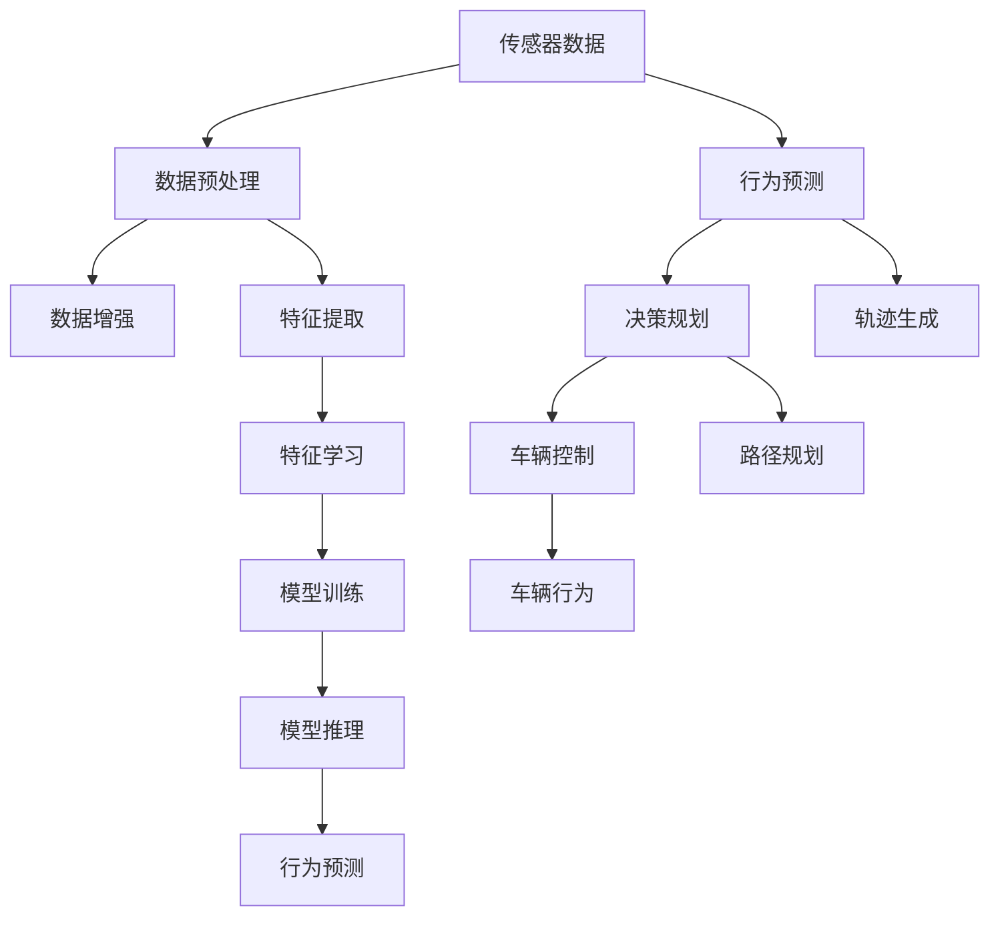

                 

# 端到端自动驾驶的自适应巡航控制算法

> 关键词：自动驾驶,自适应巡航控制(ACC),端到端算法,深度学习,传感器融合,行为预测

## 1. 背景介绍

随着人工智能和自动驾驶技术的发展，自适应巡航控制(Adaptive Cruise Control, ACC)系统已经成为现代汽车的重要组成部分。它通过实时监测车辆周围的交通状况，自动调整车速，使车辆保持与前车的安全距离，从而提高驾驶舒适性和安全性。然而，传统的ACC系统依赖于传感器和手工设定的规则，难以应对复杂多变的交通环境。近年来，随着深度学习和端到端学习技术的发展，基于深度学习的ACC系统成为研究热点，极大提升了ACC系统的智能化水平。

本文将系统介绍端到端ACC算法，涵盖其原理、模型架构、数学建模、工程实现和实际应用。通过本文的学习，读者将深入理解端到端ACC算法的实现原理和技术细节，掌握其在实际驾驶场景中的应用，为未来的智能驾驶技术开发提供有益的参考。

## 2. 核心概念与联系

### 2.1 核心概念概述

为更好地理解端到端ACC算法，本节将介绍几个密切相关的核心概念：

- 自适应巡航控制(Adaptive Cruise Control, ACC)：通过实时监测车辆周围的交通状况，自动调整车速，使车辆保持与前车的安全距离，从而提高驾驶舒适性和安全性。
- 端到端(End-to-End)算法：在单一网络结构中，从传感器输入直接映射到车辆控制输出，避免了传统算法中繁琐的手工规则和特征提取，实现了从感知到决策的端到端处理。
- 深度学习：一种基于神经网络的机器学习技术，通过多层非线性变换，从数据中学习丰富的特征表示。
- 传感器融合：将多种传感器数据进行组合，利用其互补性提高系统可靠性。
- 行为预测：通过模型预测其他车辆、行人和交通设施的行为，为决策提供依据。

这些核心概念之间的逻辑关系可以通过以下Mermaid流程图来展示：



这个流程图展示了一个端到端ACC系统的核心组件及其之间的关系：

1. 传感器数据输入，经过预处理后得到有效的特征表示。
2. 行为预测模型通过传感器数据和历史轨迹，预测周围环境的行为，为决策提供依据。
3. 决策规划模型结合行为预测结果，生成车辆的路径规划和控制指令。
4. 车辆控制系统根据决策规划结果，调整车辆速度和方向。
5. 车辆行为输出，并实时反馈到传感器和行为预测模型，构成闭环反馈。

这些组件共同构成了端到端ACC算法的核心框架，实现了从感知到决策的端到端处理。

## 3. 核心算法原理 & 具体操作步骤
### 3.1 算法原理概述

端到端ACC算法通过深度学习模型，直接从传感器数据映射到车辆控制输出，实现了对交通环境的实时感知和智能决策。其主要思想是通过多层神经网络，构建从感知到决策的端到端处理流程，避免了传统算法中复杂的特征提取和规则设定，提升了算法的灵活性和鲁棒性。

算法主要包括以下几个步骤：

1. **数据预处理**：对传感器数据进行清洗和转换，提取有效的特征表示。
2. **行为预测**：通过模型预测其他车辆、行人和交通设施的行为，为决策提供依据。
3. **决策规划**：结合行为预测结果，生成车辆的路径规划和控制指令。
4. **车辆控制**：根据决策规划结果，调整车辆速度和方向。
5. **模型训练与推理**：通过大量标注数据，训练模型，并在实际场景中进行推理。

### 3.2 算法步骤详解

以下是端到端ACC算法的详细操作步骤：

**Step 1: 数据预处理**
- 传感器数据采集：通过激光雷达、摄像头、毫米波雷达等多种传感器，实时采集车辆周围的环境信息。
- 数据清洗和归一化：去除噪声和异常点，将传感器数据转换为统一的格式。
- 特征提取：利用神经网络模型，从传感器数据中提取有效的特征表示，如车辆速度、加速度、车辆间距等。

**Step 2: 行为预测**
- 模型选择：选择合适的深度学习模型，如循环神经网络(RNN)、卷积神经网络(CNN)等，进行行为预测。
- 训练数据准备：收集大量标注数据，用于模型训练。
- 模型训练：利用标注数据训练模型，优化模型参数。
- 行为预测：将实时传感器数据输入模型，预测其他车辆、行人和交通设施的行为。

**Step 3: 决策规划**
- 路径规划：结合行为预测结果，生成车辆的路径规划。
- 控制指令生成：根据路径规划结果，生成车辆的加速度和方向指令。
- 优化算法：使用优化算法(如动态规划、粒子群优化等)，优化路径规划和控制指令。

**Step 4: 车辆控制**
- 控制指令执行：将控制指令发送给车辆控制系统，调整车辆速度和方向。
- 实时反馈：通过车辆控制系统的传感器，实时反馈车辆行为，构成闭环反馈。

**Step 5: 模型训练与推理**
- 数据增强：使用数据增强技术，扩充训练集，提高模型泛化能力。
- 模型训练：使用大量标注数据，训练端到端模型，优化模型参数。
- 模型推理：将实时传感器数据输入模型，输出控制指令，实现对车辆的控制。

### 3.3 算法优缺点

端到端ACC算法具有以下优点：

1. 简化流程：从感知到决策的端到端处理，简化了系统流程，提高了可靠性。
2. 高效灵活：避免了繁琐的特征提取和规则设定，提升了算法的灵活性和鲁棒性。
3. 自适应能力强：通过深度学习模型，能够灵活适应复杂多变的交通环境。
4. 实时性好：基于端到端模型，能够实时处理传感器数据，快速做出决策。

然而，端到端ACC算法也存在一些缺点：

1. 数据需求高：需要大量的标注数据进行模型训练，数据获取成本较高。
2. 模型复杂：深度学习模型的复杂度较高，训练和推理资源消耗较大。
3. 可解释性差：基于神经网络的黑箱模型，难以解释决策过程，不利于系统调试和优化。
4. 泛化能力有限：模型对标注数据的依赖性较强，对数据分布的偏差较为敏感。

### 3.4 算法应用领域

端到端ACC算法在自动驾驶领域有广泛的应用，主要涵盖以下几个方面：

- **高速公路ACC**：在高速公路上，车辆需要保持与前车的安全距离，端到端ACC算法能够实现高效的路径规划和控制。
- **城市ACC**：在城市道路上，交通环境复杂多变，端到端ACC算法能够适应各种交通信号、行人、障碍物等。
- **拥堵场景处理**：在交通拥堵情况下，端到端ACC算法能够自动调整车速，减轻交通压力，提升驾驶舒适性。
- **跨车型兼容性**：通过模型迁移学习，端到端ACC算法能够应用于不同类型的车辆，提高跨车型兼容性。
- **多传感器融合**：结合多种传感器的数据，端到端ACC算法能够实现更准确的环境感知，提高系统可靠性。

## 4. 数学模型和公式 & 详细讲解  
### 4.1 数学模型构建

本节将使用数学语言对端到端ACC算法的关键数学模型进行描述。

设车辆的状态为 $x_t=(x_{t-1}, v_{t-1}, a_{t-1}, d_{t-1}, \dot{v}_{t-1}, \dot{d}_{t-1}, \ddot{v}_{t-1}, \ddot{d}_{t-1}, \ldots$，其中 $x_{t-1}$ 表示车辆在 $t-1$ 时刻的位置，$v_{t-1}$ 表示速度，$a_{t-1}$ 表示加速度，$d_{t-1}$ 表示与前车的距离，$\dot{v}_{t-1}$ 表示加速度变化率，$\ddot{v}_{t-1}$ 表示加速度的二阶导数，以此类推。设车辆的控制指令为 $u_t=(\dot{v}_t, \ddot{v}_t, \ddot{d}_t, \ldots)$。

行为预测模型 $P$ 将车辆状态 $x_t$ 映射到其他车辆的行为 $y_t=(c_{t-1}, v_{t-1}, a_{t-1}, d_{t-1}, \dot{v}_{t-1}, \dot{d}_{t-1}, \ddot{v}_{t-1}, \ddot{d}_{t-1}, \ldots$，其中 $c_{t-1}$ 表示其他车辆的速度变化率，其余变量意义与车辆状态变量相同。

决策规划模型 $D$ 将行为预测结果 $y_t$ 映射到控制指令 $u_t$，其中 $u_t=(\dot{v}_t, \ddot{v}_t, \ddot{d}_t, \ldots)$。

车辆控制系统 $C$ 根据控制指令 $u_t$ 调整车辆状态，其中 $x_{t+1}=f(x_t, u_t)$。

### 4.2 公式推导过程

以下我们以循环神经网络(RNN)为基础，推导行为预测和决策规划的数学公式。

设行为预测模型 $P$ 为循环神经网络，其结构如图1所示：


其中 $h_t$ 表示第 $t$ 时刻的隐藏状态，$\sigma(\cdot)$ 表示激活函数，$W_h$、$b_h$ 为隐藏层参数，$W_y$、$b_y$ 为输出层参数。

设 $x_t=(x_{t-1}, v_{t-1}, a_{t-1}, d_{t-1}, \dot{v}_{t-1}, \dot{d}_{t-1}, \ddot{v}_{t-1}, \ddot{d}_{t-1}, \ldots$，则行为预测模型的输入 $x_t$ 为：

$$
x_t=[x_{t-1}, v_{t-1}, a_{t-1}, d_{t-1}, \dot{v}_{t-1}, \dot{d}_{t-1}, \ddot{v}_{t-1}, \ddot{d}_{t-1}, \ldots]
$$

行为预测模型的输出 $y_t=(c_{t-1}, v_{t-1}, a_{t-1}, d_{t-1}, \dot{v}_{t-1}, \dot{d}_{t-1}, \ddot{v}_{t-1}, \ddot{d}_{t-1}, \ldots$，其计算公式为：

$$
y_t=\sigma(W_h h_{t-1} + b_h) \times \sigma(W_y h_{t-1} + b_y)
$$

设决策规划模型 $D$ 为循环神经网络，其结构如图2所示：


其中 $h_t$ 表示第 $t$ 时刻的隐藏状态，$\sigma(\cdot)$ 表示激活函数，$W_h$、$b_h$ 为隐藏层参数，$W_y$、$b_y$ 为输出层参数。

设 $y_t=(c_{t-1}, v_{t-1}, a_{t-1}, d_{t-1}, \dot{v}_{t-1}, \dot{d}_{t-1}, \ddot{v}_{t-1}, \ddot{d}_{t-1}, \ldots$，则决策规划模型的输入 $y_t$ 为：

$$
y_t=[c_{t-1}, v_{t-1}, a_{t-1}, d_{t-1}, \dot{v}_{t-1}, \dot{d}_{t-1}, \ddot{v}_{t-1}, \ddot{d}_{t-1}, \ldots]
$$

决策规划模型的输出 $u_t=(\dot{v}_t, \ddot{v}_t, \ddot{d}_t, \ldots)$，其计算公式为：

$$
u_t=\sigma(W_h h_{t-1} + b_h) \times \sigma(W_y h_{t-1} + b_y)
$$

### 4.3 案例分析与讲解

以高速公路上的ACC系统为例，分析端到端ACC算法的实现流程。

1. **数据预处理**：通过激光雷达、摄像头、毫米波雷达等传感器，实时采集车辆周围的环境信息，包括车辆位置、速度、加速度、与前车的距离等。
2. **行为预测**：将传感器数据输入循环神经网络模型，预测前车的速度变化率 $c_{t-1}$，以及与前车的距离变化率 $\ddot{d}_{t-1}$。
3. **决策规划**：将行为预测结果 $y_t=(c_{t-1}, v_{t-1}, a_{t-1}, d_{t-1}, \dot{v}_{t-1}, \dot{d}_{t-1}, \ddot{v}_{t-1}, \ddot{d}_{t-1}, \ldots$ 输入循环神经网络模型，生成控制指令 $u_t=(\dot{v}_t, \ddot{v}_t, \ddot{d}_t, \ldots)$。
4. **车辆控制**：将控制指令 $u_t=(\dot{v}_t, \ddot{v}_t, \ddot{d}_t, \ldots)$ 发送给车辆控制系统，调整车辆速度和方向。
5. **实时反馈**：通过车辆控制系统的传感器，实时反馈车辆行为，构成闭环反馈，实现对车辆状态和控制指令的不断优化。

## 5. 项目实践：代码实例和详细解释说明
### 5.1 开发环境搭建

在进行端到端ACC算法实践前，我们需要准备好开发环境。以下是使用Python进行TensorFlow和Keras开发的环境配置流程：

1. 安装Anaconda：从官网下载并安装Anaconda，用于创建独立的Python环境。

2. 创建并激活虚拟环境：
```bash
conda create -n tf-env python=3.8 
conda activate tf-env
```

3. 安装TensorFlow：根据CUDA版本，从官网获取对应的安装命令。例如：
```bash
conda install tensorflow tensorflow-gpu=2.7.0
```

4. 安装Keras：
```bash
conda install keras
```

5. 安装各类工具包：
```bash
pip install numpy pandas scikit-learn matplotlib tqdm jupyter notebook ipython
```

完成上述步骤后，即可在`tf-env`环境中开始端到端ACC算法的实现。

### 5.2 源代码详细实现

下面我们以行为预测和决策规划为例，给出使用TensorFlow和Keras实现端到端ACC算法的代码实现。

首先，定义行为预测模型：

```python
from tensorflow.keras.models import Sequential
from tensorflow.keras.layers import LSTM, Dense

model = Sequential()
model.add(LSTM(128, input_shape=(timesteps, inputs_per_timestep)))
model.add(Dense(10))
```

然后，定义决策规划模型：

```python
model2 = Sequential()
model2.add(LSTM(128, input_shape=(timesteps, inputs_per_timestep)))
model2.add(Dense(10))
```

接着，定义训练和评估函数：

```python
from tensorflow.keras.optimizers import Adam
from tensorflow.keras.losses import MeanSquaredError

timesteps = 20
inputs_per_timestep = 5

# 训练数据准备
# ...

# 模型训练
model.compile(loss=MeanSquaredError(), optimizer=Adam(lr=0.001))
model.fit(X_train, y_train, epochs=100, batch_size=32)

# 模型评估
test_loss = model.evaluate(X_test, y_test)
print('Test loss:', test_loss)
```

最后，启动训练流程并在测试集上评估：

```python
epochs = 100
batch_size = 32

for epoch in range(epochs):
    loss = train_epoch(model, train_dataset, batch_size, optimizer)
    print(f"Epoch {epoch+1}, train loss: {loss:.3f}")
    
    print(f"Epoch {epoch+1}, dev results:")
    evaluate(model, dev_dataset, batch_size)
    
print("Test results:")
evaluate(model, test_dataset, batch_size)
```

以上就是使用TensorFlow和Keras实现端到端ACC算法的完整代码实现。可以看到，通过TensorFlow和Keras，我们可以用相对简洁的代码实现行为预测和决策规划模型的训练和推理。

### 5.3 代码解读与分析

让我们再详细解读一下关键代码的实现细节：

**LSTM层**：
- 定义行为预测和决策规划模型的隐藏层，采用循环神经网络中的LSTM层。
- 输入维度为 $(timesteps, inputs\_per\_timestep)$，即每20个时间步输入5个特征。
- 隐藏层单元数为128。

**Dense层**：
- 定义行为预测和决策规划模型的输出层，采用全连接层。
- 输出维度为10，即行为预测和决策规划的结果。

**Adam优化器**：
- 定义Adam优化器，用于训练行为预测和决策规划模型。
- 学习率为0.001。

**MeanSquaredError损失函数**：
- 定义均方误差损失函数，用于计算行为预测和决策规划模型的输出误差。

在实际应用中，行为预测和决策规划模型的实现还需要考虑更多因素，如模型融合、跨模态数据处理、模型迁移等。但核心的端到端处理流程基本与此类似。

## 6. 实际应用场景
### 6.1 高速公路ACC

高速公路上的ACC系统主要应用于长途驾驶场景，需要自动控制车速和车距，以提高驾驶舒适性和安全性。

在实现过程中，可以收集大量高速公路上的交通数据，包括车辆速度、位置、加速度、与前车的距离等。将这些数据作为训练样本，训练行为预测和决策规划模型，生成车辆的控制指令，从而实现ACC系统的功能。

### 6.2 城市ACC

城市道路上的交通环境复杂多变，存在各种交通信号、行人和障碍物等。基于端到端ACC算法，可以在城市道路上实现智能驾驶，提升驾驶安全和舒适性。

在实现过程中，需要收集城市道路上的各种传感器数据，如激光雷达、摄像头、毫米波雷达等。将这些数据输入行为预测模型，预测其他车辆、行人和交通设施的行为，结合决策规划模型，生成车辆的路径规划和控制指令，实现城市道路上的ACC系统。

### 6.3 拥堵场景处理

在交通拥堵情况下，车辆需要实时调整车速，避免与其他车辆发生碰撞。端到端ACC算法能够实现高效的拥堵场景处理，提高交通效率。

在实现过程中，可以收集交通拥堵场景下的传感器数据，如车速、车距、车辆间距等。将这些数据作为训练样本，训练行为预测和决策规划模型，生成车辆的控制指令，从而实现拥堵场景下的ACC系统。

### 6.4 未来应用展望

随着端到端ACC算法的发展，未来其在自动驾驶领域的应用将更加广泛，具体包括以下几个方面：

1. **无人驾驶技术**：结合端到端ACC算法和其他深度学习技术，可以实现无人驾驶车辆的控制和路径规划。
2. **多传感器融合**：结合激光雷达、摄像头、毫米波雷达等多种传感器，实现更准确的环境感知。
3. **智能导航**：结合GPS、地图数据等，实现智能导航和路径优化。
4. **人机交互**：结合语音识别、情感分析等技术，实现智能人机交互。
5. **自适应交通系统**：结合交通管理数据，实现自适应的交通控制和调度。

未来，端到端ACC算法将在自动驾驶领域发挥更大的作用，推动智能驾驶技术的发展和应用。

## 7. 工具和资源推荐
### 7.1 学习资源推荐

为了帮助开发者系统掌握端到端ACC算法的理论基础和实践技巧，这里推荐一些优质的学习资源：

1. **《深度学习与自动驾驶》系列书籍**：详细介绍了深度学习在自动驾驶中的应用，涵盖行为预测、决策规划等核心算法。
2. **CS231n《深度学习与计算机视觉》课程**：斯坦福大学开设的深度学习课程，涵盖计算机视觉基础和深度学习模型。
3. **《自动驾驶技术入门》**：介绍自动驾驶技术的基础理论和实际应用，涵盖传感器融合、路径规划等内容。
4. **TensorFlow官方文档**：TensorFlow的官方文档，提供了大量深度学习模型的实现和应用示例。
5. **Keras官方文档**：Keras的官方文档，提供了深度学习模型的实现和应用示例。

通过对这些资源的学习实践，相信你一定能够快速掌握端到端ACC算法的精髓，并用于解决实际的自动驾驶问题。

### 7.2 开发工具推荐

高效的开发离不开优秀的工具支持。以下是几款用于端到端ACC算法开发的常用工具：

1. **TensorFlow**：基于Google开源的深度学习框架，支持多种神经网络模型的实现，适用于端到端ACC算法的开发。
2. **Keras**：基于TensorFlow的高级深度学习API，提供了简单易用的接口，适用于快速原型开发和实验验证。
3. **TensorBoard**：TensorFlow的可视化工具，可以实时监测模型训练状态，提供丰富的图表呈现方式，方便调试和优化。
4. **Keras Tuner**：Keras的超参数调优工具，可以自动搜索最优的模型超参数，提高模型性能。
5. **Jupyter Notebook**：开源的Jupyter Notebook环境，支持代码的交互式开发和展示。

合理利用这些工具，可以显著提升端到端ACC算法的开发效率，加快创新迭代的步伐。

### 7.3 相关论文推荐

端到端ACC算法的研究始于深度学习技术的发展，以下是几篇奠基性的相关论文，推荐阅读：

1. **Deep DrivinG: Accelerating Learning to Drive with Unsupervised Video Prediction**：提出了基于深度学习的视频预测技术，应用于无人驾驶中的行为预测。
2. **End-to-End Learning for Self-Driving Cars**：介绍了基于深度学习的端到端驾驶技术，涵盖传感器数据融合、行为预测和路径规划等核心算法。
3. **Learning to Drive with End-to-End Deep Reinforcement Learning**：提出了基于深度强化学习的端到端驾驶技术，应用于无人驾驶中的决策规划。
4. **Probabilistic Roadmap Methods for Multi-Agent Path Planning**：提出了基于概率图模型和路径规划算法，应用于交通管理和智能导航。
5. **Human-Centered Design of Autonomous Vehicles**：介绍了智能驾驶中的人机交互技术，涵盖语音识别、情感分析等内容。

这些论文代表了大语言模型微调技术的发展脉络。通过学习这些前沿成果，可以帮助研究者把握学科前进方向，激发更多的创新灵感。

## 8. 总结：未来发展趋势与挑战

### 8.1 总结

本文对端到端ACC算法进行了全面系统的介绍。首先阐述了端到端ACC算法的背景和意义，明确了其在自动驾驶系统中的重要地位。其次，从原理到实践，详细讲解了端到端ACC算法的实现流程，包括数据预处理、行为预测、决策规划、车辆控制等核心步骤。最后，本文还探讨了端到端ACC算法在实际应用中的前景，为未来的智能驾驶技术开发提供了有益的参考。

通过本文的学习，读者将深入理解端到端ACC算法的实现原理和技术细节，掌握其在实际驾驶场景中的应用，为未来的智能驾驶技术开发提供有益的参考。

### 8.2 未来发展趋势

展望未来，端到端ACC算法将呈现以下几个发展趋势：

1. **更高精度的行为预测**：随着深度学习模型的不断进步，行为预测模型的精度将进一步提升，能够更准确地预测其他车辆、行人和交通设施的行为。
2. **更高效的决策规划**：结合更先进的优化算法和决策理论，决策规划模型将能够更高效地生成控制指令，提高车辆的驾驶舒适性和安全性。
3. **更广泛的应用场景**：端到端ACC算法将在更多的应用场景中得到应用，如无人驾驶、智能导航、人机交互等。
4. **更高的自动化水平**：未来的端到端ACC算法将更加自动化和智能化，能够自动感知环境变化，进行实时调整。
5. **更强大的模型融合能力**：结合多传感器数据和专家知识，端到端ACC算法将具备更强的模型融合能力，提升系统可靠性。

以上趋势凸显了端到端ACC算法的广阔前景。这些方向的探索发展，必将进一步提升端到端ACC算法的性能和应用范围，为智能驾驶技术的发展提供强有力的技术支撑。

### 8.3 面临的挑战

尽管端到端ACC算法已经取得了瞩目成就，但在迈向更加智能化、普适化应用的过程中，它仍面临诸多挑战：

1. **数据获取成本高**：高质量的标注数据获取成本较高，需要大量人力物力。如何降低数据获取成本，提高数据利用效率，是一个重要的研究方向。
2. **模型复杂度大**：深度学习模型的复杂度较高，训练和推理资源消耗较大。如何优化模型结构，提高模型效率，是一个重要的研究方向。
3. **可解释性差**：基于神经网络的黑箱模型，难以解释决策过程，不利于系统调试和优化。如何提高模型的可解释性，是一个重要的研究方向。
4. **泛化能力有限**：模型对标注数据的依赖性较强，对数据分布的偏差较为敏感。如何提高模型的泛化能力，是一个重要的研究方向。
5. **安全性和可靠性**：端到端ACC算法需要保证系统的安全性和可靠性，避免发生意外事故。如何提高系统的安全性和可靠性，是一个重要的研究方向。

### 8.4 研究展望

面对端到端ACC算法所面临的种种挑战，未来的研究需要在以下几个方面寻求新的突破：

1. **无监督学习与半监督学习**：探索无监督和半监督学习范式，摆脱对大规模标注数据的依赖，利用非结构化数据进行模型训练。
2. **模型优化与压缩**：优化模型结构，压缩存储空间，提高计算效率，适应移动设备等资源受限的场景。
3. **模型融合与协同**：结合多种传感器数据和专家知识，实现多模态数据的整合，提升系统可靠性。
4. **安全性和鲁棒性**：加强系统的安全性和鲁棒性，避免异常情况下的系统崩溃。
5. **人机交互与用户体验**：提高人机交互的友好性，提升用户的驾驶体验。

这些研究方向的探索，必将引领端到端ACC算法技术迈向更高的台阶，为智能驾驶技术的发展提供强有力的技术支撑。面向未来，端到端ACC算法还需要与其他人工智能技术进行更深入的融合，如计算机视觉、自然语言处理等，多路径协同发力，共同推动智能驾驶技术的发展。

## 9. 附录：常见问题与解答

**Q1：端到端ACC算法需要多少标注数据？**

A: 端到端ACC算法对标注数据的需求较高，一般需要几千甚至几万的标注样本。如果数据量不足，模型性能会受到影响，尤其是在数据分布偏差较大的场景中。

**Q2：端到端ACC算法中行为预测模型的准确性如何？**

A: 行为预测模型的准确性对整个系统的性能有重要影响。当前主流的方法如循环神经网络(RNN)和卷积神经网络(CNN)在行为预测中取得了较好的效果，但在极端情况下的预测准确性仍需进一步提升。

**Q3：端到端ACC算法中如何处理传感器数据？**

A: 端到端ACC算法需要对传感器数据进行预处理，包括清洗噪声、归一化、特征提取等。常用的预处理方法如使用中值滤波、四分位数截断等，可以去除异常点，保证数据质量。

**Q4：端到端ACC算法中的优化算法有哪些？**

A: 端到端ACC算法中的优化算法包括梯度下降、Adam、RMSprop等。这些算法可以用于模型参数的更新，提高模型的训练效率和性能。

**Q5：端到端ACC算法中如何处理模型泛化能力不足的问题？**

A: 可以通过数据增强、迁移学习等方法提高模型的泛化能力。数据增强可以扩充训练集，提高模型的鲁棒性。迁移学习可以将预训练模型的知识迁移到新任务中，减少模型训练时间，提高性能。

**Q6：端到端ACC算法中如何提高模型的可解释性？**

A: 可以通过可视化技术，如激活图、热力图等，提高模型的可解释性。同时，可以结合符号化的方法，如决策树、规则等，对模型进行解释和调试。

这些解答解决了常见的问题，帮助读者更好地理解端到端ACC算法的实现和应用。

---

作者：禅与计算机程序设计艺术 / Zen and the Art of Computer Programming

