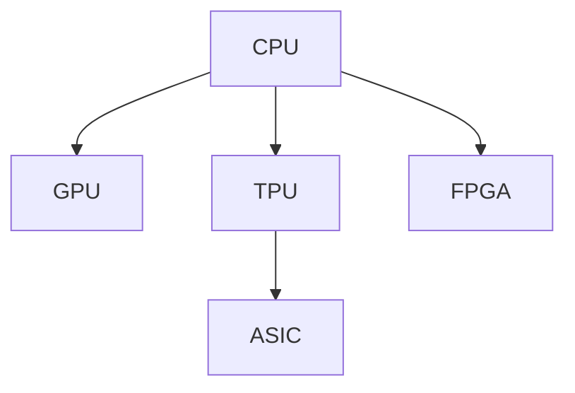

                 

# 第08章 AI硬件加速 CPU、GPU与其他设备

随着人工智能(AI)技术的迅猛发展，AI硬件加速技术逐渐成为推动AI技术进步的关键。现代AI模型通常规模庞大、计算密集，对硬件资源有很高的需求。因此，如何高效地利用AI硬件资源，提升AI模型的训练和推理效率，成为业内关注的重点。本章将深入探讨AI硬件加速技术，涵盖CPU、GPU、TPU等主流AI加速设备，并分析其加速原理和应用场景，为读者提供全面的技术指引。

## 1. 背景介绍

### 1.1 问题由来

AI模型训练和推理涉及大规模矩阵运算和向量运算，对计算资源的需求极高。传统的CPU由于受限于单个核心的计算能力，在面对大规模数据时，往往无法满足需求。而GPU由于其高度并行化的计算架构，在AI计算中展现出显著的优势。然而，GPU的内存带宽限制也成为了AI模型加速的瓶颈。TPU等新型AI加速设备逐渐崭露头角，以其优异的内存带宽和全自定义的计算架构，进一步提升了AI模型的训练和推理效率。

### 1.2 问题核心关键点

AI硬件加速的核心在于如何最大化利用硬件资源，提升AI模型的计算效率。具体的关键点包括：

- 硬件架构：CPU、GPU、TPU等加速设备的内部结构和计算模式。
- 并行计算：如何利用硬件并行化特性，提升模型训练和推理的速度。
- 内存带宽：数据传输速率对模型训练效率的影响。
- 数据流管理：如何高效管理数据流，降低内存带宽压力。

## 2. 核心概念与联系

### 2.1 核心概念概述

为了更好地理解AI硬件加速技术，本节将介绍几个关键概念：

- CPU (Central Processing Unit)：中央处理器，是计算机中最核心的执行单元，负责通用计算任务。
- GPU (Graphics Processing Unit)：图形处理器，最初用于加速图形渲染，后来因高度并行化计算能力被广泛应用于AI领域。
- TPU (Tensor Processing Unit)：张量处理器，由Google开发，专为AI计算设计，具有高内存带宽和自定义计算架构。
- ASIC (Application-Specific Integrated Circuit)：应用特定的集成电路，根据特定应用需求定制设计，具有高效能和低功耗的特点。
- FPGA (Field-Programmable Gate Array)：现场可编程门阵列，具有灵活编程能力，适合进行自定义硬件加速。

这些概念之间的逻辑关系可以通过以下Mermaid流程图来展示：



这个流程图展示了几类AI硬件加速设备的逻辑关系：

1. CPU 是通用计算设备，可进行各种类型计算。
2. GPU 通过高度并行化计算加速CPU，适用于数据密集型计算。
3. TPU 专门设计用于AI计算，具有更高的内存带宽和自定义计算架构。
4. ASIC 针对特定应用需求设计，可提供极致性能和能效比。
5. FPGA 灵活可编程，适合于自定义硬件加速。

## 3. 核心算法原理 & 具体操作步骤
### 3.1 算法原理概述

AI硬件加速的本质是通过优化数据传输和计算模式，最大化利用硬件资源，提升模型的计算效率。

对于GPU而言，其核心加速原理在于其大规模并行计算能力。每个GPU核心可以在单个时钟周期内执行多个计算任务，通过大规模并行计算，显著提升模型训练和推理的速度。

对于TPU而言，其核心加速原理在于其高内存带宽和自定义计算架构。TPU通过优化数据流和计算逻辑，实现了数据和计算的并行化，减少了内存带宽瓶颈，提升了模型训练和推理的效率。

对于ASIC和FPGA而言，其核心加速原理在于其高度优化的硬件设计和编程能力。ASIC和FPGA可以根据特定应用需求进行硬件定制，优化数据传输和计算逻辑，实现极致性能和能效比。

### 3.2 算法步骤详解

以下是几种常见AI硬件加速设备的具体操作步骤：

#### GPU加速步骤

1. 将AI模型转换为适合GPU并行计算的模型结构。
2. 使用GPU并行化编程框架（如CUDA、C++等）实现模型前向和反向传播过程。
3. 使用数据并行化技术，将模型数据切分为多个并行计算块，并行处理。
4. 使用GPU内存优化技术，如CUDA的Device Memory Management，提升数据传输效率。

#### TPU加速步骤

1. 将AI模型转换为适合TPU计算的模型结构。
2. 使用TPU编程框架（如TPU Hardware Description Language, HLD）实现模型前向和反向传播过程。
3. 使用TPU专用的数据流优化技术，如TPU指令调度、TPU块管理等，提升计算效率。
4. 使用TPU专用内存管理技术，如TPU Scalability Technologies, 提升数据传输效率。

#### ASIC加速步骤

1. 根据应用需求，设计定制化的ASIC硬件架构。
2. 使用硬件描述语言（如Verilog、VHDL等）实现ASIC的逻辑功能。
3. 使用ASIC的并行化计算特性，实现模型计算过程的并行化。
4. 使用ASIC专用的数据流管理技术，优化数据传输和计算逻辑。

#### FPGA加速步骤

1. 根据应用需求，设计自定义的FPGA硬件结构。
2. 使用FPGA编程语言（如Xilinx的Vivado HDL、Intel的Quartus II等）实现FPGA的逻辑功能。
3. 使用FPGA的灵活并行化特性，实现模型计算过程的并行化。
4. 使用FPGA专用的数据流管理技术，优化数据传输和计算逻辑。

### 3.3 算法优缺点

AI硬件加速技术具有以下优点：

- 加速效果好：通过并行计算和专用硬件设计，显著提升模型训练和推理的速度。
- 应用范围广：适用于各种类型AI模型，特别是大规模数据和高计算复杂度的模型。
- 能效比高：ASIC和TPU等专用硬件设备在能效比上具有显著优势。

同时，这些技术也存在一些局限性：

- 开发成本高：定制化硬件设计需要较高的开发成本和开发周期。
- 资源需求大：需要较大的硬件资源（如GPU内存、TPU专用存储）支持。
- 学习曲线陡：需要一定的硬件编程和优化技能，新手难以快速上手。

## 4. 数学模型和公式 & 详细讲解
### 4.1 数学模型构建

AI硬件加速模型的数学模型可以表示为：

$$
y = f(x; \theta, \omega)
$$

其中，$y$ 为模型的输出，$x$ 为输入数据，$\theta$ 为模型参数，$\omega$ 为硬件资源（如GPU核心数、TPU片数等）。

### 4.2 公式推导过程

以GPU加速为例，模型计算的并行化处理过程如下：

1. 数据并行化：将输入数据$x$切分为多个数据块$x_1, x_2, ..., x_n$，每个数据块分配到不同的GPU核心进行计算。
2. 计算并行化：每个GPU核心独立计算模型的一部分，即$f(x; \theta, \omega)$中的$f$函数。
3. 数据合并：将各个GPU核心的计算结果进行合并，得到最终的输出$y$。

形式化地，GPU加速的计算过程可以表示为：

$$
y = f(\sum_{i=1}^{n} f(x_i; \theta, \omega_i))
$$

其中，$x_i$为切分的每个数据块，$\omega_i$为分配给第$i$个GPU核心的计算资源。

### 4.3 案例分析与讲解

假设一个图像识别模型需要处理大量数据，使用CPU进行计算需要10小时，而使用4个GPU进行计算只需要2小时。

设GPU每个核心的计算速率为$R_G$，CPU的计算速率为$R_C$。设模型对每个数据块的计算时间为$t_x$。则GPU加速的计算时间$T_G$和CPU加速的计算时间$T_C$分别为：

$$
T_G = \frac{n \cdot t_x}{4R_G} = 2 \text{小时}
$$

$$
T_C = \frac{n \cdot t_x}{R_C} = 10 \text{小时}
$$

通过上述推导可以看到，GPU加速能够显著提升模型训练和推理的速度。

## 5. 项目实践：代码实例和详细解释说明
### 5.1 开发环境搭建

在使用GPU进行AI模型训练和推理前，需要搭建好相应的开发环境。以下是使用CUDA和PyTorch搭建GPU开发环境的流程：

1. 安装CUDA：从NVIDIA官网下载并安装适合硬件的CUDA版本。
2. 安装cuDNN：从NVIDIA官网下载并安装适合硬件的cuDNN版本。
3. 安装Caffe2或PyTorch：使用pip安装最新的Caffe2或PyTorch版本。
4. 设置环境变量：在.bashrc或.bash_profile中设置LD_LIBRARY_PATH、CUDA_HOME、CUDNN_HOME等环境变量。
5. 安装GPU驱动：确保使用的GPU驱动与CUDA版本兼容。

完成上述步骤后，即可在Python中使用CUDA和PyTorch进行GPU加速的AI模型开发。

### 5.2 源代码详细实现

以下是一个使用PyTorch在GPU上进行图像分类模型训练的示例代码：

```python
import torch
import torch.nn as nn
import torch.optim as optim
import torchvision.transforms as transforms
import torchvision.datasets as datasets

# 定义模型
model = nn.Sequential(
    nn.Conv2d(3, 64, kernel_size=3, stride=1, padding=1),
    nn.ReLU(),
    nn.MaxPool2d(kernel_size=2, stride=2),
    nn.Conv2d(64, 128, kernel_size=3, stride=1, padding=1),
    nn.ReLU(),
    nn.MaxPool2d(kernel_size=2, stride=2),
    nn.Conv2d(128, 256, kernel_size=3, stride=1, padding=1),
    nn.ReLU(),
    nn.MaxPool2d(kernel_size=2, stride=2),
    nn.Flatten(),
    nn.Linear(256*2*2*2, 10),
    nn.ReLU(),
    nn.Linear(10, 10)
)

# 定义优化器
optimizer = optim.SGD(model.parameters(), lr=0.01, momentum=0.9)

# 加载数据集
transform = transforms.Compose([
    transforms.ToTensor(),
    transforms.Normalize(mean=[0.5, 0.5, 0.5], std=[0.5, 0.5, 0.5])
])
train_dataset = datasets.CIFAR10(root='./data', train=True, download=True, transform=transform)
train_loader = torch.utils.data.DataLoader(train_dataset, batch_size=64, shuffle=True)

# 定义损失函数
criterion = nn.CrossEntropyLoss()

# 开始训练
device = torch.device('cuda')
model.to(device)
for epoch in range(10):
    running_loss = 0.0
    for i, data in enumerate(train_loader, 0):
        inputs, labels = data[0].to(device), data[1].to(device)
        optimizer.zero_grad()
        outputs = model(inputs)
        loss = criterion(outputs, labels)
        loss.backward()
        optimizer.step()
        running_loss += loss.item()
    print(f'Epoch {epoch+1}, loss: {running_loss/len(train_loader)}')
```

### 5.3 代码解读与分析

让我们再详细解读一下关键代码的实现细节：

**模型定义**：
- 使用PyTorch定义了一个简单的卷积神经网络模型，包含卷积层、池化层、全连接层等。
- 模型的输入大小为3x32x32的图像，输出大小为10类分类结果。

**优化器和数据加载**：
- 使用SGD优化器，设置学习率为0.01，动量为0.9。
- 加载CIFAR-10数据集，并使用DataLoader进行数据批处理。

**损失函数和训练**：
- 使用交叉熵损失函数，定义训练过程。
- 将模型和数据移动到GPU上进行计算，使用CUDA加速训练过程。

可以看到，通过简单的修改，代码即可以实现GPU加速的图像分类模型训练。这展示了GPU在AI模型训练中的强大加速效果。

## 6. 实际应用场景

### 6.1 计算机视觉

GPU和TPU在计算机视觉领域的应用非常广泛。GPU的并行计算能力使得图像处理、视频编解码等任务能够快速完成。而TPU的高内存带宽和自定义计算架构，能够处理大规模图像数据和深度学习模型，提升图像识别、目标检测、图像分割等任务的速度。

例如，使用GPU进行ImageNet数据集的训练，可以使用CUDA和PyTorch框架，将模型数据并行化处理，显著提升训练速度。使用TPU进行大规模图像数据的训练，可以利用TPU专用的加速技术，如TPU Block Memory，提升数据传输和计算效率。

### 6.2 自然语言处理

GPU和TPU在自然语言处理(NLP)领域同样发挥着重要作用。GPU的并行计算能力使得NLP任务如语言模型训练、文本分类、情感分析等能够快速完成。而TPU的高内存带宽和自定义计算架构，能够处理大规模语料库和深度学习模型，提升NLP任务的计算效率。

例如，使用GPU进行大规模语料库的预训练，可以使用CUDA和PyTorch框架，将模型数据并行化处理，显著提升训练速度。使用TPU进行大规模预训练任务，可以利用TPU专用的加速技术，如TPU Scalability Technologies，提升数据传输和计算效率。

### 6.3 信号处理

GPU和TPU在信号处理领域同样有着广泛的应用。GPU的并行计算能力使得信号处理任务如音频信号处理、视频编解码等能够快速完成。而TPU的高内存带宽和自定义计算架构，能够处理大规模信号数据和深度学习模型，提升信号处理任务的计算效率。

例如，使用GPU进行音频信号处理任务，可以使用CUDA和PyTorch框架，将模型数据并行化处理，显著提升处理速度。使用TPU进行大规模信号数据处理，可以利用TPU专用的加速技术，如TPU Scalability Technologies，提升数据传输和计算效率。

### 6.4 未来应用展望

随着AI硬件加速技术的不断发展，未来在以下几个方面将会有新的突破：

1. 更加高效的并行计算架构：未来可能会出现更加高效的并行计算架构，如多核CPU、专用ASIC等，进一步提升AI模型的计算效率。
2. 更高的内存带宽：未来可能会出现更高带宽的内存技术，如3D堆栈内存、忆阻器等，解决内存带宽瓶颈问题。
3. 更灵活的编程模型：未来可能会出现更加灵活的编程模型，如FPGA编程模型，使得硬件加速更加易于实现。
4. 更广泛的应用场景：未来可能会出现更多的AI硬件加速应用场景，如自动驾驶、智能制造等，进一步拓展AI技术的应用范围。

## 7. 工具和资源推荐

### 7.1 学习资源推荐

为了帮助开发者系统掌握AI硬件加速技术，这里推荐一些优质的学习资源：

1. NVIDIA Deep Learning SDK：NVIDIA开发的深度学习SDK，提供了丰富的GPU加速库和文档。
2. Google TensorFlow：Google开发的深度学习框架，提供了丰富的TPU加速库和文档。
3. Intel AI Developer Toolkit：Intel开发的AI工具包，提供了丰富的ASIC和FPGA加速库和文档。
4. PyTorch official documentation：PyTorch官方文档，提供了丰富的CUDA和PyTorch加速库和文档。
5. Stanford CS224N Deep Learning for NLP：斯坦福大学开设的NLP深度学习课程，涵盖了GPU和TPU加速技术。

通过对这些资源的学习实践，相信你一定能够快速掌握AI硬件加速技术的精髓，并用于解决实际的AI问题。

### 7.2 开发工具推荐

高效的开发离不开优秀的工具支持。以下是几款用于AI硬件加速开发的常用工具：

1. PyTorch：基于Python的开源深度学习框架，灵活动态的计算图，适合快速迭代研究。
2. TensorFlow：由Google主导开发的开源深度学习框架，生产部署方便，适合大规模工程应用。
3. NVIDIA CUDA：NVIDIA开发的GPU并行计算框架，适合GPU加速的AI模型开发。
4. Google Cloud TPU：Google提供的TPU云服务，适合进行大规模深度学习模型的训练和推理。
5. Intel FPGA SDK：Intel提供的FPGA编程工具，适合FPGA加速的AI模型开发。

合理利用这些工具，可以显著提升AI硬件加速任务的开发效率，加快创新迭代的步伐。

### 7.3 相关论文推荐

AI硬件加速技术的发展源于学界的持续研究。以下是几篇奠基性的相关论文，推荐阅读：

1. Volta: A 16GB SDRAM GV100 GPU for Deep Learning. NVIDIA白皮书。
2. TensorFlow: A System for Large-Scale Machine Learning. 谷歌TensorFlow论文。
3. Xilinx XAPP: Xilinx AI Development Kit. Xilinx官方文档。
4. Intel x86 GPU Architecture Overview. Intel官方文档。
5. NVIDIA Turing Architecture: An Overview of NVIDIA GPU Computing. NVIDIA官方文档。

这些论文代表了大规模AI硬件加速技术的发展脉络。通过学习这些前沿成果，可以帮助研究者把握学科前进方向，激发更多的创新灵感。

## 8. 总结：未来发展趋势与挑战

### 8.1 总结

本章对AI硬件加速技术进行了全面系统的介绍。首先阐述了AI模型训练和推理中硬件加速的需求，明确了硬件加速在提升计算效率方面的重要作用。其次，从原理到实践，详细讲解了GPU、TPU、ASIC、FPGA等主流AI加速设备的加速原理和操作步骤，给出了具体代码实例和详细解释。同时，本章还广泛探讨了AI硬件加速技术在计算机视觉、自然语言处理、信号处理等多个领域的应用前景，展示了AI硬件加速技术的广阔前景。

通过本章的系统梳理，可以看到，AI硬件加速技术正在成为推动AI技术进步的关键因素。这些技术的不断发展，必将进一步提升AI模型的计算效率和能效比，为AI技术在各行各业的广泛应用提供更强大的硬件支持。

### 8.2 未来发展趋势

展望未来，AI硬件加速技术将呈现以下几个发展趋势：

1. 更加高效的并行计算架构：未来可能会出现更加高效的并行计算架构，如多核CPU、专用ASIC等，进一步提升AI模型的计算效率。
2. 更高的内存带宽：未来可能会出现更高带宽的内存技术，如3D堆栈内存、忆阻器等，解决内存带宽瓶颈问题。
3. 更灵活的编程模型：未来可能会出现更加灵活的编程模型，如FPGA编程模型，使得硬件加速更加易于实现。
4. 更广泛的应用场景：未来可能会出现更多的AI硬件加速应用场景，如自动驾驶、智能制造等，进一步拓展AI技术的应用范围。

这些趋势凸显了AI硬件加速技术的广阔前景。这些方向的探索发展，必将进一步提升AI模型的计算效率和能效比，为AI技术在各行各业的广泛应用提供更强大的硬件支持。

### 8.3 面临的挑战

尽管AI硬件加速技术已经取得了显著进展，但在迈向更加智能化、普适化应用的过程中，它仍面临着诸多挑战：

1. 硬件资源需求大：大规模AI模型的训练和推理需要大量的硬件资源支持，如GPU内存、TPU专用存储等。如何高效利用这些资源，成为挑战之一。
2. 编程复杂度高：硬件加速编程涉及底层硬件操作，编程复杂度较高。新手难以快速上手，需要一定的技术积累。
3. 资源开发成本高：定制化硬件设计需要较高的开发成本和开发周期。
4. 数据和模型传输瓶颈：大规模数据传输和模型参数更新可能带来瓶颈，影响训练和推理速度。
5. 跨平台兼容问题：不同硬件平台之间的兼容性问题，如GPU和TPU之间的兼容性，仍需解决。

## 8.4 研究展望

面对AI硬件加速所面临的挑战，未来的研究需要在以下几个方面寻求新的突破：

1. 优化并行计算架构：开发更加高效并行计算架构，如多核CPU、专用ASIC等，提升计算效率。
2. 提升内存带宽：开发更高带宽的内存技术，如3D堆栈内存、忆阻器等，解决内存带宽瓶颈问题。
3. 简化编程模型：开发更加灵活的编程模型，如FPGA编程模型，使得硬件加速更加易于实现。
4. 提升跨平台兼容性：解决不同硬件平台之间的兼容性问题，实现无缝切换。
5. 优化数据流管理：优化数据传输和计算逻辑，提升数据流管理效率。

这些研究方向的探索，必将引领AI硬件加速技术迈向更高的台阶，为构建高效、稳定、可靠、可控的AI系统提供更强大的硬件支持。

## 9. 附录：常见问题与解答

**Q1：如何使用GPU进行AI模型训练和推理？**

A: 使用GPU进行AI模型训练和推理，需要使用GPU加速库如CUDA和PyTorch。具体步骤如下：
1. 安装CUDA和cuDNN。
2. 安装PyTorch并设置环境变量。
3. 将模型和数据移动到GPU上进行计算，使用CUDA加速训练和推理过程。

**Q2：如何提升GPU加速模型的计算效率？**

A: 提升GPU加速模型的计算效率，可以通过以下几种方式：
1. 数据并行化：将数据切分为多个并行计算块，并行处理。
2. 计算并行化：利用GPU多个核心的计算能力，并行处理计算任务。
3. 内存优化：使用GPU专用的内存优化技术，如CUDA的Device Memory Management，提升数据传输效率。

**Q3：如何优化TPU加速模型的计算效率？**

A: 优化TPU加速模型的计算效率，可以通过以下几种方式：
1. 数据流优化：利用TPU专用的数据流优化技术，如TPU指令调度、TPU块管理等，提升计算效率。
2. 内存带宽优化：使用TPU专用的内存管理技术，如TPU Scalability Technologies，提升数据传输效率。
3. 模型裁剪和量化：去除不必要的层和参数，减少计算量，提升计算效率。

**Q4：如何设计定制化的ASIC硬件加速设备？**

A: 设计定制化的ASIC硬件加速设备，需要以下步骤：
1. 确定应用需求和计算任务。
2. 设计ASIC的逻辑功能和计算架构。
3. 使用硬件描述语言（如Verilog、VHDL等）实现ASIC的逻辑功能。
4. 进行ASIC的物理设计并实现。
5. 进行ASIC的测试和验证。

**Q5：如何使用FPGA进行AI模型加速？**

A: 使用FPGA进行AI模型加速，需要以下步骤：
1. 设计FPGA的逻辑功能和计算架构。
2. 使用FPGA编程语言（如Xilinx的Vivado HDL、Intel的Quartus II等）实现FPGA的逻辑功能。
3. 使用FPGA专用的数据流管理技术，优化数据传输和计算逻辑。

这些问题的详细解答，将帮助读者更好地掌握AI硬件加速技术的核心要点，提升开发效率和应用能力。

