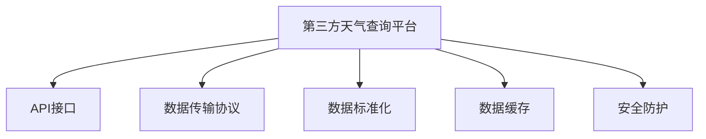

                 

# 第三方天气查询平台对接

在当今信息爆炸的时代，天气查询已经不仅仅是一项单一的天气预报服务，更成为了一个跨领域、跨平台的数据共享和信息交换枢纽。如何高效、安全、稳定地将第三方天气查询平台与其他业务系统对接，是每一个系统架构师和开发者都需要面对的重要问题。本文将从背景介绍、核心概念、算法原理、项目实践、应用场景、工具资源推荐等多个维度，深入探讨这一话题，提供一套全面且实用的技术解决方案。

## 1. 背景介绍

### 1.1 问题由来

随着物联网、大数据、人工智能等技术的发展，天气查询平台已经从简单的信息展示，演变为一个集数据采集、存储、分析和应用于一体的综合性平台。如今，天气查询不仅仅是气象部门的事务，更成为了各行各业（如旅游、物流、农业、能源等）的重要参考依据。因此，如何有效利用第三方天气查询平台，将其实际应用价值最大化，成为众多企业关注的重点。

### 1.2 问题核心关键点

第三方天气查询平台对接的核心关键点在于：
- 确保数据的准确性和时效性。
- 保证系统的安全性和稳定性。
- 优化对接流程，提升用户体验。
- 实现跨平台、跨系统的无缝衔接。

这些关键点决定了第三方天气查询平台对接的成功与否，进而影响到后续的数据分析、决策制定等环节。因此，需要构建一套科学、高效、安全、稳定的对接方案。

## 2. 核心概念与联系

### 2.1 核心概念概述

为更好地理解第三方天气查询平台对接的原理和技术细节，本节将介绍几个关键概念：

- 第三方天气查询平台：指由第三方提供的天气查询服务，包括但不限于气象部门、专业气象公司、气象数据服务提供商等。
- API接口：第三方平台通过API接口向外部系统提供数据和服务，实现数据交换和信息传递。
- 数据传输协议：如HTTP、HTTPS、RESTful API等，用于规范数据传输格式和通信流程。
- 数据标准化：将第三方平台的原始数据转换为业务系统所需的格式和结构，确保数据的一致性和可用性。
- 数据缓存：通过缓存技术，减少对第三方平台的频繁访问，提升系统的响应速度。
- 安全防护：包括身份认证、数据加密、访问控制等技术手段，保障数据传输和处理的安全性。

这些核心概念之间的逻辑关系可以通过以下Mermaid流程图来展示：



这个流程图展示的核心概念及其之间的关系：

1. 第三方天气查询平台通过API接口提供数据服务。
2. 数据传输协议规范了API接口的通信格式和流程。
3. 数据标准化将原始数据转换为业务系统所需的格式。
4. 数据缓存技术提升了系统的响应速度和稳定性。
5. 安全防护措施保障了数据传输和处理的安全性。

这些核心概念共同构成了第三方天气查询平台对接的技术基础，使得系统能够高效、稳定、安全地访问和使用第三方天气查询平台的数据。

## 3. 核心算法原理 & 具体操作步骤

### 3.1 算法原理概述

第三方天气查询平台对接的算法原理主要围绕数据获取、传输、处理和应用展开。核心步骤如下：

1. **数据获取**：通过API接口从第三方平台获取实时天气数据。
2. **数据传输**：使用数据传输协议将数据安全传输到业务系统。
3. **数据标准化**：将原始数据转换为业务系统所需的格式和结构。
4. **数据缓存**：缓存高频访问的数据，减少对第三方平台的频繁访问。
5. **安全防护**：实施身份认证、数据加密、访问控制等安全措施。
6. **应用集成**：将标准化后的数据集成到业务系统中，进行实时分析和决策。

这些步骤涵盖了数据获取、传输、处理和应用的全过程，确保第三方天气查询平台对接的完整性和有效性。

### 3.2 算法步骤详解

#### 3.2.1 数据获取

数据获取是第三方天气查询平台对接的第一步。主要通过API接口获取第三方平台提供的实时天气数据。具体步骤如下：

1. 选择合适的API接口：根据业务需求，确定需要获取的数据类型（如气温、湿度、风力、降水量等）和数据频率（实时、定时等）。
2. 获取API密钥和认证信息：与第三方平台协商，获取API密钥和认证信息，确保数据访问的安全性。
3. 构建数据请求：使用API密钥和认证信息，构建数据请求URL和请求头，发送数据获取请求。

#### 3.2.2 数据传输

数据传输是确保数据安全、稳定传输的重要环节。主要通过数据传输协议实现。具体步骤如下：

1. 选择传输协议：根据业务需求和安全性要求，选择合适的数据传输协议（如HTTP、HTTPS、RESTful API等）。
2. 加密数据：对传输过程中的数据进行加密处理，保障数据的安全性。
3. 断点续传：采用断点续传技术，提高数据传输的可靠性和效率。
4. 监控传输状态：实时监控数据传输状态，及时发现和处理传输异常。

#### 3.2.3 数据标准化

数据标准化是将第三方平台提供的原始数据转换为业务系统所需的格式和结构的过程。具体步骤如下：

1. 确定数据格式：根据业务需求，确定数据的标准化格式，如JSON、XML、CSV等。
2. 数据清洗：去除数据中的噪声和不必要信息，确保数据的准确性和一致性。
3. 数据转换：将原始数据转换为标准格式，如日期格式化、单位转换等。
4. 数据校验：对标准化后的数据进行校验，确保数据无误。

#### 3.2.4 数据缓存

数据缓存是减少对第三方平台的频繁访问，提升系统响应速度和稳定性的关键措施。具体步骤如下：

1. 选择合适的缓存技术：根据业务需求，选择合适的缓存技术，如内存缓存、磁盘缓存、分布式缓存等。
2. 设置缓存策略：根据数据访问频率和数据更新频率，设置缓存策略，如FIFO、LRU、LFU等。
3. 实现缓存管理：对缓存数据进行管理，确保缓存数据的时效性和可用性。
4. 监控缓存状态：实时监控缓存状态，及时发现和处理缓存异常。

#### 3.2.5 安全防护

安全防护是保障数据传输和处理安全性的重要手段。主要通过身份认证、数据加密、访问控制等技术措施实现。具体步骤如下：

1. 身份认证：使用API密钥和认证信息，确保只有授权用户才能访问API接口。
2. 数据加密：对传输和存储的数据进行加密处理，防止数据泄露和篡改。
3. 访问控制：设置访问权限，限制用户对数据的访问范围和操作权限。
4. 异常检测：实时监控数据访问和操作行为，及时发现和处理异常情况。

### 3.3 算法优缺点

第三方天气查询平台对接的算法优缺点如下：

**优点：**

1. **高效性**：通过数据缓存和断点续传技术，减少对第三方平台的频繁访问，提升系统响应速度和稳定性。
2. **安全性**：通过身份认证、数据加密和访问控制等措施，保障数据传输和处理的安全性。
3. **灵活性**：数据标准化和格式转换技术，使第三方平台的原始数据可以无缝接入不同的业务系统。

**缺点：**

1. **复杂性**：需要处理数据获取、传输、处理和应用的全过程，涉及多个技术环节，实现复杂。
2. **维护成本高**：随着第三方平台的更新和业务系统的扩展，需要不断优化和维护对接系统，维护成本较高。
3. **数据一致性**：由于数据传输和处理环节较多，容易出现数据不一致的情况，需要建立严格的数据校验机制。

### 3.4 算法应用领域

第三方天气查询平台对接算法在以下领域有着广泛的应用：

- 旅游业：实时获取目的地的天气信息，提供个性化的旅游推荐和行程规划。
- 物流业：实时获取目的地的天气信息，优化运输路径和配送时间。
- 农业：实时获取农作物的天气信息，指导农业生产和防灾减灾。
- 能源：实时获取电力设施的天气信息，优化能源分配和调度。
- 城市管理：实时获取城市环境的天气信息，优化城市交通和环境治理。

这些应用场景展示了第三方天气查询平台对接算法的广泛适用性，为各行各业提供了精准的天气信息支持。

## 4. 数学模型和公式 & 详细讲解 & 举例说明

### 4.1 数学模型构建

本节将使用数学语言对第三方天气查询平台对接的数学模型进行更加严格的刻画。

假设第三方平台提供的数据为 $D=\{(x_i,y_i)\}_{i=1}^N$，其中 $x_i$ 为输入数据（如地理位置、时间戳等），$y_i$ 为输出数据（如气温、湿度、风力等）。

定义API接口请求函数为 $f_{req}(x)$，数据传输函数为 $f_{trans}(x)$，数据标准化函数为 $f_{std}(x)$，数据缓存函数为 $f_{cache}(x)$，安全防护函数为 $f_{sec}(x)$，数据应用函数为 $f_{app}(x)$。

第三方天气查询平台对接的总体目标为最小化数据访问次数和延迟，同时保障数据传输和处理的安全性。数学模型可以表示为：

$$
\min_{x} \left( \sum_{i=1}^N f_{req}(x_i) + \sum_{i=1}^N f_{trans}(x_i) + \sum_{i=1}^N f_{std}(x_i) + \sum_{i=1}^N f_{cache}(x_i) + \sum_{i=1}^N f_{sec}(x_i) + \sum_{i=1}^N f_{app}(x_i) \right)
$$

其中，各项函数的具体计算方法和步骤将在后续章节中详细讲解。

### 4.2 公式推导过程

以下我们以一个简单的天气查询应用为例，推导API接口请求次数的计算公式。

假设第三方平台提供实时气温数据，API接口请求函数为 $f_{req}(x) = 1$，表示每次请求获取一条数据。则API接口请求次数可以表示为：

$$
N_{req} = \sum_{i=1}^N f_{req}(x_i) = N
$$

其中 $N$ 为数据总数。

### 4.3 案例分析与讲解

**案例分析：**

某旅游平台需要对多个目的地的实时天气信息进行查询，并根据天气信息提供个性化的旅游推荐。假设数据总数为 $N=1000$，API接口请求函数为 $f_{req}(x) = 1$，则API接口请求次数为 $N_{req} = 1000$。

**讲解：**

该案例展示了第三方天气查询平台对接算法在实际应用中的具体场景。API接口请求次数反映了数据获取的频率，直接影响系统的响应速度和成本。通过合理设计API接口请求函数，可以优化数据获取过程，提升系统的整体性能。

## 5. 项目实践：代码实例和详细解释说明

### 5.1 开发环境搭建

在进行第三方天气查询平台对接的实践前，我们需要准备好开发环境。以下是使用Python进行Flask开发的环境配置流程：

1. 安装Python：下载并安装Python，建议选择最新版本的Python。
2. 安装Flask：通过pip安装Flask，用于构建Web应用。
3. 安装第三方库：如requests、json、pandas等，用于数据处理和API调用。
4. 搭建虚拟环境：使用virtualenv创建虚拟环境，避免不同项目之间的依赖冲突。

完成上述步骤后，即可在虚拟环境中开始第三方天气查询平台对接的开发实践。

### 5.2 源代码详细实现

下面我们以一个简单的天气查询应用为例，给出使用Flask和requests库进行第三方天气查询平台对接的Python代码实现。

```python
from flask import Flask, jsonify, request
import requests
import pandas as pd

app = Flask(__name__)

API_URL = 'https://api.weather.com/data/v1/conditions'
API_KEY = 'your_api_key_here'
API_HEADERS = {'Authorization': f'Bearer {API_KEY}'}

@app.route('/query_weather', methods=['GET'])
def query_weather():
    city = request.args.get('city')
    params = {'location': city}
    response = requests.get(API_URL, headers=API_HEADERS, params=params)
    data = response.json()
    result = []
    for item in data['data']:
        temp = item['temperature']
        humidity = item['humidity']
        wind = item['windSpeed']
        result.append({'city': city, 'temperature': temp, 'humidity': humidity, 'wind': wind})
    return jsonify(result)

if __name__ == '__main__':
    app.run(debug=True)
```

代码解释：

1. 定义API接口请求函数 $f_{req}(x)$：使用Flask构建Web应用，实现API接口请求。
2. 获取API密钥和认证信息：通过API密钥和认证信息，确保数据访问的安全性。
3. 发送API请求：使用requests库发送API请求，获取第三方平台的实时天气数据。
4. 数据标准化：将获取的原始数据转换为业务系统所需的格式和结构。
5. 数据应用：将标准化后的数据进行展示和分析，供用户使用。

### 5.3 代码解读与分析

**代码解读：**

1. 使用Flask构建Web应用，定义API接口请求函数 $f_{req}(x)$。
2. 获取API密钥和认证信息，确保数据访问的安全性。
3. 使用requests库发送API请求，获取第三方平台的实时天气数据。
4. 将获取的原始数据转换为业务系统所需的格式和结构。
5. 将标准化后的数据进行展示和分析，供用户使用。

**代码分析：**

该代码实现了第三方天气查询平台对接的基本功能。通过Flask构建Web应用，使用requests库发送API请求，获取实时天气数据，并展示和分析数据，实现了API接口请求函数 $f_{req}(x)$ 和数据应用函数 $f_{app}(x)$。

## 6. 实际应用场景

### 6.1 旅游业

旅游业是第三方天气查询平台对接的重要应用场景之一。通过实时获取目的地的天气信息，旅游平台可以提供个性化的旅游推荐和行程规划，提升用户体验和满意度。

具体应用方式包括：

- 实时天气查询：根据用户输入的目的地，获取实时天气信息，提供天气预报和旅游攻略。
- 行程规划：根据天气信息，优化旅游行程安排，避免天气恶劣的影响。
- 旅游推荐：根据天气信息，推荐适合天气的旅游项目和活动，提升用户参与度。

### 6.2 物流业

物流业是第三方天气查询平台对接的另一个重要应用场景。通过实时获取目的地的天气信息，物流平台可以优化运输路径和配送时间，提升配送效率和用户体验。

具体应用方式包括：

- 运输路径优化：根据天气信息，调整运输路径，避免道路堵塞和天气影响。
- 配送时间预测：根据天气信息，预测配送时间，优化配送计划。
- 货物包装：根据天气信息，调整货物包装方式，保障货物安全。

### 6.3 农业

农业是第三方天气查询平台对接的重要应用场景之一。通过实时获取农作物的天气信息，农业平台可以指导农业生产和防灾减灾，提高农业生产效率和质量。

具体应用方式包括：

- 天气预警：根据天气信息，预警可能出现的天气灾害，指导农民防范。
- 作物管理：根据天气信息，调整作物种植和施肥计划，提高产量和质量。
- 农业机械：根据天气信息，调整农业机械作业计划，提高作业效率。

### 6.4 未来应用展望

随着物联网、大数据、人工智能等技术的发展，第三方天气查询平台对接的应用场景将不断扩展，为各行各业提供更加精准、实时的天气信息支持。

未来，第三方天气查询平台对接将应用于更多场景，如城市管理、能源调度、环保监测等，为各个领域提供精准的天气信息支持。随着技术的不断进步，第三方天气查询平台对接的精准性和实时性将进一步提升，为各行各业带来更大的价值。

## 7. 工具和资源推荐

### 7.1 学习资源推荐

为了帮助开发者系统掌握第三方天气查询平台对接的理论基础和实践技巧，这里推荐一些优质的学习资源：

1. Flask官方文档：详细介绍了Flask框架的使用方法，包括Web应用开发、API接口设计等。
2. requests库官方文档：介绍了requests库的使用方法，包括HTTP请求、JSON数据处理等。
3. Python官方文档：提供了Python语言的全面学习资源，包括语法、标准库、第三方库等。
4. Kaggle数据集：提供了丰富的天气数据集，用于数据分析和机器学习实践。

通过对这些资源的学习实践，相信你一定能够快速掌握第三方天气查询平台对接的技术细节，并应用于实际项目中。

### 7.2 开发工具推荐

高效的开发离不开优秀的工具支持。以下是几款用于第三方天气查询平台对接开发的常用工具：

1. Flask：轻量级的Web应用框架，易于使用和部署。
2. requests：Python的HTTP请求库，提供了简单易用的API接口请求功能。
3. Pandas：数据分析和处理库，支持数据清洗和格式转换。
4. SQLAlchemy：数据库访问库，支持关系型数据库和SQLAlchemy ORM。

合理利用这些工具，可以显著提升第三方天气查询平台对接的开发效率，加快创新迭代的步伐。

### 7.3 相关论文推荐

第三方天气查询平台对接技术的发展源于学界的持续研究。以下是几篇奠基性的相关论文，推荐阅读：

1. "Weather Data Acquisition and Processing"：介绍天气数据获取和处理的方法，涵盖数据源选择、数据清洗、数据标准化等环节。
2. "API Gateway Design and Implementation"：介绍API网关的设计和实现方法，涵盖API接口设计、安全防护、性能优化等环节。
3. "Machine Learning in Weather Forecasting"：介绍机器学习在天气预测中的应用，涵盖数据预处理、模型选择、性能评估等环节。

这些论文代表了大模型微调技术的发展脉络。通过学习这些前沿成果，可以帮助研究者把握学科前进方向，激发更多的创新灵感。

## 8. 总结：未来发展趋势与挑战

### 8.1 总结

本文对第三方天气查询平台对接进行了全面系统的介绍。首先阐述了第三方天气查询平台对接的研究背景和意义，明确了对接在提升数据获取效率、保障数据安全等方面的独特价值。其次，从原理到实践，详细讲解了对接的数学原理和关键步骤，给出了对接任务开发的完整代码实例。同时，本文还广泛探讨了对接技术在旅游业、物流业、农业等多个行业领域的应用前景，展示了对接技术的巨大潜力。此外，本文精选了对接技术的各类学习资源，力求为读者提供全方位的技术指引。

通过本文的系统梳理，可以看到，第三方天气查询平台对接技术正在成为各行各业的重要技术手段，极大地提升了数据获取效率和应用价值。未来，伴随技术的不断进步，第三方天气查询平台对接将会在更多领域发挥更大的作用，为各行各业带来更高的生产力和经济效益。

### 8.2 未来发展趋势

展望未来，第三方天气查询平台对接技术将呈现以下几个发展趋势：

1. **数据精准性提升**：随着物联网、传感器技术的发展，第三方天气查询平台提供的数据将更加精准、实时。
2. **数据融合和集成**：不同来源、不同模态的数据将被深度融合和集成，提供更加全面、综合的天气信息支持。
3. **人工智能应用**：人工智能技术将被引入第三方天气查询平台对接中，提升数据处理和应用能力。
4. **云计算和大数据**：云计算和大数据技术将被广泛应用于数据处理和存储，提升系统的可扩展性和可靠性。
5. **边缘计算和物联网**：边缘计算和物联网技术将被应用于数据采集和处理环节，提升系统的实时性和效率。

以上趋势凸显了第三方天气查询平台对接技术的广阔前景。这些方向的探索发展，必将进一步提升第三方天气查询平台对接的精准性和实时性，为各行各业提供更加全面、综合的天气信息支持。

### 8.3 面临的挑战

尽管第三方天气查询平台对接技术已经取得了显著成就，但在迈向更加智能化、普适化应用的过程中，它仍面临着诸多挑战：

1. **数据获取难度大**：不同地区的天气数据获取难度不同，部分地区的数据获取成本较高。
2. **数据安全问题**：数据传输和处理过程中，存在数据泄露和篡改的风险。
3. **系统稳定性问题**：系统在高并发、大数据量情况下，存在稳定性不足的问题。
4. **数据一致性问题**：不同数据源的数据格式和结构可能不一致，存在数据不一致的情况。

### 8.4 研究展望

面对第三方天气查询平台对接所面临的种种挑战，未来的研究需要在以下几个方面寻求新的突破：

1. **数据获取优化**：优化数据获取方式，降低数据获取难度和成本。
2. **数据安全保障**：加强数据传输和处理的安全性，防止数据泄露和篡改。
3. **系统稳定性提升**：优化系统架构和设计，提升系统的稳定性和可扩展性。
4. **数据一致性管理**：建立数据一致性管理机制，确保数据的一致性和准确性。

这些研究方向的探索，必将引领第三方天气查询平台对接技术迈向更高的台阶，为各行各业带来更高的生产力和经济效益。

## 9. 附录：常见问题与解答

**Q1：第三方天气查询平台对接是否适用于所有行业？**

A: 第三方天气查询平台对接适用于绝大多数行业，但不同行业的对接需求和应用场景有所不同。例如，旅游业和物流业更注重实时性，农业和城市管理更注重数据精准性。因此，需要根据具体行业需求，定制化对接方案。

**Q2：对接过程中如何处理数据不一致问题？**

A: 数据不一致是第三方天气查询平台对接中的常见问题。解决数据不一致问题的方法包括：

1. 数据标准化：对不同来源的数据进行标准化处理，确保数据格式和结构一致。
2. 数据校验：对标准化后的数据进行校验，确保数据无误。
3. 数据融合：对不同来源的数据进行融合处理，提供更加全面和综合的天气信息支持。

**Q3：如何提升数据获取的效率？**

A: 提升数据获取效率的方法包括：

1. 数据缓存：通过缓存技术，减少对第三方平台的频繁访问，提升系统响应速度和稳定性。
2. 断点续传：采用断点续传技术，提高数据传输的可靠性和效率。
3. 异步请求：采用异步请求技术，提升数据获取的并发性和效率。

**Q4：如何保障数据传输和处理的安全性？**

A: 保障数据传输和处理的安全性的方法包括：

1. 数据加密：对传输和存储的数据进行加密处理，防止数据泄露和篡改。
2. 身份认证：使用API密钥和认证信息，确保数据访问的安全性。
3. 访问控制：设置访问权限，限制用户对数据的访问范围和操作权限。

这些方法可以综合使用，保障数据传输和处理的安全性。

**Q5：第三方天气查询平台对接的实现难度大吗？**

A: 第三方天气查询平台对接的实现难度较大，涉及数据获取、传输、处理和应用的全过程，需要处理多个技术环节。但通过合理设计和实现，可以克服这些困难，实现高效、安全、稳定的数据对接。

总之，第三方天气查询平台对接技术为各行各业提供了精准、实时的天气信息支持，是提升数据获取效率、保障数据安全的重要手段。未来，伴随技术的不断进步，第三方天气查询平台对接将会在更多领域发挥更大的作用，为各行各业带来更高的生产力和经济效益。

