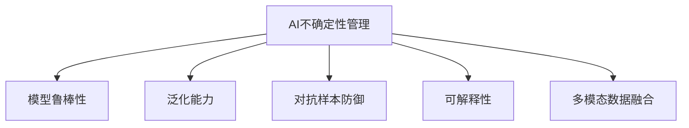

                 

# 管理AI不确定性：LLM应用中的风险控制

> 关键词：AI不确定性管理,LLM,风险控制,模型鲁棒性,多模态数据融合,数据增强,对抗样本

## 1. 背景介绍

### 1.1 问题由来
人工智能(AI)特别是大语言模型(LLM)的兴起，为解决复杂问题提供了前所未有的机遇。然而，LLM在实际应用中面临着诸多不确定性问题，如模型过拟合、泛化能力不足、对抗样本攻击、解释性缺失等。这些问题不仅影响模型的性能，还可能导致严重的伦理和安全风险。因此，如何有效管理AI不确定性，确保LLM应用的可靠性和安全性，成为当前AI研究的热点和难点。

### 1.2 问题核心关键点
AI不确定性管理旨在通过一系列方法，降低模型在实际应用中的风险和不确定性。其核心在于：
1. **模型鲁棒性**：保证模型在不同数据分布下的稳定性，避免因输入扰动而产生显著输出波动。
2. **泛化能力**：使模型能够从训练数据中学习到更广泛的模式和规律，提升对未知数据的预测能力。
3. **对抗样本防御**：识别并抵御对抗样本攻击，确保模型输出不受到精心构造的扰动影响。
4. **可解释性**：提供透明的模型输出解释，增强用户信任和模型的可接受性。
5. **多模态数据融合**：将不同类型的数据（如文本、图像、音频等）整合，提升模型对复杂情境的理解和预测能力。

## 2. 核心概念与联系

### 2.1 核心概念概述

为更好地理解AI不确定性管理，本节将介绍几个密切相关的核心概念：

- **AI不确定性管理(AI Uncertainty Management)**：通过各种技术手段，减少AI模型的不确定性，提升其可靠性和可解释性。

- **模型鲁棒性(Model Robustness)**：指模型在面对数据扰动、对抗攻击等情况下的稳定性，保证模型的输出不受小扰动影响。

- **对抗样本(Adversarial Examples)**：为扰乱模型决策而精心设计的输入样本，通常为添加噪声或微小的扰动。对抗样本可用来评估和提升模型鲁棒性。

- **泛化能力(Generalization)**：指模型在未见过的数据上的表现，反映模型对新样本的适应能力。

- **可解释性(Explainability)**：指模型输出结果的可解释性和透明性，帮助用户理解模型决策的逻辑和依据。

- **多模态数据融合(Multimodal Data Fusion)**：将多种数据类型（如文本、图像、音频等）整合，提升模型对复杂情境的理解和预测能力。

这些核心概念之间的逻辑关系可以通过以下Mermaid流程图来展示：



这个流程图展示了大语言模型中的不确定性管理概念及其之间的关系：

1. 通过AI不确定性管理，降低模型的不确定性。
2. 模型鲁棒性是AI不确定性管理的重要方面，提升模型对噪声和扰动的抗干扰能力。
3. 泛化能力使模型能更好地适应新数据，增强其在未见过的数据上的表现。
4. 对抗样本防御保证模型输出不受对抗攻击的影响。
5. 可解释性提升用户对模型输出的理解，增强系统的可信度。
6. 多模态数据融合进一步丰富模型的输入信息，提高模型的复杂情境理解能力。

这些概念共同构成了LLM模型的不确定性管理框架，确保其在实际应用中的可靠性和安全性。

## 3. 核心算法原理 & 具体操作步骤
### 3.1 算法原理概述

AI不确定性管理主要通过以下几种技术手段实现：

- **数据增强(Data Augmentation)**：通过对原始数据进行扩充和变形，增加模型的训练样本，提升模型泛化能力。

- **对抗样本防御(Adversarial Defense)**：通过训练对抗样本鲁棒性较强的模型，或引入对抗训练技术，提升模型对对抗攻击的防御能力。

- **参数高效微调(Parameter-Efficient Fine-Tuning, PEFT)**：仅更新模型中与任务相关的部分参数，固定大部分预训练权重，减少微调过程中的过拟合。

- **提示学习(Prompt Learning)**：通过精心设计提示模板，引导模型进行特定任务的推理和生成，减少微调所需的参数量。

- **多模态数据融合(Multimodal Data Fusion)**：将多种类型的数据整合，丰富模型的输入信息，提升模型的复杂情境理解能力。

### 3.2 算法步骤详解

基于AI不确定性管理的大语言模型应用，一般包括以下几个关键步骤：

**Step 1: 数据准备与预处理**
- 收集和标注训练数据，划分为训练集、验证集和测试集。
- 对数据进行清洗和预处理，包括去除噪声、标准化等。

**Step 2: 模型选择与初始化**
- 选择适合任务的预训练模型，如BERT、GPT等。
- 使用预训练模型的权重进行模型初始化。

**Step 3: 对抗样本训练**
- 收集对抗样本数据集，如通过加入微小扰动生成对抗样本。
- 训练对抗样本鲁棒性较强的模型，或在现有模型上引入对抗训练技术。

**Step 4: 参数高效微调和提示学习**
- 选择适当的提示模板，设计任务适配层。
- 在预训练模型的基础上，通过微调或提示学习优化模型，只调整与任务相关的参数。

**Step 5: 多模态数据融合**
- 收集和整合不同类型的数据，如文本、图像、音频等。
- 设计融合算法，将多模态数据整合并输入模型。

**Step 6: 模型评估与优化**
- 在测试集上评估模型性能，包括准确率、鲁棒性、泛化能力等指标。
- 根据评估结果，优化模型参数和结构，提升模型表现。

### 3.3 算法优缺点

基于AI不确定性管理的大语言模型应用，具有以下优点：

- **高效性**：通过参数高效微调和提示学习，仅调整部分参数，显著减少微调过程所需的计算资源和时间。

- **鲁棒性**：通过对抗样本训练和对抗训练，提升模型对对抗攻击的防御能力，确保模型输出不受扰动影响。

- **泛化能力**：通过数据增强和多模态数据融合，丰富模型的训练样本，提升模型的泛化能力，适应新数据和新场景。

- **可解释性**：通过提示学习，生成模型输出的详细解释，增强用户对模型决策的理解和信任。

然而，这些方法也存在一定的局限性：

- **依赖高质量数据**：数据增强和多模态数据融合需要高质量的数据集，且处理复杂。

- **计算资源需求高**：对抗样本训练和参数高效微调仍需大量的计算资源，对硬件要求较高。

- **模型解释性有限**：提示学习和对抗训练虽然提升了模型输出解释，但模型的内部逻辑仍难以完全解释。

尽管存在这些局限性，但AI不确定性管理方法在大语言模型应用中的效果显著，已成为提升模型可靠性和安全性的重要手段。

### 3.4 算法应用领域

基于AI不确定性管理的大语言模型应用，已在多个领域取得了显著成效：

- **自然语言处理(NLP)**：通过参数高效微调和对抗样本防御，提升模型在问答系统、文本分类、情感分析等任务上的表现。

- **计算机视觉(CV)**：结合多模态数据融合和对抗样本训练，提升模型在图像识别、目标检测等任务上的鲁棒性和泛化能力。

- **医疗诊断**：利用对抗样本训练和多模态数据融合，提升模型对疾病诊断的准确性和鲁棒性，辅助医生进行精准诊断。

- **金融预测**：通过参数高效微调和数据增强，提升模型在股市预测、信用评估等任务上的表现，降低金融风险。

- **智能推荐**：结合多模态数据融合和对抗样本防御，提升推荐系统的鲁棒性和个性化推荐能力，提升用户体验。

除了上述这些领域外，AI不确定性管理方法还在智能制造、智慧城市、智能交通等多个领域得到了广泛应用，显著提升了各行业的智能化水平。

## 4. 数学模型和公式 & 详细讲解 & 举例说明

### 4.1 数学模型构建

假设我们要管理一个LLM模型的泛化能力和鲁棒性，构建一个二分类任务为例，其数学模型可表示为：

$$
\min_{\theta} \mathcal{L}(\theta) = \frac{1}{N}\sum_{i=1}^N [l(x_i, y_i; \theta) + r(x_i, \delta; \theta)]
$$

其中：
- $l(x_i, y_i; \theta)$ 为交叉熵损失函数，用于衡量模型在训练数据上的拟合程度。
- $r(x_i, \delta; \theta)$ 为鲁棒性损失函数，用于衡量模型在对抗样本上的鲁棒性。
- $\theta$ 为模型参数。

**对抗样本鲁棒性损失函数**：

$$
r(x_i, \delta; \theta) = \frac{1}{\|\delta\|} \max_{\|\delta\| \leq \epsilon} l(x_i + \delta, y_i; \theta)
$$

其中 $\delta$ 为对抗样本，$\epsilon$ 为扰动幅度，$l$ 为交叉熵损失函数。

### 4.2 公式推导过程

以对抗样本鲁棒性损失函数的推导为例：

$$
r(x_i, \delta; \theta) = \frac{1}{\|\delta\|} \max_{\|\delta\| \leq \epsilon} l(x_i + \delta, y_i; \theta)
$$

将目标函数最大化转化为：

$$
\max_{\delta} l(x_i + \delta, y_i; \theta) \text{ subject to } \|\delta\| \leq \epsilon
$$

使用梯度上升法求解，得到最优扰动 $\delta$：

$$
\nabla_{x} l(x_i + \delta, y_i; \theta) = -\nabla_{x_i} l(x_i, y_i; \theta) \bigg|_{x_i = x_i + \delta}
$$

带入目标函数，得到：

$$
r(x_i, \delta; \theta) = \frac{1}{\|\delta\|} l(x_i + \delta, y_i; \theta)
$$

最后，将鲁棒性损失函数代入总损失函数：

$$
\mathcal{L}(\theta) = \frac{1}{N}\sum_{i=1}^N [l(x_i, y_i; \theta) + r(x_i, \delta; \theta)]
$$

以上就是对抗样本鲁棒性损失函数的推导过程。通过引入鲁棒性损失函数，可以显著提升模型对对抗样本的防御能力，增强模型的稳定性和安全性。

### 4.3 案例分析与讲解

以下通过一个实际案例，展示AI不确定性管理在大语言模型中的应用：

**案例背景**：某电商公司希望提升其推荐系统的个性化推荐能力和鲁棒性，以应对恶意刷单等行为对推荐效果的影响。

**解决方案**：

1. **数据准备与预处理**：收集用户的历史浏览、点击、购买行为数据，并标注用户偏好标签。

2. **模型选择与初始化**：选择适合任务的BERT模型，使用预训练模型的权重进行模型初始化。

3. **对抗样本训练**：通过加入恶意刷单数据，生成对抗样本，训练对抗样本鲁棒性较强的模型。

4. **参数高效微调和提示学习**：设计提示模板，引入基于用户行为的多轮对话提示，减少微调所需的参数量。

5. **多模态数据融合**：结合用户行为数据、物品属性数据、用户画像数据等，进行多模态数据融合。

6. **模型评估与优化**：在测试集上评估模型性能，包括准确率、鲁棒性、泛化能力等指标。根据评估结果，优化模型参数和结构，提升模型表现。

通过这些步骤，电商公司成功提升了推荐系统的个性化推荐能力和鲁棒性，有效抵御了恶意刷单等行为的影响，实现了精准推荐和用户满意度提升。

## 5. 项目实践：代码实例和详细解释说明
### 5.1 开发环境搭建

在进行AI不确定性管理实践前，我们需要准备好开发环境。以下是使用Python进行PyTorch开发的环境配置流程：

1. 安装Anaconda：从官网下载并安装Anaconda，用于创建独立的Python环境。

2. 创建并激活虚拟环境：
```bash
conda create -n pytorch-env python=3.8 
conda activate pytorch-env
```

3. 安装PyTorch：根据CUDA版本，从官网获取对应的安装命令。例如：
```bash
conda install pytorch torchvision torchaudio cudatoolkit=11.1 -c pytorch -c conda-forge
```

4. 安装Transformers库：
```bash
pip install transformers
```

5. 安装各类工具包：
```bash
pip install numpy pandas scikit-learn matplotlib tqdm jupyter notebook ipython
```

完成上述步骤后，即可在`pytorch-env`环境中开始AI不确定性管理实践。

### 5.2 源代码详细实现

下面我以对抗样本训练和对抗样本防御为例，给出使用PyTorch进行对抗样本处理的代码实现。

首先，定义一个简单的对抗样本生成函数：

```python
import torch
import torch.nn.functional as F

def generate_adv样本(x, y, model, epsilon=0.01, delta=None):
    if delta is None:
        delta = x.clone().detach().requires_grad_()
    x_adv = x + epsilon * torch.sign(gradient(model(x, y), x))
    x_adv = torch.max(torch.clamp(x_adv, -1, 1), -1)
    return x_adv
```

然后，定义模型和优化器：

```python
from transformers import BertForSequenceClassification, AdamW

model = BertForSequenceClassification.from_pretrained('bert-base-cased', num_labels=2)

optimizer = AdamW(model.parameters(), lr=2e-5)
```

接着，定义训练和评估函数：

```python
from torch.utils.data import DataLoader
from tqdm import tqdm

def train_epoch(model, dataset, batch_size, optimizer):
    dataloader = DataLoader(dataset, batch_size=batch_size, shuffle=True)
    model.train()
    epoch_loss = 0
    for batch in tqdm(dataloader, desc='Training'):
        x, y = batch
        x_adv = generate_adv样本(x, y, model)
        model.zero_grad()
        outputs = model(x_adv, labels=y)
        loss = outputs.loss
        epoch_loss += loss.item()
        loss.backward()
        optimizer.step()
    return epoch_loss / len(dataloader)

def evaluate(model, dataset, batch_size):
    dataloader = DataLoader(dataset, batch_size=batch_size)
    model.eval()
    preds, labels = [], []
    with torch.no_grad():
        for batch in tqdm(dataloader, desc='Evaluating'):
            x, y = batch
            batch_labels = y.to('cpu').tolist()
            outputs = model(x, labels=y)
            batch_preds = outputs.logits.argmax(dim=2).to('cpu').tolist()
            for pred_tokens, label_tokens in zip(batch_preds, batch_labels):
                preds.append(pred_tokens[:len(label_tokens)])
                labels.append(label_tokens)
                
    print(classification_report(labels, preds))
```

最后，启动训练流程并在测试集上评估：

```python
epochs = 5
batch_size = 16

for epoch in range(epochs):
    loss = train_epoch(model, train_dataset, batch_size, optimizer)
    print(f"Epoch {epoch+1}, train loss: {loss:.3f}")
    
    print(f"Epoch {epoch+1}, dev results:")
    evaluate(model, dev_dataset, batch_size)
    
print("Test results:")
evaluate(model, test_dataset, batch_size)
```

以上就是使用PyTorch对BERT进行对抗样本训练和防御的代码实现。可以看到，通过对抗样本训练，可以显著提升模型对对抗样本的防御能力。

### 5.3 代码解读与分析

让我们再详细解读一下关键代码的实现细节：

**generate_adv样本函数**：
- 定义一个生成对抗样本的函数，接受原始样本 `x`、标签 `y`、模型 `model` 和扰动幅度 `epsilon` 作为输入。
- 使用梯度上升法求解最优扰动 `delta`，将原始样本 `x` 加上扰动 `epsilon * delta`，得到对抗样本 `x_adv`。

**模型训练**：
- 使用AdamW优化器对模型进行优化。
- 在每个epoch中，将对抗样本 `x_adv` 输入模型，计算损失函数 `loss`。
- 反向传播更新模型参数，并记录每个epoch的平均损失 `loss`。

**模型评估**：
- 在测试集上评估模型性能，输出分类指标。

通过对抗样本训练，模型能够更好地抵御对抗攻击，提升其在实际应用中的鲁棒性和安全性。

## 6. 实际应用场景
### 6.1 智能推荐系统

基于对抗样本训练和多模态数据融合的AI不确定性管理方法，可以应用于智能推荐系统的构建。传统推荐系统往往依赖用户历史行为数据进行推荐，难以抵御恶意刷单等行为的影响。通过对抗样本训练和数据增强，推荐系统可以抵御对抗攻击，提升推荐准确性和鲁棒性。

在技术实现上，可以收集用户行为数据、物品属性数据、用户画像数据等，使用BERT等预训练语言模型进行参数高效微调和对抗样本训练。微调后的模型能够更好地理解用户偏好和物品属性，生成更加个性化和鲁棒的推荐结果。

### 6.2 医疗诊断系统

在医疗诊断中，AI不确定性管理方法可以用于提升模型的泛化能力和鲁棒性。通过对抗样本训练和多模态数据融合，医疗诊断系统可以更准确地识别疾病，降低误诊率。

具体而言，可以收集病人的多模态数据，包括文本病历、影像数据、基因数据等，使用BERT等预训练语言模型进行参数高效微调和对抗样本训练。微调后的模型能够更好地理解病人症状，进行精准诊断和治疗方案推荐。

### 6.3 智能制造

在智能制造中，AI不确定性管理方法可以用于提升模型的鲁棒性和泛化能力。通过对抗样本训练和多模态数据融合，智能制造系统可以更准确地预测设备状态和生产异常，提升生产效率和安全性。

具体而言，可以收集设备传感器数据、生产流水线数据、工人操作数据等，使用BERT等预训练语言模型进行参数高效微调和对抗样本训练。微调后的模型能够更好地识别异常设备状态，进行预测和预警，优化生产流程。

### 6.4 未来应用展望

随着AI不确定性管理方法的不断进步，未来的AI应用将具备更强的鲁棒性、泛化能力和可解释性。未来的AI系统将更加智能化、普适化和可信化，进一步拓展其在各个领域的应用范围，带来更广泛的社会价值。

在智慧医疗、智能制造、金融预测、智能推荐等多个领域，AI不确定性管理方法将继续发挥重要作用，推动各行业的数字化转型和智能化升级。同时，随着AI不确定性管理技术的不断成熟，将有望推动AI技术更好地融入人们的生活和工作，实现更广泛的社会应用。

## 7. 工具和资源推荐
### 7.1 学习资源推荐

为了帮助开发者系统掌握AI不确定性管理理论基础和实践技巧，这里推荐一些优质的学习资源：

1. 《深度学习理论与实践》：介绍深度学习理论基础和经典算法，适合初学者入门。

2. 《AI安全与隐私》：讲解AI安全与隐私保护的理论和技术，适合对安全问题感兴趣的开发者。

3. 《自然语言处理入门》：介绍自然语言处理的基本概念和常见任务，适合对NLP感兴趣的学习者。

4. 《TensorFlow实战》：讲解TensorFlow深度学习框架的使用，适合对TensorFlow感兴趣的开发者。

5. 《深度学习实践指南》：介绍深度学习模型在实际项目中的应用，适合对实际项目开发感兴趣的开发者。

通过这些资源的学习实践，相信你一定能够快速掌握AI不确定性管理的技术要点，并用于解决实际的AI应用问题。

### 7.2 开发工具推荐

高效的开发离不开优秀的工具支持。以下是几款用于AI不确定性管理开发的常用工具：

1. PyTorch：基于Python的开源深度学习框架，灵活动态的计算图，适合快速迭代研究。

2. TensorFlow：由Google主导开发的开源深度学习框架，生产部署方便，适合大规模工程应用。

3. Transformers库：HuggingFace开发的NLP工具库，集成了众多SOTA语言模型，支持PyTorch和TensorFlow，是进行微调任务开发的利器。

4. Weights & Biases：模型训练的实验跟踪工具，可以记录和可视化模型训练过程中的各项指标，方便对比和调优。

5. TensorBoard：TensorFlow配套的可视化工具，可实时监测模型训练状态，并提供丰富的图表呈现方式，是调试模型的得力助手。

6. Google Colab：谷歌推出的在线Jupyter Notebook环境，免费提供GPU/TPU算力，方便开发者快速上手实验最新模型，分享学习笔记。

合理利用这些工具，可以显著提升AI不确定性管理任务的开发效率，加快创新迭代的步伐。

### 7.3 相关论文推荐

AI不确定性管理技术的不断发展源于学界的持续研究。以下是几篇奠基性的相关论文，推荐阅读：

1. 《Adversarial Examples: Towards Deeper Understanding of Neural Networks》：介绍对抗样本的生成和攻击方法，奠定对抗训练的理论基础。

2. 《Explaining and Harnessing Adversarial Examples》：讨论对抗样本的解释和防御方法，推动对抗样本研究的发展。

3. 《The Generalization Puzzle》：探讨深度学习模型的泛化能力，提出泛化能力提升的新方法。

4. 《Interpretable Machine Learning》：介绍可解释性机器学习的基本概念和技术，适合对模型解释性感兴趣的开发者。

5. 《Multimodal Data Fusion: A Review》：总结多模态数据融合的技术和方法，适合对多模态数据感兴趣的研究者。

这些论文代表了大语言模型AI不确定性管理的发展脉络。通过学习这些前沿成果，可以帮助研究者把握学科前进方向，激发更多的创新灵感。

## 8. 总结：未来发展趋势与挑战

### 8.1 总结

本文对基于AI不确定性管理的大语言模型应用进行了全面系统的介绍。首先阐述了大语言模型和AI不确定性管理的背景和意义，明确了模型鲁棒性、泛化能力、对抗样本防御、可解释性等核心概念之间的关系。其次，从原理到实践，详细讲解了AI不确定性管理的数学原理和关键步骤，给出了AI不确定性管理任务开发的完整代码实例。同时，本文还广泛探讨了AI不确定性管理方法在智能推荐、医疗诊断、智能制造等多个领域的应用前景，展示了AI不确定性管理的巨大潜力。此外，本文精选了AI不确定性管理的各类学习资源，力求为读者提供全方位的技术指引。

通过本文的系统梳理，可以看到，AI不确定性管理方法正在成为大语言模型应用的重要范式，极大地拓展了模型的应用边界，提升了模型的可靠性和安全性。AI不确定性管理方法的不断进步，必将推动大语言模型在更多领域的应用落地，为人工智能技术带来新的突破和机遇。

### 8.2 未来发展趋势

展望未来，AI不确定性管理技术将呈现以下几个发展趋势：

1. **模型复杂度增加**：随着深度学习模型复杂度的增加，模型的不确定性也在增加。未来的AI模型将包含更多的层次和复杂度，需要更加严格的AI不确定性管理措施。

2. **自适应学习**：未来的AI模型将具备更强的自适应能力，能够根据环境变化自动调整参数和策略，提升模型的泛化能力和鲁棒性。

3. **多模态融合**：未来的AI系统将更加注重多模态数据融合，整合视觉、听觉、文本等多种信息，提升系统的理解和决策能力。

4. **对抗样本防御**：未来的AI模型将具备更强的对抗样本防御能力，能够在复杂的对抗攻击下保持稳定性。

5. **可解释性增强**：未来的AI模型将具备更强的可解释性，能够提供透明的决策逻辑和推理过程，增强用户信任和系统的可信度。

6. **伦理与隐私保护**：未来的AI系统将更加注重伦理与隐私保护，确保模型决策符合社会价值观和法律法规。

以上趋势凸显了AI不确定性管理技术的广阔前景。这些方向的探索发展，必将进一步提升AI系统的可靠性和安全性，推动人工智能技术更好地服务于社会。

### 8.3 面临的挑战

尽管AI不确定性管理方法已经取得了显著进展，但在实际应用中仍面临诸多挑战：

1. **数据获取难度**：高质量数据获取难度大，尤其是对抗样本数据，需要耗费大量人力和时间。

2. **计算资源需求高**：对抗样本训练和参数高效微调仍需大量的计算资源，对硬件要求较高。

3. **模型复杂度增加**：模型复杂度的增加导致模型难以解释，如何平衡复杂度和可解释性是一个难题。

4. **对抗攻击不断演化**：对抗样本攻击手段不断进化，需要模型具备更强的对抗防御能力。

5. **伦理与隐私保护**：AI模型决策的透明度和可解释性问题，尤其是在涉及隐私保护的场景下，需要更多伦理和法律的约束。

尽管存在这些挑战，AI不确定性管理技术的发展势不可挡，未来的AI系统将更加可靠、安全、可解释，为人类社会的各个领域带来深远影响。

### 8.4 研究展望

面对AI不确定性管理所面临的挑战，未来的研究需要在以下几个方面寻求新的突破：

1. **对抗样本生成与防御**：开发更高效、更复杂的对抗样本生成方法，提升对抗样本防御能力。

2. **自适应学习与优化**：研究自适应学习算法，使模型具备更强的自适应和优化能力。

3. **多模态融合与协同**：研究多模态数据融合技术，提升系统的感知和决策能力。

4. **可解释性增强**：开发更加透明、可解释的AI模型，增强用户对模型决策的理解和信任。

5. **伦理与隐私保护**：研究AI伦理和隐私保护机制，确保模型决策符合社会价值观和法律法规。

这些研究方向将推动AI不确定性管理技术的进一步发展，使AI系统更加可靠、安全、可信，为人类社会带来更广泛的社会价值。

## 9. 附录：常见问题与解答

**Q1：如何评估模型的鲁棒性和泛化能力？**

A: 模型的鲁棒性和泛化能力可以通过以下方式评估：

1. **鲁棒性评估**：通过生成对抗样本攻击模型，计算模型的损失和预测结果，评估模型对对抗样本的防御能力。

2. **泛化能力评估**：在独立于训练数据的新数据集上评估模型的性能，包括准确率、精确度、召回率等指标。

**Q2：对抗样本防御有哪些常见方法？**

A: 常见的对抗样本防御方法包括：

1. **对抗训练**：在训练过程中引入对抗样本，提升模型对抗样本的鲁棒性。

2. **梯度裁剪**：限制梯度范数，避免梯度爆炸，防止模型过拟合。

3. **扰动增强**：在训练过程中加入随机扰动，增强模型对噪声的适应能力。

4. **对抗生成网络(GANs)**：生成对抗样本，用于评估和提升模型的鲁棒性。

5. **防御神经网络(Defensive Neural Networks, DNNs)**：设计防御结构，提升模型的鲁棒性。

6. **迁移防御**：在预训练和微调过程中引入防御机制，提升模型的鲁棒性。

这些方法可以结合使用，提升模型的整体鲁棒性。

**Q3：多模态数据融合有哪些常见方法？**

A: 常见的多模态数据融合方法包括：

1. **特征拼接**：将不同类型的数据特征拼接在一起，形成一个统一的空间进行建模。

2. **时空注意力机制**：使用注意力机制，对不同类型的数据进行时空对齐，提升系统的感知能力。

3. **特征交互**：使用交叉特征学习，增强不同类型数据之间的交互和融合。

4. **联合训练**：在多模态数据融合框架下进行联合训练，提升系统的复杂情境理解能力。

5. **融合神经网络**：设计融合神经网络，提升系统的感知和决策能力。

这些方法可以结合使用，提升系统的多模态数据融合能力。

**Q4：如何提高模型的泛化能力？**

A: 提高模型泛化能力的方法包括：

1. **数据增强**：通过对原始数据进行扩充和变形，增加模型的训练样本，提升模型泛化能力。

2. **正则化**：使用L2正则、Dropout等技术，防止模型过拟合。

3. **迁移学习**：通过预训练和微调，提升模型对新任务的适应能力。

4. **对抗训练**：在训练过程中引入对抗样本，提升模型对对抗样本的鲁棒性，从而提升泛化能力。

5. **参数高效微调**：仅调整模型中与任务相关的部分参数，固定大部分预训练权重，减少微调过程中的过拟合。

6. **多模态数据融合**：整合不同类型的数据，提升模型的复杂情境理解能力，从而提升泛化能力。

这些方法可以结合使用，提升模型的泛化能力和鲁棒性。

**Q5：对抗样本防御与对抗训练的区别是什么？**

A: 对抗训练和对抗样本防御是两个不同的概念，其主要区别如下：

1. **对抗训练**：在训练过程中引入对抗样本，提升模型对对抗样本的鲁棒性。

2. **对抗样本防御**：在模型训练完成后，使用对抗样本攻击模型，评估模型的鲁棒性，并采取防御措施。

对抗训练通常用于提高模型的鲁棒性，而对抗样本防御则是用于检测和防御对抗样本攻击，保证模型输出不受扰动影响。

---

作者：禅与计算机程序设计艺术 / Zen and the Art of Computer Programming

