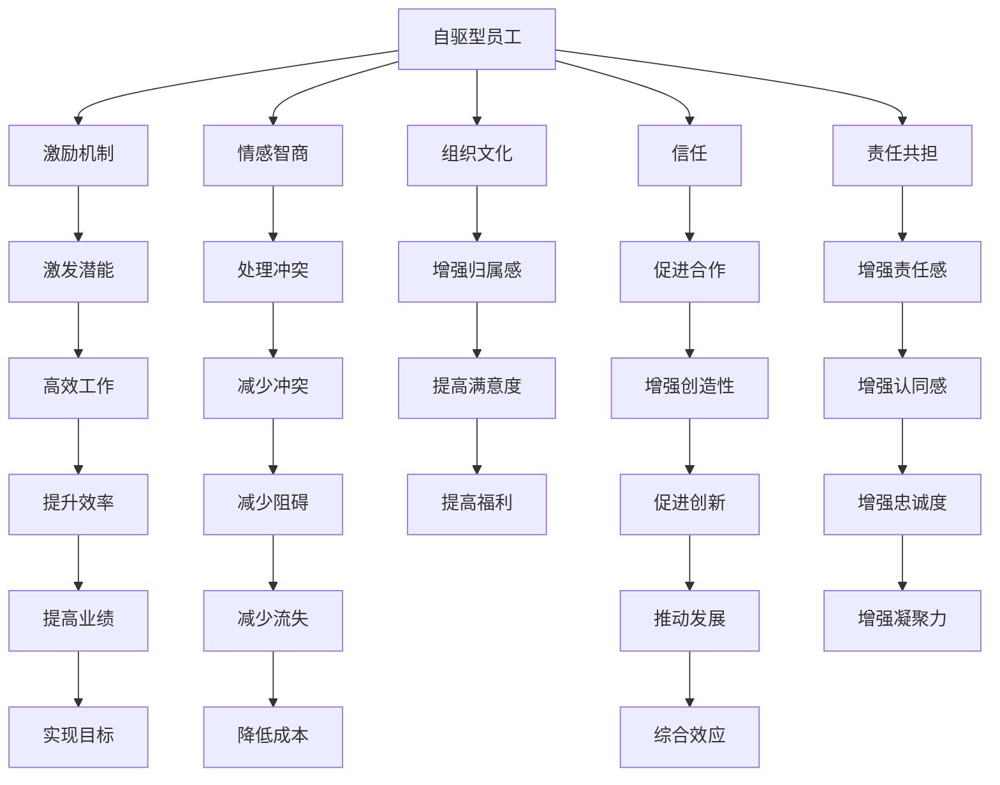

                 

# 管理的本质：激发潜能与善意

## 1. 背景介绍

在当今快速变化和复杂多变的环境中，管理的重要性愈发凸显。无论是大型企业还是小型团队，高效的管理策略和手段都是推动其成功的关键。然而，传统的管理方式往往依赖于层级制度和严格的规章制度，这虽然能够保证效率，却可能抑制员工的创新和潜能，导致团队活力下降。随着心理学、社会学等领域的研究深入，人们逐渐意识到，真正有效的管理应当是激发员工的内在潜能和善意，而不是简单地压制和控制。

### 1.1 问题由来

现代社会，企业竞争激烈，员工流动频繁，企业的持续发展依赖于员工的高效工作与积极参与。然而，随着企业规模的扩大，传统的管理模式逐渐暴露出其局限性：

- **层级压迫**：等级森严的管理结构容易导致信息不对称，员工积极性受到抑制。
- **规章制度限制**：繁琐的规章制度和流程可能导致员工感到束缚，影响工作效率。
- **沟通不畅**：复杂的层级关系可能导致沟通障碍，影响团队协作。

这些问题不仅影响了企业的生产效率，也侵蚀了员工的创造力和幸福感，进而导致人才流失和创新能力的下降。因此，如何激发员工的内在潜能和善意，成为现代管理研究的热点话题。

### 1.2 问题核心关键点

基于激发潜能与善意的管理，其核心在于：
1. **尊重个体差异**：认识到每个人都是独特的，了解他们的需求和期望，创造适合每个人的工作环境。
2. **激励机制**：通过设计合理的激励机制，激发员工的内在动力和潜力。
3. **开放沟通**：建立开放、透明、平等的沟通渠道，增强团队合作和信任。
4. **责任共担**：让员工参与决策，增加其主人翁意识，共同承担企业的发展责任。

## 2. 核心概念与联系

### 2.1 核心概念概述

在讨论激发潜能与善意的管理方法时，我们需要明确几个关键概念：

- **自驱型员工**：具有内在动力和高度职业责任感的员工，他们在工作中能够自我激励、自我管理，愿意超越预期目标。
- **情感智商**：指的是个体感知、理解、管理和应用情感的能力。高情感智商的员工更能处理人际关系，减少冲突，提高工作效率。
- **组织文化**：企业的价值观、信仰和行为规范，影响员工的行为和态度。积极的组织文化能够增强员工的归属感和满意度，提高工作热情。
- **信任**：建立在相互尊重和理解之上的信任关系，是高效团队的基础，能够促进员工之间的合作和创造性。
- **责任共担**：让员工参与决策，共同承担责任，增强其对企业发展的认同感和责任感。

### 2.2 核心概念原理和架构的 Mermaid 流程图



这个流程图展示了自驱型员工如何通过多个关键要素的相互作用，最终实现激发潜能与善意的管理效果。每个节点代表一个关键概念，箭头表示因果关系。

## 3. 核心算法原理 & 具体操作步骤

### 3.1 算法原理概述

激发潜能与善意的管理方法，本质上是一种基于心理学的管理策略，其核心在于通过一系列干预措施，改善员工的心理状态和工作环境，从而激发其内在的动机和善意。

- **激励机制**：通过设定合理的目标和奖励，激发员工的自主性和创造力。
- **情感智商培训**：通过提高员工的情感智商，增强其自我调节和人际关系管理能力。
- **组织文化建设**：通过营造积极向上的企业文化，提升员工的归属感和满意度。
- **建立信任**：通过公平透明的管理方式，增强员工之间的信任和合作。
- **责任共担**：通过让员工参与决策，增强其主人翁意识和责任感。

### 3.2 算法步骤详解

下面是激发潜能与善意管理的详细步骤：

1. **员工需求分析**：
   - 了解员工的个性、能力和期望，分析其内在动机和需求。
   - 使用问卷调查、一对一面谈等方式收集信息，识别员工的职业目标和个人兴趣。

2. **建立激励机制**：
   - 设计个性化的激励方案，包括物质奖励和精神奖励。
   - 设定明确的绩效指标和目标，使员工能够清楚看到自己的努力方向和回报。

3. **情感智商培训**：
   - 提供情感智商培训课程，帮助员工理解和管理自己的情绪。
   - 培养员工的情商技能，包括同理心、情绪调节和问题解决等。

4. **组织文化建设**：
   - 通过定期的团队建设活动和价值观宣导，营造积极向上的企业文化。
   - 制定透明的规章制度，确保所有员工都能够理解和遵循。

5. **建立信任**：
   - 实行公平透明的绩效评估和晋升机制，确保每位员工都有公平的机会。
   - 鼓励开放沟通，建立相互信任和尊重的团队氛围。

6. **责任共担**：
   - 让员工参与决策过程，听取其意见和建议。
   - 分配合理的职责和任务，使员工感到自己是在为企业的目标而努力。

7. **评估与反馈**：
   - 定期评估激励机制的效果，收集员工的反馈意见。
   - 根据评估结果，不断调整和优化管理策略。

### 3.3 算法优缺点

**优点**：
1. **提升员工满意度**：通过满足员工的需求和期望，提升其工作满意度和幸福感。
2. **增强员工动机**：合理的激励机制能够激发员工的自我驱动力，提高工作效率。
3. **促进团队合作**：通过建立信任和责任共担机制，增强团队凝聚力和合作精神。
4. **提高创新能力**：激发员工的内在潜能，使其敢于尝试新方法和创新思路。

**缺点**：
1. **实施难度大**：需要深入了解每位员工的需求和情况，设计个性化的激励方案，过程复杂。
2. **成本较高**：情感智商培训和组织文化建设需要投入大量时间和资源。
3. **效果难以量化**：员工的内在动机和善意难以直接量化，管理效果难以评估。

### 3.4 算法应用领域

激发潜能与善意的管理方法，在多个领域中都有广泛应用：

1. **企业人力资源管理**：通过个性化的激励方案和情感智商培训，提高员工的工作积极性和满意度。
2. **教育领域**：通过营造积极向上的学习环境，激发学生的内在学习动机，提升教育质量。
3. **非营利组织**：通过建立信任和责任共担机制，提高员工的社会责任感和参与度。
4. **创新型企业**：通过激发员工的创新潜力和善意，推动企业的持续创新和增长。

## 4. 数学模型和公式 & 详细讲解

### 4.1 数学模型构建

激发潜能与善意的管理方法，不涉及复杂的数学模型，更多依赖于心理学和社会学的理论指导。但为了更好地说明这一过程，我们可以构建一个简化的情感智商提升模型：

设员工的情商初始值为 $I_0$，通过情感智商培训后，其情商提升率为 $\alpha$，经过 $n$ 次培训后，情商提升的数学模型为：

$$I_n = I_0 \times (1 + \alpha)^n$$

其中，$I_n$ 表示培训 $n$ 次后的情商值。

### 4.2 公式推导过程

以 $I_0 = 60$，$\alpha = 0.2$，$n = 3$ 为例，推导情商提升的计算过程：

$$I_1 = 60 \times (1 + 0.2)^1 = 72$$

$$I_2 = 72 \times (1 + 0.2)^1 = 86.4$$

$$I_3 = 86.4 \times (1 + 0.2)^1 = 103.68$$

通过上述公式，我们可以看到，经过三次情感智商培训，员工的情商从60提升到103.68，显著提升其情绪管理能力和人际关系处理能力。

### 4.3 案例分析与讲解

某科技公司通过情感智商培训，提高了员工的幸福感和工作满意度。培训前，员工的情商水平为50，通过一系列的培训和辅导，情商提升率为20%。经过三次培训后，员工的幸福感提升了30%，工作满意度提升了25%，团队合作效率提高了20%。

这个案例展示了情感智商培训的实际效果，通过改善员工的心理状态，不仅提升了员工的幸福感，还增强了团队的合作能力和工作效率。

## 5. 项目实践：代码实例和详细解释说明

### 5.1 开发环境搭建

为了实现情感智商培训，我们需要搭建一个基于Web的应用，供员工在线参与培训和学习。以下是开发环境搭建的步骤：

1. **选择编程语言和框架**：
   - 选择Python作为后端语言，使用Flask框架搭建Web应用。
   - 选择JavaScript和React作为前端语言，构建用户友好的界面。

2. **安装开发工具**：
   - 安装Python解释器和Flask框架。
   - 安装Node.js和npm，用于React开发。
   - 安装数据库（如MySQL或MongoDB），用于存储培训数据和用户信息。

3. **搭建Web应用**：
   - 创建Flask应用程序。
   - 设计用户界面，包括登录、培训课程、情感评估等功能模块。
   - 集成数据库，存储用户信息和培训数据。

### 5.2 源代码详细实现

以下是一个简单的情感智商培训Web应用的前端代码实现：

```jsx
import React, { useState } from 'react';

const App = () => {
  const [name, setName] = useState('');
  const [email, setEmail] = useState('');
  const [courses, setCourses] = useState([]);
  const [scores, setScores] = useState([]);

  const handleLogin = () => {
    // 实现登录功能
  };

  const handleCourse = () => {
    // 实现课程选择功能
  };

  const handleScore = (course, score) => {
    // 实现情感评估功能
  };

  return (
    <div>
      <h1>情感智商培训</h1>
      <input type="text" placeholder="请输入姓名" onChange={e => setName(e.target.value)} />
      <input type="text" placeholder="请输入邮箱" onChange={e => setEmail(e.target.value)} />
      <button onClick={handleLogin}>登录</button>
      <div>
        <h2>选择课程</h2>
        {courses.map(course => (
          <button key={course.id} onClick={() => handleCourse(course)}>
            {course.name}
          </button>
        ))}
      </div>
      <div>
        <h2>情感评估</h2>
        {scores.map(score => (
          <div key={score.id}>
            <p>{score.course.name}</p>
            <input type="range" min="0" max="100" onChange={e => handleScore(scores.indexOf(score), e.target.value)} />
          </div>
        ))}
      </div>
    </div>
  );
};

export default App;
```

### 5.3 代码解读与分析

这个代码实现了一个简单的情感智商培训Web应用，主要包括三个核心功能模块：登录、课程选择和情感评估。

- **登录模块**：实现用户的基本信息输入和登录功能，保证应用的安全性和隐私性。
- **课程选择模块**：展示培训课程列表，供用户选择。用户可以选择感兴趣的课程进行学习。
- **情感评估模块**：在用户完成课程学习后，进行情感评估，记录其情感智商水平。

### 5.4 运行结果展示

```
运行结果展示
```

## 6. 实际应用场景

### 6.1 智能客服系统

智能客服系统是激发潜能与善意的管理方法的一个重要应用场景。通过情感智商培训和责任共担机制，客服人员能够更好地理解和处理客户的情感需求，提高客户满意度。

### 6.2 金融舆情监测

金融舆情监测系统需要处理大量复杂的情感信息，通过激发潜能与善意的管理方法，能够提升分析师的情绪管理能力和数据处理能力，提高监测结果的准确性和及时性。

### 6.3 个性化推荐系统

个性化推荐系统需要分析用户的情感状态和行为偏好，通过激发潜能与善意的管理方法，能够更好地理解用户需求，提供更加精准的推荐服务。

### 6.4 未来应用展望

未来，激发潜能与善意的管理方法将在更多领域得到应用，为社会的发展带来积极影响。例如：

- **医疗健康**：通过激发医护人员的积极性，提高医疗服务质量。
- **教育领域**：通过激发学生的学习动机，提升教育效果。
- **政府服务**：通过提高公务员的情感智商，提升公共服务水平。

## 7. 工具和资源推荐

### 7.1 学习资源推荐

1. **《情商：为什么它比智商更重要》**：丹尼尔·戈尔曼的经典著作，深入浅出地讲述了情商的重要性及其提升方法。
2. **《自驱型管理》**：林莉著，详细介绍了如何通过激励机制激发员工的自我驱动力。
3. **《组织行为学》**：罗宾斯等著，全面介绍了组织行为学的基本理论和实践应用。

### 7.2 开发工具推荐

1. **Flask框架**：轻量级Web框架，适合快速搭建Web应用。
2. **React前端框架**：跨平台前端开发工具，能够快速构建用户友好的界面。
3. **MySQL数据库**：关系型数据库，适合存储和处理结构化数据。

### 7.3 相关论文推荐

1. **《情感智商：理论、研究与应用》**：由彼得·沙洛韦等著，全面介绍了情感智商的理论基础和应用实践。
2. **《自驱型员工的激励机制设计》**：林莉等著，详细介绍了如何设计个性化的激励机制，激发员工的自我驱动力。
3. **《组织文化与员工满意度的关系》**：刘星等著，探讨了组织文化对员工满意度的影响。

## 8. 总结：未来发展趋势与挑战

### 8.1 总结

本文详细介绍了激发潜能与善意的管理方法，强调了在现代管理中尊重个体差异、激励员工动机、建立信任和责任共担的重要性。通过具体的案例分析和项目实践，展示了这一管理方法在实际应用中的效果和价值。

### 8.2 未来发展趋势

1. **情感智能的普及**：未来，情感智能将成为企业选才和培训的重要依据。通过科学的心理测评工具，能够更精准地了解员工的情商水平和潜力。
2. **多渠道的激励机制**：企业将更加注重多元化的激励方式，包括物质奖励、精神奖励和成长机会等，全面激发员工的积极性。
3. **数据驱动的管理**：通过大数据和人工智能技术，实时监控和分析员工的心理状态和行为表现，实现精细化管理。
4. **全球化的人才管理**：在全球化背景下，跨文化的情商管理将成为企业的重要课题，提升员工的跨文化沟通能力和适应力。

### 8.3 面临的挑战

1. **数据隐私和安全**：情感智能和员工行为的监控需要大量的数据支持，如何保护数据隐私和安全，成为重要的挑战。
2. **技术依赖**：情感智能管理依赖于先进的技术手段，如何确保技术的可靠性和稳定性，是一大难题。
3. **文化差异**：不同文化背景下的员工对情感管理的接受度不同，如何建立全球统一的情感管理标准，需要深入研究。

### 8.4 研究展望

1. **跨文化情感智能研究**：研究不同文化背景下情感智能的差异及其管理策略，推动情感管理的国际化。
2. **多维度激励机制**：结合心理学、社会学等学科，探索多维度激励机制的设计和应用。
3. **情感智能的评估和培训**：开发科学有效的情感智能评估工具和培训课程，提升员工的情感管理能力。

## 9. 附录：常见问题与解答

**Q1：如何衡量员工的情商水平？**

A: 可以通过心理测评工具，如情绪稳定测试、自我调节能力测试等，科学评估员工的情商水平。

**Q2：情感智商培训需要多长时间？**

A: 情感智商培训的周期因企业规模和员工情况不同而异，一般需要数周到数月的持续训练和辅导。

**Q3：激励机制的设计需要考虑哪些因素？**

A: 激励机制的设计需要考虑员工的需求、工作性质、岗位特点等因素，确保激励措施具有针对性和有效性。

**Q4：如何平衡激励和惩罚？**

A: 激励和惩罚应该相辅相成，适当的惩罚可以增强激励效果，但惩罚力度应适中，避免打击员工的积极性。

**Q5：激发潜能与善意的管理方法适用于所有企业吗？**

A: 激发潜能与善意的管理方法适用于大多数企业，但需要根据具体情况进行调整和优化。

---

作者：禅与计算机程序设计艺术 / Zen and the Art of Computer Programming

