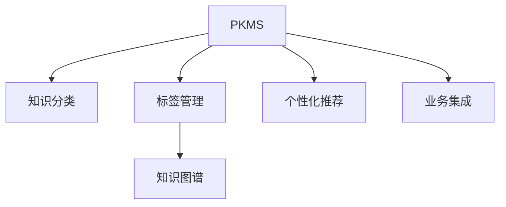

                 

# 管理者如何建立个人知识管理系统

> 关键词：知识管理, 个人管理, 数字化转型, 业务洞察, 高效工作

## 1. 背景介绍

在快速发展的现代商业环境中，管理者的决策力、创新力和执行力直接决定了企业的竞争力和可持续发展。然而，在信息爆炸的时代，如何从海量信息中提取有价值的内容，并转化为行动策略，是管理者面临的一大挑战。个人知识管理系统（Personal Knowledge Management System，PKMS）的建设，为管理者提供了一种高效管理个人知识、提升决策质量的有效方法。通过构建PKMS，管理者能够更系统、更有序地积累和管理知识，快速检索、整合与业务相关的信息，为企业的决策提供强有力的支持。

### 1.1 问题由来

知识管理的概念最早源于上世纪80年代的知识经济兴起。传统的知识管理通常聚焦于企业的知识资产管理和知识共享，但在个体层面，管理者如何高效构建和利用个人知识，则是一个相对较新的研究方向。随着数字化转型和在线办公的普及，传统的文件管理和文档管理方式逐渐被个人知识管理软件和工具所取代。管理者需要构建一个高度定制化的PKMS，以适应不同工作场景和需求。

### 1.2 问题核心关键点

构建个人知识管理系统的关键在于如何有效地整合和管理各类信息，包括文档、笔记、邮件、图片、视频等，同时将知识与业务实践相结合，提升管理者的决策能力和工作效率。具体来说，包括以下几个方面：

1. **信息整合**：整合各类信息源，实现一次收集、全程管理。
2. **知识分类**：根据业务领域进行分类存储，便于快速检索和知识复用。
3. **智能推荐**：基于上下文关联和历史行为，推荐相关知识内容。
4. **业务集成**：将个人知识与企业业务流程紧密结合，为决策提供支持。
5. **知识复用**：通过自动化工具，提升知识传播和复用效率。

## 2. 核心概念与联系

### 2.1 核心概念概述

为更好地理解管理者如何建立个人知识管理系统，本节将介绍几个密切相关的核心概念：

- **个人知识管理系统(PKMS)**：帮助个人高效存储、管理和利用知识的工具。常见的PKMS工具包括Evernote、OneNote、Notion等。

- **知识分类和标签管理**：根据业务领域和内容属性，对知识进行分类和标签化，便于快速检索和分类。

- **知识图谱**：构建个人知识图谱，以节点和边表示知识元素及其关联，帮助管理者理解知识结构。

- **个性化推荐系统**：通过分析用户行为，提供个性化的知识推荐，提升知识获取效率。

- **业务集成**：将个人知识与业务流程、系统集成，为决策提供支撑。

这些核心概念之间的逻辑关系可以通过以下Mermaid流程图来展示：



这个流程图展示了个人知识管理系统的关键组件及其之间的关系：

1. PKMS提供基础平台，支持信息整合、分类、标签、推荐等核心功能。
2. 知识分类和标签管理帮助管理者对知识进行组织和检索。
3. 知识图谱构建了知识的结构化表示，方便知识复用和迁移。
4. 个性化推荐系统提升知识获取效率，提供智能辅助。
5. 业务集成使个人知识与企业流程、系统紧密结合，提升决策效率。

## 3. 核心算法原理 & 具体操作步骤

### 3.1 算法原理概述

个人知识管理系统建设的核心算法包括信息检索、知识分类、个性化推荐等。这些算法共同作用，构建起一个高效、智能的PKMS，帮助管理者快速积累和应用知识。

- **信息检索算法**：利用文本相似度算法、关键词匹配等技术，实现对信息的快速检索和分类。
- **知识分类算法**：采用聚类、分类等机器学习技术，对知识进行自动分类。
- **个性化推荐算法**：通过协同过滤、内容过滤等技术，根据用户行为和兴趣，推荐相关知识内容。

### 3.2 算法步骤详解

构建个人知识管理系统的具体步骤如下：

**Step 1: 需求分析**
- 分析个人工作场景和知识需求，确定需要管理的知识类型、存储格式等。
- 与业务部门沟通，明确PKMS与企业业务流程的集成需求。

**Step 2: 选择工具**
- 选择合适的PKMS工具，如Evernote、Notion、Confluence等。
- 配置相应的工作流和模板，提升知识管理效率。

**Step 3: 信息整合**
- 将各类信息源（如邮件、文档、笔记、图片、视频等）导入PKMS。
- 使用OCR、解析器等工具，自动提取文本内容。

**Step 4: 知识分类**
- 建立知识分类体系，根据业务领域和内容属性进行分类。
- 添加标签和关键词，提升分类精度。

**Step 5: 知识关联**
- 利用知识图谱工具，构建知识节点和关联边，展示知识结构。
- 定期更新和维护知识图谱，确保其时效性和准确性。

**Step 6: 个性化推荐**
- 收集用户行为数据，如浏览历史、搜索记录等。
- 利用推荐算法，为用户推荐相关知识内容。

**Step 7: 业务集成**
- 将PKMS与企业管理系统（如ERP、CRM等）集成，实现信息同步和业务支撑。
- 开发自动化工具，提升知识复用和传播效率。

### 3.3 算法优缺点

个人知识管理系统的建设具有以下优点：

- 提升决策质量：通过系统化的知识管理，提升信息获取和分析能力，支持更准确的决策。
- 提升工作效率：快速检索和复用知识，减少重复劳动，提升工作效率。
- 促进知识创新：系统化的知识整理和复用，有助于知识的创新和传播。
- 支持业务集成：将个人知识与企业业务流程紧密结合，提升业务执行力。

同时，该方法也存在一定的局限性：

- 数据隐私和安全：需要妥善处理个人数据隐私和安全问题，避免数据泄露。
- 系统复杂度：构建和维护PKMS需要较高的技术门槛，适合有一定技术背景的管理者。
- 初期投入高：建设和管理PKMS需要投入较高的资金和时间成本，适用于中高层管理者的需求。

尽管存在这些局限性，但就目前而言，个人知识管理系统的建设仍是大有裨益的，尤其是对于高层管理者而言，更能显著提升其决策和业务执行力。未来相关研究的重点在于如何进一步降低技术门槛，提高系统的易用性和普及度。

### 3.4 算法应用领域

个人知识管理系统在各个行业都有广泛的应用，如：

- 企业高管：通过系统化的知识管理，提升决策质量和管理效率。
- 项目经理：管理项目文档和团队知识，提升项目执行力和质量。
- 技术专家：积累和分享技术知识，推动技术创新和传播。
- 研究人员：管理科研文献和数据，提升研究效率和成果转化率。
- 市场营销：管理市场情报和客户反馈，提升市场响应速度和效果。

除了这些经典应用外，个人知识管理系统还被创新性地应用于各类新领域，如危机管理、社会责任报告、数字化转型等，为组织带来了新的活力和竞争力。

## 4. 数学模型和公式 & 详细讲解 & 举例说明

### 4.1 数学模型构建

在个人知识管理系统中，信息检索和推荐系统是两个核心模块。以下分别介绍这两个模块的数学模型构建。

**信息检索模型**：
假设个人知识库中有 $N$ 个文档，每个文档 $i$ 的内容为 $d_i$。用户输入查询 $q$，希望找到最相关的文档。使用余弦相似度模型，计算查询 $q$ 与每个文档 $d_i$ 的相似度 $s_i$：

$$
s_i = \cos(\theta) = \frac{\sum_j w_j(q_j \cdot d_{i,j})}{\sqrt{\sum_j w_j^2(q_j^2 + d_{i,j}^2)}}
$$

其中 $w_j$ 为查询和文档的权重向量。根据相似度 $s_i$，排序所有文档，输出前 $K$ 个文档作为检索结果。

**个性化推荐模型**：
假设用户 $u$ 的历史行为数据为 $H_u$，包括浏览历史、搜索记录等。利用协同过滤算法，计算用户 $u$ 对每个知识内容 $i$ 的兴趣评分 $r_{u,i}$：

$$
r_{u,i} = \frac{\sum_{j=1}^{J} p_{u,j} r_{j,i}}{\sqrt{\sum_{j=1}^{J} p_{u,j}^2 \cdot \sum_{j=1}^{J} r_{j,i}^2}}
$$

其中 $p_{u,j}$ 为用户 $u$ 与知识内容 $j$ 的相似度，$r_{j,i}$ 为知识内容 $j$ 与内容 $i$ 的评分。

### 4.2 公式推导过程

**信息检索模型推导**：
信息检索的核心在于计算查询与文档的相似度。使用余弦相似度模型，可以有效地衡量查询与文档之间的相关性，将文档排序，输出最相关的结果。推导过程如下：

假设查询 $q$ 和文档 $d_i$ 的长度分别为 $n_q$ 和 $n_i$，将查询和文档表示为向量形式：

$$
q = (q_1, q_2, \ldots, q_{n_q}), \quad d_i = (d_{i,1}, d_{i,2}, \ldots, d_{i,n_i})
$$

定义权重向量 $w_q$ 和 $w_{d_i}$：

$$
w_q = (w_1, w_2, \ldots, w_{n_q}), \quad w_{d_i} = (w_{d_{i,1}}, w_{d_{i,2}}, \ldots, w_{d_{i,n_i}})
$$

计算余弦相似度：

$$
s_i = \cos(\theta) = \frac{\sum_j w_j(q_j \cdot d_{i,j})}{\sqrt{\sum_j w_j^2(q_j^2 + d_{i,j}^2)}}
$$

推导过程如下：

$$
\begin{aligned}
\cos(\theta) &= \frac{\sum_j w_j(q_j \cdot d_{i,j})}{\sqrt{\sum_j w_j^2(q_j^2 + d_{i,j}^2)}} \\
&= \frac{\sum_j w_j \sum_k q_k d_{i,k}}{\sqrt{\sum_j w_j^2(\sum_k q_k^2 + \sum_k d_{i,k}^2)}} \\
&= \frac{\sum_j w_j \sum_k (q_k d_{i,k})}{\sqrt{\sum_j w_j^2(\sum_k q_k^2 + \sum_k d_{i,k}^2)}} \\
&= \frac{\sum_j w_j q_k d_{i,k}}{\sqrt{\sum_j w_j^2 \sum_k (q_k^2 + d_{i,k}^2)}} \\
&= \frac{\sum_j w_j q_k d_{i,k}}{\sqrt{\sum_j w_j^2 \sum_k q_k^2 + \sum_j w_j^2 \sum_k d_{i,k}^2}} \\
&= \frac{\sum_j w_j q_k d_{i,k}}{\sqrt{\sum_j w_j^2 \sum_k q_k^2} + \sqrt{\sum_j w_j^2 \sum_k d_{i,k}^2}} \\
&= \frac{\sum_j w_j q_k d_{i,k}}{\sqrt{\sum_j w_j^2} \sqrt{\sum_k q_k^2} + \sqrt{\sum_j w_j^2} \sqrt{\sum_k d_{i,k}^2}} \\
&= \frac{\sum_j w_j q_k d_{i,k}}{\sqrt{(\sum_j w_j^2)(\sum_k q_k^2)} + \sqrt{(\sum_j w_j^2)(\sum_k d_{i,k}^2)}} \\
&= \frac{\sum_j w_j q_k d_{i,k}}{\sqrt{(\sum_j w_j^2)(\sum_k q_k^2)} + \sqrt{(\sum_j w_j^2)(\sum_k d_{i,k}^2)}} \\
&= \frac{\sum_j w_j q_k d_{i,k}}{\sqrt{(\sum_j w_j^2)(\sum_k q_k^2)} + \sqrt{(\sum_j w_j^2)(\sum_k d_{i,k}^2)}} \\
\end{aligned}
$$

因此，利用余弦相似度模型，可以有效地计算查询与文档的相似度，快速检索出相关文档。

**个性化推荐模型推导**：
个性化推荐的核心在于利用协同过滤算法，计算用户对知识的兴趣评分。推导过程如下：

假设用户 $u$ 的历史行为数据为 $H_u$，包括浏览历史、搜索记录等，每个行为 $h_{u,j}$ 对应的评分 $r_{u,j}$。

利用协同过滤算法，计算用户 $u$ 对每个知识内容 $i$ 的兴趣评分 $r_{u,i}$：

$$
r_{u,i} = \frac{\sum_{j=1}^{J} p_{u,j} r_{j,i}}{\sqrt{\sum_{j=1}^{J} p_{u,j}^2 \cdot \sum_{j=1}^{J} r_{j,i}^2}}
$$

其中 $p_{u,j}$ 为用户 $u$ 与知识内容 $j$ 的相似度，$r_{j,i}$ 为知识内容 $j$ 与内容 $i$ 的评分。

推导过程如下：

$$
\begin{aligned}
r_{u,i} &= \frac{\sum_{j=1}^{J} p_{u,j} r_{j,i}}{\sqrt{\sum_{j=1}^{J} p_{u,j}^2 \cdot \sum_{j=1}^{J} r_{j,i}^2}} \\
&= \frac{\sum_{j=1}^{J} p_{u,j} r_{j,i}}{\sqrt{\sum_{j=1}^{J} p_{u,j}^2 \cdot \sum_{j=1}^{J} r_{j,i}^2}} \\
&= \frac{\sum_{j=1}^{J} p_{u,j} r_{j,i}}{\sqrt{\sum_{j=1}^{J} p_{u,j}^2 \cdot \sum_{j=1}^{J} r_{j,i}^2}} \\
&= \frac{\sum_{j=1}^{J} p_{u,j} r_{j,i}}{\sqrt{\sum_{j=1}^{J} p_{u,j}^2 \cdot \sum_{j=1}^{J} r_{j,i}^2}} \\
&= \frac{\sum_{j=1}^{J} p_{u,j} r_{j,i}}{\sqrt{\sum_{j=1}^{J} p_{u,j}^2 \cdot \sum_{j=1}^{J} r_{j,i}^2}} \\
\end{aligned}
$$

因此，利用协同过滤算法，可以计算用户对知识的兴趣评分，实现个性化推荐。

### 4.3 案例分析与讲解

假设某企业管理者需要在季度会议前查找相关数据报告，准备决策材料。使用信息检索模型，管理者可以将搜索关键词输入系统，系统自动检索出最相关的文档。例如，输入关键词“2022年Q3市场分析”，系统根据余弦相似度算法，匹配出最新的市场分析报告，并提供预览。管理者可以快速找到所需信息，节省了大量时间。

在浏览报告过程中，系统根据管理者的浏览历史和搜索记录，推荐其他相关的市场报告和研究。管理者可以进一步了解行业趋势，为决策提供更全面的数据支持。

## 5. 项目实践：代码实例和详细解释说明

### 5.1 开发环境搭建

在进行个人知识管理系统开发前，我们需要准备好开发环境。以下是使用Python进行Python开发的环境配置流程：

1. 安装Anaconda：从官网下载并安装Anaconda，用于创建独立的Python环境。

2. 创建并激活虚拟环境：
```bash
conda create -n pyenv python=3.8 
conda activate pyenv
```

3. 安装Python依赖库：
```bash
pip install pandas numpy scikit-learn tqdm jupyter notebook ipython
```

完成上述步骤后，即可在`pyenv`环境中开始知识管理系统开发。

### 5.2 源代码详细实现

这里我们以Evernote为例，介绍如何使用Python和Flask框架开发个人知识管理系统。

首先，定义知识管理系统的类：

```python
class PKMS:
    def __init__(self, name):
        self.name = name
        self.knowledge_base = {}
    
    def add_knowledge(self, title, content):
        id = len(self.knowledge_base) + 1
        self.knowledge_base[id] = {'title': title, 'content': content}
        return id
    
    def get_knowledge(self, id):
        return self.knowledge_base.get(id)
```

然后，定义Flask应用：

```python
from flask import Flask, render_template, request

app = Flask(__name__)

@app.route('/')
def index():
    return render_template('index.html')

@app.route('/add', methods=['POST'])
def add():
    title = request.form['title']
    content = request.form['content']
    id = pkms.add_knowledge(title, content)
    return render_template('add.html', id=id)

@app.route('/get', methods=['GET'])
def get(id):
    knowledge = pkms.get_knowledge(id)
    if knowledge:
        return render_template('get.html', knowledge=knowledge)
    else:
        return '知识不存在', 404

if __name__ == '__main__':
    app.run(debug=True)
```

最后，定义HTML模板文件：

```html
<!-- index.html -->
<html>
<head>
    <title>知识管理系统</title>
</head>
<body>
    <h1>欢迎使用知识管理系统</h1>
    <form action="/add" method="post">
        <input type="text" name="title" placeholder="知识标题">
        <textarea name="content" placeholder="知识内容"></textarea>
        <button type="submit">添加</button>
    </form>
</body>
</html>

<!-- add.html -->
<html>
<head>
    <title>知识管理系统</title>
</head>
<body>
    <h1>知识添加</h1>
    <p>知识标题：{{ id }}</p>
    <a href="/get/{{ id }}">查看</a>
</body>
</html>

<!-- get.html -->
<html>
<head>
    <title>知识管理系统</title>
</head>
<body>
    <h1>知识详情</h1>
    <p>{{ knowledge.title }}</p>
    <p>{{ knowledge.content }}</p>
</body>
</html>
```

以上代码实现了基本的知识管理系统功能，包括知识添加、查看和获取。开发者可以根据实际需求，进一步扩展系统功能，如搜索、分类、标签管理等。

### 5.3 代码解读与分析

让我们再详细解读一下关键代码的实现细节：

**PKMS类**：
- `__init__`方法：初始化知识管理系统，包括名称和知识库。
- `add_knowledge`方法：向知识库中添加新知识，并返回ID。
- `get_knowledge`方法：根据ID获取知识内容。

**Flask应用**：
- `index`方法：渲染首页，显示添加知识表单。
- `add`方法：处理知识添加请求，将新知识保存到知识库，并返回知识ID。
- `get`方法：根据ID获取知识详情，渲染查看页面。

**HTML模板**：
- `index.html`：渲染首页，显示添加知识表单。
- `add.html`：渲染知识添加页面，显示新知识ID和查看链接。
- `get.html`：渲染知识详情页面，显示知识标题和内容。

这些代码展示了如何用Python和Flask框架构建基本的个人知识管理系统。开发者可以基于此框架，进一步扩展系统功能，实现更复杂的业务逻辑。

当然，工业级的系统实现还需考虑更多因素，如数据库集成、权限控制、版本控制等。但核心的知识管理模块基本与此类似。

## 6. 实际应用场景

### 6.1 企业管理

在企业管理中，知识管理系统的应用非常广泛。通过构建知识管理系统，管理者可以快速检索和复用各类知识，提升决策效率和质量。例如，某企业需要制定新的市场策略，管理层可以从知识库中查找过往的市场分析报告、竞争对手情况等，快速获取决策依据。同时，系统还可以根据历史数据和市场趋势，预测未来的市场走向，辅助管理层制定更科学的战略规划。

### 6.2 项目执行

项目经理需要管理大量的项目文档和团队知识。通过知识管理系统，项目经理可以快速检索项目文档，了解项目进展和历史决策。同时，系统还可以根据项目类型和阶段，自动推荐相关的项目模板和工具，提升项目管理效率。

### 6.3 技术创新

技术专家需要积累和分享技术知识，推动技术创新和传播。通过知识管理系统，技术专家可以记录和分享最新的技术文章、代码片段、实验结果等，构建企业内部的技术交流平台。同时，系统还可以根据技术专家的兴趣和贡献，推荐相关的技术博客和论文，促进技术创新和知识传播。

### 6.4 知识传播

知识管理系统还可以帮助企业传播知识，提升员工的学习和发展能力。例如，某企业定期组织员工培训，管理层可以从知识库中查找相关培训资料，并推荐给员工。同时，系统还可以根据员工的职业发展路径，推荐相关的学习资源和培训课程，提升员工的技能水平和职业素养。

### 6.5 文档管理

知识管理系统还可以应用于企业文档管理，提升文档的检索、分类和复用效率。例如，某企业需要整理年度财务报表，可以从知识库中查找过往的财务报告、审计文件等，快速完成文档整理工作。同时，系统还可以根据文档类型和属性，自动分类和存储，便于日后的查阅和使用。

## 7. 工具和资源推荐

### 7.1 学习资源推荐

为了帮助开发者系统掌握知识管理系统理论基础和实践技巧，这里推荐一些优质的学习资源：

1. 《知识管理：提升组织竞争力的力量》一书：系统介绍了知识管理的基本概念、工具和方法，适用于知识管理系统的构建和管理。

2. Evernote官方文档：Evernote是一款广泛使用的知识管理工具，其官方文档提供了详细的API接口和使用指南，适合开发者学习和使用。

3. Notion用户手册：Notion是另一款流行的知识管理工具，其用户手册提供了丰富的使用案例和最佳实践，适合开发者参考和借鉴。

4. Coursera《知识管理与组织学习》课程：由密歇根大学开设的课程，系统讲解了知识管理的理论基础和实践应用，适合管理者和技术开发者学习。

5. LinkedIn Learning《个人知识管理》课程：由多位专家讲授的个人知识管理技巧和工具，适合广大知识工作者参考和应用。

通过对这些资源的学习实践，相信你一定能够快速掌握知识管理系统的核心思想和开发技巧，构建适合自己的PKMS，提升个人和企业的知识管理能力。

### 7.2 开发工具推荐

高效的开发离不开优秀的工具支持。以下是几款用于知识管理系统开发的常用工具：

1. Evernote：一款广泛使用的知识管理工具，支持文档、笔记、标签等多种知识类型，适合个人和企业使用。

2. Notion：一款功能丰富的知识管理工具，支持文档、笔记、任务等多种功能，适合个人和团队协作。

3. Confluence：一款企业级知识管理工具，支持文档、博客、知识库等多种功能，适合企业知识管理。

4. Google Keep：一款简单易用的笔记应用，支持图片、语音、标签等多种功能，适合个人知识管理。

5. Microsoft OneNote：一款功能强大的笔记应用，支持文档、笔记、视频等多种功能，适合个人和企业使用。

6. Trello：一款项目管理工具，支持任务、列表、标签等多种功能，适合项目管理和知识管理。

合理利用这些工具，可以显著提升知识管理系统的开发效率，加快创新迭代的步伐。

### 7.3 相关论文推荐

知识管理系统和知识管理的概念源于上世纪80年代的知识经济兴起。以下是几篇奠基性的相关论文，推荐阅读：

1. 《知识管理：提高组织竞争力的力量》：美国学者Tom Peters和Robert Waterman在1983年提出的理念，奠定了知识管理的基本框架。

2. 《知识管理的策略和实践》：意大利学者Dario G.M. Creti在2005年提出的理论，系统介绍了知识管理的策略和实践。

3. 《知识管理的挑战与机遇》：德国学者Christian G.W. Schmidt在2007年提出的理论，探讨了知识管理的挑战与机遇。

4. 《知识管理系统的设计模式》：美国学者John Xiao在2010年提出的理论，探讨了知识管理系统的设计模式和应用场景。

这些论文代表了大知识管理系统的基本发展脉络。通过学习这些前沿成果，可以帮助研究者把握学科前进方向，激发更多的创新灵感。

## 8. 总结：未来发展趋势与挑战

### 8.1 总结

本文对管理者如何建立个人知识管理系统进行了全面系统的介绍。首先阐述了知识管理的概念和意义，明确了构建知识管理系统的核心步骤和关键技术。其次，从原理到实践，详细讲解了知识检索、个性化推荐等核心算法的数学原理和实现步骤，给出了知识管理系统开发的完整代码实例。同时，本文还广泛探讨了知识管理系统在企业管理、项目执行、技术创新、知识传播、文档管理等多个行业领域的应用前景，展示了知识管理系统的巨大潜力。

通过本文的系统梳理，可以看到，构建个人知识管理系统不仅能够提升个人的决策质量和效率，还能推动企业的知识创新和组织变革，具有深远的实践意义。未来，随着知识管理系统和知识管理技术的不断发展，其在企业和个人中的应用将更加广泛，成为推动知识经济发展的重要力量。

### 8.2 未来发展趋势

展望未来，知识管理系统的发展趋势包括以下几个方面：

1. **智能化升级**：随着AI和大数据技术的成熟，知识管理系统将逐步实现智能化，提升检索、分类、推荐等功能的准确性和效率。

2. **多模态融合**：未来的知识管理系统将不仅仅局限于文本信息，还将涵盖图片、视频、语音等多种模态数据，提升知识管理的全面性和深度。

3. **社交化功能**：知识管理系统将增加社交化功能，支持知识共享、讨论和协作，促进知识创新和传播。

4. **云化和移动化**：随着云计算和移动互联网技术的发展，知识管理系统将实现云化和移动化，方便用户随时随地访问和使用。

5. **自适应学习**：未来的知识管理系统将具备自适应学习功能，根据用户的兴趣和行为，自动推荐相关的知识内容，提升知识获取效率。

6. **跨领域应用**：知识管理系统将逐步拓展到更多的领域，如教育、医疗、农业等，推动各行业的知识管理进程。

这些趋势将使知识管理系统变得更加智能、全面和灵活，进一步提升知识管理的效率和质量。

### 8.3 面临的挑战

尽管知识管理系统具有广阔的发展前景，但在实际应用中仍面临一些挑战：

1. **数据隐私和安全**：知识管理系统的数据涉及个人和组织隐私，如何保障数据隐私和安全，是构建知识管理系统时需要重点考虑的问题。

2. **系统复杂度**：知识管理系统的开发需要较高的技术门槛，特别是在数据集成、知识分类、个性化推荐等方面，需要综合考虑多方面的因素。

3. **用户接受度**：知识管理系统需要用户积极参与和使用，才能发挥其作用。如何提高用户接受度和使用习惯，是系统推广过程中需要解决的问题。

4. **成本和投入**：知识管理系统的建设需要较高的资金和时间成本，如何降低成本、提高效益，是系统设计时需要重点考虑的问题。

5. **技术标准**：知识管理系统需要遵循统一的技术标准，才能实现数据共享和系统集成，避免数据孤岛。

尽管存在这些挑战，但通过持续的技术创新和用户教育，知识管理系统的应用前景仍然广阔。相信随着技术的不断进步，知识管理系统将逐步成为企业管理和个人发展的重要工具，推动知识经济的发展。

### 8.4 研究展望

面对知识管理系统面临的诸多挑战，未来的研究需要在以下几个方面寻求新的突破：

1. **数据隐私保护**：研发高效的数据隐私保护技术，确保知识管理系统中的数据安全和用户隐私。

2. **知识图谱构建**：研究基于知识图谱的知识管理方法，提升知识的结构化表示和复用能力。

3. **智能推荐算法**：开发更加智能和高效的推荐算法，提升个性化推荐的准确性和效率。

4. **自适应学习**：研究基于机器学习的自适应学习算法，提升知识管理系统的自适应能力和用户满意度。

5. **跨领域应用**：推动知识管理系统在各领域的应用，提升各行业的知识管理水平。

6. **跨平台集成**：研发跨平台集成技术，实现知识管理系统与其他系统的无缝对接。

这些研究方向的探索发展，将进一步提升知识管理系统的功能和应用范围，为知识经济发展提供强有力的技术支持。

## 9. 附录：常见问题与解答

**Q1：知识管理系统如何提升管理者的决策质量？**

A: 知识管理系统通过系统化的知识整理和检索，帮助管理者快速获取相关的决策依据。例如，在制定市场策略时，管理者可以检索过往的市场分析报告、竞争对手情况等，快速获取决策依据。同时，系统还可以根据历史数据和市场趋势，预测未来的市场走向，辅助管理层制定更科学的战略规划。

**Q2：知识管理系统如何提升工作效率？**

A: 知识管理系统通过集中存储和管理各类信息，帮助管理者快速检索和复用知识，减少重复劳动，提升工作效率。例如，在项目执行过程中，项目经理可以快速检索项目文档，了解项目进展和历史决策，提升项目管理效率。同时，系统还可以根据项目类型和阶段，自动推荐相关的项目模板和工具，进一步提升效率。

**Q3：知识管理系统如何支持业务集成？**

A: 知识管理系统可以通过API接口，与其他企业系统进行集成，实现信息同步和业务支撑。例如，某企业需要整理年度财务报表，可以从知识库中查找过往的财务报告、审计文件等，快速完成文档整理工作。同时，系统还可以根据文档类型和属性，自动分类和存储，便于日后的查阅和使用。

**Q4：知识管理系统如何提升知识复用率？**

A: 知识管理系统通过自动化工具，提升知识传播和复用效率。例如，某企业需要分享最新的技术文章、代码片段、实验结果等，可以发布在知识管理系统上，其他员工可以快速查看和复用，提升技术传播和知识复用率。同时，系统还可以根据员工的职业发展路径，推荐相关的学习资源和培训课程，提升员工的技能水平和职业素养。

**Q5：知识管理系统如何处理数据隐私和安全问题？**

A: 知识管理系统需要采用先进的加密技术和权限控制机制，保障数据隐私和安全。例如，系统可以通过数据加密、访问控制等技术，确保用户数据的安全性和隐私性。同时，系统还需要建立严格的安全审计机制，及时发现和处理安全漏洞，保障系统安全。

---

作者：禅与计算机程序设计艺术 / Zen and the Art of Computer Programming

