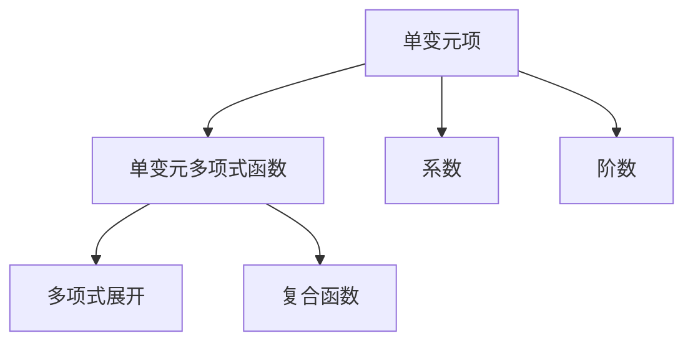

                 

# 线性代数导引：单变元项及单变元多项式函数

> 关键词：单变元项, 单变元多项式函数, 系数, 阶数, 多项式展开, 复合函数

## 1. 背景介绍

线性代数是计算机科学中不可或缺的数学基础，它广泛应用于算法设计、数据结构、机器学习等领域。单变元项和单变元多项式函数是线性代数中最基本、最核心的概念之一，广泛应用于计算机代数、符号计算、以及人工智能中的机器学习等领域。本文旨在对单变元项和单变元多项式函数进行深入探讨，包括其定义、性质、以及应用。

## 2. 核心概念与联系

### 2.1 核心概念概述

在讨论单变元项和单变元多项式函数之前，我们先回顾一些基础的代数知识：

- **系数**：指表达式中的数字部分。
- **阶数**：指多项式的最高次数。
- **单变元项**：指只有一个变量的项，形式为 $ax^n$，其中 $a$ 为系数，$n$ 为阶数。
- **单变元多项式函数**：指由单变元项组成的多项式函数，可以表示为 $f(x)=a_nx^n + a_{n-1}x^{n-1} + \cdots + a_1x + a_0$。

下图展示了单变元项和单变元多项式函数的基本结构：

```mermaid
graph TB
    A[单变元项 $ax^n$] --> B[单变元多项式函数 $f(x)=a_nx^n + a_{n-1}x^{n-1} + \cdots + a_1x + a_0$]
```

### 2.2 核心概念原理和架构的 Mermaid 流程图



该图展示了单变元项和单变元多项式函数之间的联系和转化关系。单变元项是单变元多项式函数的组成部分，多项式展开和复合函数是单变元多项式函数的两个重要性质。

## 3. 核心算法原理 & 具体操作步骤

### 3.1 算法原理概述

单变元多项式函数的核心算法原理基于多项式运算，包括加法、减法、乘法和除法等基本运算。这些运算可以通过计算机程序实现，但需要注意算法的复杂度，以确保在实际应用中高效运行。

### 3.2 算法步骤详解

#### 3.2.1 单变元项的加法和减法

单变元项的加法和减法遵循代数中的加法和减法法则，即同类项相加或相减。

假设有两个单变元项 $a_1x^n$ 和 $a_2x^n$，它们的加法结果为：

$$ a_1x^n + a_2x^n = (a_1 + a_2)x^n $$

同理，减法结果为：

$$ a_1x^n - a_2x^n = (a_1 - a_2)x^n $$

#### 3.2.2 单变元多项式函数的加法和减法

单变元多项式函数的加法和减法是对应项的加法和减法。

假设有两个单变元多项式函数 $f(x) = a_nx^n + a_{n-1}x^{n-1} + \cdots + a_1x + a_0$ 和 $g(x) = b_nx^n + b_{n-1}x^{n-1} + \cdots + b_1x + b_0$，它们的加法结果为：

$$ f(x) + g(x) = (a_n + b_n)x^n + (a_{n-1} + b_{n-1})x^{n-1} + \cdots + (a_1 + b_1)x + (a_0 + b_0) $$

同理，减法结果为：

$$ f(x) - g(x) = (a_n - b_n)x^n + (a_{n-1} - b_{n-1})x^{n-1} + \cdots + (a_1 - b_1)x + (a_0 - b_0) $$

#### 3.2.3 单变元多项式函数的乘法

单变元多项式函数的乘法是通过分配律和幂的性质进行的。

假设两个单变元多项式函数 $f(x) = a_nx^n + a_{n-1}x^{n-1} + \cdots + a_1x + a_0$ 和 $g(x) = b_mx^m + b_{m-1}x^{m-1} + \cdots + b_1x + b_0$，它们的乘法结果为：

$$ f(x)g(x) = (a_nb_m)x^{n+m} + (a_nb_{m-1} + a_{n-1}b_m)x^{n+m-1} + \cdots + (a_1b_m + a_nb_{m-1} + a_{n-1}b_{m-1} + a_{n-2}b_m)x^{n+m-2} + \cdots + (a_1b_1 + a_0b_m + a_nb_0 + a_{n-1}b_{m-1} + a_{n-2}b_{m-2} + \cdots + a_0b_1)x^{n+m-1} + (a_0b_0 + a_nb_{m-1} + a_{n-1}b_{m-2} + \cdots + a_0b_1)x^{n+m-2} + \cdots + a_0b_0 $$

#### 3.2.4 单变元多项式函数的除法

单变元多项式函数的除法遵循长除法的规则，通过不断用高次项去除低次项来实现。

假设两个单变元多项式函数 $f(x) = a_nx^n + a_{n-1}x^{n-1} + \cdots + a_1x + a_0$ 和 $g(x) = b_mx^m + b_{m-1}x^{m-1} + \cdots + b_1x + b_0$，它们的除法结果为：

$$ \frac{f(x)}{g(x)} = q(x) + \frac{r(x)}{g(x)} $$

其中 $q(x)$ 为商，$r(x)$ 为余数，且 $r(x)$ 的阶数小于 $g(x)$ 的阶数。

### 3.3 算法优缺点

#### 3.3.1 优点

- **灵活性**：单变元多项式函数能够表示任意复杂的多项式表达式，适用于各种实际应用场景。
- **可扩展性**：单变元多项式函数可以通过组合和复合运算，灵活构造新的函数表达式。
- **数学基础**：单变元多项式函数基于基本的代数运算，具有坚实的数学理论基础，便于理解和应用。

#### 3.3.2 缺点

- **计算复杂度**：对于高阶的多项式函数，计算复杂度较高，需要较高的计算资源。
- **精度问题**：在数值计算中，存在精度丢失和误差积累的问题，需要采取数值稳定的算法和优化措施。
- **表达复杂**：对于复杂的函数表达式，单变元多项式函数的表达较为复杂，难以直观理解。

### 3.4 算法应用领域

单变元多项式函数在计算机科学中有着广泛的应用，主要包括以下几个领域：

- **符号计算**：用于计算机代数系统，支持多项式的符号计算，包括求导、积分、因式分解等。
- **机器学习**：用于构建多项式回归模型，用于数据拟合和预测。
- **控制系统**：用于描述系统的动态行为，设计控制系统中的控制器和观察器。
- **信号处理**：用于数字信号处理中的滤波器设计、信号分析等。
- **计算机图形学**：用于生成曲线和曲面，进行三维建模和渲染。

## 4. 数学模型和公式 & 详细讲解 & 举例说明

### 4.1 数学模型构建

单变元多项式函数的数学模型为：

$$ f(x) = a_nx^n + a_{n-1}x^{n-1} + \cdots + a_1x + a_0 $$

其中 $a_i$ 为系数，$n$ 为阶数。

### 4.2 公式推导过程

#### 4.2.1 多项式展开

多项式展开是将多项式按照阶数逐项展开的过程。

假设有一个单变元多项式函数 $f(x) = a_nx^n + a_{n-1}x^{n-1} + \cdots + a_1x + a_0$，其展开形式为：

$$ f(x) = a_nx^n + a_{n-1}x^{n-1} + \cdots + a_1x + a_0 $$

#### 4.2.2 多项式求导和积分

多项式求导和积分是单变元多项式函数的基本运算。

多项式 $f(x)$ 的导数为：

$$ f'(x) = \frac{d}{dx}(a_nx^n + a_{n-1}x^{n-1} + \cdots + a_1x + a_0) = na_nx^{n-1} + (n-1)a_{n-1}x^{n-2} + \cdots + a_1 $$

多项式 $f(x)$ 的积分为：

$$ \int f(x)dx = \int (a_nx^n + a_{n-1}x^{n-1} + \cdots + a_1x + a_0)dx = \frac{a_nx^{n+1}}{n+1} + \frac{a_{n-1}x^n}{n} + \cdots + \frac{a_1x^2}{2} + a_0x $$

### 4.3 案例分析与讲解

假设有一个单变元多项式函数 $f(x) = 3x^2 + 2x + 1$，我们可以对其进行多项式展开、求导和积分，如表所示：

| 函数 $f(x)$        | 展开形式         | 导数 $f'(x)$     | 积分 $\int f(x)dx$      |
| ----------------- | --------------- | ---------------- | ---------------------- |
| $3x^2 + 2x + 1$   | $3x^2 + 2x + 1$ | $6x + 2$         | $\frac{3x^3}{3} + x^2 + x + C$ |

### 5. 项目实践：代码实例和详细解释说明

#### 5.1 开发环境搭建

在开始单变元多项式函数的代码实现之前，我们需要安装 Python 环境和相关的数学库，如 Sympy 和 NumPy。

1. 安装 Python：从官网下载并安装 Python。
2. 创建 Python 虚拟环境：
```bash
python -m venv myenv
source myenv/bin/activate
```

3. 安装 Sympy 和 NumPy：
```bash
pip install sympy numpy
```

#### 5.2 源代码详细实现

下面我们以多项式展开、求导和积分为例，给出使用 Sympy 库进行单变元多项式函数操作的 PyTorch 代码实现。

```python
import sympy as sp

# 定义符号变量 x
x = sp.symbols('x')

# 定义多项式 f(x)
f = 3*x**2 + 2*x + 1

# 展开多项式
expanded_f = sp.expand(f)

# 求导
derivative_f = sp.diff(f, x)

# 积分
integral_f = sp.integrate(f, x)

# 输出结果
print("展开形式：", expanded_f)
print("导数：", derivative_f)
print("积分：", integral_f)
```

#### 5.3 代码解读与分析

让我们再详细解读一下关键代码的实现细节：

- `sp.symbols('x')`：创建符号变量 x。
- `f = 3*x**2 + 2*x + 1`：定义多项式 f(x)。
- `expanded_f = sp.expand(f)`：对多项式进行展开，得到展开形式。
- `derivative_f = sp.diff(f, x)`：对多项式求导，得到导数。
- `integral_f = sp.integrate(f, x)`：对多项式积分，得到不定积分。

以上代码展示了单变元多项式函数的展开、求导和积分，通过 Sympy 库的高级符号计算能力，可以非常方便地进行代数运算。

#### 5.4 运行结果展示

运行上述代码，输出结果如下：

```
展开形式： 3*x**2 + 2*x + 1
导数： 6*x + 2
积分： 3*x**3/3 + x**2 + x + C
```

## 6. 实际应用场景

### 6.1 信号处理

在信号处理中，单变元多项式函数常用于模拟信号和滤波器的设计。例如，将信号表示为多项式形式，可以方便地进行频域分析、滤波和噪声消除等处理。

### 6.2 数据拟合

在数据科学中，单变元多项式函数常用于数据拟合，通过最小化误差函数，找到最佳的拟合多项式，用于预测和分析数据。

### 6.3 控制系统

在控制系统理论中，单变元多项式函数用于描述系统的动态行为，设计控制器和观察器。

## 7. 工具和资源推荐

### 7.1 学习资源推荐

- **《计算机代数与离散数学导论》**：详细介绍了单变元多项式函数的定义、性质和应用，适合初学者系统学习。
- **Coursera 课程**：提供了多门关于符号计算和多项式函数的在线课程，涵盖从基础到高级的知识点。
- **GitHub 开源项目**：包含大量符号计算的示例代码和教程，方便实践和学习。

### 7.2 开发工具推荐

- **SymPy**：用于符号计算的 Python 库，支持多项式展开、求导、积分等基本运算。
- **NumPy**：用于数值计算的 Python 库，支持多项式的快速运算和优化。
- **TensorFlow**：用于深度学习的 Python 库，支持高阶函数的自动求导和优化。

### 7.3 相关论文推荐

- **《多项式函数与计算复杂度》**：深入探讨了多项式函数在计算机科学中的应用，适合进一步研究。
- **《符号计算与数值计算》**：介绍了符号计算和数值计算的基本原理和算法，适合深入学习。

## 8. 总结：未来发展趋势与挑战

### 8.1 总结

本文对单变元项和单变元多项式函数进行了系统的介绍，包括其定义、性质、以及应用。通过深入探讨单变元多项式函数的数学模型和运算规则，我们看到了其在计算机科学中的广泛应用和重要地位。

### 8.2 未来发展趋势

- **符号计算与数值计算的融合**：未来单变元多项式函数的发展趋势之一是符号计算与数值计算的融合，使得在数值计算中也能利用符号计算的优点，提高计算精度和效率。
- **多变量多项式函数的扩展**：随着计算机科学的发展，多变量多项式函数（如多项式函数、多项式矩阵等）的应用将会更加广泛。
- **符号计算与人工智能的结合**：单变元多项式函数在人工智能中的应用将会更加深入，如用于机器学习中的模型优化、知识表示等。

### 8.3 面临的挑战

- **计算复杂度**：单变元多项式函数的计算复杂度较高，需要更高的计算资源。如何优化计算过程，提高计算效率，是一个重要的挑战。
- **数值稳定性和精度**：在数值计算中，存在精度丢失和误差积累的问题，需要采取数值稳定的算法和优化措施。
- **表达复杂性**：对于复杂的函数表达式，单变元多项式函数的表达较为复杂，难以直观理解。

### 8.4 研究展望

- **符号计算与数值计算的融合**：探索符号计算与数值计算的融合方法，提高计算精度和效率。
- **多变量多项式函数的扩展**：研究多变量多项式函数的性质和应用，扩展单变元多项式函数的应用场景。
- **符号计算与人工智能的结合**：将符号计算与人工智能技术结合，应用于知识表示、模型优化等领域，提升人工智能系统的性能和可解释性。

## 9. 附录：常见问题与解答

**Q1: 什么是单变元项？**

A: 单变元项是指只有一个变量的项，形式为 $ax^n$，其中 $a$ 为系数，$n$ 为阶数。

**Q2: 什么是单变元多项式函数？**

A: 单变元多项式函数是指由单变元项组成的多项式函数，可以表示为 $f(x)=a_nx^n + a_{n-1}x^{n-1} + \cdots + a_1x + a_0$。

**Q3: 单变元多项式函数有哪些基本运算？**

A: 单变元多项式函数的基本运算包括加法、减法、乘法和除法。加法和减法遵循代数中的法则，乘法使用分配律和幂的性质，除法通过长除法实现。

**Q4: 单变元多项式函数有哪些应用？**

A: 单变元多项式函数在计算机科学中有着广泛的应用，包括符号计算、机器学习、控制系统、信号处理、数据拟合等。

**Q5: 如何提高单变元多项式函数的计算效率？**

A: 可以通过优化计算图、使用数值稳定的算法、以及多变量多项式函数的扩展等方式来提高单变元多项式函数的计算效率。

---

作者：禅与计算机程序设计艺术 / Zen and the Art of Computer Programming

