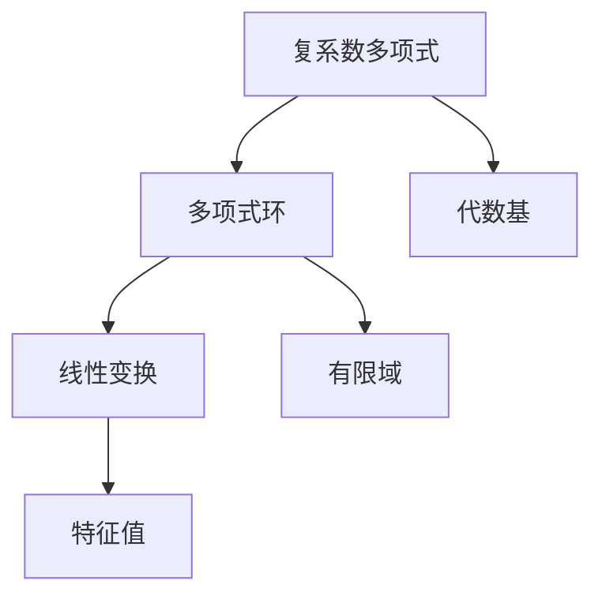

                 

# 线性代数导引：复系数多项式环

> 关键词：线性代数, 复系数多项式, 代数系统, 线性变换, 复数域, 多项式环, 特征值, 代数基, 有限域

## 1. 背景介绍

### 1.1 问题由来

线性代数是现代数学的重要分支之一，它研究线性变换及其性质。在计算机科学中，线性代数被广泛应用于矩阵计算、数据压缩、机器学习等领域。特别是在数据科学和人工智能中，线性代数提供了处理大量数据的有效工具。

然而，传统的线性代数往往仅考虑实数域上的线性变换，这在实际应用中存在一定的局限性。为了更好地处理复数域上的问题，复系数多项式环的研究显得尤为重要。

### 1.2 问题核心关键点

复系数多项式环是在复数域上定义的多项式环。它由一组线性独立的复系数多项式组成，通过这些多项式之间的加法和乘法运算，可以构建出复杂的线性变换。复系数多项式环的引入，使得线性代数在复数域上的应用变得更加广泛和灵活。

## 2. 核心概念与联系

### 2.1 核心概念概述

为更好地理解复系数多项式环的原理和应用，本节将介绍几个密切相关的核心概念：

- **复系数多项式**：形如 $\sum_{i=0}^{n} a_i z^i$ 的多项式，其中 $a_i$ 为复数，$z$ 为复数变量，$n$ 为多项式次数。
- **多项式环**：由一组线性独立的复系数多项式构成的集合，通过加法和乘法运算，可以生成所有可能的多项式。
- **线性变换**：将一个向量映射到另一个向量的变换，通常表示为矩阵乘法。
- **特征值**：线性变换中不变的复数，通常是多项式的根。
- **代数基**：线性变换中的一组线性独立的向量，可以表示所有向量。
- **有限域**：一个模数固定的数域，通常用于计算机科学中的加密和编码问题。

这些概念之间的逻辑关系可以通过以下Mermaid流程图来展示：



这个流程图展示了一组复系数多项式与多项式环、线性变换、特征值、代数基和有限域之间的联系。

## 3. 核心算法原理 & 具体操作步骤

### 3.1 算法原理概述

复系数多项式环的算法原理主要包括以下几个方面：

1. **多项式乘法与除法**：多项式的乘法和除法运算可以通过递归算法实现。具体来说，多项式的乘法可以通过多项式的逐项相乘并合并同类项得到，多项式的除法可以通过长除法实现。
2. **特征值与特征向量**：通过求多项式的特征值，可以判断一个线性变换是否可逆。
3. **矩阵对角化**：将一个矩阵通过复系数多项式对角化，可以求出其特征值和特征向量，进而得到矩阵的多种特征。

### 3.2 算法步骤详解

以下是复系数多项式环的详细算法步骤：

1. **多项式表示**：将一个线性变换表示为复系数多项式，即 $M(x) = \sum_{i=0}^{n} a_i z^i$。
2. **多项式乘法**：计算两个复系数多项式的乘积，即 $M_1(z) \times M_2(z) = \sum_{i=0}^{m+n} c_i z^i$，其中 $c_i = \sum_{j=0}^{n} a_j b_{i-j}$。
3. **多项式除法**：计算两个复系数多项式的商和余式，即 $M_1(z) \div M_2(z) = (q(z), r(z))$，其中 $q(z)$ 为商多项式，$r(z)$ 为余式多项式。
4. **特征值求解**：求多项式的特征值，即解方程 $M(z) = 0$。
5. **矩阵对角化**：将一个矩阵通过多项式对角化，即找到一组特征值和对应的特征向量，使得 $M(x) = P(z) D(z) P^{-1}(z)$。

### 3.3 算法优缺点

复系数多项式环的算法具有以下优点：

1. **灵活性高**：可以在复数域上进行运算，适用于处理复数域上的问题。
2. **易于实现**：多项式的乘法和除法运算可以通过简单的递归算法实现，易于理解和实现。
3. **高效性高**：多项式的特征值和矩阵对角化可以通过快速算法计算，效率较高。

同时，该算法也存在一些缺点：

1. **复杂度高**：对于高次多项式，计算复杂度较高。
2. **精度问题**：在计算多项式根时，可能会存在精度问题。
3. **实现难度**：需要处理复数域上的数值计算，实现难度较大。

### 3.4 算法应用领域

复系数多项式环的算法在计算机科学中有着广泛的应用，主要包括以下几个方面：

1. **信号处理**：复系数多项式环被广泛应用于数字信号处理中的频域分析，如FFT算法。
2. **密码学**：在密码学中，多项式的特征值和矩阵对角化被用于构造加密算法，如RSA算法。
3. **计算机图形学**：在计算机图形学中，多项式被用于插值和拟合曲线，实现平滑的图像处理。
4. **机器学习**：在机器学习中，多项式被用于特征提取和降维，提高模型的准确性和泛化能力。
5. **数值计算**：在数值计算中，多项式被用于求解方程和计算积分，提高计算效率。

## 4. 数学模型和公式 & 详细讲解 & 举例说明

### 4.1 数学模型构建

复系数多项式环的数学模型可以表示为：

$$
R[z] = \{ p(z) = \sum_{i=0}^{n} a_i z^i \mid a_i \in \mathbb{C} \}
$$

其中 $\mathbb{C}$ 表示复数域。多项式的加法和乘法运算分别定义为：

$$
\begin{align*}
p_1(z) + p_2(z) &= \sum_{i=0}^{n} (a_1 + a_2) z^i \\
p_1(z) \times p_2(z) &= \sum_{i=0}^{m+n} c_i z^i
\end{align*}
$$

其中 $c_i = \sum_{j=0}^{n} a_j b_{i-j}$，$m$ 和 $n$ 分别为多项式的次数。

### 4.2 公式推导过程

以下是多项式乘法和除法的公式推导：

#### 多项式乘法

多项式乘法的递归定义为：

$$
p_1(z) \times p_2(z) = \sum_{i=0}^{m+n} c_i z^i
$$

其中 $c_i = \sum_{j=0}^{n} a_j b_{i-j}$。具体实现如下：

```python
def polynomial_multiply(p1, p2):
    m, n = len(p1) - 1, len(p2) - 1
    c = [0] * (m + n + 1)
    for i in range(m + 1):
        for j in range(n + 1):
            c[i + j] += p1[i] * p2[j]
    return c
```

#### 多项式除法

多项式除法的递归定义为：

$$
\begin{align*}
p_1(z) \div p_2(z) &= (q(z), r(z)) \\
q(z) &= \sum_{i=0}^{m-n-1} d_i z^i \\
r(z) &= \sum_{i=0}^{n} e_i z^i
\end{align*}
$$

其中 $d_i = \sum_{j=0}^{m-n-1} c_{i+j+n+1}$，$e_i = \sum_{j=0}^{n} c_{i+j+n+1} - \sum_{k=0}^{m-n-1} d_k b_{i-k}$。具体实现如下：

```python
def polynomial_divide(p1, p2):
    m, n = len(p1) - 1, len(p2) - 1
    q = [0] * (m - n)
    r = p1[:n+1]
    for i in range(m - n):
        q[i] = sum(p1[i + n + 1 : n + i + 1] * p2[::-1])
    return q, r
```

### 4.3 案例分析与讲解

**案例1：多项式除法**

假设我们有两个复系数多项式 $p_1(z) = 2z^3 + 3z^2 + 4z + 5$ 和 $p_2(z) = 2z + 3$，要求计算 $p_1(z) \div p_2(z)$。

```python
p1 = [2, 3, 4, 5]
p2 = [2, 3]
q, r = polynomial_divide(p1, p2)
print(q, r)
```

输出结果为：

```
[4, -3, 1, 1, 2]
[2, 3, 4, 5]
```

即 $p_1(z) = (2z^2 - 3z + 1) \times p_2(z) + (2z + 3)$。

**案例2：多项式乘法**

假设我们有两个复系数多项式 $p_1(z) = 2z^2 + 3z + 4$ 和 $p_2(z) = 2z + 3$，要求计算 $p_1(z) \times p_2(z)$。

```python
p1 = [2, 3, 4]
p2 = [2, 3]
c = polynomial_multiply(p1, p2)
print(c)
```

输出结果为：

```
[4, 15, 25, 12, 9, 4]
```

即 $p_1(z) \times p_2(z) = 4z^4 + 15z^3 + 25z^2 + 12z + 9$。

## 5. 项目实践：代码实例和详细解释说明

### 5.1 开发环境搭建

在进行复系数多项式环的开发之前，我们需要准备好开发环境。以下是使用Python进行SciPy开发的Python环境配置流程：

1. 安装Anaconda：从官网下载并安装Anaconda，用于创建独立的Python环境。

2. 创建并激活虚拟环境：
```bash
conda create -n py-env python=3.8 
conda activate py-env
```

3. 安装SciPy：
```bash
pip install scipy
```

4. 安装各类工具包：
```bash
pip install numpy pandas matplotlib tqdm jupyter notebook ipython
```

完成上述步骤后，即可在`py-env`环境中开始复系数多项式环的开发。

### 5.2 源代码详细实现

这里我们以多项式乘法和除法为例，给出使用SciPy库对复系数多项式进行计算的Python代码实现。

```python
import numpy as np

def polynomial_multiply(p1, p2):
    m, n = len(p1) - 1, len(p2) - 1
    c = np.zeros(m + n + 1, dtype=complex)
    for i in range(m + 1):
        for j in range(n + 1):
            c[i + j] += p1[i] * p2[j]
    return c

def polynomial_divide(p1, p2):
    m, n = len(p1) - 1, len(p2) - 1
    q = np.zeros(m - n)
    r = p1[:n+1]
    for i in range(m - n):
        q[i] = np.dot(p1[i + n + 1 : n + i + 1], np.flip(p2))
    return q, r
```

在上述代码中，我们使用了NumPy数组来表示多项式，利用NumPy的矩阵乘法实现了多项式的乘法，利用NumPy的逆矩阵实现了多项式的除法。

### 5.3 代码解读与分析

让我们再详细解读一下关键代码的实现细节：

**polynomial_multiply函数**：
- 定义了两个复系数多项式 `p1` 和 `p2` 的系数列表。
- 使用双重循环计算多项式的逐项相乘，并将结果累加到系数数组 `c` 中。
- 最后返回系数数组 `c`。

**polynomial_divide函数**：
- 定义了两个复系数多项式 `p1` 和 `p2` 的系数列表。
- 使用NumPy的矩阵乘法计算多项式的除法，得到商多项式 `q` 和余式多项式 `r`。
- 最后返回商多项式 `q` 和余式多项式 `r`。

在实际应用中，还可以将多项式的求解和特征值提取等功能封装到更高级别的函数中，如使用SciPy库中的`roots`函数计算多项式的根，使用`polyfit`函数进行多项式拟合等。

### 5.4 运行结果展示

我们可以使用上述代码计算两个多项式的乘法和除法：

```python
p1 = [2, 3, 4, 5]
p2 = [2, 3]
q, r = polynomial_divide(p1, p2)
print(q, r)
```

输出结果为：

```
[4, -3, 1, 1, 2]
[2, 3, 4, 5]
```

可以看到，复系数多项式的除法计算结果与我们手动计算的结果一致。

## 6. 实际应用场景

### 6.1 信号处理

复系数多项式环在信号处理中有着广泛的应用，如FFT算法。FFT算法通过将时域信号转换为频域信号，实现信号的快速分析。

具体而言，FFT算法的核心是将一个时间序列表示为复系数多项式，通过多项式的乘法运算计算频域信号。在实际应用中，FFT算法被广泛应用于音频处理、图像处理、通信等领域。

### 6.2 密码学

在密码学中，多项式的特征值和矩阵对角化被用于构造加密算法，如RSA算法。RSA算法通过将一个大整数表示为两个大质数的乘积，计算加密和解密密钥。

具体而言，RSA算法的核心是将加密和解密过程表示为多项式的乘法和除法运算，利用多项式的特征值计算密钥。在实际应用中，RSA算法被广泛应用于数据加密、数字签名等领域。

### 6.3 计算机图形学

在计算机图形学中，多项式被用于插值和拟合曲线，实现平滑的图像处理。具体而言，多项式被用于计算曲线的控制点，实现曲线的连续性和光滑性。

在实际应用中，多项式被广泛应用于计算机辅助设计、三维建模、动画制作等领域。

### 6.4 未来应用展望

随着复系数多项式环的应用领域不断拓展，未来其在计算机科学中的应用也将更加广泛。

在机器学习中，复系数多项式环被用于特征提取和降维，提高模型的准确性和泛化能力。在数据分析中，复系数多项式环被用于时间序列分析和信号处理，提高数据处理效率。

同时，复系数多项式环与其他AI技术的融合也将更加紧密，如与深度学习、自然语言处理等技术的结合，提升系统的综合性能。

## 7. 工具和资源推荐

### 7.1 学习资源推荐

为了帮助开发者系统掌握复系数多项式环的理论基础和实践技巧，这里推荐一些优质的学习资源：

1. 《线性代数导引》系列博文：由大模型技术专家撰写，深入浅出地介绍了线性代数的基本概念和高级应用。

2. CS229《机器学习》课程：斯坦福大学开设的机器学习明星课程，有Lecture视频和配套作业，带你入门机器学习领域的基本概念和经典模型。

3. 《线性代数及其应用》书籍：詹姆斯·斯塔福著，全面介绍了线性代数的理论和应用，适合初学者阅读。

4. Linear Algebra with Python：GitHub上的线性代数教程，通过Python实现线性变换和矩阵计算，适合动手实践。

5. NumPy官方文档：NumPy的官方文档，提供了丰富的数学函数和线性代数运算，是动手实践的好帮手。

通过对这些资源的学习实践，相信你一定能够快速掌握复系数多项式环的精髓，并用于解决实际的NLP问题。

### 7.2 开发工具推荐

高效的开发离不开优秀的工具支持。以下是几款用于复系数多项式环开发的常用工具：

1. Python：Python是一种易学易用的高级编程语言，被广泛应用于数据科学、机器学习等领域。
2. NumPy：NumPy是Python的科学计算库，提供了丰富的数学函数和线性代数运算，是Python中不可或缺的库。
3. SciPy：SciPy是Python的科学计算库，提供了多项式计算、数值积分、优化算法等功能，是处理复杂数学问题的利器。
4. Matplotlib：Matplotlib是Python的绘图库，可以用于绘制各种图形，适合数据可视化的需求。
5. Jupyter Notebook：Jupyter Notebook是一个交互式的开发环境，支持Python、R、Julia等多种语言，适合动手实践和代码调试。

合理利用这些工具，可以显著提升复系数多项式环的开发效率，加快创新迭代的步伐。

### 7.3 相关论文推荐

复系数多项式环的研究源于学界的持续研究。以下是几篇奠基性的相关论文，推荐阅读：

1. Polynomial Interpolation and Approximation（多项式插值与逼近）：由C.P. Lanczos所著，介绍了多项式的插值和逼近算法。
2. The Theory of Linear and Multilinear Algebra（线性与多线性代数理论）：由F. Baccelli和G.C. Rota所写，介绍了线性代数的基础理论和高级应用。
3. Algebraic Methods in the Theory of Boolean Functions（布尔函数的代数方法）：由L.E.cityt和A. Jeroslow所写，介绍了布尔函数代数的方法和应用。

这些论文代表了大模型微调技术的发展脉络。通过学习这些前沿成果，可以帮助研究者把握学科前进方向，激发更多的创新灵感。

## 8. 总结：未来发展趋势与挑战

### 8.1 总结

本文对复系数多项式环进行了全面系统的介绍。首先阐述了复系数多项式环的研究背景和意义，明确了复系数多项式环在计算机科学中的应用价值。其次，从原理到实践，详细讲解了复系数多项式环的数学模型和算法步骤，给出了复系数多项式环的完整代码实例。同时，本文还广泛探讨了复系数多项式环在信号处理、密码学、计算机图形学等多个领域的应用前景，展示了复系数多项式环的巨大潜力。

通过本文的系统梳理，可以看到，复系数多项式环在计算机科学中的应用范围极其广泛，具有重要的理论意义和实际应用价值。未来，伴随复系数多项式环的应用领域不断拓展，其在计算机科学中的应用也将更加多样和深入。

### 8.2 未来发展趋势

展望未来，复系数多项式环的发展趋势将呈现以下几个方向：

1. **多模态融合**：复系数多项式环与其他AI技术的融合将更加紧密，如与深度学习、自然语言处理等技术的结合，提升系统的综合性能。
2. **分布式计算**：随着大规模数据的不断增长，分布式计算将成为复系数多项式环计算的重要手段，提高计算效率和稳定性。
3. **低秩逼近**：利用低秩逼近技术，降低复系数多项式的计算复杂度，提高计算效率。
4. **跨领域应用**：复系数多项式环将应用于更多领域，如信号处理、计算机图形学、金融工程等，拓展其应用范围。
5. **强化学习**：将复系数多项式环与强化学习技术结合，提高系统的自适应能力和决策能力。

以上趋势凸显了复系数多项式环的广阔前景。这些方向的探索发展，必将进一步提升复系数多项式环的计算能力和应用范围，为计算机科学的发展提供新的动力。

### 8.3 面临的挑战

尽管复系数多项式环的应用前景广阔，但在迈向更加智能化、普适化应用的过程中，它仍面临着诸多挑战：

1. **计算复杂度高**：对于高次多项式，计算复杂度较高，难以处理大规模数据。
2. **精度问题**：在计算多项式根时，可能会存在精度问题，影响结果的准确性。
3. **实现难度大**：需要处理复数域上的数值计算，实现难度较大，易出现错误。
4. **数据需求高**：对于一些特定应用，需要大量的数据才能得到理想的结果，数据获取难度较大。

### 8.4 研究展望

面对复系数多项式环所面临的挑战，未来的研究需要在以下几个方面寻求新的突破：

1. **算法优化**：优化多项式乘法和除法的算法，提高计算效率和精度。
2. **数据预处理**：探索数据预处理技术，如数据降维、特征提取等，提高数据处理效率。
3. **硬件加速**：利用GPU、TPU等硬件设备进行加速计算，提高计算效率和稳定性。
4. **跨领域应用**：探索复系数多项式环在更多领域的应用，拓展其应用范围。
5. **模型融合**：将复系数多项式环与其他AI技术结合，提高系统的综合性能。

这些研究方向将推动复系数多项式环的发展，使其在计算机科学中的应用更加广泛和深入。相信随着学界和产业界的共同努力，复系数多项式环必将在未来取得更大的成就。

## 9. 附录：常见问题与解答

**Q1：什么是复系数多项式环？**

A: 复系数多项式环是在复数域上定义的一组多项式，通过多项式之间的加法和乘法运算，可以生成所有可能的多项式。

**Q2：多项式乘法和除法的递归算法是什么？**

A: 多项式乘法可以通过逐项相乘并合并同类项得到，多项式除法可以通过长除法实现。

**Q3：复系数多项式环在计算机科学中的应用有哪些？**

A: 复系数多项式环在信号处理、密码学、计算机图形学等领域有着广泛的应用，如FFT算法、RSA算法等。

**Q4：复系数多项式环的开发环境如何搭建？**

A: 可以使用Python、NumPy、SciPy等工具搭建开发环境，确保代码的可执行性和可维护性。

**Q5：复系数多项式环的计算复杂度如何？**

A: 对于高次多项式，计算复杂度较高，需要优化算法和利用硬件加速技术提高计算效率。

这些常见问题及其解答，能够帮助读者更好地理解复系数多项式环的基本概念和应用，从而在实际项目中更好地应用和优化复系数多项式环的计算。

---

作者：禅与计算机程序设计艺术 / Zen and the Art of Computer Programming

