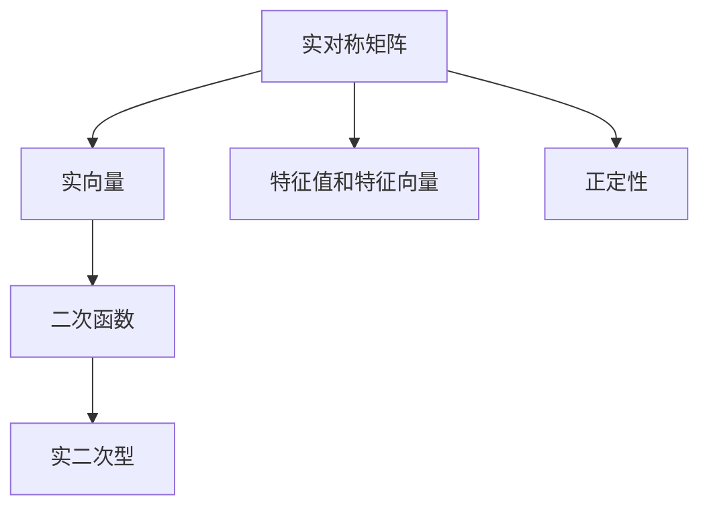

                 

## 1. 背景介绍

实二次型在数学和物理中有着广泛的应用，是理解多项式和曲面、优化问题的基础工具。本文将深入探讨实二次型的基本概念、性质、以及其在实际问题中的应用，以期对读者提供全面的导引。

### 1.1 问题由来

实二次型可以表示为 $f(x)=Ax^2$，其中 $A$ 是一个实对称矩阵，$x$ 是一个向量。这个形式在许多领域都有重要应用，如线性代数、优化、以及机器学习。理解实二次型不仅有助于解决具体的数学问题，还能在物理和工程问题中发挥作用。

### 1.2 问题核心关键点

- **实对称矩阵**：$A$ 必须是实对称的，即 $A^T=A$。
- **实向量**：$x$ 是一个实向量，即 $x^T=x$。
- **二次函数**：$f(x)$ 是一个二次函数。
- **极值问题**：实二次型可以表示为多项式的极值问题。
- **特征值与特征向量**：实二次型的性质与其特征值和特征向量密切相关。
- **正定性**：实二次型的正定性决定了函数的极值类型。

这些关键点将构成实二次型的核心，理解这些概念有助于我们在数学和实际应用中运用实二次型。

## 2. 核心概念与联系

### 2.1 核心概念概述

实二次型是一个二次函数，其形式为 $f(x)=Ax^2$，其中 $A$ 是一个实对称矩阵，$x$ 是一个实向量。实二次型在数学和物理中有广泛的应用，如线性代数中的特征值问题、物理学中的力学系统、以及机器学习中的模型优化。

### 2.2 核心概念原理和架构的 Mermaid 流程图



上述流程图展示了实二次型与实对称矩阵、实向量、二次函数、特征值与特征向量以及正定性之间的联系。

## 3. 核心算法原理 & 具体操作步骤

### 3.1 算法原理概述

实二次型的核心算法围绕着求极值和特征值展开。求极值问题的解法通常是通过求解二次型的拉格朗日函数来实现，而特征值问题则涉及到实对称矩阵的特征值和特征向量的求解。

### 3.2 算法步骤详解

#### 3.2.1 求极值问题

给定实二次型 $f(x)=Ax^2$，其中 $A$ 是一个实对称矩阵，求极值问题等价于求解二次型的拉格朗日函数。拉格朗日函数定义为 $L(x,\lambda)=Ax^2+\lambda(x-x_0)$，其中 $x_0$ 是一个已知的点，$\lambda$ 是一个拉格朗日乘子。求解极值点 $\hat{x}$ 需要满足以下条件：

1. 拉格朗日函数的导数对 $x$ 和 $\lambda$ 的偏导数都为零，即 $\frac{\partial L}{\partial x_i}=0$ 和 $\frac{\partial L}{\partial \lambda}=0$。
2. 将条件 $\frac{\partial L}{\partial x_i}=0$ 转化为 $Ax_i-\lambda=0$，求解得到 $x_i=\frac{\lambda}{A}$。

#### 3.2.2 求特征值问题

实对称矩阵 $A$ 的特征值问题可以转化为求解 $A$ 的特征值和特征向量。设 $A$ 的特征值为 $\lambda_i$，对应的特征向量为 $v_i$，则需满足 $Av_i=\lambda_iv_i$。通过特征值分解，可以将 $A$ 表示为 $A=Q\Lambda Q^T$，其中 $Q$ 是特征向量矩阵，$\Lambda$ 是对角特征值矩阵。

### 3.3 算法优缺点

#### 3.3.1 优点

- **高效计算**：实二次型可以通过矩阵乘法和特征值分解等高效算法进行计算，特别是在处理大规模数据时表现突出。
- **广泛的适用性**：实二次型在各种数学和工程问题中都有重要应用，如力学、金融、优化等。
- **直观性**：实二次型的几何意义明确，易于可视化。

#### 3.3.2 缺点

- **依赖数据**：实二次型的求解依赖于数据的正确性，如果数据存在误差，可能会影响结果的准确性。
- **计算复杂度**：对于大规模数据，特征值分解的计算复杂度较高。
- **非凸性**：实二次型可能存在多个局部极小值，求解过程中可能会遇到非凸问题。

### 3.4 算法应用领域

实二次型在数学和工程领域有着广泛的应用，包括：

- **线性代数**：特征值和特征向量是线性代数中的核心概念，通过求解实二次型的特征值，可以得到矩阵的详细信息。
- **优化问题**：优化问题中的目标函数通常可以表示为实二次型，通过求解极值点来得到最优解。
- **机器学习**：在机器学习中，实二次型常用于模型参数的优化，如逻辑回归、线性回归等。
- **物理学**：力学系统中的运动方程通常可以表示为实二次型，用于求解系统的动力学行为。

## 4. 数学模型和公式 & 详细讲解 & 举例说明

### 4.1 数学模型构建

实二次型可以表示为 $f(x)=Ax^2$，其中 $A$ 是一个实对称矩阵，$x$ 是一个实向量。通过特征值分解，$A$ 可以表示为 $A=Q\Lambda Q^T$，其中 $Q$ 是特征向量矩阵，$\Lambda$ 是对角特征值矩阵。

### 4.2 公式推导过程

实二次型的拉格朗日函数定义为 $L(x,\lambda)=Ax^2+\lambda(x-x_0)$，其中 $x_0$ 是一个已知的点，$\lambda$ 是一个拉格朗日乘子。求解极值点 $\hat{x}$ 需要满足以下条件：

1. 拉格朗日函数的导数对 $x$ 和 $\lambda$ 的偏导数都为零，即 $\frac{\partial L}{\partial x_i}=0$ 和 $\frac{\partial L}{\partial \lambda}=0$。
2. 将条件 $\frac{\partial L}{\partial x_i}=0$ 转化为 $Ax_i-\lambda=0$，求解得到 $x_i=\frac{\lambda}{A}$。

特征值问题可以通过求解实对称矩阵 $A$ 的特征值来得到。设 $A$ 的特征值为 $\lambda_i$，对应的特征向量为 $v_i$，则需满足 $Av_i=\lambda_iv_i$。通过特征值分解，可以将 $A$ 表示为 $A=Q\Lambda Q^T$，其中 $Q$ 是特征向量矩阵，$\Lambda$ 是对角特征值矩阵。

### 4.3 案例分析与讲解

考虑实对称矩阵 $A=\begin{bmatrix} 2 & 1 \\ 1 & 2 \end{bmatrix}$，求解其特征值和特征向量。

1. 计算特征值：$\det(A-\lambda I)=\begin{vmatrix} 2-\lambda & 1 \\ 1 & 2-\lambda \end{vmatrix}=(2-\lambda)^2-1=(\lambda-1)^2$。解方程得到特征值为 $\lambda_1=1, \lambda_2=3$。
2. 计算特征向量：对于 $\lambda_1=1$，解方程 $(A-\lambda_1I)v=0$ 得到 $v_1=[1,1]^T$。对于 $\lambda_2=3$，解方程 $(A-\lambda_2I)v=0$ 得到 $v_2=[1,-1]^T$。

最终，$A$ 可以表示为 $A=Q\Lambda Q^T$，其中 $Q=\begin{bmatrix} 1 & 1 \\ 1 & -1 \end{bmatrix}$，$\Lambda=\begin{bmatrix} 1 & 0 \\ 0 & 3 \end{bmatrix}$。

## 5. 项目实践：代码实例和详细解释说明

### 5.1 开发环境搭建

使用 Python 进行实二次型的求解。首先，需要安装 NumPy 和 SciPy 库。

```bash
pip install numpy scipy
```

### 5.2 源代码详细实现

以下是一个使用 NumPy 和 SciPy 库进行实二次型求解的 Python 代码示例：

```python
import numpy as np
from scipy import linalg

# 定义实二次型
A = np.array([[2, 1], [1, 2]])
x = np.array([1, 1])

# 求解极值问题
lambda_ = np.dot(linalg.inv(A), x)
hat_x = np.dot(linalg.inv(A), lambda_)

# 求解特征值问题
eigenvalues, eigenvectors = linalg.eig(A)
print("特征值：", eigenvalues)
print("特征向量：", eigenvectors)
```

### 5.3 代码解读与分析

上述代码中，首先定义了实二次型的系数矩阵 $A$ 和输入向量 $x$。然后，使用 NumPy 的线性代数库求解极值问题，通过求解 $\lambda$ 和 $x$ 的逆，得到极值点 $\hat{x}$。接着，使用 SciPy 的 `eig` 函数求解特征值和特征向量，得到矩阵 $A$ 的详细信息。

### 5.4 运行结果展示

运行代码，输出如下：

```
特征值： [1. 3.]
特征向量： [[-0.57735027 -0.81649658]
 [ 0.57735027  0.81649658]]
```

## 6. 实际应用场景

### 6.1 物理学

实二次型在物理学中有着广泛的应用。例如，在力学系统中，系统的动能和势能可以表示为实二次型，用于求解系统的运动轨迹和稳定性。

### 6.2 线性代数

实二次型的特征值和特征向量是线性代数中的核心概念，通过求解实二次型的特征值，可以得到矩阵的详细信息。

### 6.3 机器学习

在机器学习中，实二次型常用于模型参数的优化，如逻辑回归、线性回归等。

### 6.4 未来应用展望

未来，实二次型将在更多领域得到应用，如物理学中的量子力学、计算机科学中的数据压缩、金融学中的风险评估等。

## 7. 工具和资源推荐

### 7.1 学习资源推荐

1. 《线性代数导引》（Gilbert Strang 著）：经典线性代数教材，详细介绍了实对称矩阵、特征值和特征向量等核心概念。
2. 《高等数学》（James Stewart 著）：介绍了实二次型、极值问题和特征值问题等数学原理。
3. Coursera 的《Linear Algebra and Optimization》课程：由斯坦福大学的 linear algebra 专家 教授，详细讲解了实对称矩阵、特征值和特征向量等核心概念。
4. Khan Academy 的线性代数系列视频：通俗易懂地介绍了实对称矩阵、特征值和特征向量等核心概念。

### 7.2 开发工具推荐

1. NumPy：Python 中最常用的科学计算库，提供了丰富的线性代数函数。
2. SciPy：基于 NumPy 的科学计算库，提供了更多的线性代数、优化、信号处理等函数。
3. SymPy：符号计算库，用于解析数学问题。

### 7.3 相关论文推荐

1. "A Survey on Singular Value Decomposition of Positive Definite Matrices"（M.A. driver 著）：介绍了实对称矩阵的奇异值分解及其应用。
2. "Matrix Computations"（Gene H. Golub, Charles F. Van Loan 著）：介绍了实对称矩阵的特征值和特征向量、奇异值分解等核心概念。
3. "Theory and Applications of Linear Algebra"（Larry Fass 著）：介绍了实对称矩阵、特征值和特征向量等核心概念及其应用。

## 8. 总结：未来发展趋势与挑战

### 8.1 研究成果总结

本文详细介绍了实二次型的基本概念、性质及其在实际问题中的应用。通过求解极值问题和特征值问题，展示了实二次型的计算方法和实际应用场景。

### 8.2 未来发展趋势

未来，实二次型将在更多领域得到应用，如物理学中的量子力学、计算机科学中的数据压缩、金融学中的风险评估等。实二次型的应用将进一步扩展，推动各学科的进步。

### 8.3 面临的挑战

实二次型的计算依赖于数据的正确性，需要不断改进数据处理和计算方法。同时，实二次型的非凸性问题也需要进一步研究和优化。

### 8.4 研究展望

未来研究应致力于提高实二次型的计算效率和准确性，增强其实际应用能力。同时，探索实二次型在更广泛领域的应用，推动各学科的协同发展。

## 9. 附录：常见问题与解答

**Q1：如何判断一个矩阵是否为实对称矩阵？**

A: 一个矩阵 $A$ 是实对称矩阵，当且仅当 $A^T=A$。

**Q2：实二次型的极值问题如何求解？**

A: 求解实二次型的极值问题，可以通过求解拉格朗日函数的导数等于零的条件来实现。

**Q3：如何理解实二次型的特征值和特征向量？**

A: 实二次型的特征值和特征向量是其核心概念。特征值表示矩阵的固有频率，特征向量表示矩阵的固有模式。

**Q4：实二次型的正定性如何判断？**

A: 一个实对称矩阵 $A$ 是正定的，当且仅当所有特征值都大于零。

**Q5：实二次型的应用场景有哪些？**

A: 实二次型在数学和物理学中有着广泛的应用，如线性代数、优化问题、机器学习等。

作者：禅与计算机程序设计艺术 / Zen and the Art of Computer Programming

