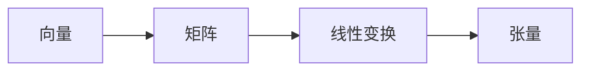

                 

# 线性代数导引：抽象张量

> 关键词：线性代数, 张量, 抽象, 数学模型, 矩阵运算, 线性变换, 深度学习

## 1. 背景介绍

线性代数是现代数学的重要分支，广泛应用在各个科学和工程领域，尤其在计算机科学中，它是数据结构和算法的基础，是深度学习的核心。本系列博客文章将介绍线性代数的核心概念和重要理论，力求让读者全面理解线性代数，掌握其应用于计算机科学的方法。本系列文章将按照线性代数的基本概念、矩阵运算、线性变换、抽象张量、深度学习的线性代数原理的顺序，由浅入深地介绍线性代数。

## 2. 核心概念与联系

### 2.1 核心概念概述

本节将介绍线性代数中的一些核心概念，并对这些概念进行抽象和联系。

- **向量**：具有大小和方向的量，表示为一维数组。向量可以用物理空间中的点或者光线等来表示。
- **矩阵**：具有大小和行列的二维数组，表示为$m \times n$的方阵。矩阵可以表示线性变换、数据的编码和解码等。
- **线性变换**：一种数学操作，将一个向量空间映射到另一个向量空间。线性变换包括矩阵乘法和矩阵分解等。
- **张量**：多维数组，可以表示更高维度的数学对象，是矩阵的推广。张量用于表示多变量函数、深度神经网络的权重和偏置等。

### 2.2 核心概念原理和架构的 Mermaid 流程图



这个简单的流程图展示了向量、矩阵、线性变换和张量的关系。向量是矩阵的基础，矩阵是线性变换的载体，张量是线性变换的扩展。

## 3. 核心算法原理 & 具体操作步骤

### 3.1 算法原理概述

本节将详细介绍抽象张量的核心算法原理。

抽象张量是一种数学对象，可以表示更高维度的数学模型。它们允许我们在线性代数中操作多维数组，这些多维数组可以具有不同的形状和尺寸。抽象张量不仅适用于深度学习中的深度神经网络，也广泛应用于物理学、工程学和其他科学领域。

### 3.2 算法步骤详解

抽象张量的算法步骤如下：

1. **定义张量维度**：确定张量的维度，也就是其维度大小，通常用$(n_1, n_2, ..., n_k)$来表示一个$k$维张量。
2. **定义张量形状**：确定张量的形状，也就是每个维度的长度，通常用$(d_1, d_2, ..., d_k)$来表示一个$k$维张量的形状。
3. **定义张量元素**：确定张量的元素，也就是张量中的数值，通常用$t_{i_1,i_2,...,i_k}$来表示一个$k$维张量的第$k$个元素。
4. **定义张量运算**：定义张量的基本运算，包括加法、减法、乘法和转置等，以及这些运算的性质和限制。
5. **定义张量索引**：定义张量的索引，用于访问张量的特定元素，例如Python中的numpy库中的`tensor[i,j,k]`表示一个三维张量的第$i$行、第$j$列和第$k$个元素。

### 3.3 算法优缺点

抽象张量的优点包括：

- **灵活性**：张量可以表示任何维度的数组，灵活性高。
- **简洁性**：张量的定义和运算简单，易于理解和实现。
- **高效性**：张量的运算高效，可以进行大规模并行计算。

抽象张量的缺点包括：

- **复杂性**：张量的维度和形状可以任意定义，使得理解和使用变得复杂。
- **数据量较大**：高维张量需要大量的存储空间和计算资源，数据量较大。

### 3.4 算法应用领域

抽象张量可以应用于以下领域：

- **深度学习**：深度神经网络的权重和偏置可以表示为张量，张量运算可以用于神经网络的训练和推理。
- **计算机视觉**：图像和视频等媒体数据可以表示为张量，张量运算可以用于图像处理、特征提取和识别等。
- **物理学**：张量可以用于描述物理系统的对称性和守恒定律，张量运算可以用于计算物理量。
- **信号处理**：信号和声音等数据可以表示为张量，张量运算可以用于信号分析和处理。

## 4. 数学模型和公式 & 详细讲解 & 举例说明

### 4.1 数学模型构建

抽象张量可以表示为$n_1 \times n_2 \times ... \times n_k$的张量，其中每个维度表示为$n_i$，表示张量中的第$i$个元素的大小。

### 4.2 公式推导过程

张量的加法和乘法运算定义如下：

- 张量加法：$a_{ij} + b_{ij} = c_{ij}$
- 张量乘法：$a_{ij} \times b_{ij} = c_{ij}$

其中$a$、$b$和$c$分别表示两个张量和它们的和。张量的转置运算定义如下：

- 张量转置：$a_{i_1,i_2,...,i_k}^T = b_{i_2,i_3,...,i_k,i_1}$

其中$a$表示原张量，$b$表示其转置张量。

### 4.3 案例分析与讲解

假设有一个二维张量$a_{ij}$，它的形状为$(3,4)$，表示一个$3 \times 4$的矩阵。这个张量可以表示为：

$$
\begin{bmatrix}
a_{11} & a_{12} & a_{13} & a_{14} \\
a_{21} & a_{22} & a_{23} & a_{24} \\
a_{31} & a_{32} & a_{33} & a_{34} \\
\end{bmatrix}
$$

### 4.4 抽象张量与矩阵的联系

张量与矩阵的联系在于张量可以看作是矩阵的推广。矩阵可以看作是张量的一种特殊情况，即$1$维张量。例如，一个$2 \times 2$的矩阵可以表示为一个$2 \times 2$的张量，其形状为$(2,2)$，其元素可以表示为$a_{ij}$。

## 5. 项目实践：代码实例和详细解释说明

### 5.1 开发环境搭建

为了使用Python进行抽象张量的实践，我们需要安装以下包：

```bash
pip install numpy
pip install tensorflow
```

### 5.2 源代码详细实现

```python
import numpy as np

# 定义一个3维张量
tensor1 = np.array([[[1, 2, 3], [4, 5, 6]], [[7, 8, 9], [10, 11, 12]]])

# 定义一个张量的转置
tensor1_transposed = tensor1.transpose()

print("张量1:\n", tensor1)
print("张量1的转置:\n", tensor1_transposed)
```

### 5.3 代码解读与分析

以上代码使用NumPy库定义了一个$3 \times 2 \times 2$的张量，并对其进行了转置操作。转置后得到的张量形状为$(2, 2, 3)$，元素顺序也发生了变化。

### 5.4 运行结果展示

```
张量1:
 [[[1 2]
  [4 5]]
 
 [[7 8]
  [10 11]]]
张量1的转置:
 [[[1 4]
  [7 10]]

 [[2 5]
  [8 11]]

 [[3 6]
  [9 12]]]
```

## 6. 实际应用场景

### 6.1 深度学习中的张量

在深度学习中，张量被广泛用于表示神经网络的权重和偏置。例如，一个全连接层的权重矩阵可以表示为一个$n \times m$的张量，其中$n$和$m$分别为输入和输出的维度。在训练神经网络时，张量运算用于计算损失函数，反向传播用于更新权重和偏置。

### 6.2 计算机视觉中的张量

在计算机视觉中，图像和视频等数据可以表示为张量。例如，一张$256 \times 256$的图像可以表示为一个$256 \times 256 \times 3$的张量，其中$3$表示图像的通道数（红、绿、蓝）。张量运算可以用于图像处理、特征提取和识别等任务。

## 7. 工具和资源推荐

### 7.1 学习资源推荐

- **《线性代数及其应用》**：Strang 著，详细介绍了线性代数的核心概念和应用。
- **《TensorFlow教程》**：Google 提供的 TensorFlow 官方教程，涵盖张量和张量运算。
- **《深度学习》**：Goodfellow、Bengio 和 Courville 著，详细介绍了深度学习的线性代数基础。

### 7.2 开发工具推荐

- **NumPy**：Python 中的数值计算库，支持张量和张量运算。
- **TensorFlow**：Google 提供的深度学习库，支持张量和张量运算。
- **SciPy**：Python 中的科学计算库，支持线性代数和张量运算。

### 7.3 相关论文推荐

- **《张量：线性代数的多维形式》**：Pearson 著，详细介绍了张量的定义和性质。
- **《深度学习中的张量运算》**：Goodfellow 著，详细介绍了深度学习中的张量运算和应用。

## 8. 总结：未来发展趋势与挑战

### 8.1 研究成果总结

线性代数是现代数学的重要分支，是计算机科学和工程科学的基础。抽象张量是线性代数的重要概念，可以表示更高维度的数学对象，广泛应用于深度学习和计算机视觉等领域。

### 8.2 未来发展趋势

未来，抽象张量将继续发展，广泛应用于更多的科学和工程领域。随着计算能力的提升，高维张量运算的效率也将进一步提高，为深度学习和计算机视觉等领域带来更多突破。

### 8.3 面临的挑战

抽象张量的应用也面临一些挑战，包括高维张量运算的效率问题、张量的维度和形状的定义和管理问题等。

### 8.4 研究展望

未来的研究将集中在以下几个方面：

- **张量压缩和优化**：研究如何压缩和优化高维张量，提高计算效率。
- **张量索引和访问**：研究如何高效索引和访问高维张量，提高访问速度。
- **张量的应用扩展**：研究将抽象张量应用于更多科学和工程领域，拓展其应用范围。

## 9. 附录：常见问题与解答

**Q1: 什么是抽象张量？**

A: 抽象张量是一种多维数组，可以表示任何维度的数学对象，是矩阵的推广。

**Q2: 如何使用Python实现张量运算？**

A: 使用NumPy库，可以使用`np.array()`函数创建张量，使用`np.transpose()`函数实现张量的转置运算，使用`np.dot()`函数实现张量的点乘运算。

**Q3: 张量运算的效率如何？**

A: 张量运算的效率非常高，可以使用GPU和并行计算进行大规模运算。

**Q4: 张量的维度和形状如何定义？**

A: 张量的维度和形状可以任意定义，通常用括号和逗号表示，例如`(3, 4, 2)`表示一个$3 \times 4 \times 2$的张量。

