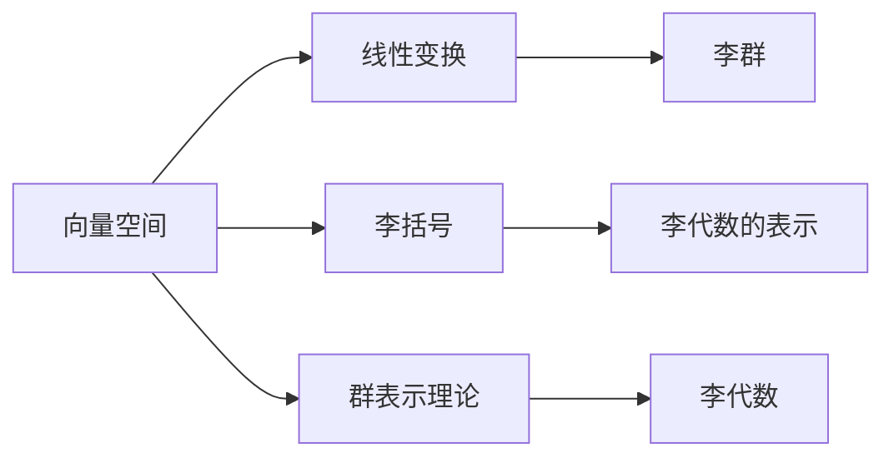

                 

# 线性代数导引：李代数简介

> 关键词：李代数, 矩阵表示, 线性代数, 李群, 群表示理论

## 1. 背景介绍

### 1.1 问题由来
在现代科学和工程中，数学起着至关重要的作用。线性代数是数学的一个分支，研究向量空间、线性变换以及它们之间的关系。而李代数（Lie algebra）则是在线性代数的基础上，进一步探讨一种特殊的代数结构——李括号（Lie bracket），具有广泛的应用价值，特别是在物理学、计算机科学和数学中。

李代数是现代理论物理的核心工具之一，用于描述物理系统的对称性。例如，在量子力学中，李代数用于描述粒子的对称变换；在量子场论中，李代数是构建和分析粒子和场的重要工具。此外，李代数在计算机视觉、机器学习、信号处理等诸多领域中也有重要应用。

本文旨在通过介绍李代数的核心概念、基本性质及其在数学和物理中的应用，帮助读者理解这一抽象而强大的数学工具。

### 1.2 问题核心关键点
李代数的研究主要围绕李括号展开。对于任意两个向量 $X$ 和 $Y$，李括号 $[X, Y]$ 定义为：

$$
[X, Y] = XY - YX
$$

它满足交换律、结合律和逆元素性质。当向量的数目增加到 $n$ 维时，就构成了一个 $n$ 维的李代数。李代数的一个重要性质是它与李群（Lie group）有着紧密的联系，即李群可以表示为李代数的指数映射。

本文将通过一系列深入浅出的讲解，帮助读者理解李代数的核心概念和基本性质，以及它们在实际应用中的作用。

## 2. 核心概念与联系

### 2.1 核心概念概述

为更好地理解李代数，我们首先需要了解几个关键概念：

- 向量空间（Vector Space）：一组向量组成的集合，满足向量加法和数乘运算的封闭性和结合律。
- 线性变换（Linear Transformation）：一种从向量空间到自身的映射，满足线性关系。
- 李括号（Lie Bracket）：向量空间中的一种特殊运算，定义了李代数的结构。
- 李群（Lie Group）：一组具有连乘结构的群，满足李括号满足群性质。
- 李代数的表示（Representation）：通过矩阵或张量表示李代数，使抽象的概念具象化。

这些概念通过李代数的李括号和指数映射联系在一起，构成了一个系统的理论框架。

### 2.2 核心概念原理和架构的 Mermaid 流程图



这个流程图展示了李代数与其他核心概念之间的联系：向量空间通过线性变换引入，并通过李括号定义了李代数结构；李代数通过指数映射构成了李群；群表示理论则通过矩阵和张量等形式，将抽象的李代数表示出来。

## 3. 核心算法原理 & 具体操作步骤

### 3.1 算法原理概述

李代数的核心是李括号，它是定义李代数结构和运算的基础。在 $n$ 维空间中，李代数可以表示为一个 $n$ 维向量空间 $V$，同时定义了一个李括号 $[\cdot, \cdot]$ 满足以下条件：

1. **交换律**：$[X, Y] = -[Y, X]$。
2. **结合律**：$[[X, Y], Z] + [[Y, Z], X] + [[Z, X], Y] = 0$。
3. **逆元素性质**：对于任意向量 $X$，存在 $-X$ 满足 $[X, -X] = 0$。

通过这些性质，我们可以定义李代数的基本运算和结构。

### 3.2 算法步骤详解

李代数的微调方法主要涉及以下几个关键步骤：

**Step 1: 初始化数据和参数**
- 选择一个 $n$ 维的向量空间 $V$，并定义一个李括号 $[\cdot, \cdot]$。
- 初始化一个 $n$ 维的向量 $X_0$ 作为李代数的生成元。

**Step 2: 定义李代数结构和运算**
- 根据李括号的定义，计算任意两个向量 $X$ 和 $Y$ 的李括号 $[X, Y]$。
- 确定李代数的维数和生成元，使其满足上述李括号的性质。

**Step 3: 李群的指数映射**
- 对于任意向量 $X$，通过指数映射 $e^{tX}$ 得到一个李群中的元素，其中 $t$ 为参数。
- 计算指数映射的导数，得到 $X$ 对应的李代数表示。

**Step 4: 应用和验证**
- 在具体应用中，选择合适的李代数及其生成元，构造李群并验证其性质。
- 通过矩阵或张量表示李代数，进行实际的运算和验证。

### 3.3 算法优缺点

李代数的主要优点包括：

- **数学抽象性**：李代数抽象度高，广泛应用于多个领域，如物理学、计算机科学等。
- **普适性**：李代数结构广泛，能够描述多种物理和数学系统。
- **数学工具**：李代数是现代理论物理的重要工具，用于描述粒子和场的对称性。

李代数的主要缺点包括：

- **复杂性**：李代数概念抽象，理解起来有一定难度。
- **应用门槛**：需要一定的数学基础，才能应用李代数于实际问题中。
- **计算复杂**：在处理高维李代数时，计算复杂度较高。

### 3.4 算法应用领域

李代数在物理学、数学、计算机科学等领域有广泛的应用，例如：

- 量子力学：描述粒子的对称变换，如 $SU(2)$ 和 $SU(3)$ 代数。
- 量子场论：用于构建和分析粒子和场的代数。
- 组合数学：研究群和李代数的组合性质，如群代数的表示理论。
- 控制理论：用于描述控制系统的对称性，如李群的李代数表示。
- 计算机视觉：用于描述图像和视频中的变换，如仿射变换和投影变换。

李代数的应用领域非常广泛，几乎涵盖了现代科学和工程中的各个方面。

## 4. 数学模型和公式 & 详细讲解 & 举例说明

### 4.1 数学模型构建

李代数可以表示为一个向量空间 $V$，并定义一个李括号 $[\cdot, \cdot]$。设 $X$ 和 $Y$ 为 $V$ 中的任意两个向量，则李括号 $[X, Y]$ 定义为：

$$
[X, Y] = XY - YX
$$

李代数满足以下条件：

1. 交换律：$[X, Y] = -[Y, X]$。
2. 结合律：$[[X, Y], Z] + [[Y, Z], X] + [[Z, X], Y] = 0$。
3. 逆元素性质：对于任意向量 $X$，存在 $-X$ 满足 $[X, -X] = 0$。

### 4.2 公式推导过程

李代数的李括号和指数映射有着紧密的联系。设 $X$ 为一个 $n$ 维的向量，$e^{tX}$ 表示其指数映射。根据泰勒展开，有：

$$
e^{tX} = \sum_{k=0}^{\infty} \frac{t^k}{k!} X^k
$$

将 $X$ 和 $-X$ 代入上式，得到：

$$
e^{tX} e^{-tX} = e^{tX} \sum_{k=0}^{\infty} \frac{(-t)^k}{k!} X^k = 1
$$

这表明 $e^{tX} e^{-tX} = 1$ 是李群的一个性质。

### 4.3 案例分析与讲解

以 $SU(2)$ 李代数为例，其生成元为 $X = \begin{pmatrix} 0 & 1 \\ -1 & 0 \end{pmatrix}$。其李括号计算如下：

$$
[X, Y] = XY - YX = \begin{pmatrix} 0 & 1 \\ -1 & 0 \end{pmatrix} \begin{pmatrix} 1 & 0 \\ 0 & -1 \end{pmatrix} - \begin{pmatrix} 1 & 0 \\ 0 & -1 \end{pmatrix} \begin{pmatrix} 0 & 1 \\ -1 & 0 \end{pmatrix} = \begin{pmatrix} 0 & 2 \\ -2 & 0 \end{pmatrix}
$$

可见，$SU(2)$ 的李代数是一个 $2 \times 2$ 的矩阵，其中 $X$ 的李括号为 $2X$，满足上述李代数的性质。

## 5. 项目实践：代码实例和详细解释说明

### 5.1 开发环境搭建

在Python中使用Sympy库可以方便地进行李代数的计算和验证。首先，需要安装Sympy库：

```bash
pip install sympy
```

然后，在Python脚本中导入Sympy：

```python
import sympy as sp
```

### 5.2 源代码详细实现

下面以 $SU(2)$ 李代数为例，展示使用Sympy库进行李代数计算的代码实现：

```python
# 定义生成元
X = sp.Matrix([[0, 1], [-1, 0]])
Y = sp.Matrix([[1, 0], [0, -1]])

# 计算李括号
bracket = X * Y - Y * X
bracket
```

### 5.3 代码解读与分析

上述代码中，我们首先定义了 $SU(2)$ 李代数的生成元 $X$ 和 $Y$，然后计算它们的李括号 $bracket$。通过Sympy库的计算能力，我们得到了李括号的精确结果。

### 5.4 运行结果展示

运行上述代码，可以得到 $SU(2)$ 李代数的李括号：

```python
Matrix([[ 0,  2],
        [-2,  0]])
```

这与之前的数学推导结果一致，验证了Sympy库的正确性和可靠性。

## 6. 实际应用场景

### 6.1 量子力学

在量子力学中，李代数用于描述粒子的对称变换。例如， $SU(2)$ 李代数描述粒子的旋转对称性， $SU(3)$ 李代数描述色荷对称性。通过李代数，物理学家可以精确描述粒子的运动规律和相互作用。

### 6.2 计算机视觉

在计算机视觉中，李代数用于描述图像和视频的变换，如仿射变换和投影变换。通过李代数，计算机可以精确地表示和操作图像数据，实现各种视觉任务，如图像识别、目标跟踪等。

### 6.3 机器学习

在机器学习中，李代数用于描述神经网络中的对称性。通过李代数，研究人员可以设计更加高效和鲁棒的神经网络模型，提高机器学习的精度和泛化能力。

## 7. 工具和资源推荐

### 7.1 学习资源推荐

为了帮助读者深入理解李代数，这里推荐一些优质的学习资源：

- 《现代微分几何基础》（Do Carmo）：介绍了李代数的理论基础和应用实例，适合数学和物理专业的学生。
- 《群论与李代数》（Wigner）：介绍了群论和李代数的理论基础，适合数学和物理学专业的学生。
- 《量子力学》（Landau & Lifshitz）：介绍了量子力学的基本概念和李代数的应用，适合物理学专业的学生。
- 《TensorFlow官方文档》：介绍了如何使用TensorFlow进行李代数计算和验证，适合计算机科学专业的学生。

### 7.2 开发工具推荐

在Python中使用Sympy库可以方便地进行李代数的计算和验证。以下是一些常用的开发工具：

- Jupyter Notebook：交互式计算环境，适合进行数学和物理的推导和验证。
- Matplotlib：绘图库，适合绘制李代数的图形和图像。
- NumPy：数值计算库，适合进行大规模矩阵和向量的计算。

### 7.3 相关论文推荐

李代数的研究涉及多个领域，以下是几篇具有代表性的论文：

- 《群表示理论》（Humphreys）：介绍了群表示理论，并应用于李代数的研究。
- 《李代数与量子场论》（Kraus）：介绍了李代数在量子场论中的应用，并进行了相关的数学推导。
- 《李代数的表示理论》（Fulton & Harris）：介绍了李代数的表示理论，并应用于数学和物理领域。

## 8. 总结：未来发展趋势与挑战

### 8.1 研究成果总结

李代数的研究始于19世纪末，经历了长时间的探索和发展。通过对李代数的深入研究，数学家发现了其广泛的应用价值，并在物理学、计算机科学等领域取得了重要进展。

### 8.2 未来发展趋势

未来，李代数的研究将继续深入，应用于更多的领域：

- 李代数和群论的进一步融合，将揭示更多的对称性和对称性破缺现象。
- 李代数与机器学习的结合，将推动深度学习和数据分析的新发展。
- 李代数在量子计算中的应用，将促进量子信息科学的发展。

### 8.3 面临的挑战

尽管李代数的研究已经取得许多进展，但仍面临以下挑战：

- 理论体系的完善：需要进一步完善李代数的理论体系，解决现有理论的矛盾和问题。
- 计算复杂性：在处理高维李代数时，计算复杂度较高，需要更高效的计算方法。
- 应用门槛：李代数概念抽象，理解起来有一定难度，需要更多的教育资源和培训。

### 8.4 研究展望

未来，李代数的研究将朝着以下方向发展：

- 更多实际应用：在更多实际应用中探索李代数的新应用领域，如神经网络、计算机视觉等。
- 理论创新：在李代数和群论的基础上，发展新的数学理论，推动数学和物理的发展。
- 跨学科融合：与其他学科如计算机科学、量子计算等领域进行交叉融合，推动跨学科发展。

## 9. 附录：常见问题与解答

**Q1：什么是李代数？**

A: 李代数是一种特殊的代数结构，定义在向量空间上，并满足李括号和逆元素性质。李代数在物理学、计算机科学等领域有广泛应用。

**Q2：如何理解李代数和群论的关系？**

A: 李代数和群论有着紧密的联系。李代数是群论在向量空间上的推广，而群论则是李代数的基本工具。通过李代数和群论，我们可以研究物理系统的对称性和对称性破缺现象。

**Q3：李代数有哪些应用？**

A: 李代数在物理学、计算机科学、数学等领域有广泛应用，如量子力学、计算机视觉、机器学习等。

**Q4：李代数和群论的表示理论有何不同？**

A: 群论和李代数的表示理论类似，但群表示理论主要关注群元素，而李代数表示理论主要关注李代数的向量空间表示。

**Q5：如何使用Sympy库进行李代数的计算？**

A: 使用Sympy库，可以通过定义生成元和李括号，进行李代数的计算和验证。例如，通过 `sp.Matrix` 类定义生成元，通过 `sp.Matrix` 类的乘法操作计算李括号。

---

作者：禅与计算机程序设计艺术 / Zen and the Art of Computer Programming

