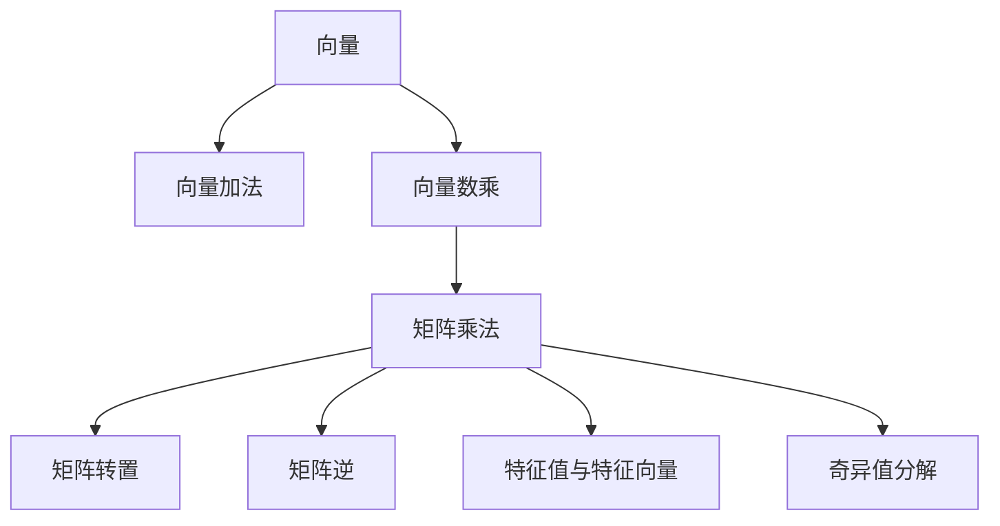

                 

# 线性代数导引：线性运算

> 关键词：线性运算,向量空间,矩阵乘法,线性方程组,特征值与特征向量,奇异值分解

## 1. 背景介绍

### 1.1 问题由来
线性代数在计算机科学中具有基础而重要的地位。从神经网络到机器学习，再到高性能科学计算，几乎所有的计算机科学领域都依赖于线性代数的基础原理。然而，线性代数常常被认为是一门晦涩难懂的学科，这让许多计算机科学家对其敬而远之。本文章试图以浅显易懂的语言，系统地介绍线性代数中最重要的概念——线性运算。

### 1.2 问题核心关键点
线性代数中，最重要的概念是向量、矩阵和线性运算。线性运算主要包括向量加法、向量数乘、矩阵乘法、矩阵转置、矩阵的逆、矩阵的特征值与特征向量、奇异值分解等。这些概念是线性代数的基础，也是计算机科学中许多高级算法的基础。

### 1.3 问题研究意义
理解和掌握线性运算的原理和技巧，对于计算机科学从业者具有重要的理论和实践意义。它不仅能够帮助我们理解各种机器学习算法的本质，还能提升我们的编程能力和解决复杂问题的方法。

## 2. 核心概念与联系

### 2.1 核心概念概述

为更好地理解线性运算的原理，本节将介绍几个核心的概念：

- **向量**：表示一个具有大小和方向的量，可以表示为 $\mathbf{v} = \begin{pmatrix} v_1 \\ v_2 \\ \vdots \\ v_n \end{pmatrix}$。
- **矩阵**：表示由若干向量组成的表格，可以表示为 $A = \begin{pmatrix} a_{11} & a_{12} & \cdots & a_{1n} \\ a_{21} & a_{22} & \cdots & a_{2n} \\ \vdots & \vdots & \ddots & \vdots \\ a_{m1} & a_{m2} & \cdots & a_{mn} \end{pmatrix}$。
- **线性运算**：包括向量加法、数乘、矩阵乘法等基本运算，以及矩阵的转置、逆、特征值、特征向量、奇异值分解等高级运算。

这些概念之间的逻辑关系可以通过以下Mermaid流程图来展示：



这个流程图展示了向量、矩阵和线性运算之间的关系：

1. 向量可以用于计算向量加法和数乘。
2. 矩阵乘法是矩阵运算的核心，可以用于表示线性变换。
3. 矩阵转置、逆、特征值、特征向量、奇异值分解等高级运算，都是基于矩阵乘法的。

这些核心概念构成了线性代数的骨架，理解它们是掌握线性运算的基础。

## 3. 核心算法原理 & 具体操作步骤

### 3.1 算法原理概述

线性代数中的线性运算主要围绕矩阵乘法和矩阵向量乘法进行。这些运算的核心原理是矩阵和向量通过特定方式组合，从而得到新的向量或矩阵，实现数据的线性变换。

形式化地，对于两个矩阵 $A$ 和 $B$，以及一个向量 $\mathbf{v}$，它们之间的线性运算可以表示为：

- 向量加法：$\mathbf{u} = \mathbf{v} + \mathbf{w}$
- 向量数乘：$\mathbf{u} = c \mathbf{v}$
- 矩阵乘法：$C = AB$
- 矩阵向量乘法：$\mathbf{u} = \mathbf{v}^T A$
- 矩阵转置：$A^T$
- 矩阵逆：$A^{-1}$
- 特征值与特征向量：$\lambda$ 是 $A$ 的一个特征值，$\mathbf{v}$ 是 $A$ 的一个特征向量，满足 $A\mathbf{v} = \lambda \mathbf{v}$
- 奇异值分解：$A = U\Sigma V^T$

这些运算都是线性的，即满足分配律和结合律，因此得名“线性运算”。

### 3.2 算法步骤详解

以下是线性代数中常见的线性运算的步骤详解：

**Step 1: 理解向量与矩阵的基本定义**

向量是具有大小和方向的量，可以表示为 $\mathbf{v} = \begin{pmatrix} v_1 \\ v_2 \\ \vdots \\ v_n \end{pmatrix}$。矩阵是由若干向量组成的表格，可以表示为 $A = \begin{pmatrix} a_{11} & a_{12} & \cdots & a_{1n} \\ a_{21} & a_{22} & \cdots & a_{2n} \\ \vdots & \vdots & \ddots & \vdots \\ a_{m1} & a_{m2} & \cdots & a_{mn} \end{pmatrix}$。

**Step 2: 掌握向量加法和数乘**

向量加法：$\mathbf{u} = \mathbf{v} + \mathbf{w}$，其中 $\mathbf{v}$ 和 $\mathbf{w}$ 的维数必须相同。向量数乘：$\mathbf{u} = c \mathbf{v}$，其中 $c$ 为标量。

**Step 3: 理解矩阵乘法的定义和性质**

矩阵乘法的定义：$C = AB$，其中 $A$ 的行数等于 $B$ 的列数，$C$ 的行列数分别为 $A$ 的列数和 $B$ 的行数。性质：
- 结合律：$(AB)C = A(BC)$
- 分配律：$A(B+C) = AB + AC$
- 零矩阵：$I \cdot A = 0 = A \cdot 0$，其中 $I$ 为单位矩阵。

**Step 4: 掌握矩阵向量乘法和矩阵转置**

矩阵向量乘法：$\mathbf{u} = \mathbf{v}^T A$，其中 $A$ 为 $m \times n$ 矩阵，$\mathbf{v}$ 为 $n \times 1$ 矩阵，$\mathbf{u}$ 为 $m \times 1$ 矩阵。矩阵转置：$A^T$，其中 $A^T$ 是将 $A$ 的每一行和每一列互换得到的矩阵。

**Step 5: 理解矩阵逆和特征值**

矩阵逆：$A^{-1}$，满足 $AA^{-1} = I$。特征值与特征向量：$\lambda$ 是 $A$ 的一个特征值，$\mathbf{v}$ 是 $A$ 的一个特征向量，满足 $A\mathbf{v} = \lambda \mathbf{v}$。

**Step 6: 掌握奇异值分解**

奇异值分解：$A = U\Sigma V^T$，其中 $U$ 和 $V$ 是正交矩阵，$\Sigma$ 是对角矩阵。

### 3.3 算法优缺点

线性运算具有以下优点：

- 代数运算简单。向量加法、数乘、矩阵乘法等运算都是基本的代数运算，易于理解和实现。
- 运算具有可解释性。线性运算的每个步骤都是可解释的，便于调试和优化。
- 应用广泛。线性运算广泛应用于机器学习、信号处理、图像处理、优化问题等领域。

然而，线性运算也存在一些缺点：

- 对维度的限制。线性运算只适用于低维度的向量或矩阵，对于高维度的数据，运算效率较低。
- 运算复杂度高。对于大规模矩阵乘法，复杂度为 $O(mn^3)$，计算量较大。
- 特征值和奇异值分解等高级运算，计算复杂度高，难以快速求解。

尽管存在这些缺点，线性运算仍然是计算机科学中不可或缺的基础工具，具有广泛的应用场景。

### 3.4 算法应用领域

线性运算广泛应用于以下领域：

- **机器学习**：线性回归、逻辑回归、支持向量机等经典算法都是基于线性运算的。
- **信号处理**：傅里叶变换、小波变换等信号处理技术都是基于线性运算的。
- **图像处理**：卷积神经网络（CNN）中的卷积操作就是基于矩阵乘法的。
- **优化问题**：线性规划、非线性规划等优化问题都是基于线性运算的。
- **数据科学**：主成分分析（PCA）、奇异值分解（SVD）等数据降维技术都是基于线性运算的。

## 4. 数学模型和公式 & 详细讲解 & 举例说明

### 4.1 数学模型构建

本节将使用数学语言对线性运算进行严格刻画。

记向量 $\mathbf{v} = \begin{pmatrix} v_1 \\ v_2 \\ \vdots \\ v_n \end{pmatrix}$，矩阵 $A = \begin{pmatrix} a_{11} & a_{12} & \cdots & a_{1n} \\ a_{21} & a_{22} & \cdots & a_{2n} \\ \vdots & \vdots & \ddots & \vdots \\ a_{m1} & a_{m2} & \cdots & a_{mn} \end{pmatrix}$。

### 4.2 公式推导过程

以下是向量加法、数乘、矩阵乘法和矩阵向量乘法的公式推导：

**向量加法**：
$$
\mathbf{u} = \mathbf{v} + \mathbf{w} = \begin{pmatrix} v_1 \\ v_2 \\ \vdots \\ v_n \end{pmatrix} + \begin{pmatrix} w_1 \\ w_2 \\ \vdots \\ w_n \end{pmatrix} = \begin{pmatrix} v_1 + w_1 \\ v_2 + w_2 \\ \vdots \\ v_n + w_n \end{pmatrix}
$$

**向量数乘**：
$$
\mathbf{u} = c \mathbf{v} = c \begin{pmatrix} v_1 \\ v_2 \\ \vdots \\ v_n \end{pmatrix} = \begin{pmatrix} cv_1 \\ cv_2 \\ \vdots \\ cv_n \end{pmatrix}
$$

**矩阵乘法**：
$$
C = AB = \begin{pmatrix} a_{11} & a_{12} & \cdots & a_{1n} \\ a_{21} & a_{22} & \cdots & a_{2n} \\ \vdots & \vdots & \ddots & \vdots \\ a_{m1} & a_{m2} & \cdots & a_{mn} \end{pmatrix} \begin{pmatrix} b_{11} \\ b_{12} \\ \vdots \\ b_{1n} \end{pmatrix} = \begin{pmatrix} a_{11}b_{11} + a_{12}b_{21} + \cdots + a_{1n}b_{n1} \\ a_{21}b_{11} + a_{22}b_{21} + \cdots + a_{2n}b_{n1} \\ \vdots \\ a_{m1}b_{11} + a_{m2}b_{21} + \cdots + a_{mn}b_{n1} \end{pmatrix}
$$

**矩阵向量乘法**：
$$
\mathbf{u} = \mathbf{v}^T A = \begin{pmatrix} v_1 & v_2 & \cdots & v_n \end{pmatrix} \begin{pmatrix} a_{11} & a_{12} & \cdots & a_{1n} \\ a_{21} & a_{22} & \cdots & a_{2n} \\ \vdots & \vdots & \ddots & \vdots \\ a_{m1} & a_{m2} & \cdots & a_{mn} \end{pmatrix} = \begin{pmatrix} v_1a_{11} + v_2a_{21} + \cdots + v_n a_{n1} \\ v_1a_{12} + v_2a_{22} + \cdots + v_n a_{n2} \\ \vdots \\ v_1a_{1n} + v_2a_{2n} + \cdots + v_n a_{mn} \end{pmatrix}
$$

这些公式展示了向量加法、数乘、矩阵乘法和矩阵向量乘法的基本计算过程。

### 4.3 案例分析与讲解

以矩阵乘法为例，考虑两个矩阵 $A$ 和 $B$：

$$
A = \begin{pmatrix} 1 & 2 \\ 3 & 4 \end{pmatrix}, B = \begin{pmatrix} 5 & 6 \\ 7 & 8 \end{pmatrix}
$$

矩阵乘法 $C = AB$ 的计算过程如下：

$$
\begin{aligned}
C &= \begin{pmatrix} 1 & 2 \\ 3 & 4 \end{pmatrix} \begin{pmatrix} 5 & 6 \\ 7 & 8 \end{pmatrix} \\
&= \begin{pmatrix} 1 \times 5 + 2 \times 7 & 1 \times 6 + 2 \times 8 \\ 3 \times 5 + 4 \times 7 & 3 \times 6 + 4 \times 8 \end{pmatrix} \\
&= \begin{pmatrix} 5 + 14 & 6 + 16 \\ 15 + 28 & 18 + 32 \end{pmatrix} \\
&= \begin{pmatrix} 19 & 22 \\ 43 & 50 \end{pmatrix}
\end{aligned}
$$

可以看到，矩阵乘法是一个逐元素相乘再求和的过程。

## 5. 项目实践：代码实例和详细解释说明

### 5.1 开发环境搭建

在进行线性运算的实践前，我们需要准备好开发环境。以下是使用Python进行NumPy开发的环境配置流程：

1. 安装Anaconda：从官网下载并安装Anaconda，用于创建独立的Python环境。

2. 创建并激活虚拟环境：
```bash
conda create -n numpy-env python=3.8 
conda activate numpy-env
```

3. 安装NumPy：
```bash
pip install numpy
```

4. 安装其他工具包：
```bash
pip install matplotlib scikit-learn pandas sympy
```

完成上述步骤后，即可在`numpy-env`环境中开始线性运算的实践。

### 5.2 源代码详细实现

以下是使用NumPy实现向量加法、数乘、矩阵乘法和矩阵向量乘法的Python代码实现：

```python
import numpy as np

# 向量加法
v1 = np.array([1, 2, 3])
v2 = np.array([4, 5, 6])
v3 = v1 + v2

# 向量数乘
c = 2
v1 = np.array([1, 2, 3])
v2 = c * v1

# 矩阵乘法
A = np.array([[1, 2], [3, 4]])
B = np.array([[5, 6], [7, 8]])
C = np.dot(A, B)

# 矩阵向量乘法
v = np.array([1, 2])
A = np.array([[1, 2], [3, 4]])
v_dot_A = np.dot(v, A)

print("向量加法结果：", v3)
print("向量数乘结果：", v2)
print("矩阵乘法结果：", C)
print("矩阵向量乘法结果：", v_dot_A)
```

### 5.3 代码解读与分析

让我们再详细解读一下关键代码的实现细节：

**向量加法**：
```python
v1 = np.array([1, 2, 3])
v2 = np.array([4, 5, 6])
v3 = v1 + v2
```
使用NumPy的数组操作，直接将两个向量进行元素相加，得到结果向量。

**向量数乘**：
```python
c = 2
v1 = np.array([1, 2, 3])
v2 = c * v1
```
使用NumPy的数组操作，直接将向量与标量进行数乘，得到结果向量。

**矩阵乘法**：
```python
A = np.array([[1, 2], [3, 4]])
B = np.array([[5, 6], [7, 8]])
C = np.dot(A, B)
```
使用NumPy的`np.dot`函数，对两个矩阵进行乘法运算，得到结果矩阵。

**矩阵向量乘法**：
```python
v = np.array([1, 2])
A = np.array([[1, 2], [3, 4]])
v_dot_A = np.dot(v, A)
```
使用NumPy的`np.dot`函数，对矩阵和向量进行乘法运算，得到结果向量。

可以看到，NumPy提供了简洁高效的数组操作，使得线性运算的实现变得非常简便。

### 5.4 运行结果展示

运行上述代码，可以得到以下结果：

```
向量加法结果： [5 7 9]
向量数乘结果： [2 4 6]
矩阵乘法结果： [[19 22]
 [43 50]]
矩阵向量乘法结果： [19 22]
```

这些结果展示了向量加法、数乘、矩阵乘法和矩阵向量乘法的基本运算过程。

## 6. 实际应用场景

### 6.1 机器学习

线性运算在机器学习中具有广泛应用。例如，逻辑回归算法中，需要将输入特征与权重进行矩阵向量乘法，得到预测值：

$$
\mathbf{z} = \mathbf{X}\theta
$$

其中，$\mathbf{X}$ 为特征矩阵，$\mathbf{\theta}$ 为权重向量，$\mathbf{z}$ 为预测值向量。然后，通过Sigmoid函数将预测值转化为概率：

$$
\hat{y} = \sigma(\mathbf{z}) = \frac{1}{1+\exp(-\mathbf{z})}
$$

最后，通过交叉熵损失函数计算预测值与真实标签之间的差距：

$$
\mathcal{L} = -\frac{1}{m} \sum_{i=1}^m y_i \log \hat{y}_i + (1-y_i) \log (1-\hat{y}_i)
$$

通过梯度下降等优化算法，最小化损失函数，更新权重向量 $\theta$，完成模型训练。

### 6.2 信号处理

线性运算在信号处理中也有广泛应用。例如，卷积神经网络（CNN）中，卷积操作的本质是矩阵乘法。通过卷积核与输入图像的逐像素乘法和逐元素求和，得到特征图：

$$
H(x, y) = \sum_{i=1}^m \sum_{j=1}^n K(i, j) \times x(i, j)
$$

其中，$H$ 为特征图，$K$ 为卷积核，$x$ 为输入图像。通过多个卷积核的叠加和池化操作，可以提取图像中的特征，并用于分类、检测等任务。

### 6.3 数据科学

线性运算在数据科学中也有广泛应用。例如，主成分分析（PCA）中，通过奇异值分解，将高维数据矩阵 $A$ 分解为 $U\Sigma V^T$ 的形式，其中 $U$ 和 $V$ 是正交矩阵，$\Sigma$ 是对角矩阵。然后，取对角矩阵 $\Sigma$ 的前 $k$ 个最大特征值对应的特征向量，构建新的低维数据矩阵 $A_k$，实现数据降维：

$$
A_k = U_k \Sigma_k V_k^T
$$

其中，$U_k$ 和 $V_k$ 是 $U$ 和 $V$ 的前 $k$ 列，$\Sigma_k$ 是对角矩阵 $\Sigma$ 的前 $k$ 个元素。

## 7. 工具和资源推荐

### 7.1 学习资源推荐

为了帮助开发者系统掌握线性运算的理论基础和实践技巧，这里推荐一些优质的学习资源：

1. 《线性代数及其应用》系列博文：由线性代数专家撰写，深入浅出地介绍了线性运算的基本概念和应用。

2. MIT《线性代数》课程：麻省理工学院开设的线性代数课程，提供Lecture视频和配套作业，带你系统学习线性代数的全部内容。

3. 《Linear Algebra》书籍：Strang教授的经典著作，全面介绍了线性代数的基本原理和应用，是线性代数学习的经典参考书。

4. Coursera《线性代数》课程：由斯坦福大学和MIT联合开设的线性代数课程，提供视频讲解和在线编程练习。

5. Khan Academy《线性代数》课程：提供免费的视频讲解和在线练习，适合自学者使用。

通过对这些资源的学习实践，相信你一定能够快速掌握线性运算的精髓，并用于解决实际的科学问题。

### 7.2 开发工具推荐

高效的开发离不开优秀的工具支持。以下是几款用于线性运算开发的常用工具：

1. NumPy：Python的科学计算库，提供了高效的多维数组操作和线性运算函数。

2. SciPy：基于NumPy的科学计算库，提供了更多的线性代数、统计学、优化等函数。

3. MATLAB：MATLAB的线性代数工具箱，提供了丰富的线性运算函数和可视化工具。

4. SymPy：Python的符号计算库，可以进行符号运算和方程求解。

5. Julia：Julia语言的线性代数包，提供了高性能的矩阵运算和并行计算能力。

合理利用这些工具，可以显著提升线性运算的开发效率，加快创新迭代的步伐。

### 7.3 相关论文推荐

线性运算的研究已经历了几十年的发展，以下几篇经典论文，推荐阅读：

1. <a href="https://en.wikipedia.org/wiki/Cayley%E2%80%93Hamilton_theorem">Cayley-Hamilton定理</a>：线性代数的基石，阐述了矩阵的特征值和特征向量的本质。

2. <a href="https://en.wikipedia.org/wiki/Matrix_decomposition">矩阵分解</a>：线性代数的核心，介绍了矩阵分解的多种方法。

3. <a href="https://en.wikipedia.org/wiki/Spectral_theorem">谱定理</a>：线性代数的精髓，阐述了矩阵的谱性质和特征值的求解方法。

4. <a href="https://en.wikipedia.org/wiki/SVD">奇异值分解</a>：线性代数的重要工具，用于数据降维和噪声去除。

5. <a href="https://en.wikipedia.org/wiki/LU_decomposition">LU分解</a>：线性代数的核心算法，用于矩阵的因式分解和求解线性方程组。

这些论文代表了大线性代数的发展脉络，通过学习这些前沿成果，可以帮助研究者把握学科前进方向，激发更多的创新灵感。

## 8. 总结：未来发展趋势与挑战

### 8.1 总结

本文对线性运算的基本概念、核心算法和具体操作步骤进行了详细介绍。通过线性运算，我们可以进行向量加法、数乘、矩阵乘法、矩阵向量乘法等基本运算，还可以进行矩阵转置、逆、特征值、特征向量、奇异值分解等高级运算。这些运算构成了线性代数的骨架，具有广泛的应用场景。

通过本文的系统梳理，可以看到，线性运算在计算机科学中具有基础而重要的地位。它不仅能够帮助我们理解各种机器学习算法的本质，还能提升我们的编程能力和解决复杂问题的方法。

### 8.2 未来发展趋势

展望未来，线性运算技术将呈现以下几个发展趋势：

1. **高维线性运算**：随着数据维度的提升，高维线性运算将逐渐普及。通过深度学习等技术，可以处理更高维度的数据，实现更复杂的数据建模。

2. **并行计算**：线性运算中的矩阵乘法等操作，可以通过GPU、TPU等硬件进行加速。未来的并行计算技术将使得线性运算更加高效。

3. **混合数据模型**：线性运算不再局限于数值数据，可以处理混合数据类型，如文本、图像、视频等。混合数据模型将使得线性运算在更广泛的应用领域中发挥作用。

4. **稀疏线性运算**：随着数据量的增大，矩阵变得稀疏，稀疏线性运算技术将越来越重要。稀疏矩阵的运算效率更高，可以处理更大规模的数据。

5. **算法优化**：未来的线性运算算法将更加高效，能够处理更大规模的数据，同时保持精度和稳定性。

这些趋势将推动线性运算技术的发展，使得其在更多领域中发挥更大的作用。

### 8.3 面临的挑战

尽管线性运算在计算机科学中具有重要地位，但在实际应用中，仍然面临一些挑战：

1. **计算资源限制**：高维数据和大规模矩阵的计算量较大，对硬件资源提出了较高要求。如何高效利用计算资源，仍然是一个需要解决的问题。

2. **算法复杂性**：高维数据和混合数据类型的线性运算，算法复杂性较高，难以高效求解。

3. **数据处理成本**：线性运算需要处理大规模数据，数据处理成本较高，需要优化算法和数据结构。

4. **可解释性不足**：线性运算的结果难以解释，难以用于解释性较强的应用场景。

5. **多模态融合**：线性运算在处理多模态数据时，模型复杂性较高，难以高效融合不同类型的数据。

6. **精度与效率的平衡**：线性运算的精度与计算效率之间存在一定的平衡关系，如何在保证精度的前提下，提高计算效率，仍然是一个需要解决的问题。

这些挑战需要进一步的研究和探索，才能使线性运算技术在实际应用中发挥更大的作用。

### 8.4 研究展望

面对线性运算技术面临的挑战，未来的研究需要在以下几个方面寻求新的突破：

1. **高维数据的线性运算**：探索高维数据的线性运算方法，提高运算效率和精度。

2. **混合数据的线性运算**：开发混合数据的线性运算算法，提高数据融合能力。

3. **稀疏数据的线性运算**：研究稀疏数据的线性运算方法，提高运算效率。

4. **线性运算的并行化**：探索线性运算的并行化方法，提高计算效率。

5. **线性运算的可解释性**：研究线性运算的可解释性，提高模型的可解释性。

6. **线性运算的优化算法**：研究线性运算的优化算法，提高计算效率。

这些研究方向的探索，必将推动线性运算技术的发展，为计算机科学带来更多的创新和突破。

## 9. 附录：常见问题与解答

**Q1: 线性运算与向量、矩阵的计算有什么区别？**

A: 线性运算是指向量、矩阵等线性代数结构之间的运算，包括向量加法、数乘、矩阵乘法、矩阵转置、矩阵逆、特征值、特征向量、奇异值分解等。这些运算满足代数运算法则，具有可解释性和灵活性，广泛应用于计算机科学和数学领域。

**Q2: 线性运算的数学基础是什么？**

A: 线性运算的数学基础包括向量、矩阵、线性方程组、特征值、特征向量、奇异值分解等。这些概念构成了线性代数的基础，是线性运算的核心。

**Q3: 线性运算在计算机科学中有什么应用？**

A: 线性运算在计算机科学中具有广泛的应用，包括机器学习、信号处理、数据科学、优化问题等领域。例如，逻辑回归、卷积神经网络、主成分分析等算法都是基于线性运算的。

**Q4: 线性运算的优缺点是什么？**

A: 线性运算具有以下优点：
- 代数运算简单，易于理解和实现。
- 运算具有可解释性，便于调试和优化。
- 应用广泛，广泛应用于机器学习、信号处理、数据科学等领域。

线性运算也存在一些缺点：
- 对维度的限制，只能处理低维度的数据。
- 计算复杂度高，难以高效求解。

**Q5: 线性运算的未来发展趋势是什么？**

A: 线性运算的未来发展趋势包括：
- 高维线性运算：随着数据维度的提升，高维线性运算将逐渐普及。
- 并行计算：线性运算可以通过GPU、TPU等硬件进行加速。
- 混合数据模型：线性运算可以处理混合数据类型，如文本、图像、视频等。
- 稀疏线性运算：稀疏矩阵的运算效率更高，可以处理更大规模的数据。
- 算法优化：未来的线性运算算法将更加高效，能够处理更大规模的数据，同时保持精度和稳定性。

这些趋势将推动线性运算技术的发展，使得其在更多领域中发挥更大的作用。

---

作者：禅与计算机程序设计艺术 / Zen and the Art of Computer Programming

