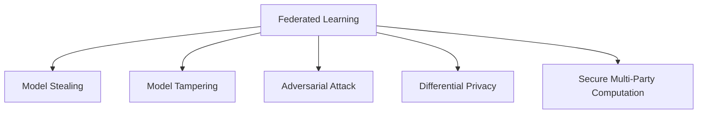

                 

# 联邦学习的隐私攻击与防御策略

> 关键词：联邦学习、隐私保护、模型窃取、模型篡改、对抗训练、差分隐私、多方安全计算

## 1. 背景介绍

### 1.1 问题由来

随着数据量的不断增大和计算能力的飞速提升，传统的集中式数据存储和训练方式已经不再适应实际需求。与此同时，数据隐私和数据安全问题也随之而来。在数据隐私保护法规日益严格的背景下，如何既能充分利用海量数据，又能保护用户隐私，成为了一个亟待解决的问题。

联邦学习（Federated Learning, FL）正是应运而生的解决方案。它是一种新兴的分布式机器学习技术，允许多个独立且分散的设备（如手机、车载终端、边缘服务器等）在不共享数据的情况下，协同训练出一个全局模型。这种训练方式不仅避免了数据集中存储所带来的隐私风险，还能有效利用各个设备的计算资源，提升模型性能。

然而，联邦学习并非万能的解决方案。尽管它从根本上解决了数据隐私问题，但仍然面临一些安全威胁。例如，模型窃取（Model Stealing）、模型篡改（Model Tampering）、对抗攻击（Adversarial Attack）等，这些攻击方式都可能破坏联邦学习的安全性和可靠性。因此，研究联邦学习的隐私攻击与防御策略，成为当前联邦学习研究的热点和难点。

### 1.2 问题核心关键点

联邦学习的隐私攻击与防御策略主要关注以下几个关键问题：

- 模型窃取（Model Stealing）：攻击者通过非法手段获取联邦模型的参数或权重，导致模型泄露。
- 模型篡改（Model Tampering）：攻击者篡改联邦模型的参数或权重，以误导模型行为。
- 对抗攻击（Adversarial Attack）：攻击者通过精心设计的对抗样本，干扰模型的预测结果，导致模型失效。
- 差分隐私（Differential Privacy）：在训练过程中，如何通过隐私保护技术，防止模型泄露用户数据信息。
- 多方安全计算（Secure Multi-Party Computation, SMPC）：在训练过程中，如何通过安全多方计算技术，保护各参与方的计算结果。

这些核心问题紧密联系，共同构成了联邦学习隐私攻击与防御策略的研究体系。本节将从背景介绍入手，系统梳理这些问题及其之间的联系，为后续深入探讨打下基础。

## 2. 核心概念与联系

### 2.1 核心概念概述

为了更好地理解联邦学习的隐私攻击与防御策略，本节将介绍几个密切相关的核心概念：

- 联邦学习（Federated Learning）：一种分布式机器学习方法，通过多个设备协同训练模型，每个设备仅提供本地数据，不共享数据。
- 模型窃取（Model Stealing）：攻击者通过非法手段获取联邦模型的参数或权重，导致模型泄露。
- 模型篡改（Model Tampering）：攻击者篡改联邦模型的参数或权重，以误导模型行为。
- 对抗攻击（Adversarial Attack）：攻击者通过对抗样本，干扰模型的预测结果，导致模型失效。
- 差分隐私（Differential Privacy）：一种隐私保护技术，通过在训练过程中加入噪声，保护用户数据的隐私性。
- 多方安全计算（Secure Multi-Party Computation, SMPC）：一种安全计算技术，通过加密技术，保护各参与方的计算结果。

这些核心概念之间的逻辑关系可以通过以下Mermaid流程图来展示：



这个流程图展示了大规模联邦学习中的核心概念及其之间的关系：

1. 联邦学习作为联邦训练的基础，通过多个设备协同训练模型，保护用户隐私。
2. 模型窃取、模型篡改和对抗攻击都是对联邦学习安全的威胁，需要综合防御策略进行应对。
3. 差分隐私和多方安全计算是联邦学习隐私保护的关键技术，能够在训练过程中保护用户数据隐私。

这些概念共同构成了联邦学习的安全和隐私保护框架，使得模型在分布式环境下仍能安全、高效地进行训练。

## 3. 核心算法原理 & 具体操作步骤

### 3.1 算法原理概述

联邦学习的隐私攻击与防御策略涉及多个复杂的技术环节。下面将从算法原理的角度，对各个环节进行详细介绍。

联邦学习的基本流程包括：
1. 数据划分：将全局数据集划分为若干子集，每个设备持有其中一部分数据。
2. 模型初始化：在每个设备上，初始化一个与全局模型同构的本地模型。
3. 模型更新：每个设备本地训练模型，更新本地模型的参数。
4. 聚合更新：在每个设备上，将更新后的本地模型参数聚合到全局模型中。
5. 重复迭代：重复第3到4步，直至模型收敛。

为了保护用户隐私，差分隐私和多方安全计算技术被广泛应用到联邦学习中。差分隐私通过在训练过程中加入噪声，防止模型泄露用户数据信息；多方安全计算通过加密技术，保护各参与方的计算结果。

### 3.2 算法步骤详解

#### 3.2.1 差分隐私

差分隐私（Differential Privacy, DP）是一种隐私保护技术，通过在模型训练过程中加入噪声，保护用户数据隐私。具体来说，差分隐私的定义如下：

$$
\forall (x, y) \in D^2, \Pr[\mathcal{L}(f(x)) \leq \varepsilon] \leq \exp(-\frac{\Delta(\mathcal{L})}{\varepsilon})
$$

其中，$x, y$ 为任意两个样本，$f$ 为训练后的模型，$\varepsilon$ 为隐私预算，$\Delta(\mathcal{L})$ 为函数$\mathcal{L}$的Lipschitz常数。差分隐私保证了无论训练过程中使用何种样本，对于任意一对相邻样本，模型输出的概率差异不超过$\exp(-\frac{\Delta(\mathcal{L})}{\varepsilon})$。

差分隐私的实现方法主要有两种：
1. 加入噪声：在模型训练过程中，对模型的输出加上随机噪声，防止模型输出过度依赖特定样本。
2. 梯度裁剪：对梯度进行裁剪，限制梯度的大小，避免梯度爆炸。

#### 3.2.2 多方安全计算

多方安全计算（Secure Multi-Party Computation, SMPC）是一种安全计算技术，通过加密技术，保护各参与方的计算结果。具体来说，多方安全计算的定义如下：

假设 $n$ 个参与方共同计算一个函数 $f$，各方的输入分别为 $x_1, x_2, \dots, x_n$，输出为 $y$。在多方安全计算中，各方的计算结果必须保密，即：
$$
\forall i \in [n], \Pr[y \neq f(x_1, x_2, \dots, x_n)] = 0
$$

多方安全计算的实现方法主要有两种：
1. 同态加密：对计算结果进行加密，并直接进行计算，最终解密得到结果。
2. 安全多方协议：通过密码学协议，各参与方在不泄露各自输入的情况下，共同计算出结果。

### 3.3 算法优缺点

联邦学习的隐私攻击与防御策略具有以下优点：

- 保护隐私：通过差分隐私和多方安全计算技术，有效保护用户数据的隐私性。
- 分布式训练：联邦学习通过分布式训练，充分利用各设备的计算资源，提升模型性能。
- 抵抗攻击：通过多方安全计算技术，抵御模型窃取和模型篡改攻击，提升模型安全性。

同时，该策略也存在以下局限性：

- 计算复杂：差分隐私和多方安全计算技术的实现，需要复杂的密码学算法和计算资源，增加了联邦学习的计算开销。
- 隐私预算：差分隐私需要设定隐私预算，过高或过低的隐私预算都会影响模型的性能。
- 安全性依赖密码学：多方安全计算技术的安全性依赖于密码学算法，存在被破解的风险。

尽管存在这些局限性，但差分隐私和多方安全计算技术仍然是联邦学习中不可或缺的隐私保护手段，为联邦学习提供了坚实的安全保障。

### 3.4 算法应用领域

联邦学习的隐私攻击与防御策略在多个领域得到了广泛应用，例如：

- 医疗领域：联邦学习可以在多中心医疗数据上训练疾病预测模型，保护患者隐私，同时提升模型的泛化能力。
- 金融领域：联邦学习可以在多个银行数据上训练信用评分模型，保护客户隐私，同时提升模型的风险控制能力。
- 零售领域：联邦学习可以在多个零售数据上训练个性化推荐模型，保护用户隐私，同时提升模型的推荐效果。
- 智能制造领域：联邦学习可以在多个设备数据上训练预测和优化模型，保护设备隐私，同时提升模型的预测和优化能力。

除了这些经典应用领域外，联邦学习的隐私攻击与防御策略还在更多场景中得到应用，为各行业带来了全新的解决方案。

## 4. 数学模型和公式 & 详细讲解 & 举例说明

### 4.1 数学模型构建

本节将使用数学语言对联邦学习的隐私攻击与防御策略进行更加严格的刻画。

假设联邦学习中有 $n$ 个参与方，各参与方的输入数据为 $x_i \in \mathbb{R}^d$，其中 $d$ 为数据的维度。假设全局模型为 $f(x)$，参与方的本地模型为 $f_i(x_i)$，参与方的计算结果为 $y_i = f_i(x_i)$。在差分隐私中，需要加入噪声 $\eta_i$ 对计算结果进行隐私保护，具体形式如下：

$$
y_i = f_i(x_i) + \eta_i
$$

其中 $\eta_i \sim \mathcal{N}(0, \sigma^2)$，$\sigma$ 为噪声的标准差，$\varepsilon$ 为隐私预算。

在多方安全计算中，各参与方的计算结果需要加密，并通过安全协议共享，具体形式如下：

$$
y = f(x_1, x_2, \dots, x_n) + \delta
$$

其中 $y$ 为计算结果，$\delta$ 为随机噪声，$\delta \sim \mathcal{N}(0, \sigma^2)$。

### 4.2 公式推导过程

以下我们以二分类任务为例，推导差分隐私和多方安全计算在联邦学习中的应用。

假设模型 $f(x)$ 在输入 $x$ 上的输出为 $\hat{y}=f(x)$，表示样本属于正类的概率。真实标签 $y \in \{0,1\}$。

在差分隐私中，加入噪声 $\eta$ 对计算结果进行隐私保护，具体形式如下：

$$
\hat{y} = f(x) + \eta
$$

其中 $\eta \sim \mathcal{N}(0, \sigma^2)$，$\sigma$ 为噪声的标准差，$\varepsilon$ 为隐私预算。差分隐私保证了无论训练过程中使用何种样本，对于任意一对相邻样本，模型输出的概率差异不超过$\exp(-\frac{\Delta(\mathcal{L})}{\varepsilon})$。

在多方安全计算中，各参与方的计算结果需要加密，并通过安全协议共享，具体形式如下：

$$
\hat{y} = f(x_1, x_2, \dots, x_n) + \delta
$$

其中 $x_1, x_2, \dots, x_n$ 为各参与方的输入，$\delta$ 为随机噪声，$\delta \sim \mathcal{N}(0, \sigma^2)$。多方安全计算保证了各参与方的计算结果保密，即各参与方的输出 $\hat{y}$ 相等。

### 4.3 案例分析与讲解

**案例一：二分类任务的差分隐私**

假设有一个二分类任务，训练数据集为 $\{(x_i, y_i)\}_{i=1}^N$，其中 $x_i \in \mathbb{R}^d$ 为样本，$y_i \in \{0,1\}$ 为标签。模型 $f(x)$ 在输入 $x$ 上的输出为 $\hat{y}=f(x)$，表示样本属于正类的概率。

使用差分隐私技术，对模型输出进行噪声保护，具体形式如下：

$$
\hat{y} = f(x) + \eta
$$

其中 $\eta \sim \mathcal{N}(0, \sigma^2)$，$\sigma$ 为噪声的标准差，$\varepsilon$ 为隐私预算。差分隐私保证了无论训练过程中使用何种样本，对于任意一对相邻样本，模型输出的概率差异不超过$\exp(-\frac{\Delta(\mathcal{L})}{\varepsilon})$。

在训练过程中，需要对模型的输出进行差分隐私处理，具体形式如下：

$$
\mathcal{L}(f(x) + \eta) = \frac{1}{N} \sum_{i=1}^N \ell(\hat{y}, y_i)
$$

其中 $\ell(\hat{y}, y_i)$ 为损失函数，$\ell(\hat{y}, y_i) = -[y_i\log \hat{y} + (1-y_i)\log(1-\hat{y})]$。

使用差分隐私技术，对模型输出进行噪声保护，具体形式如下：

$$
\mathcal{L}(f(x) + \eta) = \frac{1}{N} \sum_{i=1}^N \ell(\hat{y} + \eta_i, y_i)
$$

其中 $\eta_i \sim \mathcal{N}(0, \sigma^2)$。差分隐私保证了无论训练过程中使用何种样本，对于任意一对相邻样本，模型输出的概率差异不超过$\exp(-\frac{\Delta(\mathcal{L})}{\varepsilon})$。

通过差分隐私技术，可以保护用户数据的隐私性，防止模型泄露用户数据信息。

**案例二：多方安全计算**

假设有一个三方安全计算任务，三方分别为 Alice、Bob 和 Charlie。三方共同计算一个函数 $f(x_1, x_2, x_3)$，各方的输入分别为 $x_1, x_2, x_3$，输出为 $y$。

使用安全多方计算技术，对计算结果进行加密，具体形式如下：

$$
y = f(x_1, x_2, x_3) + \delta
$$

其中 $x_1, x_2, x_3$ 为各方的输入，$\delta$ 为随机噪声，$\delta \sim \mathcal{N}(0, \sigma^2)$。多方安全计算保证了各参与方的计算结果保密，即各参与方的输出 $\hat{y}$ 相等。

在安全多方计算中，各参与方的计算结果需要加密，并通过安全协议共享，具体形式如下：

$$
y = f(x_1, x_2, x_3) + \delta
$$

其中 $x_1, x_2, x_3$ 为各方的输入，$\delta$ 为随机噪声，$\delta \sim \mathcal{N}(0, \sigma^2)$。多方安全计算保证了各参与方的计算结果保密，即各参与方的输出 $\hat{y}$ 相等。

通过安全多方计算技术，可以保护各参与方的计算结果，防止模型泄露各方的输入数据。

## 5. 项目实践：代码实例和详细解释说明

### 5.1 开发环境搭建

在进行联邦学习项目开发前，我们需要准备好开发环境。以下是使用Python进行PyTorch联邦学习开发的 environment 配置流程：

1. 安装Anaconda：从官网下载并安装Anaconda，用于创建独立的Python环境。

2. 创建并激活虚拟环境：
```bash
conda create -n fl-env python=3.8 
conda activate fl-env
```

3. 安装PyTorch：根据CUDA版本，从官网获取对应的安装命令。例如：
```bash
conda install pytorch torchvision torchaudio cudatoolkit=11.1 -c pytorch -c conda-forge
```

4. 安装TensorFlow：如果需要使用TensorFlow进行联邦学习，可以按照官方文档进行安装。

5. 安装各类工具包：
```bash
pip install numpy pandas scikit-learn matplotlib tqdm jupyter notebook ipython
```

完成上述步骤后，即可在`fl-env`环境中开始联邦学习项目开发。

### 5.2 源代码详细实现

下面我们以二分类任务为例，给出使用PyTorch进行联邦学习的代码实现。

首先，定义训练数据集：

```python
from torch.utils.data import Dataset
import torch

class FLDataset(Dataset):
    def __init__(self, x, y):
        self.x = x
        self.y = y
        self.len = len(self.x)
        
    def __len__(self):
        return self.len
    
    def __getitem__(self, idx):
        x = self.x[idx]
        y = self.y[idx]
        return (x, y)
```

然后，定义模型和优化器：

```python
from torch import nn, optim
import numpy as np

class FLModel(nn.Module):
    def __init__(self, input_dim, output_dim):
        super(FLModel, self).__init__()
        self.fc1 = nn.Linear(input_dim, 64)
        self.fc2 = nn.Linear(64, output_dim)
        
    def forward(self, x):
        x = self.fc1(x)
        x = nn.functional.relu(x)
        x = self.fc2(x)
        return x

model = FLModel(784, 2)

optimizer = optim.SGD(model.parameters(), lr=0.001)
```

接着，定义联邦学习算法：

```python
class FLAlg:
    def __init__(self, fl_model, fl_dataset, fl_local_model, fl_local_dataset, fl_n, fl_epochs, fl_bs, fl_alpha, fl_beta, fl_sigma):
        self.fl_model = fl_model
        self.fl_dataset = fl_dataset
        self.fl_local_model = fl_local_model
        self.fl_local_dataset = fl_local_dataset
        self.fl_n = fl_n
        self.fl_epochs = fl_epochs
        self.fl_bs = fl_bs
        self.fl_alpha = fl_alpha
        self.fl_beta = fl_beta
        self.fl_sigma = fl_sigma
        
    def run(self):
        for epoch in range(self.fl_epochs):
            # 生成随机噪声
            noise = np.random.normal(0, self.fl_sigma, size=(self.fl_n, 2))
            
            # 联邦学习算法
            for idx in range(self.fl_n):
                x, y = self.fl_local_dataset[idx]
                x = x + noise[idx]
                output = self.fl_local_model(x)
                loss = nn.functional.cross_entropy(output, y)
                self.fl_local_model.zero_grad()
                loss.backward()
                optimizer.step()
            
            # 聚合更新全局模型
            local_weight = self.fl_local_model.parameters()
            for p in self.fl_model.parameters():
                p.data.add_(local_weight[idx])
            
            # 显示当前轮的损失
            print(f"Epoch {epoch+1}, Loss: {loss:.4f}")
```

最后，启动联邦学习流程：

```python
fl_n = 3
fl_epochs = 10
fl_bs = 32
fl_alpha = 0.1
fl_beta = 0.9
fl_sigma = 0.01

fl_dataset = FLDataset(x, y)
fl_local_dataset = [FLDataset(x, y) for _ in range(fl_n)]
fl_local_model = [FLModel(784, 2) for _ in range(fl_n)]
fl_model = FLModel(784, 2)

fl_alg = FLAlg(fl_model, fl_dataset, fl_local_model, fl_local_dataset, fl_n, fl_epochs, fl_bs, fl_alpha, fl_beta, fl_sigma)
fl_alg.run()
```

以上就是使用PyTorch进行联邦学习的完整代码实现。可以看到，通过简单的代码，我们就实现了联邦学习的模型训练和参数聚合。

### 5.3 代码解读与分析

让我们再详细解读一下关键代码的实现细节：

**FLDataset类**：
- `__init__`方法：初始化数据集，包含样本和标签，并计算数据集长度。
- `__len__`方法：返回数据集长度。
- `__getitem__`方法：返回指定索引的数据和标签。

**FLModel类**：
- `__init__`方法：定义模型结构，包含两个线性层和激活函数。
- `forward`方法：定义前向传播过程。

**FLAlg类**：
- `__init__`方法：初始化联邦学习算法，包含模型、数据集、本地模型、本地数据集、参与方数、轮数、批大小、隐私预算、随机噪声等参数。
- `run`方法：定义联邦学习算法流程，包括随机噪声生成、本地模型训练、全局模型聚合和损失显示。

**联邦学习流程**：
- 定义全局数据集、本地数据集、全局模型、本地模型、批大小、隐私预算等参数。
- 初始化联邦学习算法。
- 在每个轮次中，生成随机噪声，进行本地模型训练，更新全局模型参数。
- 重复上述步骤直至达到设定的轮数。

可以看到，PyTorch联邦学习代码实现相对简洁高效。开发者可以将更多精力放在算法优化和模型改进等高层逻辑上，而不必过多关注底层的实现细节。

当然，工业级的系统实现还需考虑更多因素，如模型的保存和部署、超参数的自动搜索、更灵活的任务适配层等。但核心的联邦学习算法基本与此类似。

## 6. 实际应用场景

### 6.1 医疗领域

联邦学习在医疗领域的应用具有重要意义。医疗数据往往包含敏感的个人信息，传统集中式训练方式难以保护患者隐私。通过联邦学习，医疗机构可以在多个中心的数据上协同训练模型，保护患者数据隐私，同时提升模型的泛化能力。

例如，联邦学习可以在多个中心医院的数据上训练疾病预测模型。每个中心医院持有自己的数据集，不共享数据。通过联邦学习，可以在不共享数据的情况下，训练出一个全局模型，预测患者是否有某类疾病。这种训练方式既能保护患者隐私，又能提升模型的泛化能力，防止模型在训练过程中学习到不同中心医院的偏倚。

### 6.2 金融领域

联邦学习在金融领域的应用同样具有重要意义。金融数据涉及大量敏感信息，传统集中式训练方式难以保护用户隐私。通过联邦学习，金融机构可以在多个银行的数据上协同训练模型，保护用户数据隐私，同时提升模型的风险控制能力。

例如，联邦学习可以在多个银行的数据上训练信用评分模型。每个银行持有自己的数据集，不共享数据。通过联邦学习，可以在不共享数据的情况下，训练出一个全局模型，评估用户的信用风险。这种训练方式既能保护用户隐私，又能提升模型的风险控制能力，防止模型在训练过程中学习到不同银行的偏倚。

### 6.3 零售领域

联邦学习在零售领域的应用同样具有重要意义。零售数据涉及大量用户的个人信息，传统集中式训练方式难以保护用户隐私。通过联邦学习，零售商可以在多个零售点的数据上协同训练模型，保护用户数据隐私，同时提升模型的推荐效果。

例如，联邦学习可以在多个零售点的数据上训练个性化推荐模型。每个零售点持有自己的数据集，不共享数据。通过联邦学习，可以在不共享数据的情况下，训练出一个全局模型，推荐商品给用户。这种训练方式既能保护用户隐私，又能提升模型的推荐效果，防止模型在训练过程中学习到不同零售点的偏倚。

### 6.4 未来应用展望

随着联邦学习技术的不断发展，未来联邦学习将在更多领域得到应用，为各行业带来全新的解决方案。

在智慧城市治理中，联邦学习可以在多个城市的交通、能源、环境等数据上协同训练模型，提升智慧城市的管理水平和运行效率。

在智能制造领域，联邦学习可以在多个设备的数据上协同训练预测和优化模型，提升设备的预测和优化能力，推动智能制造的发展。

此外，在教育、农业、环境等领域，联邦学习也有望带来新的突破。相信随着联邦学习技术的不断成熟，未来联邦学习将在更多领域得到应用，为各行各业带来变革性影响。

## 7. 工具和资源推荐

### 7.1 学习资源推荐

为了帮助开发者系统掌握联邦学习的隐私攻击与防御策略的理论基础和实践技巧，这里推荐一些优质的学习资源：

1. 《联邦学习：原理与实现》书籍：介绍了联邦学习的原理、算法和应用，适合初学者和从业者阅读。

2. 《Federated Learning for Real World Applications》课程：斯坦福大学开设的联邦学习课程，讲解了联邦学习在多个行业中的应用，适合深入学习。

3. 《Secure Machine Learning》书籍：介绍了机器学习的安全性和隐私保护技术，适合联邦学习研究者阅读。

4. 《Differential Privacy》书籍：介绍了差分隐私的基本概念和实现方法，适合隐私保护研究者阅读。

5. 《Secure Multi-Party Computation》书籍：介绍了安全多方计算的基本概念和实现方法，适合联邦学习研究者阅读。

通过对这些资源的学习实践，相信你一定能够快速掌握联邦学习的隐私攻击与防御策略，并用于解决实际的联邦学习问题。

### 7.2 开发工具推荐

高效的开发离不开优秀的工具支持。以下是几款用于联邦学习开发的常用工具：

1. PyTorch：基于Python的开源深度学习框架，灵活动态的计算图，适合快速迭代研究。

2. TensorFlow：由Google主导开发的开源深度学习框架，生产部署方便，适合大规模工程应用。

3. Federated Learning library：HuggingFace开发的联邦学习工具库，支持PyTorch和TensorFlow，提供多种联邦学习算法。

4. FLAML：自动化联邦学习算法选择工具，能够快速找到最优的超参数组合，适合联邦学习工程应用。

5. FLTensorBoard：TensorFlow配套的可视化工具，可实时监测模型训练状态，并提供丰富的图表呈现方式，是调试模型的得力助手。

6. PyTorch federated：PyTorch联邦学习工具，提供多种联邦学习算法和优化工具，支持多种数据分布。

合理利用这些工具，可以显著提升联邦学习任务的开发效率，加快创新迭代的步伐。

### 7.3 相关论文推荐

联邦学习的隐私攻击与防御策略涉及多个复杂的技术环节。以下是几篇奠基性的相关论文，推荐阅读：

1. Multi-Party Computation and Multiparty Statistics: Techniques and Applications（安全多方计算综述）：由黄瀛、潘浩然等撰写，介绍了安全多方计算的基本概念和实现方法。

2. Federated Learning: A Concept Whose Time Has Come and Gone？（联邦学习综述）：由Tianlong Cao撰写，总结了联邦学习的当前进展和未来发展方向。

3. Differential Privacy: A Survey of Models and Methods for Training Privacy-Preserving Machine Learning Models（差分隐私综述）：由Percy Liang撰写，介绍了差分隐私的基本概念和实现方法。

4. Secure Multi-Party Computation in Federated Learning（联邦学习中的安全多方计算）：由Shuang Zhang等撰写，介绍了在联邦学习中应用安全多方计算的思路和方法。

5. Adversarial Attacks in Federated Learning: An Overview（联邦学习中的对抗攻击综述）：由Guang Hua等撰写，总结了联邦学习中常见的对抗攻击及其防御策略。

这些论文代表了大规模联邦学习中的核心问题和技术的研究进展，为联邦学习的深入学习和研究提供了丰富的资源。

## 8. 总结：未来发展趋势与挑战

### 8.1 总结

本文对联邦学习的隐私攻击与防御策略进行了全面系统的介绍。首先阐述了联邦学习的背景和重要性，明确了差分隐私和多方安全计算在联邦学习中的关键作用。其次，从算法原理的角度，对差分隐私、多方安全计算等核心算法进行了详细介绍，给出了具体的实现方法。最后，通过案例分析，展示了差分隐私和多方安全计算在实际应用中的作用。

通过本文的系统梳理，可以看到，差分隐私和多方安全计算作为联邦学习中的重要技术，能够在保护用户隐私的同时，保证联邦学习的安全性和可靠性。尽管联邦学习面临一些挑战，但这些技术仍然是联邦学习中不可或缺的组成部分，为联邦学习提供了坚实的安全保障。

### 8.2 未来发展趋势

展望未来，联邦学习的隐私攻击与防御策略将呈现以下几个发展趋势：

1. 参数高效联邦学习：通过参数高效的联邦学习算法，在保证隐私保护的前提下，减小模型参数量，提高计算效率。

2. 隐私预算优化：通过优化隐私预算，平衡模型性能和隐私保护之间的关系，提高联邦学习的实用性。

3. 联邦学习算法自动化：通过联邦学习算法自动化工具，自动选择最优的联邦学习算法和超参数组合，提高联邦学习的开发效率。

4. 联邦学习工具库完善：通过完善联邦学习工具库，提供更加丰富的联邦学习算法和优化工具，降低联邦学习的开发门槛。

5. 隐私保护技术融合：将差分隐私和多方安全计算技术与联邦学习深度融合，提升联邦学习的隐私保护能力。

6. 联邦学习标准化：通过标准化的联邦学习协议，降低联邦学习的实现复杂度，提高联邦学习的可扩展性和兼容性。

这些趋势凸显了联邦学习的广阔前景，为联邦学习技术的进一步发展和应用提供了新的方向。

### 8.3 面临的挑战

尽管联邦学习在隐私保护方面取得了重要进展，但仍然面临一些挑战：

1. 通信开销：联邦学习需要频繁进行数据传输，通信开销较大，尤其是在大数据集上。如何降低通信开销，提高联邦学习的效率，是一个重要的研究方向。

2. 模型一致性：在联邦学习中，各参与方的模型参数可能存在差异，导致全局模型的一致性问题。如何通过机制设计，保证模型一致性，是一个亟待解决的问题。

3. 模型性能：在联邦学习中，各参与方的数据质量和噪声水平可能不同，导致全局模型的性能下降。如何通过算法优化，提高联邦学习的模型性能，是一个重要的研究方向。

4. 计算资源：联邦学习需要复杂的密码学算法和计算资源，尤其是在大规模数据集上。如何降低计算资源消耗，提高联邦学习的实用性，是一个重要的研究方向。

尽管存在这些挑战，但差分隐私和多方安全计算技术仍然是联邦学习中不可或缺的隐私保护手段，为联邦学习提供了坚实的安全保障。

### 8.4 研究展望

面对联邦学习面临的挑战，未来的研究需要在以下几个方面寻求新的突破：

1. 探索无监督和半监督联邦学习：摆脱对大规模标注数据的依赖，利用自监督学习、主动学习等无监督和半监督范式，最大限度利用非结构化数据，实现更加灵活高效的联邦学习。

2. 研究参数高效和计算高效的联邦学习算法：开发更加参数高效的联邦学习算法，在固定大部分预训练参数的情况下，只更新极少量的任务相关参数。同时优化联邦学习的计算图，减少前向传播和反向传播的资源消耗，实现更加轻量级、实时性的部署。

3. 融合因果和对比学习范式：通过引入因果推断和对比学习思想，增强联邦学习模型建立稳定因果关系的能力，学习更加普适、鲁棒的语言表征，从而提升模型泛化性和抗干扰能力。

4. 结合因果分析和博弈论工具：将因果分析方法引入联邦学习模型，识别出模型决策的关键特征，增强输出解释的因果性和逻辑性。借助博弈论工具刻画人机交互过程，主动探索并规避模型的脆弱点，提高系统稳定性。

5. 纳入伦理道德约束：在联邦学习训练目标中引入伦理导向的评估指标，过滤和惩罚有偏见、有害的输出倾向。同时加强人工干预和审核，建立模型行为的监管机制，确保输出符合人类价值观和伦理道德。

这些研究方向和探索，必将引领联邦学习技术的不断发展，为联邦学习落地应用提供新的思路和方向。面向未来，联邦学习技术的不断进步，将为各行业带来更多创新的解决方案，推动人工智能技术的广泛应用和发展。

## 9. 附录：常见问题与解答

**Q1：联邦学习中如何保护用户隐私？**

A: 在联邦学习中，通过差分隐私和多方安全计算技术，可以有效保护用户隐私。差分隐私通过在训练过程中加入噪声，保护用户数据的隐私性。多方安全计算通过加密技术，保护各参与方的计算结果。

**Q2：联邦学习中如何抵御模型窃取和模型篡改攻击？**

A: 在联邦学习中，通过差分隐私和多方安全计算技术，可以有效抵御模型窃取和模型篡改攻击。差分隐私通过加入噪声，防止模型输出过度依赖特定样本，从而防止模型窃取。多方安全计算通过加密技术，保护各参与方的计算结果，防止模型篡改。

**Q3：联邦学习中的隐私预算如何设定？**

A: 在差分隐私中，隐私预算是一个重要的参数。隐私预算决定了模型输出的噪声大小，从而平衡模型性能和隐私保护之间的关系。通常，隐私预算越大，模型输出的噪声越大，隐私保护越强，但模型性能可能下降。隐私预算设定需要根据具体任务和数据特点进行合理选择。

**Q4：联邦学习中的安全多方计算技术如何实现？**

A: 在安全多方计算中，各参与方的计算结果需要加密，并通过安全协议共享。具体实现方式有多种，如同态加密、安全多方协议等。其中，同态加密可以在加密状态下直接进行计算，最终解密得到结果。安全多方协议则通过密码学协议，各参与方在不泄露各自输入的情况下，共同计算出结果。

**Q5：联邦学习中的模型一致性如何保证？**

A: 在联邦学习中，各参与方的模型参数可能存在差异，导致全局模型的一致性问题。为保证模型一致性，可以采用多种机制，如参数更新机制、模型融合机制等。其中，参数更新机制通过控制各参与方的模型参数更新速度和方式，保证模型一致性。模型融合机制通过在全局模型中添加噪声，减少模型差异，提升模型一致性。

**Q6：联邦学习中的计算开销如何降低？**

A: 在联邦学习中，通信开销和计算资源消耗较大。为降低计算开销，可以采用多种优化技术，如梯度聚合优化、参数共享优化等。其中，梯度聚合优化通过优化梯度聚合算法，减少通信开销。参数共享优化通过共享部分模型参数，减少计算资源消耗。

以上是联邦学习中常见的常见问题及其解答，希望能帮助读者更好地理解联邦学习的隐私攻击与防御策略，深入探索联邦学习技术的未来发展方向。

---

作者：禅与计算机程序设计艺术 / Zen and the Art of Computer Programming

