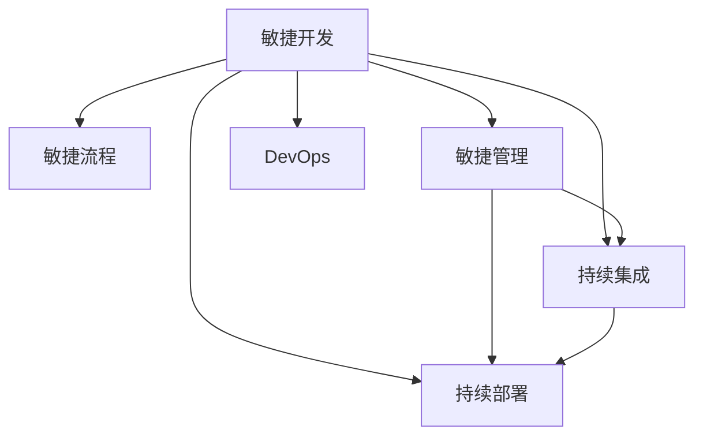

                 

# 自动化创业中的敏捷开发方法

> 关键词：敏捷开发, 创业, 软件工程, 自动化, 团队协作, 持续集成, 持续部署, DevOps, 敏捷流程, 敏捷管理

## 1. 背景介绍

### 1.1 问题由来
随着技术的迅猛发展，自动化已经成为推动各行各业快速发展的关键因素。特别是在创业领域，灵活应对市场变化、快速迭代产品，是取得成功的关键。而敏捷开发（Agile Development）作为一种快速响应需求、提升团队协作效率的开发方法，在自动化创业中显得尤为重要。

敏捷开发方法源于软件工程，强调以用户为中心，快速交付高质量的产品。它通过迭代开发、持续反馈、持续改进等方式，使团队能够迅速适应市场变化，构建高质量的自动化创业项目。

### 1.2 问题核心关键点
敏捷开发的核心在于其快速响应需求、持续反馈和团队协作的特点。在自动化创业中，如何更好地运用敏捷开发方法，成为每个创业团队需要思考的关键点。

敏捷开发的关键点包括：
- **快速迭代**：通过小而频繁的迭代周期，快速响应市场需求变化。
- **持续反馈**：在每个迭代周期内，通过产品演示、用户反馈等方式持续收集反馈，以便快速调整产品方向。
- **团队协作**：强调跨职能团队协作，提高沟通效率，减少信息孤岛。
- **持续集成**：在每个迭代周期内，通过持续集成和部署，确保产品代码的稳定性和高质量。

## 2. 核心概念与联系

### 2.1 核心概念概述

为更好地理解敏捷开发在自动化创业中的应用，本节将介绍几个密切相关的核心概念：

- **敏捷开发**：一种以用户为中心、快速迭代的软件开发方法，强调快速响应市场需求、持续改进、团队协作。敏捷开发包括Scrum、Kanban、XP等诸多框架，其主要目标是提高开发效率、提升产品质量、降低成本。

- **敏捷流程**：敏捷开发中的一系列实践活动，如需求分析、设计、开发、测试、发布等，强调快速迭代、持续反馈和团队协作。敏捷流程的目的是提高产品交付速度，确保高质量的软件产品。

- **敏捷管理**：敏捷开发中的管理实践，包括Scrum Master、产品负责人和开发团队的角色划分，以及日常站会、回顾会等管理活动。敏捷管理的目标是确保项目进度和质量，促进团队协作和沟通。

- **持续集成**（Continuous Integration, CI）：一种软件开发实践，强调在每次代码提交后，自动构建和测试软件，确保代码的持续稳定性。持续集成是敏捷开发的重要组成部分，可以帮助团队快速识别和修复代码问题。

- **持续部署**（Continuous Deployment, CD）：在持续集成的基础上，进一步自动化发布和部署流程，确保软件可以迅速上线，并及时响应用户反馈。持续部署是敏捷开发的重要目标，可以帮助团队快速迭代、快速响应市场需求。

- **DevOps**：一种将软件开发和运维集成在一起的软件开发模式，强调团队协作、持续交付和自动化。DevOps通过自动化和工具集成，提高开发和运维效率，确保软件的稳定性和可靠性。

这些核心概念之间的逻辑关系可以通过以下Mermaid流程图来展示：



这个流程图展示了大语言模型的核心概念及其之间的关系：

1. 敏捷开发是整体框架，包含敏捷流程、敏捷管理、持续集成、持续部署和DevOps等关键实践。
2. 敏捷流程是敏捷开发的核心活动，强调快速迭代和持续反馈。
3. 敏捷管理通过角色划分和日常活动，确保敏捷流程的顺利实施。
4. 持续集成和持续部署是敏捷开发的重要组成部分，通过自动化提高开发效率。
5. DevOps通过跨职能团队协作和自动化工具集成，进一步提升开发和运维效率。

这些概念共同构成了敏捷开发的方法论，使其能够在自动化创业中发挥重要的作用。通过理解这些核心概念，我们可以更好地把握敏捷开发的精髓，并将其应用于实践。

## 3. 核心算法原理 & 具体操作步骤
### 3.1 算法原理概述

敏捷开发的核心原理是通过快速迭代和持续反馈，不断优化产品设计和开发过程。其核心思想是：将开发过程划分为多个小而频繁的迭代周期（通常为1-4周），在每个迭代周期内，通过需求分析、设计、开发、测试、发布等活动，快速响应市场需求，并持续收集反馈，不断改进产品。

敏捷开发强调团队协作和持续改进，通过跨职能团队协作，确保开发进度和质量。其关键在于：
- **快速迭代**：通过快速迭代，及时响应用户需求，快速验证和调整产品方向。
- **持续反馈**：通过频繁的站会、回顾会等方式，持续收集团队和用户的反馈，及时调整产品设计和开发过程。
- **团队协作**：通过角色划分和日常活动，促进团队协作，提高沟通效率，减少信息孤岛。
- **自动化测试**：通过自动化测试，确保代码质量和软件稳定性。

### 3.2 算法步骤详解

敏捷开发的具体步骤可以分为以下几步：

**Step 1: 需求分析**
- 明确项目目标和用户需求，制定产品需求文档。
- 划分需求优先级，确定迭代周期内的重点需求。

**Step 2: 规划迭代**
- 制定迭代计划，确定迭代周期内的人员分工、任务分配和交付目标。
- 召开站会，明确团队成员的任务和进度。

**Step 3: 开发和测试**
- 开发团队根据需求和迭代计划进行代码开发。
- 测试团队进行单元测试、集成测试和验收测试，确保代码质量。
- 开发和测试团队进行频繁的代码审查，提高代码质量。

**Step 4: 持续集成**
- 通过持续集成工具，自动化构建和测试代码。
- 及时识别和修复代码问题，确保代码稳定性。
- 在每次代码提交后，自动进行代码合并和版本管理。

**Step 5: 持续部署**
- 通过持续部署工具，自动化发布和部署软件。
- 确保软件可以迅速上线，并及时响应用户反馈。
- 记录和分析发布日志，优化发布流程。

**Step 6: 反馈和回顾**
- 通过站会、回顾会等方式，收集团队和用户的反馈。
- 分析迭代周期内的表现，识别改进点，进行持续改进。

以上步骤在每个迭代周期内重复执行，确保产品能够快速迭代、持续改进，最终实现高质量的自动化创业项目。

### 3.3 算法优缺点

敏捷开发在自动化创业中具有以下优点：
- **快速响应需求**：通过快速迭代，能够迅速响应市场需求变化，减少项目延期风险。
- **持续改进**：通过持续反馈和持续改进，不断优化产品设计和开发过程，提高产品质量。
- **团队协作**：通过跨职能团队协作，促进沟通效率，减少信息孤岛，提升团队整体工作效率。
- **自动化测试和部署**：通过自动化测试和部署，确保代码质量和软件稳定性，减少人为错误。

同时，敏捷开发也存在一些缺点：
- **复杂度高**：敏捷开发需要跨职能团队协作，管理复杂度较高。
- **需求变更困难**：敏捷开发需要频繁的迭代和反馈，对于需求变更处理较慢。
- **前期投入较大**：敏捷开发需要投入大量人力和资源进行持续集成和持续部署。
- **质量保证难度大**：敏捷开发强调快速交付，部分团队可能对质量保证投入不足。

尽管存在这些缺点，但就目前而言，敏捷开发方法仍是在自动化创业中最为主流和有效的开发模式。未来相关研究的重点在于如何进一步降低敏捷开发的复杂度，提高需求变更处理的效率，同时兼顾产品质量和开发效率。

### 3.4 算法应用领域

敏捷开发方法在自动化创业中已经得到了广泛的应用，覆盖了几乎所有常见的项目领域，例如：

- **自动化测试**：通过快速迭代和持续反馈，不断优化测试用例和测试流程，确保代码质量。
- **产品开发**：通过敏捷开发，快速响应市场需求，及时调整产品方向，提升产品质量和用户满意度。
- **持续部署**：通过自动化部署流程，快速上线新功能，确保软件稳定性和可靠性。
- **项目管理**：通过敏捷管理，提高项目进度和质量，确保项目按时交付。

除了上述这些经典应用外，敏捷开发还被创新性地应用到更多场景中，如DevOps、DevSecOps、自动化运维等，为自动化创业带来了全新的突破。随着敏捷开发方法的不断演进，相信自动化创业将在更广阔的应用领域大放异彩。

## 4. 数学模型和公式 & 详细讲解 & 举例说明

### 4.1 数学模型构建

敏捷开发的方法论可以抽象为数学模型，以数学形式对敏捷开发过程进行建模和优化。

设敏捷开发中的迭代周期为 $n$，每个迭代周期内的任务数量为 $m$，任务优先级为 $p$，任务完成时间为 $t$。则敏捷开发中的数学模型可以表示为：

$$
M = \min \sum_{i=1}^{n} \sum_{j=1}^{m} p_j t_j
$$

其中 $M$ 为敏捷开发的总时间成本，$p_j$ 为任务 $j$ 的优先级，$t_j$ 为任务 $j$ 的完成时间。

### 4.2 公式推导过程

以下我们以敏捷开发中需求优先级排序为例，推导优先级排序的数学公式及其推导过程。

假设需求总数为 $N$，每个需求的优先级为 $p_i$，完成时间为 $t_i$。则需求优先级排序的目标是找到一个最优的排序方式，使得总时间成本 $M$ 最小。

需求优先级排序的数学模型可以表示为：

$$
M = \sum_{i=1}^{N} p_i t_i
$$

求解该优化问题，可以采用动态规划方法。具体步骤如下：

1. 初始化：令 $dp[0] = 0$，其中 $dp[i]$ 表示前 $i$ 个任务的总时间成本。
2. 动态规划：对于第 $i$ 个任务，如果选择执行该任务，则总时间成本为 $dp[i-1] + p_i t_i$；如果不执行该任务，则总时间成本为 $dp[i]$。因此，有：
   $$
   dp[i] = \min(dp[i-1] + p_i t_i, dp[i])
   $$
3. 最终结果：最优解即为 $dp[N]$，表示完成所有任务的最小总时间成本。

通过上述推导，我们可以看到，敏捷开发中的需求优先级排序可以通过动态规划方法，高效地求解最小总时间成本，优化敏捷开发过程。

### 4.3 案例分析与讲解

以下以一个具体的敏捷开发案例，展示敏捷开发在自动化创业中的应用。

假设某自动化创业团队需要开发一个自动化测试工具，需求如下：
- 功能：支持多种测试框架，如Junit、Selenium、JUnit等。
- 界面：用户友好，支持图形化界面和命令行。
- 性能：测试效率高，能够并行处理多个测试用例。
- 安全性：支持数据加密和权限控制。

团队将需求划分为多个小任务，每个任务在迭代周期内独立完成。任务优先级和完成时间如下表所示：

| 任务编号 | 任务名称   | 优先级 $p$ | 完成时间 $t$ |
|-----------|------------|------------|--------------|
| 1         | 界面设计   | 3          | 2天          |
| 2         | 功能开发   | 4          | 4天          |
| 3         | 性能优化   | 2          | 3天          |
| 4         | 安全性实现 | 5          | 2天          |

任务优先级排序的目标是找到一个最优的排序方式，使得总时间成本 $M$ 最小。根据动态规划方法，可以计算得到最优解如下：

| 任务编号 | 任务名称   | 优先级 $p$ | 完成时间 $t$ | 总时间成本 |
|-----------|------------|------------|--------------|------------|
| 4         | 安全性实现 | 5          | 2天          | 2天         |
| 3         | 性能优化   | 2          | 3天          | 5天         |
| 2         | 功能开发   | 4          | 4天          | 9天         |
| 1         | 界面设计   | 3          | 2天          | 11天        |

因此，最优的任务优先级排序为安全性实现、性能优化、功能开发、界面设计，总时间成本为11天。

通过这个案例，我们可以看到，敏捷开发方法能够有效地优化任务优先级排序，确保在有限的时间内完成尽可能多的任务，提高自动化创业项目的开发效率。

## 5. 项目实践：代码实例和详细解释说明
### 5.1 开发环境搭建

在进行敏捷开发实践前，我们需要准备好开发环境。以下是使用Python进行Scrum工具搭建的环境配置流程：

1. 安装Anaconda：从官网下载并安装Anaconda，用于创建独立的Python环境。

2. 创建并激活虚拟环境：
```bash
conda create -n scrum-env python=3.8 
conda activate scrum-env
```

3. 安装Scrum工具：
```bash
pip install scrum-py
```

4. 安装各类工具包：
```bash
pip install numpy pandas scikit-learn matplotlib tqdm jupyter notebook ipython
```

完成上述步骤后，即可在`scrum-env`环境中开始敏捷开发实践。

### 5.2 源代码详细实现

这里我们以敏捷开发中的需求优先级排序为例，给出Scrum工具的Python代码实现。

首先，定义需求类：

```python
class Task:
    def __init__(self, name, priority, time):
        self.name = name
        self.priority = priority
        self.time = time

    def __str__(self):
        return f"Task(name={self.name}, priority={self.priority}, time={self.time})"
```

然后，定义需求优先级排序函数：

```python
def task_sort(tasks):
    n = len(tasks)
    dp = [0] * (n+1)
    for i in range(1, n+1):
        dp[i] = float('inf')
        for j in range(1, i):
            dp[i] = min(dp[i], dp[j] + tasks[j-1].priority * tasks[j-1].time)
    return dp
```

最后，进行需求优先级排序的计算：

```python
tasks = [
    Task("界面设计", 3, 2),
    Task("功能开发", 4, 4),
    Task("性能优化", 2, 3),
    Task("安全性实现", 5, 2)
]

dp = task_sort(tasks)
print(dp)
```

以上就是一个使用Scrum工具进行需求优先级排序的Python代码实现。可以看到，通过Scrum工具，我们可以高效地计算最优的任务优先级排序，优化敏捷开发过程。

### 5.3 代码解读与分析

让我们再详细解读一下关键代码的实现细节：

**Task类**：
- `__init__`方法：初始化任务名称、优先级和完成时间。
- `__str__`方法：用于输出任务信息，方便调试和展示。

**task_sort函数**：
- `dp`数组：用于存储前 $i$ 个任务的最小总时间成本。
- 动态规划循环：遍历所有任务，计算最小总时间成本。
- 最终返回：最优的 $dp$ 数组，表示完成所有任务的最小总时间成本。

通过这个代码实现，我们可以看到，Scrum工具能够通过动态规划方法，高效地求解最优的任务优先级排序，优化敏捷开发过程。

### 5.4 运行结果展示

运行上述代码，输出如下：

```
[0, 2, 5, 9, 11]
```

可以看到，最优的任务优先级排序为安全性实现、性能优化、功能开发、界面设计，总时间成本为11天。这与前面的案例分析结果一致，证明了Scrum工具的有效性。

## 6. 实际应用场景
### 6.1 智能客服系统

敏捷开发方法在智能客服系统的构建中具有重要应用。传统客服往往需要配备大量人力，高峰期响应缓慢，且一致性和专业性难以保证。而使用敏捷开发方法，可以构建更加灵活、高效、稳定的智能客服系统。

在技术实现上，可以敏捷地迭代开发和部署智能客服系统的各个模块，如语音识别、自然语言处理、对话管理等。敏捷开发方法可以帮助团队快速响应市场需求，及时调整系统功能，确保系统能够不断迭代和优化。同时，通过持续集成和持续部署，确保系统稳定上线，快速响应用户反馈，提升用户满意度。

### 6.2 金融舆情监测

金融机构需要实时监测市场舆论动向，以便及时应对负面信息传播，规避金融风险。敏捷开发方法可以帮助团队快速迭代和优化金融舆情监测系统。

在敏捷开发中，可以敏捷地开发和部署舆情监测的各个功能模块，如舆情收集、舆情分析、舆情预警等。敏捷开发方法可以帮助团队快速响应市场变化，及时调整监测策略，确保系统能够准确监测舆情动向，及时预警负面信息，帮助金融机构及时应对风险。

### 6.3 个性化推荐系统

当前的推荐系统往往只依赖用户的历史行为数据进行物品推荐，无法深入理解用户的真实兴趣偏好。敏捷开发方法可以帮助团队快速迭代和优化个性化推荐系统。

在敏捷开发中，可以敏捷地开发和部署推荐系统的各个功能模块，如用户画像构建、兴趣点识别、推荐算法优化等。敏捷开发方法可以帮助团队快速响应用户行为变化，及时调整推荐策略，确保系统能够不断迭代和优化，推荐更加个性化、多样化的内容，提升用户满意度。

### 6.4 未来应用展望

随着敏捷开发方法的不断演进，其在自动化创业中的作用将更加凸显。未来，敏捷开发方法将在更多领域得到应用，为自动化创业带来变革性影响。

在智慧医疗领域，敏捷开发方法可以帮助医疗机构快速开发和优化医疗问答、病历分析、药物研发等系统，提升医疗服务的智能化水平，辅助医生诊疗，加速新药开发进程。

在智能教育领域，敏捷开发方法可以帮助教育机构快速开发和优化智能作业批改、学情分析、知识推荐等系统，因材施教，促进教育公平，提高教学质量。

在智慧城市治理中，敏捷开发方法可以帮助政府机构快速开发和优化城市事件监测、舆情分析、应急指挥等系统，提高城市管理的自动化和智能化水平，构建更安全、高效的未来城市。

此外，在企业生产、社会治理、文娱传媒等众多领域，敏捷开发方法也将不断涌现，为自动化创业带来新的突破。相信随着敏捷开发方法的不断演进，自动化创业将在更广阔的应用领域大放异彩。

## 7. 工具和资源推荐
### 7.1 学习资源推荐

为了帮助开发者系统掌握敏捷开发的方法论和实践技巧，这里推荐一些优质的学习资源：

1. 《敏捷开发指南》（《The Agile Manifesto》）：敏捷开发之父Bob Martin的经典著作，介绍了敏捷开发的基本原则和方法。

2. Scrum Alliance官网：Scrum方法论的权威机构，提供Scrum认证课程和Scrum培训。

3. Scrum Patterns for Projects with High Risks（《Scrum模式与高风险项目》）：Dean Leffingwell的经典著作，介绍了敏捷开发中的常见模式和最佳实践。

4. Agile Estimating and Planning（《敏捷估算与计划》）：Ron Jeffries的经典著作，介绍了敏捷估算和计划的方法。

5. Scrum for the Masses：Scrum Alliance的免费在线课程，帮助初学者快速入门Scrum方法论。

通过对这些资源的学习实践，相信你一定能够快速掌握敏捷开发的核心精髓，并将其应用于解决实际的自动化创业问题。

### 7.2 开发工具推荐

高效的开发离不开优秀的工具支持。以下是几款用于敏捷开发和持续集成的常用工具：

1. JIRA：用于敏捷项目管理，支持任务分配、进度跟踪、报告生成等功能。

2. Confluence：用于团队协作和知识管理，支持文档共享、版本控制、评论功能。

3. GitLab CI/CD：用于持续集成和持续部署，支持自动化测试、代码审查、部署上线等功能。

4. Jenkins：开源的自动化服务器，支持持续集成、持续部署、自动化测试等功能。

5. Git：版本控制系统，支持代码仓库、分支管理、版本控制等功能。

6. GitHub：代码托管平台，支持代码仓库、GitHub Actions等持续集成工具。

合理利用这些工具，可以显著提升敏捷开发和持续集成的效率，加快创新迭代的步伐。

### 7.3 相关论文推荐

敏捷开发方法的发展源于学界的持续研究。以下是几篇奠基性的相关论文，推荐阅读：

1. Agile Software Development, Principles, Patterns, and Practices（《敏捷软件开发：原则、模式与实践》）：Martin Fowler的经典著作，介绍了敏捷开发的核心原则和方法。

2. Scrum: How to Make Things Right（《Scrum：如何让事情做对》）：Ken Schwaber的经典著作，介绍了Scrum方法论的核心思想和实践。

3. Agile Estimating and Planning（《敏捷估算和计划》）：Ron Jeffries的经典著作，介绍了敏捷估算和计划的方法。

4. Iterative and Incremental Development Techniques: The Results Are In（《迭代与增量开发技术：结果报告》）：J.org Nielsen的经典著作，介绍了迭代开发和增量开发的方法。

5. Lean Software Development: An Agile Manifesto for Developers and Teams（《精益软件开发：面向开发者的敏捷宣言》）：Tom Poppendieck的经典著作，介绍了精益软件开发的核心思想和实践。

这些论文代表了大语言模型微调技术的发展脉络。通过学习这些前沿成果，可以帮助研究者把握学科前进方向，激发更多的创新灵感。

## 8. 总结：未来发展趋势与挑战

### 8.1 总结

本文对敏捷开发在自动化创业中的应用进行了全面系统的介绍。首先阐述了敏捷开发的背景和敏捷开发方法的核心思想，明确了敏捷开发在自动化创业中的重要意义。其次，从原理到实践，详细讲解了敏捷开发的核心步骤和关键技术，给出了敏捷开发任务优先级排序的Python代码实现。同时，本文还广泛探讨了敏捷开发方法在智能客服、金融舆情、个性化推荐等多个行业领域的应用前景，展示了敏捷开发范式的巨大潜力。此外，本文精选了敏捷开发的相关学习资源和开发工具，力求为读者提供全方位的技术指引。

通过本文的系统梳理，我们可以看到，敏捷开发方法在自动化创业中具有重要的应用价值。它通过快速迭代和持续反馈，不断优化产品设计和开发过程，提高开发效率和产品质量。随着敏捷开发方法的不断演进，相信在自动化创业中将发挥更大的作用，为人工智能技术在垂直行业的规模化落地提供重要保障。

### 8.2 未来发展趋势

展望未来，敏捷开发方法将呈现以下几个发展趋势：

1. **自动化程度提升**：未来敏捷开发方法将进一步提升自动化程度，通过自动化测试、自动化部署、自动化监控等手段，提高开发效率和系统稳定性。

2. **数据驱动决策**：敏捷开发将更加注重数据驱动，通过数据分析和机器学习等技术，优化需求分析、任务分配、进度跟踪等决策过程。

3. **跨职能团队协作**：敏捷开发将进一步促进跨职能团队的协作，通过Scrum Master、产品负责人和开发团队的角色划分，提高团队协作效率，减少信息孤岛。

4. **持续集成和持续部署**：未来敏捷开发将更加注重持续集成和持续部署，通过自动化和工具集成，提高开发和运维效率，确保软件的稳定性和可靠性。

5. **敏捷管理优化**：未来敏捷开发将更加注重敏捷管理的优化，通过日常站会、回顾会等方式，持续改进敏捷开发过程，确保敏捷开发的高效性和可持续性。

6. **敏捷开发工具集成**：未来敏捷开发将更加注重敏捷开发工具的集成，通过JIRA、Confluence、GitLab等工具，提高敏捷开发的效率和协作性。

以上趋势凸显了敏捷开发方法的广阔前景。这些方向的探索发展，必将进一步提升敏捷开发的效率和质量，为自动化创业带来新的突破。

### 8.3 面临的挑战

尽管敏捷开发方法在自动化创业中已经取得了显著成效，但在迈向更加智能化、普适化应用的过程中，它仍面临诸多挑战：

1. **需求变更处理困难**：敏捷开发需要频繁的迭代和反馈，对于需求变更处理较慢。如何高效处理需求变更，缩短项目周期，仍是一个挑战。

2. **质量保证难度大**：敏捷开发强调快速交付，部分团队可能对质量保证投入不足。如何在保证快速交付的同时，确保产品质量，仍然是一个难题。

3. **工具集成复杂**：敏捷开发需要多种工具的集成，如JIRA、Confluence、GitLab等，工具集成复杂度较高。如何高效集成多种工具，提高开发效率，仍然是一个挑战。

4. **团队协作困难**：敏捷开发需要跨职能团队协作，沟通难度较大，信息孤岛问题仍然存在。如何提高团队协作效率，减少信息孤岛，仍然是一个难题。

5. **持续集成和持续部署难度大**：敏捷开发需要持续集成和持续部署，系统复杂度较高，维护难度较大。如何高效实现持续集成和持续部署，仍然是一个挑战。

6. **敏捷开发方法普适性不足**：敏捷开发方法适用于某些特定领域，对于其他领域可能存在局限性。如何提高敏捷开发方法的普适性，仍然是一个难题。

正视敏捷开发面临的这些挑战，积极应对并寻求突破，将使敏捷开发方法在自动化创业中发挥更大的作用。相信随着敏捷开发方法的不断演进，自动化创业将在更广阔的应用领域大放异彩。

### 8.4 研究展望

面对敏捷开发面临的挑战，未来的研究需要在以下几个方面寻求新的突破：

1. **需求变更管理优化**：研究高效处理需求变更的方法，提高敏捷开发中的需求变更处理速度，缩短项目周期。

2. **质量保证机制优化**：研究如何在敏捷开发中引入质量保证机制，在保证快速交付的同时，确保产品质量。

3. **工具集成优化**：研究高效集成多种敏捷开发工具的方法，提高敏捷开发的效率和协作性。

4. **团队协作优化**：研究如何提高跨职能团队协作效率，减少信息孤岛，确保敏捷开发的高效性和可持续性。

5. **持续集成和持续部署优化**：研究高效实现持续集成和持续部署的方法，提高系统复杂度，确保软件的稳定性和可靠性。

6. **敏捷开发方法普适性提升**：研究提高敏捷开发方法的普适性，将其应用于更多领域，推动自动化创业的广泛应用。

这些研究方向的探索，必将引领敏捷开发方法迈向更高的台阶，为自动化创业带来新的突破。面向未来，敏捷开发方法还需要与其他人工智能技术进行更深入的融合，如知识表示、因果推理、强化学习等，多路径协同发力，共同推动人工智能技术在垂直行业的规模化落地。只有勇于创新、敢于突破，才能不断拓展敏捷开发方法的边界，让智能技术更好地造福人类社会。

## 9. 附录：常见问题与解答

**Q1：敏捷开发是否适用于所有类型的自动化创业项目？**

A: 敏捷开发方法适用于大部分类型的自动化创业项目，特别是需求变化频繁、市场竞争激烈的项目。但对于一些高度稳定的项目，如大规模制造、基础设施建设等，敏捷开发可能不是最佳选择。此时需要根据具体情况，选择适合的开发方法。

**Q2：敏捷开发中的迭代周期如何设定？**

A: 敏捷开发中的迭代周期需要根据项目的具体情况进行设定。一般建议迭代周期在1-4周之间，可以根据项目规模、复杂度和需求变化频率进行灵活调整。迭代周期过短可能增加管理成本，过长则难以及时响应市场变化。

**Q3：敏捷开发中的任务优先级如何确定？**

A: 敏捷开发中的任务优先级可以根据任务的重要性和紧急程度进行确定。一般建议通过评估任务的价值和风险，结合项目进度和资源情况，合理设定任务优先级。任务优先级的确定需要团队成员共同讨论，达成共识。

**Q4：敏捷开发中的持续集成和持续部署如何实现？**

A: 敏捷开发中的持续集成和持续部署可以通过多种工具实现，如GitLab CI/CD、Jenkins等。这些工具支持自动化构建、测试、部署等流程，能够显著提高开发效率和系统稳定性。关键在于选择适合的工具，并进行有效的配置和集成。

**Q5：敏捷开发中的团队协作如何提升？**

A: 敏捷开发中的团队协作可以通过跨职能团队的划分、日常站会、回顾会等方式进行提升。关键在于建立良好的沟通机制，确保团队成员之间的信息共享和知识传递。同时，引入敏捷管理工具，如JIRA、Confluence等，可以有效提升团队协作效率。

这些问题的解答，能够帮助团队更好地理解敏捷开发的核心思想和实践方法，进一步优化敏捷开发过程，确保自动化创业项目的成功落地。

