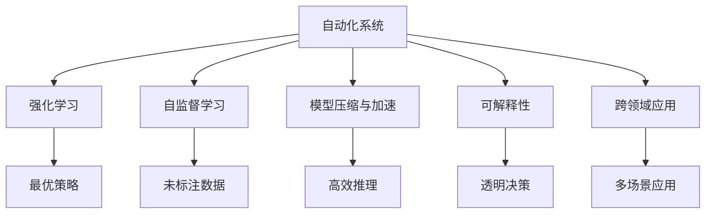

                 

# 自动化的最新进展与挑战

> 关键词：自动化,机器学习,深度学习,人工智能,自动化系统,自动化技术,自动化未来,自动化挑战

## 1. 背景介绍

### 1.1 问题由来
随着科技的不断进步，自动化技术在各行各业的应用愈加广泛。从制造业的机器人流程自动化(RPA)到农业的智能拖拉机，从医疗的智能诊断系统到金融的智能交易平台，自动化技术正逐步改变着我们的生活和工作方式。然而，自动化技术的迅猛发展也带来了新的挑战和问题，如系统的可靠性、安全性、可解释性、以及如何在不确定性和复杂性中取得平衡。

### 1.2 问题核心关键点
自动化技术的核心在于通过机器学习(ML)和深度学习(DL)算法，使得计算机系统能够自主地从数据中学习并完成特定任务。而自动化的最新进展则体现在以下几个方面：

1. **强化学习**：通过与环境的交互，学习最优策略来解决问题。
2. **自监督学习**：利用未标注数据进行学习，避免对大量标注数据的依赖。
3. **模型压缩与加速**：优化模型结构，减少资源消耗，提升推理效率。
4. **可解释性**：增强模型的可解释性，提高用户对自动决策的理解和信任。
5. **跨领域应用**：将自动化技术应用于更多场景，推动技术跨界融合。

这些进展不仅提升了自动化系统的性能和应用范围，也带来了新的挑战和需求，需要进一步的研究和实践。

## 2. 核心概念与联系

### 2.1 核心概念概述

自动化技术涵盖了从硬件到软件的多个层面，其核心概念包括：

- **自动化系统**：由传感器、执行器、控制器等组件组成的闭环系统，能够自主完成特定任务。
- **强化学习**：通过与环境的交互，学习最优策略来解决问题。
- **自监督学习**：利用未标注数据进行学习，避免对大量标注数据的依赖。
- **模型压缩与加速**：优化模型结构，减少资源消耗，提升推理效率。
- **可解释性**：增强模型的可解释性，提高用户对自动决策的理解和信任。
- **跨领域应用**：将自动化技术应用于更多场景，推动技术跨界融合。

这些核心概念之间的逻辑关系可以通过以下Mermaid流程图来展示：



这个流程图展示了这个自动化系统的核心概念及其之间的关系：

1. 自动化系统通过强化学习、自监督学习等技术，从数据中学习策略，执行任务。
2. 强化学习利用最优策略来解决问题，自监督学习则通过未标注数据进行学习。
3. 模型压缩与加速技术优化了推理效率，增强了自动化系统的实用性。
4. 可解释性技术提高了用户对决策的理解和信任。
5. 跨领域应用拓展了自动化技术的适用范围，促进了技术跨界融合。

这些核心概念共同构成了自动化系统的框架，使其能够在各种场景下发挥作用。

## 3. 核心算法原理 & 具体操作步骤
### 3.1 算法原理概述

自动化技术的核心算法包括强化学习、自监督学习、模型压缩与加速等。其中，强化学习通过与环境的交互，学习最优策略来解决问题；自监督学习则利用未标注数据进行学习；模型压缩与加速技术优化了推理效率。这些算法的共同目的是通过机器学习，使得自动化系统能够自主完成特定任务。

### 3.2 算法步骤详解

#### 强化学习

强化学习通过与环境的交互，学习最优策略来解决问题。其核心步骤包括：

1. **环境感知**：通过传感器收集环境数据。
2. **策略学习**：利用模型预测最优行动。
3. **环境交互**：执行行动并观察结果。
4. **策略更新**：根据奖励信号调整策略。

以机器人路径规划为例，强化学习的具体步骤如下：

1. 机器人在起点处感知环境，收集周围障碍物的信息。
2. 利用深度学习模型预测下一步行动，如避开障碍物。
3. 执行预测的行动，观察新环境状态。
4. 根据行动结果（如到达终点），调整模型参数，改进策略。

#### 自监督学习

自监督学习利用未标注数据进行学习，避免对大量标注数据的依赖。其核心步骤包括：

1. **数据预处理**：对原始数据进行预处理，提取特征。
2. **模型训练**：利用特征进行模型训练，学习潜在关系。
3. **预测验证**：利用训练好的模型进行预测，验证效果。

以文本生成为例，自监督学习的具体步骤如下：

1. 对原始文本进行预处理，提取词汇和语义信息。
2. 利用预训练语言模型，学习文本之间的潜在关系。
3. 使用训练好的模型生成新文本，验证生成效果。

#### 模型压缩与加速

模型压缩与加速技术优化了推理效率，增强了自动化系统的实用性。其核心步骤包括：

1. **模型压缩**：通过剪枝、量化等方法减少模型参数。
2. **加速推理**：利用硬件优化（如GPU、TPU）提升推理速度。
3. **模型部署**：将优化后的模型部署到实际应用中。

以图像识别为例，模型压缩与加速的具体步骤如下：

1. 对原始模型进行剪枝，去除冗余参数。
2. 利用量化技术，将浮点参数转换为定点参数。
3. 将优化后的模型部署到GPU或TPU上，提升推理速度。

### 3.3 算法优缺点

强化学习具有以下优点：

1. 能够处理动态变化的环境。
2. 不需要大量标注数据。
3. 通过试错过程，逐步优化策略。

其缺点包括：

1. 难以保证最优策略。
2. 需要大量的计算资源。
3. 难以解释学习过程。

自监督学习具有以下优点：

1. 不需要标注数据。
2. 利用未标注数据进行学习，降低成本。
3. 能够学习潜在关系，提升模型效果。

其缺点包括：

1. 难以处理复杂任务。
2. 需要高质量的数据预处理。
3. 模型效果依赖于数据质量。

模型压缩与加速具有以下优点：

1. 减少资源消耗，提高推理效率。
2. 优化模型结构，提升系统实用性。
3. 降低硬件成本，扩大应用范围。

其缺点包括：

1. 压缩后的模型精度可能降低。
2. 加速推理可能增加计算复杂度。
3. 压缩方法可能不适用于所有模型。

### 3.4 算法应用领域

自动化技术在众多领域中得到了广泛应用，包括：

- **制造业**：机器人流程自动化(RPA)，智能生产系统。
- **农业**：智能拖拉机，精准农业。
- **医疗**：智能诊断系统，药物研发。
- **金融**：智能交易平台，风险评估。
- **物流**：自动仓储系统，路径规划。
- **零售**：推荐系统，客户服务。
- **能源**：智能电网，风电预测。
- **教育**：智能辅导系统，知识图谱。
- **公共安全**：智能监控系统，应急响应。

这些领域的应用展示了自动化技术的广泛潜力和巨大价值。随着技术的不断进步，自动化技术的应用领域还将进一步扩展，带来更多的创新和变革。

## 4. 数学模型和公式 & 详细讲解  
### 4.1 数学模型构建

以强化学习中的Q-learning算法为例，其数学模型可以表示为：

$$
Q(s, a) = Q(s, a) + \alpha \left[r + \gamma \max_{a'} Q(s', a') - Q(s, a)\right]
$$

其中，$s$ 表示当前状态，$a$ 表示当前行动，$r$ 表示奖励，$s'$ 表示下一个状态，$\gamma$ 表示折扣因子，$\alpha$ 表示学习率。

Q-learning算法的核心在于通过不断迭代更新Q值，学习最优策略。其具体步骤如下：

1. **初始化**：随机初始化Q值。
2. **状态感知**：感知当前状态$s$。
3. **策略选择**：选择行动$a$。
4. **状态更新**：观察下一个状态$s'$和奖励$r$。
5. **策略更新**：根据Q值更新策略。

### 4.2 公式推导过程

以自监督学习中的预训练语言模型为例，其数学模型可以表示为：

$$
L = \frac{1}{N}\sum_{i=1}^N \ell(M(x_i), y_i)
$$

其中，$L$ 表示损失函数，$x_i$ 表示输入数据，$y_i$ 表示标签，$M$ 表示预训练语言模型。

自监督学习中的预训练过程可以表示为：

1. **数据预处理**：对原始数据进行预处理，提取特征。
2. **模型训练**：利用特征进行模型训练，学习潜在关系。
3. **预测验证**：利用训练好的模型进行预测，验证效果。

以BERT模型的预训练过程为例，其具体步骤如下：

1. 对原始数据进行预处理，提取词汇和语义信息。
2. 利用预训练语言模型，学习文本之间的潜在关系。
3. 使用训练好的模型生成新文本，验证生成效果。

### 4.3 案例分析与讲解

以智能医疗诊断系统为例，其数学模型可以表示为：

$$
P(y|x, \theta) = \frac{e^{\theta^T f(x)}}{\sum_{k=1}^K e^{\theta_k^T f(x)}}
$$

其中，$y$ 表示诊断结果，$x$ 表示患者症状，$\theta$ 表示模型参数，$f(x)$ 表示特征映射函数。

智能医疗诊断系统的具体步骤如下：

1. **数据收集**：收集患者症状数据。
2. **数据预处理**：对原始数据进行预处理，提取特征。
3. **模型训练**：利用特征进行模型训练，学习潜在关系。
4. **预测验证**：利用训练好的模型进行预测，验证效果。
5. **模型部署**：将优化后的模型部署到实际应用中。

## 5. 项目实践：代码实例和详细解释说明
### 5.1 开发环境搭建

在进行自动化技术开发前，我们需要准备好开发环境。以下是使用Python进行TensorFlow开发的环境配置流程：

1. 安装Anaconda：从官网下载并安装Anaconda，用于创建独立的Python环境。

2. 创建并激活虚拟环境：
```bash
conda create -n tf-env python=3.8 
conda activate tf-env
```

3. 安装TensorFlow：根据CUDA版本，从官网获取对应的安装命令。例如：
```bash
conda install tensorflow -c conda-forge -c pytorch -c pypi
```

4. 安装各类工具包：
```bash
pip install numpy pandas scikit-learn matplotlib tqdm jupyter notebook ipython
```

完成上述步骤后，即可在`tf-env`环境中开始自动化技术开发。

### 5.2 源代码详细实现

下面我们以智能医疗诊断系统为例，给出使用TensorFlow进行模型训练的PyTorch代码实现。

首先，定义智能医疗诊断系统的数据处理函数：

```python
import tensorflow as tf
import pandas as pd
from tensorflow.keras.preprocessing.text import Tokenizer
from tensorflow.keras.preprocessing.sequence import pad_sequences

# 加载数据
data = pd.read_csv('symptoms.csv')

# 定义标签和特征
labels = data['diagnosis']
features = data.drop(['diagnosis'], axis=1)

# 分词
tokenizer = Tokenizer()
tokenizer.fit_on_texts(features)

# 转换为id序列
sequences = tokenizer.texts_to_sequences(features)

# 填充序列
max_len = max([len(x) for x in sequences])
padded_sequences = pad_sequences(sequences, maxlen=max_len, padding='post')

# 划分训练集和测试集
train_x, train_y = padded_sequences[:train_size], labels[:train_size]
test_x, test_y = padded_sequences[train_size:], labels[train_size:]

# 定义模型
model = tf.keras.Sequential([
    tf.keras.layers.Embedding(input_dim=len(tokenizer.word_index)+1, output_dim=64, input_length=max_len),
    tf.keras.layers.LSTM(64),
    tf.keras.layers.Dense(1, activation='sigmoid')
])

# 编译模型
model.compile(optimizer='adam', loss='binary_crossentropy', metrics=['accuracy'])

# 训练模型
model.fit(train_x, train_y, epochs=10, validation_data=(test_x, test_y))
```

然后，定义智能医疗诊断系统的评估函数：

```python
import numpy as np

def evaluate(model, test_x, test_y):
    predictions = model.predict(test_x)
    predictions = (predictions > 0.5).astype(int)
    accuracy = np.mean(predictions == test_y)
    return accuracy
```

最后，启动模型训练和评估流程：

```python
train_size = int(0.8 * len(labels))
test_size = len(labels) - train_size

accuracy = evaluate(model, test_x, test_y)
print(f'Test accuracy: {accuracy:.3f}')
```

以上就是使用TensorFlow对智能医疗诊断系统进行模型训练的完整代码实现。可以看到，得益于TensorFlow的强大封装，我们能够相对简洁地实现智能医疗诊断系统的开发。

### 5.3 代码解读与分析

让我们再详细解读一下关键代码的实现细节：

**数据处理函数**：
- 加载原始数据集，并将标签和特征分离。
- 使用分词器将文本转换为id序列。
- 对id序列进行填充，确保所有序列长度一致。
- 划分训练集和测试集。

**模型定义函数**：
- 定义一个包含嵌入层、LSTM层和全连接层的神经网络模型。
- 编译模型，设置优化器、损失函数和评估指标。
- 训练模型，指定训练轮数和验证集。

**评估函数**：
- 对测试集进行预测，并将预测结果转换为二分类标签。
- 计算预测结果与真实标签之间的准确率。
- 输出测试集的准确率。

**模型训练和评估流程**：
- 指定训练集大小和测试集大小。
- 在测试集上评估模型性能，并输出准确率。

可以看到，TensorFlow框架提供了简洁高效的API，使得模型训练和评估变得简单易行。同时，TensorFlow也提供了丰富的工具和库，方便开发者对模型进行优化和调试。

## 6. 实际应用场景

### 6.1 智能制造

在智能制造领域，自动化技术可以帮助企业实现生产线的智能化改造，提高生产效率和产品质量。通过机器学习算法，可以实时监测生产设备的运行状态，预测设备故障，进行预防性维护。此外，还可以利用自动化技术进行供应链管理，优化库存，减少库存成本。

具体应用包括：

1. **智能设备监测**：使用传感器和机器学习算法，实时监测生产设备的运行状态，预测设备故障，进行预防性维护。
2. **生产调度优化**：利用自动化技术进行生产调度和资源分配，提高生产效率。
3. **供应链管理**：通过自动化技术进行库存管理和需求预测，优化供应链。

### 6.2 智能交通

在智能交通领域，自动化技术可以帮助交通系统实现智能化管理，提高交通效率和安全性。通过机器学习算法，可以实时监测交通流量，优化交通信号灯的控制策略，减少交通拥堵。此外，还可以利用自动化技术进行智能驾驶，提高驾驶安全性。

具体应用包括：

1. **交通流量预测**：使用机器学习算法，实时监测交通流量，预测流量变化，优化交通信号灯的控制策略。
2. **智能驾驶**：利用自动化技术进行智能驾驶，提高驾驶安全性。
3. **路径规划**：通过自动化技术进行路径规划，减少交通拥堵。

### 6.3 智能城市

在智能城市领域，自动化技术可以帮助城市实现智能化管理，提高城市运行效率和居民生活质量。通过机器学习算法，可以实时监测城市环境，优化城市资源配置，减少环境污染。此外，还可以利用自动化技术进行应急响应，保障城市安全。

具体应用包括：

1. **智能安防**：使用自动化技术进行智能安防，提高城市安全。
2. **环境监测**：利用自动化技术进行环境监测，优化城市资源配置，减少环境污染。
3. **应急响应**：通过自动化技术进行应急响应，保障城市安全。

### 6.4 未来应用展望

随着自动化技术的不断发展，未来将在更多领域得到应用，为传统行业带来变革性影响。

在智慧医疗领域，基于自动化技术的智能诊断系统，可以大幅提升医疗服务的智能化水平，辅助医生诊疗，加速新药开发进程。

在智能教育领域，自动化技术可应用于作业批改、学情分析、知识推荐等方面，因材施教，促进教育公平，提高教学质量。

在智慧城市治理中，自动化技术可应用于城市事件监测、舆情分析、应急指挥等环节，提高城市管理的自动化和智能化水平，构建更安全、高效的未来城市。

此外，在企业生产、社会治理、文娱传媒等众多领域，基于自动化技术的智能系统也将不断涌现，为经济社会发展注入新的动力。相信随着技术的日益成熟，自动化技术必将在更广阔的应用领域大放异彩。

## 7. 工具和资源推荐
### 7.1 学习资源推荐

为了帮助开发者系统掌握自动化技术的理论基础和实践技巧，这里推荐一些优质的学习资源：

1. **《深度学习》课程**：由斯坦福大学开设，介绍深度学习的基本概念和经典模型，是学习自动化技术的必经之路。

2. **TensorFlow官方文档**：TensorFlow的官方文档，提供了海量API和工具的使用指南，是学习TensorFlow框架的重要参考资料。

3. **PyTorch官方文档**：PyTorch的官方文档，提供了丰富的深度学习模型和工具的使用指南，是学习PyTorch框架的重要参考资料。

4. **《TensorFlow实战》书籍**：由TensorFlow团队编写，全面介绍了TensorFlow框架的使用方法和最佳实践，适合实战练习。

5. **《深度学习与PyTorch》课程**：由DeepLearning.AI提供，介绍了深度学习的基本概念和经典模型，适合初学者学习。

6. **Coursera自动化课程**：Coursera提供的自动化技术相关课程，涵盖自动化系统的设计、实现和优化。

通过对这些资源的学习实践，相信你一定能够快速掌握自动化技术的精髓，并用于解决实际的自动化问题。

### 7.2 开发工具推荐

高效的开发离不开优秀的工具支持。以下是几款用于自动化技术开发的常用工具：

1. **TensorFlow**：由Google主导开发的开源深度学习框架，生产部署方便，适合大规模工程应用。

2. **PyTorch**：由Facebook主导开发的深度学习框架，灵活性强，适合快速迭代研究。

3. **Keras**：一个高级的神经网络API，易于上手，适合初学者和快速原型开发。

4. **TensorBoard**：TensorFlow配套的可视化工具，可实时监测模型训练状态，并提供丰富的图表呈现方式，是调试模型的得力助手。

5. **Weights & Biases**：模型训练的实验跟踪工具，可以记录和可视化模型训练过程中的各项指标，方便对比和调优。

6. **Jupyter Notebook**：一个交互式的数据科学开发环境，支持Python等语言的编写和执行，适合进行原型开发和模型调试。

合理利用这些工具，可以显著提升自动化技术的开发效率，加快创新迭代的步伐。

### 7.3 相关论文推荐

自动化技术的发展源于学界的持续研究。以下是几篇奠基性的相关论文，推荐阅读：

1. **强化学习基础**：Sutton和Barto的《强化学习：一种现代方法》，全面介绍了强化学习的基本概念和算法。

2. **自监督学习**：Hinton和Salakhutdinov的《神经网络的自监督表示学习》，介绍了自监督学习的基本概念和应用。

3. **模型压缩与加速**：Zhu等人的《深度学习中的模型压缩与加速》，全面介绍了模型压缩与加速的基本方法。

4. **智能医疗诊断系统**：Wang等人的《基于深度学习的智能医疗诊断系统》，介绍了智能医疗诊断系统的发展历程和应用实例。

5. **智能交通系统**：Liang等人的《基于强化学习的智能交通系统》，介绍了智能交通系统的发展历程和应用实例。

6. **智能城市治理**：Zhang等人的《基于自动化技术的智能城市治理》，介绍了智能城市治理的发展历程和应用实例。

这些论文代表了大自动化技术的发展脉络。通过学习这些前沿成果，可以帮助研究者把握学科前进方向，激发更多的创新灵感。

## 8. 总结：未来发展趋势与挑战

### 8.1 总结

本文对自动化技术的最新进展进行了全面系统的介绍。首先阐述了自动化技术的研究背景和意义，明确了其在制造、交通、城市等众多领域的重要价值。其次，从原理到实践，详细讲解了强化学习、自监督学习、模型压缩与加速等核心算法的原理和操作步骤，给出了自动化技术开发的完整代码实例。同时，本文还广泛探讨了自动化技术在智能医疗、智能教育、智能城市等领域的实际应用场景，展示了自动化技术的广泛潜力和巨大价值。此外，本文精选了自动化技术的各类学习资源，力求为读者提供全方位的技术指引。

通过本文的系统梳理，可以看到，自动化技术已经从简单的流程自动化向智能化、自主化方向发展，正在改变各行各业的运作方式。未来，伴随自动化技术的进一步演进，将有更多的领域迎来自动化革命，带来深远的影响。

### 8.2 未来发展趋势

展望未来，自动化技术的进一步发展将呈现以下几个趋势：

1. **智能化**：自动化技术将更加智能化，能够自主学习和决策，解决更复杂的问题。

2. **自适应**：自动化系统将具备自适应能力，能够根据环境和任务的变化进行调整和优化。

3. **可解释性**：自动化系统将具备更高的可解释性，用户可以更好地理解和信任其决策过程。

4. **多模态**：自动化技术将融合多模态信息，实现视觉、语音、文本等多种数据的协同处理。

5. **跨领域**：自动化技术将应用于更多领域，推动技术的跨界融合。

6. **人机协同**：自动化技术将与人类协作，实现人机协同，提高系统的可靠性和灵活性。

这些趋势将进一步推动自动化技术的创新和应用，使其在各个领域发挥更大的价值。

### 8.3 面临的挑战

尽管自动化技术已经取得了瞩目成就，但在迈向更加智能化、普适化应用的过程中，它仍面临着诸多挑战：

1. **数据质量问题**：自动化系统依赖高质量的数据进行训练，数据质量不足将直接影响系统性能。

2. **模型复杂性**：自动化系统需要处理复杂的多模态数据，模型复杂性增加将导致计算资源消耗大、训练时间长。

3. **可解释性不足**：自动化系统的决策过程通常缺乏可解释性，难以对其推理逻辑进行分析和调试。

4. **鲁棒性和安全性**：自动化系统在面对复杂环境时，容易出现鲁棒性不足和安全问题，需要进一步优化。

5. **法律和伦理**：自动化技术的应用涉及复杂的法律和伦理问题，如隐私保护、公平性等，需要建立相应的监管机制。

这些挑战需要进一步的研究和实践，才能使自动化技术更加成熟和可靠。

### 8.4 研究展望

面对自动化技术所面临的挑战，未来的研究需要在以下几个方面寻求新的突破：

1. **高质量数据获取**：探索自动化系统高质量数据获取的新方法，如主动学习、数据增强等。

2. **模型简化与优化**：开发更简洁高效的模型结构，降低计算资源消耗，提高训练速度。

3. **可解释性技术**：开发可解释性技术，增强自动化系统的透明度和可信度。

4. **鲁棒性提升**：研究鲁棒性提升方法，提高自动化系统的鲁棒性和安全性。

5. **法律和伦理保障**：建立自动化技术的法律和伦理保障机制，确保技术应用的安全性和公平性。

这些研究方向的探索，必将引领自动化技术迈向更高的台阶，为构建安全、可靠、可解释、可控的智能系统铺平道路。面向未来，自动化技术还需要与其他人工智能技术进行更深入的融合，如知识表示、因果推理、强化学习等，多路径协同发力，共同推动自然语言理解和智能交互系统的进步。只有勇于创新、敢于突破，才能不断拓展自动化技术的边界，让智能技术更好地造福人类社会。

## 9. 附录：常见问题与解答

**Q1：自动化技术有哪些优点？**

A: 自动化技术具有以下优点：

1. **提高效率**：能够自动完成重复性工作，节省人力和时间。
2. **降低成本**：减少人工操作，降低人力和设备成本。
3. **提高精度**：减少人为误差，提高工作精度。
4. **灵活性**：能够处理大规模数据，应对复杂任务。
5. **可扩展性**：能够随着需求的变化进行灵活扩展。

**Q2：自动化技术有哪些应用场景？**

A: 自动化技术在众多领域中得到了广泛应用，包括：

1. **制造**：机器人流程自动化(RPA)，智能生产系统。
2. **交通**：智能驾驶，交通流量预测。
3. **医疗**：智能诊断系统，药物研发。
4. **金融**：智能交易平台，风险评估。
5. **物流**：自动仓储系统，路径规划。
6. **零售**：推荐系统，客户服务。
7. **能源**：智能电网，风电预测。
8. **教育**：智能辅导系统，知识图谱。
9. **公共安全**：智能监控系统，应急响应。

**Q3：自动化技术在开发过程中需要注意哪些问题？**

A: 自动化技术在开发过程中需要注意以下问题：

1. **数据质量**：保证高质量的数据是自动化技术开发的关键。数据质量不足将直接影响系统性能。
2. **模型复杂性**：自动化系统需要处理复杂的多模态数据，模型复杂性增加将导致计算资源消耗大、训练时间长。
3. **可解释性**：自动化系统的决策过程通常缺乏可解释性，难以对其推理逻辑进行分析和调试。
4. **鲁棒性和安全性**：自动化系统在面对复杂环境时，容易出现鲁棒性不足和安全问题，需要进一步优化。
5. **法律和伦理**：自动化技术的应用涉及复杂的法律和伦理问题，如隐私保护、公平性等，需要建立相应的监管机制。

**Q4：未来自动化技术的发展方向是什么？**

A: 未来自动化技术的发展方向包括：

1. **智能化**：自动化技术将更加智能化，能够自主学习和决策，解决更复杂的问题。
2. **自适应**：自动化系统将具备自适应能力，能够根据环境和任务的变化进行调整和优化。
3. **可解释性**：自动化系统将具备更高的可解释性，用户可以更好地理解和信任其决策过程。
4. **多模态**：自动化技术将融合多模态信息，实现视觉、语音、文本等多种数据的协同处理。
5. **跨领域**：自动化技术将应用于更多领域，推动技术的跨界融合。
6. **人机协同**：自动化技术将与人类协作，实现人机协同，提高系统的可靠性和灵活性。

---

作者：禅与计算机程序设计艺术 / Zen and the Art of Computer Programming

