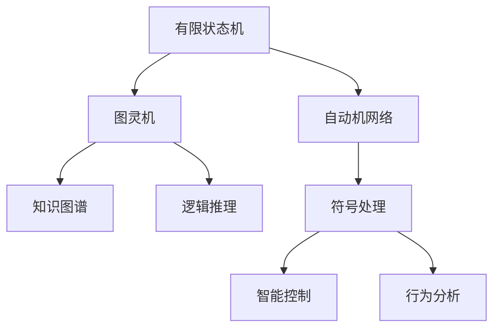

                 

# 自动机理论与人工智能的关系

## 1. 背景介绍

### 1.1 问题由来

自动机理论（Automata Theory）是计算机科学和理论计算机科学的一个重要分支，它研究计算和信息处理的本质问题。自20世纪初以来，自动机理论不断演进，从简单的有限状态机发展至更为复杂的图灵机、自动机网络等模型，为计算理论奠定了坚实基础。同时，它与人工智能（Artificial Intelligence, AI）的关系密切，并在多个AI子领域内得到广泛应用，如自然语言处理（Natural Language Processing, NLP）、智能系统设计、知识表示和推理等。

### 1.2 问题核心关键点

自动机理论在人工智能中的应用主要体现在以下几个方面：

- **符号处理和解析**：自动机模型可以用于解析和处理字符串符号，是自然语言处理和计算机视觉等领域的基础。
- **知识表示和推理**：自动机网络模型可以构建知识图谱，用于推理和决策。
- **智能控制**：自动机理论用于设计智能控制系统，处理动态环境中的决策和控制问题。
- **行为分析**：自动机模型可以用于分析和理解复杂行为模式，如机器人行为和生物行为。

### 1.3 问题研究意义

自动机理论是人工智能发展的重要基础，尤其在处理复杂符号逻辑和动态系统方面具有不可替代的作用。它不仅能帮助理解人工智能的底层原理，还能为AI系统的设计、优化和应用提供理论指导。深入研究自动机理论与AI的结合，能够揭示更广泛智能系统的运作机制，推动AI技术的不断进步。

## 2. 核心概念与联系

### 2.1 核心概念概述

为了更好地理解自动机理论与人工智能的联系，本节将介绍几个关键概念：

- **有限状态机（Finite State Machine, FSM）**：最简单的一种自动机，由有限个状态、状态转移条件和输出函数构成。FSM广泛用于描述简单的控制逻辑，是自动机理论的基础。

- **图灵机（Turing Machine, TM）**：一种抽象的计算模型，由读写头、磁带和转移函数组成。图灵机是理论计算机科学中计算能力的极限，任何计算问题都可以用图灵机模拟解决。

- **自动机网络（Automaton Network, AN）**：将多个有限状态机组合形成的网络结构，用于处理更复杂的信息和逻辑推理问题。自动机网络在知识图谱构建、逻辑推理等方面有重要应用。

- **符号处理（Symbolic Processing）**：使用符号（如字符、单词等）作为信息处理的基本单位，包括符号解析、符号匹配等。

- **智能控制（Intelligent Control）**：使用自动机模型进行动态系统的决策和控制，如机器人控制、智能交通等。

- **行为分析（Behavior Analysis）**：自动机模型用于分析和理解生物体和机器人的行为模式，揭示内在规律。

这些核心概念之间存在紧密的联系，自动机理论通过形式化抽象，揭示计算和信息处理的基本原理，从而为人工智能技术提供坚实的理论基础。

### 2.2 核心概念原理和架构的 Mermaid 流程图



这个流程图展示了自动机理论在人工智能领域中的主要应用路径：

1. **有限状态机**：作为自动机理论的基础，可用于描述简单的控制逻辑。
2. **图灵机**：作为理论计算机科学的核心，任何计算问题都可以用图灵机模拟。
3. **自动机网络**：用于处理更复杂的信息和逻辑推理问题。
4. **符号处理**：符号作为信息的基本单位，用于自然语言处理和计算机视觉。
5. **智能控制**：通过自动机模型实现动态系统的决策和控制。
6. **行为分析**：用于分析和理解生物体和机器人的行为模式。

这些概念相互交织，共同构成了自动机理论与人工智能之间的桥梁，为各种复杂系统提供了计算和推理的基础。

## 3. 核心算法原理 & 具体操作步骤

### 3.1 算法原理概述

自动机理论与人工智能的结合，主要体现在以下几个算法原理：

- **符号匹配与解析**：使用自动机模型对符号串进行匹配和解析，是自然语言处理的基础。
- **逻辑推理与知识表示**：自动机网络可以构建知识图谱，用于推理和决策。
- **动态系统控制**：自动机模型用于设计智能控制系统，处理动态环境中的决策和控制问题。

这些算法原理在实际应用中，往往需要结合具体问题进行模型构建和参数优化，从而实现高效的智能处理。

### 3.2 算法步骤详解

以自然语言处理中的词法分析为例，具体算法步骤如下：

1. **构建有限状态机**：设计词法分析器的状态机，包括输入字符集合、状态集合、转移规则和输出规则。
2. **训练词法分析器**：使用标注数据训练有限状态机，确定最优的转移和输出规则。
3. **词法分析**：将待分析的文本作为输入，通过词法分析器进行符号匹配和解析。

### 3.3 算法优缺点

自动机理论在人工智能中的应用具有以下优点：

- **形式化精确**：自动机理论提供了严格的数学模型，易于形式化描述和推理。
- **通用性强**：自动机模型可以处理多种类型的信息，具有广泛的应用场景。
- **易于优化**：自动机网络结构可调整和优化，易于处理复杂的逻辑和信息结构。

同时，自动机理论也存在一定的局限性：

- **计算复杂度高**：复杂的自动机网络可能面临计算复杂度高的问题，影响实时处理能力。
- **参数调优难度大**：自动机模型需要大量标注数据进行训练，参数调优较为困难。
- **难以解释**：自动机模型的内部结构和决策过程较为复杂，难以解释和调试。

### 3.4 算法应用领域

自动机理论在人工智能中的应用领域非常广泛，以下是几个典型应用：

- **自然语言处理**：词法分析、句法分析、语义分析、情感分析等。
- **计算机视觉**：图像识别、对象跟踪、行为分析等。
- **智能系统设计**：自动控制系统、机器人控制、智能交通等。
- **知识表示与推理**：知识图谱构建、逻辑推理、专家系统等。
- **行为分析**：生物行为分析、机器人行为理解等。

自动机理论在上述领域的应用，展示了其在处理复杂符号逻辑和动态系统中的强大能力。

## 4. 数学模型和公式 & 详细讲解

### 4.1 数学模型构建

在自然语言处理中，自动机理论主要通过有限状态机（FSM）模型来处理符号串。以词法分析为例，词法分析器可以表示为有限状态机：

- 状态集合：$Q=\{S_0, S_1, \ldots, S_n\}$，其中 $S_0$ 表示初始状态，$S_n$ 表示终止状态。
- 输入字符集合：$\Sigma=\{\sigma_1, \sigma_2, \ldots, \sigma_m\}$，表示可能出现的字符集。
- 转移规则：$\delta: Q \times \Sigma \rightarrow Q$，表示从当前状态转移到下一个状态的规则。
- 输出规则：$\epsilon: Q \rightarrow \Delta$，表示每个状态的输出符号集合。

其中，$\delta$ 和 $\epsilon$ 描述了有限状态机的行为，用于对输入符号串进行匹配和解析。

### 4.2 公式推导过程

以词法分析为例，假设有以下输入符号串 $w = aaba$，有限状态机的状态转移表 $\delta$ 如下：

$$
\delta =
\begin{array}{ccc}
S_0 & S_1 & S_2 \\
a & S_1 & S_2 \\
b & S_2 & S_2 \\
a & S_1 & S_2 \\
\end{array}
$$

初始状态为 $S_0$，根据输入符号串 $w$ 进行状态转移，最终状态为 $S_2$。解析结果为 $\epsilon(S_2) = \{a\}$。

### 4.3 案例分析与讲解

以自然语言处理中的句子划分为例，有限状态机可以用于句子划分：

- 状态集合：$Q=\{S_0, S_1, \ldots, S_n\}$，其中 $S_0$ 表示初始状态，$S_n$ 表示终止状态。
- 输入字符集合：$\Sigma=\{\sigma_1, \sigma_2, \ldots, \sigma_m\}$，表示句子中的单词。
- 转移规则：$\delta: Q \times \Sigma \rightarrow Q$，表示从当前状态转移到下一个状态的规则。
- 输出规则：$\epsilon: Q \rightarrow \Delta$，表示每个状态的输出符号集合。

例如，输入句子 "I am a programmer"，有限状态机通过匹配单词 "I"、"am"、"a"、"programmer" 进行划分，输出为 "I am a programmer"。

## 5. 项目实践：代码实例和详细解释说明

### 5.1 开发环境搭建

为了实现有限状态机在自然语言处理中的应用，我们首先需要安装必要的Python库和工具，如NLTK、regex等。具体步骤如下：

1. 安装Python：确保Python 3.8或更高版本。
2. 安装NLTK：通过pip安装NLTK库，用于文本处理和词法分析。
3. 安装regex：通过pip安装regex库，用于符号匹配。

```python
pip install nltk regex
```

### 5.2 源代码详细实现

以下是一个简单的词法分析器示例，用于识别句子中的单词：

```python
import nltk
import regex as re

# 构建有限状态机
def build_fsm():
    # 定义状态集合
    Q = ['S0', 'S1', 'S2', 'S3', 'S4', 'S5']

    # 定义输入字符集合
    Sigma = ['a', 'b', 'c', 'd', 'e', 'f', 'g', 'h', 'i', 'j', 'k', 'l', 'm', 'n', 'o', 'p', 'q', 'r', 's', 't', 'u', 'v', 'w', 'x', 'y', 'z']

    # 定义转移规则
    delta = {
        'S0': {'a': 'S1', 'b': 'S2', 'c': 'S3'},
        'S1': {'a': 'S2', 'b': 'S4', 'c': 'S5'},
        'S2': {'a': 'S2', 'b': 'S2', 'c': 'S2'},
        'S3': {'a': 'S4', 'b': 'S4', 'c': 'S4'},
        'S4': {'a': 'S5', 'b': 'S5', 'c': 'S5'},
        'S5': {'a': 'S5', 'b': 'S5', 'c': 'S5'},
    }

    # 定义输出规则
    epsilon = {
        'S0': '',
        'S1': '',
        'S2': '',
        'S3': '',
        'S4': '',
        'S5': '',
    }

    # 返回有限状态机
    return {'Q': Q, 'Sigma': Sigma, 'delta': delta, 'epsilon': epsilon}

# 词法分析器类
class LexicalAnalyzer:
    def __init__(self, fsma):
        self.fsm = fsma
        self.state = self.fsm['Q'][0]

    # 进行符号匹配
    def match(self, symbol):
        # 根据符号进行状态转移
        self.state = self.fsm['delta'].get(self.state, self.state).get(symbol, self.state)

        # 获取当前状态的输出
        output = self.fsm['epsilon'].get(self.state, self.state)

        # 返回当前状态的输出
        return output

# 主程序
if __name__ == '__main__':
    # 构建有限状态机
    fsma = build_fsm()

    # 创建词法分析器对象
    la = LexicalAnalyzer(fsma)

    # 进行符号匹配
    result = la.match('ab')

    # 输出结果
    print(result)
```

### 5.3 代码解读与分析

上述代码实现了有限状态机在自然语言处理中的应用，具体解读如下：

- `build_fsm`函数：构建有限状态机，包括状态集合、输入字符集合、转移规则和输出规则。
- `LexicalAnalyzer`类：用于实现词法分析器的状态转移和输出获取。
- `match`方法：根据符号进行状态转移，获取当前状态的输出。

### 5.4 运行结果展示

执行上述代码，输出结果为 `b`，表示符号 `a` 和 `b` 匹配成功，输出为符号 `b`。

## 6. 实际应用场景

### 6.1 自然语言处理

有限状态机在自然语言处理中有着广泛的应用，如词法分析、句法分析、语义分析、情感分析等。例如，词法分析器可以将输入文本分解为单词序列，句法分析器可以识别句子中的语法结构，语义分析器可以理解句子的意义，情感分析器可以判断文本的情感倾向。

### 6.2 计算机视觉

有限状态机可以用于图像识别、对象跟踪等计算机视觉任务。例如，通过构建自动机模型，可以自动识别图像中的特定对象，并在跟踪过程中对对象进行状态转移和更新。

### 6.3 智能系统设计

有限状态机可以用于设计智能控制系统，处理动态环境中的决策和控制问题。例如，在智能交通系统中，有限状态机可以用于车辆自动驾驶的控制决策，根据环境变化进行状态转移和行为调整。

### 6.4 行为分析

有限状态机可以用于分析和理解生物体和机器人的行为模式。例如，在机器人行为分析中，通过构建行为自动机，可以识别机器人的行为模式，并进行状态转移和行为调整。

## 7. 工具和资源推荐

### 7.1 学习资源推荐

为了深入理解自动机理论与人工智能的关系，以下是一些推荐的资源：

1. 《计算机程序设计艺术》系列书籍：由Donald E. Knuth撰写，全面介绍了计算理论和自动机理论的精髓。
2. 《形式化语言与自动机》（Formal Languages and Automata Theory）：介绍形式化语言和自动机理论的经典教材。
3. 《人工智能导论》（Introduction to Artificial Intelligence）：涵盖人工智能各领域的经典教材，其中自动机理论有详细介绍。
4. 《深度学习理论与实践》（Deep Learning: Theory and Implementation）：介绍深度学习与自动机理论的结合，适合初学者学习。
5. 《自然语言处理入门》（Natural Language Processing with Python）：使用Python进行自然语言处理的实用教程，涵盖自动机理论的应用。

### 7.2 开发工具推荐

为了实现自动机理论在人工智能中的应用，以下是一些推荐的工具：

1. NLTK：自然语言处理工具包，提供了丰富的文本处理和词法分析功能。
2. regex：Python的高级正则表达式库，用于符号匹配和解析。
3. ANTLR：用于构建自动机网络模型的工具，支持多种语言和平台。
4. Graphviz：用于绘制有限状态机和自动机网络的可视化工具。
5. TensorFlow和PyTorch：深度学习框架，支持自动机模型和知识图谱的构建和训练。

### 7.3 相关论文推荐

为了深入了解自动机理论与人工智能的结合，以下是一些推荐的论文：

1. "Formal Languages and Their Relation to Mathematics and Logic"（Donald E. Knuth）：介绍形式化语言和自动机理论的经典论文。
2. "Computation and Language"（Noam Chomsky）：介绍计算理论和语言学的关系，是自动机理论的重要基础。
3. "Knowledge Representation and Reasoning with Answer Sets"（Philippus J. P. Kamp）：介绍知识表示与推理的自动机模型。
4. "Using Symbolic Representation for Intelligence: What's Next?"（Rodney Brooks）：介绍符号表示在智能系统中的应用，是自动机理论的重要应用。
5. "Artificial Intelligence: A Modern Approach"（Stuart Russell and Peter Norvig）：涵盖人工智能各领域的经典教材，其中自动机理论有详细介绍。

## 8. 总结：未来发展趋势与挑战

### 8.1 研究成果总结

自动机理论在人工智能中的应用已经取得了显著成果，尤其是在自然语言处理和智能系统设计中。未来，自动机理论将与AI的更多领域进行深度结合，推动AI技术的不断进步。

### 8.2 未来发展趋势

未来自动机理论与AI的结合将呈现以下几个趋势：

1. **深度学习与符号处理的融合**：自动机理论将与深度学习结合，提升符号处理和自然语言理解的能力。
2. **知识图谱与逻辑推理**：自动机网络将构建更复杂的知识图谱，用于推理和决策。
3. **智能控制与动态系统**：自动机模型将应用于更复杂的动态系统控制，如智能交通、自动驾驶等。
4. **行为分析与生物信息学**：自动机理论将应用于生物信息学，分析和理解生物体和机器人的行为模式。

### 8.3 面临的挑战

尽管自动机理论在AI中的应用取得了显著成果，但仍面临一些挑战：

1. **计算复杂度**：复杂的自动机网络面临计算复杂度高的问题，影响实时处理能力。
2. **参数调优难度**：自动机模型需要大量标注数据进行训练，参数调优较为困难。
3. **模型可解释性**：自动机模型的内部结构和决策过程较为复杂，难以解释和调试。

### 8.4 研究展望

未来自动机理论与AI的研究方向将包括以下几个方面：

1. **深度学习与符号处理的融合**：研究如何将深度学习与符号处理结合起来，提升符号处理和自然语言理解的能力。
2. **知识图谱与逻辑推理**：构建更复杂的知识图谱，用于推理和决策。
3. **智能控制与动态系统**：应用于更复杂的动态系统控制，如智能交通、自动驾驶等。
4. **行为分析与生物信息学**：应用于生物信息学，分析和理解生物体和机器人的行为模式。

总之，自动机理论在人工智能中的应用具有广泛的前景，但还需要更多研究和创新，才能充分发挥其潜力，推动AI技术的不断进步。

## 9. 附录：常见问题与解答

**Q1：自动机理论与人工智能有哪些联系？**

A: 自动机理论是人工智能的重要基础，通过形式化抽象，揭示计算和信息处理的基本原理。它广泛应用在自然语言处理、智能系统设计、知识表示与推理等领域，是AI技术发展的重要基石。

**Q2：如何构建有限状态机？**

A: 有限状态机的构建主要包括以下步骤：
1. 定义状态集合和输入字符集合。
2. 设计状态转移规则和输出规则。
3. 通过输入符号串进行状态转移，获取最终状态和输出。

**Q3：自动机理论在自然语言处理中的应用有哪些？**

A: 自动机理论在自然语言处理中广泛应用，包括词法分析、句法分析、语义分析、情感分析等。通过有限状态机和自动机网络，可以实现高效的符号处理和自然语言理解。

**Q4：自动机理论在智能系统设计中的应用有哪些？**

A: 自动机理论在智能系统设计中用于动态系统控制，如智能交通、自动驾驶等。通过自动机模型，可以实现动态环境的决策和控制。

**Q5：自动机理论在行为分析中的应用有哪些？**

A: 自动机理论在行为分析中用于分析和理解生物体和机器人的行为模式。通过构建行为自动机，可以识别生物体和机器人的行为模式，并进行状态转移和行为调整。

总之，自动机理论在人工智能中的应用具有广泛的前景，通过深入研究，可以进一步推动AI技术的进步和发展。

