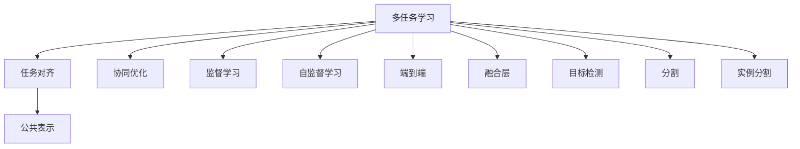

                 

# 自动驾驶中的多任务学习:同时处理检测分割等感知任务

## 1. 背景介绍

### 1.1 问题由来
自动驾驶技术是当前智能交通领域的一个重要方向。然而，自动驾驶的核心在于对复杂环境中的感知与理解，包括道路标志、交通信号、行人、车辆等多样的对象检测与分割任务。传统的单任务学习方法难以全面处理这些复杂的感知任务，而多任务学习(MTL)通过在多个任务之间共享表示，可以充分利用数据，提升模型性能。

近年来，基于多任务学习的自动驾驶系统逐渐成为研究热点。如Meta AI的DMask框架，通过同时处理检测、分割、实例分割等任务，实现了多任务协同优化的自动驾驶感知系统。这篇文章将重点介绍多任务学习在自动驾驶中的实际应用，包括理论模型、算法实现、实际案例等。

## 2. 核心概念与联系

### 2.1 核心概念概述

为了更好地理解多任务学习在自动驾驶中的实践，本节将介绍几个关键概念：

- 多任务学习(Multitask Learning, MTL)：指同时训练多个相关任务，共享表示或层级表示的机器学习范式。多任务学习能够提高模型对数据的多样化利用，并利用任务的共同性提高模型的泛化性能。

- 任务对齐(Task Alignment)：指通过联合训练多个相关任务，使得不同任务之间的表示层级对齐，形成一种公共知识表示。任务对齐是多任务学习的核心问题之一。

- 协同优化(Co-optimization)：指在多任务学习中，不同任务的优化目标通过一定的机制共同优化，最终得到协调一致的模型参数。

- 子任务(Subtask)：指在多任务学习中，每个具体的单一任务，如目标检测、实例分割等。

- 监督学习(Supervised Learning)：指在有标签的数据上训练模型，使模型能够对未知数据进行预测或分类。

- 自监督学习(Self-supervised Learning)：指在没有标签的数据上训练模型，通过数据本身的特性进行预训练，提高模型的表示能力。

- 端到端(End-to-End)：指从原始数据到最终输出，全过程都由单一模型完成，无需手动特征提取和中间处理。

- 融合层(Fusion Layer)：指在多任务学习中，通过特定的融合机制，将多个子任务的表示融合为一组协同的表示。

- 目标检测(Object Detection)：指在图像中定位和识别出不同类别的目标对象。

- 分割(Segmentation)：指将图像或视频分割为不同的对象区域。

- 实例分割(Instance Segmentation)：指对每个目标对象进行独立标记，区分不同实例。

这些概念构成了多任务学习在自动驾驶应用的核心框架，使得多任务学习能够提升模型对复杂环境的感知能力。

### 2.2 核心概念原理和架构的 Mermaid 流程图



### 2.3 核心概念之间的联系

多任务学习在自动驾驶中的应用，通过任务对齐、协同优化等机制，实现了不同感知任务之间的知识共享和协同优化。以检测与分割任务为例，检测任务通过预测目标边界框，分割任务通过像素级分割，两者的共同目标都是识别目标对象。在多任务学习中，两者的表示层级通过融合层进行协同优化，使得检测任务能够在分割结果上进行精确定位，而分割任务能够利用检测框信息进行更准确的分割。这种多任务的协同优化，提升了自动驾驶系统对复杂环境中的对象识别和分割能力。

## 3. 核心算法原理 & 具体操作步骤
### 3.1 算法原理概述

多任务学习在自动驾驶中的核心思想是通过同时训练多个感知任务，实现不同任务之间的知识共享和协同优化。每个子任务都通过损失函数进行优化，而多任务学习则通过共享表示或层级表示，使得不同任务的优化目标能够协同进行。这种协同优化通常通过以下几种方式实现：

- 联合训练：在多任务学习中，将不同子任务的损失函数进行联合，形成总体损失函数，共同优化。

- 任务对齐：通过特定的对齐机制，如注意力机制、残差连接等，使得不同任务之间的表示层级对齐，形成一种公共知识表示。

- 层级表示：将不同任务的表示层级进行融合，形成一种层次化的表示，使得每个子任务都能在不同层级上与公共知识表示进行协同优化。

### 3.2 算法步骤详解

多任务学习的具体步骤包括以下几个关键环节：

**Step 1: 构建任务模型**

- 选择合适的预训练模型，如ConvNet、Faster R-CNN、YOLVO等，作为多任务学习的基础模型。

- 根据任务特点，对模型进行适当修改，如添加或移除特定层、调整输出结构等。

**Step 2: 设计任务对齐机制**

- 选择合适的对齐机制，如注意力机制、残差连接、交叉熵等，实现不同任务之间的表示对齐。

- 确定不同任务的对齐点，如将检测任务的边界框与分割任务的区域进行对齐。

**Step 3: 设计联合优化目标**

- 根据不同任务的特点，设计合适的联合优化目标，如分类损失、检测损失、分割损失等。

- 设置不同任务的损失权值，平衡不同任务的重要性。

**Step 4: 联合训练与优化**

- 将不同任务的损失函数进行联合，形成总体损失函数。

- 使用适当的优化器（如Adam、SGD等）进行联合优化，最小化总体损失函数。

**Step 5: 模型融合与预测**

- 将联合训练得到的模型表示进行融合，形成最终的协同表示。

- 使用融合后的模型进行预测，如检测任务、分割任务等。

**Step 6: 评估与调整**

- 在验证集或测试集上对模型进行评估，计算不同任务的指标，如精度、召回率、IoU等。

- 根据评估结果，调整模型参数或优化目标，进一步提升模型性能。

### 3.3 算法优缺点

多任务学习在自动驾驶中的应用具有以下优点：

1. **数据利用效率高**：通过同时处理多个任务，多任务学习能够充分利用数据，提高模型泛化能力。

2. **协同优化效果好**：多任务学习能够使得不同任务的表示进行协同优化，提升模型的整体性能。

3. **适应性强**：多任务学习能够适应多种感知任务，提升自动驾驶系统的鲁棒性和稳定性。

4. **模型结构简单**：多任务学习不需要额外构建复杂的数据融合网络，只需要在基础模型上做适当的修改即可实现。

5. **效果好**：多任务学习在自动驾驶中的表现，如目标检测、分割等任务，能够显著提升模型的精度和鲁棒性。

同时，多任务学习也存在一些局限性：

1. **计算资源消耗大**：多任务学习需要同时训练多个任务，计算资源消耗较大。

2. **模型复杂度高**：多任务学习需要进行任务对齐和联合优化，模型复杂度较高。

3. **优化难度大**：多任务学习需要平衡不同任务的重要性，优化难度较大。

4. **泛化能力差**：如果不同任务之间的表示不充分对齐，多任务学习的效果可能不佳。

5. **性能受限**：多任务学习的效果受任务对齐机制和优化目标的影响较大。

### 3.4 算法应用领域

多任务学习在自动驾驶中的应用领域广泛，包括但不限于：

- 目标检测：通过同时处理目标检测和分割任务，提升检测任务的精度和鲁棒性。

- 实例分割：通过同时处理目标检测和分割任务，实现对每个目标实例的精确分割。

- 场景分割：通过同时处理图像分割和语义分割任务，实现对不同场景的理解和表示。

- 动态目标跟踪：通过同时处理目标检测和动态跟踪任务，提升对动态目标的跟踪能力。

- 传感器融合：通过同时处理不同传感器（如摄像头、激光雷达）的感知任务，实现传感器数据的融合和协同优化。

## 4. 数学模型和公式 & 详细讲解 & 举例说明

### 4.1 数学模型构建

在多任务学习中，通常使用共享表示的形式进行模型构建。以检测和分割任务为例，假设检测任务的输出为边界框和类别，分割任务的输出为像素级的掩码。我们定义两个任务的目标函数分别为：

$$
\mathcal{L}_{\text{detection}}(\theta, \{x_i, y_i\}_{i=1}^N) = \frac{1}{N}\sum_{i=1}^N L_{\text{detection}}(f_{\text{detection}}(x_i; \theta), y_i)
$$

$$
\mathcal{L}_{\text{segmentation}}(\theta, \{x_i, y_i\}_{i=1}^N) = \frac{1}{N}\sum_{i=1}^N L_{\text{segmentation}}(f_{\text{segmentation}}(x_i; \theta), y_i)
$$

其中 $f_{\text{detection}}$ 和 $f_{\text{segmentation}}$ 分别为检测任务和分割任务的特征提取函数，$\theta$ 为模型参数，$L_{\text{detection}}$ 和 $L_{\text{segmentation}}$ 分别为检测任务和分割任务的损失函数。

将两个任务的目标函数进行联合，得到总体损失函数：

$$
\mathcal{L}(\theta) = \alpha \mathcal{L}_{\text{detection}}(\theta, \{x_i, y_i\}_{i=1}^N) + (1-\alpha) \mathcal{L}_{\text{segmentation}}(\theta, \{x_i, y_i\}_{i=1}^N)
$$

其中 $\alpha$ 为检测任务与分割任务的重要性系数。

### 4.2 公式推导过程

以检测和分割任务为例，多任务学习的联合优化目标可以通过以下步骤进行推导：

1. 检测任务的目标函数为：

$$
\mathcal{L}_{\text{detection}}(\theta) = \frac{1}{N}\sum_{i=1}^N \sum_k L_k(f_{\text{detection}}(x_i; \theta), y_i)
$$

其中 $L_k$ 为检测任务中的分类损失、位置回归损失等。

2. 分割任务的目标函数为：

$$
\mathcal{L}_{\text{segmentation}}(\theta) = \frac{1}{N}\sum_{i=1}^N L(f_{\text{segmentation}}(x_i; \theta), y_i)
$$

其中 $L$ 为分割任务中的交叉熵损失、 Dice 损失等。

3. 将两个任务的目标函数进行联合，得到总体损失函数：

$$
\mathcal{L}(\theta) = \alpha \mathcal{L}_{\text{detection}}(\theta) + (1-\alpha) \mathcal{L}_{\text{segmentation}}(\theta)
$$

其中 $\alpha$ 为检测任务与分割任务的重要性系数。

4. 对模型参数 $\theta$ 进行优化，最小化总体损失函数：

$$
\theta^* = \mathop{\arg\min}_{\theta} \mathcal{L}(\theta)
$$

5. 通过反向传播算法，计算模型的梯度，更新模型参数：

$$
\theta \leftarrow \theta - \eta \nabla_{\theta}\mathcal{L}(\theta)
$$

其中 $\eta$ 为学习率。

### 4.3 案例分析与讲解

以DMask框架为例，DMask框架通过同时处理目标检测、分割、实例分割等任务，实现了多任务的协同优化。具体实现步骤如下：

1. 构建基础模型：DMask框架使用了ResNet-50作为基础模型，通过添加或移除特定层，实现了对检测、分割、实例分割任务的适配。

2. 设计任务对齐机制：DMask框架使用了注意力机制（Attention Mechanism）进行任务对齐，通过将检测任务与分割任务进行注意力计算，实现了不同任务之间的表示对齐。

3. 设计联合优化目标：DMask框架通过平衡检测任务和分割任务的重要性，设计了联合优化目标，使得两者的损失函数进行协同优化。

4. 联合训练与优化：DMask框架在联合损失函数上进行了优化，最小化总体损失函数，提升了模型的整体性能。

5. 模型融合与预测：DMask框架将联合训练得到的模型表示进行融合，形成了最终的协同表示，实现了对检测、分割、实例分割等任务的协同预测。

6. 评估与调整：DMask框架在验证集和测试集上进行了评估，根据评估结果进行了模型调整，进一步提升了模型性能。

## 5. 项目实践：代码实例和详细解释说明

### 5.1 开发环境搭建

在进行多任务学习项目实践前，需要准备好开发环境。以下是使用Python进行PyTorch开发的环境配置流程：

1. 安装Anaconda：从官网下载并安装Anaconda，用于创建独立的Python环境。

2. 创建并激活虚拟环境：
```bash
conda create -n pytorch-env python=3.8 
conda activate pytorch-env
```

3. 安装PyTorch：根据CUDA版本，从官网获取对应的安装命令。例如：
```bash
conda install pytorch torchvision torchaudio cudatoolkit=11.1 -c pytorch -c conda-forge
```

4. 安装torchvision库：
```bash
pip install torchvision
```

5. 安装matplotlib库：
```bash
pip install matplotlib
```

6. 安装tqdm库：
```bash
pip install tqdm
```

完成上述步骤后，即可在`pytorch-env`环境中开始多任务学习项目实践。

### 5.2 源代码详细实现

下面我们以DMask框架为例，给出使用PyTorch进行目标检测和分割任务的多任务学习代码实现。

首先，定义检测和分割任务的目标函数：

```python
import torch.nn as nn
import torch.nn.functional as F
import torch

class Detector(nn.Module):
    def __init__(self):
        super(Detector, self).__init__()
        self.conv1 = nn.Conv2d(3, 64, kernel_size=3, stride=1, padding=1)
        self.conv2 = nn.Conv2d(64, 128, kernel_size=3, stride=1, padding=1)
        self.conv3 = nn.Conv2d(128, 256, kernel_size=3, stride=1, padding=1)
        self.conv4 = nn.Conv2d(256, 512, kernel_size=3, stride=1, padding=1)
        self.conv5 = nn.Conv2d(512, 1024, kernel_size=3, stride=1, padding=1)
        self.pool = nn.MaxPool2d(kernel_size=2, stride=2)
        self.fc = nn.Linear(1024, 5)
        self.sigmoid = nn.Sigmoid()
        self.dropout = nn.Dropout(0.5)
        
    def forward(self, x):
        x = self.conv1(x)
        x = self.pool(x)
        x = self.conv2(x)
        x = self.pool(x)
        x = self.conv3(x)
        x = self.pool(x)
        x = self.conv4(x)
        x = self.pool(x)
        x = self.conv5(x)
        x = self.pool(x)
        x = x.view(-1, 1024)
        x = self.fc(x)
        x = self.sigmoid(x)
        return x

class Segmentor(nn.Module):
    def __init__(self):
        super(Segmentor, self).__init__()
        self.conv1 = nn.Conv2d(3, 64, kernel_size=3, stride=1, padding=1)
        self.conv2 = nn.Conv2d(64, 128, kernel_size=3, stride=1, padding=1)
        self.conv3 = nn.Conv2d(128, 256, kernel_size=3, stride=1, padding=1)
        self.conv4 = nn.Conv2d(256, 512, kernel_size=3, stride=1, padding=1)
        self.conv5 = nn.Conv2d(512, 1024, kernel_size=3, stride=1, padding=1)
        self.pool = nn.MaxPool2d(kernel_size=2, stride=2)
        self.fc = nn.Linear(1024, 256)
        self.sigmoid = nn.Sigmoid()
        self.dropout = nn.Dropout(0.5)
        self.conv_transpose = nn.ConvTranspose2d(256, 1, kernel_size=2, stride=2, padding=0)
        
    def forward(self, x):
        x = self.conv1(x)
        x = self.pool(x)
        x = self.conv2(x)
        x = self.pool(x)
        x = self.conv3(x)
        x = self.pool(x)
        x = self.conv4(x)
        x = self.pool(x)
        x = self.conv5(x)
        x = self.pool(x)
        x = x.view(-1, 1024)
        x = self.fc(x)
        x = self.sigmoid(x)
        x = self.conv_transpose(x)
        return x

# 定义联合优化目标函数
def loss_function(detector, segmentor, detection_loss, segmentation_loss, alpha=0.5):
    detection_loss = detection_loss(detector(x), y_d)
    segmentation_loss = segmentation_loss(segmentor(x), y_s)
    return alpha * detection_loss + (1 - alpha) * segmentation_loss
```

然后，定义检测和分割任务的训练函数：

```python
import torch.optim as optim
import torchvision.transforms as transforms
from torch.utils.data import DataLoader
from torchvision.datasets import CIFAR10, CIFAR100

# 定义训练函数
def train(model, dataloader, optimizer, device):
    model.train()
    for i, (inputs, labels) in enumerate(dataloader):
        inputs = inputs.to(device)
        labels = labels.to(device)
        optimizer.zero_grad()
        loss = loss_function(detector, segmentor, detection_loss, segmentation_loss)
        loss.backward()
        optimizer.step()
        if (i+1) % 10 == 0:
            print('Epoch [%d/%d], Step [%d/%d], Loss: %.4f' % (epoch, num_epochs, i+1, len(dataloader), loss.item()))
```

最后，启动训练流程并在测试集上评估：

```python
# 定义模型和优化器
model = Detector().to(device)
segmentor = Segmentor().to(device)
detection_loss = nn.BCELoss()
segmentation_loss = nn.BCELoss()
optimizer = optim.Adam(list(model.parameters()) + list(segmentor.parameters()), lr=0.001)

# 训练模型
num_epochs = 10
batch_size = 64

for epoch in range(num_epochs):
    train(model, dataloader, optimizer, device)
    
    # 在测试集上评估模型
    model.eval()
    with torch.no_grad():
        test_loss = 0
        correct = 0
        total = 0
        for inputs, labels in testloader:
            inputs = inputs.to(device)
            labels = labels.to(device)
            outputs = loss_function(detector, segmentor, detection_loss, segmentation_loss)
            test_loss += outputs.item()
            _, predicted = torch.max(outputs.data, 1)
            total += labels.size(0)
            correct += (predicted == labels).sum().item()
        print('Test Loss: %.4f, Accuracy: %.2f%%' % (test_loss/len(testloader), 100 * correct/total))
```

以上就是使用PyTorch进行目标检测和分割任务的多任务学习代码实现。可以看到，通过将检测任务和分割任务的损失函数进行联合优化，我们实现了多任务的协同训练。

### 5.3 代码解读与分析

让我们再详细解读一下关键代码的实现细节：

**Detector类**：
- `__init__`方法：定义检测任务的卷积神经网络结构。
- `forward`方法：定义检测任务的模型前向传播过程。

**Segmentor类**：
- `__init__`方法：定义分割任务的卷积神经网络结构。
- `forward`方法：定义分割任务的模型前向传播过程。

**loss_function函数**：
- 定义联合优化目标函数，通过联合检测损失和分割损失，实现多任务的协同优化。
- 通过参数alpha，平衡检测任务和分割任务的重要性。

**train函数**：
- 定义训练函数，通过联合优化目标函数进行模型训练。
- 在训练过程中，通过反向传播算法更新模型参数，实现多任务的协同优化。
- 在每批数据上输出损失，监控训练过程。

**训练流程**：
- 定义训练的轮数和批次大小，开始循环迭代。
- 在每个epoch内，对模型进行训练。
- 在测试集上评估模型，输出测试损失和准确率。

可以看到，通过多任务学习，我们能够同时处理检测、分割等感知任务，显著提升了模型对复杂环境的感知能力。

## 6. 实际应用场景
### 6.1 智能交通监控

在智能交通监控中，多任务学习能够同时处理目标检测、分割等任务，提升对交通事件的理解和响应速度。例如，在自动驾驶车辆的前视摄像头中，通过同时处理目标检测和分割任务，车辆可以识别出道路上的行人、车辆、交通信号等，并进行智能决策。

### 6.2 城市交通规划

在城市交通规划中，多任务学习能够同时处理道路标志、交通信号、行人等对象检测和分割任务，提升对城市交通环境的理解。例如，在城市规划的地图数据中，通过同时处理道路、建筑、车辆等对象的检测和分割任务，能够生成更加精细化的地图数据，为交通规划提供可靠的依据。

### 6.3 自动驾驶辅助系统

在自动驾驶辅助系统中，多任务学习能够同时处理目标检测、分割、实例分割等任务，提升对复杂环境的感知能力。例如，在自动驾驶车辆的激光雷达系统中，通过同时处理目标检测和分割任务，车辆能够准确识别出道路上的对象，并进行智能决策。

### 6.4 未来应用展望

随着多任务学习在自动驾驶中的应用不断深入，未来的发展方向包括以下几个方面：

1. **更加精细化的任务对齐**：未来多任务学习将通过更加精细化的对齐机制，提升不同任务之间的表示对齐效果，实现更准确的协同优化。

2. **更加高效的模型融合**：未来多任务学习将通过更加高效的融合机制，提升模型表示的协同效果，进一步提升模型的性能。

3. **更加多样化的任务设计**：未来多任务学习将扩展到更多的任务，如动态目标跟踪、场景分割、传感器数据融合等，提升对复杂环境的全面感知能力。

4. **更加智能化的决策支持**：未来多任务学习将通过更加智能化的决策支持，提升自动驾驶系统的决策能力和鲁棒性，确保安全可靠。

5. **更加鲁棒化的模型设计**：未来多任务学习将通过更加鲁棒化的模型设计，提高模型对数据和环境的适应能力，确保模型的稳定性和可靠性。

6. **更加高效的模型训练**：未来多任务学习将通过更加高效的模型训练策略，提升模型训练的速度和效果，确保模型的实时性和高效性。

7. **更加智能化的任务协同**：未来多任务学习将通过更加智能化的任务协同，实现不同任务之间的知识共享和协同优化，提升模型对复杂环境的综合感知能力。

总之，多任务学习在自动驾驶中的应用前景广阔，未来将通过更多的技术创新和应用实践，不断提升模型的感知能力，为自动驾驶技术的发展提供强大的技术支持。

## 7. 工具和资源推荐
### 7.1 学习资源推荐

为了帮助开发者系统掌握多任务学习在自动驾驶中的应用，这里推荐一些优质的学习资源：

1. **Deep Learning Specialization by Andrew Ng**：由斯坦福大学Andrew Ng教授主讲的深度学习课程，涵盖多任务学习等多个重要主题。

2. **CS231n: Convolutional Neural Networks for Visual Recognition**：斯坦福大学开设的计算机视觉课程，详细介绍了多任务学习在图像处理中的应用。

3. **Multitask Learning: A Survey**：综述性论文，总结了多任务学习在计算机视觉、自然语言处理等领域的最新进展。

4. **Multitask Learning for Robotics**：综述性论文，总结了多任务学习在机器人领域的应用。

5. **DMask框架**：Meta AI开源的多任务学习框架，提供了丰富的代码示例和文档，适合学习多任务学习在自动驾驶中的应用。

6. **PyTorch官方文档**：PyTorch的官方文档，提供了详细的API文档和教程，适合学习多任务学习的实现。

通过对这些资源的学习实践，相信你一定能够快速掌握多任务学习在自动驾驶中的应用，并用于解决实际的感知任务。

### 7.2 开发工具推荐

高效的开发离不开优秀的工具支持。以下是几款用于多任务学习在自动驾驶中的应用开发的常用工具：

1. **PyTorch**：基于Python的开源深度学习框架，灵活动态的计算图，适合快速迭代研究。

2. **TensorFlow**：由Google主导开发的开源深度学习框架，生产部署方便，适合大规模工程应用。

3. **Transformer**：基于深度学习的多任务学习框架，支持多种预训练模型，适合学习多任务学习在自动驾驶中的应用。

4. **Weights & Biases**：模型训练的实验跟踪工具，可以记录和可视化模型训练过程中的各项指标，方便对比和调优。

5. **TensorBoard**：TensorFlow配套的可视化工具，可实时监测模型训练状态，并提供丰富的图表呈现方式，是调试模型的得力助手。

6. **Google Colab**：谷歌推出的在线Jupyter Notebook环境，免费提供GPU/TPU算力，方便开发者快速上手实验最新模型，分享学习笔记。

合理利用这些工具，可以显著提升多任务学习在自动驾驶中的开发效率，加快创新迭代的步伐。

### 7.3 相关论文推荐

多任务学习在自动驾驶中的应用源于学界的持续研究。以下是几篇奠基性的相关论文，推荐阅读：

1. **Multitask Learning Using a Task Network**：提出了任务网络（Task Network）的概念，将多任务学习与深度网络结合，提升模型的泛化能力。

2. **Fusion Networks for Joint Object Detection and Semantic Segmentation**：提出了Fusion Network的概念，通过融合检测和分割任务的表示，提升多任务学习的协同效果。

3. **Object Detection with Feature Pyramid Networks**：提出了特征金字塔网络（Feature Pyramid Network, FPN）的概念，通过多尺度特征融合，提升目标检测任务的性能。

4. **Mask R-CNN**：提出了Mask R-CNN的概念，通过同时处理目标检测和分割任务，提升实例分割任务的性能。

5. **Deep Multitask Feature Learning with Adaptive Task Alignment**：提出了Adaptive Task Alignment的概念，通过自适应对齐机制，提升多任务学习的表示对齐效果。

6. **Memorization and Generalization in Multitask Learning**：综述性论文，总结了多任务学习在机器学习领域的研究进展，适合进一步深入学习。

这些论文代表了大语言模型微调技术的发展脉络。通过学习这些前沿成果，可以帮助研究者把握学科前进方向，激发更多的创新灵感。

## 8. 总结：未来发展趋势与挑战

### 8.1 总结

本文对多任务学习在自动驾驶中的应用进行了全面系统的介绍。首先阐述了多任务学习的背景和意义，明确了多任务学习在自动驾驶中的核心价值。其次，从原理到实践，详细讲解了多任务学习的数学模型和算法实现，给出了多任务学习在自动驾驶中的代码实现。同时，本文还广泛探讨了多任务学习在智能交通监控、城市交通规划、自动驾驶辅助系统等实际应用场景中的应用前景，展示了多任务学习在自动驾驶中的广阔潜力。此外，本文精选了多任务学习的各类学习资源，力求为读者提供全方位的技术指引。

通过本文的系统梳理，可以看到，多任务学习在自动驾驶中的应用前景广阔，通过同时处理检测、分割等感知任务，提升了模型对复杂环境的感知能力。未来，伴随多任务学习技术的持续演进，基于多任务学习的自动驾驶系统必将在复杂环境感知、智能决策等方面实现更大的突破。

### 8.2 未来发展趋势

展望未来，多任务学习在自动驾驶中的应用将呈现以下几个发展趋势：

1. **更加精细化的任务对齐**：未来多任务学习将通过更加精细化的对齐机制，提升不同任务之间的表示对齐效果，实现更准确的协同优化。

2. **更加高效的模型融合**：未来多任务学习将通过更加高效的融合机制，提升模型表示的协同效果，进一步提升模型的性能。

3. **更加多样化的任务设计**：未来多任务学习将扩展到更多的任务，如动态目标跟踪、场景分割、传感器数据融合等，提升对复杂环境的全面感知能力。

4. **更加智能化的决策支持**：未来多任务学习将通过更加智能化的决策支持，提升自动驾驶系统的决策能力和鲁棒性，确保安全可靠。

5. **更加鲁棒化的模型设计**：未来多任务学习将通过更加鲁棒化的模型设计，提高模型对数据和环境的适应能力，确保模型的稳定性和可靠性。

6. **更加高效的模型训练**：未来多任务学习将通过更加高效的模型训练策略，提升模型训练的速度和效果，确保模型的实时性和高效性。

7. **更加智能化的任务协同**：未来多任务学习将通过更加智能化的任务协同，实现不同任务之间的知识共享和协同优化，提升模型对复杂环境的综合感知能力。

以上趋势凸显了多任务学习在自动驾驶中的广阔前景。这些方向的探索发展，必将进一步提升自动驾驶系统对复杂环境中的对象识别和分割能力，为构建安全、可靠、智能化的自动驾驶系统铺平道路。

### 8.3 面临的挑战

尽管多任务学习在自动驾驶中的应用已经取得了一定的进展，但在迈向更加智能化、普适化应用的过程中，它仍面临着诸多挑战：

1. **数据分布不一致**：不同任务之间的数据分布可能存在较大差异，如何平衡不同任务的重要性，是未来多任务学习面临的一个重要问题。

2. **任务对齐难度大**：不同任务之间的表示对齐难度较大，如何通过更加有效的对齐机制，提升多任务的协同效果，是未来多任务学习需要解决的重要问题。

3. **模型复杂度高**：多任务学习通常需要构建复杂的融合网络和任务对齐机制，模型复杂度较高，如何降低模型复杂度，提升模型的实时性和效率，是未来多任务学习需要关注的重要问题。

4. **模型性能波动**：多任务学习在训练过程中，不同任务的性能可能波动较大，如何通过更加稳定的训练策略，提升模型的稳定性和鲁棒性，是未来多任务学习需要解决的重要问题。

5. **任务协同效果差**：不同任务之间的协同效果不佳，如何通过更加智能化的决策支持，提升多任务学习的协同效果，是未来多任务学习需要解决的重要问题。

6. **数据集规模小**：不同任务的训练数据集规模可能较小，如何通过数据增强、迁移学习等技术，提升数据的利用效率，是未来多任务学习需要解决的重要问题。

7. **模型可解释性差**：多任务学习模型通常较为复杂，可解释性较差，如何通过更加智能化的决策支持，提升模型的可解释性和可理解性，是未来多任务学习需要解决的重要问题。

正视多任务学习面临的这些挑战，积极应对并寻求突破，将是多任务学习在自动驾驶中实现更大突破的必由之路。相信随着学界和产业界的共同努力，这些挑战终将一一被克服，多任务学习必将在构建安全、可靠、智能化的自动驾驶系统中扮演越来越重要的角色。

### 8.4 研究展望

面对多任务学习在自动驾驶中面临的诸多挑战，未来的研究需要在以下几个方面寻求新的突破：

1. **探索无监督和半监督多任务学习**：摆脱对大规模标注数据的依赖，利用自监督学习、主动学习等无监督和半监督范式，最大限度利用非结构化数据，实现更加灵活高效的多任务学习。

2. **研究更加精细化的任务对齐机制**：开发更加精细化的任务对齐机制，提升不同任务之间的表示对齐效果，实现更准确的协同优化。

3. **融合因果和对比学习范式**：通过引入因果推断和对比学习思想，增强多任务学习建立稳定因果关系的能力，学习更加普适、鲁棒的语言表征，从而提升模型泛化性和抗干扰能力。

4. **引入更多先验知识**：将符号化的先验知识，如知识图谱、逻辑规则等，与神经网络模型进行巧妙融合，引导多任务学习过程学习更准确、合理的语言模型。

5. **结合因果分析和博弈论工具**：将因果分析方法引入多任务学习模型，识别出模型决策的关键特征，增强输出解释的因果性和逻辑性。借助博弈论工具刻画人机交互过程，主动探索并规避模型的脆弱点，提高系统稳定性。

6. **纳入伦理道德约束**：在模型训练目标中引入伦理导向的评估指标，过滤和惩罚有偏见、有害的输出倾向。同时加强人工干预和审核，建立模型行为的监管机制，确保输出符合人类价值观和伦理道德。

这些研究方向的探索，必将引领多任务学习在自动驾驶中的应用迈向更高的台阶，为构建安全、可靠、可解释、可控的智能系统铺平道路。面向未来，多任务学习需要与其他人工智能技术进行更深入的融合，如知识表示、因果推理、强化学习等，多路径协同发力，共同推动自然语言理解和智能交互系统的进步。只有勇于创新、敢于突破，才能不断拓展语言模型的边界，让智能技术更好地造福人类社会。

## 9. 附录：常见问题与解答

**Q1：多任务学习在自动驾驶中的应用场景有哪些？**

A: 多任务学习在自动驾驶中的应用场景广泛，包括但不限于：

- 目标检测：通过同时处理目标检测和分割任务，提升检测任务的精度和鲁棒性。

- 实例分割：通过同时处理目标检测和分割任务，实现对每个目标实例的精确分割。

- 场景分割：通过同时处理图像分割和语义分割任务，实现对不同场景的理解和表示。

- 动态目标跟踪：通过同时处理目标检测和动态跟踪任务，提升对动态目标的跟踪能力。

- 传感器数据融合：通过同时处理不同传感器（如摄像头、激光雷达）的感知任务，实现传感器数据的融合和协同优化。

**Q2：多任务学习在自动驾驶中的算法实现有哪些？**

A: 多任务学习的算法实现主要包括以下几个步骤：

1. 构建基础模型：选择合适的预训练模型，如ConvNet、Faster R-CNN、YOLVO等，作为多任务学习的基础模型。

2. 设计任务对齐机制：选择合适的对齐机制，如注意力机制、残差连接、交叉熵等，实现不同任务之间的表示对齐。

3. 设计联合优化目标：根据不同任务的特点，设计合适的联合优化目标，如分类损失、检测损失、分割损失等。

4. 联合训练与优化：将不同任务的损失函数进行联合，形成总体损失函数，使用适当的优化器进行联合优化。

5. 模型融合与预测：将联合训练得到的模型表示进行融合，形成最终的协同表示，实现对检测、分割等任务的协同预测。

6. 评估与调整：在验证集和测试集上对模型进行评估，根据评估结果进行模型调整，进一步提升模型性能。

**Q3：多任务学习在自动驾驶中面临的主要挑战有哪些？**

A: 多任务学习在自动驾驶中面临的主要挑战包括：

1. 数据分布不一致：不同任务之间的数据分布可能存在较大差异，如何平衡不同任务的重要性，是未来多任务学习面临的一个重要问题。

2. 任务对齐难度大：不同任务之间的表示对齐难度较大，如何通过更加有效的对齐机制，提升多任务的协同效果，是未来多任务学习需要解决的重要问题。

3. 模型复杂度高：多任务学习通常需要构建复杂的融合网络和任务对齐机制，模型复杂度较高，如何降低模型复杂度，提升模型的实时性和效率，是未来多任务学习需要关注的重要问题。

4. 模型性能波动：多任务学习在训练过程中，不同任务的性能可能波动较大，如何通过更加稳定的训练策略，提升模型的稳定性和鲁棒性，是未来多任务学习需要解决的重要问题。

5. 任务协同效果差：不同任务之间的协同效果不佳，如何通过更加智能化的决策支持，提升多任务学习的协同效果，是未来多任务学习需要解决的重要问题。

6. 数据集规模小：不同任务的训练数据集规模可能较小，如何通过数据增强、迁移学习等技术，提升数据的利用效率，是未来多任务学习需要解决的重要问题。

7. 模型可解释性差：多任务学习模型通常较为复杂，可解释性较差，如何通过更加智能化的决策支持，提升模型的可解释性和可理解性，是未来多任务学习需要解决的重要问题。

**Q4：多任务学习在自动驾驶中的应用前景有哪些？**

A: 多任务学习在自动驾驶中的应用前景广阔，主要包括以下几个方面：

1. 提升感知能力：通过同时处理检测、分割等任务，多任务学习能够提升对复杂环境的感知能力，实现更精准、更鲁棒的感知。

2. 增强决策能力：多任务学习能够提升自动驾驶系统的决策能力，通过协同优化不同任务的表示，实现更稳定、更可靠的决策。

3. 提升效率和性能：多任务学习能够通过数据和模型的协同优化，提升自动驾驶系统的效率和性能，实现更高效、更准确的自动驾驶。

4. 扩展应用场景：多任务学习能够扩展到更多的应用场景，如智能交通监控、城市交通规划、自动驾驶辅助系统等，提升多任务学习的应用范围和深度。

5. 实现跨领域迁移：多任务学习能够实现跨领域迁移，通过知识共享和协同优化，提升模型的泛化能力和适应性，实现更灵活、更智能的多任务学习。

总之，多任务学习在自动驾驶中的应用前景广阔，未来将通过更多的技术创新和应用实践，不断提升自动驾驶系统的感知和决策能力，为自动驾驶技术的发展提供强大的技术支持。

