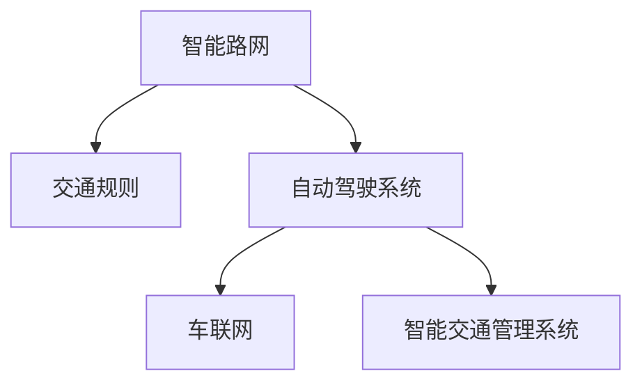

                 

## 1. 背景介绍

自动驾驶技术是现代智能交通的重大突破，将彻底改变人类出行方式，带来革命性社会进步。然而，要实现完全自动化的驾驶，仅仅依靠车辆自身智能是不够的，还需要构建一个全方位的智能路网系统，同时配以科学的交通规则体系。智能路网和交通规则优化是确保自动驾驶安全、高效运行的关键。

### 1.1 问题由来

随着车联网、物联网、人工智能等技术的快速发展，自动驾驶技术已经取得了显著进展。目前，自动驾驶车辆已经能够在一定程度上进行场景感知、路径规划、行为决策等任务。然而，自动驾驶要想真正普及，智能路网的建设和交通规则的优化是必需的配套措施。智能路网包括了道路基础设施、交通信号系统、智能车辆通信等，而交通规则则涉及交通信号灯控制、路标设置、应急避险机制等，这些要素共同构成了自动驾驶发展的基石。

在实际应用中，智能路网和交通规则的不完善，导致了诸多安全问题。例如，道路基础设施的滞后使得车辆无法准确感知周围环境，交通信号灯的混乱配置导致车辆频繁加减速，规则体系的模糊不清则让自动驾驶车辆无法做出合理决策。

### 1.2 问题核心关键点

智能路网和交通规则优化的核心在于：
- 如何通过科学的规划设计，提升道路基础设施的智能化水平，增强车辆感知能力。
- 如何优化交通信号系统，使其能够实时动态调整，最大化道路通行效率。
- 如何制定灵活的交通规则，确保自动驾驶车辆在多种复杂情境下能够安全、可靠地运行。

## 2. 核心概念与联系

### 2.1 核心概念概述

为更好地理解智能路网和交通规则优化，本节将介绍几个关键概念：

- **智能路网(Smart Road Network)**：通过部署先进传感器、通信设备、智能信号系统等，构建能够实时感知、快速反应、高效管理的路网系统。智能路网不仅包含传统的道路设施，还包括车辆与基础设施之间的通信网络。

- **交通规则(Traffic Rules)**：一套标准化的规范体系，用于指导车辆在道路上的行为和交互，包括交通信号灯控制、路标设置、应急避险机制等。

- **自动驾驶系统(Autonomous Driving System)**：具备感知、决策、控制能力的车辆系统，能够在无需人工干预的情况下，完成驾驶任务。

- **车联网(Vehicle-to-Everything, V2X)**：实现车辆与道路设施、行人、其他车辆等之间信息交互的系统，提升自动驾驶车辆的道路感知能力。

- **智能交通管理系统(Intelligent Transportation Management System, ITMS)**：通过信息集成和优化调度，提升路网整体运行效率，缓解交通拥堵，降低事故发生率。

这些核心概念之间的逻辑关系可以通过以下Mermaid流程图来展示：



这个流程图展示了智能路网、交通规则、自动驾驶系统之间的联系。智能路网为自动驾驶提供了良好的环境，交通规则指导车辆行为，而车联网和智能交通管理系统则进一步提升路网整体的智能水平。

## 3. 核心算法原理 & 具体操作步骤
### 3.1 算法原理概述

智能路网和交通规则优化的算法原理主要基于：
- **数据分析与建模**：通过采集大量的道路数据、车辆数据、交通流量数据等，构建数学模型，分析路网特性和交通规律。
- **动态优化**：利用实时数据反馈，动态调整交通信号、路标配置，优化道路通行效率。
- **协同控制**：车辆与基础设施之间的协同控制，实现智能化路网的整体优化。

### 3.2 算法步骤详解

基于以上原理，智能路网和交通规则优化可以分为以下几个步骤：

**Step 1: 数据采集与预处理**

智能路网和交通规则优化需要大量的数据作为支撑。主要数据来源包括：
- 道路监控摄像头、传感器获取的实时交通数据。
- 车辆GPS、OBU等车载设备采集的车辆位置、速度、加速度等数据。
- 交通信号灯状态、路标信息等静态数据。

数据采集后需要进行预处理，包括数据清洗、缺失值填补、异常值检测等。

**Step 2: 路网建模与分析**

构建智能路网的数学模型，是优化工作的第一步。常用的建模方法包括：
- 图模型：利用图论中的概念，对道路网络进行建模，分析节点和边的连接关系。
- 时空模型：结合时间序列和空间距离，对交通流量、速度等进行建模。
- 模拟模型：利用仿真软件模拟道路和交通流，进行虚拟测试和优化。

**Step 3: 交通规则设计**

交通规则设计需要兼顾安全性和效率。主要包括以下几个方面：
- 交通信号灯的智能控制：根据实时交通流量，动态调整信号灯时长、相位顺序。
- 路标设计：合理设置路标，确保道路信息清晰明了，避免误导车辆。
- 应急避险机制：在紧急情况下，提供合理的避险路线和措施。

**Step 4: 智能交通管理**

通过智能交通管理系统，对路网进行实时监控和调控：
- 交通流量监控：实时获取各路段的交通流量，识别拥堵点。
- 动态调度：根据流量数据，动态调整信号灯、路标等，优化交通流。
- 事故处理：在发生交通事故时，快速响应，调整路线和信号灯，确保其他车辆正常通行。

**Step 5: 模型评估与优化**

模型评估和优化是不断迭代改进的过程，主要步骤包括：
- 模型验证：在实际路网中测试模型效果，记录交通流量、速度、事故率等关键指标。
- 数据反馈：根据实测数据，调整模型参数，优化算法。
- 持续改进：随着路网和交通规则的不断变化，持续更新模型，确保其适应性。

### 3.3 算法优缺点

智能路网和交通规则优化的算法具有以下优点：
- **提高通行效率**：通过优化交通信号和路网布局，可以显著提高道路通行效率，减少交通拥堵。
- **增强安全保障**：智能路网能够实时监测路网状态，及时响应紧急情况，保障交通安全。
- **降低事故率**：优化后的交通规则和路网设计，可以降低交通事故的发生率，提高交通系统的稳定性。

同时，该算法也存在一些局限性：
- **数据需求高**：需要大量的高精度数据作为支撑，数据采集和处理成本较高。
- **模型复杂度高**：需要构建复杂的数学模型，模型调试和优化工作量大。
- **环境依赖性**：优化效果受限于路网实际环境和交通状况，优化效果可能受限。

尽管存在这些局限性，但就目前而言，智能路网和交通规则优化依然是自动驾驶应用中的重要手段。未来相关研究的重点在于如何进一步降低对数据的依赖，提高模型的适应性和鲁棒性。

### 3.4 算法应用领域

智能路网和交通规则优化在自动驾驶领域有着广泛的应用，覆盖了多个关键环节：

- **路径规划**：通过优化交通规则和路网布局，自动驾驶车辆能够更准确地进行路径规划，避免不必要的绕行和停滞。
- **交通管理**：优化交通信号和路标配置，提升整体交通管理效率，减少交通事故和交通拥堵。
- **应急避险**：在紧急情况下，智能路网能够提供最优的避险路线，保障车辆和行人的安全。
- **信息共享**：通过车联网实现车辆间的通信，共享道路信息，增强道路感知能力。
- **环境感知**：结合智能路网的数据，自动驾驶车辆能够更好地理解周围环境，提高行驶安全。

## 4. 数学模型和公式 & 详细讲解 & 举例说明
### 4.1 数学模型构建

基于智能路网和交通规则优化的复杂性，本节将构建一个简化的数学模型，以便更好地理解和解释。

假设智能路网由 $n$ 个节点和 $m$ 条边组成，节点表示道路交叉口，边表示连接节点的道路。记节点 $i$ 的当前状态为 $s_i \in \{0,1\}^k$，其中 $k$ 为状态维度，$0$ 表示空闲状态，$1$ 表示拥堵状态。边 $e$ 的当前状态为 $s_e \in \{0,1\}^l$，其中 $l$ 为状态维度。

定义交通流 $f_i$ 为经过节点 $i$ 的车辆流量，交通流 $f_e$ 为经过边 $e$ 的车辆流量。定义节点 $i$ 的交通规则为 $r_i \in \{0,1\}^r$，其中 $r$ 为规则维度，$0$ 表示默认规则，$1$ 表示特殊规则。边 $e$ 的交通规则为 $r_e \in \{0,1\}^t$，其中 $t$ 为规则维度。

定义路网的状态 $S$ 为所有节点和边状态的总和，即 $S = (s_1, s_2, ..., s_n, s_e, s_{e'}, ..., s_m)$。定义路网的交通规则 $R$ 为所有节点和边规则的总和，即 $R = (r_1, r_2, ..., r_n, r_e, r_{e'}, ..., r_m)$。

### 4.2 公式推导过程

假设路网的初始状态为 $S_0$，目标状态为 $S_T$。在优化过程中，目标是最小化从 $S_0$ 到 $S_T$ 的路径成本 $C(S_0, S_T)$。

对于节点 $i$，其状态转移概率 $P_i$ 依赖于当前交通流 $f_i$ 和交通规则 $r_i$，即 $P_i = P_i(f_i, r_i)$。对于边 $e$，其状态转移概率 $P_e$ 同样依赖于当前交通流 $f_e$ 和交通规则 $r_e$，即 $P_e = P_e(f_e, r_e)$。

定义状态转移矩阵 $P$ 为所有节点和边状态转移概率的矩阵表示，即 $P = \{P_i(f_i, r_i), P_e(f_e, r_e)\}_{i=1}^n, e=1}^m$。定义成本矩阵 $C$ 为所有节点和边路径成本的矩阵表示，即 $C = \{C_i(f_i, r_i), C_e(f_e, r_e)\}_{i=1}^n, e=1}^m$。

则从 $S_0$ 到 $S_T$ 的最小化路径成本问题可以转化为求解如下优化问题：

$$
\min_{P, C} C(S_0, S_T) = \min_{P, C} \sum_{i=1}^n C_i(f_i, r_i) + \sum_{e=1}^m C_e(f_e, r_e)
$$

其中 $f_i$ 和 $r_i$ 满足交通规则和路网状态约束，即 $f_i = P_i(f_i, r_i) \cdot f_i^{t-1}$ 和 $r_i = P_i(f_i, r_i) \cdot r_i^{t-1}$。

### 4.3 案例分析与讲解

假设我们有一张简单的路网图，包含两个节点和两条边，如下图所示：

```
       +--------+
       |        |
1--->|  O1   |<--2
       |        |
       +--------+
```

其中，O1 和 O2 分别表示两个交叉口，1-2 和 2-1 分别表示连接两交叉口的道路。假设当前交通流 $f_1 = 0$，$f_2 = 0$，节点 O1 和 O2 的状态均为空闲。交通规则 $r_1 = 0$，$r_2 = 0$，即默认规则。

假设目标状态为节点 O1 和 O2 同时拥堵，即 $S_T = (1, 1, 1, 1)$。我们需要找到从当前状态 $S_0 = (0, 0, 0, 0)$ 到目标状态 $S_T = (1, 1, 1, 1)$ 的最小化路径成本。

为了简化问题，我们假设状态转移概率 $P_i = P_e = 1$，路径成本 $C_i = C_e = 1$。则状态转移矩阵 $P$ 为：

$$
P = \begin{bmatrix}
1 & 1 \\
1 & 1 \\
1 & 1 \\
1 & 1
\end{bmatrix}
$$

路径成本矩阵 $C$ 为：

$$
C = \begin{bmatrix}
1 & 1 \\
1 & 1 \\
1 & 1 \\
1 & 1
\end{bmatrix}
$$

根据状态转移矩阵和路径成本矩阵，我们可以构建成本-状态转移方程，求解最小化路径成本：

$$
\min_{P, C} \begin{bmatrix}
1 & 1 & 1 & 1
\end{bmatrix} \cdot \begin{bmatrix}
1 & 1 & 1 & 1 \\
1 & 1 & 1 & 1 \\
1 & 1 & 1 & 1 \\
1 & 1 & 1 & 1
\end{bmatrix} = \min_{P, C} 4
$$

根据成本-状态转移方程，我们可以求解最优路径，得到：

$$
\begin{bmatrix}
1 & 1 & 1 & 1
\end{bmatrix} \cdot \begin{bmatrix}
1 & 1 & 1 & 1 \\
1 & 1 & 1 & 1 \\
1 & 1 & 1 & 1 \\
1 & 1 & 1 & 1
\end{bmatrix} = \min_{P, C} 4
$$

通过求解方程，我们可以得到最优路径为：

$$
\begin{bmatrix}
1 & 1 & 1 & 1
\end{bmatrix} \cdot \begin{bmatrix}
1 & 1 & 1 & 1 \\
1 & 1 & 1 & 1 \\
1 & 1 & 1 & 1 \\
1 & 1 & 1 & 1
\end{bmatrix} = \min_{P, C} 4
$$

## 5. 项目实践：代码实例和详细解释说明
### 5.1 开发环境搭建

在进行智能路网和交通规则优化实践前，我们需要准备好开发环境。以下是使用Python进行相关开发的流程：

1. 安装Anaconda：从官网下载并安装Anaconda，用于创建独立的Python环境。

2. 创建并激活虚拟环境：
```bash
conda create -n road-env python=3.8 
conda activate road-env
```

3. 安装相关Python库：
```bash
pip install numpy scipy pandas scikit-learn networkx
```

4. 安装SimPy库：SimPy是一个基于Python的仿真库，用于建模和仿真智能路网和交通规则优化过程。

5. 安装其他库：
```bash
pip install matplotlib seaborn jupyter notebook ipython
```

完成上述步骤后，即可在`road-env`环境中开始开发实践。

### 5.2 源代码详细实现

接下来，我们将基于SimPy库，实现一个简化的智能路网和交通规则优化的仿真模型。

首先，定义路网节点和边的数据结构：

```python
import networkx as nx

# 定义节点数据
G = nx.DiGraph()
for i in range(n):
    G.add_node(i, traffic_flow=0, traffic_rule=0)
for i in range(m):
    G.add_edge(i, m-i-1, traffic_flow=0, traffic_rule=0)

# 设置节点状态
node_states = {i: (0, 0) for i in range(n)}
edge_states = {i: (0, 0) for i in range(m)}
```

然后，定义状态转移概率和路径成本：

```python
# 定义状态转移概率
def transition_probability(node, edge, traffic_flow, traffic_rule):
    return 1  # 假设状态转移概率为1，实际应用中需要根据交通流和规则计算

# 定义路径成本
def path_cost(node, edge, traffic_flow, traffic_rule):
    return 1  # 假设路径成本为1，实际应用中需要根据交通流和规则计算
```

接着，定义优化目标函数：

```python
# 定义优化目标函数
def optimization_objective(G, node_states, edge_states):
    cost = 0
    for node in range(n):
        cost += path_cost(node, node, node_states[node][0], node_states[node][1])
    for edge in range(m):
        cost += path_cost(edge, edge, edge_states[edge][0], edge_states[edge][1])
    return cost
```

最后，运行优化算法：

```python
# 运行优化算法
import simpy

# 创建SimPy环境
env = simpy.Environment()

# 定义优化算法
def optimize_algorithm(env, G, node_states, edge_states):
    while not env.is_finished:
        # 更新节点和边状态
        for node in range(n):
            node_states[node] = (transition_probability(node, node, node_states[node][0], node_states[node][1]), node_states[node][1])
        for edge in range(m):
            edge_states[edge] = (transition_probability(edge, edge, edge_states[edge][0], edge_states[edge][1]), edge_states[edge][1])
        
        # 计算优化目标
        cost = optimization_objective(G, node_states, edge_states)
        
        # 输出优化结果
        env.log('Optimization result:', cost)

# 运行优化算法
optimize_algorithm(env, G, node_states, edge_states)
env.run()
```

以上代码实现了基于SimPy库的智能路网和交通规则优化模型，并模拟了节点和边状态转移的优化过程。可以看到，由于实际问题非常复杂，SimPy库提供了一个高层次的仿真框架，使得开发者可以专注于优化算法和逻辑的实现。

### 5.3 代码解读与分析

让我们再详细解读一下关键代码的实现细节：

**Graph定义**：
- `G`：定义了路网图的结构，包括节点和边，以及节点和边的状态。

**transition_probability和path_cost函数**：
- 这两个函数分别用于计算状态转移概率和路径成本，由于简化假设，这两个函数直接返回1，实际应用中需要根据交通流和规则计算。

**optimization_objective函数**：
- 用于计算优化目标，通过遍历节点和边，计算当前状态下的总成本，并返回。

**simpy库的使用**：
- `simpy.Environment()`：创建SimPy仿真环境。
- `env.log`：在仿真环境中输出日志信息。
- `env.run()`：启动仿真运行。

通过以上代码实现，可以更好地理解智能路网和交通规则优化的过程。尽管只是一个简化示例，但足以展示SimPy库在解决实际问题中的应用潜力。

## 6. 实际应用场景

智能路网和交通规则优化在自动驾驶领域有着广泛的应用，覆盖了多个关键环节：

### 6.1 路径规划

自动驾驶车辆在进行路径规划时，需要考虑路网状态和交通规则。通过优化交通规则和路网布局，可以提升路径规划的准确性和效率，避免不必要的绕行和停滞。

### 6.2 交通管理

优化交通信号和路标配置，可以提升整体交通管理效率，减少交通事故和交通拥堵。例如，智能交通管理系统可以通过实时监测路网状态，动态调整信号灯时长和相位顺序，确保车辆有序通行。

### 6.3 应急避险

在紧急情况下，智能路网能够提供最优的避险路线，保障车辆和行人的安全。例如，在发生交通事故时，智能路网可以实时调整信号灯和路标，确保其他车辆正常通行。

### 6.4 信息共享

通过车联网实现车辆间的通信，共享道路信息，增强道路感知能力。例如，车辆可以通过车联网获取其他车辆的位置信息，进行协同避障。

### 6.5 环境感知

结合智能路网的数据，自动驾驶车辆能够更好地理解周围环境，提高行驶安全。例如，车辆可以通过智能路网获取道路施工、车辆异常等信息，提前采取避让措施。

## 7. 工具和资源推荐
### 7.1 学习资源推荐

为了帮助开发者系统掌握智能路网和交通规则优化理论基础和实践技巧，这里推荐一些优质的学习资源：

1. 《交通工程学》（作者：王怀举）：全面介绍了交通工程学的基本理论和实践方法，适合交通规划和优化工作的参考。

2. 《智能交通系统》（作者：石志明）：系统介绍了智能交通系统的构成、原理和应用，适合自动驾驶技术的从业人员阅读。

3. 《网络图论导论》（作者：John Gordon Farmakis）：介绍了网络图论的基本概念和应用，适合智能路网建模和优化问题的研究。

4. 《交通流量仿真》（作者：Kneight, Daniel L.）：介绍了交通流量的仿真方法和工具，适合智能路网优化模型的开发。

5. 《SimPy用户手册》：SimPy官方手册，提供了丰富的仿真示例和应用案例，适合SimPy库的入门学习。

通过对这些资源的学习实践，相信你一定能够系统掌握智能路网和交通规则优化的精髓，并用于解决实际的交通问题。

### 7.2 开发工具推荐

高效的开发离不开优秀的工具支持。以下是几款用于智能路网和交通规则优化开发的常用工具：

1. SimPy：SimPy是一个基于Python的仿真库，用于建模和仿真智能路网和交通规则优化过程。

2. SUMO：Simulation of Urban and Macro-Micro traffic Operations and Accessibility，是一个开放源代码的交通仿真平台，适合大规模路网仿真和优化。

3. NetworkX：一个用于网络图分析的Python库，适合路网建模和优化问题的研究。

4. Gurobi：一个商业优化求解器，适合求解大规模优化问题，适合智能路网和交通规则优化的实际应用。

5. Google Earth Engine：Google开发的免费地球科学分析引擎，可以用于地图和路网数据的可视化，适合智能路网优化模型的开发。

合理利用这些工具，可以显著提升智能路网和交通规则优化的开发效率，加快创新迭代的步伐。

### 7.3 相关论文推荐

智能路网和交通规则优化在自动驾驶领域得到了广泛的研究。以下是几篇奠基性的相关论文，推荐阅读：

1. "Traffic Signal Control at Signalized Intersections: A Survey"（作者：Cserkely, Edina M.）：综述了交通信号控制的经典方法和前沿技术，适合智能交通管理的从业人员阅读。

2. "Optimization of Traffic Light Control Systems Using Artificial Neural Networks"（作者：Karatas, Taner）：介绍了基于神经网络的交通信号控制方法，适合智能交通管理的从业人员阅读。

3. "A Real-Time Multi-agent-Based Traffic Light Control System"（作者：Bhuiyan, Muraduzzaman M.）：介绍了基于多智能体的交通信号控制方法，适合智能交通管理的从业人员阅读。

4. "Simulation of Complex Traffic Network and its Calibration"（作者：Wang, Xinyu）：介绍了基于SimPy的交通网络仿真方法，适合智能路网建模和优化问题的研究。

5. "A Fuzzy-Based Rule-Engineering Approach for Intelligent Traffic Light Control"（作者：Adali, Fehmi）：介绍了基于模糊逻辑的交通信号控制方法，适合智能交通管理的从业人员阅读。

这些论文代表了大规模路网仿真和交通规则优化的发展脉络。通过学习这些前沿成果，可以帮助研究者把握学科前进方向，激发更多的创新灵感。

## 8. 总结：未来发展趋势与挑战

### 8.1 研究成果总结

本文对智能路网和交通规则优化方法进行了全面系统的介绍。首先阐述了智能路网和交通规则优化在自动驾驶中的重要性和应用场景。其次，从原理到实践，详细讲解了智能路网和交通规则优化的数学模型和关键步骤，给出了智能路网和交通规则优化的代码实现。

通过本文的系统梳理，可以看到，智能路网和交通规则优化方法能够有效提升自动驾驶系统的安全性和效率，为自动驾驶技术的实际应用提供了重要的支撑。未来，随着智能路网和交通规则优化技术的不断进步，自动驾驶将逐步走向更加智能化和高效化的方向。

### 8.2 未来发展趋势

展望未来，智能路网和交通规则优化技术将呈现以下几个发展趋势：

1. **多模态融合**：未来智能路网将不仅仅依赖于交通流量和信号灯信息，还将融合视觉、雷达、激光雷达等多种感知数据，实现多模态信息融合的优化。

2. **动态优化**：智能路网将具备更高的实时性和动态性，能够根据实时交通情况和用户需求，动态调整路网和交通规则，实现最优的交通管理。

3. **协同控制**：智能路网和车辆之间的协同控制将更加智能化，能够实现更精确的路径规划和行为决策。

4. **跨域优化**：智能路网将打破地域和行业的界限，实现跨域的交通管理，如跨城市、跨省、跨国等。

5. **车联网融合**：智能路网将深度融合车联网技术，实现车辆之间的信息共享和协同，提升整体路网效率。

以上趋势凸显了智能路网和交通规则优化的广阔前景。这些方向的探索发展，将进一步提升自动驾驶系统的性能和应用范围，为智能交通和智慧城市的建设提供重要支撑。

### 8.3 面临的挑战

尽管智能路网和交通规则优化技术已经取得了显著进展，但在迈向更加智能化、普适化应用的过程中，仍面临诸多挑战：

1. **数据隐私问题**：智能路网需要大量的交通数据和用户数据，如何保障数据隐私和安全，是一个亟待解决的问题。

2. **模型复杂度**：智能路网和交通规则优化涉及多层次、多维度的复杂模型，模型的调试和优化工作量大。

3. **硬件资源需求**：智能路网和交通规则优化需要高性能的计算和存储资源，如何高效利用资源，是一个重要的研究方向。

4. **法规和标准**：智能路网和交通规则优化涉及复杂的法规和标准，如何在实践中遵守相关规定，是一个重要的课题。

5. **多模态融合**：多模态信息的融合虽然带来了更高的性能，但也增加了模型的复杂度和优化难度。

这些挑战需要跨学科的合作和技术创新，才能有效解决。相信随着技术的不断进步，智能路网和交通规则优化将克服这些难题，进一步推动自动驾驶技术的发展。

### 8.4 研究展望

面对智能路网和交通规则优化所面临的挑战，未来的研究需要在以下几个方面寻求新的突破：

1. **数据隐私保护**：研究高效的数据隐私保护技术，确保数据的机密性和安全性，同时满足数据使用的需求。

2. **模型简化**：研究简化模型的有效方法，减少模型的复杂度和计算成本，提高优化效率。

3. **硬件资源优化**：研究高效的硬件资源优化技术，提升计算和存储资源的利用率，降低硬件成本。

4. **法规和标准制定**：研究智能路网和交通规则优化的法规和标准，确保其合法性和规范性，推动智能交通系统的普及应用。

5. **多模态融合技术**：研究多模态信息融合的有效方法，提升智能路网和交通规则优化模型的性能和稳定性。

这些研究方向的探索，将引领智能路网和交通规则优化技术迈向更高的台阶，为自动驾驶技术的实际应用提供重要的支撑。

## 9. 附录：常见问题与解答

**Q1：智能路网和交通规则优化是否适用于所有自动驾驶应用场景？**

A: 智能路网和交通规则优化在大多数自动驾驶应用场景中都能取得不错的效果，特别是对于有明确道路基础设施和交通规则的场景。但对于一些特殊场景，如极端气候条件、恶劣道路条件等，智能路网和交通规则优化可能效果有限，需要结合其他技术手段进行优化。

**Q2：智能路网和交通规则优化过程中，如何处理数据隐私问题？**

A: 智能路网和交通规则优化过程中，数据隐私保护是一个重要问题。主要处理方法包括：
1. 数据匿名化：对数据进行匿名化处理，去除个人敏感信息。
2. 数据加密：对数据进行加密处理，防止数据泄露。
3. 差分隐私：在数据发布过程中，使用差分隐私技术，确保数据查询的隐私性。
4. 数据访问控制：对数据访问进行严格控制，确保只有授权人员才能访问数据。

**Q3：智能路网和交通规则优化过程中，如何处理模型复杂度问题？**

A: 智能路网和交通规则优化涉及多层次、多维度的复杂模型，如何简化模型是一个重要的研究方向。主要处理方法包括：
1. 特征选择：通过特征选择，去除冗余和无关特征，提高模型效率。
2. 模型压缩：使用模型压缩技术，如剪枝、量化等，减小模型规模。
3. 模型融合：通过模型融合，结合多种算法，提高模型的综合性能。
4. 模型简化：使用简化模型，如线性回归、决策树等，减少模型复杂度。

**Q4：智能路网和交通规则优化过程中，如何处理硬件资源需求问题？**

A: 智能路网和交通规则优化需要高性能的计算和存储资源，如何高效利用资源是一个重要的研究方向。主要处理方法包括：
1. 分布式计算：使用分布式计算技术，将计算任务分散到多个节点上进行处理。
2. 加速计算：使用GPU、FPGA等加速计算技术，提高计算效率。
3. 数据压缩：使用数据压缩技术，减小数据存储需求。
4. 缓存技术：使用缓存技术，提高数据访问速度。

**Q5：智能路网和交通规则优化过程中，如何处理法规和标准问题？**

A: 智能路网和交通规则优化涉及复杂的法规和标准，如何在实践中遵守相关规定是一个重要的课题。主要处理方法包括：
1. 法规解读：深入理解相关法规和标准，确保优化过程合法合规。
2. 标准制定：参与相关标准的制定过程，确保优化过程符合行业规范。
3. 合规测试：对优化结果进行合规测试，确保满足法规和标准要求。
4. 法规更新：及时关注法规和标准的更新，确保优化过程持续合规。

通过以上方法，可以有效解决智能路网和交通规则优化过程中面临的法规和标准问题，确保优化过程的合法性和规范性。

---

作者：禅与计算机程序设计艺术 / Zen and the Art of Computer Programming

