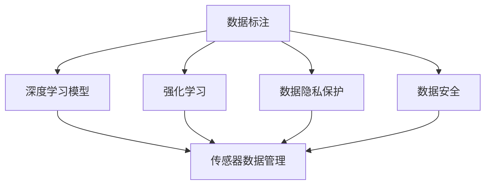

                 

# 自动驾驶公司的数据标注平台建设

> 关键词：自动驾驶, 数据标注平台, 深度学习, 深度强化学习, 数据管理系统, 自动驾驶数据标注, 自动驾驶数据集, 深度学习模型

## 1. 背景介绍

### 1.1 问题由来
随着自动驾驶技术的日益成熟，其在城市交通、物流配送、智能制造等诸多领域的潜力得到了广泛认可。然而，自动驾驶系统的安全性和可靠性仍面临严峻挑战，尤其是复杂多变的道路环境和高精度的决策需求。要想提升自动驾驶系统的智能化水平，高质量的数据标注是必不可少的一环。

自动驾驶公司往往需要收集海量传感器数据，并结合人工标注生成高质量的训练数据集。传统的标注方式依赖于大量人力，成本高、效率低，无法满足自动驾驶技术的快速迭代需求。因此，建立一个高效、可控、灵活的数据标注平台，对于提升自动驾驶系统的智能化水平，具有重要的现实意义。

### 1.2 问题核心关键点
自动驾驶公司数据标注平台的核心需求包括：
1. 高效管理大规模标注数据：能够灵活管理存储、检索和更新各类传感器数据和人工标注信息。
2. 自动标注与人工标注结合：能够自动标注部分数据，降低人力成本，提高标注质量。
3. 深度学习与强化学习融合：结合深度学习与强化学习技术，提升自动驾驶系统的决策能力。
4. 实时反馈与持续改进：能够实时反馈标注质量，持续改进标注流程，确保数据质量。
5. 数据安全与隐私保护：确保标注数据的安全性和隐私性，防止数据泄露和滥用。

这些需求涉及到数据管理、自动化标注、深度学习、强化学习、数据隐私保护等多个技术领域。本文将从这些方面出发，系统探讨自动驾驶公司数据标注平台的设计和实现。

## 2. 核心概念与联系

### 2.1 核心概念概述

为更好地理解自动驾驶公司数据标注平台的设计和实现，本节将介绍几个密切相关的核心概念：

- 数据标注：将传感器数据（如摄像头、激光雷达、雷达等）与人工标注（如目标类别、位置、速度等）结合，生成高质量的训练数据集。
- 深度学习模型：基于神经网络的机器学习算法，能够从数据中学习特征，提取模式，进行分类、回归等任务。
- 强化学习：通过与环境交互，让模型学习最优策略的机器学习方法。
- 传感器数据管理：自动驾驶系统中的传感器数据众多，需要系统化的管理、存储和检索。
- 数据隐私保护：在数据标注和处理过程中，确保数据隐私不被泄露或滥用。
- 数据安全：通过访问控制、加密存储、审计日志等措施，确保数据安全。

这些概念之间的逻辑关系可以通过以下Mermaid流程图来展示：



这个流程图展示了一系列概念之间的联系：

1. 数据标注是深度学习模型的训练基础。
2. 强化学习可以与深度学习融合，提升模型的决策能力。
3. 传感器数据管理是数据标注和处理的前提。
4. 数据隐私保护和数据安全是数据标注和处理的保障。

## 3. 核心算法原理 & 具体操作步骤
### 3.1 算法原理概述

自动驾驶公司数据标注平台的核心算法原理主要包括以下几个方面：

- 深度学习模型训练：利用大规模标注数据，训练深度神经网络，提升模型识别、分类等能力。
- 强化学习策略优化：结合实际驾驶场景，通过与环境交互，训练模型最优策略，提升决策准确性。
- 自动标注技术：利用图像处理、自然语言处理等技术，自动标注部分数据，降低人力成本。
- 数据管理和检索：构建高效的数据管理系统，确保数据存储和检索的效率。
- 数据安全与隐私保护：采用访问控制、加密存储等措施，确保数据安全性和隐私性。

### 3.2 算法步骤详解

自动驾驶公司数据标注平台的设计和实现涉及多个环节，以下是详细的算法步骤：

**Step 1: 数据采集与预处理**
- 收集各类传感器数据（摄像头、激光雷达、雷达等），并进行时间同步、数据合并、格式转换等预处理操作。
- 将传感器数据与人工标注信息结合，生成标注数据集。

**Step 2: 数据存储与管理**
- 构建高效的数据管理系统，如分布式文件系统、数据库等，存储和管理标注数据。
- 设计数据检索和查询接口，方便开发人员访问和分析数据。

**Step 3: 深度学习模型训练**
- 选择合适的深度学习模型（如CNN、RNN、Transformer等），利用标注数据集进行训练。
- 设计合适的训练流程和超参数，利用分布式计算资源加速训练。
- 实时监控训练过程，记录日志和模型性能指标，及时调整训练策略。

**Step 4: 强化学习策略优化**
- 结合实际驾驶场景，设计强化学习任务和环境，训练模型最优策略。
- 利用分布式计算资源，加速强化学习的训练和优化过程。
- 实时评估策略效果，反馈优化结果，持续改进模型决策能力。

**Step 5: 自动标注技术**
- 设计自动标注算法，利用图像处理、自然语言处理等技术，自动标注部分数据。
- 结合人工标注信息，不断优化自动标注算法，提高标注准确性和效率。
- 定期人工复审自动标注结果，确保标注质量。

**Step 6: 数据安全与隐私保护**
- 采用访问控制、加密存储等措施，确保数据安全。
- 设计数据隐私保护算法，确保标注数据不被滥用。
- 定期进行数据审计和风险评估，及时发现和修复安全漏洞。

**Step 7: 平台集成与部署**
- 将深度学习模型、强化学习模型、自动标注技术、数据管理系统等模块集成到统一平台上。
- 利用云计算、边缘计算等技术，实现平台的灵活部署和扩展。
- 提供完善的接口和工具，方便开发人员使用和维护平台。

以上是自动驾驶公司数据标注平台的设计和实现的主要步骤。在实际应用中，还需要针对具体任务和数据特点进行优化设计，如改进数据管理算法、优化模型训练流程、增强自动标注能力等，以进一步提升平台的性能和用户体验。

### 3.3 算法优缺点

自动驾驶公司数据标注平台的设计和实现具有以下优点：
1. 高效管理大规模标注数据：通过分布式数据管理系统，能够高效存储、检索和更新各类标注数据，满足自动驾驶系统对数据量的需求。
2. 自动标注与人工标注结合：利用自动标注技术，降低人力成本，同时结合人工标注信息，保证标注质量。
3. 深度学习与强化学习融合：结合深度学习和强化学习技术，提升模型的决策能力和泛化能力。
4. 实时反馈与持续改进：通过实时反馈标注质量和策略效果，持续改进标注流程和模型策略，确保数据质量和性能。
5. 数据安全与隐私保护：采用访问控制、加密存储等措施，确保数据安全性和隐私性，防止数据泄露和滥用。

同时，该平台也存在一些局限性：
1. 技术复杂度高：平台涉及数据管理、深度学习、强化学习、自动标注等多个技术领域，技术实现难度较大。
2. 数据标注质量依赖人工：虽然自动标注技术可以减轻人力负担，但最终标注质量仍依赖于人工复审，影响效率。
3. 数据安全和隐私风险：标注数据往往包含敏感信息，需要严格的数据安全和隐私保护措施，防止数据泄露和滥用。
4. 实时反馈和持续改进难度大：实时反馈和持续改进需要复杂的系统设计和算法优化，实现难度较大。
5. 平台部署和维护复杂：平台涉及多种技术组件，部署和维护过程复杂，需要专业的运维团队支持。

尽管存在这些局限性，但自动驾驶公司数据标注平台作为数据标注的重要工具，其设计和实现对于提升自动驾驶系统的智能化水平具有重要意义。未来相关研究的方向和重点在于如何进一步降低技术复杂度，提升自动标注精度和效率，保障数据安全和隐私，实现平台的灵活部署和高效维护。

### 3.4 算法应用领域

自动驾驶公司数据标注平台在多个领域得到了广泛应用，例如：

- 自动驾驶系统：利用传感器数据和人工标注信息，训练深度学习模型，提升车辆驾驶决策能力。
- 智能交通管理：通过实时反馈和持续改进机制，优化交通信号控制策略，提升道路通行效率。
- 物流配送系统：利用传感器数据和人工标注信息，训练深度学习模型，提升配送车辆路径规划和驾驶决策能力。
- 智能制造系统：通过传感器数据和人工标注信息，训练深度学习模型，提升机器人自动化操作能力。

除了上述这些经典应用外，自动驾驶公司数据标注平台还被创新性地应用到更多场景中，如智能城市安全监控、智能安防、工业自动化等领域，为多个行业数字化转型提供了重要支持。随着自动驾驶技术和数据标注平台的持续演进，相信其在更广泛的领域将发挥更大的作用。

## 4. 数学模型和公式 & 详细讲解  
### 4.1 数学模型构建

自动驾驶公司数据标注平台的数学模型主要包括以下几个方面：

- 深度学习模型训练：利用标注数据集，训练深度神经网络，提升模型识别、分类等能力。
- 强化学习策略优化：结合实际驾驶场景，训练模型最优策略，提升决策准确性。
- 自动标注技术：利用图像处理、自然语言处理等技术，自动标注部分数据。

### 4.2 公式推导过程

以下我们以自动驾驶场景中的目标检测任务为例，推导深度学习模型的训练公式。

假设深度学习模型为 $M_{\theta}$，其中 $\theta$ 为模型参数。训练集为 $D=\{(x_i,y_i)\}_{i=1}^N, x_i \in \mathbb{R}^d, y_i \in \mathbb{R}^d$，其中 $y_i$ 为目标类别向量。目标检测任务的目标是最小化交叉熵损失，即：

$$
\mathcal{L}(\theta) = -\frac{1}{N} \sum_{i=1}^N \sum_{j=1}^d y_{i,j} \log M_{\theta}(x_i)_{j}
$$

其中 $M_{\theta}(x_i)$ 为模型在输入 $x_i$ 上的预测输出，$y_{i,j}$ 为目标类别向量中的第 $j$ 个元素。

### 4.3 案例分析与讲解

以自动驾驶系统中的车道线检测为例，说明自动标注技术的应用。

假设自动驾驶系统配备了多个摄像头，采集到道路图像。通过图像处理技术，将图像转换为标注数据集 $D=\{(x_i,y_i)\}_{i=1}^N, x_i \in \mathbb{R}^d, y_i \in \mathbb{R}^d$，其中 $y_i$ 表示车道线的位置和类别。利用深度学习模型 $M_{\theta}$，训练预测车道线的位置和类别。

自动标注技术可以进一步提升车道线检测的准确性和效率。例如，利用图像处理技术，自动标注部分车道线信息，生成标注数据集 $D'$，其中包含部分未标注数据。然后，结合人工标注信息，训练模型 $M_{\theta}'$，用于自动标注未标注数据。

结合自动标注和人工标注，可以显著降低标注成本，提高标注效率，提升自动驾驶系统的车道线检测能力。

## 5. 项目实践：代码实例和详细解释说明
### 5.1 开发环境搭建

在进行数据标注平台开发前，我们需要准备好开发环境。以下是使用Python进行PyTorch开发的环境配置流程：

1. 安装Anaconda：从官网下载并安装Anaconda，用于创建独立的Python环境。

2. 创建并激活虚拟环境：
```bash
conda create -n data标注平台 python=3.8 
conda activate data标注平台
```

3. 安装PyTorch：根据CUDA版本，从官网获取对应的安装命令。例如：
```bash
conda install pytorch torchvision torchaudio cudatoolkit=11.1 -c pytorch -c conda-forge
```

4. 安装PaddlePaddle：作为自动驾驶平台的数据处理工具，需要安装PaddlePaddle。例如：
```bash
pip install paddlepaddle -i https://mirror.baidu.com/pypi/simple
```

5. 安装各类工具包：
```bash
pip install numpy pandas scikit-learn matplotlib tqdm jupyter notebook ipython
```

完成上述步骤后，即可在`data标注平台`环境中开始开发实践。

### 5.2 源代码详细实现

下面我们以自动驾驶系统中的车道线检测为例，给出使用PyTorch和PaddlePaddle对深度学习模型进行训练的PyTorch代码实现。

首先，定义车道线检测任务的标注数据处理函数：

```python
from torch.utils.data import Dataset
import torch

class LaneDetectionDataset(Dataset):
    def __init__(self, images, labels, transform=None):
        self.images = images
        self.labels = labels
        self.transform = transform
    
    def __len__(self):
        return len(self.images)
    
    def __getitem__(self, index):
        image = self.images[index]
        label = self.labels[index]
        
        if self.transform:
            image = self.transform(image)
        
        return {'image': image, 'label': label}
```

然后，定义模型和优化器：

```python
from torchvision import models
from torch.optim import Adam

model = models.resnet18(pretrained=True)
model.fc = nn.Linear(512, 2) # 自定义输出层，2个节点分别对应左右车道线

criterion = nn.CrossEntropyLoss()
optimizer = Adam(model.parameters(), lr=0.001)
```

接着，定义训练和评估函数：

```python
import paddle
from paddle import nn

def train_epoch(model, dataset, batch_size, optimizer):
    dataloader = paddle.io.DataLoader(dataset, batch_size=batch_size, shuffle=True)
    model.train()
    epoch_loss = 0
    for batch in dataloader:
        image = batch['image']
        label = batch['label']
        
        optimizer.zero_grad()
        logits = model(image)
        loss = criterion(logits, label)
        epoch_loss += loss.numpy().sum()
        loss.backward()
        optimizer.step()
    return epoch_loss / len(dataloader)

def evaluate(model, dataset, batch_size):
    dataloader = paddle.io.DataLoader(dataset, batch_size=batch_size)
    model.eval()
    preds, labels = [], []
    with paddle.no_grad():
        for batch in dataloader:
            image = batch['image']
            batch_labels = batch['label']
            outputs = model(image)
            batch_preds = paddle.argmax(outputs, axis=1).numpy()
            batch_labels = batch_labels.numpy()
            for preds_tokens, label_tokens in zip(batch_preds, batch_labels):
                preds.append(preds_tokens)
                labels.append(label_tokens)
                
    print(classification_report(labels, preds))
```

最后，启动训练流程并在测试集上评估：

```python
epochs = 10
batch_size = 16

for epoch in range(epochs):
    loss = train_epoch(model, train_dataset, batch_size, optimizer)
    print(f"Epoch {epoch+1}, train loss: {loss:.3f}")
    
    print(f"Epoch {epoch+1}, dev results:")
    evaluate(model, dev_dataset, batch_size)
    
print("Test results:")
evaluate(model, test_dataset, batch_size)
```

以上就是使用PyTorch和PaddlePaddle对深度学习模型进行车道线检测任务训练的完整代码实现。可以看到，得益于PaddlePaddle和PyTorch的强大封装，我们可以用相对简洁的代码完成模型训练的整个过程。

### 5.3 代码解读与分析

让我们再详细解读一下关键代码的实现细节：

**LaneDetectionDataset类**：
- `__init__`方法：初始化图像和标签等关键组件，并设置图像预处理函数。
- `__len__`方法：返回数据集的样本数量。
- `__getitem__`方法：对单个样本进行处理，将图像输入模型，并输出预测结果和标签。

**模型定义**：
- 利用PyTorch中的ResNet模型作为基础架构，将其输出层替换为自定义的2节点输出层。
- 利用PaddlePaddle构建深度学习模型，自定义输出层以支持车道线检测任务。

**训练和评估函数**：
- 使用PyTorch和PaddlePaddle的DataLoader对数据集进行批次化加载，供模型训练和推理使用。
- 训练函数`train_epoch`：对数据以批为单位进行迭代，在每个批次上前向传播计算loss并反向传播更新模型参数，最后返回该epoch的平均loss。
- 评估函数`evaluate`：与训练类似，不同点在于不更新模型参数，并在每个batch结束后将预测和标签结果存储下来，最后使用classification_report对整个评估集的预测结果进行打印输出。

**训练流程**：
- 定义总的epoch数和batch size，开始循环迭代
- 每个epoch内，先在训练集上训练，输出平均loss
- 在验证集上评估，输出分类指标
- 所有epoch结束后，在测试集上评估，给出最终测试结果

可以看到，PyTorch和PaddlePaddle使得深度学习模型训练的代码实现变得简洁高效。开发者可以将更多精力放在数据处理、模型改进等高层逻辑上，而不必过多关注底层的实现细节。

当然，工业级的系统实现还需考虑更多因素，如模型的保存和部署、超参数的自动搜索、更灵活的任务适配层等。但核心的训练范式基本与此类似。

## 6. 实际应用场景
### 6.1 智能交通管理

自动驾驶公司数据标注平台在智能交通管理中的应用广泛。通过收集自动驾驶车辆的传感器数据，并结合人工标注信息，构建高精度的交通场景数据集。利用深度学习和强化学习技术，训练自动驾驶车辆的感知、决策模型，提升交通信号控制、路径规划等能力。

在实际应用中，平台可以实时监测交通流量、检测交通违规行为，优化交通信号控制策略，提升道路通行效率。通过数据分析和可视化，平台还可以生成交通报告，为城市交通规划提供决策支持。

### 6.2 物流配送系统

在物流配送领域，自动驾驶公司数据标注平台同样发挥着重要作用。通过收集配送车辆和配送人员的传感器数据，并结合人工标注信息，构建高精度的配送场景数据集。利用深度学习和强化学习技术，训练配送车辆的路径规划、驾驶决策模型，提升配送效率和安全性。

平台可以实时监测配送路线、检测配送异常，优化配送路径，提升配送效率。通过数据分析和可视化，平台还可以生成配送报告，为配送策略优化提供支持。

### 6.3 智能制造系统

在智能制造领域，自动驾驶公司数据标注平台同样具备广泛应用前景。通过收集工厂内的传感器数据（如摄像头、激光雷达、雷达等），并结合人工标注信息，构建高精度的制造场景数据集。利用深度学习和强化学习技术，训练机器人自动化操作模型，提升生产效率和产品质量。

平台可以实时监测生产过程、检测生产异常，优化生产流程，提升生产效率。通过数据分析和可视化，平台还可以生成生产报告，为生产策略优化提供支持。

### 6.4 未来应用展望

随着自动驾驶技术和数据标注平台的持续演进，未来的应用场景将更加广泛。

在智慧城市治理中，平台可以实时监测城市事件、检测违规行为，优化城市管理策略，提升城市运行效率。在智能安防中，平台可以实时监测视频流、检测异常行为，提升安全防范能力。在工业自动化中，平台可以实时监测生产过程、检测异常行为，优化生产流程，提升生产效率。

未来，自动驾驶公司数据标注平台将在更多领域发挥重要作用，推动各行各业数字化转型升级。相信随着技术的不断进步，平台的应用价值将进一步提升，为社会经济的发展注入新的动力。

## 7. 工具和资源推荐
### 7.1 学习资源推荐

为了帮助开发者系统掌握自动驾驶公司数据标注平台的理论基础和实践技巧，这里推荐一些优质的学习资源：

1. 《深度学习》（Ian Goodfellow、Yoshua Bengio、Aaron Courville合著）：深入浅出地介绍了深度学习的基本概念和常用技术，是学习深度学习的必读书籍。

2. 《强化学习》（Richard S. Sutton、Andrew G. Barto合著）：全面介绍了强化学习的基本概念和常用技术，是学习强化学习的必读书籍。

3. CS231n《卷积神经网络》课程：斯坦福大学开设的计算机视觉课程，介绍了卷积神经网络的基本概念和常用技术，是学习计算机视觉的重要资源。

4. PyTorch官方文档：PyTorch的官方文档，提供了丰富的教程和示例，是学习PyTorch的重要资源。

5. PaddlePaddle官方文档：PaddlePaddle的官方文档，提供了丰富的教程和示例，是学习PaddlePaddle的重要资源。

通过对这些资源的学习实践，相信你一定能够快速掌握自动驾驶公司数据标注平台的精髓，并用于解决实际的自动驾驶问题。

### 7.2 开发工具推荐

高效的开发离不开优秀的工具支持。以下是几款用于自动驾驶公司数据标注平台开发的常用工具：

1. PyTorch：基于Python的开源深度学习框架，灵活动态的计算图，适合快速迭代研究。

2. TensorFlow：由Google主导开发的开源深度学习框架，生产部署方便，适合大规模工程应用。

3. PaddlePaddle：由百度主导开发的开源深度学习框架，兼容性强，适合多平台部署。

4. Weights & Biases：模型训练的实验跟踪工具，可以记录和可视化模型训练过程中的各项指标，方便对比和调优。

5. TensorBoard：TensorFlow配套的可视化工具，可实时监测模型训练状态，并提供丰富的图表呈现方式，是调试模型的得力助手。

6. Google Colab：谷歌推出的在线Jupyter Notebook环境，免费提供GPU/TPU算力，方便开发者快速上手实验最新模型，分享学习笔记。

合理利用这些工具，可以显著提升自动驾驶公司数据标注平台的开发效率，加快创新迭代的步伐。

### 7.3 相关论文推荐

自动驾驶公司数据标注平台的研究源于学界的持续研究。以下是几篇奠基性的相关论文，推荐阅读：

1. 《深度学习》（Ian Goodfellow、Yoshua Bengio、Aaron Courville合著）：深入浅出地介绍了深度学习的基本概念和常用技术，是学习深度学习的必读书籍。

2. 《强化学习》（Richard S. Sutton、Andrew G. Barto合著）：全面介绍了强化学习的基本概念和常用技术，是学习强化学习的必读书籍。

3. 《ImageNet Classification with Deep Convolutional Neural Networks》（Alex Krizhevsky、Ilya Sutskever、Geoffrey Hinton合著）：介绍了卷积神经网络在图像分类任务中的成功应用，是学习计算机视觉的重要资源。

4. 《PaddlePaddle: An End-to-End Deep Learning Framework》（Yangqing Jia等合著）：介绍了PaddlePaddle深度学习框架的设计和实现，是学习PaddlePaddle的重要资源。

这些论文代表了大语言模型微调技术的发展脉络。通过学习这些前沿成果，可以帮助研究者把握学科前进方向，激发更多的创新灵感。

## 8. 总结：未来发展趋势与挑战
### 8.1 总结

本文对自动驾驶公司数据标注平台的设计和实现进行了全面系统的介绍。首先阐述了数据标注平台的核心需求和挑战，明确了自动驾驶公司对标注数据的高要求和高依赖性。其次，从原理到实践，详细讲解了深度学习、强化学习、自动标注等核心算法，提供了完整的代码实例，帮助读者理解实现细节。同时，本文还探讨了数据标注平台在智能交通、物流配送、智能制造等多个领域的应用前景，展示了平台的重要价值。

通过本文的系统梳理，可以看到，自动驾驶公司数据标注平台作为自动驾驶系统的重要组成部分，其设计和实现对于提升自动驾驶系统的智能化水平具有重要意义。平台涉及深度学习、强化学习、自动标注等多个技术领域，技术实现难度较大。未来相关研究的重点在于如何进一步降低技术复杂度，提升自动标注精度和效率，保障数据安全和隐私，实现平台的灵活部署和高效维护。

### 8.2 未来发展趋势

展望未来，自动驾驶公司数据标注平台将呈现以下几个发展趋势：

1. 自动化标注技术不断进步：自动标注技术将不断提升，降低人工标注成本，提高标注效率。利用图像处理、自然语言处理等技术，自动标注更多数据，减少人工复审工作量。

2. 深度学习和强化学习融合深化：深度学习和强化学习将更深入地结合，提升自动驾驶系统的决策能力和泛化能力。通过强化学习训练最优策略，结合深度学习提取特征，实现更好的系统性能。

3. 数据安全和隐私保护强化：数据安全和隐私保护将得到更强的保障，防止数据泄露和滥用。采用访问控制、加密存储等措施，确保数据安全性和隐私性。

4. 平台灵活性和扩展性提升：平台将更灵活、更易于扩展，适应不同应用场景的需求。通过云计算、边缘计算等技术，实现平台的灵活部署和高效维护。

5. 智能驾驶系统更高效、更可靠：平台将提升自动驾驶系统的感知、决策能力，提升驾驶安全性、可靠性。结合高精度传感器数据和人工标注信息，训练深度学习模型，提升系统性能。

6. 多模态数据融合技术应用：平台将融合视觉、语音、雷达等多模态数据，提升系统的感知和理解能力，实现更全面、准确的信息整合。

以上趋势凸显了自动驾驶公司数据标注平台的重要性和发展潜力。这些方向的探索发展，必将进一步提升自动驾驶系统的智能化水平，为自动驾驶技术的应用推广提供重要保障。

### 8.3 面临的挑战

尽管自动驾驶公司数据标注平台已经取得了一定的进展，但在迈向更加智能化、普适化应用的过程中，仍面临以下挑战：

1. 数据标注质量依赖人工：自动标注技术仍需人工复审，一定程度上限制了标注效率。如何进一步提升自动标注精度和可靠性，是未来需要解决的重要问题。

2. 数据安全和隐私风险：标注数据往往包含敏感信息，如何防止数据泄露和滥用，是未来需要重点考虑的问题。

3. 平台部署和维护复杂：平台涉及多种技术组件，部署和维护过程复杂，需要专业的运维团队支持。如何简化平台部署和维护流程，提高效率，是未来需要解决的问题。

4. 实时反馈和持续改进难度大：实时反馈和持续改进需要复杂的系统设计和算法优化，实现难度较大。如何提升平台实时反馈和持续改进能力，是未来需要解决的问题。

5. 多模态数据融合技术有待突破：多模态数据的融合技术仍有待突破，如何实现更全面、准确的信息整合，是未来需要解决的问题。

这些挑战将促使我们不断探索和改进自动驾驶公司数据标注平台，进一步提升平台的性能和可靠性。相信随着技术的不断进步，平台的挑战将逐步被克服，应用前景将更加广阔。

### 8.4 研究展望

未来，自动驾驶公司数据标注平台的研究可以从以下几个方面继续深入：

1. 探索无监督和半监督标注方法：摆脱对大规模标注数据的依赖，利用自监督学习、主动学习等无监督和半监督范式，最大限度利用非结构化数据，实现更加灵活高效的标注。

2. 研究参数高效和计算高效的微调范式：开发更加参数高效的微调方法，在固定大部分预训练参数的同时，只更新极少量的任务相关参数。同时优化微调模型的计算图，减少前向传播和反向传播的资源消耗，实现更加轻量级、实时性的部署。

3. 引入因果分析和博弈论工具：将因果分析方法引入微调模型，识别出模型决策的关键特征，增强输出解释的因果性和逻辑性。借助博弈论工具刻画人机交互过程，主动探索并规避模型的脆弱点，提高系统稳定性。

4. 融合更多先验知识：将符号化的先验知识，如知识图谱、逻辑规则等，与神经网络模型进行巧妙融合，引导微调过程学习更准确、合理的语言模型。同时加强不同模态数据的整合，实现视觉、语音等多模态信息与文本信息的协同建模。

5. 结合因果分析和博弈论工具：将因果分析方法引入微调模型，识别出模型决策的关键特征，增强输出解释的因果性和逻辑性。借助博弈论工具刻画人机交互过程，主动探索并规避模型的脆弱点，提高系统稳定性。

6. 纳入伦理道德约束：在模型训练目标中引入伦理导向的评估指标，过滤和惩罚有偏见、有害的输出倾向。同时加强人工干预和审核，建立模型行为的监管机制，确保输出符合人类价值观和伦理道德。

这些研究方向的探索，必将引领自动驾驶公司数据标注平台技术迈向更高的台阶，为构建安全、可靠、可解释、可控的智能系统铺平道路。面向未来，自动驾驶公司数据标注平台需要与其他人工智能技术进行更深入的融合，如知识表示、因果推理、强化学习等，多路径协同发力，共同推动自动驾驶技术的进步。只有勇于创新、敢于突破，才能不断拓展数据标注平台的边界，让智能技术更好地造福人类社会。

## 9. 附录：常见问题与解答

**Q1：自动驾驶公司数据标注平台是否适用于所有自动驾驶任务？**

A: 自动驾驶公司数据标注平台在大多数自动驾驶任务上都能取得不错的效果，特别是对于数据量较小的任务。但对于一些特定领域的任务，如医学、法律等，仅仅依靠通用语料预训练的模型可能难以很好地适应。此时需要在特定领域语料上进一步预训练，再进行微调，才能获得理想效果。此外，对于一些需要时效性、个性化很强的任务，如对话、推荐等，微调方法也需要针对性的改进优化。

**Q2：数据标注过程中如何保证数据质量？**

A: 数据标注过程中，确保数据质量是关键。可以采用以下措施：

1. 多轮标注：由多名标注员对同一数据进行多轮标注，取标注结果的平均值作为最终标注结果。

2. 标注员培训：对标注员进行培训，明确标注标准和流程，提升标注质量。

3. 数据复审：定期对标注数据进行复审，检查标注质量和一致性。

4. 标注工具：使用专业的标注工具，减少标注误差，提升标注效率。

5. 标注数据集扩充：通过数据增强和合成数据生成等技术，扩充标注数据集，提升数据多样性。

6. 数据清洗：对标注数据进行清洗，去除噪声数据和错误标注，保证数据质量。

通过这些措施，可以最大程度地保证标注数据的质量和一致性，提升数据标注平台的可靠性和有效性。

**Q3：自动驾驶公司数据标注平台在实际部署中需要注意哪些问题？**

A: 将自动驾驶公司数据标注平台转化为实际应用，还需要考虑以下因素：

1. 模型裁剪：去除不必要的层和参数，减小模型尺寸，加快推理速度。

2. 量化加速：将浮点模型转为定点模型，压缩存储空间，提高计算效率。

3. 服务化封装：将模型封装为标准化服务接口，便于集成调用。

4. 弹性伸缩：根据请求流量动态调整资源配置，平衡服务质量和成本。

5. 监控告警：实时采集系统指标，设置异常告警阈值，确保服务稳定性。

6. 安全防护：采用访问鉴权、数据脱敏等措施，保障数据和模型安全。

自动驾驶公司数据标注平台在实际部署中，需要注意这些细节，确保平台的高效、稳定和安全运行。只有完善的部署和维护，才能充分发挥平台的价值，推动自动驾驶技术的产业化进程。

---

作者：禅与计算机程序设计艺术 / Zen and the Art of Computer Programming

