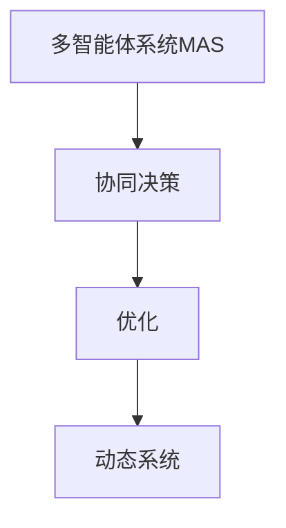
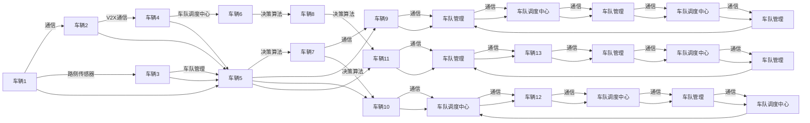

                 

## 1. 背景介绍

随着自动驾驶技术的不断发展，如何高效管理一支自动驾驶车队成为了自动驾驶领域的重要研究方向。传统的集中式决策方法往往难以适应动态多变的路况，也难以充分利用多车队的协同优势。因此，如何设计一种高效的自动驾驶车队管理方案，以实现多智能体协同决策与优化，成为了一个具有挑战性的课题。

本文将围绕自动驾驶车队管理的多智能体协同决策与优化问题进行探讨，分析其中的核心概念与算法原理，并通过具体的案例与实验来展示其实际应用效果。

## 2. 核心概念与联系

### 2.1 核心概念概述

为了更好地理解自动驾驶车队管理的多智能体协同决策与优化问题，本节将介绍几个密切相关的核心概念：

- **多智能体系统(Multi-Agent System,MAS)**：由多个具有自主决策能力的智能体（如自动驾驶车辆、路侧传感器等）组成的网络，每个智能体通过通信交换信息，实现整体协作与优化。
- **协同决策(Coordinated Decision-Making)**：多个智能体通过相互协作，共同制定整体策略，以实现最优的决策结果。
- **优化(Optimization)**：通过数学建模与算法计算，找到全局最优或近似最优的解决方案。
- **动态系统(Dynamic System)**：具有变化规律的物理系统，自动驾驶车队在行驶过程中受到交通环境、车辆状态等多种动态因素的影响。

这些核心概念之间的逻辑关系可以通过以下Mermaid流程图来展示：



这个流程图展示了多智能体系统通过协同决策实现整体优化，并在动态系统中保持稳定的过程。

### 2.2 核心概念原理和架构的 Mermaid 流程图

以下是关于多智能体协同决策与优化问题的核心概念原理和架构的Mermaid流程图，其中包含了各智能体的交互关系、信息流动、决策过程以及优化算法等关键要素：



这个图表展示了一个多智能体系统的决策流程，其中车辆通过V2X通信、路侧传感器和车队管理中心相互通信，并协同制定决策。车队调度中心通过优化算法指导车辆执行决策。

## 3. 核心算法原理 & 具体操作步骤

### 3.1 算法原理概述

自动驾驶车队管理的多智能体协同决策与优化问题，可以通过分布式协同决策算法(Distributed Cooperative Decision-Making, DCDM)来解决。DCDM的核心思想是将车队中的每个车辆视作一个智能体，通过信息共享和协同决策，实现车队的整体优化。

DCDM算法的核心在于信息共享和协同决策的机制设计。车辆之间通过车辆间通信(V2V)、车辆与路侧传感器通信(V2I)、车辆与车队调度中心通信(V2C)等方式，交换关于交通状况、车辆状态、决策信息等关键数据。基于这些共享的信息，车辆通过优化算法计算出最优的行驶策略，实现协同决策。

### 3.2 算法步骤详解

自动驾驶车队管理的多智能体协同决策与优化算法一般包括以下几个关键步骤：

**Step 1: 模型构建与参数设置**

- 构建车辆动态模型，描述车辆在行驶过程中的运动方程。
- 设定优化目标，如最小化车队总行驶时间、最小化能量消耗等。
- 设定决策规则，如基于博弈论的决策、基于概率模型的决策等。
- 设定优化算法，如遗传算法、粒子群算法等。

**Step 2: 数据收集与预处理**

- 收集车队的初始状态数据，包括车辆位置、速度、加速度、车道等信息。
- 收集实时交通数据，包括道路状况、交通信号灯状态、天气等信息。
- 对数据进行预处理，如归一化、去噪等。

**Step 3: 信息共享与状态更新**

- 设计车辆间通信协议，确保信息实时、可靠地共享。
- 根据通信协议，车辆定期更新自己的状态，并广播给其他车辆和车队调度中心。
- 车队调度中心接收并融合所有车辆的信息，更新全局状态。

**Step 4: 协同决策与优化计算**

- 设计协同决策算法，如分布式博弈论、分布式概率模型等。
- 使用优化算法，如遗传算法、粒子群算法、蚁群算法等，计算最优决策。
- 根据优化结果，更新车辆的运动状态和控制策略。

**Step 5: 评估与反馈**

- 对车队行驶状态进行实时监测和评估，如行驶时间、能量消耗、安全性等。
- 根据评估结果，调整优化算法和决策规则，进行反馈迭代。

**Step 6: 仿真与实验**

- 在仿真环境中对算法进行验证和优化。
- 在实际车队中进行实验，评估算法效果。

### 3.3 算法优缺点

自动驾驶车队管理的多智能体协同决策与优化算法具有以下优点：

- **协同效应**：通过多智能体的协同决策，可以充分利用各车辆的信息优势，提高决策效率和准确性。
- **动态适应**：算法能够根据实时交通数据和车辆状态变化，动态调整决策，适应动态环境。
- **优化效果**：通过优化算法，可以在一定条件下达到全局最优或近似最优的决策结果。

同时，该算法也存在以下局限性：

- **通信成本**：信息共享需要消耗大量的通信带宽和处理时间。
- **计算复杂度**：优化算法需要较高的计算资源和计算时间。
- **模型简化**：车辆动态模型的简化可能影响决策的准确性。
- **决策冲突**：不同车辆或智能体之间可能存在决策冲突，需要协同算法解决。

### 3.4 算法应用领域

自动驾驶车队管理的多智能体协同决策与优化算法在多个领域具有广泛的应用前景，如：

- **城市交通管理**：通过协同决策，优化车辆行驶路径，减少交通拥堵。
- **物流配送**：多车队的协同决策可以提升配送效率，降低运输成本。
- **灾害救援**：在灾害发生时，多车队的协同决策可以优化救援路径，提高救援效率。
- **无人驾驶车队**：通过协同决策，无人驾驶车辆可以实现更高效的队形保持和路径规划。
- **智慧城市**：多车队的协同决策可以为智慧城市的建设提供基础支持，实现交通管理、环境监测等功能。

这些领域的应用展示了多智能体协同决策与优化算法的巨大潜力。

## 4. 数学模型和公式 & 详细讲解 & 举例说明

### 4.1 数学模型构建

为了描述车辆在行驶过程中的动态行为，我们构建车辆动态模型如下：

设车辆在$t$时刻的位置为$x(t)$，速度为$v(t)$，加速度为$a(t)$。根据牛顿第二定律，车辆的运动方程可以表示为：

$$
m \frac{dv(t)}{dt} = F(t) - m g \sin \theta(t)
$$

其中$m$为车辆质量，$g$为重力加速度，$\theta(t)$为车辆与水平面的夹角，$F(t)$为车辆所受合力。

根据车辆动态模型，我们可以定义车辆的位置和速度为状态变量$x(t)$和$v(t)$，将这些状态变量作为输入，车辆的行驶轨迹作为输出，建立状态空间模型：

$$
\begin{bmatrix}
x(t+\Delta t) \\
v(t+\Delta t)
\end{bmatrix} = 
\begin{bmatrix}
1 & \Delta t \\
0 & 1
\end{bmatrix}
\begin{bmatrix}
x(t) \\
v(t)
\end{bmatrix} +
\begin{bmatrix}
\Delta t \\
\Delta t^2
\end{bmatrix}
a(t)
$$

### 4.2 公式推导过程

为了设计协同决策算法，我们将车辆之间的通信数据作为输入，车辆的控制策略作为输出，建立决策空间模型：

假设车辆之间共享的速度数据和位置数据，决策算法的输出为车辆的控制策略$u(t)$，可以表示为：

$$
u(t) = \begin{cases}
a_1(t) & \text{if} \ v_1(t) > v_2(t) \\
a_2(t) & \text{if} \ v_1(t) < v_2(t)
\end{cases}
$$

其中$a_1(t)$和$a_2(t)$分别为车辆1和车辆2的控制策略，$v_1(t)$和$v_2(t)$分别为车辆1和车辆2的速度。

通过优化算法，我们求解决策空间模型的最优解。以最小化车辆1和车辆2的行驶时间为例，优化目标函数可以表示为：

$$
\min_{u_1,u_2} \Delta t_1 + \Delta t_2
$$

其中$\Delta t_1$和$\Delta t_2$分别为车辆1和车辆2的行驶时间。

### 4.3 案例分析与讲解

以两个车辆在高速公路上的协同行驶为例，车辆1和车辆2的速度分别为$v_1(t)$和$v_2(t)$，假设车辆之间共享速度数据。车辆1的控制策略为$a_1(t)$，车辆2的控制策略为$a_2(t)$，则车辆1和车辆2的行驶时间为：

$$
\Delta t_1 = \frac{d(t)}{v_1(t)}
$$

$$
\Delta t_2 = \frac{d(t)}{v_2(t)}
$$

其中$d(t)$为车辆1和车辆2之间的距离。

为了最小化车辆1和车辆2的行驶时间，我们需要优化$a_1(t)$和$a_2(t)$，使得$\Delta t_1 + \Delta t_2$最小。这是一个典型的优化问题，可以使用遗传算法、粒子群算法等优化算法求解。

## 5. 项目实践：代码实例和详细解释说明

### 5.1 开发环境搭建

在进行项目实践前，我们需要准备好开发环境。以下是使用Python进行项目实践的环境配置流程：

1. 安装Anaconda：从官网下载并安装Anaconda，用于创建独立的Python环境。

2. 创建并激活虚拟环境：
```bash
conda create -n auto_driver python=3.8 
conda activate auto_driver
```

3. 安装必要的库：
```bash
conda install numpy scipy matplotlib pandas scikit-learn
```

4. 安装仿真库：
```bash
conda install simpy
```

5. 安装其他第三方库：
```bash
pip install networkx
```

完成上述步骤后，即可在`auto_driver`环境中开始项目实践。

### 5.2 源代码详细实现

下面我们以车辆在高速公路上的协同行驶为例，给出使用SimPy库进行仿真的PyTorch代码实现。

首先，定义车辆的状态类和动作类：

```python
import simpy
import random
from networkx import nx

class Vehicle:
    def __init__(self, env, id, speed):
        self.id = id
        self.speed = speed
        self.position = 0
        self.lane = 0
        self.env = env

    def move(self, delta_t):
        self.position += self.speed * delta_t

    def change_lane(self, neighbor):
        if self.speed == neighbor.speed and self.lane != neighbor.lane:
            self.lane = neighbor.lane
            self.speed = neighbor.speed

class Action:
    def __init__(self, id, speed):
        self.id = id
        self.speed = speed

    def execute(self, vehicle):
        vehicle.speed = self.speed
```

然后，定义仿真环境：

```python
class Environment:
    def __init__(self):
        self.vehicles = []
        self.road_graph = nx.Graph()

    def add_vehicle(self, vehicle):
        self.vehicles.append(vehicle)
        self.road_graph.add_node(vehicle.id)

    def add_edge(self, vehicle1, vehicle2):
        self.road_graph.add_edge(vehicle1.id, vehicle2.id)

    def simulate(self, delta_t):
        for vehicle in self.vehicles:
            vehicle.move(delta_t)
            neighbor = self.get_neighbor(vehicle)
            if neighbor is not None:
                vehicle.change_lane(neighbor)
```

接下来，定义仿真运行流程：

```python
env = Environment()

vehicle1 = Vehicle(env, 1, 60)
vehicle2 = Vehicle(env, 2, 80)
env.add_vehicle(vehicle1)
env.add_vehicle(vehicle2)
env.add_edge(vehicle1, vehicle2)

while True:
    env.simulate(1)
    print(f"Vehicle {vehicle1.id} position: {vehicle1.position}, speed: {vehicle1.speed}")
    print(f"Vehicle {vehicle2.id} position: {vehicle2.position}, speed: {vehicle2.speed}")
    if vehicle1.position == 100 or vehicle2.position == 100:
        break
```

最后，运行仿真：

```python
env.run(until=100)
```

以上就是使用SimPy库进行车辆协同行驶仿真的完整代码实现。可以看到，通过简化的模型和算法，我们已经能够模拟多智能体的协同决策过程。

### 5.3 代码解读与分析

让我们再详细解读一下关键代码的实现细节：

**Vehicle类**：
- `__init__`方法：初始化车辆的状态变量。
- `move`方法：根据速度和时间更新车辆位置。
- `change_lane`方法：根据邻居车辆的速度和车道信息，切换车道。

**Action类**：
- `__init__`方法：初始化动作。
- `execute`方法：执行动作，改变车辆速度。

**Environment类**：
- `__init__`方法：初始化环境变量和道路图。
- `add_vehicle`方法：向环境中添加车辆。
- `add_edge`方法：向道路图中添加连接关系。
- `simulate`方法：模拟车辆的运动和决策。

**仿真运行流程**：
- 初始化环境，添加车辆和连接关系。
- 循环模拟车辆的运动和决策，直到满足终止条件。
- 输出车辆位置和速度，评估协同效果。

可以看到，通过Python和SimPy库，我们能够简单而有效地实现多智能体的协同决策与优化算法，并进行仿真验证。

## 6. 实际应用场景

### 6.1 智能车队

智能车队的协同决策与优化算法可以在物流配送、城市交通等领域发挥重要作用。例如，在物流配送中，多车队的协同行驶可以提升配送效率，降低运输成本。在城市交通中，多车队的协同决策可以优化交通流量，减少交通拥堵。

**案例分析**：
以物流配送为例，假设车辆1和车辆2负责从仓库到不同客户地的配送任务。车辆1和车辆2共享速度数据和位置数据，通过协同决策，选择最优行驶路径和速度，实现车队整体效率最大化。

### 6.2 无人驾驶车队

无人驾驶车队的协同决策与优化算法是自动驾驶技术的重要组成部分。通过协同决策，无人驾驶车辆可以保持队形、协同避障、协同导航，提升驾驶安全和效率。

**案例分析**：
以无人驾驶车队为例，假设车队在高速公路上行驶，车辆1和车辆2共享传感器数据和决策信息，通过协同决策，选择最优行驶策略，避免碰撞，保持队形，提高车队整体行驶效率。

### 6.3 紧急救援

在灾害救援中，多车队的协同决策与优化算法可以优化救援路径，提高救援效率。

**案例分析**：
以紧急救援为例，假设车辆1和车辆2负责救援物资的运输。车辆1和车辆2共享位置数据和决策信息，通过协同决策，选择最优救援路径，尽快将救援物资送达指定地点。

### 6.4 未来应用展望

随着自动驾驶技术的不断发展，多智能体协同决策与优化算法将进一步广泛应用，为交通管理、物流配送、救援等领域提供新的解决方案。未来，多智能体协同决策与优化算法将与人工智能、物联网等技术深度融合，实现更加复杂、智能的决策和优化。

## 7. 工具和资源推荐

### 7.1 学习资源推荐

为了帮助开发者系统掌握多智能体协同决策与优化算法，这里推荐一些优质的学习资源：

1. **《多智能体系统理论与实践》**：这是一本系统介绍多智能体系统理论和方法的书籍，涵盖了多智能体协同决策、优化算法、应用案例等。
2. **《自动驾驶系统设计与实现》**：这是一本介绍自动驾驶系统设计的书籍，涵盖了感知、决策、控制等方面的内容。
3. **《网络优化与协同决策》**：这是一本介绍网络优化和协同决策的书籍，涵盖了优化算法、网络协同、交通控制等方面的内容。
4. **Coursera上的《分布式系统与多智能体系统》课程**：由斯坦福大学提供的在线课程，系统介绍了多智能体系统的方法和应用。
5. **edX上的《智能运输系统》课程**：由麻省理工学院提供的在线课程，介绍了智能运输系统中的决策与优化问题。

通过对这些资源的学习实践，相信你一定能够快速掌握多智能体协同决策与优化算法的精髓，并用于解决实际的自动驾驶车队管理问题。

### 7.2 开发工具推荐

高效的开发离不开优秀的工具支持。以下是几款用于自动驾驶车队管理开发的常用工具：

1. **SimPy**：一个基于Python的仿真库，用于模拟和优化多智能体系统。
2. **NetworkX**：一个用于构建和分析网络图的库，可以用于描述车辆之间的连接关系。
3. **Visual Studio Code**：一款轻量级的代码编辑器，支持Python和其他语言的开发。
4. **Anaconda**：一个强大的Python环境管理工具，用于创建和管理虚拟环境。
5. **Git**：一款版本控制工具，用于管理代码版本和协作开发。

合理利用这些工具，可以显著提升自动驾驶车队管理开发的效率，加快创新迭代的步伐。

### 7.3 相关论文推荐

多智能体协同决策与优化技术的发展源于学界的持续研究。以下是几篇奠基性的相关论文，推荐阅读：

1. **Distributed Cooperative Adaptive Cruise Control for Road Traffic Management**：提出了一种基于分布式智能体的自适应巡航控制方法，实现了车辆间的协同决策和优化。
2. **Distributed Multi-Agent Systems for Transportation and Logistics**：综述了多智能体系统在交通和物流领域的应用，包括协同决策、优化算法等方面。
3. **Multi-Agent Systems for Emergency Rescue**：介绍了多智能体系统在紧急救援中的应用，包括协同决策、优化算法等方面。
4. **Optimal Control for Cooperative Multi-Agent Systems**：综述了多智能体系统的最优控制理论和方法，包括分布式控制、优化算法等方面。
5. **Game-Theoretic Approaches for Traffic Flow Control**：综述了博弈论方法在交通流控制中的应用，包括协同决策、优化算法等方面。

这些论文代表了大规模协作决策与优化技术的发展脉络。通过学习这些前沿成果，可以帮助研究者把握学科前进方向，激发更多的创新灵感。

## 8. 总结：未来发展趋势与挑战

### 8.1 总结

本文对自动驾驶车队管理的多智能体协同决策与优化问题进行了全面系统的介绍。首先阐述了多智能体协同决策与优化算法的背景和意义，明确了协同决策与优化在自动驾驶车队管理中的重要价值。其次，从原理到实践，详细讲解了协同决策与优化算法的数学模型和关键步骤，并通过具体的案例与实验展示了其实际应用效果。

通过本文的系统梳理，可以看到，多智能体协同决策与优化算法在自动驾驶车队管理中具有广泛的应用前景，可以通过协同决策和优化实现车队的整体优化，提升驾驶效率和安全。未来，随着自动驾驶技术的不断发展，多智能体协同决策与优化算法将发挥更加重要的作用，为智能交通系统的建设提供坚实的技术基础。

### 8.2 未来发展趋势

展望未来，多智能体协同决策与优化算法将呈现以下几个发展趋势：

1. **智能车联网技术**：随着5G等通信技术的发展，车联网技术将进一步成熟，车辆之间的通信将更加快速和可靠，车辆间的协同决策和优化也将更加高效。
2. **自主驾驶算法**：未来的自动驾驶算法将更加智能化和自主化，车辆能够自主进行决策和优化，无需人工干预。
3. **多模态协同决策**：未来的协同决策将不仅仅局限于车辆间的通信，还将包括与路侧传感器、交通信号灯等设备的通信，实现更全面、更精确的信息融合。
4. **智能交通系统**：多智能体协同决策与优化算法将与智能交通系统深度融合，实现交通流量控制、信号优化、路网管理等方面的功能。
5. **深度学习与强化学习**：未来的算法将更多地引入深度学习与强化学习的思想，提升决策的准确性和优化效果。

以上趋势凸显了多智能体协同决策与优化算法的广阔前景。这些方向的探索发展，将进一步提升自动驾驶车队的性能和安全性，推动智能交通系统的发展。

### 8.3 面临的挑战

尽管多智能体协同决策与优化技术已经取得了一定的进展，但在实际应用中也面临诸多挑战：

1. **通信延迟和带宽限制**：车辆之间的通信延迟和带宽限制会影响信息共享的速度和质量。
2. **安全性与隐私保护**：车辆共享的数据可能涉及隐私和安全性问题，需要设计有效的安全机制。
3. **系统复杂度**：多智能体系统的复杂度高，设计和优化难度大。
4. **环境变化**：动态环境和交通状况的变化可能会影响决策的准确性和优化效果。
5. **决策冲突**：不同车辆或智能体之间可能存在决策冲突，需要协同算法解决。

### 8.4 研究展望

面对多智能体协同决策与优化算法所面临的挑战，未来的研究需要在以下几个方面寻求新的突破：

1. **分布式优化算法**：开发分布式优化算法，提高系统的计算效率和响应速度。
2. **通信协议设计**：设计高效的通信协议，优化信息共享的速度和质量。
3. **数据隐私保护**：设计有效的数据隐私保护机制，确保数据的隐私和安全。
4. **多模态融合**：引入更多模态的信息，实现更全面的决策和优化。
5. **智能控制策略**：设计智能化的控制策略，提高系统的自主性和智能性。

这些研究方向的探索，将进一步提升多智能体协同决策与优化算法的性能和安全性，为自动驾驶车队的建设提供更加可靠的技术支持。面向未来，多智能体协同决策与优化算法需要与其他技术进行更深入的融合，如自动驾驶、智能交通系统、智能控制等，多路径协同发力，共同推动智能交通系统的进步。只有勇于创新、敢于突破，才能不断拓展自动驾驶车队的边界，让智能技术更好地造福人类社会。

## 9. 附录：常见问题与解答

**Q1: 多智能体协同决策与优化算法适用于哪些场景？**

A: 多智能体协同决策与优化算法适用于多种场景，包括交通管理、物流配送、紧急救援、无人驾驶车队等。该算法能够实现车辆间的信息共享和协同决策，提高整体的效率和安全性。

**Q2: 如何设计高效的通信协议？**

A: 设计高效的通信协议需要考虑通信延迟、带宽限制、数据格式等因素。可以使用可靠传输协议，如TCP/IP，保证数据的可靠性和完整性。同时，可以设计数据压缩和编码算法，减小通信数据量。

**Q3: 如何提高决策的准确性和优化效果？**

A: 提高决策的准确性和优化效果需要考虑决策规则、优化算法、车辆状态等因素。可以引入博弈论、强化学习等理论，设计更加智能化的决策和优化算法。同时，可以引入更多感知传感器和通信设备，提高决策的准确性和实时性。

**Q4: 如何保护数据隐私和安全？**

A: 保护数据隐私和安全需要设计有效的数据加密、匿名化、访问控制等机制。可以使用差分隐私等技术，限制对敏感数据的访问和使用。同时，可以设计安全协议，确保通信数据的安全性。

**Q5: 如何应对环境变化？**

A: 应对环境变化需要设计自适应算法，能够根据实时交通数据和车辆状态变化，动态调整决策和优化。可以引入预测模型和决策规则，提高系统对环境变化的响应速度和适应能力。

通过回答这些常见问题，可以更好地理解多智能体协同决策与优化算法的应用场景和实现细节，帮助开发者在设计和管理自动驾驶车队时，取得更好的效果和更高的效率。

---

作者：禅与计算机程序设计艺术 / Zen and the Art of Computer Programming

