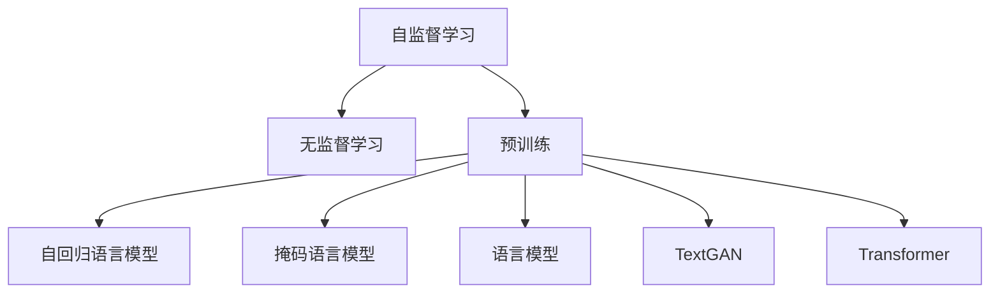

                 

# 自监督学习 原理与代码实例讲解

> 关键词：自监督学习,无监督学习,预训练,自回归,掩码语言模型,语言模型,TextGAN,Transformer

## 1. 背景介绍

自监督学习（Self-Supervised Learning）作为一种无监督学习（Unsupervised Learning）范式，近年来在深度学习领域大放异彩。通过在无需人工标注的数据上学习到丰富的语义表示，自监督学习已经成为了深度预训练语言模型（Pre-trained Language Models, PLMs）的核心技术。目前主流的预训练大模型，如BERT、GPT等，均采用自监督学习方法训练。

自监督学习之所以能取得如此显著的成效，主要归因于以下两个方面：

1. **数据规模和泛化能力**：自监督学习利用大规模无标签数据进行预训练，学习到泛化性强的语言表示。通过大规模的训练，模型可以捕捉到语言的深层规律，从而提升了下游任务的性能。
2. **自动生成训练信号**：自监督学习方法能够自动生成训练信号，减少了对人工标注的依赖。通过掩码预测、语言模型等任务，模型可以自我学习，生成大量的训练样本。

## 2. 核心概念与联系

### 2.1 核心概念概述

为了更好地理解自监督学习的基本原理和架构，本节将介绍几个关键概念及其相互联系：

- **自监督学习**：利用大规模无标签数据，通过构造伪标签或生成训练信号，自动学习模型，无需人工标注的机器学习方法。
- **无监督学习**：从原始数据中自动学习模型结构或特征表示，无需依赖任何人工标注。
- **预训练**：在大规模无标签数据上，通过自监督学习任务训练模型的过程。常见的预训练任务包括掩码语言模型、 next sentence prediction、文本分类等。
- **自回归语言模型**：通过预测序列中后文单词，学习语言规律的模型。如RNN、LSTM、GRU等。
- **掩码语言模型**：在输入文本中随机遮盖若干单词，让模型预测这些被遮盖的单词，学习语言上下文关系的模型。如BERT、GPT等。
- **语言模型**：预测文本序列中下一个单词的概率分布。常用的语言模型有n-gram模型、RNN语言模型、Transformer语言模型等。
- **TextGAN**：一种基于自监督学习的生成对抗网络，能够生成高质量的文本样本。
- **Transformer**：一种基于注意力机制的神经网络结构，广泛应用于各种深度学习模型，特别是在语言模型和图像生成领域。

这些核心概念通过以下Mermaid流程图连接起来，展示它们之间的逻辑关系：



这个流程图说明：

1. 自监督学习是无监督学习的一种重要形式。
2. 预训练是通过自监督学习在大规模无标签数据上训练模型的过程。
3. 自回归语言模型和掩码语言模型是预训练的主要任务。
4. 语言模型是预测下一个单词的概率分布。
5. TextGAN和Transformer均是基于自监督学习的应用实例。

这些概念共同构成了自监督学习的核心框架，使得模型能够自动学习到泛化性强的语义表示，并应用于各种下游任务。

## 3. 核心算法原理 & 具体操作步骤
### 3.1 算法原理概述

自监督学习的基本原理是通过在大量无标签数据上自动生成训练信号，训练模型进行自我预测。常见的自监督学习任务包括掩码语言模型、next sentence prediction、text filling等。

以BERT为例，其训练过程主要分为两个阶段：

1. **掩码预测任务**：在输入的文本中随机遮盖一些单词，让模型预测这些被遮盖的单词。
2. **下一句预测任务**：给定一个句子，预测其后续的句子是否出现在同一个段落中。

通过这两种任务的训练，模型能够自动学习到丰富的语义表示，用于下游任务的微调。自监督学习的优点在于：

- **无需标注数据**：不需要人工标注数据，减少了数据获取和标注的成本。
- **泛化能力强**：在大量无标签数据上进行预训练，模型能够学习到语言的深层规律。
- **训练信号自动生成**：自监督学习方法能够自动生成训练信号，减少了对人工标注的依赖。

### 3.2 算法步骤详解

以下以掩码语言模型为例，详细讲解自监督学习的具体操作步骤：

**Step 1: 准备训练数据**

- 收集大规模无标签文本数据，如维基百科、新闻、博客等。
- 对数据进行分批次处理，每个批次大小一般为8192，以确保GPU/TPU内存不会耗尽。

**Step 2: 构造训练信号**

- 对于每个输入句子，随机遮盖若干个单词，如10%的单词。
- 遮盖的单词替换为[mask]标记。
- 计算模型的预测概率分布，通过softmax函数进行解码，得到被遮盖单词的预测概率。

**Step 3: 训练模型**

- 使用Adam优化器进行反向传播训练，最小化预测概率与真实概率之间的交叉熵损失。
- 设置训练轮数（如1000轮），在每个epoch内随机打乱数据。
- 每10轮记录一次模型参数，以供评估和可视化。

**Step 4: 评估和微调**

- 在验证集上评估模型的掩码预测任务准确率，如90%的准确率。
- 使用模型进行下游任务的微调，如文本分类、问答、摘要生成等。

### 3.3 算法优缺点

自监督学习方法的主要优点包括：

1. **无标签数据利用**：自监督学习可以利用大规模无标签数据进行预训练，避免了人工标注的繁琐过程。
2. **泛化能力强**：预训练模型可以学习到通用的语言表示，适用于多种下游任务。
3. **自动生成训练信号**：自监督学习能够自动生成训练信号，减少了对人工标注的依赖。

同时，自监督学习方法也存在以下缺点：

1. **训练数据质量要求高**：自监督学习依赖于大规模且高质量的无标签数据，数据质量差会影响模型效果。
2. **模型复杂度高**：预训练模型参数量庞大，训练和推理耗时较长。
3. **泛化能力不足**：预训练模型可能在特定领域表现不佳，需要进行微调。
4. **自监督任务选择有限**：自监督任务设计空间有限，可能无法覆盖所有语言规律。

### 3.4 算法应用领域

自监督学习方法广泛应用于各种深度学习任务，如：

- **文本分类**：通过预训练模型提取文本特征，再进行分类任务。BERT、GPT等大模型已经在该领域取得了显著效果。
- **问答系统**：通过预训练模型理解问题，匹配最佳答案。如ELI5、Google Question Answering等应用。
- **文本生成**：利用预训练模型的语言模型生成自然流畅的文本。如GPT-2、T5等模型。
- **机器翻译**：通过预训练模型进行语言之间的翻译。如GPT-3等。
- **文本摘要**：通过预训练模型生成文章的精简摘要。如T5等。
- **对话系统**：通过预训练模型进行多轮对话，理解上下文，生成回复。如GPT-3等。

## 4. 数学模型和公式 & 详细讲解
### 4.1 数学模型构建

自监督学习的数学模型主要基于语言模型，目标是最大化预测下一个单词的概率。以BERT为例，其目标函数为：

$$
\mathcal{L}(\theta) = -\frac{1}{N}\sum_{i=1}^N \sum_{j=1}^n \log p(x_{i,j} | x_{<j}, \theta)
$$

其中，$x_{<j}$ 表示输入序列中除第j个单词外的所有单词，$n$ 表示输入序列的长度，$\theta$ 表示模型参数。

### 4.2 公式推导过程

对于掩码语言模型任务，我们假设输入序列 $x_1,x_2,...,x_n$，其中 $x_j$ 被遮盖为 [mask]，计算模型预测的概率分布。

设输入序列中所有单词的概率分布为 $p(x_i | x_{<j}, \theta)$，根据Bayes定理，有：

$$
p(x_1, x_2, ..., x_n | \theta) = p(x_1 | \theta) \prod_{i=2}^n p(x_i | x_{<i}, \theta)
$$

对于被遮盖的单词 $x_j$，有：

$$
p(x_j | x_{<j}, \theta) = p(x_j | x_{<j}, x_{>j}, \theta) = p(x_j | x_{<j}, \theta) \prod_{i=1}^{j-1} p(x_i | x_{<i}, \theta)
$$

将上述公式代入目标函数，可以得到掩码语言模型的优化目标：

$$
\mathcal{L}(\theta) = -\frac{1}{N}\sum_{i=1}^N \sum_{j=1}^n \log p(x_{i,j} | x_{<j}, \theta)
$$

### 4.3 案例分析与讲解

以BERT为例，其掩码语言模型训练过程如下：

1. 对输入序列中的10%单词进行随机遮盖，替换为 [mask]。
2. 计算模型预测遮盖单词的概率分布。
3. 计算交叉熵损失，更新模型参数。
4. 重复上述过程，直到训练轮数结束。

通过大量的掩码语言模型训练，BERT可以学习到丰富的语义表示，用于下游任务的微调。

## 5. 项目实践：代码实例和详细解释说明
### 5.1 开发环境搭建

在进行自监督学习实践前，我们需要准备好开发环境。以下是使用Python进行PyTorch开发的环境配置流程：

1. 安装Anaconda：从官网下载并安装Anaconda，用于创建独立的Python环境。

2. 创建并激活虚拟环境：
```bash
conda create -n pytorch-env python=3.8 
conda activate pytorch-env
```

3. 安装PyTorch：根据CUDA版本，从官网获取对应的安装命令。例如：
```bash
conda install pytorch torchvision torchaudio cudatoolkit=11.1 -c pytorch -c conda-forge
```

4. 安装Transformers库：
```bash
pip install transformers
```

5. 安装各类工具包：
```bash
pip install numpy pandas scikit-learn matplotlib tqdm jupyter notebook ipython
```

完成上述步骤后，即可在`pytorch-env`环境中开始自监督学习实践。

### 5.2 源代码详细实现

这里我们以掩码语言模型为例，给出使用Transformers库进行BERT预训练的PyTorch代码实现。

首先，导入必要的库和配置：

```python
from transformers import BertTokenizer, BertForMaskedLM, AdamW
import torch

# 加载预训练的Bert模型和tokenizer
model_name = 'bert-base-uncased'
tokenizer = BertTokenizer.from_pretrained(model_name)
model = BertForMaskedLM.from_pretrained(model_name)

# 设置训练参数
device = torch.device('cuda' if torch.cuda.is_available() else 'cpu')
epochs = 3
batch_size = 8
max_seq_length = 128
```

然后，定义训练函数：

```python
from torch.utils.data import Dataset, DataLoader
from tqdm import tqdm

class MaskedLMData(Dataset):
    def __init__(self, texts, tokenizer, max_seq_length):
        self.texts = texts
        self.tokenizer = tokenizer
        self.max_seq_length = max_seq_length

    def __len__(self):
        return len(self.texts)

    def __getitem__(self, item):
        text = self.texts[item]
        tokens = self.tokenizer.encode(text, add_special_tokens=True, max_length=self.max_seq_length, truncation=True, padding='max_length')
        input_ids = torch.tensor(tokens, dtype=torch.long)
        masked_idx = torch.rand(input_ids.shape) < 0.15
        input_ids[masked_idx] = 0
        return {'input_ids': input_ids, 'masked_idx': masked_idx}

# 训练函数
def train_epoch(model, data_loader, optimizer):
    model.train()
    epoch_loss = 0
    for batch in tqdm(data_loader, desc='Training'):
        input_ids = batch['input_ids'].to(device)
        masked_idx = batch['masked_idx'].to(device)
        labels = input_ids.clone()
        labels[masked_idx] = 0
        model.zero_grad()
        outputs = model(input_ids, labels=labels)
        loss = outputs.loss
        epoch_loss += loss.item()
        loss.backward()
        optimizer.step()
    return epoch_loss / len(data_loader)

# 训练循环
optimizer = AdamW(model.parameters(), lr=2e-5)
dataloader = DataLoader(MaskedLMData(train_texts, tokenizer, max_seq_length), batch_size=batch_size, shuffle=True)
for epoch in range(epochs):
    loss = train_epoch(model, dataloader, optimizer)
    print(f'Epoch {epoch+1}, train loss: {loss:.3f}')
```

最后，保存训练好的模型：

```python
model.save_pretrained('./bert_model')
```

### 5.3 代码解读与分析

让我们再详细解读一下关键代码的实现细节：

**MaskedLMData类**：
- `__init__`方法：初始化文本、tokenizer、最大序列长度。
- `__len__`方法：返回数据集的样本数量。
- `__getitem__`方法：对单个样本进行处理，将文本输入编码为token ids，并对其中的一部分单词进行随机遮盖，返回模型所需的输入。

**训练函数**：
- 使用PyTorch的DataLoader对数据集进行批次化加载，供模型训练使用。
- 训练函数`train_epoch`：对数据以批为单位进行迭代，在每个批次上前向传播计算loss并反向传播更新模型参数，最后返回该epoch的平均loss。

**训练循环**：
- 定义总的epoch数和batch size，开始循环迭代
- 每个epoch内，先在训练集上训练，输出平均loss
- 保存训练好的模型

可以看到，PyTorch配合Transformers库使得BERT预训练的代码实现变得简洁高效。开发者可以将更多精力放在数据处理、模型改进等高层逻辑上，而不必过多关注底层的实现细节。

当然，工业级的系统实现还需考虑更多因素，如模型的保存和部署、超参数的自动搜索、更灵活的任务适配层等。但核心的自监督学习过程基本与此类似。

## 6. 实际应用场景
### 6.1 智能客服系统

自监督学习技术可以广泛应用于智能客服系统的构建。传统客服往往需要配备大量人力，高峰期响应缓慢，且一致性和专业性难以保证。而使用自监督学习训练的客服系统，可以自动理解客户意图，匹配最佳回复，提升客户咨询体验和问题解决效率。

在技术实现上，可以收集企业内部的历史客服对话记录，通过预训练大模型学习通用的语言表示，再在客户问题上微调进行推理，生成最优回复。如此构建的智能客服系统，能大幅提升客户咨询体验和问题解决效率。

### 6.2 金融舆情监测

金融机构需要实时监测市场舆论动向，以便及时应对负面信息传播，规避金融风险。传统的人工监测方式成本高、效率低，难以应对网络时代海量信息爆发的挑战。基于自监督学习训练的文本分类和情感分析技术，为金融舆情监测提供了新的解决方案。

具体而言，可以收集金融领域相关的新闻、报道、评论等文本数据，并对其进行主题标注和情感标注。在此基础上对预训练语言模型进行微调，使其能够自动判断文本属于何种主题，情感倾向是正面、中性还是负面。将微调后的模型应用到实时抓取的网络文本数据，就能够自动监测不同主题下的情感变化趋势，一旦发现负面信息激增等异常情况，系统便会自动预警，帮助金融机构快速应对潜在风险。

### 6.3 个性化推荐系统

当前的推荐系统往往只依赖用户的历史行为数据进行物品推荐，无法深入理解用户的真实兴趣偏好。基于自监督学习训练的推荐系统，可以更好地挖掘用户行为背后的语义信息，从而提供更精准、多样的推荐内容。

在实践中，可以收集用户浏览、点击、评论、分享等行为数据，提取和用户交互的物品标题、描述、标签等文本内容。将文本内容作为模型输入，通过预训练大模型提取用户兴趣向量，再进行推荐排序，便可以得到个性化程度更高的推荐结果。

### 6.4 未来应用展望

随着自监督学习技术的不断进步，其在NLP领域的应用前景将更加广阔。未来，自监督学习将能进一步降低对标注数据的依赖，提高模型的少样本学习和跨领域迁移能力，同时兼顾可解释性和伦理安全性等因素。

自监督学习将在更多领域得到应用，为传统行业带来变革性影响。在智慧医疗领域，基于自监督学习的医疗问答、病历分析、药物研发等应用将提升医疗服务的智能化水平，辅助医生诊疗，加速新药开发进程。

在智能教育领域，自监督学习可应用于作业批改、学情分析、知识推荐等方面，因材施教，促进教育公平，提高教学质量。

在智慧城市治理中，自监督学习可应用于城市事件监测、舆情分析、应急指挥等环节，提高城市管理的自动化和智能化水平，构建更安全、高效的未来城市。

此外，在企业生产、社会治理、文娱传媒等众多领域，基于自监督学习的人工智能应用也将不断涌现，为经济社会发展注入新的动力。

## 7. 工具和资源推荐
### 7.1 学习资源推荐

为了帮助开发者系统掌握自监督学习的基本原理和实践技巧，这里推荐一些优质的学习资源：

1. 《自然语言处理入门：自监督学习与文本生成》系列博文：由大模型技术专家撰写，深入浅出地介绍了自监督学习的原理和应用。

2. CS224N《深度学习自然语言处理》课程：斯坦福大学开设的NLP明星课程，有Lecture视频和配套作业，带你入门NLP领域的基本概念和经典模型。

3. 《自然语言处理基础》书籍：李航教授所著，详细介绍了自然语言处理的基础知识和经典模型。

4. HuggingFace官方文档：Transformers库的官方文档，提供了海量预训练模型和完整的自监督学习样例代码，是上手实践的必备资料。

5. ELI5开源项目：中文自然语言理解工具包，提供多种NLP任务的自然语言生成功能，是研究自监督学习的重要工具。

通过对这些资源的学习实践，相信你一定能够快速掌握自监督学习的基本原理和实践技巧，并用于解决实际的NLP问题。

### 7.2 开发工具推荐

高效的开发离不开优秀的工具支持。以下是几款用于自监督学习开发的常用工具：

1. PyTorch：基于Python的开源深度学习框架，灵活动态的计算图，适合快速迭代研究。大部分预训练语言模型都有PyTorch版本的实现。

2. TensorFlow：由Google主导开发的开源深度学习框架，生产部署方便，适合大规模工程应用。同样有丰富的预训练语言模型资源。

3. Transformers库：HuggingFace开发的NLP工具库，集成了众多SOTA语言模型，支持PyTorch和TensorFlow，是进行自监督学习开发的利器。

4. Weights & Biases：模型训练的实验跟踪工具，可以记录和可视化模型训练过程中的各项指标，方便对比和调优。与主流深度学习框架无缝集成。

5. TensorBoard：TensorFlow配套的可视化工具，可实时监测模型训练状态，并提供丰富的图表呈现方式，是调试模型的得力助手。

6. Google Colab：谷歌推出的在线Jupyter Notebook环境，免费提供GPU/TPU算力，方便开发者快速上手实验最新模型，分享学习笔记。

合理利用这些工具，可以显著提升自监督学习任务的开发效率，加快创新迭代的步伐。

### 7.3 相关论文推荐

自监督学习的发展源于学界的持续研究。以下是几篇奠基性的相关论文，推荐阅读：

1. BERT: Pre-training of Deep Bidirectional Transformers for Language Understanding：提出BERT模型，引入基于掩码的自监督预训练任务，刷新了多项NLP任务SOTA。

2. Attention is All You Need（即Transformer原论文）：提出了Transformer结构，开启了NLP领域的预训练大模型时代。

3. Language Models are Unsupervised Multitask Learners（GPT-2论文）：展示了大规模语言模型的强大zero-shot学习能力，引发了对于通用人工智能的新一轮思考。

4. The Loss Landscape of Pre-training GPT-2：研究了自监督学习训练过程中损失函数的形态，为模型调参提供了理论指导。

5. TextGAN: Text Generation as a Conversational Game with a GAN: TextGAN利用对抗学习生成高质量文本，是自监督学习在文本生成领域的重要突破。

这些论文代表了大模型自监督学习的核心技术进展，通过学习这些前沿成果，可以帮助研究者把握学科前进方向，激发更多的创新灵感。

## 8. 总结：未来发展趋势与挑战

### 8.1 总结

本文对自监督学习的基本原理和实践技巧进行了全面系统的介绍。首先阐述了自监督学习的背景和意义，明确了自监督学习在NLP领域的重要地位。其次，从原理到实践，详细讲解了自监督学习的数学模型和具体操作步骤，给出了自监督学习任务开发的完整代码实例。同时，本文还广泛探讨了自监督学习在智能客服、金融舆情、个性化推荐等多个行业领域的应用前景，展示了自监督学习的强大潜力。

通过本文的系统梳理，可以看到，自监督学习作为一种无监督学习范式，在大规模预训练语言模型训练中扮演着重要角色。得益于其无需标注数据的优势，自监督学习在数据稀缺、标注成本高昂的领域展现了巨大的应用潜力。未来，随着自监督学习技术的不断进步，其在更多领域得到应用，为传统行业带来变革性影响。

### 8.2 未来发展趋势

展望未来，自监督学习技术将呈现以下几个发展趋势：

1. **模型规模持续增大**：随着算力成本的下降和数据规模的扩张，预训练语言模型的参数量还将持续增长。超大模型蕴含的丰富语言知识，有望支撑更加复杂多变的下游任务。

2. **自监督任务设计多样化**：除了传统的掩码语言模型、next sentence prediction等任务，未来还会涌现更多自监督学习任务，如causal language modeling、sequence tagging等，进一步提升模型的泛化能力。

3. **自监督与监督学习结合**：自监督学习与监督学习相结合，可以提高模型的泛化能力和学习效率，实现更加高效的双模式训练。

4. **自监督学习与知识图谱结合**：自监督学习与知识图谱的结合，将进一步提升模型在特定领域的知识整合能力，如医疗、法律等垂直领域。

5. **自监督学习与多模态学习结合**：自监督学习与图像、语音等多模态数据的结合，将提升模型对现实世界的理解和建模能力。

6. **自监督学习与迁移学习结合**：自监督学习与迁移学习的结合，可以实现少样本学习、跨领域迁移等效果，进一步提升模型泛化能力和适应性。

以上趋势凸显了自监督学习的广阔前景。这些方向的探索发展，必将进一步提升预训练语言模型的性能和应用范围，为人工智能技术落地应用提供重要基础。

### 8.3 面临的挑战

尽管自监督学习技术已经取得了显著成效，但在迈向更加智能化、普适化应用的过程中，仍面临诸多挑战：

1. **数据质量要求高**：自监督学习依赖于大规模且高质量的无标签数据，数据质量差会影响模型效果。如何获取和处理高质量无标签数据，是一个重要挑战。

2. **模型复杂度高**：预训练模型参数量庞大，训练和推理耗时较长。如何优化模型结构和参数量，是一个重要研究方向。

3. **泛化能力不足**：预训练模型可能在特定领域表现不佳，需要进行微调。如何提高模型的泛化能力和迁移能力，是一个重要课题。

4. **对抗样本风险**：自监督学习模型可能对抗样本存在脆弱性，需要进行鲁棒性评估和改进。

5. **可解释性不足**：自监督学习模型往往缺乏可解释性，难以对其决策过程进行分析和调试。如何增强模型的可解释性，是一个重要研究方向。

6. **伦理和安全性问题**：自监督学习模型可能学习到有害信息，需要进行伦理和安全性的评估和改进。

正视自监督学习面临的这些挑战，积极应对并寻求突破，将使自监督学习技术更加成熟，广泛应用于更多领域。

### 8.4 研究展望

面对自监督学习面临的挑战，未来的研究需要在以下几个方面寻求新的突破：

1. **探索更多自监督学习任务**：设计和开发更多自监督学习任务，提升模型的泛化能力和学习效率。

2. **研究参数高效自监督学习**：开发更加参数高效的自监督学习方法，在固定大部分自监督任务的前提下，只更新极少量的任务相关参数。

3. **结合因果推断和对比学习**：引入因果推断和对比学习思想，增强自监督学习模型的泛化能力和鲁棒性。

4. **融合更多先验知识**：将符号化的先验知识，如知识图谱、逻辑规则等，与自监督学习模型进行巧妙融合，提升模型的知识整合能力。

5. **引入对抗样本训练**：通过对抗样本训练，提高自监督学习模型的鲁棒性和安全性。

6. **增强模型可解释性**：引入可解释性方法，增强自监督学习模型的决策过程的可解释性和可审计性。

这些研究方向的研究，必将引领自监督学习技术迈向更高的台阶，为构建安全、可靠、可解释、可控的智能系统提供重要基础。面向未来，自监督学习技术还需要与其他人工智能技术进行更深入的融合，如知识表示、因果推理、强化学习等，协同发力，共同推动人工智能技术的发展。

## 9. 附录：常见问题与解答

**Q1：自监督学习是否适用于所有NLP任务？**

A: 自监督学习在大多数NLP任务上都能取得不错的效果，特别是对于数据量较小的任务。但对于一些特定领域的任务，如医学、法律等，仅仅依靠通用语料预训练的模型可能难以很好地适应。此时需要在特定领域语料上进一步预训练，再进行微调，才能获得理想效果。

**Q2：自监督学习过程中如何选择合适的自监督任务？**

A: 自监督任务的选择需根据具体任务特点和数据分布进行调整。常见的自监督任务包括掩码语言模型、next sentence prediction、text filling等。选择合适的自监督任务可以提高模型的泛化能力和学习效率。

**Q3：自监督学习模型如何与其他技术结合？**

A: 自监督学习模型可以与其他技术结合，如迁移学习、知识图谱、多模态学习等。通过这些技术的融合，可以进一步提升自监督学习模型的性能和应用范围。

**Q4：自监督学习模型在落地部署时需要注意哪些问题？**

A: 将自监督学习模型转化为实际应用，还需要考虑以下因素：
1. 模型裁剪：去除不必要的层和参数，减小模型尺寸，加快推理速度。
2. 量化加速：将浮点模型转为定点模型，压缩存储空间，提高计算效率。
3. 服务化封装：将模型封装为标准化服务接口，便于集成调用。
4. 弹性伸缩：根据请求流量动态调整资源配置，平衡服务质量和成本。
5. 监控告警：实时采集系统指标，设置异常告警阈值，确保服务稳定性。
6. 安全防护：采用访问鉴权、数据脱敏等措施，保障数据和模型安全。

自监督学习模型需要从数据、算法、工程、业务等多个维度协同发力，才能真正实现人工智能技术在垂直行业的规模化落地。

---

作者：禅与计算机程序设计艺术 / Zen and the Art of Computer Programming

