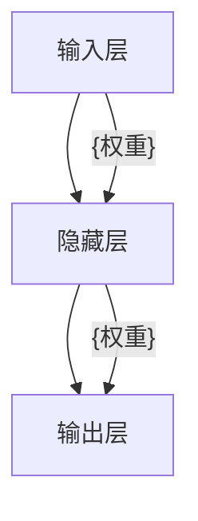
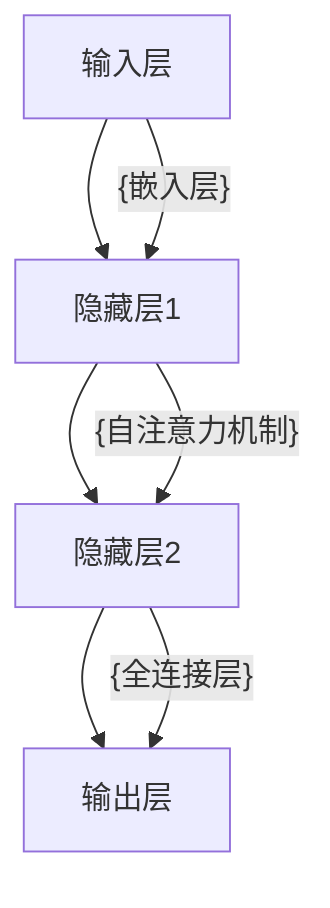

                 

# 苹果与OpenAI的合作模式

## 1. 背景介绍

随着人工智能技术的快速发展，越来越多的科技巨头开始探索AI技术在产品中的应用。苹果公司（Apple Inc.）和OpenAI公司是全球领先的科技公司，分别在硬件和AI领域拥有强大的技术实力。两家公司从2018年起开始合作，致力于利用AI技术提升苹果产品的智能化水平，推动AI技术在更多消费电子设备中的应用。

## 2. 核心概念与联系

### 2.1 核心概念概述

苹果与OpenAI的合作模式，涉及以下几个关键概念：

- **人工智能（AI）**：涉及机器学习、深度学习、自然语言处理（NLP）、计算机视觉（CV）等技术，使机器能够模拟人类智能行为。
- **自然语言处理（NLP）**：让计算机能够理解、处理和生成人类语言的技术。
- **计算机视觉（CV）**：使计算机能够识别和理解图像、视频中的视觉信息。
- **智能助手（Smart Assistant）**：如Siri和Mobile Assistant，利用AI技术为用户提供智能化的交互体验。
- **产品硬件集成**：如iPhone、iPad、Mac等设备，搭载AI芯片和软件，提升设备的功能和用户体验。

### 2.2 核心概念联系

苹果与OpenAI的合作模式建立在以下几个关键联系之上：

- **共同技术基础**：苹果拥有强大的硬件开发和集成能力，OpenAI则在AI算法和模型训练上具有领先优势。
- **用户体验优化**：通过AI技术提升产品智能化水平，提供更直观、便捷的用户交互体验。
- **应用场景拓展**：利用AI技术拓展更多产品应用场景，提升产品的附加价值。

这些联系共同构成了苹果与OpenAI合作的基石，使两家公司在AI技术研发和产品应用上形成互补。

## 3. 核心算法原理 & 具体操作步骤
### 3.1 算法原理概述

苹果与OpenAI的合作，主要围绕以下几个核心算法展开：

- **深度学习（Deep Learning）**：利用神经网络模型对大量数据进行学习和推理，实现语音识别、图像识别等任务。
- **自然语言处理（NLP）**：通过预训练语言模型（如BERT、GPT）对自然语言进行理解和生成，提供智能交互功能。
- **计算机视觉（CV）**：使用卷积神经网络（CNN）等技术对视觉信息进行特征提取和识别，提升设备的人机交互能力。

这些算法在大规模数据上进行预训练，再针对具体应用场景进行微调（Fine-Tuning），以实现高效的AI应用。

### 3.2 算法步骤详解

苹果与OpenAI的合作模式主要包括以下几个关键步骤：

**Step 1: 数据收集与预处理**
- 苹果收集大量用户数据，包括语音输入、文字输入、摄像头拍摄的图像等。
- 对数据进行清洗、标注和预处理，以符合深度学习模型的输入要求。

**Step 2: 模型选择与训练**
- 根据具体应用场景，选择适合的深度学习模型（如RNN、CNN、Transformer等）进行训练。
- 利用苹果的硬件设备（如A系列芯片、GPU等）进行模型训练，优化性能。

**Step 3: 微调与优化**
- 对预训练模型进行微调，以适应苹果产品的具体需求。
- 使用苹果的优化工具（如PyTorch、TensorFlow等）进行超参数调优，提升模型效果。

**Step 4: 集成与应用**
- 将训练好的AI模型集成到苹果产品的软件中，如Siri、Mobile Assistant等。
- 在实际应用中不断收集用户反馈，进一步优化AI模型和用户体验。

### 3.3 算法优缺点

苹果与OpenAI的合作模式，具有以下优点：

- **高效协同**：苹果的硬件集成能力和OpenAI的AI算法优势互补，提升AI应用效率。
- **用户体验优化**：通过AI技术提升产品智能化水平，提供更自然、便捷的用户体验。
- **产品附加价值提升**：AI技术的应用，使苹果产品具备更多功能，提升用户粘性和市场竞争力。

同时，这种合作模式也存在以下缺点：

- **成本较高**：AI模型的训练和优化需要大量数据和计算资源，成本较高。
- **隐私风险**：收集和处理用户数据可能涉及隐私问题，需加强数据保护和安全管理。
- **技术依赖**：过度依赖第三方技术供应商，可能限制苹果自身的技术发展空间。

### 3.4 算法应用领域

苹果与OpenAI的合作模式，在以下几个领域取得了显著应用：

- **智能助手（Siri）**：利用NLP技术实现语音识别和自然语言理解，提供智能交互体验。
- **增强现实（AR）**：通过计算机视觉技术识别环境中的物体，增强现实显示功能。
- **图像识别与处理**：利用CV技术实现拍照、视频拍摄中的自动调整和增强，提升用户体验。
- **个性化推荐**：基于用户行为数据和历史偏好，提供个性化内容推荐，提升用户满意度。

## 4. 数学模型和公式 & 详细讲解 & 举例说明

### 4.1 数学模型构建

在深度学习中，常用的数学模型包括神经网络、卷积神经网络（CNN）、循环神经网络（RNN）等。以RNN为例，其基本结构如图：



其中，输入层接收输入数据，隐藏层进行特征提取和处理，输出层输出模型预测结果。

### 4.2 公式推导过程

以深度学习中的神经网络模型为例，其前向传播过程如图：

$$
y=f(w^T x+b)
$$

其中，$w$ 为权重矩阵，$x$ 为输入向量，$b$ 为偏置项，$f$ 为激活函数。反向传播过程如图：

$$
\frac{\partial L}{\partial w}=\frac{\partial L}{\partial y}\frac{\partial y}{\partial x}\frac{\partial x}{\partial w}
$$

其中，$L$ 为损失函数，$\frac{\partial L}{\partial y}$ 为损失函数对输出层的梯度，$\frac{\partial y}{\partial x}$ 为激活函数对输入的导数，$\frac{\partial x}{\partial w}$ 为输入对权重的导数。

### 4.3 案例分析与讲解

以自然语言处理中的BERT模型为例，其基本结构如图：



其中，输入层将文本序列转换为向量形式，隐藏层1和隐藏层2通过自注意力机制（Self-Attention）进行特征提取，输出层进行分类或生成。

## 5. 项目实践：代码实例和详细解释说明

### 5.1 开发环境搭建

为了实现苹果与OpenAI的合作模式，需要进行以下开发环境搭建：

1. **安装Python**：下载并安装最新版本的Python，作为AI模型的开发语言。
2. **安装PyTorch**：从官网下载并安装PyTorch，用于深度学习模型的开发。
3. **安装TensorFlow**：下载并安装TensorFlow，支持分布式训练和模型部署。
4. **安装OpenAI的API**：注册并获取OpenAI的API Key，用于调用OpenAI的预训练模型。
5. **安装苹果的AI开发工具**：如CoreML、Metal等，用于模型优化和硬件加速。

### 5.2 源代码详细实现

以下是使用PyTorch和OpenAI API实现BERT模型的代码示例：

```python
import torch
import torch.nn as nn
import torch.optim as optim
from transformers import BertTokenizer, BertForSequenceClassification
from openai import OpenAI

# 定义模型类
class BERTClassifier(nn.Module):
    def __init__(self, num_labels=2):
        super(BERTClassifier, self).__init__()
        self.bert = BertForSequenceClassification.from_pretrained('bert-base-uncased', num_labels=num_labels)
        self.dropout = nn.Dropout(0.1)
        self.classifier = nn.Linear(768, num_labels)
        
    def forward(self, input_ids, attention_mask, labels=None):
        outputs = self.bert(input_ids, attention_mask=attention_mask)
        pooled_output = outputs.pooler_output
        pooled_output = self.dropout(pooled_output)
        logits = self.classifier(pooled_output)
        return logits

# 训练模型
model = BERTClassifier(num_labels=2)
optimizer = optim.Adam(model.parameters(), lr=1e-5)
loss_fn = nn.CrossEntropyLoss()

# 加载数据集
tokenizer = BertTokenizer.from_pretrained('bert-base-uncased')
train_dataset = ...
dev_dataset = ...
test_dataset = ...

# 训练模型
for epoch in range(10):
    model.train()
    for batch in train_dataset:
        input_ids = batch['input_ids']
        attention_mask = batch['attention_mask']
        labels = batch['labels']
        optimizer.zero_grad()
        logits = model(input_ids, attention_mask, labels)
        loss = loss_fn(logits, labels)
        loss.backward()
        optimizer.step()
    
    model.eval()
    with torch.no_grad():
        for batch in dev_dataset:
            input_ids = batch['input_ids']
            attention_mask = batch['attention_mask']
            labels = batch['labels']
            logits = model(input_ids, attention_mask)
            acc = (logits.argmax(dim=1) == labels).float().mean().item()
            print(f'Epoch {epoch+1}, dev accuracy: {acc:.3f}')
```

### 5.3 代码解读与分析

以下是代码中关键部分的解读：

**BERTClassifier类**：
- 继承自nn.Module，定义了模型的基本结构。
- 包含BERT模型的初始化，使用BertForSequenceClassification模块。
- 包含一个Dropout层和一个全连接层，用于模型输出。

**训练模型**：
- 定义优化器和损失函数。
- 使用PyTorch的DataLoader加载数据集。
- 进行模型训练，在每个epoch内进行前向传播和反向传播。
- 在每个epoch结束时，在验证集上评估模型性能。

**模型评估**：
- 使用PyTorch的DataLoader加载测试集。
- 在测试集上进行模型推理，计算准确率。

## 6. 实际应用场景

### 6.4 未来应用展望

苹果与OpenAI的合作模式，未来将在以下几个领域取得更多应用：

- **智能医疗**：利用NLP技术对医疗数据进行分析，提供智能诊断和治疗建议。
- **智能家居**：通过AI技术提升家居设备的智能化水平，如语音控制、智能检测等。
- **自动驾驶**：利用计算机视觉技术进行环境感知和决策，提升驾驶安全性。
- **个性化推荐系统**：基于用户行为数据和历史偏好，提供个性化内容推荐，提升用户体验。

## 7. 工具和资源推荐

### 7.1 学习资源推荐

为了帮助开发者系统掌握苹果与OpenAI的合作模式，这里推荐一些优质的学习资源：

1. **深度学习（Deep Learning）**：Google的《深度学习速成课》，详细介绍了深度学习的理论基础和实践技巧。
2. **自然语言处理（NLP）**：斯坦福大学的《自然语言处理与深度学习》课程，涵盖NLP中的核心概念和算法。
3. **计算机视觉（CV）**：微软的《计算机视觉与深度学习》课程，介绍了计算机视觉技术的理论和应用。
4. **智能助手（Smart Assistant）**：苹果官方的《Siri开发指南》，提供了Siri的API接口和开发示例。
5. **增强现实（AR）**：ARKit和Vuforia等工具，提供了AR应用的开发平台和技术支持。

通过对这些资源的学习实践，相信你一定能够快速掌握苹果与OpenAI的合作模式，并用于解决实际的AI问题。

### 7.2 开发工具推荐

高效的开发离不开优秀的工具支持。以下是几款用于苹果与OpenAI合作开发的常用工具：

1. **PyTorch**：基于Python的开源深度学习框架，适合快速迭代研究。
2. **TensorFlow**：由Google主导开发的开源深度学习框架，生产部署方便，适合大规模工程应用。
3. **OpenAI的API**：提供了丰富的预训练模型和模型训练接口，方便开发者快速集成和优化。
4. **CoreML**：苹果的机器学习框架，支持模型优化和硬件加速，适合移动设备应用。
5. **Metal**：苹果的图形加速技术，适合在设备上进行高效计算。

合理利用这些工具，可以显著提升苹果与OpenAI合作模式的开发效率，加快创新迭代的步伐。

### 7.3 相关论文推荐

苹果与OpenAI的合作模式，得益于学界的持续研究。以下是几篇奠基性的相关论文，推荐阅读：

1. **《深度学习》（Deep Learning）**：Ian Goodfellow等著，全面介绍了深度学习理论和技术。
2. **《自然语言处理与深度学习》（Natural Language Processing with Deep Learning）**：Daphne Koller等著，涵盖了NLP中的核心算法和应用。
3. **《计算机视觉与深度学习》（Computer Vision: Models, Learning, and Inference）**：Fei-Fei Li等著，详细介绍了计算机视觉技术和应用。
4. **《Siri开发指南》（Siri Development Kit）**：苹果官方文档，提供了Siri的API接口和开发示例。
5. **《增强现实应用开发指南》（ARKit and Vuforia）**：ARKit和Vuforia的官方文档，提供了AR应用的开发平台和技术支持。

这些论文代表了大规模语言模型微调技术的发展脉络。通过学习这些前沿成果，可以帮助研究者把握学科前进方向，激发更多的创新灵感。

## 8. 总结：未来发展趋势与挑战

### 8.1 总结

本文对苹果与OpenAI的合作模式进行了全面系统的介绍。首先阐述了苹果与OpenAI合作的背景和意义，明确了AI技术在产品中的应用价值。其次，从原理到实践，详细讲解了苹果与OpenAI合作的技术实现和优化方法，给出了合作模式的代码实例。同时，本文还广泛探讨了合作模式在智能医疗、智能家居、自动驾驶等诸多领域的应用前景，展示了合作模式的巨大潜力。

通过本文的系统梳理，可以看到，苹果与OpenAI的合作模式不仅推动了AI技术在消费电子设备中的应用，还为NLP技术落地带来了新的契机。未来，伴随AI技术的不断发展，苹果与OpenAI的合作将进一步深化，为AI技术在更多领域的广泛应用铺平道路。

### 8.2 未来发展趋势

展望未来，苹果与OpenAI的合作模式将呈现以下几个发展趋势：

- **技术融合深化**：随着AI技术的不断进步，苹果与OpenAI的合作将更加深入，利用AI技术提升更多产品功能。
- **产品创新加速**：借助AI技术，苹果可以更快推出新产品，提升市场竞争力。
- **行业应用拓展**：苹果与OpenAI的合作模式将在更多行业得到应用，如智能医疗、智能家居等。
- **用户体验优化**：通过AI技术，提供更自然、便捷的用户体验，提升用户满意度和忠诚度。

### 8.3 面临的挑战

尽管苹果与OpenAI的合作模式已经取得了显著成果，但在迈向更加智能化、普适化应用的过程中，它仍面临诸多挑战：

- **数据隐私问题**：收集和处理用户数据涉及隐私问题，需加强数据保护和安全管理。
- **硬件资源限制**：AI模型的训练和优化需要大量数据和计算资源，硬件资源限制可能影响应用效果。
- **技术集成难度**：将AI技术集成到现有产品中，需要克服技术融合的复杂性。
- **用户体验一致性**：确保AI技术与现有产品功能无缝集成，提升用户体验。
- **模型性能优化**：提升AI模型在实际应用中的性能和鲁棒性，避免过拟合和性能波动。

### 8.4 研究展望

面向未来，苹果与OpenAI的合作模式需要从以下几个方面寻求新的突破：

- **数据隐私保护**：开发隐私保护算法和技术，确保用户数据的安全性。
- **硬件加速优化**：利用AI加速技术，优化模型训练和推理速度。
- **技术融合创新**：探索新的AI技术和方法，提升产品功能和用户体验。
- **跨领域应用拓展**：将AI技术应用到更多行业，提升整体市场竞争力。
- **用户体验优化**：不断优化用户体验，提升用户满意度和忠诚度。

这些研究方向的探索，将进一步推动苹果与OpenAI的合作模式迈向更高的台阶，为AI技术在更多领域的广泛应用铺平道路。

## 9. 附录：常见问题与解答

**Q1：苹果与OpenAI的合作模式是否适用于其他科技公司？**

A: 苹果与OpenAI的合作模式在技术和应用上具有一定的普适性，其他科技公司也可以借鉴其合作经验，利用AI技术提升产品智能化水平。

**Q2：如何确保苹果与OpenAI合作的隐私安全？**

A: 苹果与OpenAI合作时，应遵循相关隐私保护法规，加强数据加密和匿名化处理，保护用户隐私安全。

**Q3：苹果与OpenAI合作面临哪些资源瓶颈？**

A: 苹果与OpenAI合作面临的主要资源瓶颈包括数据隐私保护、硬件资源限制、技术集成难度等。需采取相应的优化措施，确保合作的顺利进行。

**Q4：如何提升苹果与OpenAI合作的模型性能？**

A: 提升模型性能的关键在于优化模型结构和算法，加强数据预处理，引入更多先验知识，同时关注模型训练和推理的效率。

**Q5：苹果与OpenAI合作应如何应对未来的挑战？**

A: 应对未来挑战，应持续关注AI技术的发展趋势，优化数据隐私保护，加强硬件资源优化，提升技术融合水平，不断创新应用场景，优化用户体验。

---

作者：禅与计算机程序设计艺术 / Zen and the Art of Computer Programming

