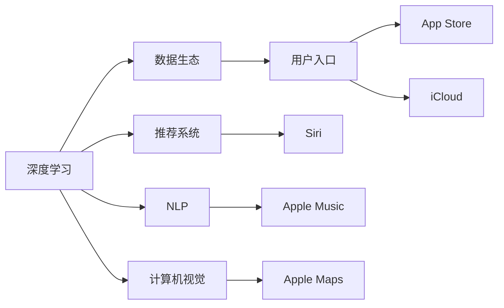

                 

## 1. 背景介绍

随着科技的发展，人工智能（AI）已经成为各大公司竞争的重要领域。苹果作为全球顶尖科技公司，其AI研究不仅在内部广泛应用，也在全球范围内引起广泛关注。苹果公司依靠其在硬件、软件和生态系统的优势，重新定义了AI领域的发展方向，将AI与入口为王的思想深深植入人心。

## 2. 核心概念与联系

### 2.1 核心概念概述

苹果的AI战略主要包括三个关键概念：**深度学习**、**数据生态**和**用户入口**。这些概念之间存在紧密联系，共同构成了苹果AI战略的核心。

- **深度学习**：苹果公司利用深度学习技术，打造了强大的AI模型，包括自然语言处理（NLP）、计算机视觉（CV）、推荐系统等，广泛应用于Siri、Face ID、Apple Maps、Apple Music等产品中。

- **数据生态**：苹果构建了庞大的数据生态系统，通过物联网设备、Apple Music、Apple TV等收集海量用户数据，为用户提供个性化服务。

- **用户入口**：苹果将AI技术与产品深度融合，打造易于使用、无缝集成的用户入口，如Siri、App Store、iCloud等，使用户能够轻松访问和使用AI服务。

### 2.2 核心概念原理和架构的 Mermaid 流程图



这个流程图展示了苹果AI战略的核心概念及其相互关系。深度学习技术为数据生态提供了强大的分析能力，同时用户入口也为用户提供了一个方便使用AI服务的平台。推荐系统、NLP和CV则是深度学习在特定领域的具体应用，为用户带来个性化和高效的服务。

## 3. 核心算法原理 & 具体操作步骤

### 3.1 算法原理概述

苹果的AI算法主要基于深度学习，包括卷积神经网络（CNN）、循环神经网络（RNN）、长短期记忆网络（LSTM）等。这些算法通过大量数据进行训练，使得AI模型能够在特定任务上表现出色。

### 3.2 算法步骤详解

苹果AI算法主要分为以下步骤：

1. **数据收集**：通过各种设备和平台收集用户数据，包括图像、文本、音频等。

2. **数据预处理**：对收集到的数据进行清洗、去重、归一化等预处理工作，确保数据质量。

3. **模型训练**：利用深度学习框架（如TensorFlow、PyTorch）对模型进行训练，优化模型参数。

4. **模型评估**：使用测试数据对训练好的模型进行评估，确保模型效果满足要求。

5. **模型部署**：将训练好的模型部署到实际应用中，如Siri、Apple Maps等。

6. **持续优化**：根据用户反馈和实际应用情况，持续优化模型，提升用户体验。

### 3.3 算法优缺点

苹果AI算法的优点在于：

- **高效性**：苹果AI算法经过大量数据训练，具有高效的计算能力和精准的预测能力。
- **便捷性**：苹果将AI算法与产品深度融合，使用户能够轻松访问和使用AI服务。
- **安全性**：苹果在数据收集和处理过程中，采取了严格的安全措施，确保用户数据的安全性。

缺点在于：

- **高成本**：深度学习模型的训练和部署需要大量的计算资源和人力成本。
- **隐私问题**：苹果在收集和处理用户数据时，需要平衡隐私保护和数据利用的关系。

### 3.4 算法应用领域

苹果AI算法广泛应用于以下几个领域：

- **自然语言处理**：如Siri语音助手，通过深度学习模型处理用户的语音指令，实现自然语言理解与生成。
- **计算机视觉**：如Face ID面部识别，通过深度学习模型识别用户面部特征，实现面部解锁功能。
- **推荐系统**：如Apple Music推荐歌曲，通过深度学习模型分析用户听歌习惯，推荐个性化音乐。
- **图像识别**：如Apple Maps街景功能，通过深度学习模型识别街道和建筑物，提供高质量的地图服务。

## 4. 数学模型和公式 & 详细讲解 & 举例说明

### 4.1 数学模型构建

苹果的AI算法模型主要基于神经网络，包括卷积神经网络（CNN）和循环神经网络（RNN）等。以Siri语音助手为例，其模型架构如下：

- **输入层**：将用户的语音指令转换为文本形式。
- **嵌入层**：将文本转换为向量形式，便于后续处理。
- **LSTM层**：对文本向量进行编码，提取语义信息。
- **全连接层**：将LSTM层的输出转换为分类结果，如指令执行与否。

### 4.2 公式推导过程

以Siri语音助手的自然语言处理模型为例，其公式推导如下：

$$
\text{输入层：} x_i = \text{文本指令} \\
\text{嵌入层：} e_i = \text{Embedding}(x_i) \\
\text{LSTM层：} h_i = \text{LSTM}(e_i) \\
\text{全连接层：} y_i = \text{Softmax}(h_i)
$$

其中，$x_i$表示输入的文本指令，$e_i$表示文本向量，$h_i$表示LSTM层的输出，$y_i$表示分类结果。

### 4.3 案例分析与讲解

以Face ID为例，其面部识别模型主要基于卷积神经网络（CNN）。其模型架构如下：

- **输入层**：将输入的面部图像转换为像素矩阵。
- **卷积层**：对像素矩阵进行卷积操作，提取特征。
- **池化层**：对特征图进行池化，减少特征维度。
- **全连接层**：将池化层的输出转换为分类结果，如是否为同一用户。

## 5. 项目实践：代码实例和详细解释说明

### 5.1 开发环境搭建

苹果AI项目开发环境主要基于TensorFlow和PyTorch等深度学习框架，开发工具包括Xcode、Python等。开发环境搭建步骤如下：

1. 安装Xcode：从官网下载并安装最新版本的Xcode。
2. 配置Python环境：通过Anaconda安装Python 3.8版本，并配置好相关依赖库。
3. 安装TensorFlow和PyTorch：通过pip安装最新版本的TensorFlow和PyTorch。
4. 配置开发环境：配置好开发环境后，进行开发环境的测试，确保环境正常工作。

### 5.2 源代码详细实现

以下是一个简单的深度学习模型实现示例，用于人脸识别：

```python
import tensorflow as tf

# 构建模型
model = tf.keras.Sequential([
    tf.keras.layers.Conv2D(32, (3, 3), activation='relu', input_shape=(32, 32, 3)),
    tf.keras.layers.MaxPooling2D((2, 2)),
    tf.keras.layers.Flatten(),
    tf.keras.layers.Dense(64, activation='relu'),
    tf.keras.layers.Dense(10, activation='softmax')
])

# 编译模型
model.compile(optimizer='adam',
              loss='categorical_crossentropy',
              metrics=['accuracy'])

# 训练模型
model.fit(train_data, train_labels, epochs=10, validation_data=(test_data, test_labels))
```

### 5.3 代码解读与分析

上述代码实现了一个人脸识别模型，主要包含以下几个步骤：

- **模型构建**：使用Sequential模型定义了多个层，包括卷积层、池化层、全连接层等。
- **模型编译**：指定了优化器、损失函数和评估指标。
- **模型训练**：使用训练数据和标签进行模型训练，并指定了训练轮数和验证集。

### 5.4 运行结果展示

训练完毕后，可以使用以下代码进行模型评估：

```python
test_loss, test_acc = model.evaluate(test_data, test_labels)
print('Test accuracy:', test_acc)
```

## 6. 实际应用场景

### 6.1 智能家居

苹果的AI技术在智能家居领域也有广泛应用。例如，苹果智能门锁通过人脸识别功能，可以实现自动解锁和手动授权等功能，极大提升了用户的生活便利性。

### 6.2 智能医疗

苹果的AI技术在医疗领域也有显著应用。例如，苹果的HealthKit平台可以整合用户的健康数据，通过深度学习算法分析用户的健康状况，提供个性化的健康建议。

### 6.3 智能交通

苹果的AI技术在智能交通领域也有广泛应用。例如，苹果的Apple Maps通过深度学习算法，可以识别交通拥堵情况，为用户提供最优的行车路线，提升出行效率。

## 7. 工具和资源推荐

### 7.1 学习资源推荐

为了帮助开发者系统掌握苹果AI技术的理论基础和实践技巧，这里推荐一些优质的学习资源：

1. **《深度学习》**：Ian Goodfellow等人编写的深度学习教材，全面介绍了深度学习的基础知识和应用。
2. **TensorFlow官方文档**：TensorFlow官方文档提供了丰富的深度学习算法和模型的代码示例，是学习苹果AI技术的重要资源。
3. **PyTorch官方文档**：PyTorch官方文档提供了丰富的深度学习算法和模型的代码示例，是学习苹果AI技术的另一个重要资源。
4. **苹果官方开发者文档**：苹果官方开发者文档提供了苹果AI技术的详细信息和API接口，是开发者学习和使用的重要资源。

### 7.2 开发工具推荐

苹果AI项目开发工具推荐使用TensorFlow、PyTorch等深度学习框架，配合Xcode、Python等开发工具，可以高效地进行AI算法的开发和部署。

### 7.3 相关论文推荐

苹果AI技术的许多研究成果已经被发布在学术论文中，以下是几篇推荐的论文：

1. **《A Neural Probabilistic Language Model》**：Ian Goodfellow等人提出的深度学习模型，为苹果Siri语音助手等应用奠定了基础。
2. **《Faster R-CNN: Towards Real-Time Object Detection with Region Proposal Networks》**：Ren等人提出的快速卷积神经网络模型，为苹果Face ID面部识别技术提供了支持。
3. **《A Systematic Review of Privacy-Preserving Machine Learning Techniques for Privacy-Preserving Recommender Systems》**：Güneş等人综述了隐私保护机器学习技术在推荐系统中的应用，为苹果Apple Music推荐系统提供了参考。

## 8. 总结：未来发展趋势与挑战

### 8.1 未来发展趋势

苹果AI技术的未来发展趋势包括以下几个方面：

1. **多模态融合**：苹果将在AI模型中融合语音、图像、文本等多种模态数据，提升AI系统的智能化和多功能性。
2. **边缘计算**：苹果将利用边缘计算技术，实现AI模型在移动设备上的高效推理，提升用户体验。
3. **联邦学习**：苹果将利用联邦学习技术，实现AI模型在多方数据上的协同训练，保护用户隐私。
4. **可解释性**：苹果将开发更易解释的AI模型，增强AI系统的可解释性和可信任度。

### 8.2 面临的挑战

苹果AI技术面临的挑战包括：

1. **计算资源**：深度学习模型的训练和推理需要大量的计算资源，苹果需要持续投入大量的计算资源支持AI研究。
2. **数据隐私**：苹果在收集和处理用户数据时，需要平衡隐私保护和数据利用的关系。
3. **模型鲁棒性**：苹果需要在复杂环境中保证AI模型的鲁棒性和准确性，避免模型偏见和错误。

### 8.3 研究展望

苹果AI技术的研究展望包括以下几个方面：

1. **隐私保护**：苹果将继续研究和应用隐私保护技术，确保用户数据的安全性和隐私性。
2. **模型优化**：苹果将继续优化深度学习模型，提升模型的计算效率和推理速度。
3. **跨领域应用**：苹果将探索AI技术在更多领域的应用，如智能交通、智能医疗等，拓展AI技术的边界。
4. **可解释性**：苹果将开发更易解释的AI模型，增强AI系统的可解释性和可信任度。

## 9. 附录：常见问题与解答

**Q1：苹果的AI技术为什么能够取得如此显著的成就？**

A: 苹果的AI技术能够取得显著成就，主要得益于以下几个方面：
1. **强大的硬件支持**：苹果拥有自研芯片（如A系列芯片）和先进的生产工艺，提供了强大的计算能力。
2. **丰富的数据生态**：苹果拥有庞大的数据生态系统，包括iPhone、iPad、Apple Watch等设备，收集了大量用户数据。
3. **优秀的工程师团队**：苹果拥有一支世界顶尖的工程师团队，拥有丰富的AI技术积累和创新能力。
4. **严格的质量控制**：苹果在产品开发过程中，注重质量控制和用户体验，确保AI技术的高质量和可靠性。

**Q2：苹果的AI技术在应用中如何保障用户隐私？**

A: 苹果在AI技术应用中，采取了多项措施来保障用户隐私：
1. **数据匿名化**：苹果对用户数据进行匿名化处理，确保数据无法追溯到具体的个人。
2. **数据加密**：苹果对用户数据进行加密存储和传输，确保数据的安全性。
3. **本地计算**：苹果将AI模型部署到本地设备上，避免数据上传和传输，进一步保护用户隐私。
4. **严格的用户授权**：苹果要求用户在应用中明确授权，并允许用户随时撤销授权，保护用户的数据控制权。

**Q3：苹果的AI技术在未来的发展方向是什么？**

A: 苹果的AI技术在未来将朝着以下几个方向发展：
1. **多模态融合**：苹果将在AI模型中融合语音、图像、文本等多种模态数据，提升AI系统的智能化和多功能性。
2. **边缘计算**：苹果将利用边缘计算技术，实现AI模型在移动设备上的高效推理，提升用户体验。
3. **联邦学习**：苹果将利用联邦学习技术，实现AI模型在多方数据上的协同训练，保护用户隐私。
4. **可解释性**：苹果将开发更易解释的AI模型，增强AI系统的可解释性和可信任度。

**Q4：苹果的AI技术在应用中需要注意哪些问题？**

A: 苹果的AI技术在应用中需要注意以下几个问题：
1. **模型鲁棒性**：苹果需要在复杂环境中保证AI模型的鲁棒性和准确性，避免模型偏见和错误。
2. **计算资源**：苹果需要持续投入大量的计算资源支持AI研究，提升AI模型的性能和效率。
3. **数据隐私**：苹果需要在收集和处理用户数据时，平衡隐私保护和数据利用的关系，确保用户数据的隐私性。
4. **用户体验**：苹果需要在AI技术应用中，注重用户体验，确保AI系统的高效性和可靠性。

作者：禅与计算机程序设计艺术 / Zen and the Art of Computer Programming

