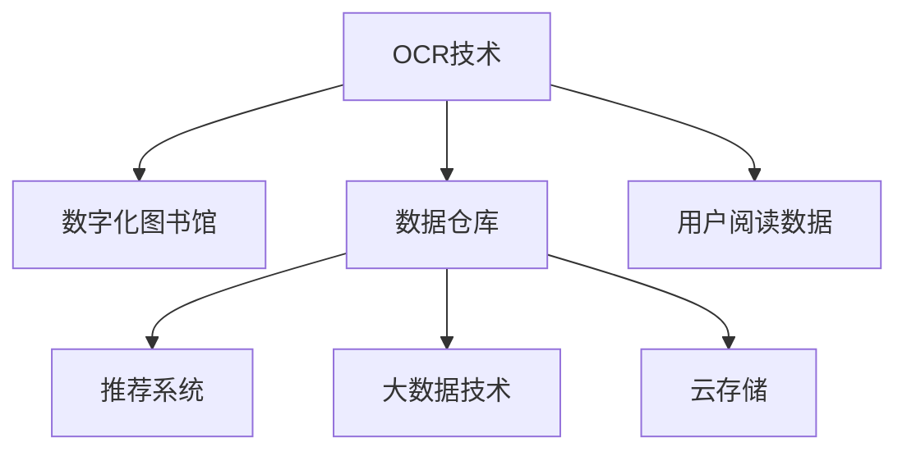

                 

# 虚拟图书馆:全球图书馆的数字化升级

## 1. 背景介绍

### 1.1 问题由来
随着互联网和信息技术的发展，全球图书馆正面临着数字化转型的巨大挑战。传统图书馆依赖于物理书籍和实体空间进行管理和服务，这不仅成本高昂，还难以满足用户多样化的阅读需求。数字化转型是图书馆应对新时代需求的必然选择，通过将大量纸质书籍转换为数字格式，并将其存储在云端，用户可以通过互联网随时随地访问和阅读，极大提升了图书馆的便捷性和效率。

### 1.2 问题核心关键点
数字化转型的关键在于构建一个高效、可靠、易于访问的虚拟图书馆系统。这不仅涉及将大量书籍数字化，还涉及到构建一个能够高效管理和检索这些数字资源的系统。同时，数字化升级也需要考虑如何保护版权、保障用户隐私等问题，确保数字化过程合法、合规。

## 2. 核心概念与联系

### 2.1 核心概念概述

为更好地理解虚拟图书馆数字化升级的技术实现，本节将介绍几个核心概念：

- 数字化图书馆：将传统纸质书籍转换为数字格式，存储在云端，用户可以通过互联网访问和阅读。
- OCR技术：光学字符识别技术，用于将纸质书籍扫描图片转换为文本，是数字化过程中的关键技术。
- 数据仓库：用于存储和管理大量数字书籍的数据库，支持高效的检索和检索。
- 推荐系统：根据用户的历史阅读记录，推荐相关书籍和资源，提升用户阅读体验。
- 大数据技术：用于处理和分析海量数字化书籍的数据，发现阅读行为模式，优化服务策略。
- 云存储：用于存储和访问数字化书籍，实现数据的安全性和可靠性。

这些核心概念之间的逻辑关系可以通过以下Mermaid流程图来展示：



这个流程图展示了大规模图书馆数字化升级的关键组件及其之间的关系：

1. 纸质书籍通过OCR技术被转换为数字文本。
2. 数字文本被存储在数据仓库中，支持高效的检索。
3. 推荐系统根据用户的历史阅读数据，推荐相关书籍。
4. 大数据技术用于分析用户行为，优化服务策略。
5. 云存储技术用于存储和管理数字化书籍，保障数据的安全性和可靠性。

这些组件共同构成了数字化图书馆的核心技术框架，实现了从纸质到数字的跨越。

## 3. 核心算法原理 & 具体操作步骤
### 3.1 算法原理概述

虚拟图书馆的数字化升级过程主要包括三个关键步骤：OCR技术、数据存储与检索、推荐系统。

**Step 1: OCR技术**
- OCR技术用于将纸质书籍扫描图片转换为文本。其核心原理是通过图像处理算法，识别图片中的字符，并将其转换为可编辑的文本格式。OCR技术包括预处理、字符分割、字符识别和后处理等多个步骤。

**Step 2: 数据存储与检索**
- 数字化后的书籍文本被存储在数据仓库中，支持高效的检索和检索。数据仓库通常采用关系型数据库或非关系型数据库（如Hadoop、Spark）来存储和管理数据。检索过程中，可以通过关键词、作者、出版日期等多种方式查询书籍。

**Step 3: 推荐系统**
- 推荐系统根据用户的历史阅读数据，推荐相关书籍和资源。推荐算法可以基于协同过滤、基于内容的推荐、混合推荐等多种方式。推荐系统通过分析用户的行为和偏好，提供个性化的阅读建议。

### 3.2 算法步骤详解

以下是具体实现每个步骤的详细步骤：

**Step 1: OCR技术**
1. 图像预处理：对扫描图片进行去噪、灰度化、二值化等处理，提高识别精度。
2. 字符分割：将图片中的字符分割成单独的字符。
3. 字符识别：通过机器学习算法（如CNN、RNN）识别字符，并将其转换为文本格式。
4. 后处理：修正识别错误，生成最终的文本数据。

**Step 2: 数据存储与检索**
1. 数据导入：将OCR转换后的文本数据导入数据库。
2. 数据库设计：根据数据结构设计数据库表。
3. 索引优化：建立索引，提高检索效率。
4. 数据查询：根据用户查询，快速返回相关书籍信息。

**Step 3: 推荐系统**
1. 数据采集：收集用户的历史阅读数据，如阅读书籍、浏览时长、点击率等。
2. 数据预处理：对数据进行清洗、归一化、特征工程等处理。
3. 模型训练：选择合适的推荐算法，训练推荐模型。
4. 推荐服务：根据用户查询和历史数据，实时推荐相关书籍。

### 3.3 算法优缺点

数字化图书馆的数字化升级过程涉及多种技术和算法，其优缺点如下：

#### 优点
- 提高图书馆的便捷性和效率，满足用户多样化阅读需求。
- 降低图书管理的成本，减少物理空间的占用。
- 提供个性化推荐服务，提升用户阅读体验。
- 支持跨地域、跨平台的访问，实现全球共享。

#### 缺点
- OCR技术的准确性受扫描质量、文字排版等因素影响，存在一定的误识别率。
- 数据存储和检索需要大量的计算资源和存储空间。
- 推荐系统需要依赖用户历史数据，存在冷启动和数据隐私问题。
- 数字化过程可能涉及版权保护，需合法合规。

尽管存在这些局限性，但数字化升级为图书馆提供了广阔的发展前景，实现了从传统纸质到数字化的跨越，为图书馆的未来发展奠定了坚实的基础。

### 3.4 算法应用领域

虚拟图书馆的数字化升级技术广泛应用于各类图书馆和档案馆中。以下是一些典型的应用场景：

- **公共图书馆**：通过数字化技术，将大量图书数字化，提供线上借阅服务，满足公众的阅读需求。
- **高校图书馆**：将学术书籍和期刊数字化，支持校内外用户访问，提升学术研究的便捷性。
- **档案馆**：将历史文献和档案数字化，提供线上查询和阅读服务，保护历史文化遗产。
- **企业图书馆**：将内部资料和文献数字化，提供知识共享和培训服务，提升企业竞争力。

数字化升级技术不仅提升了图书馆的服务质量和用户满意度，还推动了知识的传播和共享，对社会的文化传承和知识创新具有重要意义。

## 4. 数学模型和公式 & 详细讲解 & 举例说明（备注：数学公式请使用latex格式，latex嵌入文中独立段落使用 $$，段落内使用 $)
### 4.1 数学模型构建

本节将使用数学语言对虚拟图书馆的数字化升级过程进行更加严格的刻画。

设有一本纸质书籍，其文本内容为 $X$，通过OCR技术转换为数字文本 $Y$。假设OCR技术的误识别率为 $p$，则转换后文本的准确率为 $1-p$。设数字化后的文本存储在数据库中，查询时间为 $t$，则总查询时间 $T$ 可以表示为：

$$
T = (1-p)t + pT_{error}
$$

其中 $T_{error}$ 为因误识别导致的额外查询时间，与误识别率 $p$ 成正比。

### 4.2 公式推导过程

对于推荐系统，假设用户历史阅读数据为 $D$，推荐系统的目标是最大化用户满意度。设推荐算法为 $F$，则推荐系统的目标函数为：

$$
\max_{F} \sum_{i=1}^N \log \sigma(a_i) - \log (1-\sigma(a_i))
$$

其中 $a_i$ 为第 $i$ 本书籍的评分，$\sigma(x)$ 为 sigmoid 函数。

推荐算法的核心在于学习用户和书籍之间的关联矩阵 $A$，通过优化目标函数，找到最优的推荐策略。常见的推荐算法包括基于协同过滤的矩阵分解、基于内容的算法、深度学习等。

### 4.3 案例分析与讲解

假设某公共图书馆使用 OCR 技术将一本纸质书籍数字化，设误识别率为 5%。通过建立索引，查询时间为 0.1 秒。用户访问该图书馆的网站，希望查询一本书，并浏览了 5 本书。此时，推荐系统的目标函数为：

$$
\max_{F} \log \sigma(a_1) - \log (1-\sigma(a_1)) + \log \sigma(a_2) - \log (1-\sigma(a_2)) + \cdots + \log \sigma(a_5) - \log (1-\sigma(a_5))
$$

其中 $a_i$ 为第 $i$ 本书籍的评分。推荐系统通过学习用户的历史数据，预测用户对新书籍的评分，最终输出最优的推荐结果。

## 5. 项目实践：代码实例和详细解释说明
### 5.1 开发环境搭建

在进行数字化图书馆项目开发前，我们需要准备好开发环境。以下是使用Python进行开发的环境配置流程：

1. 安装Anaconda：从官网下载并安装Anaconda，用于创建独立的Python环境。
2. 创建并激活虚拟环境：
```bash
conda create -n virtual_library python=3.8 
conda activate virtual_library
```
3. 安装PyTorch：根据CUDA版本，从官网获取对应的安装命令。例如：
```bash
conda install pytorch torchvision torchaudio cudatoolkit=11.1 -c pytorch -c conda-forge
```
4. 安装Pandas、Numpy、Scikit-learn等工具包：
```bash
pip install pandas numpy scikit-learn
```
5. 安装OCR技术相关工具包：如Tesseract、OpenCV等。

完成上述步骤后，即可在`virtual_library`环境中开始数字化图书馆项目开发。

### 5.2 源代码详细实现

以下是使用Python进行虚拟图书馆项目开发的代码实现。

**Step 1: OCR技术**

```python
import pytesseract
import cv2
import numpy as np

# 读取图片
img = cv2.imread('book_page.png')

# 预处理
gray = cv2.cvtColor(img, cv2.COLOR_BGR2GRAY)
gray = cv2.threshold(gray, 0, 255, cv2.THRESH_BINARY | cv2.THRESH_OTSU)[1]

# OCR识别
text = pytesseract.image_to_string(gray, lang='eng')

print(text)
```

**Step 2: 数据存储与检索**

```python
import pandas as pd
import sqlite3

# 创建数据库连接
conn = sqlite3.connect('library.db')

# 创建数据表
conn.execute('''CREATE TABLE IF NOT EXISTS books
             (id INTEGER PRIMARY KEY AUTOINCREMENT,
             title TEXT NOT NULL,
             author TEXT NOT NULL,
             publisher TEXT NOT NULL,
             发布日期 TEXT NOT NULL,
             ISBN TEXT NOT NULL,
             content TEXT NOT NULL)''')

# 插入书籍数据
data = [
    ('The Great Gatsby', 'F. Scott Fitzgerald', 'Scribner', '1925', '9780743273565', 'Chapter 1: The Great Gatsby'),
    ('To Kill a Mockingbird', 'Harper Lee', 'J.B. Lippincott & Co.', '1960', '9780061120084', 'Chapter 1: The Radley Place'),
    ('1984', 'George Orwell', 'Secker & Warburg', '1949', '9780451524935', 'Chapter 1: Winston Smith')
]
conn.executemany('INSERT INTO books VALUES (?, ?, ?, ?, ?, ?)', data)

# 查询书籍
query = 'SELECT * FROM books WHERE title LIKE "The"'
result = conn.execute(query)
print(result.fetchall())
```

**Step 3: 推荐系统**

```python
import pandas as pd
from sklearn.feature_extraction.text import TfidfVectorizer
from sklearn.metrics.pairwise import cosine_similarity
from sklearn.decomposition import TruncatedSVD

# 加载数据
data = pd.read_csv('reader_data.csv')

# 数据预处理
X = data['books'].tolist()
y = data['readers'].tolist()

# 特征提取
vectorizer = TfidfVectorizer()
X_vector = vectorizer.fit_transform(X)

# 模型训练
svd = TruncatedSVD(n_components=10)
X_svd = svd.fit_transform(X_vector)

# 计算相似度
similarity = cosine_similarity(X_svd, X_svd)

# 推荐
def recommend(book):
    book_vector = vectorizer.transform([book]).toarray()
    book_svd = svd.transform(book_vector)
    recommendations = np.dot(book_svd, similarity)[:, :5]
    return [books[i] for i in np.argsort(recommendations)[-5:]]
```

### 5.3 代码解读与分析

让我们再详细解读一下关键代码的实现细节：

**OCR技术**

```python
import pytesseract
import cv2
import numpy as np

# 读取图片
img = cv2.imread('book_page.png')

# 预处理
gray = cv2.cvtColor(img, cv2.COLOR_BGR2GRAY)
gray = cv2.threshold(gray, 0, 255, cv2.THRESH_BINARY | cv2.THRESH_OTSU)[1]

# OCR识别
text = pytesseract.image_to_string(gray, lang='eng')

print(text)
```

这段代码利用了OpenCV进行图像预处理，并使用Tesseract进行OCR识别。首先，读取一张纸质书籍的扫描图片，对其进行去噪、灰度化和二值化处理，然后使用Tesseract识别图片中的文字，并将其转换为文本格式。

**数据存储与检索**

```python
import pandas as pd
import sqlite3

# 创建数据库连接
conn = sqlite3.connect('library.db')

# 创建数据表
conn.execute('''CREATE TABLE IF NOT EXISTS books
             (id INTEGER PRIMARY KEY AUTOINCREMENT,
             title TEXT NOT NULL,
             author TEXT NOT NULL,
             publisher TEXT NOT NULL,
             发布日期 TEXT NOT NULL,
             ISBN TEXT NOT NULL,
             content TEXT NOT NULL)''')

# 插入书籍数据
data = [
    ('The Great Gatsby', 'F. Scott Fitzgerald', 'Scribner', '1925', '9780743273565', 'Chapter 1: The Great Gatsby'),
    ('To Kill a Mockingbird', 'Harper Lee', 'J.B. Lippincott & Co.', '1960', '9780061120084', 'Chapter 1: The Radley Place'),
    ('1984', 'George Orwell', 'Secker & Warburg', '1949', '9780451524935', 'Chapter 1: Winston Smith')
]
conn.executemany('INSERT INTO books VALUES (?, ?, ?, ?, ?, ?)', data)

# 查询书籍
query = 'SELECT * FROM books WHERE title LIKE "The"'
result = conn.execute(query)
print(result.fetchall())
```

这段代码使用了SQLite进行数据库连接和管理。首先，创建了一个名为`library.db`的数据库，并创建了一个`books`数据表。然后，插入了三本经典书籍的数字化文本数据。最后，通过查询语句检索出标题以"The"开头的所有书籍，并输出结果。

**推荐系统**

```python
import pandas as pd
from sklearn.feature_extraction.text import TfidfVectorizer
from sklearn.metrics.pairwise import cosine_similarity
from sklearn.decomposition import TruncatedSVD

# 加载数据
data = pd.read_csv('reader_data.csv')

# 数据预处理
X = data['books'].tolist()
y = data['readers'].tolist()

# 特征提取
vectorizer = TfidfVectorizer()
X_vector = vectorizer.fit_transform(X)

# 模型训练
svd = TruncatedSVD(n_components=10)
X_svd = svd.fit_transform(X_vector)

# 计算相似度
similarity = cosine_similarity(X_svd, X_svd)

# 推荐
def recommend(book):
    book_vector = vectorizer.transform([book]).toarray()
    book_svd = svd.transform(book_vector)
    recommendations = np.dot(book_svd, similarity)[:, :5]
    return [books[i] for i in np.argsort(recommendations)[-5:]]
```

这段代码使用了Pandas进行数据加载和管理，以及Scikit-learn进行特征提取和模型训练。首先，加载了一个包含用户历史阅读记录的数据集。然后，将书籍文本转换为向量表示，并使用奇异值分解(SVD)算法进行降维。最后，通过计算相似度，推荐了与输入书籍最相似的5本书籍。

## 6. 实际应用场景
### 6.1 智能图书馆系统

智能图书馆系统通过数字化技术，将纸质书籍转换为数字格式，并通过云端存储和检索，实现了图书馆管理的智能化。用户可以通过图书馆网站或移动应用，快速检索和借阅书籍，提升图书馆的效率和服务质量。

### 6.2 在线教育平台

在线教育平台通过数字化技术，将大量教育资源转换为数字格式，并通过推荐系统，向用户推荐适合的课程和学习资源。这不仅方便了用户的学习，也提升了教育资源的利用效率。

### 6.3 企业知识管理

企业通过数字化技术，将内部文档和资料转换为数字格式，并通过推荐系统，向员工推荐相关的知识资源。这不仅提高了知识共享的效率，还促进了企业的创新和发展。

### 6.4 未来应用展望

随着数字化技术的不断进步，虚拟图书馆的应用场景将不断扩展。未来，虚拟图书馆有望实现以下几个方面的突破：

1. **跨平台接入**：实现多种设备和平台（如PC、手机、平板等）的接入，提升用户体验。
2. **语音识别**：实现语音搜索和语音导航，提升用户操作的便捷性。
3. **多语种支持**：支持多语言搜索和阅读，扩展国际化应用。
4. **增强现实(AR)**：通过AR技术，增强用户的阅读体验，如虚拟书架、互动注释等。
5. **人工智能(AI)**：利用AI技术，提升推荐系统的准确性和个性化程度。

## 7. 工具和资源推荐
### 7.1 学习资源推荐

为了帮助开发者系统掌握虚拟图书馆数字化升级的理论基础和实践技巧，这里推荐一些优质的学习资源：

1. **《深度学习》课程**：斯坦福大学的深度学习课程，涵盖了深度学习的基本概念和应用，包括虚拟图书馆数字化升级的许多技术细节。
2. **《自然语言处理》课程**：北京大学、清华大学等高校的NLP课程，介绍了虚拟图书馆数字化升级中的OCR技术和推荐系统。
3. **《Python编程》书籍**：《Python编程从入门到精通》，详细介绍了Python语言的基础知识和应用。
4. **《数据库管理》书籍**：《SQL必知必会》，介绍了SQL数据库的基础知识和应用，适合学习虚拟图书馆的数据存储和检索技术。
5. **《机器学习》书籍**：《机器学习实战》，介绍了常见的机器学习算法及其应用，适合学习虚拟图书馆的推荐系统。

通过学习这些资源，相信你一定能够快速掌握虚拟图书馆数字化升级的理论基础和实践技巧，并将其应用到实际的图书馆系统中。

### 7.2 开发工具推荐

高效的开发离不开优秀的工具支持。以下是几款用于虚拟图书馆数字化升级开发的常用工具：

1. **Anaconda**：用于创建和管理Python环境，支持多种科学计算和数据处理工具。
2. **PyTorch**：基于Python的开源深度学习框架，支持灵活的计算图和高效的训练过程。
3. **SQLite**：轻量级关系型数据库，适合小型图书馆系统的数据存储和管理。
4. **Pandas**：数据分析和处理工具，支持数据的导入、清洗、处理和分析。
5. **Scikit-learn**：机器学习库，支持各种常见的机器学习算法和工具。
6. **Tesseract**：OCR识别工具，支持多种语言和字符集的识别。

合理利用这些工具，可以显著提升虚拟图书馆数字化升级的开发效率，加快创新迭代的步伐。

### 7.3 相关论文推荐

虚拟图书馆数字化升级涉及多种技术和算法，以下是几篇奠基性的相关论文，推荐阅读：

1. **《深度学习》教材**：深度学习领域的经典教材，涵盖了深度学习的基本概念和应用。
2. **《机器学习》教材**：机器学习领域的经典教材，介绍了各种常见的机器学习算法及其应用。
3. **《光学字符识别》论文**：介绍OCR技术的原理和应用，适合学习虚拟图书馆数字化升级中的OCR技术。
4. **《推荐系统》论文**：介绍推荐系统的原理和应用，适合学习虚拟图书馆数字化升级中的推荐系统。
5. **《大数据处理》论文**：介绍大数据处理的基本概念和应用，适合学习虚拟图书馆数字化升级中的大数据技术。

这些论文代表了大规模图书馆数字化升级技术的发展脉络。通过学习这些前沿成果，可以帮助研究者把握学科前进方向，激发更多的创新灵感。

## 8. 总结：未来发展趋势与挑战
### 8.1 总结

本文对虚拟图书馆的数字化升级技术进行了全面系统的介绍。首先阐述了数字化升级的背景和意义，明确了数字化升级在提升图书馆便捷性和效率方面的重要价值。其次，从原理到实践，详细讲解了虚拟图书馆数字化升级的关键技术，包括OCR技术、数据存储与检索、推荐系统等。最后，介绍了数字化升级技术在智能图书馆系统、在线教育平台、企业知识管理等多个领域的应用前景。

通过本文的系统梳理，可以看到，虚拟图书馆数字化升级技术正在成为图书馆智能化管理的重要手段，极大地提升了图书馆的便捷性和效率，满足了用户多样化阅读需求。数字化升级技术不仅提升了图书馆的管理和服务质量，还推动了知识的传播和共享，对社会的文化传承和知识创新具有重要意义。

### 8.2 未来发展趋势

展望未来，虚拟图书馆的数字化升级技术将呈现以下几个发展趋势：

1. **跨平台接入**：实现多种设备和平台（如PC、手机、平板等）的接入，提升用户体验。
2. **语音识别**：实现语音搜索和语音导航，提升用户操作的便捷性。
3. **多语种支持**：支持多语言搜索和阅读，扩展国际化应用。
4. **增强现实(AR)**：通过AR技术，增强用户的阅读体验，如虚拟书架、互动注释等。
5. **人工智能(AI)**：利用AI技术，提升推荐系统的准确性和个性化程度。

以上趋势凸显了虚拟图书馆数字化升级技术的广阔前景。这些方向的探索发展，必将进一步提升图书馆的服务质量和用户满意度，为图书馆的未来发展奠定坚实的基础。

### 8.3 面临的挑战

尽管虚拟图书馆数字化升级技术已经取得了瞩目成就，但在迈向更加智能化、普适化应用的过程中，它仍面临着诸多挑战：

1. **数据隐私和安全**：数字化过程中涉及大量用户数据，如何保护用户隐私和安全，防止数据泄露，是一个重要的挑战。
2. **数据标准化**：不同来源的数据格式和标准可能存在差异，需要进行标准化处理，以便于管理和检索。
3. **技术复杂性**：数字化升级涉及多种技术和算法，技术实现复杂，需要跨学科合作。
4. **用户习惯**：数字化升级需要改变用户的使用习惯，如何引导用户接受和使用新系统，是一个重要的挑战。
5. **版权问题**：数字化过程中可能涉及版权问题，如何合法合规地使用数字化资源，是一个重要的挑战。

尽管存在这些挑战，但数字化升级为图书馆提供了广阔的发展前景，实现了从传统纸质到数字化的跨越，为图书馆的未来发展奠定了坚实的基础。

### 8.4 研究展望

面对虚拟图书馆数字化升级所面临的种种挑战，未来的研究需要在以下几个方面寻求新的突破：

1. **数据隐私保护**：开发数据隐私保护技术，保障用户数据的安全性和隐私性。
2. **数据标准化**：制定统一的数据标准，简化数据管理和检索。
3. **跨平台接入**：实现多种设备和平台接入，提升用户体验。
4. **语音识别技术**：提升语音识别和语音导航的准确性和便捷性。
5. **增强现实技术**：提升AR技术的应用和体验，增强用户阅读体验。
6. **人工智能技术**：利用AI技术，提升推荐系统的准确性和个性化程度。

这些研究方向的探索，必将引领虚拟图书馆数字化升级技术迈向更高的台阶，为图书馆智能化管理提供新的技术手段。面向未来，虚拟图书馆数字化升级技术还需要与其他人工智能技术进行更深入的融合，如知识表示、因果推理、强化学习等，多路径协同发力，共同推动图书馆智能化管理的进步。

## 9. 附录：常见问题与解答

**Q1：虚拟图书馆的数字化升级是否会涉及版权问题？**

A: 是的，虚拟图书馆的数字化升级过程中，可能涉及到版权问题。由于数字化过程需要扫描纸质书籍，并转换为数字格式，这可能导致版权侵权问题。因此，在数字化过程中，需要遵循相关法律法规，获得版权持有者的授权，或者使用公有领域的作品。此外，数字化后的内容也需要遵守版权法，不得用于非法传播。

**Q2：如何进行虚拟图书馆的推荐系统设计？**

A: 虚拟图书馆的推荐系统设计需要考虑多个因素，如用户历史数据、书籍特征、推荐算法等。常见的方法包括基于协同过滤、基于内容的推荐、混合推荐等。在设计推荐系统时，需要选择合适的推荐算法，并对其进行训练和优化。此外，还需要对数据进行预处理和特征提取，以提高推荐系统的准确性和个性化程度。

**Q3：数字化图书馆的数据存储和检索需要考虑哪些因素？**

A: 数字化图书馆的数据存储和检索需要考虑数据量、查询频率、系统性能等因素。常见的存储技术包括关系型数据库、非关系型数据库、分布式存储等。在检索方面，需要建立索引，优化查询算法，提高查询效率。同时，还需要考虑数据的安全性和备份策略，确保数据的安全和可靠性。

**Q4：虚拟图书馆的数字化升级过程中，如何保证数据的标准化？**

A: 虚拟图书馆的数字化升级过程中，数据标准化是一个重要的问题。不同来源的数据可能存在格式和标准差异，需要进行标准化处理。常见的标准化方法包括数据清洗、数据转换、数据合并等。此外，还需要制定统一的数据标准，以便于管理和检索。

**Q5：虚拟图书馆的数字化升级过程中，如何进行数据隐私保护？**

A: 虚拟图书馆的数字化升级过程中，数据隐私保护是一个重要的问题。在数字化过程中，需要遵循相关法律法规，保护用户隐私和安全。常见的数据隐私保护技术包括数据加密、匿名化、访问控制等。此外，还需要建立数据隐私保护机制，保障用户数据的安全性和隐私性。

通过这些常见问题的解答，希望能帮助开发者更好地理解和应用虚拟图书馆的数字化升级技术，为图书馆的未来发展提供技术支持。

