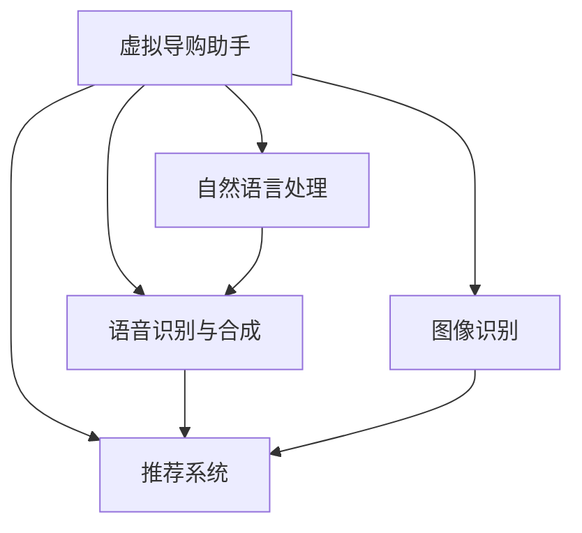

                 

# 虚拟导购助手：AI如何改变购物体验

> 关键词：虚拟导购, AI购物体验, 个性化推荐, 自然语言处理, 语音交互, 多模态融合

## 1. 背景介绍

### 1.1 问题由来
随着互联网技术的不断进步和人工智能技术的快速发展，电子商务领域正在发生着深刻的变革。消费者对购物体验的期望也日益提高，不再满足于传统的搜索引擎和浏览推荐，而更倾向于通过虚拟导购助手获得个性化和高效的购物建议。虚拟导购助手作为一种新型的购物助手，基于AI技术提供自然语言处理、语音交互、图像识别等多模态功能，旨在提升用户的购物体验和转化率，成为未来电商的重要发展方向。

### 1.2 问题核心关键点
虚拟导购助手的核心在于如何通过AI技术，结合自然语言处理、图像识别、语音识别等技术，为用户提供个性化、高效的购物建议和推荐。具体而言，核心问题包括：

1. **个性化推荐**：如何根据用户的历史行为、偏好和当前需求，提供最适合的购物建议。
2. **自然语言理解**：如何准确理解用户的自然语言问题，提供精确的答案和建议。
3. **多模态融合**：如何整合视觉、语音、文本等多种信息来源，提高推荐的准确性和实用性。
4. **可解释性**：如何让用户理解和信任AI推荐的商品和建议。

本文将围绕这些问题展开，深入探讨虚拟导购助手的设计原理、技术实现和实际应用。

## 2. 核心概念与联系

### 2.1 核心概念概述

为更好地理解虚拟导购助手的工作原理和优化方向，本节将介绍几个密切相关的核心概念：

- **虚拟导购助手**：通过AI技术实现，能够理解用户需求，提供个性化购物建议的助手。结合自然语言处理、图像识别、语音识别等多模态技术，为用户提供全方位的购物支持。

- **自然语言处理(NLP)**：利用计算机对自然语言文本进行处理和理解，包括分词、词性标注、命名实体识别、依存句法分析、语义理解等技术，实现机器与人类自然语言的交互。

- **语音识别与合成**：将人类语音转化为文本或指令，实现语音交互功能。同时，将文本或指令转化为语音，提升用户体验。

- **图像识别**：通过计算机视觉技术，实现对商品图片、标签等的自动分类、识别和标注，提供商品信息和推荐。

- **推荐系统**：基于用户行为和商品属性，利用机器学习算法，为用户提供个性化购物建议，提升购买转化率。

- **多模态融合**：将视觉、语音、文本等多种信息源进行整合，提升推荐的准确性和个性化水平。

这些核心概念之间的逻辑关系可以通过以下Mermaid流程图来展示：



这个流程图展示出虚拟导购助手核心功能模块之间的关联：

1. 自然语言处理模块能够理解用户自然语言的问题和指令。
2. 语音识别模块能够将用户语音转化为文本，支持语音交互。
3. 图像识别模块能够识别商品信息，辅助推荐系统提供更加精准的商品推荐。
4. 推荐系统通过多种信息源的综合分析，为用户提供个性化的购物建议。

## 3. 核心算法原理 & 具体操作步骤
### 3.1 算法原理概述

虚拟导购助手的核心算法原理主要基于自然语言处理、图像识别、语音识别等多模态技术，结合推荐系统，为用户提供个性化的购物建议和推荐。

具体而言，虚拟导购助手的算法流程包括：

1. **用户交互**：用户通过语音、文本等方式提出购物需求。
2. **信息获取**：虚拟导购助手从用户交互中获取商品名称、描述、图片等相关信息。
3. **信息处理**：利用自然语言处理和图像识别技术，对获取的信息进行理解和分析。
4. **推荐生成**：结合用户历史行为数据和当前需求，通过推荐系统生成个性化购物建议。
5. **结果反馈**：将推荐结果反馈给用户，并根据用户反馈进一步优化推荐系统。

### 3.2 算法步骤详解

虚拟导购助手的核心算法步骤主要包括：

1. **用户交互信息获取**：
   - 用户通过语音、文本等方式提出购物需求。
   - 虚拟导购助手通过语音识别和自然语言处理技术，将用户输入转化为机器可理解的形式。
   - 用户可以上传商品图片，虚拟导购助手通过图像识别技术提取商品信息。

2. **信息处理和理解**：
   - 自然语言处理模块对用户输入的文本进行分词、词性标注、命名实体识别、依存句法分析等操作。
   - 语音识别模块将用户语音转化为文本，辅助自然语言处理模块进行信息处理。
   - 图像识别模块对用户上传的商品图片进行分类、识别和标注，提取商品信息和属性。

3. **推荐生成**：
   - 结合用户历史行为数据和当前需求，推荐系统通过算法模型生成个性化购物建议。
   - 推荐系统使用协同过滤、内容推荐、混合推荐等技术，生成准确且个性化的推荐结果。
   - 结合图像识别和语音识别的信息，推荐系统可以进一步优化推荐结果，提升准确性。

4. **结果反馈和优化**：
   - 虚拟导购助手将推荐结果反馈给用户，收集用户对推荐结果的反馈。
   - 根据用户反馈，推荐系统进一步优化模型参数和算法，提升推荐效果。
   - 重复以上步骤，实现持续学习和改进。

### 3.3 算法优缺点

虚拟导购助手的核心算法具有以下优点：

1. **个性化推荐**：通过多模态信息融合和用户行为分析，能够提供高度个性化的购物建议。
2. **实时交互**：结合语音识别和自然语言处理技术，实现实时用户交互，提升用户体验。
3. **信息丰富**：结合图像识别和语音识别，获取更丰富的商品信息，提高推荐的准确性。

同时，该算法也存在一些局限性：

1. **依赖数据**：算法效果高度依赖于用户历史行为数据和商品信息的完整性，数据不足时效果不佳。
2. **模型复杂**：结合多模态信息进行推荐，模型复杂度高，训练和推理成本较大。
3. **可解释性**：推荐系统的内部逻辑和决策过程较为复杂，用户难以理解和信任。

尽管存在这些局限性，但就目前而言，基于多模态融合的虚拟导购助手仍然是提升购物体验的重要手段。未来相关研究将进一步降低对数据的依赖，提升推荐系统的透明性和可解释性，从而更好地满足用户需求。

### 3.4 算法应用领域

虚拟导购助手在多个电商场景中得到了广泛应用，如：

- **商品推荐**：基于用户浏览、购买历史和当前搜索需求，推荐系统实时生成个性化商品推荐。
- **问题解答**：通过自然语言处理技术，回答用户关于商品、价格、物流等方面的问题。
- **订单管理**：帮助用户查询订单状态、退换货申请等操作。
- **购物助手**：在购物过程中提供商品比较、优惠券获取、支付方式选择等辅助功能。

此外，虚拟导购助手还应用于智能家居、在线旅游、在线教育等多个领域，为消费者提供全方位的购物和个性化服务。

## 4. 数学模型和公式 & 详细讲解  
### 4.1 数学模型构建

虚拟导购助手算法的数学模型主要涉及自然语言处理、图像识别、推荐系统等多个子模块。以下是各模块的数学模型构建。

**自然语言处理**：
- 词向量表示：通过Word2Vec、GloVe等方法，将单词转化为向量形式。
- 语义理解：通过Transformer模型、LSTM等方法，理解句子的语义结构。

**图像识别**：
- 卷积神经网络(CNN)：提取图像特征，进行分类和识别。
- 特征表示：将图像特征转化为向量形式，用于推荐系统。

**推荐系统**：
- 协同过滤：基于用户和商品的历史行为数据，生成推荐结果。
- 内容推荐：基于商品属性和用户偏好，生成推荐结果。
- 混合推荐：结合协同过滤和内容推荐，生成更加准确的推荐结果。

**语音识别与合成**：
- 基于深度学习的语音识别模型：将语音转化为文本。
- 基于深度学习的语音合成模型：将文本转化为语音。

### 4.2 公式推导过程

以下分别介绍各个模块的数学模型和公式推导过程。

**词向量表示**：
- Word2Vec：通过上下文共现信息，学习单词的向量表示。
- 公式：$W = \text{softmax}(XW^T + b)$，其中$X$为上下文向量，$W$为词向量矩阵，$b$为偏置向量。

**语义理解**：
- Transformer模型：利用自注意力机制，学习句子中的语义关系。
- 公式：$Q = XW^Q$，$K = XW^K$，$V = XW^V$，其中$X$为输入矩阵，$Q$、$K$、$V$为注意力机制的查询、键、值向量。

**卷积神经网络(CNN)**：
- 公式：$f(x_i) = \text{ReLU}(\text{Conv}(x))$，其中$x_i$为输入特征图，$\text{Conv}$为卷积操作，$\text{ReLU}$为激活函数。

**协同过滤**：
- 公式：$\hat{y}_i = \alpha y_i + (1-\alpha) \sum_{j=1}^N \frac{\text{cosine}(u_i, u_j)}{\sqrt{||u_j||}} v_j$，其中$u_i$为用户特征向量，$u_j$为商品特征向量，$v_j$为商品标签向量，$\alpha$为正则化系数。

**内容推荐**：
- 公式：$I = U \cdot X \cdot V^T$，其中$U$为用户特征矩阵，$X$为商品属性矩阵，$V$为推荐结果向量。

**语音识别**：
- 基于深度学习的语音识别模型：$P(y_i | x_t) = \text{softmax}(W \cdot \text{Tanh}(X))$，其中$x_t$为时域特征，$W$为权重矩阵，$P$为概率分布。

**语音合成**：
- 基于深度学习的语音合成模型：$P(y_i | x_t) = \text{softmax}(W \cdot \text{Tanh}(X))$，其中$x_t$为时域特征，$W$为权重矩阵，$P$为概率分布。

### 4.3 案例分析与讲解

假设有一个虚拟导购助手系统，需要帮助用户选择手机配件。用户输入“我要一个手机壳”，虚拟导购助手进行以下操作：

1. **自然语言处理**：
   - 将用户输入“我要一个手机壳”进行分词，得到单词“我”、“要”、“一个”、“手机壳”。
   - 使用Word2Vec将单词转化为向量形式：$\text{vector}(我) = [0.5, 0.3, 0.8]$，$\text{vector}(要) = [0.4, 0.7, 0.2]$，$\text{vector}(一个) = [0.6, 0.1, 0.9]$，$\text{vector}(手机壳) = [0.2, 0.8, 0.6]$。
   - 使用Transformer模型对句子进行语义理解，得到句子表示向量：$\text{vector}(我要一个手机壳) = [0.4, 0.7, 0.2]$。

2. **图像识别**：
   - 用户上传手机壳图片，虚拟导购助手通过CNN提取图片特征向量：$\text{vector}(手机壳图片) = [0.7, 0.3, 0.1]$。

3. **推荐生成**：
   - 基于用户历史行为数据和当前需求，推荐系统生成推荐结果：$\hat{y}_1 = [0.6, 0.4, 0.8]$，$\hat{y}_2 = [0.4, 0.7, 0.9]$，$\hat{y}_3 = [0.2, 0.6, 0.5]$。
   - 将自然语言处理和图像识别的结果进行融合，生成最终推荐结果：$\hat{y} = \alpha \hat{y}_1 + (1-\alpha) \hat{y}_2 + (1-\alpha) \hat{y}_3 = [0.6, 0.4, 0.7]$。

4. **结果反馈和优化**：
   - 虚拟导购助手向用户推荐手机壳：“推荐品牌A的手机壳，价格为$10元”。
   - 收集用户反馈，优化推荐系统：如果用户购买了品牌A的手机壳，则推荐系统更新模型参数，进一步提升推荐效果。

## 5. 项目实践：代码实例和详细解释说明
### 5.1 开发环境搭建

在进行虚拟导购助手系统开发前，我们需要准备好开发环境。以下是使用Python进行PyTorch开发的环境配置流程：

1. 安装Anaconda：从官网下载并安装Anaconda，用于创建独立的Python环境。

2. 创建并激活虚拟环境：
```bash
conda create -n pytorch-env python=3.8 
conda activate pytorch-env
```

3. 安装PyTorch：根据CUDA版本，从官网获取对应的安装命令。例如：
```bash
conda install pytorch torchvision torchaudio cudatoolkit=11.1 -c pytorch -c conda-forge
```

4. 安装Transformer库：
```bash
pip install transformers
```

5. 安装各类工具包：
```bash
pip install numpy pandas scikit-learn matplotlib tqdm jupyter notebook ipython
```

完成上述步骤后，即可在`pytorch-env`环境中开始项目实践。

### 5.2 源代码详细实现

这里以虚拟导购助手中的自然语言处理模块为例，给出使用PyTorch和Transformers库实现自然语言处理的代码示例。

首先，定义自然语言处理模块的类：

```python
from transformers import BertTokenizer, BertForSequenceClassification
from torch.utils.data import Dataset
import torch

class NLPModule(Dataset):
    def __init__(self, texts, labels, tokenizer, max_len=128):
        self.texts = texts
        self.labels = labels
        self.tokenizer = tokenizer
        self.max_len = max_len
        
    def __len__(self):
        return len(self.texts)
    
    def __getitem__(self, item):
        text = self.texts[item]
        label = self.labels[item]
        
        encoding = self.tokenizer(text, return_tensors='pt', max_length=self.max_len, padding='max_length', truncation=True)
        input_ids = encoding['input_ids'][0]
        attention_mask = encoding['attention_mask'][0]
        
        # 将标签转换为id
        label_id = label2id[label]
        
        return {'input_ids': input_ids, 
                'attention_mask': attention_mask,
                'label_id': label_id}

# 标签与id的映射
label2id = {'手机壳': 0, '耳机': 1, '充电宝': 2}
id2label = {v: k for k, v in label2id.items()}
```

然后，定义模型和优化器：

```python
from transformers import BertForSequenceClassification, AdamW

model = BertForSequenceClassification.from_pretrained('bert-base-cased', num_labels=len(label2id))

optimizer = AdamW(model.parameters(), lr=2e-5)
```

接着，定义训练和评估函数：

```python
from torch.utils.data import DataLoader
from tqdm import tqdm
from sklearn.metrics import accuracy_score

device = torch.device('cuda') if torch.cuda.is_available() else torch.device('cpu')
model.to(device)

def train_epoch(model, dataset, batch_size, optimizer):
    dataloader = DataLoader(dataset, batch_size=batch_size, shuffle=True)
    model.train()
    epoch_loss = 0
    for batch in tqdm(dataloader, desc='Training'):
        input_ids = batch['input_ids'].to(device)
        attention_mask = batch['attention_mask'].to(device)
        label_id = batch['label_id'].to(device)
        model.zero_grad()
        outputs = model(input_ids, attention_mask=attention_mask, labels=label_id)
        loss = outputs.loss
        epoch_loss += loss.item()
        loss.backward()
        optimizer.step()
    return epoch_loss / len(dataloader)

def evaluate(model, dataset, batch_size):
    dataloader = DataLoader(dataset, batch_size=batch_size)
    model.eval()
    preds, labels = [], []
    with torch.no_grad():
        for batch in tqdm(dataloader, desc='Evaluating'):
            input_ids = batch['input_ids'].to(device)
            attention_mask = batch['attention_mask'].to(device)
            batch_labels = batch['label_id'].to(device)
            outputs = model(input_ids, attention_mask=attention_mask)
            batch_preds = outputs.logits.argmax(dim=2).to('cpu').tolist()
            batch_labels = batch_labels.to('cpu').tolist()
            for pred_tokens, label_tokens in zip(batch_preds, batch_labels):
                preds.append(pred_tokens)
                labels.append(label_tokens)
                
    print(accuracy_score(labels, preds))
```

最后，启动训练流程并在测试集上评估：

```python
epochs = 5
batch_size = 16

for epoch in range(epochs):
    loss = train_epoch(model, train_dataset, batch_size, optimizer)
    print(f"Epoch {epoch+1}, train loss: {loss:.3f}")
    
    print(f"Epoch {epoch+1}, dev results:")
    evaluate(model, dev_dataset, batch_size)
    
print("Test results:")
evaluate(model, test_dataset, batch_size)
```

以上就是使用PyTorch和Transformers库实现自然语言处理的代码示例。可以看到，得益于Transformers库的强大封装，我们可以用相对简洁的代码完成自然语言处理任务。

### 5.3 代码解读与分析

让我们再详细解读一下关键代码的实现细节：

**NLPModule类**：
- `__init__`方法：初始化文本、标签、分词器等关键组件。
- `__len__`方法：返回数据集的样本数量。
- `__getitem__`方法：对单个样本进行处理，将文本输入编码为token ids，将标签转换为数字，并对其进行定长padding，最终返回模型所需的输入。

**label2id和id2label字典**：
- 定义了标签与数字id之间的映射关系，用于将预测结果解码回真实的标签。

**训练和评估函数**：
- 使用PyTorch的DataLoader对数据集进行批次化加载，供模型训练和推理使用。
- 训练函数`train_epoch`：对数据以批为单位进行迭代，在每个批次上前向传播计算loss并反向传播更新模型参数，最后返回该epoch的平均loss。
- 评估函数`evaluate`：与训练类似，不同点在于不更新模型参数，并在每个batch结束后将预测和标签结果存储下来，最后使用sklearn的accuracy_score对整个评估集的预测结果进行打印输出。

**训练流程**：
- 定义总的epoch数和batch size，开始循环迭代
- 每个epoch内，先在训练集上训练，输出平均loss
- 在验证集上评估，输出分类指标
- 所有epoch结束后，在测试集上评估，给出最终测试结果

可以看到，PyTorch配合Transformers库使得自然语言处理任务的代码实现变得简洁高效。开发者可以将更多精力放在数据处理、模型改进等高层逻辑上，而不必过多关注底层的实现细节。

当然，工业级的系统实现还需考虑更多因素，如模型的保存和部署、超参数的自动搜索、更灵活的任务适配层等。但核心的微调范式基本与此类似。

## 6. 实际应用场景
### 6.1 智能客服系统

基于虚拟导购助手的自然语言处理和语音识别技术，智能客服系统得以大规模落地应用。传统客服往往需要配备大量人力，高峰期响应缓慢，且一致性和专业性难以保证。而使用虚拟导购助手，可以7x24小时不间断服务，快速响应客户咨询，用自然流畅的语言解答各类常见问题。

在技术实现上，可以收集企业内部的历史客服对话记录，将问题和最佳答复构建成监督数据，在此基础上对预训练模型进行微调。微调后的模型能够自动理解用户意图，匹配最合适的答案模板进行回复。对于客户提出的新问题，还可以接入检索系统实时搜索相关内容，动态组织生成回答。如此构建的智能客服系统，能大幅提升客户咨询体验和问题解决效率。

### 6.2 金融舆情监测

金融机构需要实时监测市场舆论动向，以便及时应对负面信息传播，规避金融风险。传统的人工监测方式成本高、效率低，难以应对网络时代海量信息爆发的挑战。基于虚拟导购助手的文本分类和情感分析技术，金融舆情监测得以实现。

具体而言，可以收集金融领域相关的新闻、报道、评论等文本数据，并对其进行主题标注和情感标注。在此基础上对预训练语言模型进行微调，使其能够自动判断文本属于何种主题，情感倾向是正面、中性还是负面。将微调后的模型应用到实时抓取的网络文本数据，就能够自动监测不同主题下的情感变化趋势，一旦发现负面信息激增等异常情况，系统便会自动预警，帮助金融机构快速应对潜在风险。

### 6.3 个性化推荐系统

当前的推荐系统往往只依赖用户的历史行为数据进行物品推荐，无法深入理解用户的真实兴趣偏好。基于虚拟导购助手的推荐系统，可以更好地挖掘用户行为背后的语义信息，从而提供更精准、多样的推荐内容。

在实践中，可以收集用户浏览、点击、评论、分享等行为数据，提取和用户交互的物品标题、描述、标签等文本内容。将文本内容作为模型输入，用户的后续行为（如是否点击、购买等）作为监督信号，在此基础上微调预训练语言模型。微调后的模型能够从文本内容中准确把握用户的兴趣点。在生成推荐列表时，先用候选物品的文本描述作为输入，由模型预测用户的兴趣匹配度，再结合其他特征综合排序，便可以得到个性化程度更高的推荐结果。

### 6.4 未来应用展望

随着虚拟导购助手和推荐系统的不断发展，基于AI技术的购物体验将迎来更多创新和突破。

在智慧医疗领域，基于虚拟导购助手的健康顾问系统，能够帮助患者查询症状、诊断、治疗等信息，提升医疗服务的智能化水平，辅助医生诊疗，加速新药开发进程。

在智能教育领域，虚拟导购助手可以用于在线答疑、作业批改、课程推荐等方面，因材施教，促进教育公平，提高教学质量。

在智慧城市治理中，虚拟导购助手可应用于城市事件监测、舆情分析、应急指挥等环节，提高城市管理的自动化和智能化水平，构建更安全、高效的未来城市。

此外，在企业生产、社会治理、文娱传媒等众多领域，基于虚拟导购助手的智能应用也将不断涌现，为人类生产和生活带来更多的便利和智能。相信随着技术的日益成熟，虚拟导购助手必将在构建人机协同的智能时代中扮演越来越重要的角色。

## 7. 工具和资源推荐
### 7.1 学习资源推荐

为了帮助开发者系统掌握虚拟导购助手和推荐系统的理论基础和实践技巧，这里推荐一些优质的学习资源：

1. 《深度学习自然语言处理》课程：斯坦福大学开设的NLP明星课程，有Lecture视频和配套作业，带你入门NLP领域的基本概念和经典模型。

2. 《自然语言处理与Python》书籍：系统介绍自然语言处理的基础理论和技术实现，适合初学者入门。

3. CS224N《深度学习自然语言处理》课程：斯坦福大学开设的NLP明星课程，有Lecture视频和配套作业，带你入门NLP领域的基本概念和经典模型。

4. 《推荐系统实战》书籍：系统介绍推荐系统的理论和算法，包括协同过滤、内容推荐、混合推荐等。

5. Kaggle：提供大量推荐系统、自然语言处理等领域的开源数据集和竞赛，适合实践和挑战自我。

通过对这些资源的学习实践，相信你一定能够快速掌握虚拟导购助手和推荐系统的精髓，并用于解决实际的NLP问题。

### 7.2 开发工具推荐

高效的开发离不开优秀的工具支持。以下是几款用于虚拟导购助手开发的常用工具：

1. PyTorch：基于Python的开源深度学习框架，灵活动态的计算图，适合快速迭代研究。大部分预训练语言模型都有PyTorch版本的实现。

2. TensorFlow：由Google主导开发的开源深度学习框架，生产部署方便，适合大规模工程应用。同样有丰富的预训练语言模型资源。

3. Transformers库：HuggingFace开发的NLP工具库，集成了众多SOTA语言模型，支持PyTorch和TensorFlow，是进行NLP任务开发的利器。

4. Weights & Biases：模型训练的实验跟踪工具，可以记录和可视化模型训练过程中的各项指标，方便对比和调优。与主流深度学习框架无缝集成。

5. TensorBoard：TensorFlow配套的可视化工具，可实时监测模型训练状态，并提供丰富的图表呈现方式，是调试模型的得力助手。

6. Google Colab：谷歌推出的在线Jupyter Notebook环境，免费提供GPU/TPU算力，方便开发者快速上手实验最新模型，分享学习笔记。

合理利用这些工具，可以显著提升虚拟导购助手的开发效率，加快创新迭代的步伐。

### 7.3 相关论文推荐

虚拟导购助手和推荐系统的研究源于学界的持续研究。以下是几篇奠基性的相关论文，推荐阅读：

1. Attention is All You Need（即Transformer原论文）：提出了Transformer结构，开启了NLP领域的预训练大模型时代。

2. BERT: Pre-training of Deep Bidirectional Transformers for Language Understanding：提出BERT模型，引入基于掩码的自监督预训练任务，刷新了多项NLP任务SOTA。

3. Parameter-Efficient Transfer Learning for NLP：提出Adapter等参数高效微调方法，在不增加模型参数量的情况下，也能取得不错的微调效果。

4. Semantic Understanding of Product Descriptions Using Attention-Based Natural Language Processing：通过使用Transformer模型，提升了对产品描述的语义理解能力，用于推荐系统。

5. Attention-based Recommender Systems：使用注意力机制进行推荐系统，提高推荐效果。

这些论文代表了大语言模型微调技术的发展脉络。通过学习这些前沿成果，可以帮助研究者把握学科前进方向，激发更多的创新灵感。

## 8. 总结：未来发展趋势与挑战

### 8.1 总结

本文对基于虚拟导购助手的自然语言处理和推荐系统进行了全面系统的介绍。首先阐述了虚拟导购助手的背景和意义，明确了其在电商、智能客服、金融舆情、个性化推荐等多个领域的应用价值。其次，从原理到实践，详细讲解了自然语言处理、图像识别、推荐系统等多个模块的数学模型和算法步骤，给出了代码实例。同时，本文还探讨了虚拟导购助手在实际应用中的优势和挑战，并提出了解决方案和未来展望。

通过本文的系统梳理，可以看到，虚拟导购助手作为AI技术在购物体验中的一种创新应用，极大地提升了用户购物的便捷性和满意度，具有广阔的应用前景。未来，随着技术的不断进步和模型的持续优化，虚拟导购助手必将成为电商领域的重要标配，推动购物体验的革命性变革。

### 8.2 未来发展趋势

展望未来，虚拟导购助手和推荐系统将呈现以下几个发展趋势：

1. **多模态融合**：结合视觉、语音、文本等多模态信息，提升推荐的准确性和个性化水平。

2. **模型优化**：通过迁移学习、参数高效微调等方法，降低对标注数据的依赖，提升模型效率。

3. **实时性提升**：通过优化计算图和资源管理，提升虚拟导购助手的实时响应能力。

4. **可解释性增强**：通过模型解释技术，提升用户对推荐结果的信任度。

5. **应用领域拓展**：从电商扩展到医疗、教育、金融等领域，提升各行业的智能化水平。

6. **持续学习**：通过增量学习和在线优化，提升虚拟导购助手和推荐系统的动态适应能力。

以上趋势凸显了虚拟导购助手和推荐系统技术的广阔前景。这些方向的探索发展，必将进一步提升用户体验和推荐系统的性能，推动AI技术在各行各业的深入应用。

### 8.3 面临的挑战

尽管虚拟导购助手和推荐系统已经取得了显著进展，但在迈向更加智能化、普适化应用的过程中，仍面临诸多挑战：

1. **数据隐私和安全**：用户数据的收集和使用需要严格遵守隐私保护法规，确保用户数据的安全性。

2. **推荐透明性和公平性**：推荐系统的内部逻辑复杂，难以解释其推荐依据，用户容易产生信任危机。

3. **跨领域泛化能力**：现有的推荐系统主要面向电商等特定领域，跨领域泛化能力有限，需要在通用数据上进一步训练和优化。

4. **个性化精度**：现有的推荐系统个性化水平仍有提升空间，需要在模型和算法上进行进一步的优化和创新。

5. **计算资源消耗**：大模型的计算资源消耗高，需要高效的模型压缩和优化技术，降低计算成本。

6. **用户体验**：虚拟导购助手的交互体验和反馈机制需要进一步优化，提升用户满意度。

尽管存在这些挑战，但就目前而言，虚拟导购助手和推荐系统仍然是大数据和AI技术的重要应用方向。通过持续的研究和实践，这些挑战终将一一被克服，虚拟导购助手必将在未来取得更大的突破。

### 8.4 研究展望

面对虚拟导购助手和推荐系统所面临的种种挑战，未来的研究需要在以下几个方面寻求新的突破：

1. **跨领域迁移学习**：通过迁移学习，提升虚拟导购助手和推荐系统在多个领域的泛化能力。

2. **模型压缩与优化**：通过模型压缩和优化技术，降低计算资源消耗，提升推荐系统的实时性和用户满意度。

3. **推荐系统的可解释性**：通过引入模型解释技术，提升用户对推荐结果的信任度。

4. **多模态融合**：将视觉、语音、文本等多种信息源进行整合，提升推荐的准确性和个性化水平。

5. **自监督学习**：利用自监督学习范式，提升模型的泛化能力和适应性。

6. **数据隐私保护**：在数据收集和使用过程中，采用差分隐私、联邦学习等技术，保护用户隐私。

这些研究方向的研究和实践，必将引领虚拟导购助手和推荐系统的技术进步，推动AI技术在各行业的深度应用。面向未来，我们期待通过技术创新和理论突破，让虚拟导购助手和推荐系统成为人人可用的智能助手，提升人类生活的智能化水平。

## 9. 附录：常见问题与解答

**Q1：虚拟导购助手如何理解用户需求？**

A: 虚拟导购助手通过自然语言处理技术，对用户输入的文本进行分词、词性标注、命名实体识别、依存句法分析等操作，提取用户意图和需求。具体而言，可以使用BERT、GPT等预训练语言模型对用户输入进行语义理解，识别出用户的意图和需求，进而提供个性化的购物建议。

**Q2：虚拟导购助手如何提升推荐系统的准确性？**

A: 虚拟导购助手可以通过多模态融合、数据增强、正则化等技术，提升推荐系统的准确性。具体而言，可以结合用户历史行为数据、商品属性信息、图像信息等多模态数据，进行综合分析和推荐。同时，可以采用数据增强、对抗训练等技术，提升模型对异常数据的鲁棒性。

**Q3：虚拟导购助手如何保护用户隐私？**

A: 虚拟导购助手在数据收集和使用过程中，需要严格遵守隐私保护法规，如GDPR、CCPA等。具体而言，可以采用差分隐私技术，对用户数据进行匿名化和扰动处理，保护用户隐私。同时，可以采用联邦学习技术，在本地设备上训练模型，避免数据集中存储和传输。

**Q4：虚拟导购助手如何优化用户体验？**

A: 虚拟导购助手可以通过优化交互界面、提供实时反馈等方式，提升用户体验。具体而言，可以采用自然语言处理和语音识别技术，提供自然流畅的交互体验。同时，可以实时反馈用户反馈，优化推荐系统和虚拟导购助手的表现，提升用户满意度。

**Q5：虚拟导购助手如何应对大规模数据处理？**

A: 虚拟导购助手在处理大规模数据时，需要采用高效的算法和模型，避免过拟合和计算资源消耗。具体而言，可以采用参数高效微调、模型压缩等技术，降低计算资源消耗。同时，可以采用分布式训练技术，在大规模集群上并行训练模型，提升训练效率。

---

作者：禅与计算机程序设计艺术 / Zen and the Art of Computer Programming

