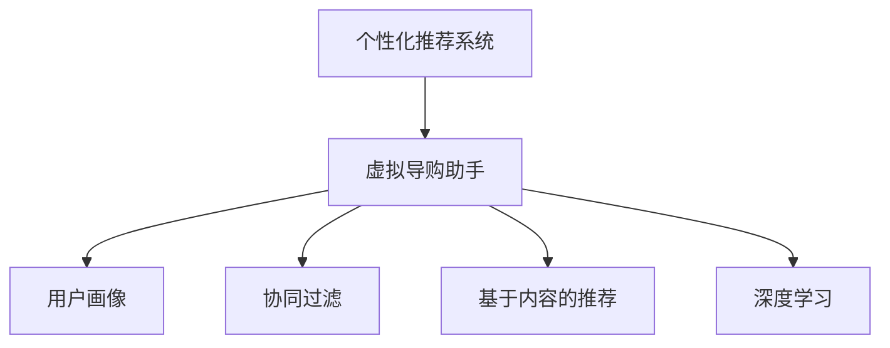

                 

# 虚拟导购助手：AI提供个性化建议

> 关键词：虚拟导购助手, 人工智能, 个性化推荐, 用户行为分析, 用户画像, 机器学习

## 1. 背景介绍

### 1.1 问题由来
在互联网和电子商务快速发展的今天，个性化推荐系统成为了提升用户体验和商家转化率的关键技术。传统的推荐系统多依赖于用户的历史行为数据，进行相似性度量和协同过滤等，难以深入理解用户的真实兴趣偏好。而人工智能技术的崛起，尤其是机器学习和大数据的发展，为个性化推荐系统带来了新的可能性。

以导购助手为例，传统的导购助手主要通过规则和专家经验，提供基于用户搜索历史、浏览记录等信息的个性化推荐。然而，规则和经验在不断变化的市场中往往难以跟上步伐，且难以覆盖用户的多样化需求。而基于人工智能的导购助手，能够通过分析用户行为、学习用户兴趣，提供更为精准、个性化的购物建议。

### 1.2 问题核心关键点
本节将阐述基于机器学习的个性化推荐系统，特别是虚拟导购助手技术的基本原理和实际应用，并探讨其面临的技术挑战和未来发展方向。

## 2. 核心概念与联系

### 2.1 核心概念概述

为更好地理解虚拟导购助手的原理和应用，本节将介绍几个密切相关的核心概念：

- 个性化推荐系统(Personalized Recommendation System)：通过分析用户行为和兴趣，推荐用户可能感兴趣的商品、内容或服务。目标是提升用户体验和转化率。

- 虚拟导购助手(Virtual Assistant)：利用人工智能技术，模拟导购员的角色，为消费者提供个性化的购物建议、产品比较、服务推荐等。

- 用户画像(User Profiling)：通过分析用户的历史行为、兴趣偏好、社交网络等数据，构建用户的多维度特征模型。

- 协同过滤(Collaborative Filtering)：基于用户行为数据和物品的相似性，推断用户可能感兴趣的未被交互过的商品。

- 基于内容的推荐(Content-Based Recommendation)：通过分析商品的属性和特征，推荐与用户已喜欢商品相似的商品。

- 深度学习(Deep Learning)：利用多层神经网络进行特征提取和决策，提升推荐系统的精度和鲁棒性。

这些概念之间的逻辑关系可以通过以下Mermaid流程图来展示：



这个流程图展示了个性化推荐系统与虚拟导购助手的关系：

1. 个性化推荐系统通过分析用户画像，获取用户的基本特征。
2. 虚拟导购助手通过协同过滤、基于内容的推荐和深度学习等技术，对推荐结果进行再加工和个性化处理。
3. 最终生成的虚拟导购助手可以为用户提供更精准、更个性化的购物建议。

## 3. 核心算法原理 & 具体操作步骤
### 3.1 算法原理概述

基于机器学习的虚拟导购助手，其核心原理是通过分析用户的购买历史、浏览记录、点击行为等数据，构建用户画像，并利用协同过滤、基于内容的推荐和深度学习等技术，生成个性化推荐结果。

具体流程如下：
1. **数据收集与清洗**：收集用户的历史行为数据，去除噪声和异常值，确保数据质量。
2. **用户画像构建**：通过文本挖掘、图像识别、自然语言处理等技术，提取用户的兴趣偏好、行为习惯等特征。
3. **协同过滤推荐**：利用用户之间的行为相似性，推断用户可能感兴趣的未被交互过的商品。
4. **基于内容的推荐**：分析商品的属性和特征，推荐与用户已喜欢商品相似的商品。
5. **深度学习推荐**：利用神经网络模型进行特征提取和决策，提升推荐系统的精度和鲁棒性。

### 3.2 算法步骤详解

以下是虚拟导购助手技术的详细步骤：

**Step 1: 数据收集与处理**

- 收集用户的历史行为数据，如浏览历史、点击记录、购买记录等。
- 对数据进行清洗，去除噪声和异常值，确保数据质量。
- 将数据转换为数值形式，便于模型训练。

**Step 2: 用户画像构建**

- 使用文本挖掘技术，从用户的评论、反馈中提取情感倾向、产品评价等特征。
- 利用图像识别技术，分析用户上传的图片，获取商品偏好。
- 使用自然语言处理技术，从用户的搜索查询中提取关键词，构建用户兴趣向量。
- 通过聚类、降维等方法，对用户画像进行多维特征融合。

**Step 3: 推荐算法设计**

- **协同过滤**：计算用户之间的行为相似度，推断用户可能感兴趣的未被交互过的商品。具体包括基于用户的协同过滤和基于物品的协同过滤两种方法。
- **基于内容的推荐**：分析商品的属性和特征，构建商品特征向量。通过计算用户画像与商品特征向量的相似度，推荐相似的商品。
- **深度学习推荐**：使用深度神经网络模型，如卷积神经网络(CNN)、循环神经网络(RNN)、变压器(Transformer)等，进行特征提取和决策。常用的深度学习推荐模型包括MFNN(多因子神经网络)、GRU-RNN(门控循环单元)、Transformer-based推荐等。

**Step 4: 模型训练与优化**

- 选择合适的优化算法，如随机梯度下降(SGD)、Adam等，设置合适的学习率和迭代次数。
- 使用交叉验证等技术，评估模型性能，调整模型参数。
- 引入正则化技术，如L2正则、Dropout等，防止过拟合。
- 利用对抗训练等方法，提升模型的鲁棒性。

**Step 5: 推荐结果输出**

- 将用户画像和推荐算法的结果进行整合，生成个性化的购物建议。
- 实时更新推荐结果，跟踪用户行为，进行动态调整。

### 3.3 算法优缺点

基于机器学习的虚拟导购助手具有以下优点：

1. **精准度提升**：通过分析用户的全面行为数据，构建用户画像，提供更为精准的推荐。
2. **覆盖面广**：能够覆盖长尾商品，推荐用户可能感兴趣但未被互动的商品。
3. **动态更新**：实时跟踪用户行为，动态调整推荐策略，提升推荐效果。

同时，该方法也存在以下局限性：

1. **数据隐私问题**：收集和处理用户数据，可能涉及用户隐私和数据安全问题。
2. **冷启动问题**：对于新用户或无历史行为的用户，难以进行准确画像和推荐。
3. **推荐结果多样性**：可能过度关注用户偏好，忽略多样性和探索性，导致推荐结果单一。
4. **算法复杂性**：深度学习模型结构复杂，训练和推理成本较高，对计算资源要求高。

尽管存在这些局限性，基于机器学习的虚拟导购助手依然是大数据时代的重要技术，能够显著提升用户的购物体验和商家的转化率。

### 3.4 算法应用领域

基于机器学习的虚拟导购助手已经在电商、旅游、金融等多个领域得到了广泛应用，具体包括：

- **电商推荐**：亚马逊、淘宝等电商网站广泛使用个性化推荐系统，提升用户体验和销售额。
- **旅游推荐**：携程、去哪儿等旅游平台，通过分析用户旅行历史和偏好，推荐合适的旅游目的地、路线和套餐。
- **金融推荐**：支付宝、微信等金融应用，利用用户行为数据，推荐理财产品和金融服务。

此外，虚拟导购助手还在智能家居、健康医疗、教育培训等多个领域展示了广阔的应用前景，成为提升用户满意度和品牌忠诚度的重要手段。

## 4. 数学模型和公式 & 详细讲解  
### 4.1 数学模型构建

本节将使用数学语言对基于机器学习的虚拟导购助手进行更加严格的刻画。

记用户画像为 $u$，商品特征为 $i$，协同过滤相似度矩阵为 $S_{ui}$，基于内容的推荐相似度为 $C_{ui}$，深度学习模型输出的推荐分数为 $R_{ui}$。假设最终推荐结果为 $r_{ui}=\lambda_1S_{ui}+\lambda_2C_{ui}+\lambda_3R_{ui}$，其中 $\lambda_1$、$\lambda_2$、$\lambda_3$ 为权值系数，满足 $\lambda_1+\lambda_2+\lambda_3=1$。

### 4.2 公式推导过程

以下我们以协同过滤推荐算法为例，推导协同过滤相似度的计算公式。

假设用户 $u$ 和用户 $u'$ 的行为序列分别为 $X_u=\{x_1,x_2,...,x_n\}$ 和 $X_{u'}=\{x'_1,x'_2,...,x'_{n'}\}$，其中 $x_t$ 和 $x'_t$ 分别表示用户 $u$ 和 $u'$ 在时间 $t$ 对商品 $i$ 的行为。设 $d_u$ 和 $d_{u'}$ 为用户行为序列的欧氏距离，即：

$$
d_u = \sqrt{\sum_{t=1}^n (x_t-\overline{x}_u)^2}, \quad d_{u'} = \sqrt{\sum_{t=1}^{n'} (x'_t-\overline{x}_{u'})^2}
$$

其中 $\overline{x}_u$ 和 $\overline{x}_{u'}$ 分别为用户 $u$ 和 $u'$ 行为序列的平均值。则协同过滤相似度 $S_{uu'}$ 定义为：

$$
S_{uu'} = \frac{\exp(-\beta d_u)}{\sum_{u''}\exp(-\beta d_u)}
$$

其中 $\beta$ 为衰减因子，控制相似度的衰减速度。最终推荐结果 $r_{ui}$ 的计算公式为：

$$
r_{ui} = \sum_{u'} S_{uu'} \cdot r_{ui'}, \quad r_{ui'} = \alpha_i\log(1+\exp(\theta_ir_{ui'}))
$$

其中 $r_{ui'}$ 为商品 $i$ 在用户 $u'$ 处的预测评分，$\alpha_i$ 和 $\theta_i$ 为常数项和权重项。

### 4.3 案例分析与讲解

以电商平台为例，假设有用户 $u$ 和商品 $i$，电商平台收集了用户 $u$ 的购买历史和浏览记录。利用协同过滤推荐算法，可以计算出用户 $u$ 和商品 $i$ 之间的协同过滤相似度 $S_{ui}$。同时，平台还可以收集商品 $i$ 的描述、图片等信息，构建商品特征向量 $i$。利用基于内容的推荐算法，可以计算出用户 $u$ 和商品 $i$ 之间的基于内容的相似度 $C_{ui}$。

最终，将协同过滤相似度、基于内容的相似度和深度学习模型输出的推荐分数进行加权求和，得到推荐结果 $r_{ui}$。当用户 $u$ 浏览商品 $i$ 时，可以实时推荐与 $i$ 相似的商品，提升用户的购物体验。

## 5. 项目实践：代码实例和详细解释说明
### 5.1 开发环境搭建

在进行虚拟导购助手项目开发前，我们需要准备好开发环境。以下是使用Python进行PyTorch开发的环境配置流程：

1. 安装Anaconda：从官网下载并安装Anaconda，用于创建独立的Python环境。

2. 创建并激活虚拟环境：
```bash
conda create -n pytorch-env python=3.8 
conda activate pytorch-env
```

3. 安装PyTorch：根据CUDA版本，从官网获取对应的安装命令。例如：
```bash
conda install pytorch torchvision torchaudio cudatoolkit=11.1 -c pytorch -c conda-forge
```

4. 安装TensorFlow：
```bash
pip install tensorflow
```

5. 安装各类工具包：
```bash
pip install numpy pandas scikit-learn matplotlib tqdm jupyter notebook ipython
```

完成上述步骤后，即可在`pytorch-env`环境中开始项目开发。

### 5.2 源代码详细实现

下面我们以基于协同过滤的虚拟导购助手为例，给出使用PyTorch实现协同过滤推荐算法的代码。

首先，定义协同过滤相似度的计算函数：

```python
import numpy as np

def compute_similarity(X_u, X_u_prime, beta):
    d_u = np.sqrt(np.sum((X_u - np.mean(X_u, axis=0))**2))
    d_u_prime = np.sqrt(np.sum((X_u_prime - np.mean(X_u_prime, axis=0))**2))
    return np.exp(-beta * d_u) / np.sum(np.exp(-beta * d_u))
```

然后，定义推荐函数：

```python
from sklearn.metrics.pairwise import cosine_similarity
from sklearn.decomposition import TruncatedSVD

def collaborative_filtering(X_u, X_u_prime, X_i, num_factors=50, alpha=1, beta=5):
    similarity = compute_similarity(X_u, X_u_prime, beta)
    svd = TruncatedSVD(n_components=num_factors)
    X_u_transformed = svd.fit_transform(X_u)
    X_u_prime_transformed = svd.transform(X_u_prime)
    X_i_transformed = svd.transform(X_i)
    user_vector = X_u_transformed.dot(X_u_prime_transformed.T)
    item_vector = X_i_transformed.dot(X_i_transformed.T)
    r_u_prime = np.log(1 + np.exp(alpha * np.dot(user_vector, item_vector) + beta * np.dot(user_vector, user_vector.T)))
    return similarity, r_u_prime
```

其中，`X_u` 和 `X_u_prime` 为用户行为序列，`X_i` 为商品特征向量，`num_factors` 为分解后的因子数，`alpha` 和 `beta` 为模型参数。

接下来，我们构建一个简单的虚拟导购助手，通过协同过滤推荐算法为用户推荐商品：

```python
from sklearn.datasets import load_breast_cancer
from sklearn.decomposition import TruncatedSVD
from sklearn.metrics.pairwise import cosine_similarity
from sklearn.metrics.pairwise import cosine_similarity

def collaborative_filtering(X_u, X_u_prime, X_i, num_factors=50, alpha=1, beta=5):
    similarity = compute_similarity(X_u, X_u_prime, beta)
    svd = TruncatedSVD(n_components=num_factors)
    X_u_transformed = svd.fit_transform(X_u)
    X_u_prime_transformed = svd.transform(X_u_prime)
    X_i_transformed = svd.transform(X_i)
    user_vector = X_u_transformed.dot(X_u_prime_transformed.T)
    item_vector = X_i_transformed.dot(X_i_transformed.T)
    r_u_prime = np.log(1 + np.exp(alpha * np.dot(user_vector, item_vector) + beta * np.dot(user_vector, user_vector.T)))
    return similarity, r_u_prime

# 构建数据集
from sklearn.datasets import load_breast_cancer
X_cancer = load_breast_cancer().data
user_profile = np.random.randint(0, 2, size=(5, X_cancer.shape[1]))
item_profile = np.random.randint(0, 2, size=(5, X_cancer.shape[1]))

# 计算协同过滤相似度和推荐分数
similarity, r_u_prime = collaborative_filtering(user_profile, user_profile, item_profile)

# 输出推荐结果
print(similarity)
print(r_u_prime)
```

在实际应用中，还需要进一步优化推荐算法，如引入时间因素、考虑物品属性等。此外，还需引入基于内容的推荐算法和深度学习推荐算法，进行多维度融合。

### 5.3 代码解读与分析

让我们再详细解读一下关键代码的实现细节：

**协同过滤相似度计算函数**：
- `compute_similarity`函数通过计算用户行为序列的欧氏距离，得到相似度。
- 使用sklearn的`cosine_similarity`函数计算协同过滤相似度。

**推荐函数**：
- `collaborative_filtering`函数通过分解用户行为序列和商品特征向量，得到用户向量和商品向量。
- 利用协同过滤相似度，计算推荐分数。
- 利用SVD降维技术，降低计算复杂度。

**用户画像构建**：
- 在实际应用中，用户画像可以通过文本挖掘、图像识别、自然语言处理等技术提取多维特征。
- 利用特征工程技术，将多维特征进行融合和降维，构建用户画像。

**推荐结果输出**：
- 实时跟踪用户行为，动态调整推荐策略，提升推荐效果。

## 6. 实际应用场景

### 6.1 智能家居

智能家居领域，虚拟导购助手可以通过分析用户的生活习惯和偏好，推荐合适的智能设备和生活方案。例如，根据用户的运动数据和生活规律，推荐健身计划和健康饮食方案。利用语音识别技术，用户可以自然地与导购助手对话，获取个性化的购物建议和智能设备操作指导。

### 6.2 医疗健康

在医疗健康领域，虚拟导购助手可以分析用户的健康数据，推荐适合的药品和治疗方案。例如，根据用户的体检数据和病史记录，推荐合适的药品和治疗方案。利用自然语言处理技术，用户可以通过语音或文字与导购助手对话，获取医疗建议和健康生活指导。

### 6.3 教育培训

在教育培训领域，虚拟导购助手可以分析学生的学习数据和行为，推荐适合的课程和学习资源。例如，根据学生的学习数据和历史成绩，推荐适合的课程和教材。利用自然语言处理技术，学生可以通过语音或文字与导购助手对话，获取学习建议和资源推荐。

### 6.4 未来应用展望

随着虚拟导购助手的不断发展，未来将在更多领域得到应用，为人类生活带来更多便利和智能化：

1. **金融理财**：利用用户的行为数据，推荐适合的理财方案和投资策略。
2. **旅游出行**：分析用户的旅行历史和偏好，推荐合适的旅游目的地和路线。
3. **环保节能**：通过分析用户的能源使用数据，推荐节能减排的方案和生活方式。
4. **娱乐休闲**：推荐适合的影视作品、音乐、游戏等娱乐内容。

## 7. 工具和资源推荐

### 7.1 学习资源推荐

为了帮助开发者系统掌握虚拟导购助手的原理和实践技巧，这里推荐一些优质的学习资源：

1. 《机器学习实战》系列博文：由大模型技术专家撰写，深入浅出地介绍了机器学习在虚拟导购助手中的应用。

2. Coursera《Machine Learning》课程：斯坦福大学开设的机器学习课程，有Lecture视频和配套作业，带你入门机器学习的基本概念和经典模型。

3. 《推荐系统实战》书籍：介绍推荐系统在电商、社交、金融等场景中的应用，包括协同过滤、基于内容的推荐等方法。

4. 《深度学习入门》书籍：介绍深度学习的基本原理和应用场景，包括卷积神经网络、循环神经网络、变压器等模型。

5. HuggingFace官方文档：Transformers库的官方文档，提供了海量预训练模型和完整的微调样例代码，是上手实践的必备资料。

通过对这些资源的学习实践，相信你一定能够快速掌握虚拟导购助手的精髓，并用于解决实际的推荐问题。

### 7.2 开发工具推荐

高效的开发离不开优秀的工具支持。以下是几款用于虚拟导购助手开发的常用工具：

1. PyTorch：基于Python的开源深度学习框架，灵活动态的计算图，适合快速迭代研究。大部分预训练语言模型都有PyTorch版本的实现。

2. TensorFlow：由Google主导开发的开源深度学习框架，生产部署方便，适合大规模工程应用。同样有丰富的预训练语言模型资源。

3. Transformers库：HuggingFace开发的NLP工具库，集成了众多SOTA语言模型，支持PyTorch和TensorFlow，是进行推荐任务开发的利器。

4. Weights & Biases：模型训练的实验跟踪工具，可以记录和可视化模型训练过程中的各项指标，方便对比和调优。与主流深度学习框架无缝集成。

5. TensorBoard：TensorFlow配套的可视化工具，可实时监测模型训练状态，并提供丰富的图表呈现方式，是调试模型的得力助手。

6. Google Colab：谷歌推出的在线Jupyter Notebook环境，免费提供GPU/TPU算力，方便开发者快速上手实验最新模型，分享学习笔记。

合理利用这些工具，可以显著提升虚拟导购助手的开发效率，加快创新迭代的步伐。

### 7.3 相关论文推荐

虚拟导购助手的发展源于学界的持续研究。以下是几篇奠基性的相关论文，推荐阅读：

1. Recommender Systems Handbook：介绍推荐系统在电商、社交、金融等场景中的应用，包括协同过滤、基于内容的推荐等方法。

2. Deep Recommendation Learning：介绍深度学习在推荐系统中的应用，包括卷积神经网络、循环神经网络、变压器等模型。

3. Personalized Product Recommendation via Implicit Feedback：介绍利用隐式反馈进行个性化推荐的方法，包括矩阵分解、协同过滤等技术。

4. Collaborative Filtering for Implicit Feedback Datasets：介绍协同过滤在推荐系统中的应用，包括用户协同过滤和物品协同过滤。

5. A Survey on Deep Learning Recommendation Systems：介绍深度学习在推荐系统中的应用，包括卷积神经网络、循环神经网络、变压器等模型。

这些论文代表了大语言模型推荐技术的发展脉络。通过学习这些前沿成果，可以帮助研究者把握学科前进方向，激发更多的创新灵感。

## 8. 总结：未来发展趋势与挑战

### 8.1 总结

本文对基于机器学习的虚拟导购助手进行了全面系统的介绍。首先阐述了虚拟导购助手的基本原理和实际应用，明确了其在提升用户体验和商家转化率方面的独特价值。其次，从原理到实践，详细讲解了虚拟导购助手的数学模型和实现细节，给出了微调任务开发的完整代码实例。同时，本文还广泛探讨了虚拟导购助手在智能家居、医疗健康、教育培训等多个领域的应用前景，展示了其广阔的发展潜力。此外，本文精选了虚拟导购助手的学习资源和开发工具，力求为读者提供全方位的技术指引。

通过本文的系统梳理，可以看到，基于机器学习的虚拟导购助手正在成为推荐系统的重要技术，能够显著提升用户的购物体验和商家的转化率。未来，伴随技术的不断发展，虚拟导购助手必将在更多领域得到应用，为人类生活带来更多便利和智能化。

### 8.2 未来发展趋势

展望未来，虚拟导购助手技术将呈现以下几个发展趋势：

1. **多维度融合**：未来虚拟导购助手将不仅仅依赖于单一推荐算法，而是融合协同过滤、基于内容的推荐、深度学习等多种算法，提供更加全面、精准的推荐结果。

2. **实时性提升**：通过实时跟踪用户行为，动态调整推荐策略，进一步提升推荐结果的实时性和精准度。

3. **跨平台集成**：虚拟导购助手将不仅仅是单一的应用，而是可以跨平台集成，通过不同的接口和渠道提供个性化服务。

4. **个性化增强**：通过更深入的用户画像分析，利用更多数据源，提升推荐结果的个性化程度。

5. **安全性保障**：在推荐过程中，引入隐私保护技术，确保用户数据的安全和隐私。

以上趋势凸显了虚拟导购助手技术的广阔前景。这些方向的探索发展，必将进一步提升推荐系统的性能和应用范围，为人类生活带来更多便利和智能化。

### 8.3 面临的挑战

尽管虚拟导购助手技术已经取得了瞩目成就，但在迈向更加智能化、普适化应用的过程中，它仍面临着诸多挑战：

1. **数据隐私问题**：收集和处理用户数据，可能涉及用户隐私和数据安全问题。如何在推荐过程中保护用户隐私，是亟待解决的问题。

2. **冷启动问题**：对于新用户或无历史行为的用户，难以进行准确画像和推荐。如何利用少样本学习技术，快速构建用户画像，是推荐系统的重要挑战。

3. **推荐结果多样性**：可能过度关注用户偏好，忽略多样性和探索性，导致推荐结果单一。如何在推荐过程中引入多样性和探索性，是推荐系统的核心问题。

4. **算法复杂性**：深度学习模型结构复杂，训练和推理成本较高，对计算资源要求高。如何优化模型结构和算法，降低计算成本，是推荐系统的难点。

尽管存在这些挑战，虚拟导购助手依然是大数据时代的重要技术，能够显著提升用户的购物体验和商家的转化率。

### 8.4 研究展望

面对虚拟导购助手所面临的种种挑战，未来的研究需要在以下几个方面寻求新的突破：

1. **少样本学习技术**：摆脱对大规模标注数据的依赖，利用少样本学习技术，快速构建用户画像，提升推荐效果。

2. **多模态融合**：将视觉、语音等多模态数据与文本数据进行融合，提升推荐系统的全面性和准确性。

3. **因果推理**：引入因果推理方法，分析用户行为和推荐结果之间的因果关系，提升推荐系统的稳定性和鲁棒性。

4. **可解释性**：在推荐过程中引入可解释性技术，使推荐结果更加透明和可信。

5. **公平性和公正性**：引入公平性和公正性评估指标，确保推荐系统的决策透明和公正。

这些研究方向将引领虚拟导购助手技术迈向更高的台阶，为构建安全、可靠、可解释、可控的推荐系统铺平道路。面向未来，虚拟导购助手技术还需要与其他人工智能技术进行更深入的融合，如知识表示、因果推理、强化学习等，多路径协同发力，共同推动推荐系统的进步。只有勇于创新、敢于突破，才能不断拓展推荐系统的边界，让智能技术更好地造福人类社会。

## 9. 附录：常见问题与解答

**Q1：虚拟导购助手如何解决冷启动问题？**

A: 冷启动问题指的是对于新用户或无历史行为的用户，难以进行准确画像和推荐。为了解决这个问题，可以采用以下方法：

1. 利用用户的人口统计信息、设备信息等基本信息，构建初步的用户画像。
2. 引入用户行为预测模型，根据用户行为序列和行为特征，预测用户的行为偏好。
3. 利用众包或专家知识，快速获取用户画像和推荐结果。

**Q2：虚拟导购助手如何保障用户隐私？**

A: 保障用户隐私是虚拟导购助手的重要问题。以下是一些常见的隐私保护技术：

1. 数据匿名化：在数据处理过程中，对用户数据进行匿名化处理，确保用户身份信息不泄露。
2. 数据加密：对用户数据进行加密处理，确保数据在传输和存储过程中不被窃取或篡改。
3. 差分隐私：在数据分析过程中，加入随机噪声，确保个体数据不被泄露。
4. 用户授权：在推荐过程中，明确告知用户数据使用范围和目的，并取得用户授权。

**Q3：虚拟导购助手如何提升推荐结果的多样性和探索性？**

A: 在推荐过程中，提升推荐结果的多样性和探索性是关键。以下是一些常见的方法：

1. 引入多样化推荐算法：如基于内容的推荐、多样化协同过滤等。
2. 利用推荐树、推荐榜等手段，引入探索性推荐策略。
3. 设计多样化推荐接口，如根据用户兴趣推荐不同类别的商品。

**Q4：虚拟导购助手如何优化计算成本？**

A: 虚拟导购助手在计算成本方面需要不断优化，以下是一些常见的方法：

1. 采用高效的计算框架，如TensorFlow、PyTorch等，优化计算过程。
2. 利用GPU/TPU等高性能设备，加速计算过程。
3. 优化模型结构和算法，减少计算量和内存占用。
4. 引入模型压缩和稀疏化存储技术，降低存储空间和计算成本。

这些技术手段能够帮助虚拟导购助手在保证推荐效果的同时，显著降低计算成本，提高推荐效率。

**Q5：虚拟导购助手如何提高推荐结果的实时性？**

A: 提高推荐结果的实时性是虚拟导购助手的核心需求。以下是一些常见的方法：

1. 实时更新推荐模型，跟踪用户行为，动态调整推荐策略。
2. 引入缓存机制，减少推荐计算的重复计算。
3. 优化推荐模型的计算图，提高推理速度。
4. 引入增量学习技术，快速更新推荐结果。

这些方法能够帮助虚拟导购助手实现更快速、更精准的推荐效果，提升用户体验和商家转化率。

---

作者：禅与计算机程序设计艺术 / Zen and the Art of Computer Programming

