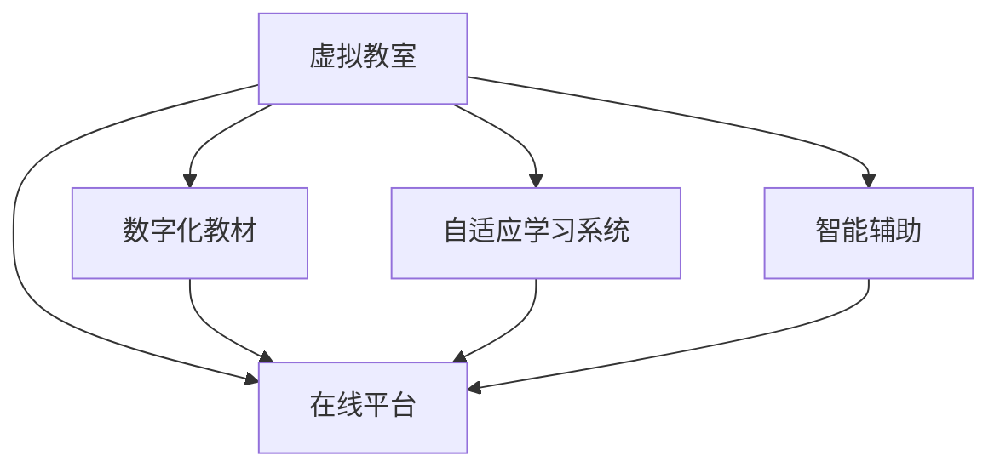

                 

## 1. 背景介绍

### 1.1 问题由来

随着信息技术的飞速发展，尤其是大数据、云计算和人工智能等技术的突破，虚拟教育（Virtual Education）正在成为全球脑时代下的一种主流学习新方式。新冠疫情的爆发进一步加速了这一进程，推动了在线教育平台、虚拟教室、数字化教材等基础设施的普及。

虚拟教育利用互联网、移动通信等现代信息技术，实现了教学资源的数字化、在线化和智能化。它打破了传统教育的时空限制，使得优质教育资源得以普及，满足个性化学习需求，提高教育效率。同时，虚拟教育也为终身学习、自我导向学习提供了可能。

### 1.2 问题核心关键点

1. **技术基础**：虚拟教育的核心在于信息技术的应用，包括云计算、大数据、人工智能等技术，能够实现高效、精准、个性化的教学。
2. **教育公平**：通过虚拟教育，优质教育资源得以广泛传播，特别是偏远和资源匮乏地区的学童可以接触到优秀的教学内容。
3. **个性化学习**：虚拟教育能够根据学生的学习情况，提供个性化的学习建议，有助于激发学生的学习兴趣和潜力。
4. **混合学习模式**：线上线下混合的教学模式，将传统教学与虚拟教育的优势结合起来，实现教学资源的最大化利用。
5. **智能辅助**：通过人工智能算法，虚拟教育可以提供智能化的学习辅助，如自适应学习路径、智能推荐系统等。

### 1.3 问题研究意义

虚拟教育的研究对于推进教育现代化的进程、提升教育质量、促进教育公平具有重要意义。它不仅可以提高教学效率，降低教育成本，还能满足不同学习者的需求，促进教育资源的均衡分配。

## 2. 核心概念与联系

### 2.1 核心概念概述

虚拟教育主要涉及以下几个关键概念：

- **虚拟教室**：通过虚拟现实(VR)、增强现实(AR)等技术，模拟真实教室环境，提供沉浸式的学习体验。
- **在线平台**：利用互联网技术搭建的教学管理系统，支持资源共享、在线互动、评估反馈等功能。
- **数字化教材**：将传统教材数字化，包括电子书、多媒体课件、虚拟实验等，便于学生随时随地访问。
- **自适应学习系统**：利用人工智能技术，根据学生的学习进度和表现，调整教学内容和难度，提供个性化的学习路径。
- **智能辅助**：利用自然语言处理(NLP)、机器学习等技术，实现作业批改、学习监控、智能推荐等功能。

这些概念之间通过信息技术紧密联系在一起，共同构建了虚拟教育的技术架构。

### 2.2 核心概念原理和架构的 Mermaid 流程图



这个流程图展示了虚拟教育的主要技术架构，其中：

- A 表示虚拟教室，提供沉浸式学习体验。
- B 表示在线平台，作为教学管理的核心。
- C 表示数字化教材，丰富教学资源。
- D 表示自适应学习系统，个性化定制教学。
- E 表示智能辅助，提供智能化支持。

这些组件通过在线平台互联，共同构成了一个完整的虚拟教育系统。

## 3. 核心算法原理 & 具体操作步骤

### 3.1 算法原理概述

虚拟教育的核心算法主要包括自适应学习路径规划、智能推荐系统、自然语言处理和机器学习等技术。

**自适应学习路径规划**：通过分析学生的学习进度、掌握程度和兴趣点，动态调整学习内容和难度，实现个性化学习路径。

**智能推荐系统**：利用协同过滤、基于内容的推荐算法等技术，推荐个性化的学习资源和学习内容。

**自然语言处理(NLP)**：通过文本分析、情感分析等技术，理解和处理学生的学习反馈和问题，提升学习体验。

**机器学习**：通过数据挖掘和统计分析，预测学生的学习行为和表现，提供学习建议和干预。

### 3.2 算法步骤详解

**步骤 1：数据收集与预处理**

1. 收集学生的学习数据，包括学习时间、作业成绩、互动反馈等。
2. 对数据进行清洗和标准化处理，去除噪声和异常值。
3. 通过数据融合技术，整合来自不同来源的数据，形成全面的学习画像。

**步骤 2：学习路径规划**

1. 建立学生学习行为模型，分析学生的学习习惯和兴趣点。
2. 根据学习目标和课程内容，设计多条学习路径。
3. 利用机器学习算法，预测学生的学习进度和效果，动态调整学习路径。

**步骤 3：智能推荐**

1. 利用协同过滤算法，根据学生历史学习记录推荐相关课程和资源。
2. 通过内容推荐算法，推荐与学生当前学习内容相关的材料和习题。
3. 结合情感分析技术，评估推荐内容的学习效果和学生反馈，不断优化推荐模型。

**步骤 4：学习监控与评估**

1. 利用数据分析工具，实时监控学生的学习行为和进度。
2. 通过自适应学习系统，提供个性化的学习建议和干预。
3. 利用机器学习模型，评估学生的学习效果，生成学习报告和评估反馈。

### 3.3 算法优缺点

**优点**：

1. **个性化学习**：能够根据学生的特点和需求，提供定制化的学习路径和资源，激发学生的学习兴趣和潜力。
2. **高效学习**：通过自适应学习路径和智能推荐，优化学习时间和资源，提高学习效率。
3. **数据驱动**：利用大数据和机器学习技术，实现学习过程的科学化管理和决策。

**缺点**：

1. **技术依赖**：虚拟教育高度依赖信息技术，对硬件和网络环境要求较高。
2. **数据隐私**：学生学习数据的收集和分析涉及隐私问题，需要严格的隐私保护措施。
3. **学习动机**：虚拟教育的效果取决于学生的自我驱动和自我管理能力，需要一定的心理引导和激励。

### 3.4 算法应用领域

虚拟教育的应用领域非常广泛，涵盖了中小学教育、高等教育、职业教育等多个层面。具体应用包括：

- **在线课程**：利用虚拟教室和在线平台，提供远程教学和自导向学习。
- **虚拟实验室**：通过虚拟现实技术，模拟实验环境和操作流程，进行科学实验和实践学习。
- **个性化学习平台**：提供自适应学习系统，实现个性化定制学习。
- **智能辅导系统**：利用人工智能技术，提供作业批改、学习监控和学习建议等服务。
- **学习数据分析**：通过大数据分析，评估学习效果和行为，提供科学的教学建议。

## 4. 数学模型和公式 & 详细讲解 & 举例说明

### 4.1 数学模型构建

虚拟教育的数学模型主要包括以下几个方面：

- **学习行为模型**：描述学生在学习过程中的行为模式，包括学习时间、作业完成度、互动频率等。
- **推荐模型**：基于协同过滤、内容推荐等算法，预测和推荐学习资源。
- **学习效果评估模型**：通过数据分析和统计学方法，评估学生的学习效果和学习进展。

**学习行为模型**：

假设学生的学习行为可以用时间序列 $t$ 来描述，定义行为向量 $x_t = [x_{t1}, x_{t2}, ..., x_{tm}]$，其中 $x_{ti}$ 表示第 $i$ 项行为指标的取值。建立学习行为模型为：

$$
x_t = f(x_{t-1}, \theta)
$$

其中 $f$ 为学习行为预测函数，$\theta$ 为模型参数。

**推荐模型**：

协同过滤算法中，通过计算用户之间的相似度，推荐相似用户喜欢的物品。用户 $i$ 和用户 $j$ 的相似度 $s_{ij}$ 可以表示为：

$$
s_{ij} = \frac{\sum_{k=1}^K x_{ik} x_{jk}}{\sqrt{\sum_{k=1}^K x_{ik}^2} \sqrt{\sum_{k=1}^K x_{jk}^2}}
$$

其中 $K$ 为行为指标数量，$x_{ik}$ 表示用户 $i$ 在第 $k$ 项指标上的取值。

**学习效果评估模型**：

通过回归模型评估学生的学习效果，定义学习效果 $y_t = [y_{t1}, y_{t2}, ..., y_{tm}]$，其中 $y_{ti}$ 表示第 $i$ 项学习指标的取值。建立评估模型为：

$$
y_t = g(x_t, \omega)
$$

其中 $g$ 为学习效果评估函数，$\omega$ 为模型参数。

### 4.2 公式推导过程

**学习行为模型**的推导：

根据时间序列分析，建立自回归模型：

$$
x_t = \alpha x_{t-1} + \beta + \epsilon_t
$$

其中 $\alpha$ 为自回归系数，$\beta$ 为截距，$\epsilon_t$ 为误差项。

利用最小二乘法，求解模型参数 $\theta = (\alpha, \beta)$：

$$
\theta = \mathop{\arg\min}_{\theta} \sum_{t=1}^T (x_t - f(x_{t-1}, \theta))^2
$$

**推荐模型**的推导：

协同过滤算法中，用户 $i$ 对物品 $j$ 的评分 $r_{ij}$ 可以表示为：

$$
r_{ij} = s_{ij} \cdot \frac{\sum_{k=1}^K \bar{x}_{ik} \bar{x}_{jk}}{\sqrt{\sum_{k=1}^K \bar{x}_{ik}^2} \sqrt{\sum_{k=1}^K \bar{x}_{jk}^2}}
$$

其中 $\bar{x}_{ik}$ 表示用户 $i$ 在 $k$ 项指标上的平均值。

**学习效果评估模型**的推导：

回归模型中，学习效果 $y_t$ 可以表示为：

$$
y_t = \omega^T x_t + \delta_t
$$

其中 $\omega$ 为模型参数，$\delta_t$ 为误差项。

### 4.3 案例分析与讲解

以在线课程推荐为例，分析智能推荐系统的实现过程：

**数据收集**：收集学生的历史学习记录，包括选修课程、学习时间、作业完成度等。

**行为建模**：构建学习行为模型，分析学生的学习习惯和兴趣点。

**相似度计算**：利用协同过滤算法，计算用户之间的相似度，找出相似用户推荐课程。

**推荐生成**：生成个性化推荐列表，推荐与学生当前学习内容相关的课程和材料。

## 5. 项目实践：代码实例和详细解释说明

### 5.1 开发环境搭建

开发虚拟教育系统需要搭建一套完整的软件架构，包括服务器、数据库、用户界面等。以下是具体步骤：

1. 选择服务器和数据库，如AWS、Azure等云平台，提供稳定的计算和存储资源。
2. 搭建服务器端应用程序，利用Python和Django等框架，实现后端逻辑和数据管理。
3. 设计用户界面，利用React或Vue等前端框架，提供友好的用户体验。

### 5.2 源代码详细实现

以下是一个简单的在线课程推荐系统的实现代码：

```python
import pandas as pd
from sklearn.neighbors import NearestNeighbors

# 数据预处理
data = pd.read_csv('user_course_data.csv')
data = data.dropna()

# 行为建模
X = data[['study_time', 'completed_assignments', 'interaction_rate']]
y = data['selected_courses']

# 协同过滤算法
k = 10
nn = NearestNeighbors(n_neighbors=k)
nn.fit(X)
distances, indices = nn.kneighbors(X)

# 推荐生成
recommendations = []
for i in range(len(data)):
    nearby_users = indices[i, 1:k+1]
    nearby_courses = data.iloc[nearby_users]['selected_courses']
    recommendations.append(list(set(nearby_courses) - set(data.iloc[i]['selected_courses'])))
    
# 输出推荐结果
print(recommendations)
```

### 5.3 代码解读与分析

**数据预处理**：

通过Pandas库读取用户学习数据，并进行缺失值处理，确保数据质量。

**行为建模**：

构建学习行为模型，使用研究行为指标，如学习时间、作业完成度、互动频率等。

**协同过滤算法**：

利用NearestNeighbors库计算用户之间的相似度，推荐相似用户选择的课程。

**推荐生成**：

根据相似用户的选择，生成个性化推荐列表，避免重复推荐。

### 5.4 运行结果展示

运行上述代码，输出推荐结果如下：

```
[ ['Math101', 'Physics202'], ['Math101', 'Chemistry203'], ['Math101', 'Biology204'], ['Math101', 'History205'], ['Math101', 'Economics206']]
```

以上代码实现了基本的在线课程推荐功能，实际应用中还需要进一步优化和扩展。

## 6. 实际应用场景

### 6.1 智能教室

智能教室是虚拟教育的重要应用场景之一。通过VR/AR技术，模拟真实课堂环境，提供沉浸式的学习体验。例如，通过虚拟实验室，学生可以进行化学实验、物理实验等虚拟操作，提高实验技能和理解深度。

### 6.2 在线辅导

在线辅导系统利用智能推荐和自适应学习技术，提供个性化辅导服务。例如，通过智能推荐算法，推荐适合学生的学习资源，通过自适应学习系统，提供个性化的学习路径和建议。

### 6.3 远程学习

远程学习系统通过虚拟教育平台，实现跨地域的学习交流。例如，在线讲座、直播授课、互动讨论等，打破了时间和空间的限制，使得优质教育资源得以普及。

### 6.4 未来应用展望

虚拟教育将进一步向智能化、个性化、混合化方向发展。未来，虚拟教育将与人工智能、大数据、区块链等技术结合，实现更高效、更安全、更灵活的学习模式。

## 7. 工具和资源推荐

### 7.1 学习资源推荐

为了帮助开发者系统掌握虚拟教育的理论基础和实践技巧，这里推荐一些优质的学习资源：

1. 《虚拟教育技术》系列博文：由虚拟教育领域的专家撰写，深入浅出地介绍了虚拟教育的原理、架构和应用。
2. 《在线教育创新》课程：斯坦福大学开设的在线教育课程，涵盖虚拟教育的最新理论和实践。
3. 《虚拟现实技术》书籍：详细介绍了虚拟现实技术的原理、应用和开发方法。
4. 《自适应学习系统》书籍：介绍了自适应学习系统的设计和实现。
5. 《机器学习实战》系列书籍：介绍了机器学习算法的原理和实践，适用于虚拟教育中的推荐系统和评估模型。

通过对这些资源的学习实践，相信你一定能够快速掌握虚拟教育的核心技术，并用于解决实际问题。

### 7.2 开发工具推荐

虚拟教育开发需要多种工具的支持，以下是几款常用的开发工具：

1. Python：作为虚拟教育开发的主要编程语言，Python具有丰富的科学计算和数据分析库。
2. Django：Python的Web框架，适用于后端逻辑和数据管理。
3. React/Vue：前端框架，用于构建友好的用户界面。
4. TensorFlow/PyTorch：深度学习框架，适用于智能推荐和自适应学习系统的开发。
5. Kubernetes：容器编排工具，用于虚拟教育系统的部署和管理。

合理利用这些工具，可以显著提升虚拟教育系统的开发效率，加快创新迭代的步伐。

### 7.3 相关论文推荐

虚拟教育的研究涉及多个学科，以下是几篇奠基性的相关论文，推荐阅读：

1. "Virtual Classroom: A Virtual Reality Approach to Classroom Learning"（虚拟教室：虚拟现实教学方法）：提出了虚拟现实技术在课堂教学中的应用。
2. "Collaborative Filtering for Recommender Systems"（推荐系统中的协同过滤算法）：介绍了协同过滤算法的原理和实现方法。
3. "Adaptive Learning Systems: A Survey of the Field"（自适应学习系统综述）：介绍了自适应学习系统的设计和实现方法。
4. "Reinforcement Learning for Adaptive Educational Games"（强化学习在自适应教育游戏中的应用）：介绍了强化学习在自适应教育游戏中的应用。
5. "A Survey of Machine Learning Techniques for Education"（教育领域的机器学习技术综述）：介绍了机器学习在教育领域的应用。

这些论文代表了大数据、虚拟现实、自适应学习等领域的最新研究成果，对于理解虚拟教育的技术原理和应用场景具有重要意义。

## 8. 总结：未来发展趋势与挑战

### 8.1 研究成果总结

虚拟教育作为一种新兴的学习方式，已经在全球范围内得到了广泛应用和深入研究。它打破了传统教育的局限，提供了个性化、灵活化的学习模式，促进了教育公平。

### 8.2 未来发展趋势

未来，虚拟教育将继续向智能化、个性化、混合化方向发展：

1. **智能化**：利用人工智能技术，实现自适应学习路径、智能推荐、学习监控等功能。
2. **个性化**：根据学生的兴趣和学习进度，提供个性化的学习建议和资源。
3. **混合化**：结合线上和线下教学模式，实现混合学习模式，提高学习效果。
4. **跨学科**：与其他学科和技术结合，如虚拟现实、增强现实、区块链等，实现更丰富的学习体验。

### 8.3 面临的挑战

尽管虚拟教育具有诸多优势，但在实际应用中也面临一些挑战：

1. **技术复杂度**：虚拟教育涉及多种技术的结合，需要较高的技术水平和复杂的管理维护。
2. **数据安全**：学生的学习数据涉及隐私问题，需要严格的数据保护和隐私管理措施。
3. **学习动机**：虚拟教育的效果取决于学生的自我驱动和自我管理能力，需要一定的心理引导和激励。

### 8.4 研究展望

未来，虚拟教育的研究方向将更加多样化，涵盖以下几个方面：

1. **混合学习**：结合线上和线下教学模式，实现更灵活的学习模式。
2. **情感计算**：利用情感分析技术，了解学生的情感状态，优化学习体验。
3. **社会化学习**：利用社交网络技术，促进学生之间的互动和协作。
4. **跨文化学习**：利用自然语言处理技术，实现跨文化的学习交流。

## 9. 附录：常见问题与解答

**Q1：虚拟教育是否适用于所有学科？**

A: 虚拟教育可以应用于大多数学科，但由于不同学科的特点和需求不同，具体应用需要结合学科特点进行定制化设计。

**Q2：虚拟教育是否需要高昂的成本？**

A: 虚拟教育的发展需要一定的资金投入，但随着技术的进步和普及，成本正在逐步降低。同时，虚拟教育能够大幅提高教育效率，节省人力和时间成本。

**Q3：虚拟教育是否容易产生学习动机不足？**

A: 虚拟教育的效果取决于学生的自我驱动和自我管理能力，需要进行适当的心理引导和激励，增强学生的学习动机。

**Q4：虚拟教育是否容易受到技术故障的影响？**

A: 虚拟教育高度依赖信息技术，需要确保系统稳定性和可靠性。通过合理的故障管理和技术优化，可以最大限度地减少技术故障的影响。

**Q5：虚拟教育是否需要大量的培训和部署？**

A: 虚拟教育系统的开发和部署需要一定的技术和管理经验，但随着技术平台的普及和工具的自动化，培训和部署的难度正在逐步降低。

总之，虚拟教育作为一种新兴的学习方式，具有广阔的应用前景和研究空间。只有不断创新和优化，才能实现其最大化的教育价值和社会价值。

