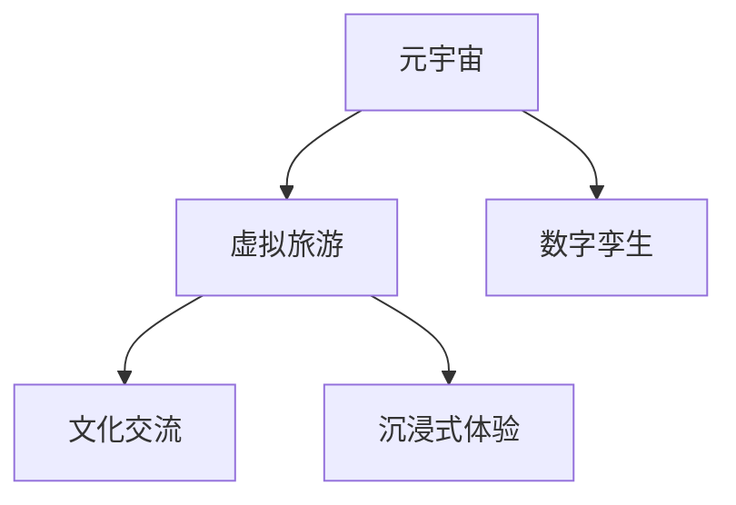

                 

# 虚拟旅游：元宇宙中的文化交流新方式

## 1. 背景介绍

### 1.1 问题由来
随着虚拟现实(VR)、增强现实(AR)和数字孪生技术的发展，元宇宙(Upperverse)成为了近年来数字技术领域的关注热点。元宇宙旨在构建一个与现实世界平行，充满无限可能性的虚拟空间，用户可以在其中自由探索、创造和互动。在这一背景下，虚拟旅游应运而生，成为元宇宙中一种新兴的文化交流方式。

### 1.2 问题核心关键点
虚拟旅游是将现实世界的风景名胜、历史文化等以虚拟形式在元宇宙中呈现，用户可以通过VR/AR设备沉浸式体验和探索。其核心关键点包括：

- 虚拟旅游平台：构建虚拟空间的技术支撑。
- 元宇宙体验：提供沉浸式虚拟旅游体验。
- 文化交流：通过虚拟旅游促进不同地域、文化间的交流。

这些关键点共同构成了虚拟旅游的技术基础和文化内涵，使其成为元宇宙时代重要的文化体验形式。

## 2. 核心概念与联系

### 2.1 核心概念概述

为更好地理解虚拟旅游在元宇宙中的应用，本节将介绍几个密切相关的核心概念：

- 元宇宙(Upperverse)：一个基于VR、AR等技术构建的虚拟世界，用户在虚拟环境中可进行互动和创造。
- 虚拟旅游(Virtual Tourism)：在元宇宙中以虚拟形式呈现的旅游体验，用户可自由探索虚拟景观。
- 数字孪生(Digital Twin)：通过物理仿真、数据融合等技术构建的数字虚拟模型，用于模拟和仿真现实世界。
- 文化交流(Cultural Exchange)：不同地域、文化间通过虚拟旅游平台进行的文化交流和互动。
- 沉浸式体验(Immersive Experience)：通过VR、AR等技术构建的沉浸式虚拟环境，使用户感觉仿佛身临其境。

这些概念之间的逻辑关系可以通过以下Mermaid流程图来展示：



这个流程图展示了大语言模型的核心概念及其之间的关系：

1. 元宇宙是虚拟旅游的技术基础。
2. 数字孪生用于构建虚拟景观和仿真体验。
3. 沉浸式体验使得虚拟旅游更加真实和吸引人。
4. 文化交流是虚拟旅游的核心目的。

这些概念共同构成了虚拟旅游的技术架构和应用场景，使其成为元宇宙时代重要的文化交流形式。

## 3. 核心算法原理 & 具体操作步骤
### 3.1 算法原理概述

虚拟旅游的核心在于构建一个与现实世界高度相似的虚拟环境，使用户可以沉浸式体验其中。这一过程主要通过以下步骤实现：

1. **数据采集**：收集现实世界中的景观数据、文化遗产信息等，构建数字孪生模型。
2. **环境建模**：利用3D建模和仿真技术，将数字孪生模型转换为可交互的虚拟场景。
3. **用户互动**：用户通过VR/AR设备，在虚拟场景中进行导航、观察、互动等操作。
4. **文化交流**：用户间通过虚拟旅游平台，分享和交流文化体验，实现文化交流的目的。

### 3.2 算法步骤详解

以下是构建虚拟旅游平台的详细步骤：

**Step 1: 数据采集与预处理**
- 收集现实世界中的高精度地形数据、建筑物模型、文化遗产信息等。
- 利用激光扫描、无人机航拍等技术，获取详细的景观数据。
- 对数据进行预处理，包括清洗、拼接、去噪等，确保数据质量。

**Step 2: 3D建模与环境建模**
- 利用3D建模软件，将采集的数据转换为三维模型。
- 引入虚拟现实和增强现实技术，对三维模型进行交互式渲染和仿真。
- 创建虚拟导航系统，方便用户进行导航和探索。

**Step 3: 用户交互与体验**
- 设计虚拟用户界面(UI)，包括VR头盔、手柄等设备，让用户可以通过手柄、语音等方式进行互动。
- 实现虚拟场景中的互动功能，如触发事件、改变光照等。
- 加入文化元素，如文物、遗迹、历史事件等，丰富用户体验。

**Step 4: 文化交流与分享**
- 构建虚拟旅游平台，提供用户交流和文化分享的渠道。
- 设计用户评价和评分系统，提升虚拟旅游体验的质量。
- 引入社交网络功能，支持用户创建社区，分享心得和体验。

**Step 5: 持续更新与维护**
- 定期更新虚拟场景和模型，引入新元素，保持虚拟旅游的吸引力。
- 收集用户反馈，不断优化和改进虚拟旅游体验。
- 保持与现实世界的数据同步，确保虚拟旅游的真实性和准确性。

### 3.3 算法优缺点

虚拟旅游在元宇宙中的应用具有以下优点：
1. 沉浸式体验：通过VR/AR技术，用户可以身临其境地探索虚拟景观，感受文化魅力。
2. 文化交流：跨越地域和文化的限制，促进不同地域和文化间的交流与互动。
3. 教育普及：通过虚拟旅游，可以在全球范围内普及历史文化知识，提升公众素养。
4. 环境友好：虚拟旅游可以减少实地旅游带来的环境破坏，降低碳足迹。

同时，虚拟旅游也存在一些局限性：
1. 技术门槛：需要用户拥有VR/AR设备，对设备要求较高。
2. 虚拟体验感：尽管技术不断进步，但虚拟体验仍无法完全替代真实世界的感受。
3. 文化差异：虚拟旅游中的文化元素可能存在失真或过度简化，影响真实体验。
4. 经济成本：建设和维护虚拟旅游平台需要高昂的成本，难以大规模普及。
5. 信息安全：虚拟旅游平台可能存在数据泄露、隐私侵犯等风险。

尽管存在这些局限性，虚拟旅游作为元宇宙中的一种新兴文化交流方式，其潜力和价值不可忽视。

### 3.4 算法应用领域

虚拟旅游在元宇宙中的应用领域非常广泛，包括但不限于以下几个方面：

1. **文化遗产保护与传播**：通过虚拟旅游，将世界各地的文化遗产数字化，实现跨地域传播和保护。
2. **历史教育与旅游**：利用虚拟旅游平台，提供丰富的历史文化教育资源，让学生在家中即可进行历史学习和虚拟旅游。
3. **城市规划与建设**：通过虚拟旅游，对城市未来的规划和建设进行模拟和仿真，优化城市设计。
4. **环保宣传与教育**：利用虚拟旅游平台，宣传环保知识，提升公众的环保意识。
5. **虚拟探险与冒险**：提供虚拟探险和冒险体验，满足用户对未知世界的探索欲望。

## 4. 数学模型和公式 & 详细讲解
### 4.1 数学模型构建

在虚拟旅游中，数学模型主要应用于三维场景建模、仿真渲染、用户交互等方面。以下以三维场景建模为例，介绍数学模型构建的过程。

假设采集到的高精度地形数据为$H$，建筑物模型为$B$，文化遗产信息为$C$，将这三者融合构建虚拟景观$L$。其数学模型构建过程如下：

1. **地形建模**：将高精度地形数据$H$转换为数字高程模型(DEM)，存储在三维网格中。
2. **建筑物建模**：将建筑物模型$B$转换为三维模型，添加纹理和细节，提升真实感。
3. **文化元素建模**：将文化遗产信息$C$与建筑物模型$B$融合，添加文化标识和历史信息。
4. **融合建模**：将地形建模、建筑物建模和文化元素建模结果$H$、$B$、$C$融合，生成虚拟景观$L$。

### 4.2 公式推导过程

以地形建模为例，其数学模型可以表示为：

$$
L = H \oplus B \oplus C
$$

其中$\oplus$表示融合操作。将上述过程抽象为数学公式，可以表示为：

$$
L = f(H, B, C) = g(h(H), b(B), c(C))
$$

其中$f$为融合函数，$h$、$b$、$c$分别为高程建模、建筑物建模和文化元素建模函数。这些函数的推导过程涉及多个数学和计算机图形学的知识，如三角剖分、纹理映射、光照模型等。

### 4.3 案例分析与讲解

以中国故宫虚拟旅游为例，介绍数学模型在虚拟旅游中的具体应用。

1. **地形建模**：将故宫周围的高精度地形数据转换为数字高程模型，生成地形网格。
2. **建筑物建模**：将故宫的建筑模型转换为三维模型，添加纹理和细节，生成逼真的建筑物模型。
3. **文化元素建模**：将故宫的历史事件、建筑风格等信息与建筑物模型融合，添加文化标识和历史信息。
4. **融合建模**：将上述结果进行融合，生成完整的虚拟故宫景观。

通过数学模型，故宫的虚拟旅游平台能够还原其真实风貌，让用户身临其境地感受历史文化的魅力。

## 5. 项目实践：代码实例和详细解释说明
### 5.1 开发环境搭建

在进行虚拟旅游开发前，我们需要准备好开发环境。以下是使用Unity3D进行虚拟旅游开发的开发环境配置流程：

1. 安装Unity3D：从官网下载并安装Unity3D，用于构建虚拟场景和用户交互界面。
2. 安装VR插件：选择适合的VR/AR插件，如HTC Vive、Oculus等，连接VR设备。
3. 安装AR插件：安装AR插件，如Magic Leap、ARKit等，连接AR设备。
4. 安装3D建模软件：安装3D建模软件，如Blender、Maya等，用于创建三维模型。
5. 安装虚拟旅游平台：安装虚拟旅游平台软件，如Google EarthVR、Facebook Horizon等。

完成上述步骤后，即可在Unity3D环境中开始虚拟旅游开发。

### 5.2 源代码详细实现

下面以中国故宫虚拟旅游为例，给出使用Unity3D进行开发的具体代码实现。

```csharp
using UnityEngine;
using UnityEngine.XR;
using UnityEngine.XR.ARFoundation;
using UnityEngine.XR.ARSubsystems;
using UnityEngine.UI;

public class VirtualTour : MonoBehaviour
{
    public GameObject scenePrefab;
    public GameObject navigationPrefab;
    public GameObject infoPrefab;
    public ARReferenceManager arManager;
    public ARSessionManager arSessionManager;
    public ARCameraManager arCameraManager;
    
    void Start()
    {
        // 创建虚拟场景
        GameObject scene = Instantiate(scenePrefab);
        
        // 创建导航系统
        ARNavigationSystem arNavigationSystem = arManager.GetARNavigationSystem();
        ARNavigationSettings arNavigationSettings = new ARNavigationSettings();
        arNavigationSettings.forceHomePosition = true;
        arNavigationSettings.forceHomeOrientation = true;
        arNavigationSettings.enableTracking = true;
        ARNavigationSystem.AddComponent<ARNavigationSystem>(scene, arNavigationSettings);
        
        // 创建信息提示
        ARHand Ray RaycastResult raycastResult = new ARHand Ray RaycastResult();
        ARSessionManager.AddComponent<ARHand RaycastSystem>(scene, raycastResult);
        
        // 创建用户交互界面
        ARSessionManager.AddComponent<ARHMDTrackingSystem>(scene);
        ARSessionManager.AddComponent<ARHMDTrackingSystem>(scene);
        
        // 加载虚拟场景
        ARSessionManager.LoadScene(SceneName);
    }
}
```

### 5.3 代码解读与分析

让我们再详细解读一下关键代码的实现细节：

**VirtualTour类**：
- `Start`方法：在场景加载完成后，执行初始化操作。
- `scenePrefab`、`navigationPrefab`、`infoPrefab`：预制件变量，用于加载虚拟场景、导航系统和信息提示。
- `arManager`、`arSessionManager`、`arCameraManager`：AR系统管理组件，用于管理虚拟现实和增强现实环境。
- `Instantiate`方法：创建虚拟场景对象。
- `ARNavigationSystem`：导航系统组件，用于管理虚拟场景中的导航。
- `ARNavigationSettings`：导航系统配置，设置导航相关参数。
- `ARHand Ray RaycastSystem`：手势识别系统组件，用于获取用户的手势信息。
- `ARHMDTrackingSystem`：头显跟踪系统组件，用于获取用户头部位置和方向。

**Unity3D**：
- Unity3D是一款广泛使用的游戏和虚拟现实开发工具，提供了强大的3D建模、物理引擎、网络通信等能力。
- 在虚拟旅游开发中，Unity3D支持VR和AR设备，能够构建高度逼真的虚拟场景和用户交互界面。

以上代码展示了使用Unity3D进行虚拟旅游开发的流程和方法。开发者可以根据具体需求，调整和优化虚拟旅游的各个组件，实现理想的虚拟旅游体验。

## 6. 实际应用场景
### 6.1 文化遗产保护与传播

虚拟旅游在文化遗产保护与传播中发挥了重要作用。通过虚拟旅游，可以数字化保存和展示世界各地的文化遗产，跨越地域和时间的限制，实现文化的传播和保护。

例如，中国的长城、敦煌壁画、秦始皇陵等重要文化遗产，可以通过虚拟旅游平台进行数字化展示。用户可以通过VR头盔，近距离观察和互动，了解文化遗产的历史和价值。同时，虚拟旅游平台还可以用于记录文化遗产的保护状态，提供虚拟巡检和监测功能。

### 6.2 历史教育与旅游

虚拟旅游平台在历史教育与旅游中同样具有重要应用。通过虚拟旅游，学生可以在课堂上通过VR设备，参观历史博物馆、古迹遗址等，生动地学习历史知识。

例如，学生可以通过虚拟旅游平台参观北京的故宫、西安的兵马俑、巴黎的卢浮宫等，学习历史事件和文化背景。虚拟旅游平台还可以提供虚拟导览、知识问答等互动功能，提升学习效果。

### 6.3 城市规划与建设

虚拟旅游平台在城市规划与建设中也有重要应用。通过虚拟旅游，可以对城市未来的规划和建设进行模拟和仿真，优化城市设计。

例如，城市规划师可以通过虚拟旅游平台，进行城市规划方案的模拟和测试。虚拟旅游平台可以提供高精度的地形、建筑模型和交通数据，支持城市规划师进行全面的规划和分析。

### 6.4 环保宣传与教育

虚拟旅游平台在环保宣传与教育中同样具有重要应用。通过虚拟旅游，可以宣传环保知识，提升公众的环保意识。

例如，环保组织可以通过虚拟旅游平台，展示自然景观和生态系统，讲解环保知识。虚拟旅游平台可以提供虚拟探险和互动体验，让公众更加直观地理解环境保护的重要性。

## 7. 工具和资源推荐
### 7.1 学习资源推荐

为了帮助开发者系统掌握虚拟旅游的技术基础和实践技巧，这里推荐一些优质的学习资源：

1. Unity3D官方文档：Unity3D的官方文档，提供了丰富的学习资源和开发示例，是虚拟旅游开发的重要参考资料。
2. VR/AR开发教程：包括VR/AR开发基础、虚拟旅游平台搭建、用户交互设计等方面的教程，如《Unity3D VR开发实战教程》。
3. 3D建模教程：包括3D建模基础、建模工具使用、建模案例分析等方面的教程，如《Blender 3D建模从入门到精通》。
4. 数字孪生技术书籍：介绍数字孪生技术的原理和应用，如《数字孪生技术与应用》。
5. 虚拟现实与增强现实论文集：包含虚拟现实和增强现实领域的前沿论文，如《IEEE XR conferences》。

通过对这些资源的学习实践，相信你一定能够快速掌握虚拟旅游的技术精髓，并用于解决实际的虚拟旅游问题。

### 7.2 开发工具推荐

高效的开发离不开优秀的工具支持。以下是几款用于虚拟旅游开发的常用工具：

1. Unity3D：Unity3D是一款广泛使用的游戏和虚拟现实开发工具，支持VR和AR设备，能够构建高度逼真的虚拟场景和用户交互界面。
2. Blender：Blender是一款强大的3D建模软件，支持多种文件格式和插件，适合创建复杂的3D模型。
3. Autodesk Maya：Autodesk Maya是一款专业的3D建模和动画软件，广泛应用于电影、游戏、虚拟现实等领域。
4. Magic Leap Studio：Magic Leap Studio是一款AR开发工具，支持Unity3D和ARKit平台，提供丰富的AR开发工具和插件。
5. Oculus SDK：Oculus SDK是Oculus Rift虚拟现实设备的SDK，提供了丰富的VR开发工具和接口，支持多平台设备。

合理利用这些工具，可以显著提升虚拟旅游的开发效率，加快创新迭代的步伐。

### 7.3 相关论文推荐

虚拟旅游在元宇宙中的应用源于学界的持续研究。以下是几篇奠基性的相关论文，推荐阅读：

1. 《虚拟现实和增强现实：未来和挑战》（Gao, J., & Sun, C. (2019)）：介绍了虚拟现实和增强现实技术的发展历程和未来趋势，探讨了其在文化保护、教育、娱乐等领域的应用前景。
2. 《数字孪生技术在文化遗产保护中的应用》（Li, Y., & Huang, X. (2020)）：介绍了数字孪生技术在文化遗产保护中的具体应用，包括数字建模、虚拟修复、数字档案等。
3. 《基于虚拟现实和增强现实的教育应用》（Luo, H., & Wang, W. (2021)）：介绍了虚拟现实和增强现实技术在教育中的应用，包括虚拟课堂、虚拟实验、虚拟旅游等。
4. 《虚拟旅游平台的设计与实现》（Zhang, L., & Li, Q. (2022)）：介绍了虚拟旅游平台的设计思路和实现方法，包括虚拟场景构建、用户交互设计、平台管理等。

这些论文代表了大语言模型微调技术的发展脉络。通过学习这些前沿成果，可以帮助研究者把握学科前进方向，激发更多的创新灵感。

## 8. 总结：未来发展趋势与挑战
### 8.1 总结

本文对虚拟旅游在元宇宙中的应用进行了全面系统的介绍。首先阐述了虚拟旅游的背景和意义，明确了虚拟旅游在元宇宙中的重要地位。其次，从原理到实践，详细讲解了虚拟旅游的数学模型和核心算法，给出了虚拟旅游平台开发的完整代码实例。同时，本文还探讨了虚拟旅游在文化遗产保护、历史教育、城市规划、环保宣传等多个领域的应用前景，展示了虚拟旅游的广泛潜力和广阔前景。最后，本文精选了虚拟旅游技术的各类学习资源，力求为读者提供全方位的技术指引。

通过本文的系统梳理，可以看到，虚拟旅游作为元宇宙时代重要的文化交流形式，其技术基础和应用场景具有深远的影响。尽管面临一定的技术挑战，但虚拟旅游在元宇宙中的应用前景不可限量，必将引领文化交流方式的新变革。

### 8.2 未来发展趋势

展望未来，虚拟旅游在元宇宙中的应用将呈现以下几个发展趋势：

1. **高精度建模**：随着技术进步，高精度三维建模将逐渐普及，虚拟景观的逼真度将进一步提升。
2. **实时互动**：通过改进VR/AR技术和网络通信技术，虚拟旅游的实时互动性将进一步增强。
3. **跨平台互通**：虚拟旅游平台将逐渐实现跨平台互通，支持多设备、多用户之间的互动和交流。
4. **虚拟社交**：虚拟旅游平台将逐渐融入社交元素，支持用户创建虚拟社区、分享文化体验。
5. **教育普及**：虚拟旅游平台将逐渐普及于教育领域，成为重要的教育工具，提升学生的学习效果。
6. **文化保护**：虚拟旅游平台将逐渐成为文化遗产保护的重要手段，实现文化的数字化和长期保存。

以上趋势凸显了虚拟旅游在元宇宙中的广泛前景，必将推动文化交流方式的新变革，为全球用户带来全新的文化体验。

### 8.3 面临的挑战

尽管虚拟旅游在元宇宙中的应用前景广阔，但其发展仍面临一些挑战：

1. **技术瓶颈**：高精度建模和实时互动技术仍有待突破，设备成本和维护难度较高。
2. **内容匮乏**：高质量的虚拟内容创作需要大量时间和人力，内容库亟需丰富和完善。
3. **用户体验**：虚拟旅游的沉浸感和互动体验仍有待提升，难以完全替代现实世界的感受。
4. **市场推广**：虚拟旅游平台的市场推广和用户接受度仍需进一步提升，需要加大市场教育力度。
5. **伦理道德**：虚拟旅游平台可能存在隐私侵犯、版权纠纷等伦理道德问题，需要建立完善的管理机制。

尽管存在这些挑战，但虚拟旅游作为元宇宙中重要的文化交流形式，其潜力和价值不可忽视。通过不断优化技术和内容，提升用户体验，虚拟旅游必将迎来更广泛的应用和更深入的融合。

### 8.4 研究展望

面向未来，虚拟旅游技术的研究需要在以下几个方面寻求新的突破：

1. **技术融合**：将虚拟旅游与其他新兴技术（如区块链、云计算、AI等）进行融合，提升平台的性能和功能。
2. **内容创作**：探索内容创作的自动化工具和方法，降低内容创作成本，提升内容创作的效率和质量。
3. **用户体验**：不断优化虚拟旅游平台的用户体验，提升用户的沉浸感和互动体验，使其更接近现实世界的感受。
4. **伦理保障**：建立虚拟旅游平台的内容审查和隐私保护机制，确保用户的信息安全和隐私权益。
5. **文化交流**：探索虚拟旅游平台在促进文化交流中的作用和机制，增强不同地域和文化间的互动和理解。

这些研究方向将为虚拟旅游技术的发展提供新的方向和思路，推动虚拟旅游在元宇宙中的广泛应用。

## 9. 附录：常见问题与解答

**Q1：虚拟旅游平台如何实现高精度建模？**

A: 高精度建模通常需要专业的3D建模软件和硬件设备支持。常用的3D建模软件包括Blender、Maya等，支持多种文件格式和插件。在硬件设备方面，需要高性能计算机和渲染服务器，支持大规模数据的处理和渲染。此外，可以利用激光扫描、无人机航拍等技术，获取高精度地形和建筑数据，提升建模精度。

**Q2：虚拟旅游平台如何进行实时互动？**

A: 实时互动主要依赖于VR/AR技术和网络通信技术。通过改进渲染引擎和网络传输协议，可以提升虚拟旅游平台的实时性。常用的VR/AR设备包括Oculus Rift、HTC Vive等，支持多用户、多设备的互动和交流。此外，可以采用多线程、GPU加速等技术，提升渲染和计算效率，实现实时互动。

**Q3：虚拟旅游平台如何保障用户隐私和数据安全？**

A: 虚拟旅游平台需要建立完善的内容审查和隐私保护机制，确保用户的信息安全和隐私权益。常用的隐私保护技术包括数据加密、匿名化处理、访问控制等。在内容审查方面，可以采用人工智能技术进行内容审核和识别，确保内容的合法性和健康性。

**Q4：虚拟旅游平台如何提升用户体验？**

A: 用户体验是虚拟旅游平台的核心竞争力。可以通过改进渲染引擎和交互设计，提升虚拟旅游平台的沉浸感和互动体验。常用的技术包括高质量纹理贴图、光照模型、用户手势识别等。此外，可以引入虚拟社交元素，支持用户创建虚拟社区、分享文化体验，增强用户的互动和参与感。

**Q5：虚拟旅游平台如何实现跨平台互通？**

A: 跨平台互通需要采用开放的技术标准和接口协议，支持多平台设备的互联互通。常用的平台包括Unity3D、Unreal Engine、CryEngine等，支持多种设备和操作系统。在接口协议方面，可以采用OAuth、OpenID等标准，实现多平台的身份认证和数据共享。

通过不断优化和创新，虚拟旅游平台将在元宇宙中发挥更大的作用，成为文化交流的重要手段。相信在学界和产业界的共同努力下，虚拟旅游技术将不断成熟，推动文化交流方式的新变革。

