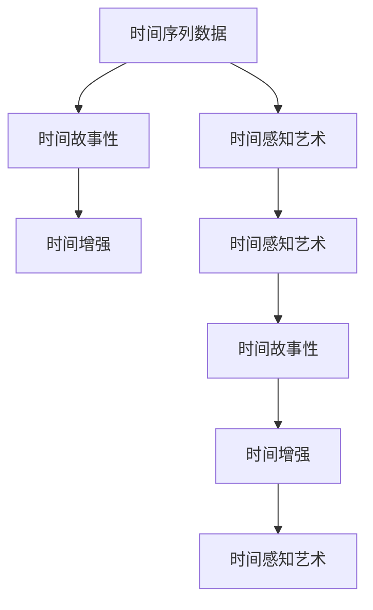

                 

## 1. 背景介绍

### 1.1 问题由来

在数字化时代，我们面临着海量数据和不断进化的技术。人工智能（AI），特别是机器学习和深度学习，已经从科幻变成现实，并正在重塑我们的世界。然而，即使如此，AI在某些领域依然存在瓶颈，比如对时间感知的处理。AI创作艺术是近年来AI领域的一个重要研究点，但在时间感知方面，依然缺乏对“时间”本身的深度理解与创作。

### 1.2 问题核心关键点

时间感知（Temporal Perception）是指AI对时间流逝、事件发展序列、时间变化对环境或行为的影响等方面的理解与表达。当前，AI在时间感知方面的表现通常是通过时间序列数据的学习和处理来实现，比如股票预测、天气预报等。但时间感知艺术不仅仅是这些，它更多地涉及时间与情感、时间与故事、时间与空间等多维度的交融与表现。

时间感知艺术在AI创作中的应用，目前主要体现在两个方向：一是通过时间序列数据的处理，生成符合时间规律的艺术作品；二是通过时间感知的增强，生成具有时间故事性的艺术作品。本文将探讨后者，即如何利用AI技术，赋予作品更深层次的时间感知，从而创作出具有时间故事性的艺术作品。

## 2. 核心概念与联系

### 2.1 核心概念概述

为更好地理解时间感知艺术，首先需要明确几个核心概念：

- **时间序列数据（Time Series Data）**：指按照时间顺序排列的数据，常用于预测未来趋势。
- **时间感知艺术（Temporal Art）**：通过AI创作，表达时间流逝、事件发展、故事叙述等元素的艺术作品。
- **时间故事性（Temporal Narrative）**：指艺术作品具有明确的时间线索和事件发展脉络，能够引起观众共鸣和情感共振。
- **时间增强（Temporal Enhancement）**：利用AI技术，增强艺术作品的时间感知，使其具有更强的叙述力和情感表达。

这些概念之间的逻辑关系可以通过以下Mermaid流程图来展示：



这个流程图展示了时间感知艺术的核心概念及其相互关系：

1. 时间序列数据是时间感知艺术的基础。
2. 时间故事性是时间感知艺术的重要组成部分，需通过时间增强技术实现。
3. 时间增强技术通过对时间序列数据的处理，使艺术作品更具有时间感知的叙述力。

## 3. 核心算法原理 & 具体操作步骤

### 3.1 算法原理概述

时间感知艺术的核心算法原理基于深度学习模型，特别是序列模型（如RNN、LSTM、GRU等）和注意力机制（Attention Mechanism）。其主要目标是通过对时间序列数据的处理，生成符合时间规律的艺术作品，并赋予其时间故事性。

核心步骤包括：
1. **数据预处理**：将时间序列数据转换为模型可接受的格式，通常包括数据清洗、归一化等操作。
2. **模型构建**：选择合适的深度学习模型，如LSTM、GRU等，并设计输入层、隐藏层、输出层等结构。
3. **模型训练**：使用训练集对模型进行有监督学习，调整模型参数，使其能对新数据进行预测。
4. **生成艺术作品**：通过测试集对模型进行评估，根据评价指标进行优化调整，生成符合时间感知要求的作品。

### 3.2 算法步骤详解

以下是具体的时间感知艺术创作算法步骤：

**Step 1: 数据预处理**
- 时间序列数据采集：通过传感器、日志、历史记录等渠道采集时间序列数据。
- 数据清洗：去除噪声、处理缺失值等。
- 数据归一化：将数据缩放到[0,1]或[-1,1]之间，方便模型处理。

**Step 2: 模型构建**
- 输入层设计：将时间序列数据转换为固定长度的向量，如通过滑动窗口、随机采样等方法。
- 隐藏层设计：选择合适的网络结构，如LSTM、GRU等，设置合适的隐藏单元数量和激活函数。
- 输出层设计：根据创作任务，设计输出层结构，如分类输出、回归输出等。

**Step 3: 模型训练**
- 损失函数设计：选择合适的损失函数，如均方误差、交叉熵等，以衡量模型预测与真实值之间的差异。
- 优化器选择：选择适合的优化器，如Adam、SGD等，设置学习率和迭代轮数。
- 正则化技术：应用正则化技术，如L2正则、Dropout等，防止过拟合。
- 模型评估：在验证集上评估模型性能，根据评估结果调整模型参数。

**Step 4: 生成艺术作品**
- 作品创作：将测试集输入模型，生成艺术作品。
- 作品优化：根据评价指标进行优化调整，生成更符合时间故事性的作品。

### 3.3 算法优缺点

时间感知艺术创作算法具有以下优点：
1. **灵活性高**：适用于各种时间序列数据，如股票、天气、音频、视频等。
2. **生成效率高**：通过深度学习模型，可以快速生成具有时间故事性的艺术作品。
3. **多维度输出**：不仅限于时间序列数据的预测，还可以生成具有复杂情感和时间叙述的艺术作品。

同时，该算法也存在以下缺点：
1. **数据需求大**：需要大量的时间序列数据进行训练，数据采集和处理成本较高。
2. **模型复杂度高**：深度学习模型复杂，需要较长的训练时间和较高的计算资源。
3. **解释性差**：模型训练过程“黑盒化”，难以解释模型的内部决策逻辑。
4. **泛化能力有限**：模型可能对新数据泛化能力有限，需要不断调整和优化。

尽管存在这些局限性，但就目前而言，时间感知艺术创作算法仍是最主流的方法。未来相关研究的重点在于如何进一步降低算法对数据和计算资源的需求，提高模型的泛化能力和可解释性。

### 3.4 算法应用领域

时间感知艺术创作算法已经在多个领域得到应用，例如：

- **音乐创作**：通过分析音乐节奏和旋律，生成符合时间序列规律的新音乐作品。
- **视频编辑**：对视频中的时间序列数据进行处理，生成具有时间故事性的视频剪辑。
- **文学创作**：根据故事发展的情节，生成符合时间逻辑的文学作品。
- **绘画创作**：利用时间序列数据，生成具有时间演变特征的绘画作品。

除了上述这些经典应用外，时间感知艺术创作算法还被创新性地应用到更多场景中，如交互式艺术、沉浸式展览等，为艺术创作带来了全新的突破。

## 4. 数学模型和公式 & 详细讲解 & 举例说明

### 4.1 数学模型构建

时间感知艺术创作的核心数学模型基于时间序列数据的处理。假设时间序列数据为 $x_t$，其中 $t$ 表示时间，$x_t \in \mathbb{R}^n$ 为时间序列数据向量。

定义时间感知艺术创作模型为 $M$，其结构如图1所示：

```
    Input Layer
    |
    v
  [Input Layer] --> [LSTM/LSTM Layer] --> [Output Layer]
    |
    v
  [Output Layer]
```

其中，输入层将时间序列数据转换为模型可接受的格式；LSTM层用于捕捉时间序列中的时序依赖关系；输出层根据创作任务设计，如分类输出、回归输出等。

### 4.2 公式推导过程

以音乐创作为例，假设目标任务是生成一段新的音乐片段。音乐片段的音高、节奏、旋律等特性可以通过时间序列数据 $x_t$ 表示，即：

$$
x_t = \{x_t^1, x_t^2, ..., x_t^n\}
$$

其中 $x_t^i$ 表示时间 $t$ 对应的音乐特性向量，如音高、节奏等。

音乐创作模型 $M$ 的输入为 $x_t$，输出为新的音乐片段 $y_t$。根据创作任务的不同，输出层可能为分类输出或回归输出。以回归输出为例，目标函数为均方误差（MSE），其公式如下：

$$
\mathcal{L} = \frac{1}{N} \sum_{t=1}^N (y_t - \hat{y}_t)^2
$$

其中，$y_t$ 为真实音乐片段，$\hat{y}_t$ 为模型生成的音乐片段。

根据均方误差，优化目标是：

$$
\theta^* = \mathop{\arg\min}_{\theta} \mathcal{L}(M_{\theta}(x_t),y_t)
$$

其中 $\theta$ 为模型参数，包括LSTM层的权重和偏置等。

### 4.3 案例分析与讲解

以生成一段新音乐片段为例，具体步骤如下：

**Step 1: 数据预处理**
- 采集一段原始音乐片段，如钢琴曲。
- 对音乐片段进行特征提取，如音高、节奏、旋律等。
- 将音乐片段转换为时间序列数据 $x_t$。

**Step 2: 模型构建**
- 选择LSTM作为时间感知模型，设置隐藏层大小为64。
- 设计输入层和输出层，输入层为时间序列数据的归一化处理，输出层为音乐片段的生成。

**Step 3: 模型训练**
- 选择Adam优化器，设置学习率为0.001。
- 设计损失函数为均方误差，设置迭代轮数为1000。
- 在训练集上训练模型，评估模型性能，调整模型参数。

**Step 4: 生成艺术作品**
- 将测试集输入模型，生成新的音乐片段。
- 根据评价指标（如清晰度、旋律性等），优化调整模型参数。
- 生成具有时间故事性的音乐作品。

## 5. 项目实践：代码实例和详细解释说明

### 5.1 开发环境搭建

在进行时间感知艺术创作项目实践前，需要准备好开发环境。以下是使用Python进行TensorFlow开发的环境配置流程：

1. 安装Anaconda：从官网下载并安装Anaconda，用于创建独立的Python环境。
2. 创建并激活虚拟环境：
```bash
conda create -n tf-env python=3.8 
conda activate tf-env
```

3. 安装TensorFlow：根据CUDA版本，从官网获取对应的安装命令。例如：
```bash
conda install tensorflow -c tensorflow -c conda-forge
```

4. 安装各类工具包：
```bash
pip install numpy pandas scikit-learn matplotlib tqdm jupyter notebook ipython
```

完成上述步骤后，即可在`tf-env`环境中开始项目实践。

### 5.2 源代码详细实现

下面以音乐创作项目为例，给出使用TensorFlow进行LSTM模型训练的PyTorch代码实现。

首先，定义音乐创作的数据处理函数：

```python
import tensorflow as tf
from tensorflow.keras.layers import Input, LSTM, Dense
from tensorflow.keras.models import Model

class MusicGenerator(tf.keras.Model):
    def __init__(self, input_dim, hidden_dim, output_dim):
        super(MusicGenerator, self).__init__()
        self.input_dim = input_dim
        self.hidden_dim = hidden_dim
        self.output_dim = output_dim
        
        self.rnn = LSTM(units=self.hidden_dim, return_sequences=True)
        self.dense = Dense(units=self.output_dim, activation='sigmoid')
        
    def call(self, inputs):
        x = self.rnn(inputs)
        x = self.dense(x)
        return x

# 定义输入数据的维度
input_dim = 3 # 假设音高、节奏、旋律等3个特征
hidden_dim = 64 # LSTM层的隐藏单元数量
output_dim = 3 # 假设音高、节奏、旋律等3个特征

# 构建LSTM模型
model = MusicGenerator(input_dim, hidden_dim, output_dim)

# 定义损失函数和优化器
model.compile(loss='mse', optimizer=tf.keras.optimizers.Adam(lr=0.001))
```

然后，定义音乐创作的数据集：

```python
# 假设已经加载了音乐数据集music_data，每个样本由三个特征组成
music_data = tf.data.Dataset.from_tensor_slices(music_data)

# 将音乐数据集进行归一化处理
music_data = music_data.map(lambda x: (x / 255.0))

# 将音乐数据集转换为固定长度的向量
music_data = music_data.map(lambda x: tf.keras.layers.LSTM(input_shape=(input_dim,), return_sequences=True))

# 定义音乐数据集的批次大小和迭代次数
batch_size = 64
epochs = 100

# 构建音乐数据集的训练集和验证集
train_data = music_data.batch(batch_size)
val_data = music_data.batch(batch_size)
```

最后，启动音乐创作模型的训练流程：

```python
# 训练音乐创作模型
model.fit(train_data, epochs=epochs, validation_data=val_data)
```

以上就是使用TensorFlow进行LSTM音乐创作模型的完整代码实现。可以看到，得益于TensorFlow的强大封装，我们可以用相对简洁的代码完成LSTM模型的训练。

### 5.3 代码解读与分析

让我们再详细解读一下关键代码的实现细节：

**MusicGenerator类**：
- `__init__`方法：初始化模型结构，包括输入、隐藏和输出层的维度。
- `call`方法：定义模型的前向传播过程，通过LSTM和Dense层将输入转换为输出。

**音乐数据集处理**：
- 通过`tf.data.Dataset`将音乐数据加载到TensorFlow数据集中。
- 对音乐数据进行归一化处理，使其值域在[0,1]之间。
- 使用LSTM层将音乐数据转换为固定长度的向量，方便模型处理。

**训练过程**：
- 使用`fit`方法训练模型，设置损失函数、优化器和迭代次数。
- 在训练集上进行多轮迭代训练，同时使用验证集评估模型性能。

## 6. 实际应用场景

### 6.1 音乐创作

时间感知艺术在音乐创作领域具有广泛的应用前景。传统音乐创作依赖于音乐家的主观经验和技巧，但时间感知艺术创作算法可以通过对音乐节奏、旋律等时间序列数据的学习，生成符合时间规律的新音乐作品。

在技术实现上，可以收集各种音乐风格和时间段的音乐片段，分析其节奏、旋律等特征，并生成新的音乐作品。例如，使用LSTM模型对不同风格的音乐片段进行处理，生成符合该风格的新音乐片段。微调模型参数，调整不同风格之间的相似度，可生成不同风格的音乐作品。

### 6.2 视频编辑

视频编辑是时间感知艺术创作的另一大应用场景。视频编辑通常需要对视频中的时间序列数据进行处理，以生成具有时间故事性的视频剪辑。

在实际应用中，可以通过对视频帧的特征提取和处理，生成新的视频片段。例如，使用LSTM模型对视频帧的特征进行编码，生成新的视频片段。通过调整LSTM模型的参数，可以实现不同风格的视频剪辑生成，如快速剪辑、慢动作等。

### 6.3 文学创作

文学创作同样涉及时间感知的表达。通过时间感知艺术创作算法，可以生成具有时间故事性的文学作品。例如，利用LSTM模型对历史事件、人物经历等时间序列数据进行处理，生成符合时间故事性的文学作品。

在文学创作中，LSTM模型可以学习事件发展的时间线索，生成具有时间叙述力的故事。例如，通过分析历史事件的时间发展脉络，生成符合历史时间线的文学作品。

### 6.4 未来应用展望

随着时间感知艺术创作算法的不断进步，其在更多领域的应用也将不断涌现，为艺术创作带来新的可能性。

在智慧城市治理中，时间感知艺术创作算法可以用于城市事件监测、舆情分析、应急指挥等环节，提高城市管理的自动化和智能化水平，构建更安全、高效的未来城市。

在智能家居中，时间感知艺术创作算法可以用于生成与时间同步的家居环境变化，如自动调节温度、光照等，提升用户的舒适度。

## 7. 工具和资源推荐

### 7.1 学习资源推荐

为了帮助开发者系统掌握时间感知艺术创作的技术基础和实践技巧，这里推荐一些优质的学习资源：

1. **Deep Learning Specialization by Andrew Ng**：斯坦福大学开设的深度学习课程，涵盖深度学习基础和进阶内容，适合初学者和进阶者。
2. **Sequence Models in NLP**：NLP领域的序列模型讲解，包括RNN、LSTM、GRU等，适合研究者深入理解序列模型的工作原理。
3. **Deep Learning for Time Series Forecasting**：讲解深度学习在时间序列预测中的应用，适合初学者了解时间序列预测的基本流程和方法。
4. **Music AI with TensorFlow**：TensorFlow官方提供的音乐创作教程，适合使用TensorFlow进行音乐创作的开发者。
5. **Artificial Intelligence for Music and Audio**：讲解AI在音乐和音频领域的应用，适合对时间感知艺术创作感兴趣的开发者。

通过这些资源的学习实践，相信你一定能够快速掌握时间感知艺术创作的技术基础，并用于解决实际的创作问题。

### 7.2 开发工具推荐

高效的时间感知艺术创作开发离不开优秀的工具支持。以下是几款常用的开发工具：

1. **TensorFlow**：由Google主导开发的开源深度学习框架，生产部署方便，适合大规模工程应用。
2. **PyTorch**：基于Python的开源深度学习框架，灵活动态的计算图，适合快速迭代研究。
3. **Keras**：高层次的深度学习API，支持多种后端，方便快速搭建模型。
4. **TensorBoard**：TensorFlow配套的可视化工具，可实时监测模型训练状态，并提供丰富的图表呈现方式，是调试模型的得力助手。

合理利用这些工具，可以显著提升时间感知艺术创作项目的开发效率，加快创新迭代的步伐。

### 7.3 相关论文推荐

时间感知艺术创作技术的发展源于学界的持续研究。以下是几篇奠基性的相关论文，推荐阅读：

1. **Music Generation with Recurrent Neural Networks**：提出使用RNN模型进行音乐生成的方法，为音乐创作算法奠定基础。
2. **Generative Adversarial Networks for Music and Audio**：引入GAN技术，生成音乐和音频数据，进一步提升音乐创作的效果。
3. **LSTM-Based Text Generation for Literature Translation**：提出使用LSTM模型进行文学作品生成的方法，为文学创作算法提供借鉴。
4. **Audio-Visual Temporal Generation with Stacked Attentional RNNs**：结合音频和视觉数据，进行多模态时间序列生成，拓展时间感知艺术创作的维度。

这些论文代表了大语言模型微调技术的发展脉络。通过学习这些前沿成果，可以帮助研究者把握学科前进方向，激发更多的创新灵感。

## 8. 总结：未来发展趋势与挑战

### 8.1 总结

本文对时间感知艺术创作算法进行了全面系统的介绍。首先阐述了时间感知艺术创作的背景和意义，明确了时间感知艺术创作在艺术创作中的重要价值。其次，从原理到实践，详细讲解了时间感知艺术创作的数学原理和关键步骤，给出了时间感知艺术创作算法的完整代码实现。同时，本文还广泛探讨了时间感知艺术创作算法在音乐创作、视频编辑、文学创作等多个领域的应用前景，展示了时间感知艺术创作的巨大潜力。此外，本文精选了时间感知艺术创作算法的各类学习资源，力求为读者提供全方位的技术指引。

通过本文的系统梳理，可以看到，时间感知艺术创作算法正在成为时间序列数据分析与处理的重要工具，极大地拓展了艺术创作的表达方式。得益于深度学习模型的强大能力，时间感知艺术创作算法能够更好地理解时间序列数据的内在规律，生成具有时间故事性的艺术作品。未来，伴随时间感知艺术创作算法的不断演进，相信时间感知艺术创作将带来更多的可能性和应用场景，为艺术创作领域注入新的活力。

### 8.2 未来发展趋势

展望未来，时间感知艺术创作算法将呈现以下几个发展趋势：

1. **多模态融合**：除了时间序列数据的处理，未来将进一步引入图像、视频等多模态数据，实现更加全面、立体的时间感知创作。
2. **增强学习**：结合强化学习算法，训练时间感知艺术创作模型，使其能够自动优化创作过程，提升创作质量。
3. **跨领域应用**：时间感知艺术创作算法将不仅仅局限于音乐、视频等领域，还将拓展到文学、影视等领域，为不同领域的创作提供新的思路。
4. **交互式创作**：开发交互式时间感知艺术创作工具，使用户能够实时参与创作过程，提升创作体验。
5. **个性化创作**：结合用户画像和偏好，进行个性化的时间感知艺术创作，提升用户的创作满意度。

以上趋势凸显了时间感知艺术创作算法的广阔前景。这些方向的探索发展，必将进一步提升时间感知艺术创作的技术水平和应用范围，为艺术创作带来更多的创新和突破。

### 8.3 面临的挑战

尽管时间感知艺术创作算法已经取得了瞩目成就，但在迈向更加智能化、普适化应用的过程中，它仍面临着诸多挑战：

1. **数据需求大**：需要大量的时间序列数据进行训练，数据采集和处理成本较高。
2. **模型复杂度高**：深度学习模型复杂，需要较长的训练时间和较高的计算资源。
3. **解释性差**：模型训练过程“黑盒化”，难以解释模型的内部决策逻辑。
4. **泛化能力有限**：模型可能对新数据泛化能力有限，需要不断调整和优化。
5. **版权问题**：生成的作品可能涉及版权问题，需要明确版权归属和使用限制。

尽管存在这些挑战，但未来的研究仍需继续在数据采集、模型优化、版权保护等方面进行深入探索，以进一步推动时间感知艺术创作的进步和发展。

### 8.4 研究展望

面对时间感知艺术创作算法面临的挑战，未来的研究需要在以下几个方面寻求新的突破：

1. **数据高效获取**：通过数据增强、数据标注自动化等技术，降低数据需求，提高数据采集效率。
2. **模型轻量化**：开发轻量化的时间感知艺术创作模型，降低计算资源消耗，提升模型部署效率。
3. **可解释性提升**：结合可解释AI技术，提升模型的可解释性，帮助用户理解创作过程。
4. **版权保护机制**：研究时间感知艺术创作的版权保护机制，确保创作成果的合法权益。
5. **多模态数据融合**：结合图像、视频等多模态数据，提升创作成果的立体感和丰富度。

这些研究方向的探索，必将引领时间感知艺术创作算法走向更高的台阶，为艺术创作带来更加多样化和智能化的创作手段。面向未来，时间感知艺术创作算法还需要与其他AI技术进行更深入的融合，如自然语言处理、计算机视觉等，多路径协同发力，共同推动时间感知艺术创作的发展。只有勇于创新、敢于突破，才能不断拓展时间感知艺术创作的边界，让时间感知艺术创作成为未来艺术创作的重要组成部分。

## 9. 附录：常见问题与解答

**Q1：时间感知艺术创作算法适用于所有时间序列数据吗？**

A: 时间感知艺术创作算法适用于大部分时间序列数据，如音乐、视频、文本等。但对于某些特殊领域，如金融数据、气象数据等，可能需要针对数据特性进行特殊处理和调整。

**Q2：如何选择合适的时间序列数据处理模型？**

A: 选择合适的时间序列数据处理模型主要取决于数据特性和创作目标。对于时间间隔较短、数据量较大的时间序列数据，如音乐节奏、股票价格等，LSTM模型是一个较好的选择。对于时间间隔较长、数据量较小的时间序列数据，如天气变化、历史事件等，RNN或GRU模型可能更合适。

**Q3：时间感知艺术创作算法的训练成本高吗？**

A: 时间感知艺术创作算法的训练成本相对较高，主要在于需要大量的时间序列数据进行训练，数据采集和处理成本较大。但随着数据增强、自动化标注等技术的发展，训练成本正在逐步降低。

**Q4：时间感知艺术创作算法生成的作品是否具有版权问题？**

A: 生成的作品是否具有版权问题需要具体分析。时间感知艺术创作算法是基于已有数据进行创作的，需要明确数据来源和使用限制，以避免侵犯版权。

通过这些资源的学习实践，相信你一定能够快速掌握时间感知艺术创作的技术基础，并用于解决实际的创作问题。

---

作者：禅与计算机程序设计艺术 / Zen and the Art of Computer Programming

