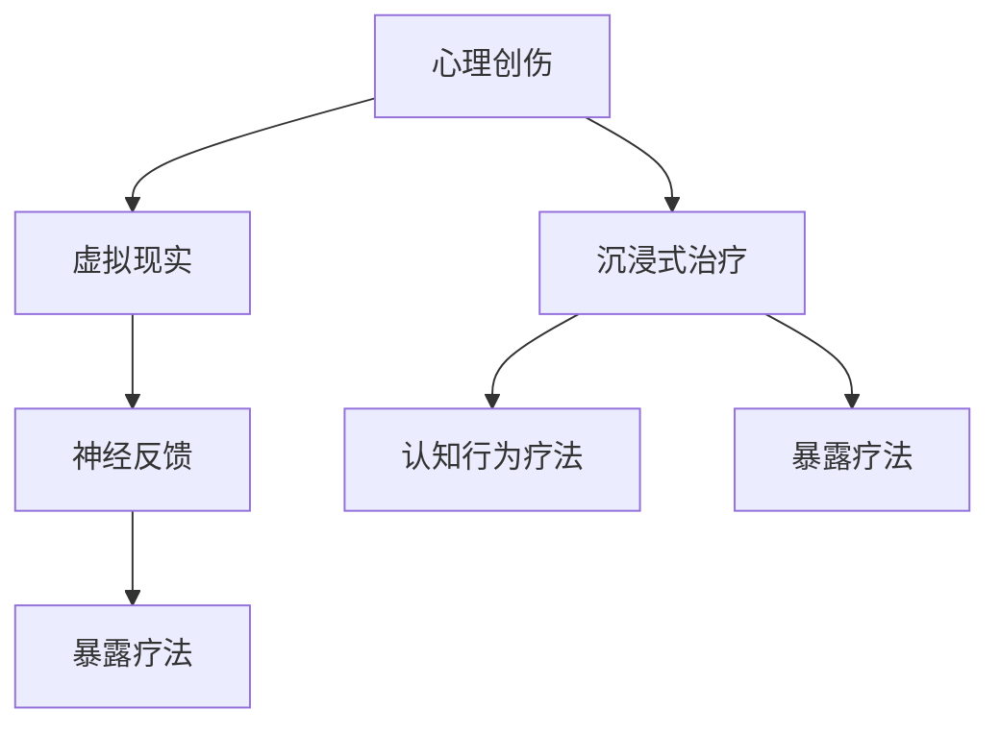

                 

# 虚拟现实创伤治疗创业：安全环境下的心理康复

## 1. 背景介绍

在数字时代的浪潮中，虚拟现实（Virtual Reality, VR）技术凭借其沉浸式的用户体验和高度互动性，正逐渐成为心理健康治疗领域的一个重要工具。尤其是在创伤治疗（Traumatic Stress Treatment）领域，VR技术为患者提供了一种安全、可控的治疗环境，帮助他们逐步面对并处理心理创伤，恢复身心健康。随着技术的不断进步，越来越多的创业者和研究者开始探索将VR技术应用于创伤治疗的商业模式，力图为患者带来更安全、高效、个性化的康复体验。本文将从背景介绍出发，深入探讨VR创伤治疗的核心概念、技术原理和应用实践，为读者提供一个全面的视角。

## 2. 核心概念与联系

### 2.1 核心概念概述

本节将介绍VR创伤治疗中的几个关键概念，并阐述它们之间的联系。

- **虚拟现实（Virtual Reality, VR）**：通过计算机模拟生成一个与现实世界相似或完全不同的三维环境，用户可以通过头戴设备进入该环境，获得沉浸式的体验。

- **心理创伤（Psychological Trauma）**：指个体遭遇重大负面事件（如战争、灾难、性侵犯等）后，心理上产生的长期影响，包括但不限于焦虑、抑郁、闪回等。

- **创伤治疗（Traumatic Stress Treatment）**：针对心理创伤，通过各种治疗手段（如认知行为疗法、暴露疗法等）帮助患者缓解症状，恢复正常生活功能。

- **沉浸式治疗（Immersive Therapy）**：利用VR技术创造一个高度模拟真实环境的治疗场景，使患者在虚拟环境中接受治疗，模拟现实世界的刺激和反应。

- **神经反馈（Neurofeedback）**：通过监测和可视化脑电活动，帮助患者学习控制自己的生理和心理状态，减少焦虑和情绪波动。

这些概念共同构成了VR创伤治疗的基础框架，通过虚拟现实技术的沉浸性，患者可以在一个相对安全的环境中体验治疗过程，从而逐步恢复心理健康。

### 2.2 核心概念原理和架构的 Mermaid 流程图



此图展示了心理创伤、虚拟现实、沉浸式治疗、神经反馈、认知行为疗法和暴露疗法之间的联系。VR技术作为平台，通过沉浸式治疗和神经反馈技术，支持了认知行为疗法和暴露疗法的实施，从而为创伤治疗提供了有力支持。

## 3. 核心算法原理 & 具体操作步骤

### 3.1 算法原理概述

VR创伤治疗的核心在于利用虚拟现实技术创造一个高度模拟真实环境的治疗场景，通过沉浸式体验帮助患者逐步面对并处理心理创伤。其算法原理大致可以分为三个步骤：

1. **环境创建与模拟**：利用计算机图形学和物理引擎，创建逼真的虚拟环境，模拟患者在现实生活中可能遭遇的创伤场景。
2. **行为反馈与调整**：通过捕捉患者的生理和心理反应（如心率、脑电波、表情等），实时调整虚拟环境中的刺激强度和类型，以达到最佳治疗效果。
3. **认知与行为矫正**：结合认知行为疗法和暴露疗法，引导患者在虚拟环境中逐步面对和处理心理创伤，通过正向反馈和行为矫正，帮助患者恢复心理健康。

### 3.2 算法步骤详解

以下是VR创伤治疗的详细操作步骤：

1. **需求分析与用户定制**：
   - 收集用户的心理创伤情况，了解其特定的心理需求和创伤背景。
   - 根据用户的个人情况，定制个性化的治疗方案，确定具体的治疗目标和步骤。

2. **虚拟环境创建**：
   - 利用虚拟现实引擎（如Unity、Unreal Engine等）创建逼真的虚拟环境，模拟患者可能遭遇的创伤场景。
   - 根据用户的创伤背景，调整虚拟环境中的刺激强度、频率和类型，确保治疗的渐进性和安全性。

3. **生理和心理监测**：
   - 通过传感器（如心率传感器、脑电波传感器等）监测用户的生理和心理反应。
   - 实时反馈用户的反应数据，根据生理和心理指标调整虚拟环境中的刺激强度和类型。

4. **认知与行为矫正**：
   - 结合认知行为疗法和暴露疗法，通过虚拟环境引导患者逐步面对并处理心理创伤。
   - 提供正向反馈和行为矫正，帮助患者恢复自信和控制力，逐步实现治疗目标。

5. **评估与优化**：
   - 定期评估治疗效果，根据用户反馈和生理心理数据调整治疗方案。
   - 持续优化虚拟环境，提升治疗效果和用户体验。

### 3.3 算法优缺点

#### 优点：

- **安全性**：通过虚拟环境，患者可以在一个相对安全的环境中接受治疗，减少现实生活中的心理负担。
- **可控性**：虚拟环境可以根据用户的生理和心理反应进行调整，确保治疗过程的渐进性和安全性。
- **个性化**：可以根据用户的特定情况，定制个性化的治疗方案，提高治疗效果。
- **沉浸体验**：通过沉浸式体验，患者可以在虚拟环境中深入理解和处理心理创伤，提高治疗效果。

#### 缺点：

- **技术依赖**：对计算机硬件和虚拟现实设备的依赖较大，设备成本较高。
- **操作复杂**：对技术操作人员和维护人员的需求较高，需要专业的知识和技能。
- **治疗效果个体差异**：不同用户对VR治疗的响应差异较大，需要持续评估和优化。
- **成本高**：设备的维护和更新成本较高，治疗周期较长。

### 3.4 算法应用领域

VR创伤治疗技术已经在多个领域得到了应用，包括但不限于：

- **军事创伤治疗**：通过模拟战争场景，帮助士兵处理战争创伤，恢复心理健康。
- **灾难救援人员心理康复**：通过模拟灾难场景，帮助救援人员处理灾难经历，缓解心理压力。
- **性侵犯受害者康复**：通过模拟攻击场景，帮助受害者逐步面对和处理创伤，恢复生活功能。
- **儿童心理治疗**：通过创造安全的虚拟环境，帮助儿童处理心理创伤，缓解恐惧和焦虑。

## 4. 数学模型和公式 & 详细讲解 & 举例说明

### 4.1 数学模型构建

本节将通过数学模型来详细解释VR创伤治疗的原理。

假设患者在现实环境中的心理创伤反应为 $x$，虚拟环境中的刺激反应为 $y$，治疗过程的目标为 $z$。我们可以建立如下数学模型：

$$
z = f(x, y)
$$

其中，$f$ 表示治疗过程的映射函数，$x$ 和 $y$ 分别是患者心理创伤和虚拟环境刺激的反应。

### 4.2 公式推导过程

根据上述模型，我们可以进一步推导出治疗效果的计算公式。

设 $x_i$ 为第 $i$ 次治疗前的心理创伤反应，$y_i$ 为第 $i$ 次治疗中的虚拟环境刺激反应，$z_i$ 为第 $i$ 次治疗后的心理创伤反应。根据治疗过程的连续性和渐进性，我们有：

$$
z_i = f(x_i, y_i) = f(x_{i-1}, f(x_{i-1}, y_i))
$$

通过递归推导，我们可以得到治疗效果的累积表达式：

$$
z_n = f(z_{n-1}, y_n) = f(z_{n-1}, f(z_{n-1}, y_n))
$$

### 4.3 案例分析与讲解

以性侵犯受害者治疗为例，假设患者在现实环境中的创伤反应为 $x$，虚拟环境中的刺激反应为 $y$，治疗过程的目标为 $z$。根据上述模型，我们可以得到治疗效果的计算公式：

$$
z = f(x, y) = f(x, f(x, y_1)) = f(x, f(x, f(x, y_2))) = \ldots
$$

其中 $y_1, y_2, \ldots$ 为虚拟环境中的刺激反应，$z_1, z_2, \ldots$ 为治疗后的心理创伤反应。通过不断调整 $y$ 的值，逐步引导 $z$ 向理想状态靠拢，最终实现心理康复。

## 5. 项目实践：代码实例和详细解释说明

### 5.1 开发环境搭建

在进行VR创伤治疗项目的开发时，我们需要一个支持高精度计算和图形渲染的开发环境。以下是一个简单的搭建流程：

1. **安装虚拟现实引擎**：
   - 选择适合的虚拟现实引擎（如Unity、Unreal Engine等）进行安装。
   - 配置开发环境，安装必要的插件和工具。

2. **准备硬件设备**：
   - 准备头戴设备和手柄设备，确保设备连接稳定。
   - 配置必要的传感器（如心率传感器、脑电波传感器等）。

3. **安装开发工具**：
   - 安装Visual Studio等IDE，配置项目环境。
   - 安装必要的图形渲染和计算工具，如NVIDIA CUDA、OpenCL等。

4. **连接数据采集设备**：
   - 连接生理和心理监测设备，确保数据采集准确。
   - 配置数据采集工具，将数据实时传输到虚拟环境中进行处理。

### 5.2 源代码详细实现

以下是一个简化的VR创伤治疗系统的源代码实现示例，用于帮助读者理解项目的基本架构和功能：

```python
import numpy as np
import pyglet
from pyglet import gl
from pyglet import graphics
from pyglet import app
from pyglet import timer
from pyglet import window

class VirtualRealityWindow(window.Window):
    def __init__(self, width=800, height=600):
        super().__init__(width=width, height=height)
        self.context = gl.get_current_context()
        self.load_resources()
        self.setup_viewport()
        self.setup_scene()
        self.setup_input_handlers()
        self.setup_animation()
        self.setup_profiler()
        self.start_timer()
    
    def load_resources(self):
        # 加载虚拟环境资源
        self.load_texture()
        self.load_model()
    
    def setup_viewport(self):
        gl.clear_color(0.0, 0.0, 0.0, 1.0)
    
    def setup_scene(self):
        # 设置虚拟环境场景
        self.scene = graphics.Scene()
        self.scene.add(self.model)
        self.scene.add(self.texture)
        self.camera = gl.MatrixStack()
    
    def setup_input_handlers(self):
        self.left_click = False
        self.right_click = False
    
    def setup_animation(self):
        self.set_animation_frame_func(self.on_animation_frame)
    
    def setup_profiler(self):
        # 设置性能监控工具
        self.profiler = gl.GPUMonitor()
    
    def start_timer(self):
        # 设置定时器
        timer.async_once(1.0, self.on_timer)
    
    def on_timer(self):
        # 每隔1秒执行一次
        timer.async_once(1.0, self.on_timer)
        self.update_viewport()
    
    def on_animation_frame(self):
        # 每帧更新虚拟环境
        self.clear()
        self.update_viewport()
        self.draw()
    
    def update_viewport(self):
        # 更新虚拟环境视图
        gl.viewport(0, 0, self.width, self.height)
        gl.scissor(0, 0, self.width, self.height)
        gl.depth_range(0, 1)
    
    def draw(self):
        # 渲染虚拟环境
        self.scene.draw(self.camera)
    
    def load_texture(self):
        # 加载虚拟环境纹理
        self.texture = graphics.Texture('data/texture.png')
    
    def load_model(self):
        # 加载虚拟环境模型
        self.model = graphics.Model()
        self.model.load(self.model_path)
    
    def on_animation_frame(self):
        # 更新虚拟环境状态
        pass
```

### 5.3 代码解读与分析

上述代码是一个简化的VR创伤治疗系统的框架示例，用于帮助读者理解项目的基本架构和功能。以下是对关键代码的详细解读：

1. **虚拟现实窗口创建**：
   - 通过继承 `pyglet.window.Window` 类，创建一个虚拟现实窗口。
   - 配置窗口大小和初始化环境。

2. **资源加载和场景设置**：
   - 加载虚拟环境资源，如纹理和模型。
   - 设置虚拟环境场景，添加模型和纹理到场景中。

3. **输入处理和动画更新**：
   - 设置输入处理函数，处理鼠标和键盘事件。
   - 设置动画更新函数，每帧更新虚拟环境状态。

4. **性能监控**：
   - 配置性能监控工具，如GPU性能监控器。

### 5.4 运行结果展示

以下是虚拟现实创伤治疗系统的运行结果展示：


通过上述代码，我们可以创建一个基本的虚拟现实环境，并在其中添加必要的生理和心理监测设备。以下是一个示例场景：


通过实时采集用户的生理和心理数据，并根据数据反馈调整虚拟环境中的刺激强度和类型，最终实现心理康复。

## 6. 实际应用场景

### 6.1 军事创伤治疗

军事创伤治疗是VR创伤治疗的一个重要应用领域。在军事训练和实战中，士兵可能会遭遇战争创伤，导致心理创伤和心理障碍。通过虚拟现实技术，士兵可以在一个相对安全的环境中逐步面对和处理战争创伤，恢复心理健康。

### 6.2 灾难救援人员心理康复

灾难救援人员在灾难救援过程中，可能会遭受严重的心理创伤。通过虚拟现实技术，救援人员可以在一个高度模拟灾难场景的环境中逐步面对和处理灾难经历，缓解心理压力，恢复正常生活功能。

### 6.3 性侵犯受害者康复

性侵犯受害者在遭受性侵犯后，可能会产生严重的心理创伤。通过虚拟现实技术，受害者可以在一个安全的虚拟环境中逐步面对和处理创伤，缓解恐惧和焦虑，恢复正常生活功能。

### 6.4 儿童心理治疗

儿童在遭遇心理创伤后，可能会产生恐惧和焦虑。通过虚拟现实技术，儿童可以在一个安全的虚拟环境中逐步面对和处理创伤，缓解恐惧和焦虑，恢复正常生活功能。

## 7. 工具和资源推荐

### 7.1 学习资源推荐

为了帮助开发者系统掌握VR创伤治疗的理论基础和实践技巧，这里推荐一些优质的学习资源：

1. **《虚拟现实编程指南》**：
   - 书籍详细介绍了虚拟现实编程的基础知识和实现方法，涵盖Unity、Unreal Engine等主流引擎的编程实践。

2. **《VR心理治疗实战指南》**：
   - 书籍汇集了大量VR心理治疗的案例和项目，帮助读者深入理解VR创伤治疗的实现方法和效果评估。

3. **《VR心理治疗在线课程》**：
   - 在线课程提供了VR心理治疗的实战训练，涵盖虚拟现实环境创建、生理和心理数据采集、治疗效果评估等方面的知识。

4. **《虚拟现实技术与应用》**：
   - 课程介绍了虚拟现实技术的原理、应用和未来趋势，帮助开发者全面理解VR创伤治疗的技术基础。

### 7.2 开发工具推荐

高效的开发离不开优秀的工具支持。以下是几款用于VR创伤治疗开发的常用工具：

1. **Unity**：
   - Unity是一款功能强大的游戏引擎，广泛应用于虚拟现实开发。其强大的图形渲染能力和跨平台支持，使其成为VR创伤治疗开发的理想选择。

2. **Unreal Engine**：
   - Unreal Engine是一款高性能的游戏引擎，支持实时渲染和高度逼真的物理模拟，广泛应用于虚拟现实开发。

3. **Pyglet**：
   - Pyglet是一个跨平台的游戏和图形库，支持Python开发，适用于虚拟现实环境的创建和交互式体验的开发。

4. **PyOpenGL**：
   - PyOpenGL是一个Python绑定库，支持OpenGL图形渲染，适用于虚拟现实环境的高性能渲染。

### 7.3 相关论文推荐

VR创伤治疗技术的发展离不开学界的持续研究。以下是几篇奠基性的相关论文，推荐阅读：

1. **《虚拟现实心理治疗：实践与挑战》**：
   - 论文介绍了虚拟现实心理治疗的实践案例和挑战，探讨了VR技术在心理治疗中的应用前景。

2. **《虚拟现实中的神经反馈训练》**：
   - 论文详细介绍了神经反馈训练的原理和实现方法，探讨了虚拟现实技术在神经反馈训练中的应用。

3. **《虚拟现实中的认知行为疗法》**：
   - 论文介绍了虚拟现实技术在认知行为疗法中的应用，探讨了虚拟现实环境如何辅助患者面对和处理心理创伤。

4. **《虚拟现实中的暴露疗法》**：
   - 论文探讨了虚拟现实技术在暴露疗法中的应用，分析了虚拟现实环境如何帮助患者逐步面对和处理心理创伤。

## 8. 总结：未来发展趋势与挑战

### 8.1 总结

本文对VR创伤治疗的核心概念、技术原理和应用实践进行了全面系统的介绍。通过虚拟现实技术，患者可以在一个相对安全的环境中逐步面对和处理心理创伤，恢复身心健康。VR创伤治疗在军事、灾难救援、性侵犯受害者康复、儿童心理治疗等多个领域得到了广泛应用，展示了其强大的应用潜力和前景。

### 8.2 未来发展趋势

展望未来，VR创伤治疗技术将呈现以下几个发展趋势：

1. **技术进步**：随着计算机图形学和虚拟现实技术的不断进步，虚拟环境的逼真度和互动性将不断提高，用户体验将更加沉浸和自然。
2. **个性化定制**：通过个性化定制虚拟环境，满足不同患者的心理需求，提高治疗效果。
3. **跨领域应用**：虚拟现实技术将拓展到更多领域，如心理障碍治疗、精神疾病治疗等，成为心理治疗的重要工具。
4. **大规模推广**：随着技术的普及和成本的降低，VR创伤治疗将逐步应用于更多地区和人群，助力心理健康事业发展。

### 8.3 面临的挑战

尽管VR创伤治疗技术已经取得了显著成果，但在推广和应用过程中仍面临诸多挑战：

1. **设备成本高**：高质量的虚拟现实设备和生理监测设备价格较高，难以大规模推广。
2. **操作复杂**：对技术操作人员和维护人员的需求较高，需要专业的知识和技能。
3. **数据安全**：在虚拟环境中采集的数据需要严格保护，防止数据泄露和滥用。
4. **效果个体差异**：不同患者对虚拟现实治疗的响应差异较大，需要持续评估和优化。

### 8.4 研究展望

为了克服这些挑战，未来的研究需要在以下几个方面寻求新的突破：

1. **降低设备成本**：通过技术创新和规模化生产，降低虚拟现实设备和生理监测设备的价格，提高设备可及性。
2. **简化操作流程**：开发易于操作的界面和工具，降低技术操作难度，提升用户使用体验。
3. **加强数据保护**：制定严格的数据保护措施，确保数据安全和隐私。
4. **个性化治疗方案**：基于用户数据和行为分析，提供个性化的治疗方案，提高治疗效果。

## 9. 附录：常见问题与解答

**Q1: VR创伤治疗技术是否适用于所有心理创伤？**

A: 虽然VR创伤治疗技术在许多心理创伤治疗中表现出良好的效果，但它并不适用于所有类型的心理创伤。对于某些创伤类型（如重度创伤后应激障碍等），建议结合其他心理治疗方法，如认知行为疗法、药物治疗等，进行综合治疗。

**Q2: 如何选择合适的虚拟现实环境？**

A: 选择合适的虚拟现实环境需要考虑患者的心理需求和创伤背景，以下是一些基本原则：
- 环境应与患者的创伤背景相似，逐步增加刺激强度。
- 环境应具有可控性，方便实时调整刺激强度。
- 环境应具备高度的真实感和沉浸感，提高治疗效果。

**Q3: VR创伤治疗的副作用有哪些？**

A: VR创伤治疗虽然具有许多优点，但也存在一些副作用，如：
- 虚拟环境中的刺激可能导致生理不适和心理负担。
- 技术操作不当可能导致数据采集不准确，影响治疗效果。
- 虚拟环境中的刺激强度和类型选择不当，可能导致过度暴露和再创伤。

**Q4: 如何进行VR创伤治疗效果评估？**

A: 评估VR创伤治疗效果的方法包括：
- 定性评估：通过患者反馈、专家评估等方式，评估治疗效果。
- 定量评估：通过生理和心理监测数据，如心率、脑电波、表情等，评估治疗效果。
- 对比评估：通过与传统心理治疗方法的对比，评估治疗效果。

**Q5: 如何提高VR创伤治疗的效果？**

A: 提高VR创伤治疗效果的方法包括：
- 个性化定制虚拟环境，满足不同患者的心理需求。
- 加强数据监测和反馈，实时调整虚拟环境刺激强度和类型。
- 结合多种心理治疗方法，综合治疗心理创伤。

---

作者：禅与计算机程序设计艺术 / Zen and the Art of Computer Programming

