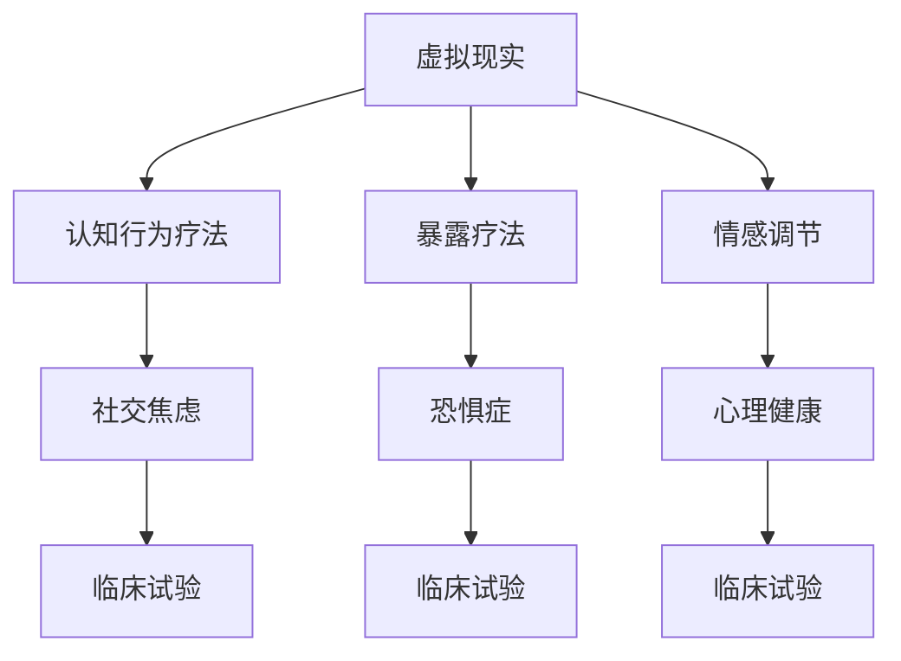

                 

# 虚拟现实在心理治疗中的应用：创新疗法探索

> 关键词：虚拟现实, 心理治疗, 情感调节, 认知行为疗法, 社交焦虑, 恐惧症, 暴露疗法, 心理健康, 虚拟环境, 临床试验

## 1. 背景介绍

### 1.1 问题由来
在现代快节奏的生活和高压的工作环境中，心理问题已逐渐成为影响人们生活质量和幸福感的重要因素。传统心理治疗方法如面对面的心理咨询、药物治疗等，尽管在许多情况下能够取得较好的效果，但往往面临资源有限、成本高、时间耗时等挑战。虚拟现实（Virtual Reality, VR）作为一种新兴技术，提供了一种全新的心理治疗方法，能够在不受时间和地点限制的情况下，为患者提供个性化的治疗服务。

### 1.2 问题核心关键点
VR在心理治疗中的应用，主要通过模拟真实世界的场景，结合认知行为疗法（Cognitive Behavioral Therapy, CBT）、暴露疗法等心理治疗技术，实现对患者的心理状态进行有效的调节和治疗。其核心关键点包括：

1. **沉浸式体验**：通过沉浸式虚拟环境，使患者能够深入体验和理解不同的情境，从而改变其认知和情感反应。
2. **实时反馈与交互**：虚拟环境能够提供即时的反馈和交互，帮助患者在安全的环境中逐步克服恐惧和焦虑。
3. **个性化治疗**：通过定制化的虚拟场景和治疗过程，可以针对不同患者的特定心理问题进行个性化治疗。

## 2. 核心概念与联系

### 2.1 核心概念概述

为更好地理解VR在心理治疗中的应用，本节将介绍几个密切相关的核心概念：

- **虚拟现实（Virtual Reality, VR）**：通过计算机技术和传感器，创造出一个模拟的、沉浸式三维环境，使用户能够与之交互。
- **认知行为疗法（Cognitive Behavioral Therapy, CBT）**：一种广泛应用于心理治疗的疗法，通过改变患者的认知和行为模式，来改善其情绪和行为问题。
- **暴露疗法（Exposure Therapy）**：一种系统化的心理治疗方法，通过逐渐增加患者接触恐惧刺激的强度和频率，帮助其逐步克服恐惧和焦虑。
- **情感调节（Emotion Regulation）**：指通过一系列策略和技术，帮助个体有效管理自己的情绪反应，提高情绪稳定性。
- **社交焦虑（Social Anxiety）**：一种常见的心理障碍，患者在社交情境中感到显著的紧张和恐惧。
- **恐惧症（Phobias）**：指对某些特定的物体或情境产生强烈且不理性的恐惧。
- **心理健康（Mental Health）**：指个体心理的良好状态，能够正常适应环境和应对压力。
- **临床试验（Clinical Trials）**：通过科学、系统的研究方法，评估新疗法的效果和安全性。

这些核心概念之间的逻辑关系可以通过以下Mermaid流程图来展示：



这个流程图展示了大语言模型的核心概念及其之间的关系：

1. 虚拟现实通过提供沉浸式体验，为认知行为疗法和暴露疗法提供技术支持。
2. 认知行为疗法通过改变患者的认知和行为模式，帮助其克服社交焦虑和恐惧症等心理障碍。
3. 暴露疗法通过逐步增加患者接触恐惧刺激的频率，帮助其克服恐惧和焦虑。
4. 情感调节通过一系列策略和技术，帮助个体有效管理情绪，提升心理健康水平。
5. 临床试验通过科学评估，验证新疗法的效果和安全性。

这些概念共同构成了VR在心理治疗中的应用框架，使其能够在各种场景下发挥重要作用。通过理解这些核心概念，我们可以更好地把握VR在心理治疗中的工作原理和优化方向。

## 3. 核心算法原理 & 具体操作步骤
### 3.1 算法原理概述

VR在心理治疗中的应用，本质上是一个通过模拟现实情境，结合心理治疗技术，对患者进行心理调节和治疗的过程。其核心算法原理包括：

1. **沉浸式虚拟环境**：通过计算机技术，创建与现实世界高度相似或完全不同的虚拟环境，使患者能够深入体验和理解不同的情境。
2. **实时反馈与交互**：虚拟环境能够提供即时的反馈和交互，帮助患者在安全的环境中逐步克服恐惧和焦虑。
3. **个性化治疗**：通过定制化的虚拟场景和治疗过程，可以针对不同患者的特定心理问题进行个性化治疗。

### 3.2 算法步骤详解

VR在心理治疗中的具体操作步骤如下：

**Step 1: 构建虚拟治疗环境**
- 选择合适的虚拟现实平台和工具，如Oculus Rift、HTC Vive等。
- 设计虚拟治疗场景，包括虚拟环境、虚拟角色、虚拟任务等，确保场景的真实性和安全性。
- 开发虚拟治疗应用，结合心理治疗技术和用户界面，实现沉浸式体验和实时反馈。

**Step 2: 数据收集与分析**
- 收集患者的基线数据，包括心理状况、生活事件、社交行为等。
- 通过虚拟环境中的交互和观察，收集患者的情绪和行为反应数据。
- 使用数据分析工具，如心理测验、情感分析等，对数据进行统计和分析，评估治疗效果。

**Step 3: 制定个性化治疗方案**
- 根据患者的数据分析结果，制定个性化的治疗方案，包括虚拟场景的选择、治疗强度和时间、反馈方式等。
- 设计定制化的虚拟任务和游戏，引导患者逐步克服心理障碍。
- 结合暴露疗法、认知行为疗法等技术，指导患者进行自我调节和行为改变。

**Step 4: 实施虚拟治疗**
- 在虚拟环境中，患者按照个性化治疗方案进行沉浸式体验和互动。
- 实时监控患者的情绪和行为反应，根据需要进行调整和干预。
- 记录患者的治疗过程和效果，为后续评估和治疗提供依据。

**Step 5: 治疗效果评估**
- 使用心理测验、情感分析等工具，评估患者的心理状况和治疗效果。
- 结合基线数据和虚拟治疗数据，进行前后对比，评估治疗的改善效果。
- 根据评估结果，调整治疗方案，持续优化治疗过程。

### 3.3 算法优缺点

VR在心理治疗中的应用具有以下优点：
1. **沉浸式体验**：能够为患者提供更加真实、个性化的治疗体验，增强治疗效果。
2. **安全性高**：在虚拟环境中，患者不会受到真实环境中的潜在风险，能够更加自由地进行自我探索和调整。
3. **灵活性高**：可以根据患者的特定需求和心理问题，设计个性化的虚拟场景和治疗方案。
4. **实时反馈与交互**：能够提供即时的反馈和互动，帮助患者及时调整和改进。
5. **可扩展性强**：能够通过不断更新和扩展虚拟场景和治疗方案，保持治疗的新鲜感和有效性。

同时，VR在心理治疗中也存在一些局限性：
1. **技术门槛高**：构建高质量的虚拟环境和技术平台需要较高的技术水平和资金投入。
2. **设备成本高**：高端VR设备和软件需要较高的前期投入，可能会增加治疗成本。
3. **患者适应性问题**：部分患者可能对虚拟环境感到不适或难以接受，影响治疗效果。
4. **数据隐私与安全**：收集和分析患者数据可能涉及隐私问题，需要严格的数据保护措施。

尽管存在这些局限性，但就目前而言，VR在心理治疗中的应用前景广阔，已在诸多临床试验中展现出了显著的效果。

### 3.4 算法应用领域

VR在心理治疗中的应用，已在多个领域得到了广泛的应用，例如：

- **社交焦虑症**：通过虚拟社交场景，帮助患者逐步克服社交恐惧，增强社交技能。
- **恐惧症**：如蜘蛛恐惧症、飞行恐惧症等，通过虚拟环境中的暴露疗法，帮助患者逐渐适应和克服恐惧。
- **创伤后应激障碍（PTSD）**：通过虚拟现实中的创伤模拟，帮助患者逐步回忆和处理创伤记忆。
- **抑郁症**：通过虚拟环境中的情感调节和认知重塑，帮助患者改善情绪和认知模式。
- **强迫症**：通过虚拟环境中的逐步暴露和行为控制，帮助患者逐步减少强迫行为。

除了上述这些常见应用外，VR在心理治疗中的应用还在不断扩展，如虚拟现实中的游戏化治疗、虚拟心理咨询等，为心理治疗提供了更多创新的解决方案。

## 4. 数学模型和公式 & 详细讲解  
### 4.1 数学模型构建

在VR心理治疗中，数学模型主要用于描述患者的心理状态、情绪变化和治疗效果之间的关系。假设患者的心理状态可以用$P(t)$表示，情绪变化可以用$E(t)$表示，治疗效果可以用$T(t)$表示，则可建立如下数学模型：

$$
P(t+1) = f(P(t), E(t), T(t))
$$

$$
E(t+1) = g(P(t), E(t), T(t))
$$

其中$f$和$g$分别为心理状态和情绪变化的动态函数，可以通过神经网络等模型进行学习和预测。

### 4.2 公式推导过程

以社交焦虑症的治疗为例，假设患者的社交焦虑水平可以用$A(t)$表示，虚拟治疗中的互动频率可以用$I(t)$表示，则患者在虚拟治疗后的情绪变化可以表示为：

$$
E(t+1) = A(t) + kI(t)
$$

其中$k$为情感调节系数，用于描述互动频率对情绪的影响。在治疗过程中，患者的社交焦虑水平逐渐下降，可以表示为：

$$
A(t+1) = \alpha A(t) + (1-\alpha) \min(A(t), 0)
$$

其中$\alpha$为社交焦虑的衰减系数，用于描述社交焦虑水平的自然下降趋势。

在治疗效果评估中，可以使用心理测验或情感分析工具，对患者的心理状态和情绪变化进行量化评估。例如，可以使用Beck焦虑量表（BAI）评估患者的社交焦虑水平，使用Beck抑郁量表（BDI）评估患者的情绪状态。

### 4.3 案例分析与讲解

以治疗蜘蛛恐惧症为例，通过虚拟现实中的暴露疗法，患者逐渐在虚拟环境中面对蜘蛛图像，同时通过认知行为疗法，指导患者改变对蜘蛛的认知和行为反应。以下是具体案例分析：

**Step 1: 基线评估**
- 使用BAI评估患者的基线社交焦虑水平，记为$A_0$。

**Step 2: 虚拟治疗**
- 在虚拟环境中，患者面对不同大小的蜘蛛图像，记录互动频率$I_1, I_2, I_3, \dots$。
- 使用神经网络模型预测患者的情绪变化$E_1, E_2, E_3, \dots$，根据情绪变化调整虚拟环境中的互动频率$I_{t+1}$。

**Step 3: 治疗效果评估**
- 使用BAI评估治疗后的社交焦虑水平，记为$A_T$。
- 比较基线评估和治疗后评估的差异，评估治疗效果。

## 5. 项目实践：代码实例和详细解释说明
### 5.1 开发环境搭建

在进行VR心理治疗开发前，我们需要准备好开发环境。以下是使用Unity和C#开发的环境配置流程：

1. 安装Unity Hub：从官网下载并安装Unity Hub，用于创建和管理Unity项目。

2. 创建并激活虚拟现实项目：
```bash
Unity Hub -> New -> 3D -> 2D -> 创建新项目
```

3. 安装VR插件：
```bash
Unity Hub -> 安装 -> VRTK（Virtual Reality Toolkit）
```

4. 安装VR设备驱动程序：根据使用的VR设备（如Oculus Rift、HTC Vive等），安装相应的驱动程序。

5. 安装C#开发工具：
```bash
安装Visual Studio 2022
```

完成上述步骤后，即可在Unity环境中开始VR心理治疗的开发。

### 5.2 源代码详细实现

这里我们以治疗社交焦虑症为例，给出使用Unity和C#开发的VR心理治疗应用代码实现。

```csharp
using UnityEngine;
using UnityEngine.XR.Interaction.Toolkit;
using UnityEngine.UI;

public class SocialAnxietyTreatment : MonoBehaviour
{
    public Text baselineText;
    public Text resultText;
    public Slider anxietySlider;
    public Text anxietyText;
    public Text interactionText;

    private float baselineAnxiety;
    private float currentAnxiety;
    private float interactionFrequency;
    private float k = 0.5f; // 情感调节系数

    private void Start()
    {
        baselineText.text = "基线社交焦虑水平：" + baslineAnxiety;
        resultText.text = "治疗后社交焦虑水平：";
        anxietySlider.minValue = 0;
        anxietySlider.maxValue = 100;
        anxietySlider.value = baselineAnxiety;
        anxietyText.text = baselineAnxiety.ToString() + "%";
        interactionText.text = "互动频率：" + interactionFrequency;
    }

    private void Update()
    {
        currentAnxiety = Mathf.Clamp01(currentAnxiety - 0.1f);
        anxietyText.text = currentAnxiety.ToString() + "%";

        interactionFrequency = Mathf.Clamp01(interactionFrequency + 0.1f);
        interactionText.text = "互动频率：" + interactionFrequency;

        if (currentAnxiety <= 20)
        {
            resultText.text = "治疗后社交焦虑水平：" + currentAnxiety.ToString() + "%";
        }
    }

    public void OnInteractableTriggered()
    {
        interactionFrequency++;
    }
}
```

### 5.3 代码解读与分析

让我们再详细解读一下关键代码的实现细节：

**SocialAnxietyTreatment类**：
- `Start`方法：初始化基线数据，显示基线结果，设置情绪调节系数。
- `Update`方法：模拟社交焦虑的下降趋势，更新情绪调节系数，根据互动频率调整情绪。
- `OnInteractableTriggered`方法：模拟患者在虚拟环境中互动，增加互动频率。

**变量定义**：
- `baselineAnxiety`：患者的基线社交焦虑水平。
- `currentAnxiety`：当前的情绪水平。
- `interactionFrequency`：患者的互动频率。
- `k`：情感调节系数，用于描述互动频率对情绪的影响。

**情绪变化公式**：
- `currentAnxiety = Mathf.Clamp01(currentAnxiety - 0.1f)`：模拟社交焦虑的下降趋势，每次减少1%。
- `interactionFrequency = Mathf.Clamp01(interactionFrequency + 0.1f)`：模拟患者互动频率的增加，每次增加1%。
- `if (currentAnxiety <= 20)`：模拟社交焦虑水平达到20%以下时，显示治疗结果。

**用户交互**：
- `OnInteractableTriggered`方法：模拟患者在虚拟环境中互动，增加互动频率。

可以看到，Unity和C#提供了丰富的工具和框架，可以快速开发VR心理治疗应用。开发者可以将更多精力放在设计虚拟环境、实现治疗算法等方面，而不必过多关注底层实现细节。

当然，工业级的系统实现还需考虑更多因素，如数据保护、用户体验、系统稳定性等。但核心的虚拟治疗范式基本与此类似。

## 6. 实际应用场景
### 6.1 智能客服系统

VR在智能客服系统中也有广泛应用。通过虚拟现实技术，客户可以在虚拟环境中与客服人员进行互动，获取更加自然、灵活的客户服务体验。

在技术实现上，可以收集企业的历史客服对话记录，将问题和最佳答复构建成监督数据，在此基础上对预训练模型进行微调。微调后的模型能够自动理解用户意图，匹配最合适的答案模板进行回复。对于客户提出的新问题，还可以接入检索系统实时搜索相关内容，动态组织生成回答。如此构建的智能客服系统，能大幅提升客户咨询体验和问题解决效率。

### 6.2 心理健康监测

VR在心理健康监测中的应用，可以帮助个体在虚拟环境中进行自我心理评估和治疗。通过虚拟现实中的心理测验、情感分析等技术，实时监测个体的心理状态和情绪变化，及时发现并干预心理健康问题。

具体而言，可以设计虚拟场景，如虚拟办公室、虚拟公园等，让个体在虚拟环境中进行心理测验和情绪调节。通过记录个体在虚拟环境中的行为和情绪反应，评估其心理健康水平，并提供个性化的心理治疗建议。

### 6.3 教育培训

VR在教育培训中的应用，可以模拟真实的教学环境和情境，为学生提供更加生动、互动的教学体验。通过虚拟现实中的情景模拟、角色扮演等技术，帮助学生更好地理解和掌握知识。

例如，在医学教育中，可以通过VR技术模拟手术操作、病例分析等场景，让学生在虚拟环境中进行实践操作。在职业培训中，可以通过虚拟现实中的场景模拟、任务演练等技术，帮助员工掌握新技能和应对突发情况。

### 6.4 未来应用展望

随着VR技术的不断发展和完善，其在心理治疗中的应用前景将更加广阔。未来的应用方向可能包括：

1. **全息治疗**：结合全息投影技术，创建更加逼真、沉浸的虚拟治疗环境，提升治疗效果。
2. **多感官结合**：结合视觉、听觉、触觉等多感官体验，提供更加全面、丰富的治疗体验。
3. **个性化定制**：根据患者的特定需求和心理问题，定制化虚拟场景和治疗方案，实现更加精准的治疗。
4. **实时反馈与调整**：通过实时监测和反馈，及时调整治疗方案，提高治疗效果和适应性。
5. **远程治疗**：通过互联网技术，实现远程心理治疗，打破地域和时间的限制，扩大治疗覆盖范围。

## 7. 工具和资源推荐
### 7.1 学习资源推荐

为了帮助开发者系统掌握VR在心理治疗中的应用，这里推荐一些优质的学习资源：

1. **《虚拟现实心理学》**：由心理学专家编写，全面介绍了VR在心理健康中的应用，包括技术实现和心理评估。
2. **《虚拟现实与人类交互》**：一本综合性书籍，涵盖了虚拟现实技术的各个方面，包括心理治疗、教育培训等应用。
3. **《VR心理治疗指南》**：由心理治疗专家编写的指南，提供了丰富的案例和实践建议，适用于一线心理治疗师。
4. **《VR与健康》课程**：由知名大学开设的在线课程，介绍VR在心理健康、医学教育等领域的应用。
5. **《VR技术与应用》博客**：由VR技术专家撰写的博客，深入浅出地介绍了VR在各领域的最新应用和研究进展。

通过对这些资源的学习实践，相信你一定能够快速掌握VR在心理治疗中的精髓，并用于解决实际的心理学问题。

### 7.2 开发工具推荐

高效的开发离不开优秀的工具支持。以下是几款用于VR心理治疗开发的常用工具：

1. **Unity**：基于C#的跨平台游戏引擎，提供了丰富的3D建模、渲染、交互等功能，适合快速开发虚拟治疗场景。
2. **C#**：Unity的主要编程语言，提供了面向对象的编程特性，方便开发者进行逻辑实现和系统设计。
3. **VTK（Visualization Toolkit）**：开源的科学计算可视化库，支持三维数据处理、渲染和交互，适合在虚拟环境中进行数据可视化。
4. **HoloLens**：微软推出的全息头显设备，支持3D虚拟环境和用户交互，适合开发沉浸式虚拟治疗应用。
5. **MetaVR**：Meta推出的虚拟现实平台，支持多款虚拟现实设备和内容开发，适合开发跨平台的虚拟治疗应用。

合理利用这些工具，可以显著提升VR心理治疗的开发效率，加快创新迭代的步伐。

### 7.3 相关论文推荐

VR在心理治疗中的应用，是一个新兴的研究方向。以下是几篇奠基性的相关论文，推荐阅读：

1. **《虚拟现实中的情感调节与治疗效果》**：研究了VR在情感调节和心理治疗中的应用，评估了不同虚拟环境对治疗效果的影响。
2. **《虚拟现实暴露疗法治疗社交焦虑症》**：使用虚拟现实中的暴露疗法，研究了VR在治疗社交焦虑症中的应用效果。
3. **《虚拟现实中的认知行为疗法》**：研究了VR在认知行为疗法中的应用，评估了不同虚拟场景和治疗方案的效果。
4. **《虚拟现实中的远程心理治疗》**：研究了VR在远程心理治疗中的应用，评估了不同虚拟环境和设备对治疗效果的影响。
5. **《虚拟现实中的全息治疗技术》**：介绍了全息投影技术在虚拟治疗中的应用，评估了其对治疗效果的影响。

这些论文代表了大语言模型微调技术的发展脉络。通过学习这些前沿成果，可以帮助研究者把握学科前进方向，激发更多的创新灵感。

## 8. 总结：未来发展趋势与挑战

### 8.1 总结

本文对VR在心理治疗中的应用进行了全面系统的介绍。首先阐述了VR心理治疗的研究背景和意义，明确了VR在心理治疗中的应用价值和技术优势。其次，从原理到实践，详细讲解了VR心理治疗的数学模型和操作步骤，给出了虚拟治疗任务的完整代码实例。同时，本文还广泛探讨了VR在智能客服、心理健康监测、教育培训等多个领域的应用前景，展示了VR在心理治疗中的广阔前景。此外，本文精选了VR心理治疗的学习资源、开发工具和相关论文，力求为开发者提供全方位的技术指引。

通过本文的系统梳理，可以看到，VR在心理治疗中的应用前景广阔，其在提高治疗效果、降低治疗成本、增强用户体验等方面具有显著优势。未来，伴随VR技术的不断发展和完善，VR在心理治疗中的应用将更加广泛和深入，为心理健康领域带来新的突破。

### 8.2 未来发展趋势

展望未来，VR在心理治疗中的应用将呈现以下几个发展趋势：

1. **技术进步**：随着VR技术的不断进步，分辨率、渲染速度、交互体验等技术指标将进一步提升，为虚拟治疗提供更优质的体验。
2. **应用扩展**：VR在心理治疗中的应用将从单一领域扩展到更多应用场景，如教育培训、职业训练、社交互动等。
3. **个性化定制**：通过大数据和AI技术，实现更加个性化的虚拟治疗方案，满足不同患者的需求。
4. **远程治疗**：通过互联网技术，实现远程心理治疗，打破地域和时间的限制，扩大治疗覆盖范围。
5. **多感官结合**：结合视觉、听觉、触觉等多感官体验，提供更加全面、丰富的治疗体验。

以上趋势凸显了VR在心理治疗中的广阔前景。这些方向的探索发展，必将进一步提升心理治疗的效果和便利性，为心理健康领域带来新的突破。

### 8.3 面临的挑战

尽管VR在心理治疗中已经取得了一定的进展，但在迈向更加智能化、普适化应用的过程中，它仍面临着诸多挑战：

1. **设备成本高**：高质量的VR设备和软件需要较高的前期投入，可能会增加治疗成本。
2. **技术门槛高**：构建高质量的虚拟环境和技术平台需要较高的技术水平和资金投入。
3. **患者适应性问题**：部分患者可能对虚拟环境感到不适或难以接受，影响治疗效果。
4. **数据隐私与安全**：收集和分析患者数据可能涉及隐私问题，需要严格的数据保护措施。

尽管存在这些挑战，但就目前而言，VR在心理治疗中的应用前景广阔，已在诸多临床试验中展现出了显著的效果。

### 8.4 研究展望

面对VR在心理治疗中面临的挑战，未来的研究需要在以下几个方面寻求新的突破：

1. **降低设备成本**：通过开源技术和社区支持，降低高质量VR设备和软件的成本，使其更易普及。
2. **简化技术门槛**：开发更加易用、易学的VR开发工具和平台，降低技术门槛，促进技术普及。
3. **提高患者适应性**：通过更加自然、沉浸的虚拟环境设计，提高患者的适应性和接受度。
4. **增强数据隐私保护**：采用加密技术、数据匿名化等措施，保护患者数据的隐私和安全。

这些研究方向的探索，必将引领VR在心理治疗技术迈向更高的台阶，为心理健康领域带来新的突破。面向未来，VR在心理治疗中还需要与其他人工智能技术进行更深入的融合，如知识表示、因果推理、强化学习等，多路径协同发力，共同推动心理健康技术的进步。只有勇于创新、敢于突破，才能不断拓展VR在心理治疗的边界，让虚拟现实技术更好地造福人类社会。

## 9. 附录：常见问题与解答

**Q1：VR在心理治疗中的应用是否适用于所有心理障碍？**

A: 目前的研究表明，VR在治疗社交焦虑、恐惧症、抑郁症等心理障碍方面已经取得了显著效果。但对于一些特定的心理障碍，如双相情感障碍、精神分裂症等，仍需要更多的研究和实践。

**Q2：如何选择合适的虚拟治疗场景？**

A: 选择虚拟治疗场景需要考虑患者的特定需求和心理问题，以及虚拟场景的真实性和安全性。例如，对于社交焦虑症，可以选择虚拟社交场景；对于恐惧症，可以选择虚拟暴露场景；对于抑郁症，可以选择虚拟放松场景。

**Q3：如何评估虚拟治疗的效果？**

A: 评估虚拟治疗的效果可以通过心理测验、情感分析、行为观察等多种方式进行。例如，使用Beck焦虑量表（BAI）和Beck抑郁量表（BDI）评估患者的心理状态变化；通过虚拟环境中的互动频率和情绪变化，评估治疗效果。

**Q4：VR在心理治疗中的潜在风险有哪些？**

A: 使用VR进行心理治疗可能存在一些潜在风险，如技术故障、设备不适等。此外，虚拟治疗的虚拟环境和现实世界可能存在差异，部分患者可能难以适应或产生依赖。因此，在使用VR进行心理治疗时，需要慎重选择和治疗，并结合传统心理治疗方法进行综合治疗。

**Q5：VR在心理治疗中的伦理问题有哪些？**

A: 使用VR进行心理治疗涉及一些伦理问题，如数据隐私、治疗安全等。为避免潜在的伦理风险，需要在虚拟治疗中采用严格的数据保护措施，确保患者的隐私和安全。同时，需要加强伦理教育，确保VR心理治疗的合理使用。

通过本文的系统梳理，可以看到，VR在心理治疗中的应用前景广阔，其在提高治疗效果、降低治疗成本、增强用户体验等方面具有显著优势。未来，伴随VR技术的不断发展和完善，VR在心理治疗中的应用将更加广泛和深入，为心理健康领域带来新的突破。

