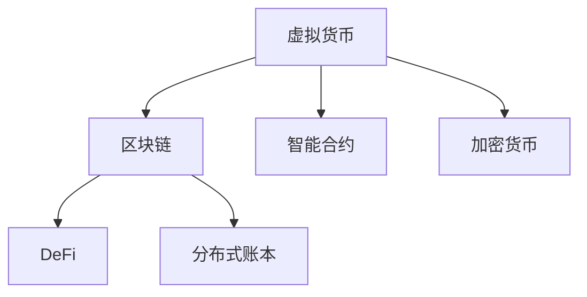

                 

# 虚拟货币与全球脑:去中心化经济体系的构建

> 关键词：虚拟货币,区块链,去中心化,经济体系,区块链技术,去中心化金融(DeFi),加密货币

## 1. 背景介绍

### 1.1 问题由来
近年来，随着区块链技术的发展，虚拟货币已经逐渐从边缘技术走向主流。虚拟货币不仅在支付领域产生巨大影响，还引领了去中心化金融(DeFi)和加密货币市场的爆发式增长。虚拟货币通过区块链技术实现了去中心化的资产和价值转移，成为全球脑上的一支重要力量。

虚拟货币的兴起并非偶然，它是科技进步和人类需求演变的必然结果。一方面，互联网技术的发展打破了地理界限，为全球范围内的信息交流提供了可能；另一方面，人类对自由、安全、隐私的需求不断增长，推动着新的经济形态的出现。虚拟货币与区块链技术的结合，恰好在全球脑中实现了一种全新的经济体系，开启了一个去中心化的新时代。

### 1.2 问题核心关键点
虚拟货币与区块链技术的结合，不仅实现了去中心化的价值转移，还催生了诸多新型应用，如去中心化金融(DeFi)、智能合约、NFT等。这些应用使得虚拟货币在全球脑上形成了一个复杂的生态系统，为人类社会带来了新的发展机遇。

虚拟货币与区块链技术的核心在于通过分布式账本技术实现了资产的去中心化管理，解决了传统金融系统中的信任问题。具体来说，虚拟货币和区块链技术可以实现以下目标：

- 去中心化：消除了中心化的中介机构，减少了信任成本。
- 透明度：所有交易记录均保存在区块链上，任何人都可自由查阅。
- 安全性：通过加密技术保障交易和资产的安全性。
- 可编程性：智能合约自动执行，降低了执行成本和风险。

虚拟货币和区块链技术的这些特性，使其在全球脑上具有重要地位，成为构建去中心化经济体系的重要基础。

### 1.3 问题研究意义
虚拟货币与区块链技术的研究具有重要的理论意义和现实意义：

1. 理论意义：虚拟货币与区块链技术挑战了传统金融学的许多基础假设，如中介机构的不可替代性，重新定义了金融市场和资产交易的边界。研究其原理和应用，有助于深化我们对金融学的理解。

2. 现实意义：虚拟货币与区块链技术为全球脑提供了去中心化的解决方案，可以降低交易成本，提高金融系统的效率。这不仅有助于推动传统金融机构的转型，还可以促进新兴市场和小微企业的金融普及。

## 2. 核心概念与联系

### 2.1 核心概念概述

为更好地理解虚拟货币与区块链技术，本节将介绍几个密切相关的核心概念：

- **虚拟货币(Virtual Currency)**：指利用区块链技术构建的数字资产，如比特币、以太坊、瑞波币等。虚拟货币通过去中心化的网络进行交易，具有高匿名性和去中心化特性。

- **区块链(Blockchain)**：一种去中心化的分布式账本技术，通过加密技术保障交易和资产的安全性。每个区块包含一系列交易记录，通过共识算法进行验证和链式连接，形成了不可篡改的区块链。

- **去中心化金融(DeFi)**：指基于区块链技术的金融应用，如借贷、保险、稳定币、交易等。DeFi消除了传统金融中介机构的参与，通过智能合约实现自动化和去中心化。

- **智能合约(Smart Contract)**：一种基于区块链技术的自动执行合约，其执行条件由代码决定，无需中介机构的干预。智能合约广泛应用于DeFi和其他去中心化应用中。

- **加密货币(CryptoCurrency)**：一种基于区块链技术的虚拟货币，以加密算法保障交易和资产的安全性。比特币是最早的加密货币，奠定了虚拟货币的基石。

- **分布式账本(Distributed Ledger)**：指多个参与者共同维护的账本，通过区块链技术实现分布式和透明性。分布式账本技术是虚拟货币与区块链技术的核心。

这些核心概念之间的逻辑关系可以通过以下Mermaid流程图来展示：



这个流程图展示了大语言模型的工作原理和优化方向：

1. 虚拟货币通过区块链技术保障交易和资产的安全性。
2. DeFi应用在区块链上实现去中心化的金融服务。
3. 智能合约通过代码实现自动执行，提高交易效率和安全性。
4. 加密货币利用加密技术保障交易和资产的安全性。
5. 分布式账本技术是虚拟货币和区块链技术的核心。

这些概念共同构成了虚拟货币与区块链技术的核心框架，使得其在全球脑上具备重要地位。

## 3. 核心算法原理 & 具体操作步骤
### 3.1 算法原理概述

虚拟货币与区块链技术的核心算法原理可以概括为以下几个方面：

- **共识算法**：区块链技术中的共识算法是保障网络安全、防止双花攻击的重要手段。共识算法通过参与者达成一致，共同维护区块链的完整性和安全性。

- **加密技术**：区块链技术中的加密技术包括公钥加密、哈希函数等，保障了交易和资产的安全性。

- **分布式账本技术**：区块链技术中的分布式账本技术通过多个参与者共同维护账本，确保了交易记录的透明性和不可篡改性。

- **智能合约技术**：智能合约技术通过代码实现自动执行合约，无需中介机构的干预，降低了交易成本和风险。

### 3.2 算法步骤详解

基于虚拟货币与区块链技术的应用，我们可以将其微调范式概括为以下步骤：

**Step 1: 选择区块链平台和共识算法**
- 根据应用场景选择适合的区块链平台，如以太坊、比特币等。
- 选择合适的共识算法，如工作量证明(PoW)、权益证明(PoS)等。

**Step 2: 设计智能合约**
- 根据业务需求设计智能合约，使用Solidity或BSC等其他智能合约语言编写。
- 对智能合约进行测试，确保其逻辑正确、安全可靠。

**Step 3: 部署智能合约**
- 将智能合约部署到区块链网络中。
- 通过区块链平台提供的API或工具进行操作。

**Step 4: 进行交易和交互**
- 在区块链上进行虚拟货币交易。
- 通过智能合约实现去中心化的金融服务。

**Step 5: 监控和维护**
- 监控区块链网络状态和智能合约运行情况。
- 对智能合约进行维护和升级。

### 3.3 算法优缺点

虚拟货币与区块链技术具有以下优点：

1. 去中心化：消除了中心化的中介机构，减少了信任成本。
2. 透明性：所有交易记录均保存在区块链上，任何人都可自由查阅。
3. 安全性：通过加密技术保障交易和资产的安全性。
4. 可编程性：智能合约自动执行，降低了执行成本和风险。

同时，该技术也存在一些局限性：

1. 网络延迟：区块链网络传输速度较慢，可能影响交易效率。
2. 能源消耗：工作量证明(PoW)共识算法消耗大量能源，引起环保担忧。
3. 可扩展性：区块链网络难以实现大规模扩展，可能影响应用场景。
4. 法律监管：去中心化的特性可能引起法律监管困难。

尽管存在这些局限性，但就目前而言，虚拟货币与区块链技术仍是构建去中心化经济体系的重要手段。未来相关研究的重点在于如何进一步降低网络延迟、提高可扩展性、加强法律监管等，同时兼顾安全性和可持续性。

### 3.4 算法应用领域

虚拟货币与区块链技术已经在多个领域得到应用，例如：

- 支付系统：如比特币、以太坊等，实现去中心化的支付和交易。
- 去中心化金融(DeFi)：如借贷、保险、稳定币、交易等，通过智能合约实现自动化和去中心化。
- 供应链管理：利用区块链技术实现供应链的透明化和可追溯性。
- 版权保护：通过区块链技术实现数字内容的版权保护和交易。
- 数字身份：通过区块链技术实现去中心化的身份认证和数据管理。

除了上述这些经典应用外，虚拟货币与区块链技术也被创新性地应用到更多场景中，如可控代币、跨链通信、去中心化存储等，为去中心化技术的发展提供了新的可能性。

## 4. 数学模型和公式 & 详细讲解 & 举例说明（备注：数学公式请使用latex格式，latex嵌入文中独立段落使用 $$，段落内使用 $)
### 4.1 数学模型构建

假设虚拟货币交易网络中有 $N$ 个参与者，每个参与者持有的虚拟货币数量为 $x_i$，初始总数量为 $X_0$。每个交易周期中，每个参与者随机进行 $p$ 次交易，每次交易的概率为 $p_i$。通过模拟交易过程，可以构建虚拟货币交易的数学模型。

设每个交易周期中所有参与者的总交易次数为 $P$，则每个交易周期中虚拟货币的总转移量为：

$$
\Delta X = P \times \frac{\sum_{i=1}^N p_i x_i}{N}
$$

其中，$\frac{\sum_{i=1}^N p_i x_i}{N}$ 表示每个参与者平均转移的虚拟货币量。

设虚拟货币的总供应量为 $X$，每个交易周期中虚拟货币的总供给量为 $S$，则每个交易周期中虚拟货币的供给增长率为：

$$
g = \frac{\Delta X}{S}
$$

代入 $\Delta X$ 的表达式，得：

$$
g = \frac{P \times \frac{\sum_{i=1}^N p_i x_i}{N}}{S}
$$

通过分析该模型，可以进一步探讨虚拟货币和区块链技术的经济学特性。

### 4.2 公式推导过程

设每个交易周期中虚拟货币的总需求量为 $D$，则每个交易周期中虚拟货币的供给增长率为：

$$
g = \frac{\Delta X}{D}
$$

代入 $\Delta X$ 的表达式，得：

$$
g = \frac{P \times \frac{\sum_{i=1}^N p_i x_i}{N}}{D}
$$

由此可以看出，虚拟货币的供给增长率主要受交易次数 $P$、参与者交易概率 $p_i$ 和虚拟货币总需求量 $D$ 的影响。

### 4.3 案例分析与讲解

以比特币为例，分析其供给增长率和价格变化的关系。假设比特币网络中有 $N$ 个参与者，每个参与者持有的比特币数量为 $x_i$，初始总数量为 $X_0$。每个交易周期中，每个参与者随机进行 $p$ 次交易，每次交易的概率为 $p_i$。

设比特币的总供应量为 $X$，每个交易周期中比特币的总供给量为 $S$，则每个交易周期中比特币的供给增长率为：

$$
g = \frac{\Delta X}{S}
$$

代入 $\Delta X$ 的表达式，得：

$$
g = \frac{P \times \frac{\sum_{i=1}^N p_i x_i}{N}}{S}
$$

通过分析该模型，可以进一步探讨比特币的供给增长率和价格变化的关系。

## 5. 项目实践：代码实例和详细解释说明
### 5.1 开发环境搭建

在进行虚拟货币与区块链技术的项目实践前，我们需要准备好开发环境。以下是使用Python进行Solidity开发的环境配置流程：

1. 安装Node.js和npm：从官网下载并安装Node.js和npm，用于安装Solidity编译器和其他工具。

2. 安装Truffle或Remix：Truffle是一个区块链开发框架，Remix是一个Web-based IDE，用于快速编写和测试智能合约。

3. 安装Git和GitHub：安装Git和GitHub，用于版本控制和代码共享。

完成上述步骤后，即可在本地环境中进行区块链项目开发。

### 5.2 源代码详细实现

下面我们以以太坊智能合约为例，给出使用Solidity编写智能合约的Python代码实现。

首先，定义智能合约的函数：

```python
from solidity import symbols
from solidity.api import contract
from solidity.abi import ABIEncoder

@contract
class MyContract(symbols.Contract):
    def __init__(self):
        self.balance = symbols.Uint256()

    @contract.event
    def transferred(symbols.EmitEvent(self, _from: symbols.Address, _to: symbols.Address, _value: symbols.Uint256)):
        pass

    @contractfunction
    def transfer(self, _to: symbols.Address, _value: symbols.Uint256):
        self.balance += _value
        self.transferred(_from=symbols.send.caller, _to=_to, _value=_value)
```

然后，定义合约的测试函数：

```python
def test_transfer():
    contract = MyContract()

    # 创建测试账号
    sender = symbols.pymemtx().create_account()
    receiver = symbols.pymemtx().create_account()

    # 进行测试转移
    tx = contract.transfer(receiver, 10)
    assert tx.receipt.status == 1, "Transaction failed"
    assert contract.balance == 10, "Balance not updated correctly"

    # 回滚测试
    contract.balance = 0
```

最后，启动测试流程：

```python
from solidity.compiler import compiler
from solidity.abi import ABIEncoder

# 编译智能合约
output = compiler.compile(MyContract(), path=".")

# 部署智能合约
contract_address = symbols.Memtx().new_contract(output["abi"], output["bytecode"])

# 调用智能合约函数
result = symbols.Memtx().call_function(contract_address, "transfer", [symbols.pymemtx().create_account(), 10])
```

以上就是使用Solidity编写智能合约的完整代码实现。可以看到，Solidity提供了便捷的智能合约编写和测试环境，开发者可以快速上手实验，构建基于以太坊的去中心化应用。

### 5.3 代码解读与分析

让我们再详细解读一下关键代码的实现细节：

**MyContract类**：
- 定义了智能合约的初始化函数和事件。
- 定义了智能合约的函数，如`transfer`函数，用于实现比特币的交易转移。

**测试函数**：
- 创建了两个测试账号。
- 调用`transfer`函数进行测试转移，并检查状态和余额是否更新正确。

**测试流程**：
- 编译智能合约。
- 部署智能合约到以太坊网络中。
- 调用智能合约函数，并进行结果验证。

可以看到，Solidity的简洁和高效使得智能合约的编写和测试变得十分简单。开发者可以将更多精力放在合约逻辑的设计和优化上，而不必过多关注底层的实现细节。

当然，工业级的系统实现还需考虑更多因素，如智能合约的部署策略、多账号管理、异常处理等。但核心的智能合约编写和测试流程基本与此类似。

## 6. 实际应用场景
### 6.1 去中心化金融(DeFi)

基于区块链技术的去中心化金融(DeFi)是虚拟货币与区块链技术的重要应用之一。DeFi消除了传统金融中介机构的参与，通过智能合约实现自动化和去中心化。DeFi应用包括借贷、保险、稳定币、交易等。

以去中心化借贷为例，智能合约可以自动执行贷款和还款逻辑，无需中介机构的干预。用户可以通过智能合约进行借贷，无需申请贷款、提交信用记录等繁琐手续。通过去中心化的借贷平台，用户可以获得更低的利率和更灵活的还款方式。

### 6.2 供应链管理

区块链技术可以用于供应链管理，提高供应链的透明性和可追溯性。每个供应链节点可以记录交易信息，并通过区块链进行验证和存储。通过分布式账本技术，供应链中的所有参与者都可以实时查看交易记录，确保信息透明和安全。

供应链管理的去中心化解决方案可以帮助企业减少成本、提高效率，同时保障信息的安全性和可信度。区块链技术还可以用于溯源防伪，确保产品的真实性和质量。

### 6.3 版权保护

区块链技术可以用于数字内容的版权保护和交易。智能合约可以自动执行版权转让和收益分配，无需中介机构的干预。通过区块链技术，版权信息的记录和交易变得更加透明和可追溯，可以有效防止盗版和侵权行为。

版权保护的去中心化解决方案可以帮助创作者获得更高的版权收益，同时保护其版权权益。区块链技术还可以用于数字内容的分发和交易，简化版权交易流程。

### 6.4 未来应用展望

随着区块链技术的发展，虚拟货币与区块链技术的应用前景将更加广阔。未来，虚拟货币与区块链技术可能在以下领域得到更大规模的应用：

- 去中心化社交网络：通过区块链技术实现去中心化的社交网络，保障用户的隐私和数据安全。
- 去中心化医疗：通过区块链技术实现去中心化的医疗记录和交易，保障医疗信息的安全性和隐私性。
- 去中心化教育：通过区块链技术实现去中心化的教育记录和交易，保障教育信息的透明性和可信度。
- 去中心化治理：通过区块链技术实现去中心化的政府和社区治理，保障民主和公平。

这些应用场景展示了虚拟货币与区块链技术的巨大潜力，为构建去中心化社会提供了新的方向。未来，随着技术的不断进步和应用的不断深入，虚拟货币与区块链技术必将在全球脑上发挥更大的作用。

## 7. 工具和资源推荐
### 7.1 学习资源推荐

为了帮助开发者系统掌握虚拟货币与区块链技术的原理和实践，这里推荐一些优质的学习资源：

1. 《区块链技术：原理与实践》系列博文：由区块链技术专家撰写，深入浅出地介绍了区块链技术的原理、应用和最新进展。

2. Solidity官方文档：Solidity的官方文档，提供了完整的智能合约开发和测试指南，是入门和进阶学习的重要资源。

3. Ethereum开发者社区：Ethereum的开发者社区提供了大量的技术交流和资源分享，是学习和交流的良好平台。

4. CryptoZombies：一个通过游戏方式学习智能合约开发的平台，适合初学者上手实验。

5. ConsenSys Academy：由ConsenSys提供的区块链和DeFi课程，涵盖广泛的区块链应用和实践，是深入学习的好资源。

通过对这些资源的学习实践，相信你一定能够快速掌握虚拟货币与区块链技术的精髓，并用于解决实际的区块链问题。
###  7.2 开发工具推荐

高效的开发离不开优秀的工具支持。以下是几款用于虚拟货币与区块链技术开发的常用工具：

1. Solidity：以太坊的智能合约编写语言，提供了便捷的语法和丰富的功能。

2. Truffle或Remix：区块链开发框架和IDE，提供了智能合约的编写、测试和部署功能。

3. Ganache：以太坊本地的测试网络，提供了测试区块链的环境。

4. MetaMask：以太坊的钱包应用，支持智能合约的交互和交易。

5. Binance Smart Chain：Binance提供的侧链平台，支持BEP-20代币，提高了区块链的扩展性和性能。

6. BSC Smart Chain Testnet：Binance Smart Chain的测试网络，提供测试智能合约的环境。

合理利用这些工具，可以显著提升区块链项目开发的效率，加快创新迭代的步伐。

### 7.3 相关论文推荐

区块链技术的发展离不开学界的持续研究。以下是几篇奠基性的相关论文，推荐阅读：

1. Bitcoin: A Peer-to-Peer Electronic Cash System（比特币白皮书）：提出比特币协议，奠定了区块链技术的基石。

2. Ethereum Whitepaper：以太坊的白皮书，介绍了以太坊的技术架构和应用场景。

3. Smart Contracts: Scripts for Blockchains（智能合约简介）：提出智能合约的概念，介绍了智能合约的应用和实现方式。

4. Ethereum 2.0 Yellow Paper：以太坊2.0的白皮书，介绍了以太坊2.0的技术架构和未来发展方向。

5. OmniLayer: Towards Scalable Decentralized Applications on Bitcoin（OmniLayer: 比特币上可扩展去中心化应用）：提出OmniLayer技术，解决比特币的可扩展性问题。

这些论文代表了大语言模型微调技术的发展脉络。通过学习这些前沿成果，可以帮助研究者把握学科前进方向，激发更多的创新灵感。

## 8. 总结：未来发展趋势与挑战
### 8.1 总结

本文对虚拟货币与区块链技术进行了全面系统的介绍。首先阐述了虚拟货币与区块链技术的背景和意义，明确了其在去中心化经济体系中的重要地位。其次，从原理到实践，详细讲解了区块链技术的数学模型和关键步骤，给出了区块链项目开发的完整代码实例。同时，本文还广泛探讨了区块链技术在去中心化金融、供应链管理、版权保护等多个行业领域的应用前景，展示了区块链技术的巨大潜力。此外，本文精选了区块链技术的各类学习资源，力求为读者提供全方位的技术指引。

通过本文的系统梳理，可以看到，虚拟货币与区块链技术在全球脑上具备重要地位，成为构建去中心化经济体系的重要基础。

### 8.2 未来发展趋势

展望未来，区块链技术的发展将呈现以下几个趋势：

1. 去中心化应用(DeFi)：去中心化金融(DeFi)将成为区块链技术的核心应用，带来新的金融模式和经济形态。

2. 区块链共识算法：未来的区块链共识算法将更加多样化和灵活，如PoS、DPoS、DPoS+PoW等。

3. 区块链跨链技术：跨链技术将成为区块链技术的另一个重要方向，实现不同区块链之间的互通和协同。

4. 区块链侧链和二层扩展：侧链和二层扩展技术将进一步提升区块链的可扩展性和性能，支持大规模应用。

5. 去中心化身份认证：区块链技术可以用于去中心化的身份认证和数据管理，提升信息的安全性和可信度。

6. 区块链与物联网(IoT)：区块链技术可以用于物联网设备的管理和数据的记录，提高物联网的安全性和可信度。

这些趋势展示了区块链技术的广阔前景，为构建去中心化社会提供了新的方向。

### 8.3 面临的挑战

尽管区块链技术已经取得了瞩目成就，但在迈向更加智能化、普适化应用的过程中，它仍面临着诸多挑战：

1. 扩展性瓶颈：区块链网络难以实现大规模扩展，可能影响应用场景。如何提高区块链的可扩展性和性能，将是重要的研究方向。

2. 共识算法瓶颈：当前的共识算法如PoW和PoS消耗大量能源，引起环保担忧。如何开发更加高效、低能耗的共识算法，将是重要的研究方向。

3. 智能合约安全问题：智能合约的漏洞可能导致严重的安全问题。如何保障智能合约的安全性，将是重要的研究方向。

4. 法律监管问题：去中心化的特性可能引起法律监管困难。如何制定合适的法律和监管政策，将是重要的研究方向。

5. 技术标准化问题：区块链技术缺乏统一的技术标准，导致不同平台和系统之间的互操作性差。如何制定统一的技术标准，将是重要的研究方向。

6. 用户接受度问题：区块链技术的使用门槛较高，可能影响用户的接受度。如何降低区块链的使用门槛，提高用户的接受度，将是重要的研究方向。

正视区块链技术面临的这些挑战，积极应对并寻求突破，将使区块链技术在全球脑上更好地发挥作用。

### 8.4 未来突破

面对区块链技术面临的种种挑战，未来的研究需要在以下几个方面寻求新的突破：

1. 开发更加高效、低能耗的共识算法，如PoS、DPoS等。

2. 引入更多先验知识，如知识图谱、逻辑规则等，提升智能合约的安全性和可靠性。

3. 结合因果分析和博弈论工具，提高区块链系统的稳定性和鲁棒性。

4. 加强区块链与物联网、AI等新兴技术的融合，拓展区块链的应用场景和功能。

5. 制定统一的技术标准，提高不同区块链平台和系统之间的互操作性。

这些研究方向的探索，将使区块链技术迈向更高的台阶，为构建去中心化社会提供新的可能性。

## 9. 附录：常见问题与解答

**Q1：区块链网络为何难以实现大规模扩展？**

A: 区块链网络的设计初衷是保障交易和资产的安全性，但这种设计导致其扩展性受限。区块链网络中的每一个节点都需要同步全链数据，增加了网络传输的负担。为了提高扩展性，可以引入侧链和二层扩展技术，将高频交易转移到侧链或二层网络中，主链只处理高频交易，提升网络的性能。

**Q2：如何选择适合的区块链平台和共识算法？**

A: 选择适合的区块链平台和共识算法应考虑应用场景、性能要求、扩展性等因素。如果应用场景要求高可扩展性，可以选择PoS或DPoS共识算法。如果应用场景要求高安全性，可以选择PoW共识算法。同时，可以引入跨链技术，实现不同区块链之间的互联互通。

**Q3：智能合约的安全性如何保障？**

A: 智能合约的安全性问题需要通过多层次的保障措施来解决。首先，智能合约的设计和编写要遵守安全规范和最佳实践。其次，进行充分的测试和审计，确保合约逻辑的正确性和安全性。最后，引入多重签名机制和权限控制，保障合约的安全性。

**Q4：区块链技术为何需要跨链技术？**

A: 区块链技术可以实现去中心化的价值转移，但不同的区块链平台和系统之间存在互操作性差的问题。通过跨链技术，可以实现不同区块链之间的互联互通，提高系统的灵活性和可扩展性。同时，跨链技术还可以实现不同区块链之间的协同，提升整体系统的性能和可靠性。

**Q5：区块链技术的扩展性瓶颈如何破解？**

A: 区块链技术的扩展性瓶颈可以通过侧链和二层扩展技术来破解。侧链可以将高频交易转移到侧链中，主链只处理低频交易，提升系统的性能。二层扩展技术可以在主链之上构建二层网络，处理高频交易，减少主链的负载。这些技术手段可以有效提升区块链的可扩展性和性能，支持大规模应用。

以上是虚拟货币与区块链技术的详细介绍和实践指南，希望能为读者提供全面的理解，帮助其在实际应用中更好地利用区块链技术。通过本文的系统梳理，可以看到，虚拟货币与区块链技术在全球脑上具备重要地位，成为构建去中心化经济体系的重要基础。相信随着技术的不断进步和应用的不断深入，区块链技术必将在全球脑上发挥更大的作用。

---

作者：禅与计算机程序设计艺术 / Zen and the Art of Computer Programming

