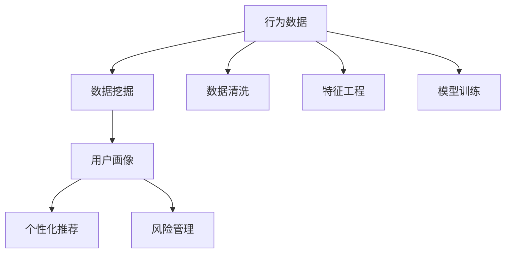

                 

# 行为数据在用户画像中的作用

> 关键词：用户画像, 行为分析, 数据挖掘, 用户行为建模, 个性化推荐, 风险管理

## 1. 背景介绍

在互联网和移动互联网时代，随着用户对在线服务的依赖度日益增加，企业掌握了大量的用户行为数据。这些数据不仅能够反映用户的个性化需求，还能为企业提供深入洞察，推动营销、产品和服务优化等各环节的决策。因此，如何高效地利用这些行为数据，成为了各大企业关注的焦点。

### 1.1 问题由来

行为数据是用户在数字平台上与内容、服务、产品等互动产生的记录，包括点击、浏览、购买、评论、搜索、评分等。这些数据通常以日志形式存在，且具有实时性和大量的粒度。如何从这些海量行为数据中提取有价值的特征，构建精准的用户画像，成为了当前数据科学和人工智能领域的挑战。

### 1.2 问题核心关键点

行为数据分析的核心在于如何通过数据挖掘技术，从用户的交互记录中提取关键特征，构建用户画像，并在此基础上进行各类业务决策。核心问题包括：

- 数据收集与处理：如何高效、安全地收集行为数据，并保证数据质量。
- 用户行为建模：如何将行为数据转化为用户画像，理解用户的兴趣、需求和行为模式。
- 个性化推荐：基于用户画像，实现个性化推荐、广告投放等商业应用。
- 风险管理：利用用户画像进行用户行为风险评估和防范。

## 2. 核心概念与联系

### 2.1 核心概念概述

为更好地理解行为数据在用户画像中的作用，本节将介绍几个密切相关的核心概念：

- 用户画像（User Profile）：指基于用户的行为数据，构建的用于描述用户属性和兴趣的模型。
- 行为数据（Behavioral Data）：指用户在数字平台上与内容、服务、产品等互动产生的记录。
- 数据挖掘（Data Mining）：从行为数据中发现有用信息和知识的过程。
- 个性化推荐（Personalized Recommendation）：根据用户画像，推荐符合用户兴趣和需求的产品或内容。
- 风险管理（Risk Management）：基于用户画像，评估用户行为风险，进行防范和控制。

这些核心概念之间的逻辑关系可以通过以下Mermaid流程图来展示：



这个流程图展示了这个工作流程的核心步骤：

1. 收集行为数据，并进行清洗、特征工程等预处理步骤。
2. 通过数据挖掘技术，发现数据中的模式和关系。
3. 构建用户画像，描述用户的兴趣和行为特征。
4. 利用用户画像，进行个性化推荐和风险管理。

## 3. 核心算法原理 & 具体操作步骤

### 3.1 算法原理概述

行为数据在用户画像中的应用，主要依赖于数据挖掘和机器学习技术。其核心原理如下：

1. **数据清洗与预处理**：从原始行为数据中去除噪声、异常值，进行缺失值处理和归一化。
2. **特征工程**：从行为数据中提取有意义的特征，如用户浏览时长、购买频率、评分等。
3. **用户行为建模**：通过聚类、分类、关联规则等算法，发现用户行为模式和特征。
4. **个性化推荐**：基于用户画像，推荐符合用户兴趣和需求的产品或内容。
5. **风险管理**：利用用户画像，评估用户行为风险，进行防范和控制。

### 3.2 算法步骤详解

以下是具体的算法步骤详解：

**Step 1: 数据收集与预处理**
- **数据收集**：收集用户在各个数字平台上的行为数据，包括点击、浏览、购买、评论、搜索、评分等。
- **数据清洗**：去除重复数据、异常值和噪声，处理缺失值，对数据进行归一化和标准化。
- **特征工程**：从行为数据中提取有意义的特征，如用户活跃度、购买频率、兴趣爱好等。

**Step 2: 用户行为建模**
- **聚类分析**：通过K-Means、层次聚类等算法，将用户分为不同的群组，发现不同群组的用户行为模式。
- **分类分析**：使用逻辑回归、决策树、随机森林等算法，对用户进行分类，判断用户的兴趣和行为倾向。
- **关联规则挖掘**：使用Apriori、FP-Growth等算法，发现不同行为之间的关联关系，如购买商品与浏览商品之间的关系。

**Step 3: 用户画像构建**
- **用户特征选择**：从用户行为数据中挑选最具有代表性的特征，构建用户画像。
- **用户画像表示**：将用户画像表示为一个向量或矩阵，包含用户的各种特征值。
- **画像更新与维护**：根据用户的最新行为数据，更新用户画像，保持画像的实时性。

**Step 4: 个性化推荐**
- **推荐算法选择**：根据任务特点选择合适的推荐算法，如协同过滤、基于内容的推荐、混合推荐等。
- **模型训练**：利用用户画像和行为数据，训练推荐模型。
- **推荐结果生成**：根据用户画像和推荐算法，生成个性化推荐结果。

**Step 5: 风险管理**
- **风险评估**：根据用户画像和行为数据，评估用户的行为风险，如欺诈风险、流失风险等。
- **风险控制**：利用风险评估结果，采取相应措施进行风险控制，如限制交易、调整策略等。

### 3.3 算法优缺点

行为数据在用户画像中的应用具有以下优点：

1. **全面性**：行为数据涵盖了用户与产品、服务、内容等互动的各个方面，能够全面反映用户的行为特征。
2. **实时性**：行为数据通常是实时的，能够及时更新用户画像，保持画像的最新状态。
3. **可操作性**：行为数据可以进行多样化的分析，如个性化推荐、风险管理等，能够产生实际价值。

同时，该方法也存在一定的局限性：

1. **隐私保护**：行为数据涉及用户隐私，需严格保护，确保数据安全。
2. **数据噪声**：行为数据可能包含大量的噪声和异常值，需要进行预处理。
3. **解释性不足**：用户画像通常是一个复杂的模型，难以解释其内部机制和决策逻辑。
4. **模型复杂性**：构建用户画像和进行个性化推荐等，需要构建复杂的算法模型，对技术要求较高。

尽管存在这些局限性，但就目前而言，行为数据分析仍然是大数据应用中的重要范式。未来相关研究的重点在于如何进一步提升数据挖掘的效率和准确性，优化个性化推荐算法，保障用户隐私，同时兼顾可解释性和易用性。

### 3.4 算法应用领域

行为数据分析技术在多个领域得到了广泛应用，例如：

- **电商推荐**：通过行为数据，对用户进行精准推荐，提升用户体验和销售额。
- **金融风控**：利用行为数据，评估用户风险，防范欺诈和信用风险。
- **广告投放**：根据用户行为数据，进行精准的广告投放，提高广告效果和ROI。
- **内容推荐**：分析用户行为数据，推荐符合用户兴趣的内容，提升用户粘性和满意度。
- **用户流失预测**：通过行为数据，预测用户流失风险，提前采取挽留措施。

除了上述这些经典应用外，行为数据分析还被创新性地应用到更多场景中，如社交网络分析、在线教育、健康医疗等，为各行业的数字化转型提供了新的思路。随着技术的发展，行为数据分析的应用范围还将进一步扩大。

## 4. 数学模型和公式 & 详细讲解 & 举例说明

### 4.1 数学模型构建

本节将使用数学语言对行为数据分析的模型构建过程进行严格刻画。

记行为数据为 $D=\{(x_i,y_i)\}_{i=1}^N$，其中 $x_i$ 为行为特征向量，$y_i$ 为标签（如用户兴趣、行为风险等）。

定义数据挖掘模型 $M_{\theta}$，其中 $\theta$ 为模型参数。假设模型为线性回归模型，则经验风险为：

$$
\mathcal{L}(\theta) = \frac{1}{N}\sum_{i=1}^N (y_i - M_{\theta}(x_i))^2
$$

通过梯度下降等优化算法，求解最小化损失函数：

$$
\theta \leftarrow \theta - \eta \nabla_{\theta}\mathcal{L}(\theta)
$$

其中 $\eta$ 为学习率，$\nabla_{\theta}\mathcal{L}(\theta)$ 为损失函数对模型参数的梯度。

### 4.2 公式推导过程

以用户行为聚类为例，推导K-Means算法的核心公式：

设用户行为特征矩阵为 $X \in \mathbb{R}^{n \times d}$，其中 $n$ 为用户数，$d$ 为特征维数。将 $X$ 分为 $K$ 个簇 $C_k$，其中 $k \in [1,K]$。

K-Means算法的目标是最小化簇内平方误差：

$$
SSE = \sum_{k=1}^K \sum_{x_i \in C_k} \| x_i - \mu_k \|^2
$$

其中 $\mu_k$ 为簇 $C_k$ 的质心。

算法步骤包括：

1. 随机初始化 $K$ 个质心 $\mu_k$。
2. 对于每个用户 $x_i$，计算其到每个质心的距离，并将其分配到最近的簇 $C_k$。
3. 更新每个簇的质心 $\mu_k$。
4. 重复步骤2和3，直到收敛。

### 4.3 案例分析与讲解

考虑一个电商推荐系统的案例，通过行为数据分析构建用户画像。假设用户行为数据包括浏览记录、购买记录、评分记录等，每条记录包含以下特征：

- 用户ID $u_i$
- 商品ID $p_i$
- 浏览时间 $t_i$
- 浏览时长 $d_i$
- 购买时间 $b_i$
- 购买价格 $p_i$
- 评分 $s_i$

通过数据清洗和特征工程，得到每个用户的特征向量 $x_i$，如用户ID、浏览时长、购买价格等。

使用K-Means算法对用户进行聚类，得到不同兴趣群组的质心向量 $\mu_k$。

根据聚类结果，构建用户画像，每个用户画像表示为一个向量，包含其所属簇的质心向量和其他特征值。例如，用户A的画像向量可以表示为 $[x_A, \mu_k]$，其中 $x_A$ 为用户的特征向量，$\mu_k$ 为其所属簇的质心向量。

## 5. 项目实践：代码实例和详细解释说明

### 5.1 开发环境搭建

在进行行为数据分析项目实践前，我们需要准备好开发环境。以下是使用Python进行Scikit-learn和PyTorch开发的环境配置流程：

1. 安装Anaconda：从官网下载并安装Anaconda，用于创建独立的Python环境。

2. 创建并激活虚拟环境：
```bash
conda create -n behavior-analytics python=3.8 
conda activate behavior-analytics
```

3. 安装必要的库：
```bash
pip install pandas numpy scikit-learn torch transformers
```

4. 安装模型评估工具：
```bash
pip install matplotlib seaborn joblib
```

完成上述步骤后，即可在`behavior-analytics`环境中开始行为数据分析的实践。

### 5.2 源代码详细实现

下面以用户行为聚类为例，给出使用Scikit-learn库对行为数据进行K-Means聚类的PyTorch代码实现。

首先，定义数据处理函数：

```python
import pandas as pd
from sklearn.preprocessing import StandardScaler
from sklearn.cluster import KMeans

def preprocess_data(df):
    # 数据预处理
    # 1. 处理缺失值
    df.fillna(df.mean(), inplace=True)
    # 2. 标准化特征
    scaler = StandardScaler()
    df_scaled = scaler.fit_transform(df)
    # 3. 特征选择
    selected_features = ['浏览时长', '购买价格', '评分']
    df_selected = df_scaled[:, selected_features]
    return df_selected
```

然后，定义K-Means聚类函数：

```python
def clustering(df, num_clusters):
    # 聚类
    kmeans = KMeans(n_clusters=num_clusters, random_state=42)
    kmeans.fit(df)
    # 预测每个样本的簇
    labels = kmeans.labels_
    # 计算每个簇的质心
    centroids = kmeans.cluster_centers_
    return labels, centroids
```

最后，进行聚类并可视化结果：

```python
# 加载数据
df = pd.read_csv('user_behavior.csv')

# 数据预处理
df_scaled = preprocess_data(df)

# 聚类
labels, centroids = clustering(df_scaled, num_clusters=5)

# 可视化聚类结果
import matplotlib.pyplot as plt
plt.scatter(df_scaled[:, 0], df_scaled[:, 1], c=labels)
plt.scatter(centroids[:, 0], centroids[:, 1], c='red', s=100)
plt.show()
```

以上就是使用Scikit-learn库对行为数据进行K-Means聚类的完整代码实现。可以看到，Scikit-learn库提供了高效、易用的聚类算法和可视化工具，极大简化了行为数据分析的实践。

### 5.3 代码解读与分析

让我们再详细解读一下关键代码的实现细节：

**preprocess_data函数**：
- 数据预处理：包括缺失值处理、特征标准化、特征选择等步骤，确保数据质量。
- 特征选择：选择与聚类目标最相关的特征，提高聚类效果。

**clustering函数**：
- 使用KMeans算法进行聚类，计算每个样本的簇标签。
- 计算每个簇的质心，作为簇的代表。

**可视化聚类结果**：
- 使用Matplotlib库将聚类结果可视化，展示不同簇的分布情况。

可以看到，通过上述代码，我们可以方便地进行行为数据的聚类分析，构建用户画像，为后续的个性化推荐和风险管理提供基础。

## 6. 实际应用场景

### 6.1 智能推荐系统

智能推荐系统是行为数据分析的重要应用场景之一。通过分析用户的行为数据，可以构建精准的用户画像，实现个性化推荐。

例如，在电商平台上，用户浏览了哪些商品、购买记录、评价等行为数据，可以作为推荐模型的输入，构建用户画像。利用K-Means聚类等算法，将用户分为不同的兴趣群组。根据用户画像和聚类结果，利用协同过滤、基于内容的推荐等算法，生成个性化推荐列表，提升用户体验和销售额。

### 6.2 金融风险管理

金融风险管理也是行为数据分析的重要应用之一。通过分析用户的交易记录、账户行为等数据，可以构建用户画像，进行行为风险评估和防范。

例如，在贷款审批场景中，用户的申请记录、还款记录、信用评分等行为数据，可以作为风险评估模型的输入，构建用户画像。利用聚类算法将用户分为高风险和低风险两类，并针对高风险用户采取更严格的审核措施，降低坏账风险。

### 6.3 社交网络分析

社交网络分析是行为数据分析的另一个重要应用领域。通过分析用户在社交平台上的行为数据，可以构建用户画像，发现用户兴趣和社交关系。

例如，在微博平台上，用户的关注关系、互动行为、发布内容等数据，可以作为用户画像的输入。利用K-Means聚类算法，将用户分为不同的兴趣群组，并根据不同兴趣群组的特点，推荐相关的内容和用户，提升用户活跃度和平台粘性。

### 6.4 未来应用展望

随着技术的发展，行为数据分析的应用范围还将进一步扩大。未来可能的趋势包括：

1. **多模态数据融合**：将行为数据与文本、图像、音频等多模态数据结合，构建更全面的用户画像。
2. **实时数据处理**：通过流式计算技术，实时处理用户行为数据，保持用户画像的实时性。
3. **个性化推荐优化**：结合深度学习技术，优化推荐算法，提升推荐效果和用户体验。
4. **隐私保护和合规性**：加强隐私保护和数据合规性，确保用户数据安全。

## 7. 工具和资源推荐

### 7.1 学习资源推荐

为了帮助开发者系统掌握行为数据分析的理论基础和实践技巧，这里推荐一些优质的学习资源：

1. 《Python数据科学手册》系列博文：由数据科学专家撰写，涵盖数据处理、机器学习、数据可视化等基础知识。
2. Coursera《数据科学导论》课程：由约翰·霍普金斯大学开设的入门级课程，系统讲解数据科学的基本概念和工具。
3. 《机器学习实战》书籍：详细介绍了各种机器学习算法的实现和应用，适合快速上手实践。
4. Kaggle平台：全球最大的数据科学竞赛平台，提供大量真实数据集和竞赛项目，供开发者实践学习。
5. 《大数据技术与应用》书籍：全面介绍了大数据的核心技术和应用，涵盖数据采集、存储、处理、分析等全流程。

通过对这些资源的学习实践，相信你一定能够快速掌握行为数据分析的精髓，并用于解决实际的业务问题。

### 7.2 开发工具推荐

高效的开发离不开优秀的工具支持。以下是几款用于行为数据分析开发的常用工具：

1. Python：作为数据科学的主流语言，Python具有丰富的库和框架支持，适合进行复杂的数据分析和建模。
2. Scikit-learn：简单易用的机器学习库，提供了多种聚类、分类、回归等算法。
3. Pandas：强大的数据处理库，支持数据清洗、特征工程、数据可视化等操作。
4. TensorFlow和PyTorch：深度学习框架，支持高效的数据处理和模型训练。
5. Tableau和Power BI：数据可视化工具，支持丰富的图表和报表展示，便于数据分析和决策。

合理利用这些工具，可以显著提升行为数据分析的开发效率，加快创新迭代的步伐。

### 7.3 相关论文推荐

行为数据分析技术的发展源于学界的持续研究。以下是几篇奠基性的相关论文，推荐阅读：

1. "Mining of Massive Datasets for Online Communities"（Huang & Liu）：研究在线社区的数据挖掘问题，提出基于用户行为的数据建模方法。
2. "Latent Semantic Analysis"（Deerwester et al.）：提出LSA算法，用于文本数据的潜在语义分析。
3. "Collaborative Filtering for Implicit Feedback Datasets"（Herlocker et al.）：研究协同过滤算法，应用于推荐系统。
4. "A scalable probabilistic model for collaborative filtering"（He & Leskovec）：提出矩阵分解方法，用于大规模推荐系统。
5. "Personalized Recommendation via Implicit Matrix Factorization"（Sarwar et al.）：提出基于矩阵分解的推荐算法，应用于电子商务等领域。

这些论文代表了大数据应用中的关键技术，通过学习这些前沿成果，可以帮助研究者把握学科前进方向，激发更多的创新灵感。

## 8. 总结：未来发展趋势与挑战

### 8.1 总结

本文对行为数据在用户画像中的应用进行了全面系统的介绍。首先阐述了行为数据分析的背景和意义，明确了其在用户画像构建和业务决策中的独特价值。其次，从原理到实践，详细讲解了行为数据分析的数学原理和关键步骤，给出了行为数据分析任务开发的完整代码实例。同时，本文还广泛探讨了行为数据分析技术在智能推荐、金融风控、社交网络等多个领域的应用前景，展示了行为数据分析技术的广阔前景。

通过本文的系统梳理，可以看到，行为数据分析技术在构建用户画像、推动业务决策中具有重要价值。尽管存在隐私保护、数据质量、模型复杂性等挑战，但行为数据分析技术仍然是大数据应用中的重要范式。未来相关研究的重点在于如何进一步提升数据挖掘的效率和准确性，优化推荐算法，保障用户隐私，同时兼顾可解释性和易用性。

### 8.2 未来发展趋势

展望未来，行为数据分析技术将呈现以下几个发展趋势：

1. **多模态数据融合**：将行为数据与文本、图像、音频等多模态数据结合，构建更全面的用户画像。
2. **实时数据处理**：通过流式计算技术，实时处理用户行为数据，保持用户画像的实时性。
3. **个性化推荐优化**：结合深度学习技术，优化推荐算法，提升推荐效果和用户体验。
4. **隐私保护和合规性**：加强隐私保护和数据合规性，确保用户数据安全。
5. **跨领域应用**：将行为数据分析技术应用于更多领域，如健康医疗、智能交通、智能制造等，推动各行业的数字化转型。

以上趋势凸显了行为数据分析技术的广阔前景。这些方向的探索发展，必将进一步提升用户画像的精度和实时性，推动各行业业务决策的科学化和智能化。

### 8.3 面临的挑战

尽管行为数据分析技术已经取得了瞩目成就，但在迈向更加智能化、普适化应用的过程中，它仍面临着诸多挑战：

1. **数据质量和隐私保护**：行为数据涉及用户隐私，需严格保护，确保数据安全。同时，数据质量问题也需要进一步解决，以保证数据分析的准确性和可靠性。
2. **数据噪声和模型复杂性**：行为数据可能包含大量的噪声和异常值，需要进行预处理。构建用户画像和进行个性化推荐等，需要构建复杂的算法模型，对技术要求较高。
3. **实时性和可解释性**：如何实时更新用户画像，同时确保模型的可解释性，是一个重要的研究方向。

尽管存在这些挑战，但通过技术创新和理论探索，这些挑战终将一一被克服。未来，随着数据挖掘技术的不断发展，行为数据分析必将在各行业得到广泛应用，带来更深远的社会和经济影响。

### 8.4 研究展望

面对行为数据分析所面临的挑战，未来的研究需要在以下几个方面寻求新的突破：

1. **数据清洗与预处理**：进一步提升数据清洗和预处理算法的效率和准确性，去除噪声和异常值，保证数据质量。
2. **多模态数据融合**：将行为数据与其他模态的数据进行融合，构建更加全面的用户画像。
3. **实时数据处理**：通过流式计算等技术，实现实时数据处理和用户画像的更新。
4. **推荐算法优化**：结合深度学习等技术，优化推荐算法，提升个性化推荐的效果和用户体验。
5. **隐私保护和合规性**：探索隐私保护和数据合规性的新技术，保障用户数据安全。

这些研究方向的探索，必将引领行为数据分析技术迈向更高的台阶，为各行业的数字化转型提供更强大的技术支持。

## 9. 附录：常见问题与解答

**Q1: 如何收集行为数据？**

A: 行为数据的收集可以通过日志文件、API接口、Web爬虫等方式实现。例如，电商平台的订单记录、搜索记录、点击记录等，可以通过API接口获取；社交平台的用户互动记录、内容发布记录等，可以通过Web爬虫获取。

**Q2: 数据清洗和预处理的关键步骤有哪些？**

A: 数据清洗和预处理的关键步骤包括：
1. 处理缺失值：使用均值、中位数等方法填充缺失值。
2. 处理异常值：使用Z-score等方法检测和处理异常值。
3. 特征标准化：使用标准化、归一化等方法将特征值映射到[0,1]或[-1,1]区间。
4. 特征选择：选择与目标变量最相关的特征，减少特征维度。

**Q3: 数据挖掘中常用的算法有哪些？**

A: 数据挖掘中常用的算法包括：
1. 聚类算法：K-Means、层次聚类、DBSCAN等。
2. 分类算法：逻辑回归、决策树、随机森林、SVM等。
3. 关联规则挖掘算法：Apriori、FP-Growth等。
4. 序列模式挖掘算法：FP-Sequence等。
5. 协同过滤算法：基于用户、基于物品的协同过滤等。

**Q4: 推荐算法的主要类型有哪些？**

A: 推荐算法的主要类型包括：
1. 基于内容的推荐：根据物品的属性特征，推荐相似的物品。
2. 协同过滤推荐：利用用户行为数据，推荐用户可能感兴趣的物品。
3. 混合推荐算法：结合基于内容的推荐和协同过滤，实现更准确的推荐。

**Q5: 如何评估用户画像的精度？**

A: 用户画像的精度可以通过以下指标评估：
1. 准确率：用户画像的正确率，即预测的正确样本数占总样本数的比例。
2. 召回率：用户画像的召回率，即正确预测出的样本数占实际正确样本数的比例。
3. F1分数：综合考虑准确率和召回率，计算F1分数，用于评估模型效果。

**Q6: 如何保护用户隐私？**

A: 用户隐私保护可以通过以下措施实现：
1. 数据匿名化：对用户数据进行匿名化处理，去除敏感信息。
2. 数据加密：对数据进行加密处理，防止数据泄露。
3. 差分隐私：在数据处理过程中，加入噪声，保护个体隐私。
4. 访问控制：对数据进行严格的访问控制，限制数据访问权限。

以上是行为数据分析中常见的问题和解答，希望对你有所启发和帮助。

---

作者：禅与计算机程序设计艺术 / Zen and the Art of Computer Programming

