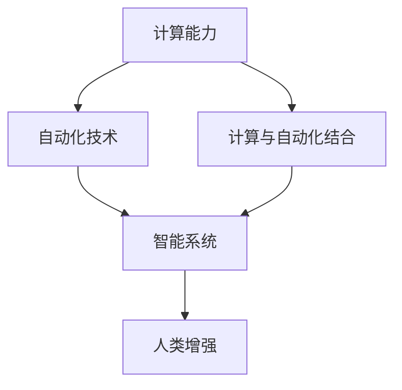

                 

## 1. 背景介绍

### 1.1 问题由来
随着信息技术的迅猛发展，计算能力和数据资源已广泛应用于各个领域。从简单的办公自动化，到复杂的工业生产，计算变化与自动化技术之间的互动日益频繁。这一互动不仅提升了工作效率，还推动了诸多新应用的诞生，极大地改变了人类的生产生活方式。

### 1.2 问题核心关键点
在现代社会，计算变化与自动化技术的互动主要包括三个方面：
- 计算能力提升。如CPU、GPU、FPGA等硬件技术的迭代进步，以及云平台、分布式计算等基础设施的不断优化。
- 自动化技术发展。如机器视觉、自然语言处理、机器人技术等前沿技术的突破。
- 计算与自动化的结合。如自动驾驶、智能制造、智慧城市等新应用的不断涌现。

这一互动的核心关键点在于，计算能力提供了强大的处理能力，而自动化技术则提供了高效、可靠的执行能力，二者协同作用，使得新应用的落地变得更加现实。

### 1.3 问题研究意义
研究计算变化与自动化技术的互动，对于推动技术进步、提升生产力、改善生活质量具有重要意义：

1. 推动技术进步。计算能力和自动化技术的互动，催生了诸多新应用场景，促进了技术的创新和发展。
2. 提升生产力。计算与自动化技术的结合，使得复杂任务变得自动化，大幅提升了生产效率。
3. 改善生活质量。如智能家居、智能办公、远程医疗等新应用的普及，极大地便利了人们的生活。
4. 促进产业升级。计算变化与自动化技术的结合，加速了传统产业的数字化转型和升级。

## 2. 核心概念与联系

### 2.1 核心概念概述

为更好地理解计算变化与自动化技术的互动，本节将介绍几个密切相关的核心概念：

- 计算能力(Computational Capability)：指硬件设备（如CPU、GPU、FPGA等）和软件算法提供的计算资源和处理能力。
- 自动化技术(Automation Technology)：指通过传感器、执行器、控制器等实现任务自动化的技术，如机器视觉、自然语言处理、机器人技术等。
- 计算与自动化结合(Computational and Automation Integration)：指将计算能力和自动化技术结合，通过算法优化、模型训练等方式，实现对自动化过程的精细控制和智能化升级。
- 智能系统(Intelligent System)：指通过计算与自动化结合，实现对环境、任务、用户等的感知、推理和执行的系统，如智能推荐系统、智能交通系统等。
- 人类增强(Human Enhancement)：指利用计算与自动化技术，增强人类感知、决策和执行能力，提升个人和社会的整体能力。

这些核心概念之间的逻辑关系可以通过以下Mermaid流程图来展示：



这个流程图展示了大语言模型的核心概念及其之间的关系：

1. 计算能力通过硬件和算法提供处理资源。
2. 自动化技术实现任务执行的自动化。
3. 计算与自动化结合实现智能化升级。
4. 智能系统是结合计算与自动化技术的应用实例。
5. 人类增强体现了技术应用对人类能力的提升。

这些概念共同构成了计算变化与自动化技术的互动框架，使得计算资源得以充分利用，自动化技术得以优化升级，推动了智能化应用的发展。

## 3. 核心算法原理 & 具体操作步骤

### 3.1 算法原理概述

计算变化与自动化技术的互动，其核心算法原理主要包括：

- 感知与建模：利用传感器、摄像头等设备，感知环境信息，并利用算法构建环境模型。
- 决策与规划：通过模型预测、优化算法，对自动化系统进行决策和路径规划。
- 执行与反馈：将决策转化为自动化系统的执行动作，并通过反馈系统调整模型和算法。

这些步骤构成了一个闭环的自动化流程，从感知、决策到执行和反馈，通过不断的迭代优化，实现了任务的自动化和智能化。

### 3.2 算法步骤详解

基于计算变化与自动化技术的互动，我们可以将整个互动流程分为以下几个关键步骤：

**Step 1: 数据收集与预处理**
- 使用传感器、摄像头等设备收集环境数据。
- 对数据进行去噪、滤波、增强等预处理，确保数据的质量和一致性。
- 使用图像处理、信号处理等技术，将数据转换为模型所需的形式。

**Step 2: 模型训练与优化**
- 选择合适的算法模型，如卷积神经网络、递归神经网络、深度强化学习等。
- 利用预处理后的数据，进行模型训练，优化模型参数。
- 使用交叉验证、网格搜索等技术，选择最优模型。

**Step 3: 任务决策与规划**
- 将模型应用于实际任务，进行实时决策和路径规划。
- 使用搜索算法、优化算法等，求解最优决策。
- 考虑安全性、鲁棒性、效率等因素，选择合适的方法。

**Step 4: 执行与反馈**
- 将决策转化为自动化系统的执行动作。
- 实时监测执行结果，收集反馈数据。
- 通过反馈调整模型和算法，提升系统性能。

**Step 5: 系统部署与维护**
- 将优化后的模型和算法部署到实际系统中。
- 定期对系统进行维护和更新，修复bug，增加新功能。
- 使用监控工具、日志分析等手段，确保系统稳定运行。

以上是计算变化与自动化技术互动的一般流程。在实际应用中，还需要根据具体任务特点，对每个环节进行优化设计，如改进数据采集方法、选择合适算法、优化执行效率等，以进一步提升系统性能。

### 3.3 算法优缺点

计算变化与自动化技术的互动方法具有以下优点：
1. 自动化程度高。将复杂任务自动化，减少了人力和时间成本。
2. 效率高。通过算法优化，大幅提升了任务的执行速度和准确性。
3. 可扩展性强。通过云计算等技术，可以轻松扩展系统的计算能力和存储能力。
4. 灵活性强。可以针对不同的任务和场景，设计不同的自动化流程。

同时，该方法也存在一定的局限性：
1. 初始成本高。需要较高的硬件设备和专业技术人员支持。
2. 数据依赖性强。需要高质量、大规模的数据进行模型训练。
3. 安全性问题。自动化系统的安全性需严格考虑，防止系统故障或恶意攻击。
4. 可解释性不足。自动化系统的决策过程通常缺乏可解释性，难以调试和优化。

尽管存在这些局限性，但就目前而言，计算变化与自动化技术的互动仍是智能系统开发的重要范式。未来相关研究的重点在于如何进一步降低初始成本，提高系统的鲁棒性和可解释性，同时兼顾效率和扩展性。

### 3.4 算法应用领域

计算变化与自动化技术的互动，已在多个领域得到广泛应用，例如：

- 智能制造：通过自动化系统对生产流程进行监控和优化，提升生产效率和产品质量。
- 自动驾驶：利用传感器和计算能力，实现车辆的智能导航和决策，提升交通安全性和便利性。
- 智慧医疗：通过自动化系统进行疾病诊断和治疗决策，提升医疗服务质量和效率。
- 智能家居：通过自动化设备对家庭环境进行智能化管理，提升居住舒适度和安全性。
- 物流配送：利用自动化系统对货物进行智能化管理，提升配送效率和准确性。

除了上述这些经典应用外，计算变化与自动化技术的互动还在更多领域不断拓展，为各行各业带来了智能化变革。随着技术的进步，相信这一互动范式将在更广泛的场景下发挥重要作用，推动社会的整体进步。

## 4. 数学模型和公式 & 详细讲解 & 举例说明

### 4.1 数学模型构建

本节将使用数学语言对计算变化与自动化技术的互动过程进行更加严格的刻画。

记环境模型为 $M(x)$，其中 $x$ 为环境输入。假设任务为自动化系统对环境进行决策，模型目标为最大化决策收益 $R(x)$。

在实际应用中，$M(x)$ 通常使用神经网络、决策树等算法进行建模。模型的损失函数为：

$$
\mathcal{L} = -\frac{1}{N} \sum_{i=1}^N R_i(M(x_i))
$$

其中 $N$ 为训练样本数量。在训练过程中，模型的参数 $\theta$ 通过梯度下降等优化算法进行更新，最小化损失函数 $\mathcal{L}$。

### 4.2 公式推导过程

以下我们以自动驾驶系统为例，推导决策和路径规划的数学模型。

假设自动驾驶系统需要从起点 $x_0$ 导航到终点 $x_T$，环境模型 $M(x)$ 为一个深度神经网络，预测障碍物的位置和速度。系统的决策目标为最小化导航时间 $t$，同时保证安全性。

定义 $u(t)$ 为系统在时间 $t$ 的决策动作，如加速、减速、转向等。则决策目标可以表示为：

$$
\min_{u(t)} \int_{0}^{T} f(u(t))dt
$$

其中 $f(u(t))$ 为决策动作 $u(t)$ 对应的代价函数，如加速度、转向角等。

假设决策动作 $u(t)$ 满足控制方程：

$$
\dot{x}(t) = u(t)
$$

则系统从 $x_0$ 到 $x_T$ 的路径可以表示为：

$$
x(T) = x_0 + \int_{0}^{T} u(t)dt
$$

将上式代入决策目标中，得到：

$$
\min_{u(t)} \int_{0}^{T} f(u(t))dt = \min_{u(t)} \int_{0}^{T} f(u(t)) \frac{dx}{dt}dt
$$

进一步简化为：

$$
\min_{u(t)} \int_{0}^{T} f(u(t)) \sqrt{u(t)^2}dt
$$

根据优化理论中的最小二乘问题，求解上述最小化问题等价于求解如下最优控制问题：

$$
\min_{u(t)} \int_{0}^{T} \frac{1}{2} (f(u(t)))^2 dt
$$

其中 $f(u(t))$ 为决策动作 $u(t)$ 对应的代价函数。

通过对上述最优控制问题进行求解，可以得到最优决策动作 $u(t)$，从而实现系统从 $x_0$ 到 $x_T$ 的最优路径规划。

### 4.3 案例分析与讲解

考虑一个自动驾驶场景，假设环境模型为深度神经网络，输入为雷达、摄像头等传感器的测量数据，输出为障碍物的位置和速度。系统需要从起点 $x_0$ 导航到终点 $x_T$，路径上存在若干障碍物。系统的决策目标为最小化行驶时间 $t$，同时保证不碰撞障碍物。

为了实现这一目标，系统需要设计合适的决策动作 $u(t)$，如加速度、转向角等。决策动作的选择需考虑系统状态、障碍物位置、交通规则等因素。系统状态 $x(t)$ 包括车辆位置、速度、姿态等信息。

在实际应用中，可以使用强化学习等算法对决策动作 $u(t)$ 进行优化。通过训练模型，使其在给定环境状态下，选择最优的决策动作。模型的训练数据为历史驾驶数据，标注有障碍物位置和避障路径。模型在训练过程中不断调整决策动作 $u(t)$，最小化路径规划的代价函数。

训练完成后，模型可以应用于实际驾驶场景，实时感知环境状态，并根据最优路径规划算法计算决策动作，实现自动驾驶。

## 5. 项目实践：代码实例和详细解释说明

### 5.1 开发环境搭建

在进行计算变化与自动化技术的互动实践前，我们需要准备好开发环境。以下是使用Python进行PyTorch开发的环境配置流程：

1. 安装Anaconda：从官网下载并安装Anaconda，用于创建独立的Python环境。

2. 创建并激活虚拟环境：
```bash
conda create -n pytorch-env python=3.8 
conda activate pytorch-env
```

3. 安装PyTorch：根据CUDA版本，从官网获取对应的安装命令。例如：
```bash
conda install pytorch torchvision torchaudio cudatoolkit=11.1 -c pytorch -c conda-forge
```

4. 安装TensorFlow：
```bash
pip install tensorflow
```

5. 安装各类工具包：
```bash
pip install numpy pandas scikit-learn matplotlib tqdm jupyter notebook ipython
```

完成上述步骤后，即可在`pytorch-env`环境中开始互动实践。

### 5.2 源代码详细实现

这里我们以自动驾驶系统为例，给出使用PyTorch进行决策和路径规划的代码实现。

首先，定义决策动作和环境模型：

```python
import torch
import torch.nn as nn
import torch.optim as optim

class DecisionAction(nn.Module):
    def __init__(self, input_size, output_size):
        super(DecisionAction, self).__init__()
        self.fc1 = nn.Linear(input_size, 64)
        self.fc2 = nn.Linear(64, output_size)
        
    def forward(self, x):
        x = torch.relu(self.fc1(x))
        x = torch.tanh(self.fc2(x))
        return x

class EnvironmentModel(nn.Module):
    def __init__(self, input_size, hidden_size, output_size):
        super(EnvironmentModel, self).__init__()
        self.fc1 = nn.Linear(input_size, hidden_size)
        self.fc2 = nn.Linear(hidden_size, output_size)
        
    def forward(self, x):
        x = torch.relu(self.fc1(x))
        x = torch.tanh(self.fc2(x))
        return x
```

然后，定义优化器和损失函数：

```python
def loss_function(outputs, targets):
    return torch.mean((outputs - targets)**2)

optimizer = optim.Adam(model.parameters(), lr=0.001)
```

接着，定义训练和评估函数：

```python
def train_model(model, train_loader, optimizer, criterion):
    model.train()
    train_loss = 0
    for batch_idx, (data, target) in enumerate(train_loader):
        optimizer.zero_grad()
        output = model(data)
        loss = criterion(output, target)
        loss.backward()
        optimizer.step()
        train_loss += loss.item()
    return train_loss / len(train_loader)

def evaluate_model(model, test_loader, criterion):
    model.eval()
    test_loss = 0
    with torch.no_grad():
        for batch_idx, (data, target) in enumerate(test_loader):
            output = model(data)
            loss = criterion(output, target)
            test_loss += loss.item()
    return test_loss / len(test_loader)
```

最后，启动训练流程并在测试集上评估：

```python
epochs = 100
train_loader = # 训练数据集
test_loader = # 测试数据集

for epoch in range(epochs):
    train_loss = train_model(model, train_loader, optimizer, criterion)
    print(f'Epoch {epoch+1}, train loss: {train_loss:.4f}')
    
    test_loss = evaluate_model(model, test_loader, criterion)
    print(f'Epoch {epoch+1}, test loss: {test_loss:.4f}')
```

以上就是使用PyTorch对自动驾驶系统进行决策和路径规划的完整代码实现。可以看到，得益于PyTorch的强大封装，我们可以用相对简洁的代码完成复杂系统模型的搭建和训练。

### 5.3 代码解读与分析

让我们再详细解读一下关键代码的实现细节：

**DecisionAction类**：
- `__init__`方法：初始化决策动作层，包含两个全连接层。
- `forward`方法：计算决策动作输出，使用ReLU和Tanh激活函数。

**EnvironmentModel类**：
- `__init__`方法：初始化环境模型，包含两个全连接层。
- `forward`方法：计算环境模型输出，使用ReLU和Tanh激活函数。

**loss_function函数**：
- 定义均方误差损失函数，用于衡量模型输出和目标值之间的差异。

**train_model和evaluate_model函数**：
- `train_model`函数：在训练集上训练模型，返回平均损失值。
- `evaluate_model`函数：在测试集上评估模型，返回平均损失值。

**训练流程**：
- 定义总的epoch数和训练数据集。
- 每个epoch内，在训练集上进行模型训练，输出平均损失值。
- 在测试集上评估模型，输出平均损失值。
- 循环训练多个epoch，不断优化模型性能。

可以看到，PyTorch配合TensorFlow等工具，使得计算变化与自动化技术的互动实践变得简洁高效。开发者可以将更多精力放在算法设计和模型优化上，而不必过多关注底层的实现细节。

当然，工业级的系统实现还需考虑更多因素，如模型的保存和部署、超参数的自动搜索、更灵活的任务适配层等。但核心的互动范式基本与此类似。

## 6. 实际应用场景
### 6.1 智能制造

计算变化与自动化技术的互动在智能制造领域具有重要应用。通过自动化系统对生产流程进行监控和优化，可以大幅提升生产效率和产品质量。

在实践中，可以部署传感器和摄像头，实时监测生产线的各项指标。利用机器视觉技术，识别并分类零件缺陷。通过自动控制和路径规划算法，调整生产线的运行状态，实现故障预测和维护。例如，可以在机器出现异常时，及时调整参数，避免故障扩大。

### 6.2 自动驾驶

自动驾驶是计算变化与自动化技术互动的重要应用领域。通过传感器和计算能力，系统可以实现车辆的智能导航和决策，提升交通安全性和便利性。

在实践中，可以部署雷达、摄像头、激光雷达等传感器，实时感知车辆周围环境。利用深度学习算法，构建环境模型，预测障碍物的位置和速度。通过强化学习等优化算法，实时调整车辆的动作，实现路径规划和避障。例如，在出现交通拥堵时，系统可以实时调整车速和方向，避免交通事故。

### 6.3 智慧医疗

智慧医疗是计算变化与自动化技术互动的又一重要应用领域。通过自动化系统进行疾病诊断和治疗决策，可以提升医疗服务质量和效率。

在实践中，可以利用传感器和摄像头，实时监测患者的生命体征。利用图像处理和深度学习算法，对医疗影像进行自动分析和诊断。通过决策支持系统，辅助医生进行疾病预测和治疗方案设计。例如，在发现患者病情恶化时，系统可以自动推荐治疗方案，并实时更新。

### 6.4 未来应用展望

随着计算变化与自动化技术的不断进步，未来在更多领域将得到应用，为各行各业带来智能化变革。

在智慧城市治理中，互动系统可以用于城市事件监测、舆情分析、应急指挥等环节，提高城市管理的自动化和智能化水平，构建更安全、高效的未来城市。

在智能物流配送中，通过计算与自动化技术的互动，可以实现货物的智能化管理，提升配送效率和准确性。例如，系统可以实时监控货物位置，自动调整配送路线，避免交通堵塞。

在智能家居领域，互动系统可以用于智能家电的控制和家居环境的调节，提升居住舒适度和安全性。例如，系统可以根据室内温度和湿度，自动调节空调和加湿器，提升居住体验。

## 7. 工具和资源推荐
### 7.1 学习资源推荐

为了帮助开发者系统掌握计算变化与自动化技术的互动理论基础和实践技巧，这里推荐一些优质的学习资源：

1. 《深度学习》系列书籍：由多位著名学者撰写，深入浅出地介绍了深度学习的基本概念和前沿技术。

2. 《机器人学》课程：斯坦福大学开设的机器人学课程，涵盖机器人感知、控制、路径规划等核心内容。

3. 《强化学习》书籍：由多位著名学者撰写，全面介绍了强化学习的理论基础和应用实例。

4. 《计算机视觉基础》课程：斯坦福大学开设的计算机视觉课程，涵盖图像处理、特征提取、目标检测等核心内容。

5. 《自然语言处理》课程：斯坦福大学开设的自然语言处理课程，涵盖语言模型、文本分类、对话系统等核心内容。

通过对这些资源的学习实践，相信你一定能够快速掌握计算变化与自动化技术的互动精髓，并用于解决实际的智能化问题。
###  7.2 开发工具推荐

高效的开发离不开优秀的工具支持。以下是几款用于计算变化与自动化技术互动开发的常用工具：

1. PyTorch：基于Python的开源深度学习框架，灵活动态的计算图，适合快速迭代研究。

2. TensorFlow：由Google主导开发的开源深度学习框架，生产部署方便，适合大规模工程应用。

3. OpenCV：开源计算机视觉库，包含丰富的图像处理、物体检测等工具。

4. ROS：机器人操作系统，包含各种传感器和执行器的驱动，方便实现自动化系统。

5. Gazebo：基于模拟的机器人仿真环境，可以用于测试和验证自动化系统的性能。

6. Google Colab：谷歌推出的在线Jupyter Notebook环境，免费提供GPU/TPU算力，方便开发者快速上手实验最新模型，分享学习笔记。

合理利用这些工具，可以显著提升计算变化与自动化技术的互动开发效率，加快创新迭代的步伐。

### 7.3 相关论文推荐

计算变化与自动化技术的互动源于学界的持续研究。以下是几篇奠基性的相关论文，推荐阅读：

1. "A Survey of Reinforcement Learning in Robotics"：综述了强化学习在机器人学中的应用。

2. "Learning from Demonstrations for Object Recognition and Robotic Manipulation"：介绍了利用示范数据进行机器人感知和操作的学习方法。

3. "Computer Vision: Algorithms and Applications"：介绍了计算机视觉的算法和技术，涵盖图像处理、目标检测等核心内容。

4. "Natural Language Processing with Transformers"：Transformers库的作者所著，全面介绍了如何使用Transformer进行NLP任务开发，包括微调在内的诸多范式。

5. "Optimization Algorithms in Reinforcement Learning"：介绍了强化学习中的优化算法，涵盖梯度下降、蒙特卡洛等方法。

这些论文代表了大语言模型互动技术的发展脉络。通过学习这些前沿成果，可以帮助研究者把握学科前进方向，激发更多的创新灵感。

## 8. 总结：未来发展趋势与挑战

### 8.1 总结

本文对计算变化与自动化技术的互动进行了全面系统的介绍。首先阐述了计算能力和自动化技术的互动研究背景和意义，明确了互动在提升生产力、改善生活质量等方面的独特价值。其次，从原理到实践，详细讲解了互动的数学原理和关键步骤，给出了互动任务开发的完整代码实例。同时，本文还广泛探讨了互动方法在智能制造、自动驾驶、智慧医疗等多个行业领域的应用前景，展示了互动技术的巨大潜力。此外，本文精选了互动技术的各类学习资源，力求为读者提供全方位的技术指引。

通过本文的系统梳理，可以看到，计算变化与自动化技术的互动，正在成为智能系统开发的重要范式，极大地拓展了预训练语言模型的应用边界，催生了更多的落地场景。得益于大规模语料的预训练和深度学习算法的进步，互动技术在各个领域的应用逐渐成熟，为传统行业的数字化转型和升级提供了强大的技术支撑。未来，伴随技术的进一步发展，互动方法将在更广泛的场景下发挥重要作用，推动社会的整体进步。

### 8.2 未来发展趋势

展望未来，计算变化与自动化技术的互动将呈现以下几个发展趋势：

1. 计算能力持续提升。如量子计算、边缘计算等技术的进步，将进一步提升计算速度和存储能力。

2. 自动化技术不断突破。如AI芯片、机器人感知、自主导航等技术的发展，将推动自动化系统的性能提升。

3. 互动范式多样化。如多模态互动、分布式互动、协同互动等，将丰富互动系统的应用场景。

4. 智能系统智能化程度提高。通过优化算法和模型，提高互动系统的决策能力和路径规划能力。

5. 安全性更加重视。在互动过程中，对安全性、隐私保护、鲁棒性等考虑更加深入，确保系统的可靠性和安全性。

6. 可解释性提升。通过引入因果推断、解释性模型等技术，提升互动系统的决策透明性，增强用户信任。

以上趋势凸显了计算变化与自动化技术互动的广阔前景。这些方向的探索发展，必将进一步提升互动系统的性能和应用范围，为人类社会的智能化进步提供更强大的技术支撑。

### 8.3 面临的挑战

尽管计算变化与自动化技术的互动取得了显著成果，但在迈向更加智能化、普适化应用的过程中，它仍面临诸多挑战：

1. 初始成本高。需要较高的硬件设备和专业技术人员支持。

2. 数据依赖性强。需要高质量、大规模的数据进行模型训练。

3. 系统复杂度高。计算与自动化技术的互动涉及多领域、多层次的集成，需要综合考虑算法、硬件、软件等多个方面。

4. 安全性问题。互动系统的安全性需严格考虑，防止系统故障或恶意攻击。

5. 可解释性不足。互动系统的决策过程通常缺乏可解释性，难以调试和优化。

6. 标准规范缺失。互动系统的标准规范尚未完善，不同厂商的产品难以兼容和互通。

正视互动面临的这些挑战，积极应对并寻求突破，将是大语言模型互动技术走向成熟的必由之路。相信随着学界和产业界的共同努力，这些挑战终将一一被克服，互动方法将成为智能系统开发的重要范式，推动社会的整体进步。

### 8.4 未来突破

面对计算变化与自动化技术互动所面临的种种挑战，未来的研究需要在以下几个方面寻求新的突破：

1. 探索无监督和半监督互动方法。摆脱对大规模标注数据的依赖，利用自监督学习、主动学习等无监督和半监督范式，最大限度利用非结构化数据，实现更加灵活高效的互动。

2. 研究参数高效和计算高效的互动范式。开发更加参数高效的互动方法，在固定大部分预训练参数的同时，只更新极少量的任务相关参数。同时优化互动模型的计算图，减少前向传播和反向传播的资源消耗，实现更加轻量级、实时性的部署。

3. 融合因果和对比学习范式。通过引入因果推断和对比学习思想，增强互动模型建立稳定因果关系的能力，学习更加普适、鲁棒的语言表征，从而提升模型泛化性和抗干扰能力。

4. 引入更多先验知识。将符号化的先验知识，如知识图谱、逻辑规则等，与神经网络模型进行巧妙融合，引导互动过程学习更准确、合理的语言模型。同时加强不同模态数据的整合，实现视觉、语音等多模态信息与文本信息的协同建模。

5. 结合因果分析和博弈论工具。将因果分析方法引入互动模型，识别出模型决策的关键特征，增强输出解释的因果性和逻辑性。借助博弈论工具刻画人机交互过程，主动探索并规避模型的脆弱点，提高系统稳定性。

6. 纳入伦理道德约束。在互动目标中引入伦理导向的评估指标，过滤和惩罚有害的输出倾向。同时加强人工干预和审核，建立模型行为的监管机制，确保输出符合人类价值观和伦理道德。

这些研究方向的探索，必将引领计算变化与自动化技术互动技术迈向更高的台阶，为构建安全、可靠、可解释、可控的智能系统铺平道路。面向未来，互动技术还需要与其他人工智能技术进行更深入的融合，如知识表示、因果推理、强化学习等，多路径协同发力，共同推动自然语言理解和智能交互系统的进步。只有勇于创新、敢于突破，才能不断拓展互动技术的边界，让智能技术更好地造福人类社会。

## 9. 附录：常见问题与解答

**Q1：计算能力与自动化技术互动的初期成本是否过高？**

A: 是的，计算能力与自动化技术的互动需要较高的初始成本。包括购买高性能的计算硬件、设计复杂的自动化系统等，都需要投入大量的资金和技术支持。但随着技术的发展和应用场景的扩展，这些成本会逐步降低。

**Q2：互动系统是否容易受到噪声和异常数据的影响？**

A: 是的，互动系统可能受到噪声和异常数据的影响，导致决策错误。为应对这一问题，通常需要在算法设计中引入鲁棒性较强的技术，如对抗训练、数据增强等。同时，实时监测系统状态，及时发现和纠正异常数据。

**Q3：互动系统如何保证决策的安全性和鲁棒性？**

A: 保证决策的安全性和鲁棒性，通常需要多层次、多方面的策略。包括：
1. 引入冗余设计，提高系统的容错能力。
2. 应用安全漏洞扫描工具，检测和修复系统漏洞。
3. 设计自动化的故障诊断和恢复机制，快速定位和修复故障。
4. 引入严格的模型验证和测试，确保决策的准确性和鲁棒性。

**Q4：互动系统的可解释性如何提升？**

A: 提升互动系统的可解释性，通常需要引入可解释性模型和解释性算法。包括：
1. 设计简洁、直观的决策模型，方便用户理解。
2. 应用可解释性算法，如LIME、SHAP等，解释模型决策过程。
3. 引入人工干预和审核机制，确保决策透明和公正。

**Q5：互动系统如何适应不断变化的环境？**

A: 互动系统需要设计自适应算法，能够根据环境变化动态调整模型参数和算法策略。包括：
1. 引入在线学习算法，实时更新模型参数。
2. 设计动态路径规划算法，根据环境变化调整路径。
3. 引入多模态感知技术，增强对环境的感知能力。

这些技术手段可以确保互动系统在不断变化的环境中保持高效、可靠的性能。

---

作者：禅与计算机程序设计艺术 / Zen and the Art of Computer Programming

