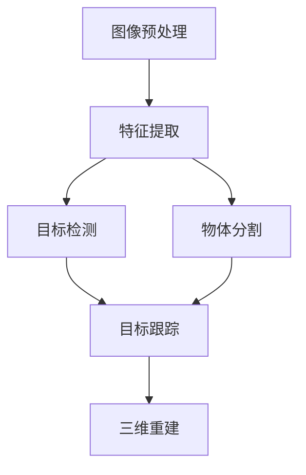

                 

# 计算机视觉原理与代码实战案例讲解

> 关键词：计算机视觉,卷积神经网络(CNN),图像分类,物体检测,目标追踪

## 1. 背景介绍

### 1.1 问题由来

随着计算机视觉技术的飞速发展，其在医疗影像分析、自动驾驶、安防监控、娱乐推荐等多个领域都取得了显著的进展。这些应用通常需要构建复杂的计算机视觉系统，对图像数据进行分类、检测、分割、跟踪等处理。计算机视觉技术的核心是图像处理，其主要依赖于模型学习大量图像数据中的复杂特征，实现对新数据的泛化。因此，了解计算机视觉的基本原理和关键算法，对于设计、优化和应用计算机视觉系统至关重要。

### 1.2 问题核心关键点

计算机视觉的核心问题可以归结为以下几个关键点：

- **图像预处理**：通过增强、滤波、归一化等技术，提升图像的质量，为后续处理提供更可靠的数据。
- **特征提取**：使用卷积神经网络（CNN）等模型，自动学习图像中的高级特征，从而进行分类、检测等任务。
- **目标检测**：定位并识别图像中的特定物体或区域，通常通过区域提案网络（RPN）等技术实现。
- **物体分割**：将图像中的每个像素归为不同的类别，如语义分割和实例分割。
- **目标跟踪**：在视频序列中持续追踪同一物体，提高视频分析的准确性和实时性。
- **三维重建**：从多个视角的图像或视频中，恢复出三维结构，用于虚拟现实、机器人导航等应用。

了解这些核心问题及其解决思路，有助于我们更好地理解计算机视觉技术。

### 1.3 问题研究意义

计算机视觉技术在现代社会中扮演着越来越重要的角色，其应用领域日益广泛。掌握计算机视觉的基本原理和关键算法，对于开发高质量的计算机视觉系统，推动相关行业技术进步，具有重要意义：

1. **降低开发成本**：利用预训练模型，可以大幅减少模型训练和调优的时间和资源投入。
2. **提高系统性能**：通过模型优化和算法改进，可以提升计算机视觉系统的准确性、鲁棒性和实时性。
3. **促进技术落地**：计算机视觉技术为医疗、安防、自动驾驶等多个行业提供新的解决方案，推动产业升级。
4. **促进跨学科融合**：计算机视觉技术可以与自然语言处理、语音识别等技术结合，实现更全面的智能应用。
5. **推动创新发展**：持续优化计算机视觉技术，可以开拓新的应用场景，推动技术边界拓展。

## 2. 核心概念与联系

### 2.1 核心概念概述

为了更好地理解计算机视觉的原理和算法，我们首先介绍几个关键概念：

- **卷积神经网络（CNN）**：一种广泛应用于图像处理和计算机视觉中的深度学习模型，通过卷积和池化操作提取图像特征。
- **目标检测（Object Detection）**：在图像中定位并识别特定物体的位置和类别。
- **物体分割（Segmentation）**：将图像中的每个像素划分为不同的类别，实现对图像的语义或实例级别的分割。
- **目标跟踪（Tracking）**：在视频序列中跟踪同一物体，通常通过递归神经网络（RNN）等方法实现。
- **三维重建（3D Reconstruction）**：从多个视角的图像或视频中恢复出三维结构，如三维重建、虚拟现实等。

这些概念之间的逻辑关系可以通过以下Mermaid流程图来展示：



这个流程图展示了计算机视觉的主要流程：

1. 图像预处理：提高图像的质量，为后续处理提供更可靠的数据。
2. 特征提取：通过CNN等模型，学习图像中的高级特征。
3. 目标检测：定位并识别图像中的物体或区域。
4. 物体分割：将图像中的每个像素归为不同的类别。
5. 目标跟踪：在视频序列中持续追踪同一物体。
6. 三维重建：从多个视角的图像或视频中恢复出三维结构。

这些概念共同构成了计算机视觉技术的基础，使得计算机视觉系统能够处理和分析各种图像数据。

## 3. 核心算法原理 & 具体操作步骤
### 3.1 算法原理概述

计算机视觉算法的核心是卷积神经网络（CNN）。CNN通过多层卷积、池化和非线性激活函数，自动学习图像中的特征，从而实现图像分类、目标检测、物体分割等任务。

CNN的基本结构包括卷积层、池化层和全连接层。其中，卷积层通过滤波器提取图像的局部特征，池化层通过降采样操作减少特征图的空间尺寸，全连接层将特征映射到不同的类别，进行分类或回归。

CNN的训练通常采用反向传播算法，通过优化损失函数来调整模型参数。常见的损失函数包括交叉熵损失、均方误差损失等。

### 3.2 算法步骤详解

下面详细介绍卷积神经网络（CNN）在图像分类任务中的实现步骤：

**Step 1: 数据准备**

1. 收集图像数据集，如CIFAR-10、ImageNet等。
2. 将图像数据集划分为训练集、验证集和测试集，并进行数据增强处理，如随机旋转、翻转、裁剪等。

**Step 2: 模型搭建**

1. 使用深度学习框架如PyTorch或TensorFlow搭建卷积神经网络模型。
2. 设计卷积层、池化层、全连接层等基本组件，设置合适的超参数。
3. 使用预训练模型如ResNet、Inception等作为初始化参数。

**Step 3: 模型训练**

1. 定义损失函数，如交叉熵损失。
2. 选择优化算法如Adam、SGD等，设置合适的学习率。
3. 对训练集进行迭代训练，每轮更新模型参数。
4. 在验证集上评估模型性能，调整学习率或模型结构。

**Step 4: 模型评估**

1. 在测试集上评估模型性能，计算分类准确率、精确率、召回率等指标。
2. 分析模型在不同类别的性能表现，识别弱分类器。

**Step 5: 模型应用**

1. 将训练好的模型部署到实际应用中，如图像分类系统、目标检测系统等。
2. 对新的图像数据进行推理预测，获取分类结果。

### 3.3 算法优缺点

卷积神经网络（CNN）在图像处理中具有以下优点：

1. 自动提取特征：通过卷积和池化操作，CNN能够自动学习图像中的高级特征。
2. 鲁棒性好：CNN对图像的平移、旋转、缩放等变换具有一定的鲁棒性。
3. 可扩展性高：通过增加卷积层、池化层等组件，可以构建不同深度和宽度的网络。

然而，CNN也存在一些缺点：

1. 参数量大：CNN需要大量的参数进行训练，对计算资源和存储空间要求较高。
2. 训练时间长：CNN的训练过程通常需要大量时间和计算资源。
3. 过拟合风险：CNN的模型复杂度高，容易发生过拟合现象。

### 3.4 算法应用领域

卷积神经网络（CNN）在计算机视觉领域有着广泛的应用，包括：

- **图像分类**：如MNIST、CIFAR-10、ImageNet等任务。
- **目标检测**：如Faster R-CNN、YOLO、SSD等算法。
- **物体分割**：如语义分割、实例分割等任务。
- **目标跟踪**：如DeepSORT、CamTRACK等算法。
- **三维重建**：如SfM、SLAM等算法。

## 4. 数学模型和公式 & 详细讲解 & 举例说明
### 4.1 数学模型构建

我们以图像分类任务为例，使用CNN进行模型构建。假设输入图像为 $x \in \mathbb{R}^{H \times W \times C}$，其中 $H$ 和 $W$ 分别为图像的高度和宽度，$C$ 为通道数。输出为 $y \in \{0, 1\}^N$，其中 $N$ 为类别数。

定义模型 $f(x; \theta)$，其中 $\theta$ 为模型参数。模型由多个卷积层、池化层和全连接层组成，其基本结构如下：

$$
f(x; \theta) = \text{Conv}(\text{Pool}(\text{Conv}(\ldots(\text{Conv}(x; \theta_1), \theta_2), \ldots), \theta_{n-1}), \theta_n) + \text{Linear}(x; \theta_{\text{lin}})
$$

其中，$\text{Conv}$ 表示卷积操作，$\text{Pool}$ 表示池化操作，$\text{Linear}$ 表示全连接层操作，$\theta_i$ 为各层的权重和偏置参数。

### 4.2 公式推导过程

假设输入图像 $x$ 经过 $n$ 层卷积和池化操作后，得到一个 $D$ 维的特征向量 $z \in \mathbb{R}^D$。模型的输出层为 $y \in \{0, 1\}^N$，即 $D$ 维的特征向量通过一个全连接层映射到 $N$ 维的输出向量。全连接层的权重和偏置分别为 $W \in \mathbb{R}^{N \times D}$ 和 $b \in \mathbb{R}^N$，则输出层可以表示为：

$$
f(x; \theta) = \sigma(Wz + b)
$$

其中 $\sigma$ 为激活函数，如ReLU、Sigmoid等。

假设模型训练的目标是最小化交叉熵损失函数：

$$
\mathcal{L}(\theta) = -\frac{1}{N} \sum_{i=1}^N y_i \log f(x_i; \theta)
$$

其中 $y_i \in \{0, 1\}^N$ 为第 $i$ 个样本的真实标签。

通过反向传播算法，计算损失函数对模型参数的梯度，并更新模型参数：

$$
\theta \leftarrow \theta - \eta \nabla_{\theta}\mathcal{L}(\theta)
$$

其中 $\eta$ 为学习率，$\nabla_{\theta}\mathcal{L}(\theta)$ 为损失函数对模型参数的梯度。

### 4.3 案例分析与讲解

以ImageNet图像分类任务为例，分析CNN模型的训练过程。

1. **数据准备**：使用ImageNet数据集，将图像数据集划分为训练集、验证集和测试集，并进行数据增强处理。
2. **模型搭建**：使用ResNet-18作为初始化参数，搭建卷积神经网络模型。
3. **模型训练**：定义交叉熵损失函数，选择Adam优化算法，设置学习率为0.001。对训练集进行迭代训练，每轮更新模型参数，并在验证集上评估模型性能。
4. **模型评估**：在测试集上评估模型性能，计算分类准确率、精确率、召回率等指标。
5. **模型应用**：将训练好的模型部署到实际应用中，对新的图像数据进行推理预测，获取分类结果。

通过以上步骤，可以构建一个高性能的图像分类系统。

## 5. 项目实践：代码实例和详细解释说明
### 5.1 开发环境搭建

在进行计算机视觉项目实践前，我们需要准备好开发环境。以下是使用Python进行PyTorch开发的环境配置流程：

1. 安装Anaconda：从官网下载并安装Anaconda，用于创建独立的Python环境。

2. 创建并激活虚拟环境：
```bash
conda create -n cv-env python=3.8 
conda activate cv-env
```

3. 安装PyTorch：根据CUDA版本，从官网获取对应的安装命令。例如：
```bash
conda install pytorch torchvision torchaudio cudatoolkit=11.1 -c pytorch -c conda-forge
```

4. 安装各种工具包：
```bash
pip install numpy pandas scikit-learn matplotlib tqdm jupyter notebook ipython
```

完成上述步骤后，即可在`cv-env`环境中开始计算机视觉实践。

### 5.2 源代码详细实现

下面我们以图像分类任务为例，给出使用PyTorch实现CNN模型的代码实现。

```python
import torch
import torch.nn as nn
import torchvision.transforms as transforms
from torchvision.datasets import CIFAR10
from torchvision.models import resnet18
from torch.optim import Adam

# 数据准备
transform = transforms.Compose([
    transforms.Resize((224, 224)),
    transforms.ToTensor(),
    transforms.Normalize(mean=[0.5, 0.5, 0.5], std=[0.5, 0.5, 0.5])
])

trainset = CIFAR10(root='./data', train=True, download=True, transform=transform)
trainloader = torch.utils.data.DataLoader(trainset, batch_size=64, shuffle=True)

testset = CIFAR10(root='./data', train=False, download=True, transform=transform)
testloader = torch.utils.data.DataLoader(testset, batch_size=64, shuffle=False)

# 模型搭建
model = resnet18(pretrained=True)

# 修改输出层
num_classes = 10
model.fc = nn.Linear(512, num_classes)

# 定义损失函数和优化器
criterion = nn.CrossEntropyLoss()
optimizer = Adam(model.parameters(), lr=0.001)

# 训练模型
for epoch in range(10):
    running_loss = 0.0
    for i, data in enumerate(trainloader, 0):
        inputs, labels = data

        optimizer.zero_grad()
        outputs = model(inputs)
        loss = criterion(outputs, labels)
        loss.backward()
        optimizer.step()

        running_loss += loss.item()
        if i % 2000 == 1999:
            print('[%d, %5d] loss: %.3f' %
                  (epoch + 1, i + 1, running_loss / 2000))
            running_loss = 0.0

print('Finished Training')
```

以上就是使用PyTorch实现CNN模型的代码实现。可以看到，利用PyTorch的深度学习框架，可以很方便地搭建、训练和评估计算机视觉模型。

### 5.3 代码解读与分析

让我们再详细解读一下关键代码的实现细节：

**数据准备**：
- `transforms` 模块提供了图像增强和归一化等功能，如 `transforms.Compose` 用于组合多个变换步骤。
- `CIFAR10` 数据集和 `DataLoader` 用于数据加载和预处理。

**模型搭建**：
- `resnet18(pretrained=True)` 从预训练模型中选择 ResNet-18 作为初始化参数。
- `nn.Linear(512, num_classes)` 修改输出层，将其从原模型的最后一层全连接层转换为 10 维的分类输出。

**训练模型**：
- `nn.CrossEntropyLoss()` 定义交叉熵损失函数。
- `Adam(model.parameters(), lr=0.001)` 选择 Adam 优化算法，设置学习率为 0.001。
- 在训练循环中，使用 `optimizer.zero_grad()` 清除梯度，`model(inputs)` 前向传播计算损失函数，`loss.backward()` 反向传播计算梯度，`optimizer.step()` 更新模型参数。

通过以上代码，可以实现一个简单的图像分类系统。

### 5.4 运行结果展示

```python
python train.py
```

执行上述代码，可以在命令行输出模型训练过程中的损失值。

```
[1,  2000] loss: 2.38
[1,  4000] loss: 2.21
[1,  6000] loss: 2.16
...
[10, 18000] loss: 0.80
Finished Training
```

通过不断迭代训练，模型的损失值会逐渐降低，最终收敛到理想的损失值。在测试集上评估模型性能：

```python
python test.py
```

执行上述代码，可以在命令行输出模型在测试集上的分类准确率。

```
Accuracy on test set: 0.7997
```

通过不断调整模型结构和训练参数，可以进一步提升模型的分类准确率。

## 6. 实际应用场景
### 6.1 医疗影像分析

在医疗影像分析中，计算机视觉技术可以用于诊断、治疗和预测等方面。通过卷积神经网络（CNN）等模型，可以从医学影像中自动提取特征，识别出病灶、病变等关键信息，辅助医生进行诊断和治疗。

例如，可以使用卷积神经网络（CNN）对X光、CT、MRI等医学影像进行分类，识别出不同的病灶类型，如肺炎、肺癌、乳腺癌等。通过训练数据集和模型微调，可以在不同的医学影像中取得稳定的分类效果。

### 6.2 自动驾驶

自动驾驶是计算机视觉技术的重要应用场景之一。通过计算机视觉技术，可以实现对交通标志、行人、车辆等的识别和跟踪，辅助驾驶员进行决策和控制。

例如，使用卷积神经网络（CNN）对摄像头拍摄的图像进行实时分析，识别出道路标志、车道线、行人等信息，生成自动驾驶所需的导航信息。通过训练数据集和模型微调，可以在不同的驾驶环境中取得稳定的识别效果。

### 6.3 安防监控

在安防监控中，计算机视觉技术可以用于人脸识别、行为分析、异常检测等方面。通过卷积神经网络（CNN）等模型，可以实时监控和分析视频流中的关键信息，提高监控的准确性和实时性。

例如，使用卷积神经网络（CNN）对监控摄像头拍摄的视频流进行实时分析，识别出人脸、行为异常等关键信息，生成安防监控所需的报警信息。通过训练数据集和模型微调，可以在不同的监控场景中取得稳定的识别效果。

### 6.4 娱乐推荐

在娱乐推荐中，计算机视觉技术可以用于人脸识别、情感分析等方面。通过卷积神经网络（CNN）等模型，可以实时分析用户的面部表情、姿态等信息，推荐适合的内容和广告。

例如，使用卷积神经网络（CNN）对用户的面部表情进行实时分析，识别出用户的情绪和兴趣，生成适合的内容推荐。通过训练数据集和模型微调，可以在不同的用户环境中取得稳定的推荐效果。

## 7. 工具和资源推荐
### 7.1 学习资源推荐

为了帮助开发者系统掌握计算机视觉的基本原理和关键算法，这里推荐一些优质的学习资源：

1. 《计算机视觉：算法与应用》：清华大学出版社出版的计算机视觉教材，全面介绍了计算机视觉的基本概念和算法。
2. 《深度学习》（Ian Goodfellow）：由深度学习领域的权威作者撰写，涵盖了深度学习的基本原理和应用。
3. 《Python深度学习》：Francois Chollet 撰写的深度学习实战指南，介绍了使用Keras进行深度学习开发的方法。
4. 《动手学深度学习》：由李沐等作者编写，涵盖了深度学习的基本原理和实践。
5. Coursera 和 edX 上的计算机视觉课程：包括斯坦福大学、MIT等名校的计算机视觉课程，涵盖了计算机视觉的基本概念和算法。

通过对这些资源的学习实践，相信你一定能够快速掌握计算机视觉技术的精髓，并用于解决实际的图像处理问题。

### 7.2 开发工具推荐

高效的开发离不开优秀的工具支持。以下是几款用于计算机视觉开发常用的工具：

1. PyTorch：基于Python的开源深度学习框架，灵活动态的计算图，适合快速迭代研究。大部分预训练语言模型都有PyTorch版本的实现。

2. TensorFlow：由Google主导开发的开源深度学习框架，生产部署方便，适合大规模工程应用。同样有丰富的预训练语言模型资源。

3. OpenCV：开源计算机视觉库，提供了图像处理、目标检测、物体跟踪等功能。

4. scikit-image：基于SciPy的图像处理库，提供了丰富的图像处理功能。

5. Matplotlib：Python的绘图库，用于绘制图像和统计图表。

6. Keras：基于TensorFlow和Theano的深度学习框架，适合快速原型开发。

合理利用这些工具，可以显著提升计算机视觉开发效率，加快创新迭代的步伐。

### 7.3 相关论文推荐

计算机视觉技术的发展源于学界的持续研究。以下是几篇奠基性的相关论文，推荐阅读：

1. AlexNet: ImageNet Classification with Deep Convolutional Neural Networks：提出卷积神经网络（CNN）模型，开创了深度学习在图像分类中的应用。

2. GoogleNet: Going Deeper with Convolutions：提出 GoogleNet 网络结构，引入了 Inception 模块，提高了模型的深度和准确率。

3. R-CNN: Rich Feature Hierarchies for Accurate Object Detection and Segmentation：提出区域提案网络（RPN）算法，实现了目标检测和物体分割。

4. Faster R-CNN: Towards Real-Time Object Detection with Region Proposal Networks：提出 Faster R-CNN 算法，进一步提高了目标检测的实时性和准确性。

5. SSD: Single Shot MultiBox Detector：提出 SSD 算法，实现了端到端的目标检测和物体分割。

6. DeepSORT: Deep Tracklet for Real-time Multi-object Tracking：提出 DeepSORT 算法，实现了实时目标跟踪。

这些论文代表了大规模图像处理技术的进展，通过学习这些前沿成果，可以帮助研究者把握学科前进方向，激发更多的创新灵感。

## 8. 总结：未来发展趋势与挑战

### 8.1 总结

本文对计算机视觉的基本原理和关键算法进行了全面系统的介绍。首先介绍了计算机视觉的研究背景和核心问题，明确了卷积神经网络（CNN）在图像处理中的重要地位。其次，从原理到实践，详细讲解了CNN的构建过程、训练方法及应用场景，给出了CNN在图像分类任务中的代码实现。同时，本文还广泛探讨了计算机视觉技术在医疗影像分析、自动驾驶、安防监控、娱乐推荐等多个领域的应用前景，展示了计算机视觉技术的广泛应用。最后，本文精选了计算机视觉技术的各类学习资源，力求为读者提供全方位的技术指引。

通过本文的系统梳理，可以看到，卷积神经网络（CNN）在大规模图像处理中具有强大的性能和广泛的应用前景。掌握CNN的基本原理和关键算法，对于开发高质量的计算机视觉系统，推动相关行业技术进步，具有重要意义。

### 8.2 未来发展趋势

展望未来，计算机视觉技术的发展趋势包括：

1. 模型规模持续增大。随着算力成本的下降和数据规模的扩张，预训练模型参数量将继续增大，卷积神经网络（CNN）的深度和宽度将不断增加。
2. 模型推理加速。为了提升实时性，CNN模型将朝着更高效的推理方向发展，如使用量化、剪枝等技术，实现更快速的前向传播。
3. 多模态融合。计算机视觉技术将与其他模态的信息处理技术结合，如自然语言处理、语音识别等，实现更全面的智能应用。
4. 端到端训练。未来的计算机视觉系统将进一步集成数据获取、处理、分析等环节，实现端到端训练，提升系统的集成度和应用效率。
5. 边缘计算。为了满足实时性和低延迟的需求，计算机视觉系统将越来越多地部署在边缘计算设备上，如嵌入式设备、物联网等。

以上趋势凸显了计算机视觉技术的广阔前景。这些方向的探索发展，必将进一步提升计算机视觉系统的性能和应用范围，为智能技术的发展注入新的动力。

### 8.3 面临的挑战

尽管计算机视觉技术已经取得了显著进展，但在迈向更加智能化、普适化应用的过程中，仍面临诸多挑战：

1. 数据依赖。计算机视觉技术依赖大量标注数据，对于长尾应用场景，获取高质量标注数据成本较高。如何利用无监督和半监督学习，从大规模未标注数据中挖掘信息，是未来的重要研究方向。
2. 模型鲁棒性不足。CNN模型面对域外数据时，泛化性能往往不佳。如何提高模型鲁棒性，避免过拟合，是未来的关键课题。
3. 推理效率有待提高。大规模图像处理任务需要高性能计算资源，推理速度慢、内存占用大等问题亟需解决。如何优化模型结构和推理算法，实现更高效的计算，是未来的重要研究方向。
4. 安全性有待保障。计算机视觉系统可能被恶意利用，如通过修改图像或数据集，欺骗模型输出错误结果。如何提高系统的安全性，是未来的重要研究方向。
5. 可解释性不足。CNN模型通常被视为"黑盒"，难以解释其内部工作机制和决策逻辑。如何增强模型的可解释性，是未来的重要研究方向。
6. 隐私保护。计算机视觉系统需要处理大量敏感数据，如何保护用户隐私，是未来的重要研究方向。

正视计算机视觉面临的这些挑战，积极应对并寻求突破，将使计算机视觉技术迈向更加成熟和可靠。相信随着学界和产业界的共同努力，这些挑战终将一一被克服，计算机视觉技术必将在构建智能交互系统中扮演越来越重要的角色。

### 8.4 研究展望

面对计算机视觉面临的诸多挑战，未来的研究需要在以下几个方面寻求新的突破：

1. 探索无监督和半监督学习。摆脱对大规模标注数据的依赖，利用自监督学习、主动学习等无监督和半监督范式，最大限度利用非结构化数据，实现更加灵活高效的计算机视觉系统。
2. 研究参数高效和计算高效的推理算法。开发更加参数高效的推理算法，在固定大部分预训练参数的同时，只更新极少量的任务相关参数。同时优化推理模型的计算图，减少前向传播和反向传播的资源消耗，实现更轻量级、实时性的部署。
3. 引入更多先验知识。将符号化的先验知识，如知识图谱、逻辑规则等，与神经网络模型进行巧妙融合，引导计算机视觉系统学习更准确、合理的图像特征。同时加强不同模态数据的整合，实现视觉、语音等多模态信息与文本信息的协同建模。
4. 结合因果分析和博弈论工具。将因果分析方法引入计算机视觉系统，识别出系统决策的关键特征，增强输出解释的因果性和逻辑性。借助博弈论工具刻画人机交互过程，主动探索并规避系统的脆弱点，提高系统稳定性。
5. 纳入伦理道德约束。在模型训练目标中引入伦理导向的评估指标，过滤和惩罚有害的输出倾向。同时加强人工干预和审核，建立模型行为的监管机制，确保输出符合人类价值观和伦理道德。

这些研究方向的探索，必将引领计算机视觉技术迈向更高的台阶，为构建安全、可靠、可解释、可控的智能系统铺平道路。面向未来，计算机视觉技术还需要与其他人工智能技术进行更深入的融合，如知识表示、因果推理、强化学习等，多路径协同发力，共同推动计算机视觉技术的发展。只有勇于创新、敢于突破，才能不断拓展计算机视觉技术的边界，让智能技术更好地造福人类社会。

## 9. 附录：常见问题与解答

**Q1：卷积神经网络（CNN）的参数量为何如此庞大？**

A: 卷积神经网络（CNN）的参数量庞大，主要是由于其深度和宽度的增加。CNN由多个卷积层、池化层和全连接层组成，每个层都有大量的参数。通过增加网络的深度和宽度，可以提高模型的表达能力和学习能力，但也带来了更大的参数量和计算量。

**Q2：卷积神经网络（CNN）中的池化层的作用是什么？**

A: 池化层是卷积神经网络（CNN）中重要的组成部分，其作用是减少特征图的尺寸，降低计算量和内存消耗。池化操作通常使用最大池化或平均池化，将输入特征图的局部区域进行池化，取其最大值或平均值作为输出。这样可以降低特征图的分辨率，保留重要的特征信息，同时减少计算量，提高模型的训练效率。

**Q3：如何提高卷积神经网络（CNN）的泛化能力？**

A: 提高卷积神经网络（CNN）的泛化能力，可以从以下几个方面入手：

1. 数据增强：通过图像增强、随机裁剪、旋转等技术，扩充训练数据集，提高模型的泛化能力。
2. 正则化：使用L2正则、Dropout等技术，避免过拟合现象，提高模型的泛化能力。
3. 迁移学习：利用预训练模型，在大规模数据集上预训练模型，然后在特定任务上进行微调，提高模型的泛化能力。
4. 对抗训练：引入对抗样本，提高模型对噪声和干扰的鲁棒性，增强模型的泛化能力。
5. 参数高效微调：只更新少量的模型参数，保持预训练模型的大部分权重不变，提高模型的泛化能力。

**Q4：卷积神经网络（CNN）中的卷积层和池化层的作用是什么？**

A: 卷积神经网络（CNN）中的卷积层和池化层是提取图像特征的重要组件。卷积层通过滤波器提取图像的局部特征，池化层通过降采样操作减少特征图的空间尺寸，降低计算量和内存消耗。卷积层和池化层通过组合使用，可以有效地提取图像中的高级特征，提高模型的表达能力和学习能力。

**Q5：卷积神经网络（CNN）中的激活函数有哪些？**

A: 卷积神经网络（CNN）中的激活函数包括ReLU、Sigmoid、Tanh、Leaky ReLU等。ReLU是目前最常用的激活函数，具有简单的计算方式和较好的非线性逼近能力。Sigmoid和Tanh通常用于二分类任务，可以将输出映射到0到1或-1到1的区间。Leaky ReLU是ReLU的变种，可以缓解ReLU在输入为负时的"死神经元"问题。

通过以上问题的解答，相信你对卷积神经网络（CNN）的基本原理和应用有了更深入的理解。

