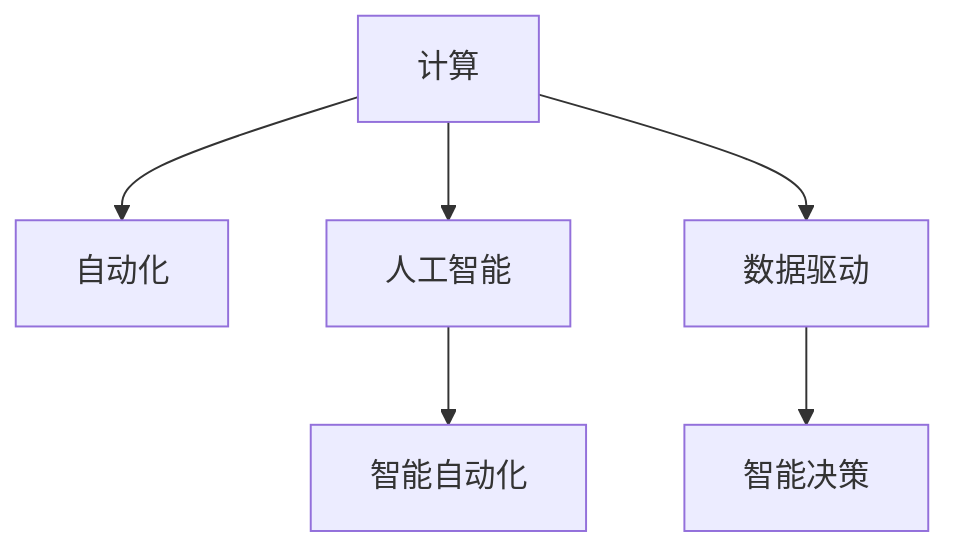

                 

# 计算的本质与自动化的未来

在21世纪的数字浪潮中，计算技术正以超乎想象的速度向前推进。从最初简单的算术运算，到复杂的机器学习算法，计算的界限正在被不断扩展。与此同时，自动化技术也在各行各业中得到广泛应用，从制造业到金融业，从医疗健康到教育，自动化已经成为推动社会发展的重要力量。本文将深入探讨计算与自动化的本质，展望未来的发展趋势与挑战，旨在为计算技术的未来发展提供参考。

## 1. 背景介绍

### 1.1 计算技术的演进

计算技术的演进经历了多个阶段，从早期的机械计算到电子计算机的诞生，再到互联网的普及，计算技术已经在各个领域发挥着重要作用。20世纪50年代，计算机科学家Alan Turing提出了图灵机的概念，奠定了现代计算机科学的基础。随着时间的推移，计算机性能不断提升，体积不断缩小，计算应用的范围和深度也在不断扩大。

### 1.2 自动化技术的崛起

自动化技术是指通过智能机器、软件工具等手段，代替或辅助人工完成各种任务的技术。20世纪中叶以来，自动化技术在制造业中得到广泛应用，显著提高了生产效率。进入21世纪，随着AI技术的快速发展，自动化技术在更多领域中得到应用，提升了整体社会的运行效率。

## 2. 核心概念与联系

### 2.1 核心概念概述

为了深入理解计算与自动化的本质，本节将介绍几个关键概念：

- 计算：指通过程序或算法对输入数据进行处理，以获得期望的输出结果。计算可以简单到加减乘除，也可以复杂到深度学习、机器学习等高级算法。

- 自动化：通过智能机器、软件工具等手段，自动完成各种任务，从而减少人工干预，提升效率和质量。自动化包括工业自动化、金融自动化、智能机器人等。

- 计算与自动化的融合：随着计算技术的发展，自动化系统逐渐由简单的机械操作转变为复杂的智能化操作。计算与自动化的融合，使得自动化系统能够通过数据分析、模型训练等手段，进一步提升其智能化水平。

这些概念之间的联系可以通过以下Mermaid流程图来展示：



这个流程图展示了计算技术如何通过数据驱动和人工智能，推动自动化的智能化发展。

## 3. 核心算法原理 & 具体操作步骤

### 3.1 算法原理概述

计算与自动化的核心原理是算法与数据驱动。算法是指通过一系列规则或步骤，对输入数据进行处理，以获得期望的输出结果。而数据驱动则是指在自动化系统中，通过数据收集、分析和训练，提升系统的智能化水平，使其能够自动完成复杂的任务。

在计算与自动化融合的今天，算法和数据驱动的技术已经广泛应用于各个领域，如图像识别、自然语言处理、智能推荐等。这些技术不仅提高了自动化系统的智能化水平，还为计算技术的发展提供了新的方向和应用场景。

### 3.2 算法步骤详解

计算与自动化的核心算法步骤包括以下几个关键环节：

1. 数据采集：通过传感器、网络、数据库等手段，收集各种数据，为自动化系统的决策提供基础。

2. 数据预处理：对收集到的数据进行清洗、归一化、特征提取等处理，为后续的算法应用提供可靠的数据基础。

3. 模型训练：使用机器学习算法对预处理后的数据进行训练，生成模型。模型训练的目的是使算法能够根据输入数据自动进行决策和预测。

4. 模型部署：将训练好的模型应用到实际的自动化系统中，进行实时处理和决策。

5. 模型优化：根据实际应用效果，不断优化模型参数和算法，提升系统的性能和可靠性。

### 3.3 算法优缺点

计算与自动化的融合，带来了许多优势，但也存在一些缺点：

优点包括：

- 效率提升：自动化系统通过算法和数据驱动，能够大幅提升处理效率，减少人工干预。

- 决策科学化：通过数据驱动和模型训练，自动化系统的决策过程更加科学和客观。

- 成本节约：自动化系统可以减少人工成本，提升经济效益。

缺点包括：

- 技术门槛高：自动化系统需要复杂的算法和数据处理技术，对技术门槛要求较高。

- 数据质量问题：自动化系统依赖于高质量的数据，数据采集和处理环节容易出现误差，影响系统性能。

- 安全风险：自动化系统的决策过程透明性较差，可能存在被黑客攻击的风险。

### 3.4 算法应用领域

计算与自动化的融合，已经在多个领域中得到广泛应用，具体包括：

- 制造业：通过自动化生产线和机器人，提升生产效率和质量。

- 金融业：通过智能风控和自动化交易系统，提升金融服务的效率和安全性。

- 医疗健康：通过智能诊断和自动化治疗系统，提升医疗服务的质量和可及性。

- 物流配送：通过自动化仓储和配送系统，提升物流效率和准确性。

- 教育：通过智能辅导和自动化评估系统，提升教育质量和个性化水平。

这些应用场景展示了计算与自动化的巨大潜力，未来还将拓展到更多领域。

## 4. 数学模型和公式 & 详细讲解 & 举例说明

### 4.1 数学模型构建

计算与自动化的数学模型通常包括输入数据、模型参数、目标函数和损失函数等组成部分。以图像识别为例，一个简单的数学模型可以表示为：

$$y=f(x;\theta)$$

其中，$x$表示输入数据，$\theta$表示模型参数，$f(x;\theta)$表示模型的输出结果。在图像识别中，$x$是图像像素数据，$f(x;\theta)$是卷积神经网络模型输出的特征表示，$y$是图像标签。

### 4.2 公式推导过程

以图像识别为例，常用的卷积神经网络模型包括卷积层、池化层和全连接层等。其推导过程如下：

1. 卷积层：对输入数据进行卷积操作，提取图像特征。卷积操作可以表示为：

$$y=f(x;\theta)=\sum_k w_k * x_k$$

其中，$w_k$表示卷积核，$x_k$表示输入数据的子窗口。

2. 池化层：对卷积层输出的特征进行下采样，减少计算量。常用的池化操作包括最大池化和平均池化。最大池化可以表示为：

$$y=f(x;\theta)=\max_k x_k$$

3. 全连接层：将池化层输出的特征进行线性变换，生成最终的分类结果。全连接层可以表示为：

$$y=f(x;\theta)=\sum_k w_k x_k+b_k$$

其中，$w_k$表示权重，$b_k$表示偏置。

### 4.3 案例分析与讲解

以图像识别为例，使用预训练的ResNet模型进行微调。具体步骤如下：

1. 数据预处理：对图像数据进行归一化、随机裁剪、缩放等预处理，生成训练集和测试集。

2. 模型加载：加载预训练的ResNet模型，保留卷积层和池化层，微调全连接层。

3. 微调训练：使用训练集进行模型训练，调整全连接层的权重和偏置。

4. 测试评估：使用测试集对微调后的模型进行评估，输出分类准确率。

通过以上步骤，可以构建一个基本的图像识别系统，用于实际应用。

## 5. 项目实践：代码实例和详细解释说明

### 5.1 开发环境搭建

在进行计算与自动化实践前，需要准备开发环境。以下是使用Python进行TensorFlow开发的环境配置流程：

1. 安装Anaconda：从官网下载并安装Anaconda，用于创建独立的Python环境。

2. 创建并激活虚拟环境：
```bash
conda create -n tf-env python=3.8 
conda activate tf-env
```

3. 安装TensorFlow：根据CUDA版本，从官网获取对应的安装命令。例如：
```bash
conda install tensorflow==2.8.0
```

4. 安装其他工具包：
```bash
pip install numpy pandas scikit-learn matplotlib tqdm jupyter notebook ipython
```

完成上述步骤后，即可在`tf-env`环境中开始计算与自动化的实践。

### 5.2 源代码详细实现

下面我们以图像识别为例，给出使用TensorFlow进行微调的PyTorch代码实现。

首先，定义数据处理函数：

```python
import tensorflow as tf
from tensorflow.keras.preprocessing.image import ImageDataGenerator

train_datagen = ImageDataGenerator(
    rescale=1./255,
    shear_range=0.2,
    zoom_range=0.2,
    horizontal_flip=True)
test_datagen = ImageDataGenerator(rescale=1./255)

train_generator = train_datagen.flow_from_directory(
    'train_dir',
    target_size=(224, 224),
    batch_size=32,
    class_mode='binary')
test_generator = test_datagen.flow_from_directory(
    'test_dir',
    target_size=(224, 224),
    batch_size=32,
    class_mode='binary')
```

然后，定义模型和优化器：

```python
from tensorflow.keras import layers, models

model = models.Sequential([
    layers.Conv2D(32, (3,3), activation='relu', input_shape=(224, 224, 3)),
    layers.MaxPooling2D((2,2)),
    layers.Conv2D(64, (3,3), activation='relu'),
    layers.MaxPooling2D((2,2)),
    layers.Conv2D(128, (3,3), activation='relu'),
    layers.MaxPooling2D((2,2)),
    layers.Flatten(),
    layers.Dense(64, activation='relu'),
    layers.Dense(1, activation='sigmoid')
])

model.compile(
    optimizer=tf.keras.optimizers.Adam(learning_rate=0.001),
    loss='binary_crossentropy',
    metrics=['accuracy'])

```

接着，定义训练和评估函数：

```python
from tensorflow.keras.callbacks import EarlyStopping

early_stopping = EarlyStopping(monitor='val_loss', patience=10)

model.fit(
    train_generator,
    steps_per_epoch=train_generator.n // train_generator.batch_size,
    validation_data=test_generator,
    validation_steps=test_generator.n // test_generator.batch_size,
    epochs=50,
    callbacks=[early_stopping])
```

最后，启动训练流程并在测试集上评估：

```python
evaluation = model.evaluate(
    test_generator,
    steps=test_generator.n // test_generator.batch_size)
print(f'Test loss: {evaluation[0]:.4f}')
print(f'Test accuracy: {evaluation[1]*100:.2f}%')
```

以上就是使用TensorFlow进行图像识别任务微调的完整代码实现。可以看到，TensorFlow提供了丰富的API和工具，使得计算与自动化任务的开发变得简洁高效。

### 5.3 代码解读与分析

让我们再详细解读一下关键代码的实现细节：

**数据处理函数**：
- `ImageDataGenerator`类：用于生成标准化、增强化的图像数据，包括数据预处理、图像增强等功能。
- `flow_from_directory`方法：从指定目录下加载图像数据，自动进行数据生成和预处理。

**模型和优化器**：
- `Sequential`类：用于构建序列化的模型，依次添加卷积层、池化层、全连接层等组件。
- `Conv2D`和`MaxPooling2D`层：分别用于卷积和池化操作，提取图像特征。
- `Flatten`层：用于将特征图转换为一维向量。
- `Dense`层：用于全连接操作，生成最终的分类结果。
- `Adam`优化器：用于优化模型参数，调整学习率等超参数。

**训练和评估函数**：
- `EarlyStopping`回调函数：用于监控训练过程中的验证损失，当损失不再下降时，停止训练。
- `fit`方法：对模型进行训练，使用训练数据生成训练集和验证集，通过epoch循环进行训练。
- `evaluate`方法：对模型进行评估，计算测试集的损失和精度，输出评估结果。

通过以上代码，我们成功构建了一个基本的图像识别系统，并进行了微调训练。可以看到，TensorFlow通过模块化的API设计，使得计算与自动化任务的开发变得更加直观和易于理解。

## 6. 实际应用场景

### 6.1 智能制造

计算与自动化在制造业中的应用，已经被广泛应用于智能制造领域。通过自动化生产线、机器人、智能仓储等技术，可以大幅提升制造业的生产效率和产品质量。例如，在汽车制造业中，通过使用机器人和自动化装配线，可以显著缩短生产周期，降低人工成本。

### 6.2 金融服务

在金融服务领域，计算与自动化技术主要用于风险控制、智能投顾、自动化交易等。通过智能风控模型和自动化交易系统，可以实时监测金融市场的动态，进行风险评估和交易决策。例如，使用深度学习算法对大量金融数据进行训练，可以构建预测模型，提前发现市场风险，采取相应措施，降低投资风险。

### 6.3 医疗健康

在医疗健康领域，计算与自动化技术主要用于智能诊断、自动化治疗、个性化医疗等。通过使用图像识别和自然语言处理技术，可以对医疗影像和病历进行自动化分析，提升诊断准确率。例如，使用卷积神经网络对医学影像进行训练，可以自动识别肿瘤、骨折等疾病。

### 6.4 智能交通

在智能交通领域，计算与自动化技术主要用于智能调度、自动驾驶、交通管理等。通过使用深度学习算法对交通数据进行训练，可以实现交通流量预测、事故预警等功能。例如，使用生成对抗网络对交通图像进行训练，可以实时监测交通状态，优化交通流量。

## 7. 工具和资源推荐

### 7.1 学习资源推荐

为了帮助开发者系统掌握计算与自动化的理论和实践，这里推荐一些优质的学习资源：

1. 《深度学习》系列书籍：由Yoshua Bengio、Ian Goodfellow、Aaron Courville合著，系统介绍了深度学习的基础理论和算法。

2. 《TensorFlow实战》书籍：由Cole Howard、Carson Schafer合著，介绍了TensorFlow的核心API和应用场景，适合快速上手TensorFlow开发。

3. 《计算机视觉：算法与应用》课程：斯坦福大学开设的计算机视觉课程，涵盖了图像处理、特征提取、深度学习等知识点。

4. Kaggle平台：一个全球数据科学竞赛平台，汇集了大量的数据集和竞赛项目，适合练习和验证算法效果。

5. GitHub代码库：一个全球性的代码托管平台，汇集了大量的开源项目和代码示例，适合学习和参考。

通过对这些资源的学习实践，相信你一定能够系统掌握计算与自动化的理论和实践，并用于解决实际的计算与自动化问题。

### 7.2 开发工具推荐

高效的开发离不开优秀的工具支持。以下是几款用于计算与自动化开发的常用工具：

1. TensorFlow：由Google主导开发的开源深度学习框架，生产部署方便，适合大规模工程应用。

2. PyTorch：基于Python的开源深度学习框架，灵活动态的计算图，适合快速迭代研究。

3. OpenCV：开源计算机视觉库，提供了大量的图像处理和计算机视觉功能，适合图像识别、目标检测等任务。

4. ROS：开源机器人操作系统，提供了丰富的机器人控制和数据处理功能，适合机器人自动化开发。

5. Jupyter Notebook：一个交互式笔记本环境，支持多种编程语言和数据可视化，适合科研和教学。

合理利用这些工具，可以显著提升计算与自动化任务的开发效率，加快创新迭代的步伐。

### 7.3 相关论文推荐

计算与自动化领域的发展，源于学界的持续研究。以下是几篇奠基性的相关论文，推荐阅读：

1. Deep Learning（深度学习）：由Yoshua Bengio、Ian Goodfellow、Aaron Courville合著，系统介绍了深度学习的基础理论和算法。

2. Computer Vision: Algorithms and Applications（计算机视觉：算法与应用）：由Richard Szeliski合著，介绍了计算机视觉的核心理论和算法。

3. Machine Learning Yearning（机器学习实践指南）：由Andrew Ng合著，介绍了机器学习的最佳实践和工程经验。

4. Natural Language Processing with Transformers（基于Transformers的自然语言处理）：由Jurafsky、Martins合著，介绍了Transformer在大规模自然语言处理任务中的应用。

5. Reinforcement Learning: An Introduction（强化学习：介绍）：由Richard Sutton、Andrew Barto合著，介绍了强化学习的基础理论和算法。

这些论文代表了大数据、深度学习和计算与自动化的发展脉络，阅读这些经典著作，可以更好地理解计算与自动化的本质和应用。

## 8. 总结：未来发展趋势与挑战

### 8.1 总结

本文对计算与自动化的本质和应用进行了全面系统的介绍。首先阐述了计算与自动化的演进历程，明确了其在各行各业中的重要作用。其次，从原理到实践，详细讲解了计算与自动化的数学模型和算法步骤，给出了实际应用场景和开发示例。最后，探讨了计算与自动化的未来发展趋势和面临的挑战，以期为计算技术的未来发展提供参考。

通过本文的系统梳理，可以看到，计算与自动化技术正在不断推动各行各业的变革，其应用前景广阔。计算与自动化技术的融合，使得自动化系统能够通过算法和数据驱动，实现高效、智能的操作。未来，伴随计算技术的持续进步，计算与自动化技术将在更多领域中得到应用，进一步提升社会的运行效率和智能化水平。

### 8.2 未来发展趋势

展望未来，计算与自动化技术将呈现以下几个发展趋势：

1. 智能化水平提升：随着深度学习和人工智能技术的不断进步，计算与自动化系统的智能化水平将不断提升。未来，基于人工智能的自动化系统将能够处理更加复杂、多变的数据，实现更加智能的决策和预测。

2. 数据驱动的决策：随着大数据和人工智能技术的普及，计算与自动化系统将更加依赖数据驱动的决策。数据采集、处理和分析将成为系统的核心组成部分，推动计算与自动化技术的发展。

3. 自动化技术普及：随着技术门槛的降低，计算与自动化技术将在更多领域中得到应用，提升各行各业的自动化水平，推动社会生产力的提升。

4. 人机协同的发展：未来，计算与自动化技术将更加注重人机协同，实现计算与人的深度互动。基于人工智能的自动化系统将能够与人类进行自然交互，提升用户体验和工作效率。

5. 计算与自动化的融合：计算与自动化技术的融合将不断深化，推动智能机器人和智能设备的发展。未来，基于计算与自动化技术的智能设备将更加普及，提升社会的智能化水平。

这些趋势展示了计算与自动化技术的巨大潜力，未来还将拓展到更多领域。

### 8.3 面临的挑战

尽管计算与自动化技术已经取得了瞩目成就，但在迈向更加智能化、普适化应用的过程中，它仍面临着诸多挑战：

1. 数据隐私问题：计算与自动化系统依赖大量数据，如何保护数据隐私和安全是一个重要问题。数据泄露和滥用可能带来严重的法律和道德风险。

2. 技术复杂性：计算与自动化系统需要复杂的算法和数据处理技术，对技术门槛要求较高。技术复杂性可能导致系统维护和升级的难度增加。

3. 安全性问题：计算与自动化系统面临的安全威胁不断增加，网络攻击和数据篡改等问题难以完全避免。系统安全性问题需要持续关注和应对。

4. 计算资源消耗：大规模计算与自动化系统需要大量计算资源，如何优化计算效率，降低资源消耗，是一个重要的研究方向。

5. 伦理和法律问题：计算与自动化系统可能带来伦理和法律问题，例如算法偏见、歧视等。如何在技术应用中遵循伦理和法律规范，是一个重要的挑战。

这些挑战需要技术界和产业界共同努力，才能推动计算与自动化技术的健康发展。

### 8.4 研究展望

未来，计算与自动化技术的研究方向可以从以下几个方面展开：

1. 计算与自动化融合：推动计算与自动化的深度融合，提升系统的智能化水平。结合深度学习、自然语言处理、计算机视觉等技术，构建更加智能的自动化系统。

2. 数据驱动的决策：通过大数据和人工智能技术，提升计算与自动化系统的决策能力。优化数据采集、处理和分析，提高系统的准确性和可靠性。

3. 人机协同：推动人机协同的发展，实现计算与自动化技术的自然交互。优化人机界面设计，提升用户体验和工作效率。

4. 计算资源优化：优化计算与自动化系统的资源消耗，降低资源成本。通过分布式计算、云计算等技术，提高系统的可扩展性和资源利用率。

5. 安全性提升：提升计算与自动化系统的安全性，防止网络攻击和数据篡改。结合密码学、安全协议等技术，保障系统的安全性。

这些研究方向展示了计算与自动化技术的未来发展方向，相信未来的研究将进一步推动计算与自动化技术的进步，为社会的智能化发展提供新的动力。

## 9. 附录：常见问题与解答

**Q1：计算与自动化融合的难点是什么？**

A: 计算与自动化融合的难点主要包括：

1. 数据质量问题：计算与自动化系统依赖大量数据，数据质量对系统性能有直接影响。数据采集和处理环节容易出现误差，影响系统性能。

2. 算法复杂性：计算与自动化系统需要复杂的算法和数据处理技术，对技术门槛要求较高。算法复杂性可能导致系统维护和升级的难度增加。

3. 安全性问题：计算与自动化系统面临的安全威胁不断增加，网络攻击和数据篡改等问题难以完全避免。系统安全性问题需要持续关注和应对。

**Q2：计算与自动化技术在医疗健康领域的应用前景是什么？**

A: 计算与自动化技术在医疗健康领域的应用前景非常广阔。具体包括：

1. 智能诊断：通过图像识别和自然语言处理技术，对医疗影像和病历进行自动化分析，提升诊断准确率。例如，使用卷积神经网络对医学影像进行训练，可以自动识别肿瘤、骨折等疾病。

2. 自动化治疗：通过智能机器人、自动化设备等技术，提升治疗的效率和精度。例如，使用手术机器人进行微创手术，可以显著降低手术风险和恢复时间。

3. 个性化医疗：通过数据分析和人工智能技术，实现个性化医疗。例如，使用深度学习算法对患者数据进行分析，制定个性化的治疗方案。

这些应用展示了计算与自动化技术在医疗健康领域的巨大潜力，未来还将拓展到更多医疗应用场景。

**Q3：如何提高计算与自动化系统的安全性？**

A: 提高计算与自动化系统的安全性可以从以下几个方面入手：

1. 数据加密：对数据进行加密处理，防止数据泄露和滥用。使用SSL/TLS协议等安全协议，保障数据传输的安全性。

2. 访问控制：对系统进行严格的访问控制，限制非法用户的访问权限。采用身份认证、授权管理等技术，保障系统的安全性。

3. 漏洞检测：定期进行漏洞检测和修复，防止系统安全漏洞被利用。使用安全扫描工具、漏洞分析工具等技术，及时发现和修复安全漏洞。

4. 安全协议：使用安全协议，如OAuth、OpenID等，保障数据传输和身份认证的安全性。

5. 安全培训：对系统开发者和管理人员进行安全培训，提高安全意识和技术水平，减少人为安全风险。

这些措施可以有效提升计算与自动化系统的安全性，保障系统的稳定运行。

**Q4：计算与自动化技术在制造业中的应用前景是什么？**

A: 计算与自动化技术在制造业中的应用前景非常广阔。具体包括：

1. 智能制造：通过自动化生产线、机器人、智能仓储等技术，提升制造业的生产效率和产品质量。例如，在汽车制造业中，通过使用机器人和自动化装配线，可以显著缩短生产周期，降低人工成本。

2. 质量控制：通过智能检测和监控系统，实时监测生产过程中的质量问题，及时进行调整。例如，使用图像识别技术对产品质量进行检测，提高产品质量和一致性。

3. 供应链管理：通过数据分析和人工智能技术，优化供应链管理。例如，使用预测模型对市场需求进行预测，优化库存管理和生产计划。

这些应用展示了计算与自动化技术在制造业领域的巨大潜力，未来还将拓展到更多制造应用场景。

**Q5：如何优化计算与自动化系统的计算资源消耗？**

A: 优化计算与自动化系统的计算资源消耗可以从以下几个方面入手：

1. 分布式计算：采用分布式计算技术，将计算任务分散到多个计算节点进行并行处理，提高计算效率和资源利用率。

2. 云计算：使用云计算平台，根据计算需求动态调整资源配置，提高资源利用率。例如，使用AWS、Azure等云平台，提供弹性计算资源。

3. 模型压缩：对计算模型进行压缩，减小模型大小和计算复杂度。例如，使用剪枝、量化等技术，减小模型参数和计算资源消耗。

4. 算法优化：优化算法结构和实现，减少计算资源消耗。例如，使用卷积神经网络代替全连接网络，减小计算复杂度。

5. 资源管理：优化资源管理策略，避免资源浪费和过载。例如，采用资源限制、负载均衡等技术，提升资源管理效率。

这些措施可以有效优化计算与自动化系统的计算资源消耗，提高系统的运行效率和稳定性。

---

作者：禅与计算机程序设计艺术 / Zen and the Art of Computer Programming

